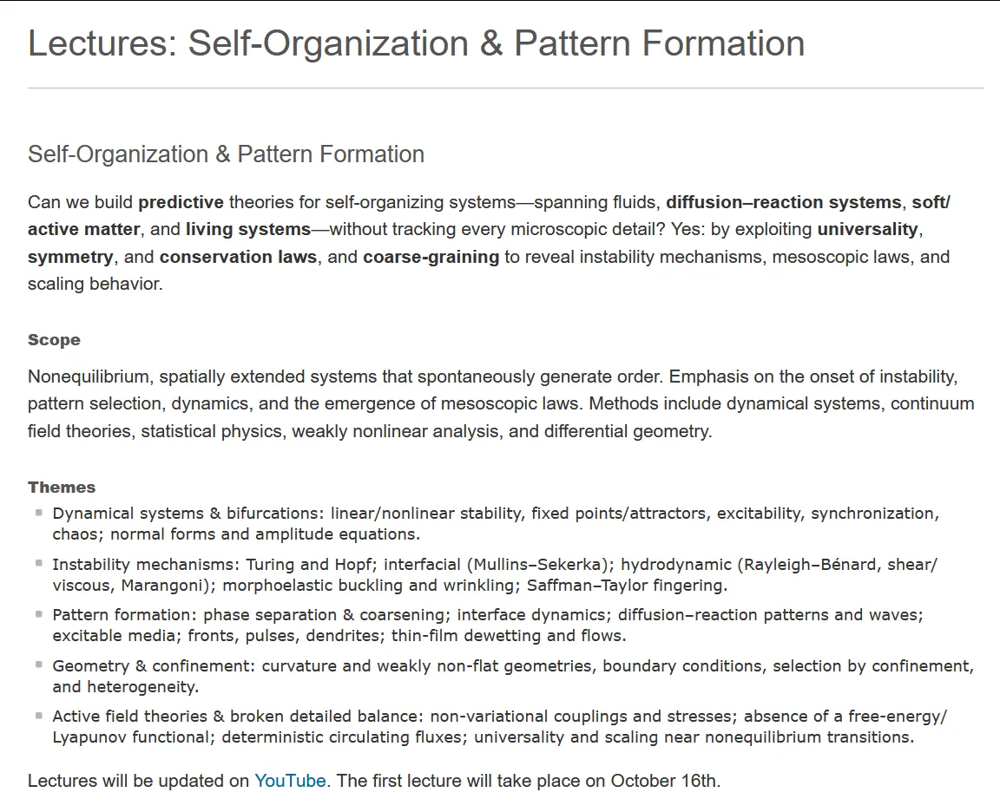
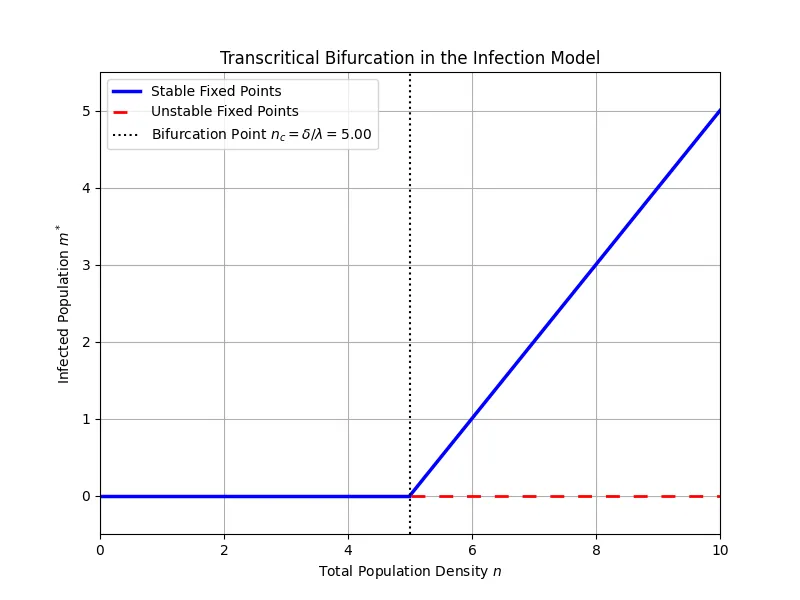
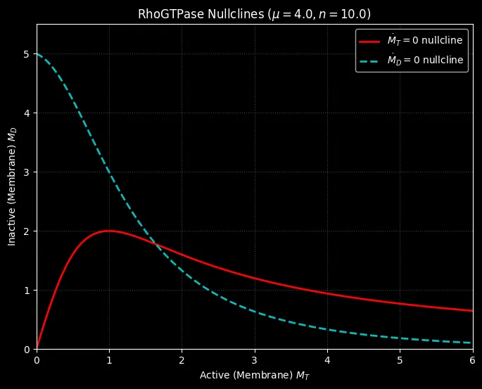
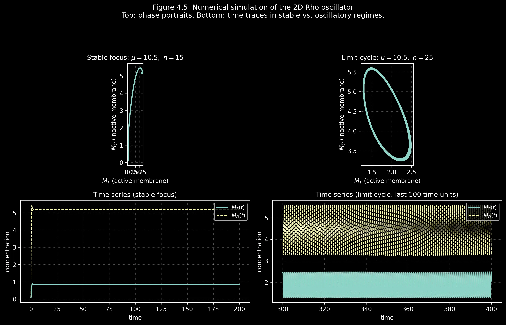
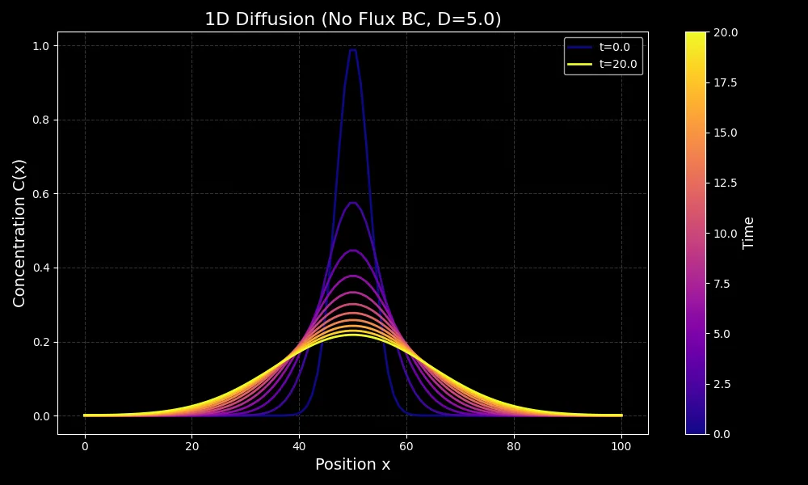
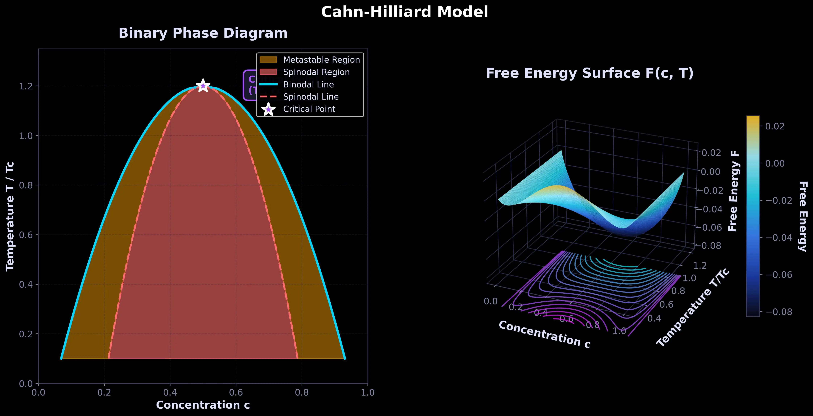
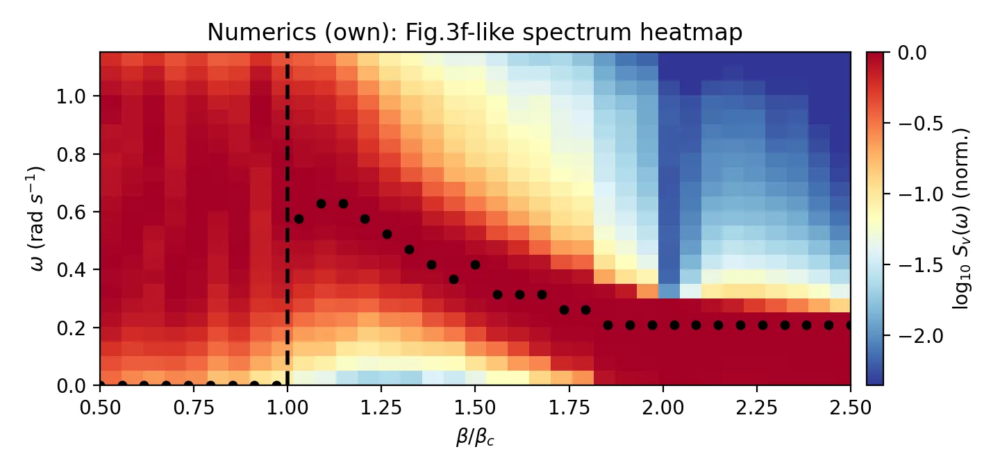
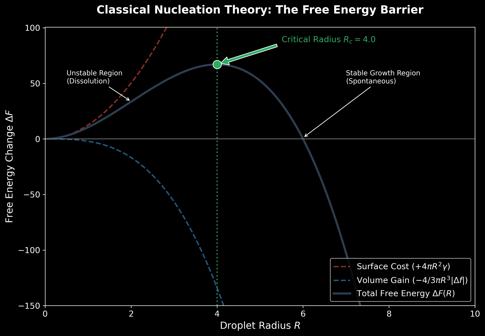

# 自组织与模式形成

[中文README](README_CN.md) | [English Notes](https://zhihangliu.cn/Self-Organization-and-Pattern-Formation/) | [中文笔记合集](https://zhihangliu.cn/Self-Organization-and-Pattern-Formation/zh/)

这是 [**Self-Organization and Pattern Formation, Prof. Erwin Frey, LMU Munich, Winter Semester 2025/2026**](https://www.theorie.physik.uni-muenchen.de/lsfrey/teaching/winter_term_2025_2026/index.html) 课程的自学笔记。Frey 教授偏爱板书授课。为了记录我的学习过程，我将笔记整理成文章，并编写 [Python 代码](https://github.com/Liu-Zhihang/Self-Organization-and-Pattern-Formation/tree/main/code) 以加深理解。

**课程播放列表:** [YouTube Playlist](https://www.youtube.com/watch?v=apMmakW_090&list=PL2IEUF-u3gRfIw2cHFPqNHjNfQL5BxG5m) | [哔哩哔哩](https://space.bilibili.com/44895705/lists/6603547?type=season)

**官方课程链接:** [LMU Munich - Self-Organization and Pattern Formation](https://www.theorie.physik.uni-muenchen.de/lsfrey/teaching/winter_term_2025_2026/index.html)

## 课程概述

我们能否在不追踪每一个微观细节的情况下，为跨越流体、反应-扩散系统、软/活性物质乃至生命系统的各类自组织系统，建立起具有预测能力的理论？答案是肯定的：通过运用普适性 (universality)、对称性 (symmetry) 和守恒律 (conservation laws)，并采用粗粒化 (coarse-graining) 的方法，来揭示不稳定性机制、介观尺度下的物理定律以及标度行为。

课程涵盖那些能够自发产生秩序的、空间延展的非平衡态系统。重点关注不稳定性的发生、模式的选择、动力学过程，以及介观尺度物理定律的涌现。方法包括动力系统、连续场论、统计物理、弱非线性分析和微分几何。

## 课程主题

### 动力系统与分岔
线性/非线性稳定性，不动点/吸引子，可激发性，同步，混沌；范式和振幅方程。

- [1. 自组织：从鸟群到活细胞](docs/cn/1.自组织：从鸟群到活细胞.md)
- [2. 动力系统：从物理相变到演化博弈](docs/cn/2.%20动力系统：从物理相变到演化博弈.md)
- [3. 动力系统：不动点、鞍点和叉形分岔](docs/cn/3.动力系统：不动点、鞍点和叉形分岔%20.md)
- [4. 动力系统：尖点分岔、感染模型与跨临界分岔](docs/cn/4.动力系统：尖点分岔、感染模型与跨临界分岔.md)
- [5. 动力系统：二维质量守恒系统与雅可比矩阵](docs/cn/5.动力系统：二维质量守恒系统与雅可比矩阵.md)
- [6. 动力系统：二维非保守系统与振荡器](docs/cn/6.动力系统：二维非保守系统与振荡器.md)
- [7. 动力系统：庞加莱-本迪克松定理、RhoGTPase振荡器与石头剪刀布](docs/cn/7.动力系统：庞加莱-本迪克松定理、RhoGTPase振荡器与石头剪刀布.md)
- [8. 动力系统：复制子动力学与空间扩展——李雅普诺夫函数、玻色子凝聚与扩散方程](docs/cn/8.%20动力系统：复制子动力学与空间扩展——李雅普诺夫函数、玻色子凝聚与扩散方程.md)

### 模式形成
相分离与粗化；界面动力学；反应-扩散图案和波；可激发介质；波前、脉冲、枝晶；薄膜去湿和流动。

- [9. 弛豫动力学：Ginzburg-Landau理论与Allen-Cahn方程](docs/cn/9.弛豫动力学：Ginzburg-Landau理论与Allen-Cahn方程.md)
- [10. 弛豫动力学：界面动力学与曲率驱动流](docs/cn/10.弛豫动力学：界面动力学与曲率驱动流.md)
- [11. 液态混合物中的热力学与相分离](docs/cn/11.液态混合物中的热力学与相分离.md)
- [12. 液态混合物动力学、渗透压与Cahn-Hilliard方程](docs/cn/12.液态混合物动力学、渗透压与Cahn-Hilliard方程.md)
- [13. 晶格气体模型与自由能](docs/cn/13.晶格气体模型与自由能.md)
- [14. 相分离动力学](docs/cn/14.相分离动力学.md)
- [15. 成核理论与界面动力学](docs/cn/15.成核理论与界面动力学.md)
- 16\. Ostwald熟化与粗化动力学，Lifshitz-Slyozov-Wagner (LSW) 理论

### 活性场论与细致平衡破缺
非变分耦合与应力；不存在自由能/李雅普诺夫泛函；确定性环流；非平衡相变点附近的普适性和标度行为。

- 17\. 趋化性与细菌的主动运动，Run-and-Tumble 模型
- 18\. Keller-Segel 模型，趋化不稳定性，有限时间爆破
- 19\. 标量活性物质，运动诱导相分离，Active Model B
- 20\. 活性布朗粒子，Active Model B+，气泡相

### 不稳定性机制
图灵和霍普夫不稳定性；界面不稳定性（Mullins-Sekerka）；流体动力学不稳定性（瑞利-贝纳德、剪切/粘性、马兰戈尼）；形态弹性屈曲和褶皱；萨夫曼-泰勒指进现象。

- 21\. 图灵模式，Swift-Hohenberg 方程，振幅方程
- 22\. 从微扰到振幅方程，NWS 方程，多尺度分析
- 23\. Newell-Whitehead-Segel 方程，次级不稳定性
- 24\. Eckhaus 与 Zigzag 不稳定性，相位缠绕解
- 25\. 复Ginzburg-Landau 方程
- 26\. 复Ginzburg-Landau 方程的稳定性
- 27\. 复Ginzburg-Landau 方程的相图
- 28\. CGLE 的应用，May-Leonard 模型，演化博弈
- 29\. 反应-扩散波，波前传播速度
- 30\. 仓本模型与同步转变

### 几何与约束
曲率和弱非平坦几何；边界条件；约束和非均匀性导致的选择。

- 31\. 质量守恒反应-扩散系统，大肠杆菌 Min 振荡
- 32\. 质量再分布不稳定性，绝热消除
- 33\. 定态模式的几何构造
- 34\. 稳态相图与体梯度效应
- 35\. 体-边界耦合与核苷酸交换
- 36\. 定态解与涌现饱和效应
- 37\. 盒子几何中的线性稳定性分析
- 38\. 大肠杆菌 Min 系统建模：骨架模型
- 39\. Min 骨架模型的线性稳定性分析
- 40\. Min 开关模型与鲁棒性

### 粗化动力学
粗化、相场模型和界面动力学的进阶主题。

- 41\. Model A/B/C，凝固动力学与相场模型
- 42\. 质量守恒系统中的粗化动力学
- 43\. 普适生长律与对数粗化
- 44\. 粗化律的标度分析
- 45\. 从峰到台地：指数尾相互作用
- 46\. 弱破缺质量守恒下的粗化中止
- 47\. 弱破缺质量守恒的线性稳定性分析
- 48\. 台地分裂机制：源驱动的侧向不稳定性
- 49\. 台地的中断粗化与 Gibbs-Thomson 关系
- 50\. 多组分反应-扩散系统中的表面张力
- 51\. 反应-扩散系统中的 Gibbs-Thomson 关系

## 使用说明

每个 Python 文件对应课程系列中涵盖的特定主题。代码是 YouTube 视频中理论概念的实践实现，作为自学和学习笔记的一部分开发。

代码输出演示：

### [第2讲：动力系统——从物理相变到演化博弈](docs/cn/2.%20动力系统：从物理相变到演化博弈.md)

| Landau 自由能与相变 | 演化博弈动力学 | 复制子方程流 |
|:---:|:---:|:---:|
|  |  |  |

### [第3讲：不动点、鞍结点与叉形分岔](docs/cn/3.动力系统：不动点、鞍点和叉形分岔%20.md)

| 分岔图 | 相图 |
|:---:|:---:|
|  |  |

### [第4讲：尖点分岔、感染模型与跨临界分岔](docs/cn/4.动力系统：尖点分岔、感染模型与跨临界分岔.md)

| 尖点分岔曲面 | 感染动力学 |
|:---:|:---:|
|  |  |

### [第5讲：二维质量守恒系统](docs/cn/5.动力系统：二维质量守恒系统与雅可比矩阵.md)

| 雅可比矩阵分析与相空间 |
|:---:|
|  |

### [第6讲：二维非保守系统与振荡器](docs/cn/6.动力系统：二维非保守系统与振荡器.md)

| Hopf 分岔 | 极限环 | Van der Pol 振荡器 |
|:---:|:---:|:---:|
|  |  |  |

### [第7讲：庞加莱-本迪克松定理、RhoGTPase 振荡器与石头剪刀布](docs/cn/7.动力系统：庞加莱-本迪克松定理、RhoGTPase振荡器与石头剪刀布.md)

| RhoGTPase 振荡器 | 石头剪刀布动力学 | 异宿轨道 |
|:---:|:---:|:---:|
|  |  |  |

### [第8讲：复制子动力学与李雅普诺夫函数](docs/cn/8.%20动力系统：复制子动力学与空间扩展——李雅普诺夫函数、玻色子凝聚与扩散方程.md)

| 李雅普诺夫函数 | 扩散方程 |
|:---:|:---:|
|  |  |

### [第9讲：Ginzburg-Landau 理论与 Allen-Cahn 方程 (Model A)](docs/cn/9.弛豫动力学：Ginzburg-Landau理论与Allen-Cahn方程.md)

<video controls width="100%">
  <source src="docs/cn/assets/images/model_a_dynamics.mp4" type="video/mp4">
  您的浏览器不支持视频标签。
</video>

*Model A (Allen-Cahn) 动力学：Spinodal 分解、畴形成与粗化*

### [第10讲：界面动力学与曲率驱动流](docs/cn/10.弛豫动力学：界面动力学与曲率驱动流.md)

<video controls width="100%">
  <source src="docs/cn/assets/images/droplet_shrinkage.mp4" type="video/mp4">
  您的浏览器不支持视频标签。
</video>

*圆形液滴在 Allen-Cahn 动力学下的曲率驱动收缩*

### [第11讲：液态混合物中的热力学与相分离](docs/cn/11.液态混合物中的热力学与相分离.md)

| 二元相图 |
|:---:|
|  |

### [第12讲：Cahn-Hilliard 方程与渗透压](docs/cn/12.液态混合物动力学、渗透压与Cahn-Hilliard方程.md)

<video controls width="100%">
  <source src="docs/cn/assets/images/CahnHilliard_vs_McRD.mp4" type="video/mp4">
  您的浏览器不支持视频标签。
</video>

*对比：Cahn-Hilliard (Model B) 与质量守恒反应-扩散动力学*

### [第13讲：晶格气体模型与自由能](docs/cn/13.晶格气体模型与自由能.md)

*晶格气体模型的蒙特卡洛模拟：相分离与自由能演化*

### [第14讲：相分离动力学与色散关系](docs/cn/14.相分离动力学.md)

| 人群振荡动力学 | 频谱热力图 |
|:---:|:---:|
|  |  |

### [第15讲：成核理论与界面动力学](docs/cn/15.成核理论与界面动力学.md)

| 3D Cahn-Hilliard 液滴 | 演化切片 |
|:---:|:---:|
|  |  |

| 浓度分布 | 成核势垒 |
|:---:|:---:|
|  |  |

## 许可证

本项目采用 [CC BY-NC-ND 4.0](LICENSE) 许可证。

## 致谢

- 感谢慕尼黑大学 Erwin Frey 教授及其 Physics of Life 研究组提供的精彩课程
- 感谢 [PhysicsOfLifeLMU YouTube 频道](https://www.youtube.com/@PhysicsOfLifeLMU) 公开发布这些课程
