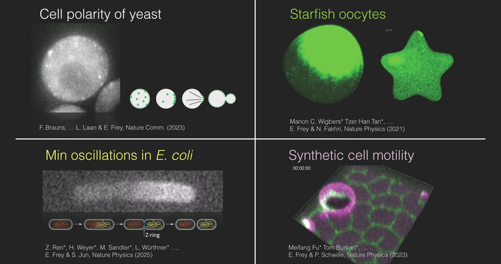
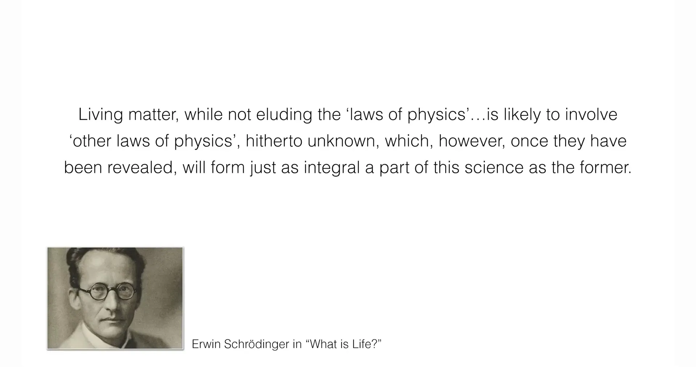
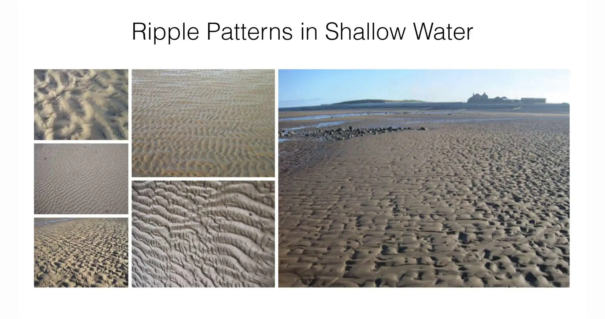
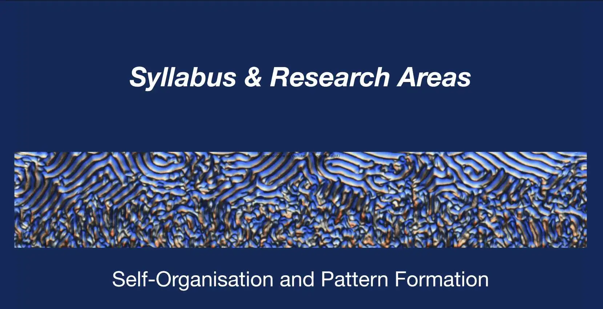
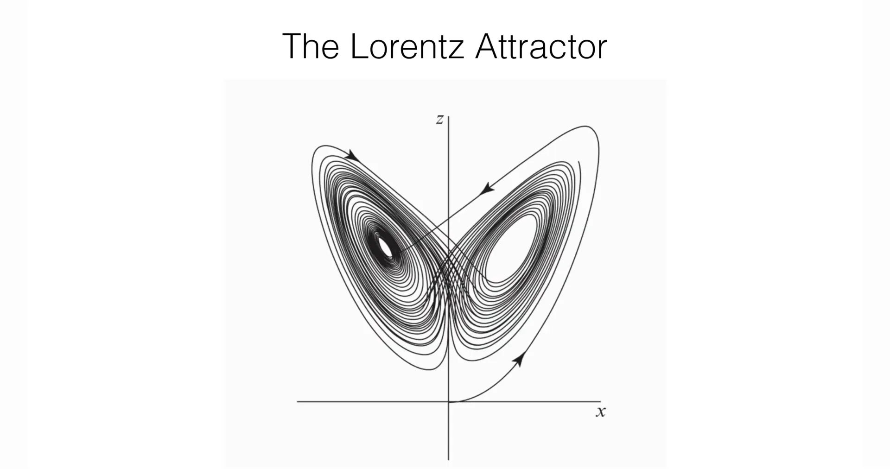
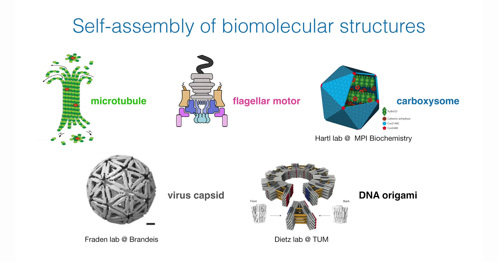
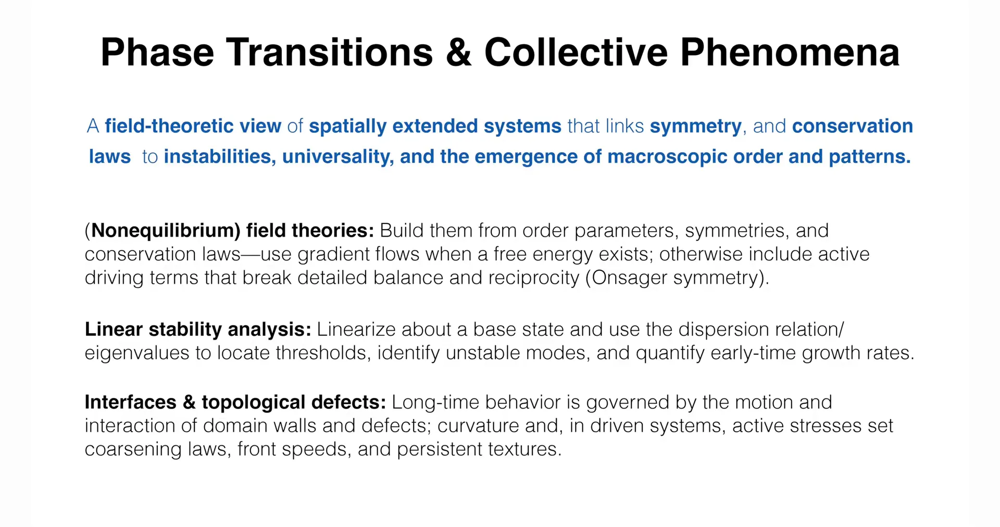
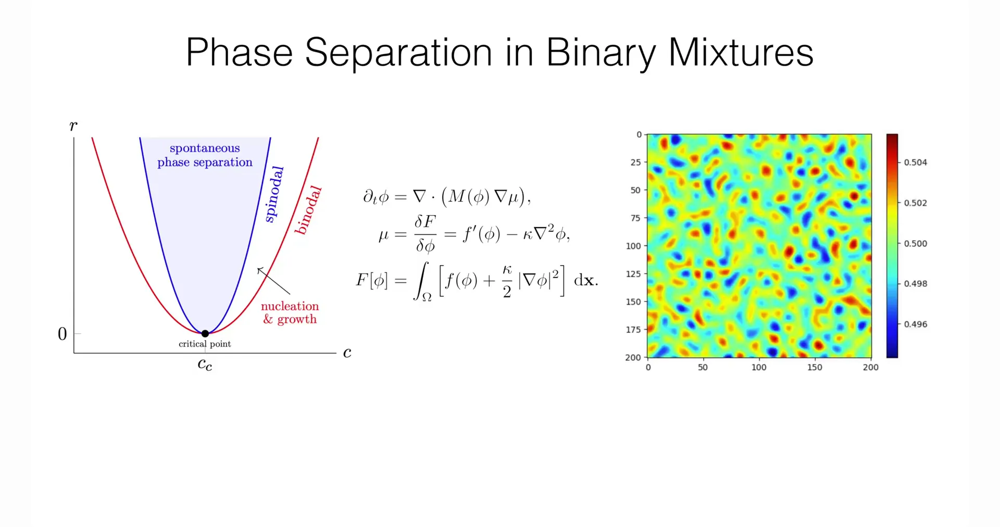
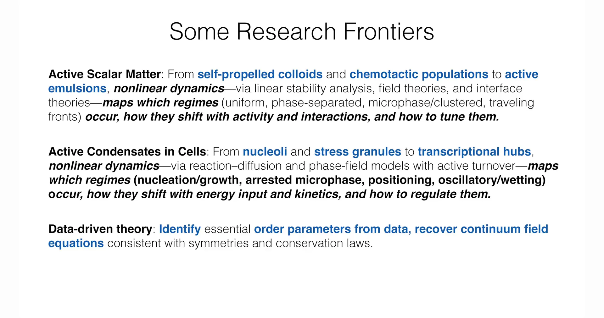
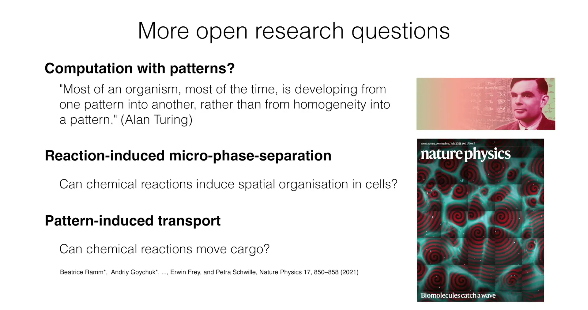

# 引言：始于惊奇的哲学与集体秩序之谜

Erwin Frey教授的课程以柏拉图在《泰阿泰德篇》中的论述开启：“惊奇是真正热爱智慧者的态度；事实上，科学没有别的开端。” 这句哲学名言确立了本课程的出发点：科学研究始于对自然现象的惊奇，其目标是深入理解这些现象背后的成因。

为了将“自组织” (Self-Organization) 这一抽象概念具体化，教授首先展示了椋鸟群（即“群椋乱舞”，murmuration）的视频。成千上万只椋鸟在空中形成复杂而流畅的动态图案，它们作为一个整体移动，却没有一个领导者或中央控制器在发号施令 。这正是自组织系统的一个标志性特征：宏观的、协调一致的集体行为是从个体之间简单的、局部的相互作用中自发涌现 (emergent) 的。

与此形成鲜明对比的是乐队指挥的例子。指挥家通过全局指令来协调整个乐队的演奏，这代表了一种“自上而下”的中心化控制模式。而自组织系统恰恰缺少这样的中心化控制，其秩序是“自下而上”生成的。

讲座随后将视角从宏观世界转向微观的细胞尺度，Frey教授展示了他们研究组的四个前沿研究案例。这些案例是自组织理论在生物学中的具体应用，也是后续课程将要发展的理论提供了现实的研究背景。

**1.酵母的细胞极性 (Cell polarity of yeast)** ：一个原本对称的球形酵母细胞，如何自发地打破对称性，选择一个特定的位点形成“极性帽” (polar cap)进行出芽生殖？这是一个基本的对称性破缺问题。

**自组织机制：**这个极性帽本身就是蛋白质自发形成的图案 (Pattern)。它充当了一个生物学“地标” (landmark)，用于组织细胞内的其他结构（如肌动蛋白丝）。

这些被组织起来的肌动蛋白束随后推动细胞壁，形成一个“芽”，最终产生新的酵母细胞。这是个例子，展示了自组织的空间图案如何服务于关键的生物功能（细胞增殖）。

**2.大肠杆菌中的 Min 蛋白振荡 (Min oscillations in *E. coli*)** ：大肠杆菌细胞内的一套蛋白质系统（Min蛋白）如何形成一个在细胞两极来回振荡的浓度波，从而精确地找到细胞的中心位置，以确保细胞分裂的对称性？

**自组织机制：** 细胞内的一套蛋白质系统（Min蛋白）自发形成一个在细胞两极来回振荡的浓度图案 。

这种动态振荡的时间平均效应，使得一种抑制分裂的蛋白浓度在细胞中心处最低。这就在细胞中部“许可”了分裂环（Z-ring ）的组装，从而确保了细胞能够精确地对称分裂。

**3.海星卵母细胞 (Starfish oocytes)** ：在发育初期的卵细胞中，细胞骨架（特别是肌动蛋白）如何组织成动态的图案，驱动细胞质的流动和物质的重新分布？

**自组织机制：** 讲座展示了细胞表面蛋白质形成的混沌、螺旋状波纹。当一阵波（wave）扫过细胞时，不仅蛋白质图案发生变化，细胞本身的形状也随之发生了形变。

这个例子揭示了自组织图案形成与细胞几何形态之间的深刻联系。这为理论研究带来了挑战，因为它需要将图案形成理论与微分几何（用于描述形状变化）结合起来。

**4.合成细胞的运动性 (Synthetic cell motility)** ：在体外重构的、由基本生物分子组成的“人造细胞”中，如何通过设计分子间的相互作用，使其实现自发的运动和变形？

**自组织机制：** 研究人员将上述大肠杆菌中的Min蛋白系统从细胞中提取出来，放置在一个二维平面上，它们同样形成了动态图案 。当一个仅由脂质双分子层构成的“人造细胞”（囊泡，vesicle）与这个蛋白质图案相互作用时，这个囊泡便开始了自发的定向运动 。

这属于“合成生物学”的范畴。它证明了，通过理解自组织的物理原理，生命的基本特征（如运动）是可能被分解和重构的 。

教授还举了果蝇的形态发生 (Morphogenesis in Drosophila)的例子，在更高的组织层面，生命体如何形成复杂的形态？图片展示了果蝇胚胎的早期发育过程。通过光片显微镜 (Light sheet microscopy) 实时观察 ，可以看到细胞如何大规模地重组、形成不同的形状，并最终产生分节 (segmentation) 等复杂的身体结构。这是一个“形态发生” (Morphogenesis) 的实例，代表了组织动力学 (tissue dynamics) 层面上的自组织 。为这类复杂生命过程建立理论描述是该领域的前沿挑战之一。

**在本课程中，Pattern 是一个核心概念，在中文语境下常被翻译为“图案”（侧重空间几何形态）或“模式”（侧重行为方式或规律）。这五个案例均展示了生物系统如何通过自组织产生功能性的时空图案/模式。**

讲座引用了物理学家埃尔温·薛定谔在其名著《生命是什么？》中的一段深刻论述：“生命物质，虽然没有逃脱‘物理学定律’……但很可能涉及到‘其他的物理学定律’，这些定律迄今未知，然而，一旦它们被揭示，将和前者一样，构成这门科学不可分割的一部分。”。

这段引言为整个课程设置了一个关键的理论框架。在现代物理学的语境下，薛定谔所说的“其他的物理学定律”可以被理解为支配那些**远离热力学平衡态**的系统的物理规律。生命系统与非生命物质的一个根本区别在于，它们是开放的、耗能的系统。细胞通过不断地水解ATP等化学燃料来维持其高度有序的结构并执行各种生命功能。这种持续的能量输入，使得生命系统本质上处于非平衡态。因此，薛定谔的引言暗示了本课程的核心焦点：**研究由能量驱动的非平衡态物理学，因为正是在这个领域，最引人入胜的自组织和模式形成现象得以发生。前面提到的四个生物物理学案例，无一例外都是典型的非平衡态系统。**

讲座展示了几个来自流体动力学的例子，以强调图案形成的普适性 (universality)。

**慕尼黑的驻波 (Munich river wave)：**展示了在慕尼黑市内河道中的驻波（冲浪点）。这是一个由非线性动力学主导的、自发形成的流体图案，其背后是纳维-斯托克斯方程 (Navier-Stokes equations) 。

**卡门涡街 (Von Kármán vortex street)：**展示了胡安·费尔南德斯群岛上空的云层，在岛屿（障碍物）后方形成了规则的涡旋图案 。

**涟漪图案 (Ripple patterns)：**展示了浅水中由水流和沙粒相互作用形成的各种条纹状或不同形状的涟漪 。

**沙丘 (Sand dunes)：** 展示了在摩洛哥由风塑造而成的巨大沙丘图案。这些沙丘历经数百年而形成，是颗粒介质在风力驱动下形成的又一类自组织图案。

这些例子表明，尽管物理系统千差万别（从城市河流 、大气层 到浅水沙滩 ），它们却能涌现出在几何上非常相似的图案。这强烈地暗示了在这些现象背后，存在着普适的 (universal)、不依赖于系统具体细节的数学原理 。**这也正是本课程的核心目标：通过运用普适性、对称性和守恒律等基本原理，建立起能够预测这些涌现秩序的“粗粒化”理论 。**

下面是课程大纲与内容的简介

为了建立一个能描述这些现象的预测性理论，课程将围绕三个核心理论支柱展开：

1. 动力系统理论 (Dynamic Systems Theory) 

2. 相变与集体现象 (Phase Transitions & Collective Phenomena)

3. 模式形成与自组织 (Pattern Formation & Self-Organisation)

# 1. 动力系统理论——变化的几何学

## 1.1 非线性动力学的核心概念

非线性动力学理论提供了一种几何学的视角来理解系统的演化，超越了线性系统中“叠加原理”的限制。展示了反馈和约束如何组织起稳定性 (stability)、吸引子 (attractors) 和相变 (transitions)。

在一个被称为**相空间 (phase space)** 的抽象空间里，系统在任一时刻的状态（例如，所有粒子的位置和速度）被表示为一个点。随着时间的推移，这个点会描绘出一条轨迹，展现系统的演化历程。

* **相空间几何 (Phase-space geometry)** ：系统的长期行为通常由相空间中的一些特殊不变集所支配，这些不变集被称为**吸引子 (attractors)** 。最简单的吸引子是**不动点 (fixed points)** ，对应于系统的稳态；另一种常见的吸引子是**极限环 (limit cycles)** ，对应于系统的周期性振荡。每个吸引子都有其**吸引盆 (basin of attraction)** ，即所有最终会演化到该吸引子的初始状态的集合。

* **稳定性与流形 (Stability & manifolds)** ：通过在不动点或极限环附近对系统的动力学方程进行**线性化** ，可以分析其稳定性。线性化后得到的**本征模 (eigenmodes)** 揭示了系统在不同方向上的行为：在稳定方向上，微小的扰动会衰减；在不稳定方向上，扰动则会增长。这些稳定和不稳定的方向共同构成了在相空间中引导轨迹流动的**稳定与不稳定流形 (manifolds)** 。

* **分岔理论 (Bifurcation theory)** ：当系统的一个控制参数（如温度、反应物浓度或能量输入速率）缓慢变化时，相空间的几何结构可能会发生质的改变。例如，一个稳定的不动点可能变得不稳定，并催生出一个稳定的极限环。这种动力学行为的质变被称为**分岔 (bifurcation)** 。分岔理论揭示了这些转变具有普适的局部“模板”，如**鞍结分岔 (saddle-node)** 、**叉式分岔 (pitchfork)** 和**霍普夫分岔 (Hopf)** 。

* **对称性与约束 (Symmetry & constraints)** ：物理系统中的**对称性**和**守恒律**（如能量守恒、质量守恒）对动力学施加了强大的约束。这些约束不仅限制了系统可能的演化路径，还决定了系统能够发生的分岔类型，从而极大地简化了分析并使预测成为可能。

## 1.2 经典案例：从不动点到混沌吸引子

为了阐释“吸引子”这一核心概念，讲座从简单的二维系统开始，逐步引入了更复杂的吸引子类型。第一个例子展示了一个二维相空间，其中包含两种“地标”式的不动点：一个是不稳定的**鞍点**（空心圆圈），另一个是**稳定不动点**（实心黑点）。这个稳定不动点就是一个**吸引子**，所有从其“吸引盆”内部出发的轨迹，最终都会流向并停止在这个点上，代表系统达到了一个**稳态**。该系统由方程 $\partial_{t}u = -u + u^{2}v$ 和 $\partial_{t}v = u - v$ 描述。

第二个例子是即著名的“布鲁塞尔振子”(Brusselator)模型，它引入了另一种吸引子——**极限环**（红色闭合曲线）。这个系统的动力学行为是，无论从环的内部还是外部开始，轨迹最终都会汇聚到这条环上，代表系统进入了一种**周期性振荡**的状态。这种极限环是理解许多生物节律（如生物钟）的数学基础。其动力学方程为 $\partial_{t}u = \mu + u^{2}v - (\lambda + 1)u$ 和 $\partial_{t}v = \lambda v - u^{2}v$。

在介绍了不动点和极限环这两种基本类型后，讲座转向了一个更复杂、也更著名的三维系统——**洛伦兹吸引子**。这个方程组最初是作为描述大气对流的简化模型而被提出的，其方程为：
$$
\begin{aligned} 
\frac{dx}{dt} &= \sigma(y - x) \\ 
\frac{dy}{dt} &= x(\rho - z) - y \\ 
\frac{dz}{dt} &= xy - \beta z 
\end{aligned}
$$
其中 $x, y, z$ 是描述系统状态的变量（分别对应对流速率、温差和温度剖面偏离），而 $\sigma, \rho, \beta$ 是物理参数。当参数取到特定值时（如 $\sigma = 10, \rho = 28, \beta = 8/3$），这个完全确定的系统会展现出“**确定性混沌 (deterministic chaos)** ”行为。

系统的轨迹被限制在一个有界的“蝴蝶”形状区域内，但它永不重复，并且对初始条件具有极端的敏感性。这意味着，即使两个初始状态只有微乎其微的差别，它们后续的演化轨迹也会以指数形式迅速分离，导致长期行为完全无法预测。洛伦兹的发现具有革命性意义，它揭示了即使在没有随机性的、由简单非线性规则支配的系统中，也可能内在地产生复杂和不可预测的行为。

## 1.3 动力系统的研究前沿

讲座将这些基础理论与三个活跃的研究前沿联系起来，展示了动力系统理论在现代科学中的应用。

1. **反应网络 (Reaction Networks)** ：将稳定性和分岔分析应用于理解生物学（如基因调控网络、细胞信号通路）和生态学（如种群动态）中的复杂网络。其目标是绘制出“相图”，明确在不同的参数区间内，系统会表现出何种行为，例如物种共存、双稳态（系统可以在两种稳定状态之间切换）或周期性振荡。

2. **学习动力系统 (Learning Dynamical Systems)** ：这是一种现代的、数据驱动的研究范式。与传统的从已知物理定律出发建立方程不同，该领域旨在利用实验或模拟产生的时间序列数据，反向推断出支配系统演化的动力学规则。这是机器学习和科学人工智能交叉领域的一个核心课题。

3. **动力学自组装 (Kinetic Self-Assembly)** ：利用非线性速率方程来建模、预测和控制微观结构的形成过程，例如病毒衣壳的组装或DNA折纸术。理论分析可以帮助预测自组装过程中的成核阈值、延迟时间以及最终产物的尺寸分布和产率，这对于纳米技术和新材料的设计至关重要。

教授通过与宜家家具（需要外部组装）进行对比，强调了生物系统的独特性。这张PPT列举了多种在生物体内部自发形成的复杂结构，包括微管 (microtubule)、鞭毛马达 (flagellar motor)、病毒衣壳 (virus capsid) 以及人工设计的DNA折纸术 (DNA origami)。此图的目的是直观地展示该领域所研究的核心问题：**这些精妙的生物分子机器是如何在没有外部干预的情况下，从简单的构件自动“搭建”起来的。**

生物自组装可以被类比为一个“计算问题” (computational problem)。PPT在计算机科学和自组装之间建立了一一对应的关系：计算机的“算法”(algorithm) 对应生物系统的“组装情景”(assembly scenario)；“CPU时间”(CPU time) 对应“真实时间”(real time)；而“输入大小”(input size) 则对应“目标结构的大小”(size of target structure)。通过这个类比，教授引入了一个关键的理论概念——“自组装的时间复杂度” (Time complexity of self-assembly)，即研究组装一个结构（如病毒）所需的真实时间，是如何随着该结构尺寸的变化而变化的。

将这三个前沿领域并列呈现，揭示了理论物理研究中的一种深刻的二元性。前两个领域，“反应网络”和“动力学自组装”，代表了传统的“**正向问题**”：给定一套规则（微分方程），系统会涌现出什么样的行为？这是理论物理学的经典路径。而第三个前沿，“学习动力系统”，则代表了“**反向问题**”：给定观测到的行为（数据），其背后的基本规则是什么？由机器学习驱动的反向问题的兴起，是21世纪科学研究的一个重要特征。将它们并置，表明对复杂系统的完整理解，既需要从理论出发进行预测的能力，也需要从数据出发进行推断的能力，二者相辅相成。

# 2. 相变与集体现象——整体的涌现

课程的第二个理论支柱将视角从由少数几个变量描述的系统（常微分方程，ODEs）转向空间延展的系统（偏微分方程，PDEs）。在这类系统中，我们关注的是一个或多个随空间和时间连续变化的场，即**序参量 (order parameter)** $\phi(\mathbf{x}, t)$，例如局部浓度、密度或分子的平均朝向。这是一种对空间延展系统的场论观点 (field-theoretic view)，它将对称性 (symmetry)、守恒律 (conservation laws) 与不稳定性 (instabilities)、普适性 (universality) 以及宏观秩序和图案的涌现 (emergence) 联系起来。

**非平衡态场论(Nonequilibrium field theories)** ：描述这些场的演化理论是基于序参量、系统的对称性和守恒律构建的。对于接近热力学平衡的系统，其动力学通常遵循一种“梯度流 (gradient flow)”，即系统会朝着最小化某个**自由能泛函 (free energy functional)** 的方向演化。然而，对于活性系统，情况则完全不同。从序参量、对称性和守恒律出发构建它们——当存在自由能时，使用梯度流 (gradient flows)；否则，包含破坏细致平衡 (detailed balance) 和互易性 (reciprocity)（即昂萨格对称性 Onsager symmetry）的活性驱动项。

在活性系统中，由于持续的能量输入（例如细胞内的ATP水解），系统内部存在着持续的能量流和概率流，这破坏了微观可逆性或时间反演对称性，即所谓的“细致平衡”。其直接后果是，这类系统通常不存在一个可以被动力学最小化的简单的自由能。细致平衡破缺 (Broken Detailed Balance)是非平衡态物理学区别于平衡态物理学的核心特征。

**线性稳定性分析 (Linear stability analysis)** ：研究空间均匀的基态是否稳定，通常的方法是引入一个微小的、具有特定波矢 $\mathbf{k}$ 的正弦扰动（形式如 $e^{i\mathbf{k}\cdot\mathbf{x} + \omega t}$）。通过求解线性化的动力学方程，可以得到增长率 $\omega$ 与波矢 $\mathbf{k}$ 之间的关系，即**色散关系 (dispersion relation)** $\omega(\mathbf{k})$。如果对于某个 $\mathbf{k}$，$\text{Re}(\omega) > 0$，则该波长的扰动会指数增长，系统变得不稳定，并倾向于形成一个以波长 $2\pi/|\mathbf{k}|$ 为特征的空间图案。

**界面与拓扑缺陷 (Interfaces & topological defects)** ：在模式形成之后，系统的长期演化往往由不同有序区域之间的边界（**界面**）或序参量场中的奇异点（**拓扑缺陷**）的运动所主导。这些界面和缺陷的动力学行为，如移动、相互作用、产生和湮灭，控制着诸如“粗化 (coarsening)”（即有序区域的尺寸随时间增长）等宏观过程。长期行为由畴壁 (domain walls) 和缺陷 (defects) 的运动和相互作用所支配；曲率以及（在驱动系统中）活性应力 (active stresses) 决定了粗化定律 (coarsening laws)、波前速度 (front speeds) 和持续的纹理 (persistent textures)。

## 2.2 经典案例1：二元混合物的相分离

这个例子描述了像油和水这样的均匀混合物如何自发地分离成富含各自组分的两个区域。描述这一过程的经典模型是**Cahn-Hilliard方程**。

该模型由三个核心部分构成：

1.**Ginzburg-Landau自由能泛函 $F[\phi]$** ：这是描述系统总能量的表达式，它包含两项。

$$
F[\phi] = \int_{\Omega} \left[ f(\phi) + \frac{\kappa}{2}|\nabla\phi|^2 \right] d\mathbf{x}
$$

* **体自由能密度 $f(\phi)$** ：这一项描述了均匀混合物的能量。它的函数图像是一个**双阱势 (double-well potential)**，意味着系统在两个纯相状态（例如，序参量 $\phi = \pm 1$）的能量比在混合状态（$\phi = 0$）时更低。

* **梯度能量 $\frac{\kappa}{2}|\nabla\phi|^2$** ：这一项与序参量梯度的平方成正比，它惩罚空间中浓度的剧烈变化。因此，形成一个相畴之间的界面需要付出能量代价。参数 $\kappa$ 控制了界面的厚度和能量。

2. **化学势 $\mu$** ：

$$
\mu = \frac{\delta F}{\delta \phi} = f'(\phi) - \kappa\nabla^2\phi
$$

化学势是自由能泛函对序参量场的泛函导数。它扮演着热力学力的角色，驱动系统向能量更低的状态演化，是物质扩散的局部驱动力。

3. **连续性方程 $\partial_t \phi$**：

$$
\partial_t \phi = \nabla \cdot (M(\phi) \nabla \mu)
$$

这是核心的动力学方程，本质上是一个**质量守恒**的表述，即 $\partial_t \phi = -\nabla \cdot \mathbf{J}$，其中 $\mathbf{J}$ 是物质通量。在这里，通量 $\mathbf{J}$ 被假设为正比于化学势的梯度，$\mathbf{J} = -M\nabla\mu$，这是对经典菲克扩散定律的推广。$M$ 是迁移率。

**物理过程（旋节线分解） ：**如果一个均匀混合物被快速冷却到其相图中的不稳定区域（即旋节线区域 (spinodal region)），那么系统中微小的、随机的浓度涨落就会自发地、指数级地增长。这会导致系统迅速分离成两个相互交织、连通的相区。随后，这些相区会通过界面运动逐渐“粗化”，小的区域被大的区域吞并，从而使得系统的总界面能不断降低。

## 2.3 经典案例2：活性物质中的拓扑缺陷

教授接着介绍另一个典型的活性物质系统：**活性向列相 (active nematics)** 。这是一种由细长的、能够主动施加力的粒子（如驱动蛋白驱动的微管束或细菌）组成的流体。

**序参量**：系统的局部取向有序性由一个二阶无迹对称张量 $\mathbf{Q}$ 来描述。

**拓扑缺陷**：在二维系统中，这些是取向场中的点状奇点，由一个拓扑荷（或卷绕数）来表征，最常见的是 $+1/2$ 和 $-1/2$ 缺陷。在活性向列相中，这些缺陷并非静止不动。由于对称性的破缺，$+1/2$ 缺陷能够像粒子一样自驱动，其运动会搅动周围的流体，产生复杂的流动。

**耦合方程**：系统的动力学由序参量张量 $\mathbf{Q}$ 和流体速度场 $\mathbf{u}$ 的耦合偏微分方程描述。其中一个关键项是**活性应力 (active stress)** ，通常形式为 $\sigma_a \propto \alpha \mathbf{Q}$，其中 $\alpha$ 是活性系数。这一项代表了活性粒子对流体施加的系统性作用力。正是这个活性应力，驱动系统进入一种持续的、混乱的流动状态，被称为“**活性湍流 (active turbulence)**”或“**缺陷混沌 (defect chaos)** ”。

教授对活性物质场论 (Active Matter Field Theories)这一前沿领域进行分类，展示了研究者试图描述的几种关键现象。

1."Scalar active matter"（标量活性物质），它由自驱动粒子组成，不同于传统的热力学混合物。

2."Active nematics"（活性向列相），即上一张PPT中展示的由微管和马达蛋白构成的混沌系统。

3."Chiral active fluids"（手性活性流体），展示了具有手性的图案。

4."Active metamaterial"（活性超材料），其动力学行为（如拓扑保护的边缘流）被限制在系统的边界上。

PPT的下面是用于描述这些系统的“非平衡场论”方程，教授以此强调了这些理论的两个关键特征。首先，对于“标量活性物质”，其方程虽然在形式上类似于平衡态的相分离模型，但其化学势**无法**从一个自由能泛函中导出，这从数学上体现了系统对“细致平衡”的破坏。其次，对于“活性向列相”，理论变得更加复杂，不仅需要标量场（如密度），还必须引入“矢量场”（来描述流体速度）和“张量场”（来描述活性粒子局部的取向）。

## 2.4 集体现象的研究前沿

1.**活性标量物质 (Active Scalar Matter)** ：从自驱动胶体 (self-propelled colloids) 和趋化种群 (chemotactic populations) 到活性乳液 (active emulsions)，（运用）非线性动力学——通过线性稳定性分析、场论和界面理论——绘制出哪些（行为）区域（均匀态、相分离态、微相/簇状、行波波前）会发生，它们如何随活性和相互作用而变化，以及如何调控它们。

这类系统由自驱动粒子组成，但粒子之间没有取向排列的相互作用。其标志性现象是**运动诱导相分离 (Motility-Induced Phase Separation, MIPS)** 。在这种现象中，即使粒子之间只有纯粹的排斥作用，它们也能发生相分离。其机制是：自驱动粒子在运动过程中，一旦进入密度较高的区域，由于碰撞频繁，其有效速度会降低。这导致粒子更容易在密集区域“堵塞”和聚集，从而进一步增大了该区域的密度。这种正反馈循环最终导致系统自发分离成一个高密度的“液相”和一个低密度的“气相”。

2.**细胞内的活性凝聚体 (Active Condensates in Cells)** ：从核仁 (nucleoli) 和应激颗粒 (stress granules) 到转录中枢 (transcriptional hubs)，（运用）非线性动力学——通过带有活性周转 (active turnover) 的反应-扩散模型和相场模型——绘制出哪些（行为）区域（成核/生长、受阻微相、定位、振荡/浸润）会发生，它们如何随能量输入和动力学而变化，以及如何调控它们。

将相分离物理学的思想应用于理解细胞内广泛存在的“无膜细胞器”，如核仁、应激颗粒等。这些结构被认为是细胞质或细胞核中的“液滴”（即**生物分子凝聚体**）。与简单的物理相分离不同，这些凝聚体的形成、溶解和动态行为受到细胞内活跃的、消耗能量的生物化学反应（如蛋白质的合成/降解、磷酸化/去磷酸化等）的精确调控。

3.**数据驱动理论 (Data-driven theory)** ：从数据中识别出必要的序参量，恢复出与对称性和守恒律一致的连续场方程。与动力系统部分的前沿类似，但应用于空间延展系统。其目标是利用高分辨率的实验数据（例如，显微镜下的视频），通过机器学习和稀疏回归等方法，自动地发现支配活性物质系统演化的偏微分方程。

这一部分的讲座内容展示了**场论**这一概念框架的强大统一力。从二元流体的相分离（一个由热力学驱动的“被动”系统），到活性向列相（一个由内禀马达驱动的“活性”系统），再到活性标量粒子的MIPS和细胞内的活性凝聚体，所有这些看似迥异的现象，都可以被一个统一的数学语言——即基于连续序参量场的理论——所描述。它们都遵循由对称性和守恒律决定的偏微分方程。被动系统和活性系统的根本区别，仅仅在于这些方程中是否包含那些破坏细致平衡的“活性项”（如活性应力）。这表明，场论框架具有极大的灵活性和普适性：通过对方程中的具体项进行修改，同一个概念语言就能描述从油水混合物到活细胞内部的广泛物理现象。“数据驱动理论”这一前沿，正是这种思想的终极体现——它试图直接从原始数据中找出这些关键的方程项。

# 3. 模式形成与自组织——生命的物理学

课程的第三个理论支柱旨在将前两个支柱（动力系统理论和非平衡场论）的工具和思想进行综合，以解决生物学背景下功能性图案是如何产生的问题。这里的核心是**反应-输运循环 (reaction-transport cycles)** 和由**细胞骨架**主导的**活性力学 (active mechanics)** 。

一种对**生命系统的统一观点** (unified view of living systems)，其中**反应-输运循环** (reaction–transport cycles) 和**活性细胞骨架力学** (active cytoskeletal mechanics)——由对称性、守恒律和几何所塑造——将**界面 (interfaces)、波 (waves) 和极性域 (polar domains)** 组织成功能性的细胞内和组织层面的图案。

**经典模式形成模型 (Classical pattern-forming models)** ：
典范的偏微分方程 (Canonical PDEs)（如图灵模型 (Turing)、Swift-Hohenberg、Ginzburg-Landau、Kuramoto-Sivashinsky），利用色散关系和振幅约化 (amplitude reductions) 来预测阈值、波长和平面图案 (planform) 的稳定性。

介绍一系列经典的偏微分方程，它们被视为模式形成的“范式”或“通用模板”，例如**图灵模型 (Turing model)** 、**Swift-Hohenberg方程**和**Ginzburg-Landau方程** 。这些模型通过线性稳定性分析和弱非线性分析，可以预测模式形成的阈值、特征波长以及不同几何图案（如条纹、六边形）的稳定性。

**质量守恒的反应-扩散系统 (Mass-conserving reaction-diffusion)** ：使用守恒律和通量-平衡几何 (flux-balance geometry)（零斜线 nullclines、斜率判据 slope criterion）来定位允许的稳态 (admissible steady states)，并对侧向不稳定性 (lateral instabilities) 的发生进行分类。

这是生物系统中一个至关重要的约束。与许多开放的化学反应器不同，细胞内的许多蛋白质总量是固定的。这个守恒律极大地改变了系统可能出现的不稳定性和最终形成的图案。

**锐利界面动力学 (Sharp-interface dynamics)** ：
从相场模型 (phase-field models) 中推导出波前/畴壁 (front/domain-wall) 的运动——（如）平均曲率流 (mean-curvature flow) 和 斯特藩/吉布斯-汤姆孙 (Stefan/Gibbs–Thomson) 条件——并使用这些定律来计算粗化速率 (coarsening rates) 和波前速度 (front speeds)。

在许多情况下，直接求解整个场的偏微分方程非常复杂。一种有效的简化方法是，推导出描述区域边界（界面或波前）运动的方程。这种方法可以直接计算界面的传播速度或相畴的粗化速率，而无需关心远离界面区域的细节。

## 3.1 经典案例1：Swift-Hohenberg方程

讲座将Swift-Hohenberg (SH) 方程作为一个范式模型，用于描述那些自发形成具有特征波长图案的系统。

一个简化但具有代表性的SH方程形式如下：

$$
\partial_t \phi = \mu \phi - (\nabla^2 + q_c^2)^2 \phi - \phi^3
$$

**线性增长/衰减项 $\mu \phi$** ：$\mu$ 是一个控制参数。当 $\mu < 0$ 时，均匀态 $\phi=0$ 是稳定的，任何扰动都会衰减。当 $\mu > 0$ 时，均匀态变得不稳定，扰动开始增长。

**模式选择项 $-(\nabla^2 + q_c^2)^2 \phi$** ：这是SH方程中最关键的一项。在傅里叶空间中，拉普拉斯算子 $\nabla^2$ 变为 $-k^2$（其中 $k$ 是波数）。因此，这一项变为 $-(-k^2 + q_c^2)^2$。这个算子对波数 $k$ 远离 $q_c$ 的模式有强烈的阻尼作用，但对 $k = q_c$ 的模式，其阻尼为零。因此，它强烈地“选择”了波数为 $q_c$（即波长为 $2\pi/q_c$）的图案，使其最先失稳并生长起来。

**非线性饱和项 $-\phi^3$** ：这是一个抑制项，它防止了图案的振幅无限增长，使得系统最终达到一个振幅有限的、稳定的图案状态。

SH方程最初是作为描述瑞利-贝纳德对流（加热流体层中形成对流滚筒）的简化模型推导出来的，但它成功地捕捉了许多不同物理系统中从均匀态到周期性图案转变的普适特征，因此成为了研究模式形成的典范。

## 3.2 经典案例2：大肠杆菌中的Min蛋白振荡

讲座再次回到引言中提到的例子，这个系统的生物学功能是为大肠杆菌在分裂前找到细胞的精确中心。

这是一个由反应、扩散和物质在不同区域（细胞质和细胞膜）之间循环所驱动的自组织振荡器。

1. **参与者**：核心是两种蛋白质，MinD和MinE。MinD在与ATP结合时，可以附着到细胞膜上。

2. **循环过程**：细胞质中的MinD-ATP会结合到细胞膜上。膜上的MinD会协同地招募更多的MinD-ATP，形成一个集中的“极区”。同时，膜上的MinD也会从细胞质中招募MinE。

3. **负反馈**：MinE一旦结合到膜上的MinD，就会激活MinD的ATP水解酶活性，使其水解ATP变为ADP。MinD-ADP与细胞膜的亲和力很低，会从膜上脱落，并把MinE一起带回到细胞质中。

4. **振荡**：这个“附着-协同招募-激活脱落”的循环，在细胞有限的几何空间内，并伴随着蛋白质在细胞质中的扩散，最终形成了一个从细胞一极到另一极来回传播的蛋白质浓度波。这是一个典型的质量守恒的反应-扩散系统，因为MinD和MinE的总量在细胞内是恒定的。细胞分裂的抑制蛋白MinC会跟随着MinD一起运动，因此，经过时间平均后，MinC的浓度在细胞中心处最低。这就在细胞中部“许可”了分裂环的组装，从而确保了细胞的对称分裂。

教授重新回顾了讲座开头提到的“海星卵母细胞” (Starfish oocyte) 的例子。 **为了在理论上强调“图案形成” (Pattern formation) 与“微分几何” (Differential Geometry) 之间的深刻联系**。

在前面的几分钟里，他一直在讲 *E. coli* 的Min蛋白图案是如何“感知”并“读取”细胞的几何形状（即圆柱体）的。而这张海星卵母细胞的PPT则展示了一个更进阶、更复杂的耦合：

1.  **图案导致形变**：视频中可以看到一阵蛋白质波（即“图案”）扫过卵母细胞的表面。

2.  **几何响应**：关键在于，伴随着这阵波，细胞本身也随之发生了“**几何形变**” (geometric deformation)。

一个“**双向耦合**”：不仅是几何形状（“微分几何”）在影响“图案形成”，反过来，“图案形成”也在主动地改变几何形状。教授称这是一个“非常具有挑战性的理论任务”，因为它要求理论家们建立一个能同时描述这两者相互作用的统一模型。

## 3.3 开放的研究问题

讲座在结尾部分教授提出了一系列连接物理学和生物学的前瞻性问题，这些问题代表了该领域未来的研究方向。

* **用图案进行计算 (Computation with patterns)?** 细胞内复杂的时空图案是否可以被用来执行某种形式的信息处理或“计算”？正如现代计算理论的先驱艾伦·图灵本人所推测的那样。

“一个有机体的大部分，在大部分时间里，是从一种图案发展成另一种图案，而不是从均匀状态发展成一种图案。” (Alan Turing)

* **反应诱导的微相分离 (Reaction-induced micro-phase-separation)?** 化学反应能在细胞内诱导空间组织吗？ 细胞内的生物化学反应网络是否能够主动地驱动和调控生物分子凝聚体的形成与解散，从而实现对细胞内部空间的动态组织？

* **图案诱导的输运 (Pattern-induced transport)?** 细胞内行进的化学波或其他动态图案，是否可以被利用来主动地、定向地运输分子“货物”，实现比简单扩散更高效的物质输运？

从课程的前两个理论支柱主要关注如何**描述**和**预测**图案的涌现，到这最后一部分的开放性问题，课程从**现象**转向**功能**。这些问题的核心不再仅仅是“形成了什么图案？”，而是“这些图案是**用来做什么的**？”它们能计算吗？它们能组织空间吗？它们能运输物质吗？这反映了现代生物物理学的终极目标：不仅要为生命现象建立物理模型，更要理解这些现象背后的物理原理是如何服务于、并最终实现复杂的生物功能的。这巧妙地呼应了讲座开头薛定谔关于“生命物质”的深刻思考，形成了一个完整而富有启发性的闭环。

# 总结：一种关于涌现秩序的统一观点

下表总结了这系列课程的三个核心理论支柱：

| 特征 | 动力系统理论 | 相变与集体现象 | 模式形成与自组织 |
|------|--------------|----------------|------------------|
| 典型系统 | 低维、充分混合的系统 | 空间延展、多体系统 | 生物系统（细胞、组织） |
| 数学语言 | 常微分方程 (ODEs) | 偏微分方程 (PDEs), 场论 | 反应-扩散PDEs, 活性力学 |
| 核心概念 | 相空间、吸引子、分岔、混沌 | 序参量、自由能、线性稳定性、缺陷 | 质量守恒、反馈循环、功能 |
| 经典案例 | 洛伦兹吸引子 | Cahn-Hilliard方程, 活性向列相 | Swift-Hohenberg方程, Min蛋白振荡 |

通过三个相互关联的理论支柱——动力系统理论、非平衡态场论以及生物模式形成理论——构建了一个强大而统一的分析工具集。

课程的核心内容是，通过从微观细节中抽象出来，转而关注如对称性、守恒律和不稳定性本质等普适性原理，我们可以构建出具有强大预测能力的粗粒化理论。这些理论能够解释从无生命的物理系统到复杂的生命系统中秩序的涌现。

