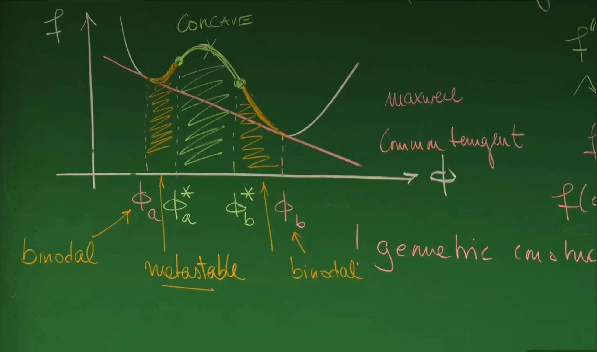

# 1. 引言

## 从“固态的过去”到“液态的未来”

在凝聚态物理学的传统叙事中，晶体固体因其完美的对称性和静态有序结构，长期占据着理论研究的核心地位。然而，Erwin Frey 教授在这节课开篇提出了一个极具哲学意味的观点：“过去是固态的，而未来是液态的”。这句话是对软物质物理学兴起的隐喻，揭示了自然界组织形式的范式转换。

回顾**第9讲**与**第10讲**，课程通过 Ginzburg-Landau 理论和 Allen-Cahn 方程（Model A），探讨了**非守恒序参量**（如磁化强度）的动力学。在那类系统中，畴壁的运动由曲率驱动，液滴可以通过局部自旋翻转而直接收缩湮灭，不受质量守恒的限制。然而，当我们把目光转向生命系统、软物质以及远离平衡态的流体混合物时，物理约束发生了根本性的变化。细胞内部充满了各种流体混合物，处于高度拥挤（crowded）的状态。在这种环境下，物质不能凭空产生或消失，必须遵循**局部质量守恒**定律。

因此，这节课标志着课程重心的转移：从单组分或非守恒系统的界面动力学，转向**多组分液态混合物**的热力学平衡性质。这是理解细胞内“无膜细胞器”（membrane-less organelles）形成机制的物理基础，也是通向下一讲中探讨**守恒型动力学（Model B / Cahn-Hilliard 方程）**、渗透压效应及 Ostwald 熟化过程的必经之路。


以上两幅图展示了二元混合物概念图及细胞内部拥挤环境

## 生物学动机：细胞内的相分离革命

在深入数学推导之前，有必要理解这一理论框架的现实生物学意义。Frey 教授特别提到了 Clifford Brangwynne 等人在 2009 年发表于《Science》杂志上的里程碑式工作——关于秀丽隐杆线虫（*C. elegans*）生殖颗粒（P granules）的研究。

长期以来，生物学界普遍认为细胞内的功能结构主要由脂质膜（如细胞核膜、线粒体膜）界定。然而，P 颗粒以及核仁（nucleolus）、Cajal 体等结构虽然没有膜包裹，却能保持独特的成分和空间局域性。Brangwynne 等人的实验惊人地发现，这些 P 颗粒表现出了典型的**液体物理性质**：

**润湿性（Wetting）**：它们在接触细胞核膜时会像雨滴落在玻璃上一样展开，表明存在接触角和界面张力。

**融合（Fusion/Coalescence）**：两个接触的颗粒会迅速融合成一个更大的球体，且表面积减小，这是表面张力驱动的典型特征。

**滴落（Dripping）**：在剪切力作用下，它们会发生形变甚至分裂，表现出流体的不稳定性（如 Rayleigh-Plateau 不稳定性）。


<video controls width="100%">
  <source src="assets/images/P Granule Fusion and Wetting Phenomena.mp4" type="video/mp4">
  您的浏览器不支持视频标签。
</video>

*P 颗粒的融合与润湿现象，来源：Brangwynne et al., Science 324:1729-1732 (2009)*

这些观察结果彻底改变了细胞生物学的范式：细胞内的某些复杂结构并非由精密的分子机器“组装”而成，而是通过物理上的**液-液相分离（Liquid-Liquid Phase Separation, LLPS）** 自发形成的。这种相分离过程直接受到热力学原理的支配——即系统的自由能最小化。

这节课将液态混合物的热力学基础，从最基础的不可压缩流体假设出发，建立亥姆霍兹自由能密度函数，推导混合物发生相分离的凸性（convexity）判据，并详细解析著名的**麦克斯韦构造法（Maxwell Construction）**。这些静态的热力学分析，将最终汇聚成描述相共存区域的相图，为下一讲**引入时间维度、建立 Cahn-Hilliard 动力学方程**奠定坚实的静态理论基础。

# 1. 多组分混合物的热力学基础

要从物理上精确描述细胞质这样一种包含蛋白质、RNA、脂质及水等多种分子的“大杂烩”，必须首先建立严格的热力学框架。与理想气体或简单的单组分流体不同，液态混合物的热力学行为不仅受温度和压力的控制，更受到组分浓度及其相互作用的深刻影响。这小节将从宏观热力学势出发，结合软物质物理中关键的“**不可压缩性**”假设，逐步推导出描述相分离行为的核心物理量——**亥姆霍兹自由能密度（Helmholtz free energy density）。**


## 1.1 宏观状态变量与吉布斯自由能

考虑一个包含 $n+1$ 种组分的热力学系统。为了清晰地区分溶剂背景与溶质颗粒，通常将组分标记为 $i=0, 1, \dots, n$。在生物物理的语境下，约定 $i=0$ 代表溶剂（Solvent，如水），而 $i=1, \dots, n$ 代表各类溶质（Solute，如蛋白质、聚合物等）。

在典型的实验与生物体条件下，系统通常处于恒定的环境温度 $T$ 和环境压力 $P$ 之下。因此，描述该系统自然状态的最适宜的热力学势是吉布斯自由能（Gibbs Free Energy, $G$）。系统的宏观状态由以下一组变量完全确定：

- **温度 ($T$)** ：决定系统热运动的剧烈程度。

- **压力 ($P$)** ：决定系统的机械平衡状态。

- **分子数 ($N_i$)** ：每种组分 $i$ 的粒子数量，这是描述混合物组成的基本变量。

因此，吉布斯自由能 $G$ 是这些变量的函数：$G = G(T, P, \{N_i\})$。根据热力学基本方程，其全微分形式表达为：

$$
dG = -S dT + V dP + \sum_{i=0}^{n} \mu_i dN_i
$$

其中，各偏导数项具有明确的物理意义：

- $S = -\left(\frac{\partial G}{\partial T}\right)_{P, \{N_i\}}$ 是系统的熵。

- $V = \left(\frac{\partial G}{\partial P}\right)_{T, \{N_i\}}$ 是系统的总体积。

- $\mu_i = \left( \frac{\partial G}{\partial N_i} \right)_{T, P, N_{j \neq i}}$ 是组分 $i$ 的化学势（Chemical Potential），代表在恒温恒压且保持其他组分不变时，向系统中添加一个粒子所需的能量变化。

为了简化分析并聚焦核心物理机制，这节课主要关注**二元混合物（Binary Mixture, $n=1$）**，即系统简化为只有两种成分：溶剂 $S$ 和溶质 $P$（Particle）。此时，系统的状态空间由 $(T, P, N_S, N_P)$ 四个变量张成。

## 1.2 分子体积与不可压缩性假设

在气态物理中，体积 $V$ 是压力和温度的敏感函数（例如理想气体状态方程 $PV=NkT$）。然而，在液态物理和软物质研究中，液体通常被视为**不可压缩（Incompressible）**的。这是一个极强的物理约束，它极大地简化了数学处理，同时也改变了系统的热力学自由度。

### 分子体积的定义与欧拉定理

为了定量描述体积与粒子数的关系，引入**分子体积（Molecular Volume）**的概念。对于溶质 $P$ 和溶剂 $S$，其分子体积分别定义为总体积 $V$ 对相应粒子数的偏导数：

$$
v_P \equiv \left( \frac{\partial V}{\partial N_P} \right)_{N_S, T, P}, \quad v_S \equiv \left( \frac{\partial V}{\partial N_S} \right)_{N_P, T, P}
$$

这里的物理意义是：在保持温度、压力和其他组分不变的情况下，往系统中每添加一个粒子，总体积所增加的量。由于体积 $V$ 是关于粒子数 $\{N_i\}$ 的**广延量（Extensive Quantity）**，即若将所有粒子数增加 $\alpha$ 倍，体积也相应增加 $\alpha$ 倍：$V(\alpha N_S, \alpha N_P) = \alpha V(N_S, N_P)$。根据欧拉齐次函数定理（Euler's Homogeneous Function Theorem），对 $\alpha$ 求导并令 $\alpha=1$，即可导出体积的可加性公式：

$$
V(T, P, N_S, N_P) = v_P N_P + v_S N_S
$$

这一关系式表明，系统的总体积严格等于各组分占据体积之和。

### 不可压缩条件及其推论

在软物质物理中，不可压缩性假设意味着：**分子体积 $v_P$ 和 $v_S$ 是与其热力学状态（$T, P$ 及浓度）无关的常数。**

这一假设对系统的热力学性质产生了两个深远的影响：

1.**体积不再是独立变量**：一旦确定了粒子数 $N_P$ 和 $N_S$，系统的总体积 $V$ 就被完全锁定了。这与气体系统截然不同，在气体中我们可以独立调节体积和粒子数。

2.**几何约束**：系统的动力学演化受到几何约束方程 $V = v_P N_P + v_S N_S$ 的严格限制。这意味着粒子不能随意产生或消失，除非伴随着体积的相应变化或组分间的交换（例如一个大分子置换出多个水分子）。

在许多理论模型（如晶格模型或著名的 Flory-Huggins 理论）中，为了进一步简化计算，通常假设溶质和溶剂具有相同的分子体积 $v_P = v_S = v_0$。这相当于将液体看作由一个个相同大小的“格子”组成，每个格子要么被水分子占据，要么被蛋白分子占据，这种对称性大大简化了后续的熵计算。

## 1.3 从吉布斯自由能到亥姆霍兹自由能密度

由于不可压缩性锁定了体积与粒子数的关系，直接使用包含 $PV$ 项的吉布斯自由能 $G$ 处理相分离问题往往不够直观。特别是在研究空间不均匀的相分离（Phase Separation）时，物理关注点通常从广延量（总能量）转移到了强度量（单位体积的能量）。

通过**勒让德变换（Legendre Transformation）**可以建立不同热力学势之间的联系。已知吉布斯自由能与亥姆霍兹自由能 $F$ 的关系为 $G = F + PV$。由于系统是不可压缩的，且 $F$ 本身也是一个广延量，它可以写成体积 $V$ 乘以一个单位体积的能量密度函数 $f$。


引入无量纲的**体积分数（Volume Fraction, $\phi$）**作为核心序参量：

$$
\phi \equiv \frac{N_P v_P}{V} = \frac{N_P v_P}{N_P v_P + N_S v_S}
$$

相应的，根据归一化条件，溶剂的体积分数自然为 $1-\phi$。

这一变量变换不仅是数学上的代换，更是物理图像的转换：

**微观视角**：追踪数以亿计的 $N_P$ 和 $N_S$ 个粒子的离散行为。

**场论视角**：关注一个连续的标量场 $\phi(\mathbf{x})$，它代表了溶质在空间各处的局部浓度。


利用这一变量，吉布斯自由能可以重写为：

$$
G(T, P, N_P, N_S) = V \left[ P + f(T, \phi) \right]
$$

其中 $f(T, \phi)$ 即为**亥姆霍兹自由能密度（Helmholtz free energy density）**。


### 物理意义与热力学势的简化

上述公式揭示了在不可压缩流体中研究相变的关键逻辑：

1.**压力项的退耦**：在 $G = V[P + f(T, \phi)]$ 中，压力 $P$ 仅作为一个线性项出现。如果系统处于恒定的环境压力 $P$ 下，那么 $P \cdot V$ 项仅仅是在总能量上叠加了一个与混合状态（$\phi$）的凸凹性无关的线性背景（或者在总体积 $V$ 固定时为一个常数）。

2.**核心函数的确定**：因此，**决定系统是否发生混合或相分离的关键，完全取决于亥姆霍兹自由能密度函数 $f(T, \phi)$ 随体积分数 $\phi$ 变化的几何形状（即凸性）。**

这一结论将复杂的多变量热力学问题简化为了一个单变量函数 $f(\phi)$ 的分析问题。后续的稳定性分析（Stability Analysis）和麦克斯韦构造（Maxwell Construction）都将完全基于对 $f(\phi)$ 曲线形状的探讨。


# 2. 混合与热力学稳定性准则

在确立了以体积分数 $\phi$ 为变量的亥姆霍兹自由能密度 $f(\phi)$ 之后，这小节将探讨多组分系统的核心热力学问题：**混合的稳定性。**对于一个给定浓度的混合物，它究竟会保持均匀的单相状态，还是会自发分裂成两个不同浓度的相？这一问题的答案并不取决于分子的微观细节，而是完全由自由能密度函数 $f(\phi)$ 的几何形状（凸凹性）决定。通过构建一个宏观混合的思想实验，可以推导出判断相分离发生的普适不等式。

## 2.1 混合思想实验：宏观守恒律

为了推导稳定性的数学判据，Frey 教授引入了一个经典的热力学思想实验。考虑两个初始隔离的流体系统，它们处于相同的温度 $T$ 和压力 $P$ 下：

-   **系统 1**：体积为 $V_1$，溶质的体积分数为 $\phi_1$。

-   **系统 2**：体积为 $V_2$，溶质的体积分数为 $\phi_2$。

现将这两个系统合并为一个新的总系统。基于前一节建立的**不可压缩性**假设，混合过程必须遵循两个宏观守恒律：

1.**体积守恒**：总系统的体积 $V$ 等于两个子系统体积之和。

$$V = V_1 + V_2$$
    
2.**粒子数守恒**（即溶质体积守恒）：混合后的溶质总量等于混合前各部分之和。设混合后的平均体积分数为 $\phi$，则有：

$$\phi V = \phi_1 V_1 + \phi_2 V_2$$

为了描述混合比例，引入无量纲变量 $x$ 表示系统 1 在总体积中的占比：

$$x = \frac{V_1}{V}, \quad 1-x = \frac{V_2}{V}$$

利用这一变量，混合后的平均体积分数 $\phi$ 可以表示为两个初始浓度的加权平均：

$$\phi = x \phi_1 + (1-x) \phi_2$$

这一线性关系表明，在相图（浓度轴）上，混合系统的状态点必然位于 $\phi_1$ 和 $\phi_2$ 之间。


混合思想实验示意图。板书展示了两个不同浓度（$\phi_1, \phi_2$）和体积（$V_1, V_2$）的子系统混合生成均一系统（$\phi, V$）的过程，或者是反过来的DMIX（分层）过程，并列出了体积与粒子数的守恒关系。


## 2.2 自由能的博弈：混合态 vs. 分离态

根据热力学第二定律，在恒温恒容条件下，系统总是演化至亥姆霍兹自由能最低的状态。因此，判断系统是否混合，需要比较“混合态”与“分离态”的总自由能大小。

**分离态（Demixed State）的自由能：**假设系统保持宏观相分离，即一部分体积维持浓度 $\phi_1$，另一部分维持浓度 $\phi_2$。此时系统的总自由能是两个子系统自由能的简单加和（忽略界面能，这在宏观极限下是合理的）：

$$F_{\text{demixed}} = V_1 f(\phi_1) + V_2 f(\phi_2)$$

利用体积占比 $x$，该式可重写为：

$$F_{\text{demixed}} = V [ x f(\phi_1) + (1-x) f(\phi_2) ]$$

在几何上，这对应于自由能密度曲线 $f(\phi)$ 上连接点 $(\phi_1, f(\phi_1))$ 和 $(\phi_2, f(\phi_2))$ 的**弦（Chord）**上的某一点。

**混合态（Mixed State）的自由能：**假设系统完全均匀混合，形成单一的均相，其浓度处处为平均值 $\phi$。此时系统的总自由能为：

$$F_{\text{mixed}} = V f(\phi) = V f(x \phi_1 + (1-x) \phi_2)$$

在几何上，这对应于自由能密度**函数曲线（Curve）**上的某一点。

## 2.3 全局稳定性：凸性条件

系统最终选择混合还是分离，取决于哪种状态具有更低的自由能。

**混合准则（Mixing Criterion）：**

如果对于任意的初始浓度 $\phi_1, \phi_2$ 和任意混合比例 $x$，混合态的自由能始终低于分离态的自由能，即：

$$F_{\text{mixed}} < F_{\text{demixed}}$$

代入表达式并消去公因子 $V$，得到不等式：

$$f(x \phi_1 + (1-x) \phi_2) < x f(\phi_1) + (1-x) f(\phi_2)$$

这正是数学上**凸函数（Convex Function）**的定义。

**物理结论**：如果自由能密度曲线 $f(\phi)$ 是**全局下凸**的（像一个碗），那么无论如何混合，均相状态总是最稳定的，系统**不会**发生相分离。

**不稳定性与分层（Instability & Demixing）：** 反之，如果 $f(\phi)$ 在某些浓度区间呈现**上凸（Concave）**特征（像一座山丘），即满足：

$$f_{\text{curve}} > f_{\text{chord}}$$

这意味着混合后的能量高于维持分离状态的能量。此时，均一的溶液是热力学不稳定的，系统会自发地通过“反向混合”——即相分离——来降低总能量。系统将分裂成两个共存相，使得系统的总自由能落在更低的“弦”上，而非较高的“弧”上。


几何稳定性判据。左图展示了凸函数（Convex），混合态（曲线）能量低于分离态（弦），系统倾向于混合（mix）；右图展示了凹函数（Concave），混合态能量高于分离态，系统倾向于分层（demix）。

## 2.4 局部稳定性与 Spinodal 区域

上述凸性条件提供了全局稳定性的判据。为了更精确地描述系统对微小扰动的响应，需要考察自由能函数的局部性质。对于光滑的自由能函数，可以通过泰勒展开分析微小浓度涨落 $\delta \phi$ 引起的自由能变化：

$$\Delta f \approx \frac{1}{2} f''(\phi) (\delta \phi)^2$$

由此得到局部稳定性的判据：

**局部稳定（Locally Stable）**：$\frac{\partial^2 f}{\partial \phi^2} > 0$。此时自由能曲线局部下凸，微小涨落会增加系统能量，因此涨落会被抑制，溶液保持亚稳或稳定状态。


**局部不稳定（Locally Unstable）**：$\frac{\partial^2 f}{\partial \phi^2} < 0$。此时自由能曲线局部上凸，微小涨落会导致系统能量降低。这意味着任何无穷小的热噪声都会被自发放大，导致系统迅速失稳。

这一二阶导数为负的区域被称为**Spinodal 区域**。该区域的边界由二阶导数的零点（即曲线的拐点）定义：

$$\frac{\partial^2 f}{\partial \phi^2} \bigg|_{\phi^*} = 0$$

这两个拐点 $\phi_A^*$ 和 $\phi_B^*$ 也就是所谓的 **Spinodal 点**。在 $\phi_A^*$ 与 $\phi_B^*$ 之间的区域，系统发生**Spinodal 分解（Spinodal Decomposition）**，这是一种不需要克服成核势垒的、由扩散驱动的快速相分离过程。


# 3. Maxwell构造法与相平衡

在前一小节中，分析确立了自由能密度函数 $f(\phi)$ 的凸性是判断混合物稳定性的核心判据。当温度降低或相互作用增强时，自由能曲线往往会呈现出非凸的“双势井”（Double-Well）形状。这意味着系统在中间浓度范围内是不稳定的，将自发分离为两个不同浓度的相。

这就引出了一个关键的定量问题：**系统最终分离出的两个共存相，其浓度具体是多少？**为了解决这一问题，这小节将引入著名的 **Maxwell 构造法（Maxwell Construction）**。这一方法不仅是一个优雅的几何操作，更深刻地体现了热力学平衡必须同时满足的物理条件。

## 3.1 双势井势能面与局部不稳定性

考虑典型的二元混合物自由能密度曲线（例如 Flory-Huggins 理论在低温下的形式），其特征是在中间区域存在一个局部隆起。这种非凸性导致了系统相行为的复杂性。


双势井自由能曲线与凹陷区域。$f(\phi)$ 在中间区域呈现上凸（Concave）特征。标记为 $\phi_a^*$ 和 $\phi_b^*$ 的绿色点是曲线的拐点（$f''=0$），它们界定了 Spinodal 区域。在此区域内，系统对微小涨落绝对不稳定。

**Spinodal点 ($\phi_a^*, \phi_b^*$)** ：定义为自由能曲线二阶导数为零的点，即 $f''(\phi) = 0$。这两个点界定了 **Spinodal 不稳定性区域**。在 $\phi_a^* < \phi < \phi_b^*$ 范围内，由于 $f'' < 0$，任何无穷小的浓度涨落都能降低系统总能量，导致自发的相分离（Spinodal 分解）。

然而，仅仅避开 Spinodal 区域并不足以保证系统的热力学稳定性。在 Spinodal 点外侧，系统虽然对微小扰动是局部稳定的（$f'' > 0$），但可能仍处于自由能非全局最小的**亚稳态（Metastable）**。

## 3.2 公切线构造（Common Tangent Construction）

为了确定系统的全局平衡态，必须寻找使总自由能最小化的浓度组合。根据混合法则，分离为两相后的总自由能位于连接两相点的弦（Chord）上。要使能量最低，这条弦必须位于自由能曲线的最下方。

几何上，这意味着我们需要找到一条直线，使其同时与自由能曲线在两个不同的点 $\phi_a$（稀相）和 $\phi_b$（浓相）相切。这条直线被称为**公切线（Common Tangent）**。


Maxwell 公切线构造。红色直线同时切于自由能曲线的两个低点 $\phi_a$ 和 $\phi_b$。这条公切线代表了相分离后的系统总自由能，它始终低于单相的自由能曲线（绿色实线），表明相分离是热力学有利的。

根据几何关系，一条直线同时切于曲线上两点，必须满足以下两个数学条件：

1.**斜率相等（Equal Slopes）**：两切点处的切线斜率必须相同。

$$
f'(\phi_a) = f'(\phi_b)
$$

2.**共切线条件（Common Intercept/Slope）**：切线在 $\phi_a$ 处的方程必须经过点 $(\phi_b, f(\phi_b))$。换言之，两点连线的几何斜率必须等于该处的切线斜率。

$$
\frac{f(\phi_b) - f(\phi_a)}{\phi_b - \phi_a} = f'(\phi_a)
$$

这两个方程构成了求解平衡浓度 $\phi_a$ 和 $\phi_b$ 的封闭非线性方程组。

## 3.3 物理诠释：化学势与渗透压的平衡

Maxwell 构造法之所以有效，是因为它实际上是热力学平衡条件在几何上的直接投影。Frey 教授指出，上述几何条件分别对应着相平衡的两个核心物理约束：**物质扩散平衡**与**力学平衡**。

**1.交换化学势平衡（斜率条件）**

定义交换化学势（Exchange Chemical Potential, $\mu$）为自由能密度对浓度的导数：

$$
\mu \equiv \frac{\partial f}{\partial \phi}
$$

物理上，它代表了将一个溶剂分子替换为一个溶质分子所需的能量代价。因此，几何上的**斜率相等**条件 $f'(\phi_a) = f'(\phi_b)$，直接蕴含了**两相化学势相等**：

$$
\mu(\phi_a) = \mu(\phi_b)
$$

这是物质在两相间停止净流动的必要条件。

**2.渗透压平衡（截距条件）**

根据勒让德变换，切线在 $y$ 轴上的截距具有特定的热力学意义。在不可压缩流体中，这一项对应于渗透压（Osmotic Pressure, $\Pi$）的负值（或相关量，具体取决于参考态定义）。

数学上，将共切线方程稍作变形，可得：

$$
f(\phi_a) - \phi_a f'(\phi_a) = f(\phi_b) - \phi_b f'(\phi_b)
$$

式中 $f - \phi f'$ 正是与压力相关的热力学势。因此，几何上的**共切线**条件，实际上意味着**两相的渗透压相等**：

$$
\Pi(\phi_a) = \Pi(\phi_b)
$$

这是两相界面保持力学稳定的必要条件。

**结论**：Maxwell 构造法不仅仅是一个画图技巧，它等价于寻找同时满足化学平衡 ($\Delta \mu = 0$) 和机械平衡 ($\Delta \Pi = 0$) 的共存相态。

## 3.4 稳定性区域总结

通过 Maxwell 构造确定的平衡浓度 $\phi_a$ 和 $\phi_b$（即 Binodal 点），结合之前的 Spinodal 点 $\phi_a^*$ 和 $\phi_b^*$，可以将相图清晰地划分为三个物理性质截然不同的区域：




稳定性区域的完整分类。图中明确标记了三类区域：

1.**Binodal 点 ($\phi_a, \phi_b$)** ：由公切线确定的共存相浓度。

2.**Metastable (亚稳区)** ：位于 Binodal 点与 Spinodal 点之间（黄色标记）。在此区域需克服成核势垒才能发生相变。

3.**Unstable (不稳定区)** ：位于两个 Spinodal 点之间（绿色阴影）。在此区域系统发生自发的 Spinodal 分解。

**1.稳定区（Stable / One-phase）**
范围：$\phi < \phi_a$ 或 $\phi > \phi_b$。
在此区域，自由能曲线本身构成凸包的下边界。均一混合态是全局能量最低态，系统不会发生相分离。

**2.亚稳区（Metastable / Nucleation region）**
范围：$\phi_a < \phi < \phi_a^*$ 和 $\phi_b^* < \phi < \phi_b$。
在此区域，虽然 $f''(\phi) > 0$ 使得系统对微小扰动保持局部稳定，但其自由能高于公切线对应的分相状态（全局不稳定）。系统需要足够大的涨落（如形成临界核）来克服势垒，这种机制被称为**成核-生长（Nucleation and Growth）**。

**3不稳定区（Unstable / Spinodal region）**
范围：$\phi_a^* < \phi < \phi_b^*$。
在此区域，$f''(\phi) < 0$。均一状态本质上是不稳定的，任何热涨落都会导致自由能降低并被迅速放大。系统通过**Spinodal 分解**机制，自发形成特征性的双连续条纹结构或液滴。

# 4. 相图构建与临界现象

在前几小节中，分析主要集中在固定温度下的自由能密度函数 $f(\phi)$ 及其几何特征。然而，热力学性质——特别是熵与焓的竞争——强烈依赖于温度 $T$。随着温度的变化，自由能曲线的形状会发生演变：高温下熵占主导，曲线通常呈凸形（单井）；低温下焓（相互作用）占主导，曲线呈现双井形状。

通过系统地改变温度 $T$，并将每个温度下由 Maxwell 构造确定的共存浓度 $\phi_a, \phi_b$ 以及由拐点确定的失稳浓度 $\phi_a^*, \phi_b^*$ 投影到 $T-\phi$ 平面上，即可构建出描述系统相行为全貌的**相图（Phase Diagram）**。

## 4.1 Binodal 线与 Spinodal 线

相图将热力学参数空间划分为性质截然不同的区域，其边界由两条关键曲线定义：

1.**Binodal 线（共存曲线）**：连接不同温度下的平衡共存浓度 $\phi_a(T)$ 和 $\phi_b(T)$ 的轨迹。

**物理意义**：它是单相区（One-phase region）与两相共存区（Two-phase region）的热力学边界。在该线以外，系统处于热力学稳定的均相状态。
    
2.**Spinodal 线（失稳曲线）**：连接不同温度下的 Spinodal 点 $\phi_a^*(T)$ 和 $\phi_b^*(T)$ 的轨迹。

**物理意义**：它位于 Binodal 线内部，界定了亚稳区（Metastable）与不稳定区（Unstable）。在该线以内，扩散系数变为负值，系统对任意微小涨落不稳定（发生 Spinodal 分解）。


典型二元混合物的相图。纵轴为温度 $T$，横轴为体积分数 $\phi$。

**外侧实线 (Binodal)** ：界定了单相区（1 phase）和两相区。

**内侧虚线 (Spinodal)** ：界定了亚稳区（Metastable，黄色阴影）和不稳定区（Unstable，绿色阴影）。

**CP (Critical Point)** ：临界点，两线在此汇聚。

在典型的相图中（如具有上临界溶解温度 UCST 的系统），这两条曲线通常呈现倒“U”型，并在顶点处相切。

## 4.2 临界点 (Critical Point)

随着温度升高，混合熵（倾向于均匀混合）逐渐战胜相互作用焓（倾向于分离）。这导致 Binodal 线的两臂（稀相与浓相）逐渐靠近，最终在某一特定的温度 $T_c$ 和浓度 $\phi_c$ 处汇合。这一特殊点被称为**临界点（Critical Point, CP）**。

**物理特征**：
在临界点处，两相的性质（密度、成分）变得完全相同，宏观相界面消失。系统处于一种微妙的临界状态，此时关联长度发散，会出现**临界乳光（Critical Opalescence）**现象，即长程密度涨落导致光散射增强。

**数学定义**：
几何上，临界点对应于自由能曲线变得“极度平坦”的时刻。此时，$f(\phi)$ 不仅拐点重合（二阶导数为零），而且该点也是拐点的极值点（三阶导数为零）。只要四阶导数大于零，系统在此点就是局部稳定的（但在临界意义上）。
数学判据为：
$$
\frac{\partial^2 f}{\partial \phi^2}\bigg|_{T_c, \phi_c} = 0, \quad \frac{\partial^3 f}{\partial \phi^3}\bigg|_{T_c, \phi_c} = 0
$$

# 5. 案例研究：细胞内的液-液相分离

这节课的最后，理论视角从抽象的热力学回归到具体的生物学问题。引言中提到的秀丽隐杆线虫（C. elegans）P 颗粒的定位问题，正是相分离热力学在非平衡生物系统中的精彩应用。Frey 教授结合 Brangwynne 等人（2009）的研究，展示了细胞如何利用相图原理来组织胞内物质。


## 5.1 空间位置依赖的热力学

在 C. elegans 胚胎发育过程中，P 颗粒（富含 RNA 和蛋白质的液滴）最初均匀分布，随后迅速定位于胚胎的后极（Posterior），从而决定生殖细胞的命运。传统生物学观点可能认为这是马达蛋白“搬运”颗粒的结果，但实验证据否定了主动运输模型。

**物理机制：受控的溶解与凝聚**
Brangwynne 等人的研究揭示，P 颗粒的定位实际上是一个**相变**过程。细胞通过调节局部的化学环境，改变了 P 颗粒组分在细胞质中的热力学稳定性。

**相图的生物学映射**：在生物学语境下，相图中的“温度”轴可以被**调节蛋白的浓度**（如 MEX-5）所替代。这些蛋白通过改变 P 颗粒组分之间的有效相互作用强度（$\chi$ 参数），从而改变相图的位置或形状。

## 5.2 极性蛋白对 Binodal 点的调节

细胞内极性蛋白 MEX-5 在胚胎中形成浓度梯度（前部高，后部低）。这种梯度导致了 P 颗粒组分的**饱和浓度（Saturation Concentration, $C_{sat}$）**——即相图上的 Binodal 点——在空间上发生变化。

1.**胚胎前部（Anterior）**：

* 高浓度的 MEX-5 抑制了 P 颗粒组分间的吸引作用（相当于升高了有效温度）。

* 导致饱和浓度 $C_{sat}$ 升高。

* **结果**：实际胞质浓度 $C_{cyt} < C_{sat}$。系统处于**单相区**（Binodal 线外），现有的 P 颗粒变得不稳定并**溶解（Dissolution）**，组分回归胞质。

2.**胚胎后部（Posterior）**：

* 低浓度的 MEX-5 允许 P 颗粒组分强相互作用（相当于降低了有效温度）。

* 导致饱和浓度 $C_{sat}$ 降低。

* **结果**：实际胞质浓度 $C_{cyt} > C_{sat}$。系统进入**两相共存区**（Binodal 线内），胞质处于过饱和状态，P 颗粒**凝聚（Condensation）**并生长。

**结论**：细胞并非在物理上移动每一个颗粒，而是通过调节空间上的热力学参数（溶解度/Binodal点），利用**扩散通量**将物质从前部（溶解源）输送到后部（凝聚汇）。这是一种极其高效的、基于物理原理的自组织机制。

虽然热力学相图成功解释了 P 颗粒“倾向于”出现在哪里的静态问题，但它无法描述液滴形成的速度、尺寸分布以及粗化过程。要回答这些动态问题，需要引入时间维度，建立描述守恒场演化的动力学方程。这正是**下一讲（第12讲）**的主题——**Cahn-Hilliard 方程（Model B）**。


# 6. 代码实践：相图与自由能曲面的可视化

代码实践将使用 Cahn-Hilliard 自由能模型（包含熵和焓的贡献）来生成数据，绘制系统的相图（Phase Diagram）和自由能曲面（Free Energy Surface）。这一实践旨在将前面几节中抽象的数学推导转化为具象的物理图像。

1.**复现 Maxwell 构造的宏观结果**：通过计算双节线（Binodal Line）和旋节线（Spinodal Line），构建温度-浓度相图。这将直观展示系统在不同温度下的稳定性区域（稳定、亚稳、不稳定）。

2.**展示自由能景观的演化**：通过 3D 曲面图，动态展示随着温度 $T$ 的变化，自由能密度函数 $f(\phi)$ 如何从高温下的单势阱（凸函数）演变为低温下的双势阱（非凸函数），从而揭示相分离的热力学驱动力。


```python
"""
Thermodynamics and Phase Separation in Liquid Mixtures - Visualization
Phase Diagram and 3D Free Energy Surface
"""

import numpy as np
import matplotlib.pyplot as plt
from matplotlib.colors import LinearSegmentedColormap
from mpl_toolkits.mplot3d import Axes3D
import warnings
warnings.filterwarnings('ignore')

# Global Style Settings - Dark Theme
plt.style.use('dark_background')
plt.rcParams.update({
    'figure.facecolor': '#000000',
    'axes.facecolor': '#000000',
    'axes.edgecolor': '#3a3a5a',
    'axes.labelcolor': '#e0e0ff',
    'text.color': '#e0e0ff',
    'xtick.color': '#8080a0',
    'ytick.color': '#8080a0',
    'grid.color': '#2a2a4a',
    'font.size': 12,
    'axes.titlesize': 16,
    'axes.labelsize': 14,
    'font.family': 'sans-serif',
})

# Custom Color Scheme
COLORS = {
    'primary': '#00d4ff',
    'secondary': '#ff6b6b',
    'accent': '#a855f7',
    'success': '#22c55e',
    'warning': '#f59e0b',
}

def plot_phase_diagram_and_free_energy():
    """Plot Phase Diagram and 3D Free Energy Surface"""
    fig = plt.figure(figsize=(18, 8), facecolor='#000000')
    gs = fig.add_gridspec(1, 2, wspace=0.3)
    
    # Left: Phase Diagram (T vs c)
    ax1 = fig.add_subplot(gs[0])
    T = np.linspace(0.1, 1.2, 100)
    c_spinodal_low = 0.5 - 0.3 * np.sqrt(1 - T/1.2)
    c_spinodal_high = 0.5 + 0.3 * np.sqrt(1 - T/1.2)
    c_binodal_low = 0.5 - 0.45 * np.sqrt(1 - T/1.2)
    c_binodal_high = 0.5 + 0.45 * np.sqrt(1 - T/1.2)
    
    # Fill regions
    ax1.fill_betweenx(T, c_binodal_low, c_spinodal_low, alpha=0.5, 
                      color=COLORS['warning'], label='Metastable Region')
    ax1.fill_betweenx(T, c_spinodal_high, c_binodal_high, alpha=0.5, 
                      color=COLORS['warning'])
    ax1.fill_betweenx(T, c_spinodal_low, c_spinodal_high, alpha=0.6, 
                      color=COLORS['secondary'], label='Spinodal Region')
    
    # Plot lines
    ax1.plot(c_binodal_low, T, '-', color=COLORS['primary'], linewidth=3, label='Binodal Line')
    ax1.plot(c_binodal_high, T, '-', color=COLORS['primary'], linewidth=3)
    ax1.plot(c_spinodal_low, T, '--', color=COLORS['secondary'], linewidth=2.5, label='Spinodal Line')
    ax1.plot(c_spinodal_high, T, '--', color=COLORS['secondary'], linewidth=2.5)
    
    # Critical Point
    ax1.scatter([0.5], [1.2], s=300, marker='*', c=[COLORS['accent']], 
                edgecolors='white', linewidths=2.5, zorder=5, label='Critical Point')
    ax1.annotate('Critical Point\n(Tc, cc)', (0.5, 1.2), textcoords="offset points", 
                 xytext=(60, -10), ha='left',
                 fontsize=13, fontweight='bold', color=COLORS['accent'],
                 bbox=dict(boxstyle='round,pad=0.5', facecolor='#1a1a2e', edgecolor=COLORS['accent'], linewidth=2))
    
    ax1.set_xlabel('Concentration c', fontweight='bold')
    ax1.set_ylabel('Temperature T / Tc', fontweight='bold')
    ax1.set_title('Binary Phase Diagram', fontweight='bold', fontsize=18, pad=15)
    ax1.legend(loc='upper right', framealpha=0.9, fontsize=11, fancybox=True, shadow=True)
    ax1.set_xlim(0, 1)
    ax1.set_ylim(0, 1.35)
    ax1.grid(True, alpha=0.3, linestyle='--')
    
    # Right: 3D Free Energy Surface
    ax2 = fig.add_subplot(gs[1], projection='3d', facecolor='#000000')
    
    # Construct free energy surface f(c, T)
    c_grid = np.linspace(0, 1, 120)
    T_grid = np.linspace(0.3, 1.2, 100)
    C, TT = np.meshgrid(c_grid, T_grid)
    
    # Temperature dependent free energy
    Tc = 1.2
    with np.errstate(divide='ignore', invalid='ignore'):
        entropy = TT * (C * np.log(C + 1e-10) + (1 - C) * np.log(1 - C + 1e-10))
    F = (1 - TT/Tc) * C**2 * (1 - C)**2 + 0.1 * entropy
    F = np.nan_to_num(F, nan=0.0, posinf=0.0, neginf=0.0)
    
    # Create gradient colormap
    surf_cmap = LinearSegmentedColormap.from_list(
        'surface', [
            '#0a0a1a',  # Very dark blue
            '#1e40af',  # Dark blue
            '#3b82f6',  # Blue
            '#22d3ee',  # Cyan
            '#a5f3fc',  # Light cyan
            '#fbbf24',  # Yellow
        ], N=256
    )
    
    # Plot surface
    surf = ax2.plot_surface(C, TT, F, cmap=surf_cmap, alpha=0.9,
                            linewidth=0, antialiased=True,
                            rstride=1, cstride=1, shade=True)
    
    # Add contour projection at the bottom
    contour_offset = F.min() - 0.03
    ax2.contour(C, TT, F, zdir='z', offset=contour_offset, 
                levels=20, cmap='cool', alpha=0.7, linewidths=1.5)
    
    # Labels and title
    ax2.set_xlabel('Concentration c', labelpad=12, fontweight='bold')
    ax2.set_ylabel('Temperature T/Tc', labelpad=12, fontweight='bold')
    ax2.set_zlabel('Free Energy F', labelpad=12, fontweight='bold')
    ax2.set_title('Free Energy Surface F(c, T)', fontweight='bold', fontsize=18, pad=20)
    
    # Adjust viewing angle
    ax2.view_init(elev=25, azim=-65)
    
    # Customize 3D pane appearance
    ax2.xaxis.pane.fill = False
    ax2.yaxis.pane.fill = False
    ax2.zaxis.pane.fill = False
    ax2.xaxis.pane.set_edgecolor('#3a3a5a')
    ax2.yaxis.pane.set_edgecolor('#3a3a5a')
    ax2.zaxis.pane.set_edgecolor('#3a3a5a')
    ax2.grid(True, alpha=0.2)
    
    # Add colorbar
    cbar = fig.colorbar(surf, ax=ax2, shrink=0.6, aspect=15, pad=0.1)
    cbar.set_label('Free Energy', rotation=270, labelpad=20, fontweight='bold')
    
    # Main title
    fig.suptitle('Cahn-Hilliard Model', 
                 fontsize=20, fontweight='bold', color='white', y=0.98)
    
    plt.tight_layout(rect=[0, 0, 1, 0.96])
    return fig

# Main Entry Point
if __name__ == "__main__":
    fig = plot_phase_diagram_and_free_energy()
    plt.savefig('phase_diagram_and_free_energy.png', dpi=300, bbox_inches='tight')

```


**左图（二元相图）**：展示了温度 $T$ 与浓度 $c$ 的关系。

**双节线（Binodal Line，实线）**：包围了共存区域。在此区域内，混合物倾向于分离成两个相。

**旋节线（Spinodal Line，虚线）**：界定了热力学不稳定区域（Spinodal Region）。在此区域内，微小的浓度涨落会自发放大（即旋节分解）。

**临界点（Critical Point，星号）**：相分离发生的最高温度点。

**右图（自由能曲面）**：展示了自由能密度 $F(c, T)$ 随浓度和温度的变化。
在低温下，自由能曲线呈现“双势阱”结构，导致相分离。
在高温下（$T > T_c$），自由能曲线为单势阱，混合物处于均匀稳态。


# 总结

这节课通过引入严格的热力学框架，揭示了液态混合物相分离的物理本质。从不可压缩流体的假设出发，推导了以体积分数 $\phi$ 为变量的亥姆霍兹自由能密度。通过稳定性分析，确立了凸性（Convexity）作为系统稳定性的核心判据。Maxwell 构造法不仅是一个优雅的几何工具，更深刻地体现了多相平衡中的化学势相等与渗透压相等原则。最终，这些理论汇聚成了描述物质状态的相图，解释了从工业油水混合到细胞内 P 颗粒形成的广泛现象。

这节课主要解决的是**静力学（Statics）**问题：即给定一个系统，其最终平衡状态为何？是否分层？分层后的平衡浓度是多少？

然而，物理学同样关心**动力学（Dynamics）**过程：系统究竟是如何从不稳定的均匀态演化到分层的平衡态的？

* 如果是 Spinodal 分解，液滴如何涌现并形成特征条纹？

* 如果是成核生长，液滴生长的速率由什么决定？

* 液滴之间如何相互作用（例如 Ostwald 熟化）？

在**下一讲**中，课程将引入时间变量，建立非平衡态动力学场论。届时将重点对比两种基本的动力学模型：

* **Model A (Allen-Cahn)** ：用于描述非守恒序参量（如磁性）。在此前的课程中已初步探讨过其界面动力学。
* **Model B (Cahn-Hilliard)** ：用于描述守恒序参量（如这节课讨论的混合物浓度 $\phi$，受粒子数守恒约束）。

下一讲将深入探讨守恒律的引入如何从根本上改变相分离的动力学行为，揭示**渗透压（Osmotic Pressure）**在其中的作用，并推导导致扩散控制粗化过程的 **Cahn-Hilliard 方程**。这将为理解细胞内液滴的动态演化提供完整的理论图景。

