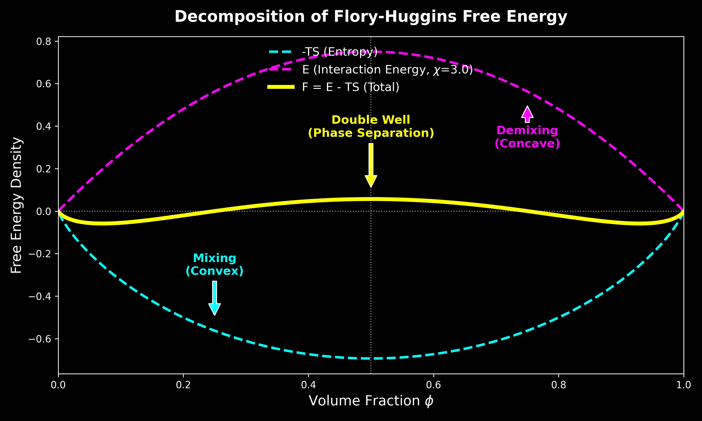

# 引言：从宏观热力学迈向微观统计物理

**第12讲**聚焦于液态混合物的宏观热力学性质，深入探讨了渗透压、交换化学势等概念，并基于唯象引入的自由能密度函数 $f(\phi)$，建立了描述守恒型动力学的 Cahn-Hilliard 方程（Model B）。然而，**上一讲**的讨论虽然揭示了相分离的热力学驱动力源于自由能的非凸性（$f''(\phi) < 0$），但并未从**第一性原理**出发解释这种非凸性的微观起源，即分子间的相互作用究竟如何导致了宏观上的“混合”或“分相”。

从**第12讲**的结果可以看到，自由能密度 $f(\phi)$ 的非凸性是相分离发生的根本原因。然而，这一自由能函数在此前的讨论中仍然是**被“假定”的对象**。这自然引出一系列更为根本的问题：

- 自由能中的混合熵项 $\phi\ln\phi+(1-\phi)\ln(1-\phi)$ 是否必然存在？它是否可以从更底层的统计计数中推导出来？

- 相互作用项 $\chi\phi(1-\phi)$ 的具体形式从何而来？参数 $\chi$ 与微观相互作用强度之间究竟是什么关系？

- 为什么只需要最近邻相互作用，就足以在宏观上诱导出相分离这一集体现象？

这节课的核心目标正是填补这一理论空白，并由此建立从微观粒子相互作用到宏观自由能景观的完整逻辑链条。教授首先引入最简约、但物理内涵清晰的**晶格气体模型**，这是一种将连续流体空间离散化的简化模型，在数学结构上与磁学中的 Ising 模型高度同构。基于此模型，分析将从最底层的粒子占据数和最近邻相互作用出发，利用统计力学的核心工具——**配分函数 (Partition Function)**，推导描述二元混合物相变行为的核心理论：**Flory-Huggins 自由能理论**。

本讲的推导过程展示了处理**多体问题**的经典物理范式：首先构建微观哈密顿量，随后通过**平均场近似 (Mean-Field Approximation)** 将复杂的耦合多体问题简化为可解的单体问题，从而获得系统的自由能解析表达式。进一步地，课程将通过泰勒展开 (Taylor Expansion)，实现从离散晶格模型向连续场论的过渡，推导出包含空间梯度项的 **Ginzburg-Landau 自由能泛函**。这一泛函的建立直接为**第14讲**中深入探讨相分离动力学、推导 Cahn-Hilliard 方程的微观形式、计算色散关系以及确定最快生长模式 (Fastest Growing Mode) 奠定了形式上的数学基础。


# 1. 晶格气体模型 (The Lattice Gas Model)

为了建立描述溶质（Solute）和溶剂（Solvent）二元混合物的微观统计理论，这节课首先引入了统计物理中经典的“晶格气体模型”。作为一种从连续空间向离散空间过渡的简化模型，它不仅抓住了粒子占据与排斥体积的核心特征，还通过最近邻相互作用为相分离提供了能量驱动机制。该模型在数学结构上与磁学中的 Ising 模型高度同构，是推导 Flory-Huggins 自由能理论的微观基石。

## 1.1 模型的物理假设与空间离散化

在处理液体混合物时，直接追踪连续空间中海量粒子的位置和动量在数学上极其复杂且往往是不必要的。为了聚焦相变的核心机制，课程引入了以下三个关键的物理假设：

- **空间离散化 (Spatial Discretization)** ：连续的物理空间被划分为规则的网格（Lattice）。尽管课堂演示通常采用二维正方晶格（Square Lattice）作为直观示例，但该理论框架具有普适性，同样适用于三维立方晶格（Cubic Lattice）或其他维度的规则结构。

- **不可压缩性假设 (Incompressibility)** ：这是软物质物理中的一个核心约束。模型假设每一个晶格格点（Lattice Site）必须被且仅被一个粒子占据。这意味着系统中不存在空穴（Vacancies），系统的总体积（由总格点数 $N_{\text{tot}}$ 决定）是固定的，不随压强或温度的波动而改变。这一假设模拟了致密液体的不可压缩特性。

- **等体积近似** ：系统包含两种组分——粒子 P（溶质，Solute）和粒子 S（溶剂，Solvent）。为了适配刚性的晶格结构，模型假设这两类分子的分子体积相等，即每个分子恰好占据一个格点空间。

## 1.2 微观状态的描述：占据数变量

为了将系统的微观构型（Configuration）数学化，引入布尔类型的占据数变量 $\sigma_i$ 来标记第 $i$ 个格点的状态。这类似于 Ising 模型中的自旋变量，但在晶格气体中，它代表的是物质的种类。


定义如下：

$$
\sigma_i = 
\begin{cases} 
1, & \text{如果格点 } i \text{ 被溶质粒子 (Solute, P) 占据} \\
0, & \text{如果格点 } i \text{ 被溶剂粒子 (Solvent, S) 占据}
\end{cases}
$$

由此，系统的任意一个瞬时微观状态可以由序列 $\{\sigma_i\} = (\sigma_1, \sigma_2, \dots, \sigma_{N_{\text{tot}}})$ 唯一确定。对于一个包含 $N_{\text{tot}}$ 个格点的系统，所有可能的构型构成了统计系综的样本空间。

## 1.3 微观哈密顿量 (The Hamiltonian)

系统的热力学行为由其能量泛函，即哈密顿量 $\mathcal{H}$ 决定。在晶格气体模型中，假设相互作用是短程的，仅存在于**最近邻**（Nearest-Neighbor）格点之间。

对于晶格中任意两个相邻的格点 $i$ 和 $j$（记作配对 $\langle i,j \rangle$），根据占据粒子的种类组合，存在三种可能的相互作用能。数学上可以通过构造由 $\sigma_i$ 组成的“筛选算符”来精确表达这些能量项：

1.**溶质-溶质相互作用 (P-P)** ：

* 发生条件：$\sigma_i=1$ 且 $\sigma_j=1$

* 能量贡献：$\varepsilon_{pp}$

* 筛选算符：$\sigma_i \sigma_j$。只有当两者均为 1 时，该项才为 1，否则为 0

2.**溶剂-溶剂相互作用 (S-S)** ：

* 发生条件：$\sigma_i=0$ 且 $\sigma_j=0$

* 能量贡献：$\varepsilon_{ss}$

* 筛选算符：$(1-\sigma_i)(1-\sigma_j)$。利用布尔逻辑，只有当两者均为 0 时，该项才为 1

3.**溶质-溶剂相互作用 (P-S)** ：

* 发生条件：一个格点是溶质 ($\sigma=1$) 而另一个是溶剂 ($\sigma=0$)

* 能量贡献：$\varepsilon_{ps}$

* 筛选算符：$\sigma_i (1-\sigma_j) + \sigma_j (1-\sigma_i)$。这一项涵盖了 $(\sigma_i=1, \sigma_j=0)$ 和 $(\sigma_i=0, \sigma_j=1)$ 两种非对称情况

将所有最近邻对的贡献进行求和，即得到描述系统总能量的微观哈密顿量：

$$
\mathcal{H}(\{\sigma_i\}) = \sum_{\langle i j \rangle} \left[ \varepsilon_{pp} \, \sigma_i \sigma_j + \varepsilon_{ss} \, (1-\sigma_i)(1-\sigma_j) + \varepsilon_{ps} \left(\sigma_i (1-\sigma_j) + \sigma_j (1-\sigma_i) \right) \right]
$$

这一公式是本节课的核心，也是理解从微观相互作用过渡到宏观相分离的关键。它表明，系统是否发生相分离，并不取决于 $\varepsilon_{pp}$ 或 $\varepsilon_{ss}$ 的绝对大小，而是取决于**同类粒子聚集**（$\varepsilon_{pp}, \varepsilon_{ss}$项）与**异类粒子混合**（$\varepsilon_{ps}$项）之间的能量竞争。

值得强调的是，尽管上述哈密顿量的写法看似繁琐，但它的物理结构与**Ising模型**是**严格同构的**。如果定义新的自旋变量

$$
s_i = 2\sigma_i - 1 \in \{+1, -1\},
$$

则可以将晶格气体模型一一映射为具有最近邻相互作用的 Ising 模型。两者的区别不在于数学结构，而在于**物理解释**：在 Ising 模型中，$s_i$ 表示磁矩方向；而在晶格气体模型中，$\sigma_i$ 表示不同化学组分的占据状态。

正是这种同构关系，使得磁性相变、合金分相与液态混合物问题在统计物理中可以被统一对待。


## 1.4 配分函数的挑战与应对

统计力学的核心任务是计算配分函数（Partition Function, $\mathcal{Z}$），它是连接微观状态与宏观热力学量（如自由能）的桥梁。对于正则系综（固定温度 $T$ 和粒子数），配分函数是对所有可能的微观构型 $\{\sigma_i\}$ 的玻尔兹曼因子进行求和：

$$
\mathcal{Z} = \sum_{\{\sigma_i\}} \exp\left[ -\beta \, \mathcal{H}(\{\sigma_i\}) \right]
$$

其中 $\beta = \frac{1}{k_B T}$ 是逆热力学温度。

直接计算这个配分函数在数学上极具挑战性。困难在于哈密顿量中存在的**交叉项**（如 $\sigma_i \sigma_j$）。这些项使得相邻格点的状态在概率上不再独立，导致整个系统的 $N_{\text{tot}}$ 个变量紧密耦合在一起。除了在一维和特定二维情况下（如 Onsager 解），该问题没有通用的解析解。

为了克服这一困难，课程采用了一种物理上直观的近似策略：将自由能 $F = U - TS$ 分解为两部分分别处理：

1.**熵 (Entropy, $S$)** ：假设无相互作用，仅考虑粒子排列的几何组合数。

2.**内能 (Energy, $U$)** ：利用**平均场近似 (Mean-Field Approximation)** ，忽略局域涨落，计算平均相互作用能。

接下来的两节将分别推导这两部分，最终重构出 Flory-Huggins 自由能表达式。

# 2. 混合熵 (Mixing Entropy)

在构建亥姆霍兹自由能 $F = E - TS$ 的过程中，为了分离出熵的贡献，教授首先构建了一个理想化的参考系：**无相互作用系统**。这对应于相互作用能 $\varepsilon = 0$ 的极限情况，或者等效于高温极限（$T \to \infty$），此时粒子的热运动能量远大于势能，系统的物理行为完全由构型熵（Configurational Entropy）主导。在这一框架下，混合的驱动力纯粹源于统计学上的几何排列可能性。

## 2.1 状态数的组合计数

基于晶格气体模型，系统被定义为包含 $N_{\text{tot}}$ 个格点的刚性网格。根据**不可压缩性假设**，每一个格点必须且只能被一个粒子占据。若系统中溶质粒子（P）的数量为 $N_p$，溶剂粒子（S）的数量为 $N_s$，则必须满足粒子数守恒约束：
$$
N_{\text{tot}} = N_p + N_s
$$

在微正则系综（Microcanonical Ensemble）的假设下，系统能量简并，每一个可能的微观构型出现的概率是均等的。因此，系统的总微观状态数 $\Omega$ 等价于将 $N_p$ 个不可区分的溶质粒子和 $N_s$ 个不可区分的溶剂粒子排列在 $N_{\text{tot}}$ 个格点上的组合数。根据组合数学原理：

$$
\Omega(N_p, N_{\text{tot}}) = \binom{N_{\text{tot}}}{N_p} = \frac{N_{\text{tot}}!}{N_p! N_s!} = \frac{N_{\text{tot}}!}{N_p! (N_{\text{tot}} - N_p)!}
$$

这一公式直观地反映了混合的统计本质：随着两种粒子数量趋于相等，可排列的组合数 $\Omega$ 将呈指数级增长。

## 2.2 斯特林近似与熵的解析式

根据玻尔兹曼熵公式 $S = k_B \ln \Omega$，我们需要计算大数组合数的对数。在热力学极限下（$N \sim 10^{23}$），可以使用**斯特林近似 (Stirling's Approximation)** ：

$$
\ln N! \approx N \ln N - N
$$

将组合数公式代入熵的表达式并展开：

$$
\begin{aligned}
\frac{S}{k_B} &= \ln (N_{\text{tot}}!) - \ln (N_p!) - \ln (N_s!) \\
&\approx (N_{\text{tot}} \ln N_{\text{tot}} - N_{\text{tot}}) - (N_p \ln N_p - N_p) - (N_s \ln N_s - N_s)
\end{aligned}
$$

注意到展开式中的线性项相互抵消：

$$-N_{\text{tot}} - (-N_p - N_s) = -N_{\text{tot}} + (N_p + N_s) = 0$$

因此，熵的表达式简化为：

$$
\frac{S}{k_B} \approx N_{\text{tot}} \ln N_{\text{tot}} - N_p \ln N_p - N_s \ln N_s
$$

为了得到与系统尺寸无关的**强度量 (Intensive Quantity)** ，便于描述连续场，引入无量纲的序参量——溶质的**体积分数 (Volume Fraction)** $\phi$：

$$
\phi \equiv \frac{N_p}{N_{\text{tot}}} \quad \Rightarrow \quad N_p = \phi N_{\text{tot}}
$$

根据归一化条件，溶剂的体积分数为：

$$
1-\phi = \frac{N_s}{N_{\text{tot}}} \quad \Rightarrow \quad N_s = (1-\phi) N_{\text{tot}}
$$

将 $\phi$ 代回熵的表达式，利用对数性质 $\ln(AB) = \ln A + \ln B$ 进行整理：

$$
\begin{aligned}
\frac{S}{k_B} &= N_{\text{tot}} \ln N_{\text{tot}} - [\phi N_{\text{tot}} \ln (\phi N_{\text{tot}}) + (1-\phi) N_{\text{tot}} \ln ((1-\phi) N_{\text{tot}})] \\
&= N_{\text{tot}} \ln N_{\text{tot}} - N_{\text{tot}} [\phi (\ln \phi + \ln N_{\text{tot}}) + (1-\phi) (\ln (1-\phi) + \ln N_{\text{tot}})] \\
&= N_{\text{tot}} \ln N_{\text{tot}} - N_{\text{tot}} [\phi \ln \phi + (1-\phi) \ln (1 - \phi) + (\phi + 1 - \phi) \ln N_{\text{tot}}]
\end{aligned}
$$

可以看到，包含 $\ln N_{\text{tot}}$ 的项最终相互抵消。由此得到经典的**混合熵 (Mixing Entropy)** 公式：

$$
S_{\text{mix}} = - k_B N_{\text{tot}} \left[ \phi \ln \phi + (1-\phi) \ln (1 - \phi) \right]
$$

## 2.3 混合熵的物理图景

为了直观理解熵对系统稳定性的影响，教授展示了熵函数 $S(\phi)$ 以及其对自由能贡献项 $-TS(\phi)$ 的几何特征。


混合自由能的分解与演化 (Free Energy of Mixing)，该图展示了 Flory-Huggins 自由能密度 $f(\phi)$ 的两个组成部分及其随 $\chi$ 参数的变化。

**左图：**混合熵 (Entropy of Mixing)。展示了无量纲化的熵贡献 $-S/k_B$ 随体积分数 $\phi$ 的变化。该曲线呈现开口向上的“U型”特征（凸函数），极小值位于 $\phi=0.5$，表明熵总是倾向于驱动系统达到均匀混合状态。

**右图：**总自由能密度 (Total Free Energy Density)。展示了在不同 Flory-Huggins 参数 $\chi$ 下自由能曲线的演化。

* 曲线 **1 ($\chi < 2$)：**高温状态，自由能为单势阱（凸函数），系统处于均匀混合相。

* 曲线 **2 ($\chi = 2$)：**临界状态，曲线底部变得平坦。

* 曲线 **3 ($\chi > 2$)：**低温状态，自由能分裂为双势阱（非凸函数），系统发生自发对称性破缺，倾向于分离为两个共存相。


这一数学结果蕴含了深刻的物理意义：

1.**自由能的凸性 (Convexity)** ：虽然熵 $S(\phi)$ 本身是一个开口向下的凹函数（Hill shape），但它对亥姆霍兹自由能的贡献是 $-TS$。函数 $g(\phi) = \phi \ln \phi + (1-\phi) \ln (1-\phi)$ 在定义域 $(0, 1)$ 内二阶导数恒为正：

$$
g''(\phi) = \frac{1}{\phi} + \frac{1}{1-\phi} > 0
$$

这意味着 $-TS$ 项是一个**凸函数 (Convex Function)** 。在热力学中，自由能的凸性保证了系统的稳定性。熵项的作用就像一个“弹簧”，总是倾向于将系统的浓度拉向自由能最低点。

2.**最大无序度与混合驱动力**：

自由能中的熵项在 $\phi = 0.5$ 处达到全局极小值。这表明，在没有任何能量偏好的情况下，系统最稳定的宏观状态是溶质和溶剂各占一半的均匀混合态，因为此时对应的微观状态数最多，混乱度最大。

3.**边界奇异性与纯物质的不稳定性**：

观察函数在边界 $\phi \to 0$ 或 $\phi \to 1$ 处的行为，其一阶导数（即化学势的一部分）趋于无穷大：

$$
\lim_{\phi \to 0} \frac{d}{d\phi}(\phi \ln \phi) = -\infty
$$


这一数学奇异性具有重要的物理推论：**向纯物质中加入极其微量的杂质，总是能引起系统自由能的急剧下降（斜率无穷大）。**这解释了为什么在自然界中很难获得**绝对纯净的物质**——熵总是驱动物质去“被污染”或发生混合，这是热力学第三定律在混合问题上的体现。

从自由能的角度看，混合熵的作用可以被理解为一种“统计弹性”。任何偏离均匀混合状态的浓度涨落，都会显著减少系统可实现的微观构型数，从而导致熵下降、自由能上升。这种效应在数学上体现为熵项对自由能的贡献始终是一个严格凸函数。

因此，在没有相互作用能的情况下，自由能景观中只存在一个唯一的极小值，对应于完全均匀的混合态。这一结论并非特定模型的结果，而是源于不可压缩系统中组合熵的普适性质。


# 3. 平均场理论与相互作用能 (Mean-Field Theory)

在处理完熵的贡献后，理论构建的下一步是解决哈密顿量中复杂的相互作用项。由于配分函数中的双体相互作用算符 $\sigma_i \sigma_j$ 导致了格点间的状态高度耦合，直接求解在数学上几乎是不可能的。为了克服这一困难，课程引入了**平均场理论 (Mean-Field Theory)** 。这一方法不仅是统计物理处理多体问题的标准范式，也是理解从微观粒子相互作用过渡到宏观连续场论（如 Ginzburg-Landau 理论）的关键步骤。

## 3.1 粗粒化与平均场假设

平均场理论的核心物理思想是**忽略局域涨落 (Neglecting Local Fluctuations)** 。在真实的晶格系统中，某个特定格点 $i$ 的状态 $\sigma_i$ 会受到其具体邻居（$\sigma_j$）瞬时状态的强烈影响，表现出短程关联。平均场近似则通过“抹平”这种差异，假设每个粒子感受到的不再是周围邻居的具体状态，而是一个由整个系统的平均密度决定的均匀背景场（即“平均场”）。


在数学处理上，这意味着进行如下算符替换：

1.**单体算符替换**：将微观占据数变量 $\sigma_i$ 替换为其系综平均值，即局域体积分数 $\phi$：
$$
\sigma_i \approx \langle \sigma_i \rangle = \phi
$$

2.**关联解耦**：这是最关键的一步近似，假设不同格点的状态是统计独立的，从而将耦合的双体项拆解为单体项的乘积：
$$
\langle \sigma_i \sigma_j \rangle \approx \langle \sigma_i \rangle \langle \sigma_j \rangle = \phi^2
$$

这种处理方法本质上是一种**粗粒化 (Coarse-graining)** 过程。分析的视角从单个晶格点上升到了一个包含大量粒子的介观体积元，在这个尺度上，密度被认为是均匀的。

需要指出的是，平均场近似的代价在于它系统性地忽略了短程关联和涨落效应。换言之，模型假设每个格点所“看到”的环境都是统计意义上完全相同的。这一近似在高维或远离临界点时是合理的，但在临界点附近会低估涨落的重要性。这一缺陷将在后续引入 Ginzburg 判据时再次出现。


## 3.2 平均场能量 $E_{\text{mf}}$ 的推导

基于上述假设，可以计算系统的平均相互作用能 $E_{\text{mf}}(\phi)$。这需要统计在整个晶格中，各类最近邻粒子对（Pair）出现的平均期望次数。

设 $z$ 为晶格的**配位数 (Coordination number)** ，即每个格点拥有的最近邻格点数（如二维正方晶格 $z=4$，三维立方晶格 $z=6$）。系统中总的最近邻连接数为 $\frac{1}{2} z N_{\text{tot}}$，系数 $\frac{1}{2}$ 源于对每一对连接 $\langle i, j \rangle$ 的去重计数。

各项对总能量的贡献如下：

1.**溶质-溶质对 (P-P)** ：

* 出现概率：$\phi \cdot \phi = \phi^2$

* 能量贡献：$\frac{1}{2} z N_{\text{tot}} \cdot \varepsilon_{pp} \cdot \phi^2$

2.**溶剂-溶剂对 (S-S)** ：

* 出现概率：$(1-\phi) \cdot (1-\phi) = (1-\phi)^2$

* 能量贡献：$\frac{1}{2} z N_{\text{tot}} \cdot \varepsilon_{ss} \cdot (1-\phi)^2$


3.**溶质-溶剂对 (P-S)** ：

* 出现概率：$\phi(1-\phi)$。由于哈密顿量中包含 $\sigma_i(1-\sigma_j)$ 和 $\sigma_j(1-\sigma_i)$ 两项（即 $i$ 是溶质 $j$ 是溶剂，反之亦然），需要乘以系数 2。

* 能量贡献：$\frac{1}{2} z N_{\text{tot}} \cdot \varepsilon_{ps} \cdot 2\phi(1-\phi)$

将三部分加和，得到平均场能量密度的表达式：

$$
E_{\text{mf}}(\phi) = \frac{1}{2} z N_{\text{tot}} \left[ \varepsilon_{pp} \phi^2 + \varepsilon_{ss} (1-\phi)^2 + 2 \varepsilon_{ps} \phi (1-\phi) \right]
$$

## 3.3 混合能与 Flory-Huggins 参数 $\chi$

为了揭示相变的物理本质，需要将上述能量表达式重组。在热力学中，真正驱动相变的不是系统的绝对能量，而是**混合能 (Energy of Mixing)** ，即混合后的能量相对于混合前纯组分能量的差值。

纯溶质状态（$\phi=1$）的能量为 $E_{\text{pure P}} = \frac{1}{2} z N_{\text{tot}} \varepsilon_{pp}$，纯溶剂状态（$\phi=0$）的能量为 $E_{\text{pure S}} = \frac{1}{2} z N_{\text{tot}} \varepsilon_{ss}$。

定义混合相互作用能 $\Delta E_{\text{int}}$：

$$
\Delta E_{\text{int}}(\phi) = E_{\text{mf}}(\phi) - \left[ \phi E_{\text{pure P}} + (1-\phi) E_{\text{pure S}} \right]
$$

将 $E_{\text{mf}}$ 的表达式代入并利用恒等式 $\phi^2 - \phi = -\phi(1-\phi)$ 和 $(1-\phi)^2 - (1-\phi) = -\phi(1-\phi)$ 进行化简，可以惊奇地发现，所有的线性项和常数项都被消去，只留下了与 $\phi(1-\phi)$ 成正比的项：

$$
\Delta E_{\text{int}}(\phi) = \frac{1}{2} z N_{\text{tot}} \phi(1-\phi) \left[ 2\varepsilon_{ps} - (\varepsilon_{pp} + \varepsilon_{ss}) \right]
$$

这里定义了一个核心物理量——**交换相互作用能 (Exchange Interaction Energy)** $\Delta \varepsilon$：

$$
\Delta \varepsilon = \varepsilon_{pp} + \varepsilon_{ss} - 2\varepsilon_{ps}
$$

**物理意义**：

* $\Delta \varepsilon$ 衡量了断开一个 P-P 对和一个 S-S 对，并形成两个 P-S 对所需的净能量变化。

* 若 $\Delta \varepsilon < 0$：意味着 $\varepsilon_{pp} + \varepsilon_{ss} < 2\varepsilon_{ps}$。同类粒子聚集的能量更低（更稳定），异类接触会增加系统能量。这对应于**吸引相互作用** ，倾向于驱动系统发生**分相 (Demixing)** 。

为了方便后续讨论，引入无量纲的 **Flory-Huggins 参数 $\chi$** ：

$$
\chi \equiv -\frac{z}{2} \frac{\Delta \varepsilon}{k_B T}
$$

当存在分相倾向时，即 $\Delta \varepsilon < 0$，参数 $\chi$ 为正值。

$\chi$ 参数深刻地反映了**焓（相互作用）与温度的竞争**：$\chi \propto 1/T$。温度越低，$\chi$ 越大，相互作用能相对于热运动（$k_B T$）的比重就越大。

最终，系统的相互作用能密度可以简洁地表示为：

$$
\frac{E_{\text{int}}}{N_{\text{tot}} k_B T} = \chi \phi (1 - \phi)
$$

这个简洁的抛物线形式（$\chi \phi - \chi \phi^2$）构成了 Flory-Huggins 自由能中的能量部分，它将与熵项共同决定系统的相图结构。

# 4. Flory-Huggins 自由能及其物理图景

在前两节的推导中，教授分别从纯粹的统计计数角度获得了**混合熵**（倾向于无序混合），以及从平均场近似角度获得了**相互作用能**（倾向于有序分相）。这小节的核心任务是将这两部分竞争机制整合到同一个热力学势函数中——亥姆霍兹自由能（Helmholtz Free Energy）。由此得到的 **Flory-Huggins 自由能理论**，不仅是高分子物理的基石，更为理解软物质系统中的相分离行为提供了最基础的数学框架。

## 4.1 自由能密度的构建

根据热力学定义，亥姆霍兹自由能 $F$ 由内能 $E$ 和熵 $S$ 共同决定：
$$
F = E - TS
$$

为了得到与系统宏观尺寸无关的强度量，通常将总自由能归一化为单格点（或单分子）的**自由能密度** $f(\phi)$。将第 2 小节推导的混合熵 $S_{\text{mix}}$ 和第 3 小节推导的平均场能量 $E_{\text{mf}}$ 代入，并以热能 $k_B T$ 作为能量单位进行无量纲化：

$$
\frac{f(\phi)}{k_B T} = \frac{E_{\text{mf}} - T S_{\text{mix}}}{N_{\text{tot}} k_B T}
$$

将具体的表达式代入上式，即可得到经典的 **Flory-Huggins 自由能方程**：

$$
\frac{f(\phi)}{k_B T} = \underbrace{\phi \ln \phi + (1-\phi) \ln (1-\phi)}_{\text{熵项 (Entropic Term)}} + \underbrace{\chi \phi (1 - \phi)}_{\text{相互作用项 (Interaction Term)}}
$$

这一方程形式极其简洁优美。虽然 Flory 和 Huggins 最初是为了描述高分子链溶液（考虑链连接性导致的熵减，通常第一项会有 $1/N$ 因子）而推导的，但对于本课程讨论的简单晶格气体模型（对应链长 $N=1$ 的溶质与溶剂混合），该形式是严格成立的平均场结果。

## 4.2 熵与能量的竞争机制

该方程深刻揭示了相变背后的物理本质——**有序（能量主导）与无序（熵主导）之间的永恒竞争**。自由能曲线 $f(\phi)$ 的最终形状，完全取决于这两项几何特征的叠加。



 
1.**熵项 (Entropic Contribution)** ：

* **数学形式**：$x \ln x$ 型凸函数。

* **几何特征**：二阶导数恒为正，曲线始终**开口向上（Convex）**。

* **物理作用**：熵总是倾向于最大化混乱度。它驱动自由能曲线保持凸性，使得极小值位于 $\phi=0.5$。这是一种**混合力**，试图消除任何浓度差异，使系统均一化。

2.**相互作用项 (Interaction Contribution)** ：

* **数学形式**：当 $\chi > 0$（存在有效吸引）时，为 $-\phi^2$ 型凹函数。

* **几何特征**：二阶导数为负，曲线**开口向下（Concave）**。

* **物理作用**：能量项倾向于让同类粒子聚集以降低势能。它试图使自由能曲线中间隆起，形成势垒。这是一种**分相力**，驱动系统偏离均匀态，向纯相（$\phi=0$ 或 $1$）演化。

## 4.3 温度调控与双势阱的形成

在 Flory-Huggins 理论中，决定谁胜谁负的关键控制参数是 $\chi$。由于 $\chi$ 定义中包含逆温度因子：
$$
\chi \propto \frac{\Delta \varepsilon}{k_B T} \propto \frac{1}{T}
$$
因此，调节温度等效于调节熵与能量的相对权重，从而改变自由能景观（Landscape）的拓扑结构。


-   **高温极限 ($\chi \to 0$)** ：

热运动剧烈，熵项绝对主导。自由能曲线呈现完美的 U 型（凸函数），系统在 $\phi=0.5$ 处拥有唯一的全局极小值。此时，无论初始浓度如何，溶质与溶剂都能无限互溶（Miscible）。

-   **低温极限 ($\chi$ 增大)** ：

随着温度降低，$\chi$ 值增大，能量项的权重增加。当 $\chi$ 超过某一**临界值**时，能量项在 $\phi=0.5$ 附近的“隆起”效应战胜了熵项的“下凹”效应。自由能曲线的中心部分被“顶起”，从单势阱分裂为**双势阱 (Double-Well Potential)** 。

这种从单势阱到双势阱的拓扑转变，标志着系统发生了**相变**。原本稳定的均匀混合态变得不再稳定，系统倾向于分裂成两个不同浓度的共存相，以分别占据两个更深的势阱。接下来的第 5 小节将通过数学分析，精确定位这一相变发生的临界条件。

# 5. 相图分析 (Phase Diagram Analysis)

通过前一节的推导，自由能密度函数 $f(\phi)$ 的解析形式已完全确立。接下来的核心任务是探究该函数几何形状随参数 $\chi$（即温度 $T$）的演化规律，从而绘制出描述系统热力学状态的相图。这一过程主要涉及对 $f(\phi)$ 进行微积分分析，以确定其凸凹性转变的临界条件。

## 5.1 临界点 (Critical Point) 的推导

相变发生的临界点对应于自由能曲线在对称中心 $\phi=0.5$ 处发生几何性质突变的时刻：曲线由单势阱（凸）转变为双势阱（凹）。在数学上，这对应于二阶导数（曲率）和三阶导数同时为零的点。对于本模型的对称势能，三阶导数在 $\phi=0.5$ 处天然为零，因此只需考察二阶导数。

首先，计算无量纲自由能密度 $f(\phi)$ 关于 $\phi$ 的一阶导数，这对应于**交换化学势差**（相差一个常数）：

$$
\frac{1}{k_B T} \frac{\partial f}{\partial \phi} = \ln \phi + 1 - \ln(1-\phi) - 1 + \chi(1 - 2\phi) = \ln\left(\frac{\phi}{1-\phi}\right) + \chi(1-2\phi)
$$

接着，计算二阶导数，这对应于**热力学稳定性**（逆极化率）：

$$
\frac{1}{k_B T} \frac{\partial^2 f}{\partial \phi^2} = \frac{1}{\phi} - \frac{1}{1-\phi}(-1) - 2\chi = \frac{1}{\phi} + \frac{1}{1-\phi} - 2\chi = \frac{1}{\phi(1-\phi)} - 2\chi
$$

在临界点，系统处于边缘稳定状态，要求二阶导数为零。考虑到晶格气体模型的粒子空穴对称性，临界浓度必然位于 $\phi_c = 0.5$。将此值代入二阶导数公式求解临界 $\chi_c$：

$$
\frac{1}{0.5(1-0.5)} - 2\chi_c = 0 \quad \Rightarrow \quad \frac{1}{0.25} - 2\chi_c = 0 \quad \Rightarrow \quad 4 - 2\chi_c = 0
$$

解得 Flory-Huggins 理论的普适临界值：

$$
\chi_c = 2
$$

因此，临界点坐标为 $(\phi_c=0.5, \chi_c=2)$。这构成了相图的顶点：

- 当 $\chi < 2$（高温）时，二阶导数恒正，系统总是互溶的（Miscible）。

- 当 $\chi > 2$（低温）时，中间区域二阶导数变负，系统可能发生相分离。

## 5.2 旋节线 (Spinodal Line) 与失稳分解

相图中界定**热力学不稳定区域 (Unstable Region)** 的边界曲线被称为旋节线。在该区域内，自由能函数的二阶导数小于零（$f''(\phi) < 0$），这意味着自由能曲线局部呈现“上凸”形状。

**物理意义**：当系统处于此区域时，扩散系数 $D \propto f''(\phi)$ 变为负值。这意味着任何微小的浓度涨落 $\delta \phi$ 不会被扩散抹平，反而会导致总自由能降低并被迅速放大。这种无需克服势垒、由“负扩散”驱动的自发相分离机制被称为**旋节线分解 (Spinodal Decomposition)** 。

旋节线的数学定义为二阶导数的零点轨迹 $f''(\phi) = 0$。利用 5.1 节中的二阶导数公式：

$$
\frac{1}{\phi(1-\phi)} - 2\chi_s = 0
$$

反解出 $\chi_s$ 作为 $\phi$ 的函数，即得到旋节线方程：

$$
\chi_s(\phi) = \frac{1}{2\phi(1-\phi)}
$$

在 $\chi - \phi$ 相图上，这是一条顶点位于 $(0.5, 2)$ 并开口向上的抛物线型曲线（在 $\chi$ 轴方向）。

## 5.3 双节线 (Binodal Line) 与成核生长

双节线（又称共存曲线）界定了**热力学平衡共存区域**。即使系统处于旋节线之外（$f'' > 0$），只要 $\chi > 2$，系统仍可能处于**亚稳态 (Metastable)** 。此时，虽然微小涨落是稳定的，但如果出现足够大的“核”（Nucleus），系统仍会演化至能量更低的分相状态。这种机制被称为**成核-生长 (Nucleation and Growth)** 。

双节线的位置由热力学平衡条件决定：两相的化学势相等，且渗透压相等。在几何上，这对应于 Maxwell **公切线构造 (Common Tangent Construction)** 。

在这一对称模型中，自由能函数关于 $\phi=0.5$ 完全对称，因此两相共存时的公切线必然是水平线（斜率为 0）。这意味着化学势在两相中均为零，从而使 Maxwell 构造在数学上退化为“寻找自由能的两个极小值点”。这一简化是对称晶格气体模型的一个特殊优势。因此，寻找切点简化为寻找自由能密度 $f(\phi)$ 的两个极小值点，即一阶导数为零的点：


$$
\frac{\partial f}{\partial \phi} = 0 \quad \Rightarrow \quad \ln\left(\frac{\phi_b}{1-\phi_b}\right) + \chi_b(1-2\phi_b) = 0
$$

整理得到双节线的隐式方程（通常写成 $\chi$ 关于 $\phi$ 的函数以便绘图）：

$$
\chi_b(\phi) = \frac{1}{2\phi - 1} \ln\left(\frac{\phi}{1-\phi}\right)
$$

（注：利用对数性质 $\ln(x) = -\ln(1/x)$，该式也可写作 $\frac{1}{1-2\phi} \ln(\frac{1-\phi}{\phi})$，两者完全等价。）


二元混合物的相图与稳定性 (Phase Diagram & Stability)

**左图：自由能密度曲线 (Free Energy Density)** 。展示了在不同相互作用参数 $\chi$ 下，无量纲自由能密度 $f \cdot v / k_B T$ 随体积分数 $\phi$ 的变化。

* $\chi=1.6$ (高温)：曲线为凸函数（Convex），对应均匀单相区。
* $\chi=2.0$ (临界点)：曲线底部平坦。
* $\chi=2.5$ (低温)：曲线呈现双势阱特征（Concave区域），系统处于不稳定或亚稳态。

**右图：相图 (Phase Diagram)** 。
* **纵轴**：Flory-Huggins 参数 $\chi$（与温度 $T$ 成反比）。
* **横轴**：体积分数 $\phi$。
* **Binodal 线（实线）**：共存曲线，区分了单相区（Single Phase）与两相共存区。
* **Spinodal 线（虚线）**：失稳曲线，区分了亚稳区（Metastable）与不稳定区（Unstable）。在不稳定区内，系统发生 Spinodal 分解。


# 6. 空间异质性与 Ginzburg-Landau 泛函

此前推导的 Flory-Huggins 理论本质上是一个**平均场理论**。它隐含了一个关键假设：系统在宏观尺度上是均匀的，或者仅仅关注两个体相（Bulk Phases）的热力学平衡，而完全忽略了相与相之间必然存在的**界面 (Interface)** 。然而，在真实的相分离动力学过程中，空间异质性是不可避免的。为了描述浓度场 $\phi(\vec{r})$ 在空间上的连续变化，以及由此产生的界面张力，必须对自由能进行修正，引入空间梯度项。这一步标志着从局域热力学向非局域场论的跨越。

## 6.1 梯度项的微观物理起源

如果在空间位置 $\vec{r}$ 处浓度场不均匀，即 $\nabla \phi \neq 0$，这意味着相邻区域的成分存在差异。从微观晶格模型来看，这种差异会导致最近邻粒子对的相互作用能发生改变。

在连续极限下，可以将相邻格点 $\vec{r}_j$ 处的浓度场在参考点 $\vec{r}_i$ 处进行泰勒展开：
$$
\phi(\vec{r}_j) \approx \phi(\vec{r}_i) + (\vec{r}_j - \vec{r}_i) \cdot \nabla \phi + \frac{1}{2} [(\vec{r}_j - \vec{r}_i) \cdot \nabla]^2 \phi
$$

将此展开式代回微观哈密顿量 $\mathcal{H} \sim \sum \sigma_i \sigma_j$ 并转化为连续积分。推导显示，零阶项 $\phi^2$ 贡献了局域相互作用能（已包含在 $\chi$ 项中），一阶项由于晶格中心对称性而在求和中抵消，而主导的非均匀修正来自二阶项，即梯度的平方 $(\nabla \phi)^2$。


从宏观对称性角度审视，这一项的存在也是必然的：

1.  **标量性**：自由能必须是标量。

2.  **旋转不变性**：梯度项必须是标量积形式。

3.  **能量罚分**：对于各向同性流体，界面总是携带正的过剩能量（界面张力），因此梯度项系数必须为正，以惩罚剧烈的浓度变化。

## 6.2 Ginzburg-Landau 自由能泛函

将局域的 Flory-Huggins 自由能密度 $f(\phi)$ 与非局域的梯度修正项结合，系统的总自由能不再是一个简单的函数，而是一个依赖于场分布 $\phi(\vec{r})$ 的**泛函 (Functional)** ：

$$
F[\phi(\vec{r})] = \int d^3r \left[ f(\phi(\vec{r})) + \frac{\kappa}{2} (\nabla \phi)^2 \right]
$$

公式各项物理意义如下：
-   $f(\phi)$：**局域自由能密度**，即第 4 节推导出的双势阱函数。它驱动系统局部分离为两个平衡浓度。

-   $\frac{\kappa}{2} (\nabla \phi)^2$：**梯度能量项 (Gradient Energy Term)** 。它惩罚空间不均匀性，倾向于使浓度场平滑。

-   $\kappa$：**刚度系数 (Stiffness Coefficient)** ，是一个正的常数。它与相互作用范围和强度直接相关，量纲分析表明 $\kappa \sim k_B T \chi a^2$（其中 $a$ 为晶格常数）。

这一形式即为著名的 **Ginzburg-Landau 自由能泛函**。它是现代理论物理处理连续相变、超导、超流及软物质相分离的标准数学框架。


上方给出了 Ginzburg–Landau 自由能泛函：

$$
F[\phi] = \int d^d r \left[ f(\phi) + \frac{\kappa}{2} (\nabla \phi)^2 \right],
$$

其中 $f(\phi)$ 决定体系的局域相行为，而梯度项刻画空间非均匀性（界面）的能量代价。下方左图展示了对称的 $\phi^4$ 型局域自由能密度：

$$
f(\phi) = -\frac{r}{2} (\phi - \phi_c)^2 + \frac{u}{4} (\phi - \phi_c)^4,
$$

随着参数 $r$ 变号，由单势阱向双势阱转变，对应连续（第二类）相变及自发对称性破缺；右图在此基础上引入三次项后势能不再对称，体现了一阶相变中势阱不等深、亚稳态与跃迁行为。该图为后续临界点附近的 $\phi^4$ 展开与动力学方程推导提供直观基础。


## 6.3 临界点附近的 $\phi^4$ 展开

从上图所示的势能地形可以看出，临界点附近体系的关键特征已完全由局域自由能在低阶多项式近似下的拓扑结构所决定，这正是 Landau 理论的出发点。虽然 Flory-Huggins 形式的 $f(\phi)$ 精确描述了高分子混合物，但其对数项在解析处理上较为繁琐。在临界点附近（$\chi \approx \chi_c, \phi \approx \phi_c$），序参量 $\delta \phi = \phi - \phi_c$ 很小，可以利用泰勒级数将 $f(\phi)$ 展开为多项式形式，这就是 Landau 相变理论的核心。

定义序参量偏差 $\psi(\vec{r}) = \phi(\vec{r}) - 0.5$。利用展开式 $\ln(1+x) \approx x - x^2/2 + x^3/3 - x^4/4$，Flory-Huggins 密度 $f(\psi)$ 可展开至四阶：

$$
\frac{f(\psi)}{k_B T} \approx f_0 + \frac{1}{2} (2 - \chi) \psi^2 + \frac{1}{12} \psi^4
$$

忽略常数项 $f_0$，可得到通用的 Landau 多项式形式：

$$
f(\psi) \approx \frac{r}{2} \psi^2 + \frac{u}{4} \psi^4
$$

其中系数的物理意义至关重要：
-   **$r \propto (2 - \chi) \propto (T - T_c)$** ：控制相变的线性参数。
    * 当 $\chi < 2$（高温）时，$r > 0$，势能为单势阱，$\psi=0$ 是稳定点。
    * 当 $\chi > 2$（低温）时，$r < 0$，势能原点失稳（凸起），系统发生自发对称性破缺。
    
-   **$u > 0$** ：四阶项系数，保证了热力学稳定性（势能有下界），使系统在大 $\psi$ 处重新稳定，从而形成双势阱结构。

这一简化后的 $\phi^4$ 理论模型，不仅保留了相变的核心拓扑特征（对称性破缺），而且是下一节课推导 **Cahn-Hilliard 动力学方程** 的直接数学起点。

## 6.4 代码实践：晶格气体模型的动态可视化

代码实践将模拟晶格气体系统在不同相互作用强度（由Flory-Huggins参数 $\chi$ 控制）下的演化过程，并同步展示系统的自由能景观。验证Flory-Huggins理论中熵与能量竞争的预测，并动态展示从均匀混合到相分离的自组织过程。

```python
# =========================
# Model: lattice gas (Ising-like) with Kawasaki dynamics (particle-conserving)
# sigma=1: solute (P), sigma=0: solvent (S)
# Energy: H = -J * sum_<ij> s_i s_j with s_i = 2*sigma_i-1 in {+1,-1}
# Mapping to chi: chi ~ 2 z J / (k_B T)  (up to conventions); here we use a monotone proxy J(T)=J0*chi/chi_c
# =========================

import numpy as np
import matplotlib.pyplot as plt
import matplotlib.animation as animation
import matplotlib.patches as patches 
plt.style.use("dark_background")

def flory_huggins_f(phi, chi):
    eps = 1e-12
    phi = np.clip(phi, eps, 1 - eps)
    return phi*np.log(phi) + (1-phi)*np.log(1-phi) + chi*phi*(1-phi)

def to_spin(sigma):
    return 2*sigma - 1

def neighbor_sum(s, i, j):
    # periodic boundary conditions
    n = s.shape[0]
    return s[(i-1)%n, j] + s[(i+1)%n, j] + s[i, (j-1)%n] + s[i, (j+1)%n]

def kawasaki_sweep(sigma, betaJ, rng):
    # One Monte Carlo sweep: attempt N^2 swaps of unlike neighbors
    n = sigma.shape[0]
    for _ in range(n*n):
        i = rng.integers(0, n)
        j = rng.integers(0, n)
        # pick a random neighbor
        di, dj = [(1,0),(-1,0),(0,1),(0,-1)][rng.integers(0,4)]
        i2, j2 = (i+di)%n, (j+dj)%n
        if sigma[i,j] == sigma[i2,j2]:
            continue
        # compute ΔE for swapping sigma(i,j) and sigma(i2,j2) using spin form
        s = to_spin(sigma)
        si, sj = s[i,j], s[i2,j2]
        # local fields excluding the pair bond double-count issues handled by exact local diff
        hi = neighbor_sum(s, i, j) - sj
        hj = neighbor_sum(s, i2, j2) - si
        # Energy contribution for site i (excluding bond to j2): -J si hi ; after swap si' = sj -> -J sj hi
        # similarly for site j2: -J sj hj ; after swap sj' = si -> -J si hj
        # Bond between i and j2: -J si sj ; after swap -J sj si (same) -> cancels
        dE = - (sj*hi + si*hj) + (si*hi + sj*hj)  # multiplied by J later via betaJ
        # Metropolis accept
        if dE <= 0 or rng.random() < np.exp(-betaJ * dE):
            sigma[i,j], sigma[i2,j2] = sigma[i2,j2], sigma[i,j]
    return sigma

N = 64                 # lattice size N x N
phi0 = 0.45             # overall solute fraction (conserved)
seed = 42
rng = np.random.default_rng(seed)

# initialize sigma with fixed composition
phi_flat = np.zeros(N*N, dtype=np.int8)
phi_flat[:int(phi0*N*N)] = 1
rng.shuffle(phi_flat)
sigma = phi_flat.reshape(N, N)

# chi schedule for animation (controls free-energy landscape + interaction strength)
chi_c = 2.0
chi_values = np.linspace(0.8, 3.2, 120)

# link chi -> betaJ (monotone) : choose a scale so that around chi_c we see coarsening
J0 = 0.35
betaJ_values = J0 * (chi_values / chi_c)

# per-frame MC sweeps (increase for smoother coarsening, but slower)
mc_sweeps_per_frame = 4

fig, (axL, axR) = plt.subplots(1, 2, figsize=(12, 5), facecolor="black")
axL.set_title("Lattice Gas: Kawasaki Dynamics (Conserved)")
axL.axis("off")

solvent_color = '#ADD8E6'  # Light blue
solute_color = '#90EE90'   # Light green

# Function to draw lattice points (replaces draw_lattice with circles)
def draw_lattice(sigma):
    grid_size = sigma.shape[0]
    spacing = 0.6
    start_x = 1
    start_y = 1.5
    
    # Clear previous artists
    axL.clear()
    axL.set_title("Lattice Gas: Kawasaki Dynamics (Conserved)")
    axL.axis("off")
    
    # Plot points for each site
    x_coords = []
    y_coords = []
    colors = []
    
    for i in range(grid_size):
        for j in range(grid_size):
            x = start_x + i * spacing
            y = start_y + j * spacing
            state = sigma[i, j]
            color = solute_color if state == 1 else solvent_color
            x_coords.append(x)
            y_coords.append(y)
            colors.append(color)
    
    # Use scatter plot for efficiency and simplicity
    axL.scatter(x_coords, y_coords, c=colors, s=40, edgecolors='white', linewidth=0.5)

draw_lattice(sigma)

phi_grid = np.linspace(0.001, 0.999, 700)
lineR, = axR.plot([], [], lw=2)
dotR, = axR.plot([], [], marker="o", markersize=6, linestyle="")
axR.set_xlim(0, 1)
axR.set_ylim(-0.8, 0.2)
axR.set_xlabel("Volume Fraction $\\phi$")
axR.set_ylabel("Dimensionless Free Energy $f(\\phi)/k_BT$")
titleR = axR.set_title("")
axR.grid(alpha=0.15)

def update(frame):
    global sigma
    chi = float(chi_values[frame])
    betaJ = float(betaJ_values[frame])
    # evolve lattice configuration at current interaction strength
    for _ in range(mc_sweeps_per_frame):
        sigma = kawasaki_sweep(sigma, betaJ, rng)
    
    axL.clear()
    axL.set_title("Lattice Gas: Kawasaki Dynamics (Conserved)")
    axL.axis("off")
    draw_lattice(sigma)
    
    # free energy curve (shifted) at current chi
    f = flory_huggins_f(phi_grid, chi)
    lineR.set_data(phi_grid, f)
    # mark the conserved average composition on the free-energy curve
    f0 = flory_huggins_f(np.array([phi0]), chi)[0] 
    dotR.set_data([phi0], [f0])
    titleR.set_text(f"Free Energy Landscape: $\\chi = {chi:.2f}$ (right dot is system average $\\phi$)")

    return lineR, dotR, titleR  

ani = animation.FuncAnimation(fig, update, frames=len(chi_values), interval=80, blit=False)
ani.save("lattice_gas_vs_free_energy.gif", writer="pillow", fps=12)
plt.close(fig)
print("Saved: lattice_gas_vs_free_energy.gif")
```


**晶格构型（左图）：**
随着相互作用参数 $\chi$ 从小到大逐步增加，晶格气体从高温下的均匀混合态演化为低温下的相分离态。在小 $\chi$ 时，溶质与溶剂在晶格上随机分布，体系高度无序；当 $\chi$ 增大接近临界值时，微小的浓度涨落开始出现并被放大，局域团簇迅速生长并相互并合，呈现出典型的旋节线分解特征；在更大的 $\chi$ 下，系统最终形成两个宏观共存相，中间由清晰的界面分隔。整个过程中，总体组成 $\phi_0$ 保持守恒，但空间结构发生了从“随机混合”到“宏观分相”的质变。

**自由能景观（右图）：**
对应地，Flory–Huggins 自由能密度 $f(\phi)$ 随 $\chi$ 的增加经历了拓扑结构的演化：在小 $\chi$（高温）下，自由能为单一的凸形势阱，其唯一极小值位于 $\phi=0.5$，熵效应主导并稳定均匀混合态；随着 $\chi$ 增大，自由能曲线底部逐渐变平，在临界点附近出现曲率为零的区域；当 $\chi$ 超过临界值后，自由能中心隆起并分裂为双势阱结构，对应两种稳定的共存相。此时，自由能的非凸性（$f''(\phi)<0$）为相分离提供了热力学驱动力，而系统的平均组成则通过相共存而非均匀态来实现自由能最小化。

Flory-Huggins理论的核心思想——**熵与能量的竞争**。当温度较高（$\chi$ 较小）时，熵占主导，系统保持均匀混合；当温度降低（$\chi$ 增大）时，能量项（同类粒子聚集）的优势逐渐显现，最终战胜熵，导致系统发生相分离。

# 总结

从理论结构上看，本讲完成的是一次关键的“**中尺度闭环**”：从微观粒子占据与最近邻相互作用出发，通过统计计数与平均场近似，构建了一个既包含熵驱动、又包含能量竞争的自由能函数。这一函数不仅解释了相图的几何结构，也为后续动力学方程提供了严格的热力学起点。

* **微观统计基础**：从晶格气体模型出发，通过对微观状态的统计计数，推导出了混合熵的解析式，阐明了熵作为“混乱度量”倾向于驱动系统混合的物理本质。

* **平均场近似**：利用平均场理论（Mean-Field Theory），成功处理了复杂的粒子间多体相互作用，引入了关键的 Flory-Huggins 参数 $\chi$，将相互作用能简化为依赖于 $\chi \phi (1-\phi)$ 的形式。

* **相图的数学重构**：结合熵与能量得到的自由能密度函数 $f(\phi)$，完美解释了二元混合物相图的拓扑结构，给出了临界点、**旋节线**（Spinodal）和**双节线**（Binodal）的严格数学定义。

* **从局域到非局域**：最后，通过引入空间梯度项，构建了 Ginzburg-Landau 自由能泛函，并对其在临界点附近进行了 $\phi^4$ 展开，完成了向连续场论的过渡。

目前得到的 Ginzburg-Landau 泛函 $F[\phi]$ 描述的是系统的**静态能量景观**。它告诉了系统“想去哪里”（能量最低态），但没有告诉系统“如何去”（演化路径和速率）。如果系统被置于 Spinodal 不稳定区域，相分离究竟是如何随时间发生的？迷宫般的斑图（Pattern）是如何生长的？

在**第14讲**中，课程将引入**动力学守恒定律**（连续性方程），结合本节课推导的自由能泛函，建立描述守恒型相分离动力学的著名的 **Cahn-Hilliard 方程 (Model B)**。届时将利用线性稳定性分析（Linear Stability Analysis），计算出相分离早期的**“最快生长模式”**（Fastest Growing Mode）和**色散关系**，从而真正揭示自组织斑图形成的动力学机制。

重要的是，Flory-Huggins 自由能并非一个经验假设，而是晶格气体模型在平均场极限下的必然结果。这一点使得后续引入的 Cahn-Hilliard 方程不再是“唯象模型”，而是具有明确统计物理根基的动力学理论。

