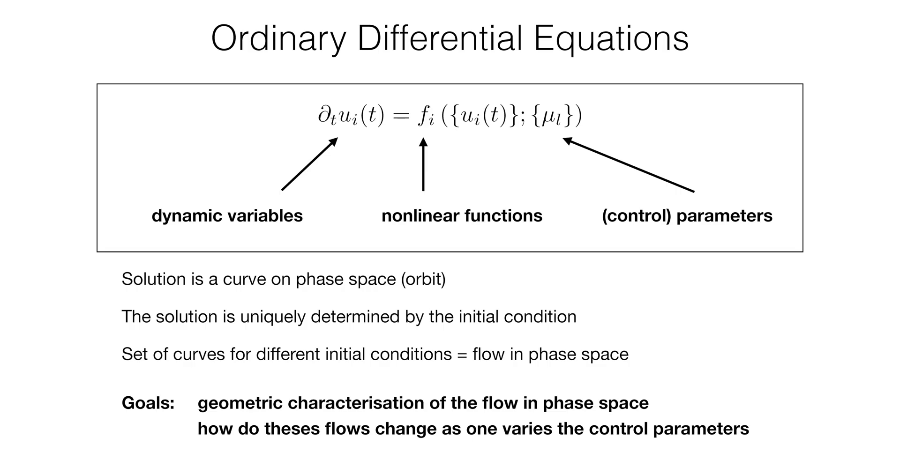
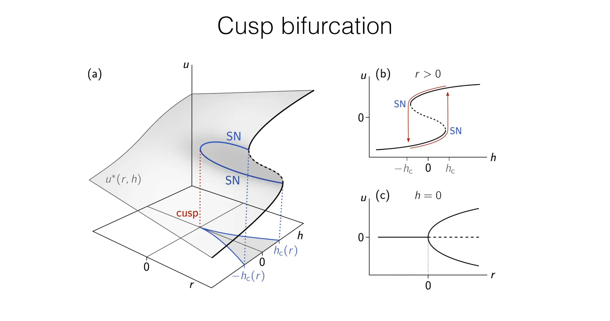

# 引言

在**第2讲**中，我们确立了动力系统理论作为描述集体行为的普适语言，其核心是研究动态变量 $u_i$ 如何随时间演化的常微分方程 (ODE)：$\partial_t u_i(t) = f_i(\{u_i(t)\}; \{\mu_l\})$。




**第3讲**深入探讨了这类系统中最简单、但也最根本的情形：**单分量一维系统** $\partial_t u = f(u; \mu)$。分析的焦点集中在当**单个控制参数** $\mu$ 变化时，系统的不动点（即平衡态）会如何发生质的改变。课程详细剖析了两种最基本的分岔类型：

1.**鞍结分岔 (Saddle-Node Bifurcation)** ：其常态形式为 $\partial_t u = -\mu + u^2$，它描述了不动点“凭空”产生和湮灭的最基本方式，是系统“引爆点”的数学原型。

2.**叉式分岔 (Pitchfork Bifurcation)** ：其常态形式为 $\partial_t u = ru - u^3$，它以系统的 $u \to -u$ 对称性为前提，完美描述了物理学中（如金茨堡-朗道理论）的“自发对称性破缺”现象。


这些例子都围绕着一个核心问题：当**单个**控制参数 $\mu$ 变化时，系统的定性行为会如何改变？

这节课将在此基础上迈出关键一步，探讨由**两个控制参数**调控时更为复杂和丰富的动力学现象。为此，将深入研究**尖点分岔 (Cusp Bifurcation)** 。尖点分岔可以被视为叉形分岔的直接推广：它描述了当一个具有 $u \to -u$ 对称性的系统（由参数 $r$ 控制，如叉形分岔）同时受到一个**破坏该对称性的外部场** $h$（第二个控制参数）作用时的普遍行为。

尖点分岔是一个至关重要的“组织中心”，它不仅统一了前述的分岔类型，更从数学上解释了两个在自然界和工程学中极为普遍的非线性现象：

1.**双稳态 (Bistability)** ：系统在完全相同的参数条件下，可以稳定地存在于两个不同的状态之一。

2.**滞后效应 (Hysteresis)** ：系统的当前状态依赖于其参数变化的历史路径，表现出“记忆效应”。

随后，课程将转向一种性质截然不同的分岔类型——**跨临界分岔 (Transcritical Bifurcation)** 。与之前不动点**数量**发生改变的分岔（鞍结分岔：0 $\leftrightarrow$ 2；叉形分岔：1 $\leftrightarrow$ 3）不同，跨临界分岔描述的是两个不动点在碰撞后**交换彼此稳定性**的过程。

为了使这些抽象的数学概念更具现实意义，这节课将紧密结合具体的物理和生物模型进行阐述。尖点分岔将通过经典的伊辛模型 (Ising model) 来理解，其中两个控制参数 $r$ 和 $h$ 分别对应于温度和外磁场。而跨临界分岔则将通过一个简洁而深刻的疾病传播模型——**接触过程 (Contact Process)** ——来进行分析，揭示流行病爆发的临界阈值现象。

这节课建立的一维系统分析方法将为后续课程奠定基础，届时这些思想将被推广到二维系统，为理解图灵斑图 (Turing Patterns) 等复杂的时空模式形成现象做好准备。


# 1. 尖点分岔 (Cusp Bifurcation): 双稳态与磁滞回线 (Bistability and Hysteresis)

在**第3讲**中，我们分析了具有 $u \to -u$ 对称性的系统，其典型代表是**叉形分岔 (Pitchfork Bifurcation)** 。这种对称性在物理上（如伊辛模型中没有外磁场）非常重要，它保证了 $u=0$ 永远是一个不动点，而新出现的有序态 $u^* = \pm\sqrt{r}$ 必须是成对、对称的。这小节将探讨一个更普遍、更丰富的场景：当这个 $u \to -u$ 对称性被一个外部因素**明确地破坏**时，系统的动力学行为会发生什么变化？这将引导我们从单参数 $r$ 的世界，进入由两个控制参数 $(r, h)$ 调控的动力学“相图”，其核心便是**尖点分岔 (Cusp Bifurcation)** 。

## 1.1. 从叉形分岔到尖点分岔：对称性破缺场

回顾上一讲，超临界叉形分岔的常态形式为 $\partial_t u = r u - u^3$。这个方程可以看作是一个粒子在对称的“势能景观” $V(u) = -\frac{r}{2}u^2 + \frac{1}{4}u^4$ 中的过阻尼运动。

现在，我们引入**第二个控制参数 $h$** ，它代表一个破坏系统对称性的外部“偏置”或“力场”。这使得动力学方程变为尖点分岔的常态形式 (normal form)：

$$
\partial_t u = r u - u^3 + h \equiv f(u; r, h)
$$

这个方程同样可以写成势能景观中的弛豫动力学形式 $\partial_t u = -\partial_u F(u)$，其中新的势函数 $F(u)$ 为：

$$
F(u) = -\frac{r}{2}u^2 + \frac{1}{4}u^4 - hu
$$

$$-\partial_u F = -\partial_u(-\frac{r}{2}u^2 + \frac{1}{4}u^4 - hu) = -(-ru + u^3 - h) = ru - u^3 + h$$


这个新增加的项 $-hu$ 在物理上具有深刻的意义。以**第2讲**和**第3讲**中讨论的伊辛模型为例：

* $u$ 仍然代表系统的磁化强度（序参量）。

* $r$ 仍然与温度相关（例如 $r \propto T_c - T$）。

* $h$ 则精确对应于施加在系统上的**外部磁场**。

当 $h=0$ 时，我们恢复了具有 $u \to -u$ 对称性的叉形分岔（即“自旋向上”和“自旋向下”完全等价）。而当 $h \neq 0$ 时，这个外磁场明确地打破了对称性（例如 $h>0$ 时，系统更倾向于 $u>0$ 的状态），势能景观 $F(u)$ 会发生倾斜。尖点分岔研究的正是这个更普适的、非对称系统 $(r, h)$ 参数空间中的完整动力学行为。

## 1.2. 求解不动点：一种图形化的方法

系统的长期行为由其不动点 $u^*$ 决定，不动点是动力学停止的地方，即 $\partial_t u = 0$。因此，我们需要求解代数方程：

$$
f(u; r, h) = r u - u^3 + h = 0
$$

这是一个关于 $u$ 的三次方程，直接求解 $u^*(r, h)$ 会很繁琐。课堂上介绍了一种非常直观的**图形化方法** 来理解解的结构。我们将方程变形为：

$$
r u - u^3 = -h
$$

这样，寻找不动点 $u^*$ 的问题就转化为了寻找**两条曲线交点**的问题：

1.一条是N形的**三次曲线** $y_2(u) = r u - u^3$。

2.另一条是**水平直线** $y_1(u) = -h$。

这种方法的巧妙之处在于，它将两个控制参数的作用清晰地分离开来：

* 参数 $r$ 决定了三次曲线 $y_2(u)$ 的**形状**（Shape）。

* 参数 $h$ 决定了水平直线 $y_1(u)$ 的**垂直位置**（Position）。

通过分析 $r$ 的符号，我们可以分两种情况来讨论 $y_2$ 的形状：

1.**当 $r < 0$ 时 (对应 $T > T_c$)** ：$y_2(u)$ 的导数 $y_2'(u) = r - 3u^2$ 恒为负。因此曲线 $y_2(u)$ 是单调递减的。这意味着无论水平直线 $y_1 = -h$ 在什么位置，它与 $y_2(u)$ 都**只有一个交点** 。因此，对于任意 $h$，系统只有一个不动点，是**单稳态的 (monostable)** 。

2.**当 $r > 0$ 时 (对应 $T < T_c$)** ：$y_2(u)$ 不再是单调的，它在 $u = \pm\sqrt{r/3}$ 处有局部极大值和极小值，呈现出一个 "N" 形。此时，交点的数量取决于水平直线 $y_1 = -h$ 的位置：

* 如果 $|h|$ 足够大（直线在N形之外），则**只有一个交点**。

* 如果 $|h|$ 恰好使得直线与 $y_2(u)$ 的某个极值点相切，则有**两个交点** 。

* 如果 $|h|$ 足够小（直线横切N形），则会有**三个交点**。


这张PPT展示了从**代数和图形分析**的角度解释了**双稳态 (Bistability)** 是如何从尖点分岔的常态方程中产生的。方程 Equilibria (fixed points): $f(u; r, h) = ru - u^3 + h = 0$ 定义了不动点：即动力学函数 $f(u)$ 为零的点。为了求解这个三次方程，PPT将其变形为寻找两条曲线的交点：$y2 = ru - u^3$（N形曲线）和 $y1 = h4$（水平线）。(请注意：根据顶部的方程 $ru - u^3 + h = 0$，正确的变形应该是 $ru - u^3 = -h$。因此，水平线应该是 $y_1 = -h$。PPT上 $y_1 = h$ 的标签很可能是一个小笔误，但这不影响图形分析的逻辑。)

图 (a) 展示了单稳态的情况 (r < 0)。当 $r < 0$ 时， $y_2 = ru - u^3$ 这条曲线是单调递减的。因此，无论水平线 $y_1$ 在什么位置，它们**永远只有一个交点** 。这意味着系统在 $r < 0$ 的参数区域（对应物理上的高温区）总是**单稳态的 (monostable)** 。

图 (b) 展示了双稳态的情况 (r > 0)。当 $r > 0$ 时， $y_2 = ru - u^3$ 曲线呈现 "N" 字形，拥有一个局部极大值和一个局部极小值。此时，交点的数量取决于 $h$：当 **$|h| > h_c(r)$** (直线在N形上下方) 时，存在 **1 个交点**（单稳态）；当 **$|h| = h_c(r)$** (直线与N形相切) 时，存在 **2 个交点**（这是鞍点-节点分岔的临界点）；当 **$|h| < h_c(r)$** (直线横穿N形) 时，存在 **3 个交点**（双稳态）。

图 (c) 是 $(r, h)$ **参数空间**的“地图”。它总结了图形分析的结果：在 $r < 0$ 时，系统总是单稳态的 (monostable)。在 $r > 0$ 时，存在一个由 $h_c(r) = \frac{2}{3\sqrt{3}}r^{3/2}$ 围成的楔形区域，在这个区域内系统是**双稳态的 (bistable)** 。这个楔形区域的尖端 $(0, 0)$ 就是**尖点 (Cusp)** 。

总结来说，PPT展示了为什么 $r > 0$ 是产生双稳态的必要条件，以及参数 $h$ 如何充当一个“开关”，控制系统在单稳态和双稳态之间切换。图 (c) 中的尖点区域正是图 (b) 中存在三个交点的参数范围。


这种几何方法将一个代数问题转化为直观的图像分析，让我们能清晰地“看到”不动点的数量是如何随着参数 $r$ 和 $h$ 的变化而改变的。


## 1.3. 双稳态、鞍点-节点分岔与尖点

上一节的图形分析表明，当 $r > 0$ 且 $|h|$ 足够小时，系统存在三个不动点。这种**三个不动点共存**（其中两个稳定，一个不稳定）的现象被称为**双稳态 (Bistability)** 。

为了严格确定这些不动点的稳定性，我们使用**第3讲**介绍的**线性稳定性分析 (LSA)** 。不动点的稳定性由导数 $f'(u^*)$ 的符号决定：

$$
f'(u) = \frac{\partial f}{\partial u} = \frac{\partial}{\partial u}(r u - u^3 + h) = r - 3u^2
$$

* **稳定 (Stable)**: $f'(u^*) < 0$

* **不稳定 (Unstable)**: $f'(u^*) > 0$

现在我们来分析 $r>0$ 时三个不动点的情况：

* N形曲线 $y_2(u)$ 的极值点（峰和谷）位于 $y_2'(u) = r - 3u^2 = 0$ 的地方，即 $u = \pm\sqrt{r/3}$。

* 在**中间区域** ($- \sqrt{r/3} < u < \sqrt{r/3}$)，$u^2 < r/3$，因此 $f'(u) = r - 3u^2 > 0$。位于此区域的**中间不动点**总是**不稳定**的。

* 在**两侧区域** ($|u| > \sqrt{r/3}$)，$u^2 > r/3$，因此 $f'(u) = r - 3u^2 < 0$。位于此区域的**两个外侧不动点**总是**稳定**的。

因此，双稳态区域确实由**两个稳定不动点**和一个**不稳定不动点**构成。

双稳态区域的边界在何处？这个边界恰好是**稳定**不动点与**不稳定**不动点相互碰撞并湮灭的地方。回顾**第3讲**，这正是**鞍点-节点分岔 (Saddle-Node Bifurcation)** 的特征。发生鞍点-节点分岔的临界条件是线性稳定性分析失效，即：

1.$f(u) = r u - u^3 + h = 0$ （系统位于不动点上）

2.$f'(u) = r - 3u^2 = 0$ （该不动点的稳定性即将改变）

我们可以通过求解这个方程组来找到 $(r, h)$ 参数空间中发生鞍点-节点分岔的边界线：

1.从条件 2 (切线条件)，解得发生分岔的位置点 $u_{\text{SN}}$ (SN = Saddle-Node)：

$$
u_{\text{SN}}^{\pm} = \pm \sqrt{r/3}
$$

这个解只在 $r > 0$ 时有实数意义（对应 $T < T_c$）。

2.将 $u_{\text{SN}}^{\pm}$ 代入条件 1 (不动点条件)，解出此时对应的临界磁场 $h_c$：

$$
h_c = - (r u_{\text{SN}}^{\pm} - (u_{\text{SN}}^{\pm})^3) = - u_{\text{SN}}^{\pm} (r - (u_{\text{SN}}^{\pm})^2)
$$

将 $(u_{\text{SN}}^{\pm})^2 = r/3$ 代入：

$$
h_c = - (\pm \sqrt{r/3}) (r - r/3) = \mp \sqrt{r/3} (\frac{2r}{3})
$$

整理后得到：

$$
h_c(r) = \pm \frac{2}{3\sqrt{3}}r^{3/2}
$$

这个方程 $h_c(r) \propto r^{3/2}$ 在 $(r, h)$ 参数平面上定义了两条曲线。它们在原点 $(r=0, h=0)$ 相遇，形成一个尖角，这便是“**尖点 (Cusp)** ” 名称的由来。

这两条曲线（鞍点-节点分岔线）围成的区域，就是系统存在三个不动点（即双稳态）的区域。原点 $(0,0)$ 是一个更高阶的分岔点，它像一个“组织中心”，两条鞍点-节点分岔线从这里延伸出来。这个尖点分岔图是系统动力学行为的完整“相图”。


## 1.4. 磁滞现象 (Hysteresis): 系统的记忆效应

**磁滞现象**是双稳态区域存在的直接动力学后果。它描述了系统状态对参数变化历史的依赖性。

想象一个实验：我们固定 $r > 0$（即系统温度低于 $T_c$，处于双稳态区域内），然后缓慢地来回改变外部磁场 $h$。

1.**$h$ 从负无穷增大**：

* 当 $h$ 非常负时，系统处于单稳态区域，只有一个稳定的不动点 $u < 0$（例如，磁铁被强行磁化为“下”）。

* 逐渐增大 $h$，系统状态会平滑地跟随这个 $u < 0$ 的稳定分支移动。

* 当 $h$ 增大到上边界临界值 $h_c(r) = +\frac{2}{3\sqrt{3}}r^{3/2}$ 时，系统到达鞍点-节点分岔点。此时，系统所在的这个 $u < 0$ 的稳定分支与 $u > 0$ 的不稳定分支碰撞后**湮灭**了。

* 系统无法再维持原来的状态，动力学 $\partial_t u > 0$ 接管，迫使系统发生一次剧烈的**“跳跃”**（教授称之为“灾难”，Catastrophe），跃迁到 $(r,h)$ 平面上唯一剩下的那个稳定分支，即 $u > 0$ 的状态（磁铁“翻转”为“上。

2.**$h$ 从正无穷减小**：

* 现在系统处于 $u > 0$ 的稳定分支（磁化为“上”）。

* 逐渐减小 $h$，系统会一直停留在 $u > 0$ 的这个稳定分支上，即使 $h$ 越过 $h=0$ 变为负值。

* 直到 $h$ 减小到下边界临界值 $-h_c(r) = -\frac{2}{3\sqrt{3}}r^{3/2}$ 时，系统到达另一个鞍点-节点分岔点。

* 此时 $u > 0$ 的稳定分支湮灭，系统被迫“跳跃”回 $u < 0$ 的稳定状态。

这个过程表明，系统状态 $u$ 在 $h$ 增大和减小时所遵循的路径**并不重合** ，形成了一个“**磁滞回线 (Hysteresis Loop)** ”。系统的当前状态不仅取决于当前的参数值 $(r, h)$，还取决于它是“从哪里来”的。



这张PPT从三个维度完整地展示了**尖点分岔 (Cusp Bifurcation)** 的几何结构，揭示了它作为一个“组织中心”的角色。图 (a) 是核心视图，它在一个三维空间中绘制了不动点 $u^*$ 如何随两个控制参数 $r$ 和 $h$ 变化。水平面是 $(r, h)$ **参数空间**，垂直轴是 $u$ **状态空间**。灰色的曲面 $u^*(r, h)$ 代表了系统所有可能的不动点（平衡态）。这个曲面最显著的特征是它像一张纸一样**折叠**了。在折叠区域内部（$r>0$ 且 $|h|$ 较小），一条垂线会与曲面相交**三次**，对应三个不动点（上、下两个分支稳定，中间虚线分支不稳定）。在折叠区域外部，垂线只与曲面相交**一次**，对应一个稳定的不动点。这个折叠区域在 $(r, h)$ 平面上的投影，就形成了由 **cusp（尖点）**和两条鞍点-节点分岔线 $h_c(r)$ 围成的楔形区域。

图 (b) 是图 (a) 在 $r > 0$ 处的一个**二维切片**（固定 $r$，观察 $u$ 随 $h$ 的变化）。它展示了经典的 "S" 形曲线，这正是**双稳态 (Bistability)** 的特征。红色箭头清晰地描绘了**磁滞回线 (Hysteresis Loop)** ：当 $h$ 从负值增大时，系统会停留在下方的稳定分支，直到 $h_c$ 点（鞍点-节点分岔，SN）处被迫“跳跃”到上方的稳定分支；反向减小 $h$ 时，系统会“记住”它在上分支的状态，直到 $-h_c$ 点才“跳跃”回下分支。

图 (c) 是图 (a) 在 $h = 0$ 处的另一个**二维切片**（固定 $h=0$，观察 $u$ 随 $r$ 的变化）。这正是我们在上一讲中学到的**（超临界）叉形分岔**图。它显示了当 $r$ 穿过0时，系统如何从一个对称的稳定态 ($u=0$) 自发地转变为两个新的、对称的稳定态。

总结来说，它将图 (b) 的磁滞现象和图 (c) 的叉形分岔统一为同一个三维几何结构（图 (a)）的两个不同侧面。尖点分岔是更普遍的结构，而叉形分岔只是它在 $h=0$ 这条对称线上的一个特例。

# 2. 尖点分岔的Python模拟与可视化

为了复现尖点分岔的动力学特性，代码实践将可视化势能景观、绘制磁滞回线以及展示参数空间中的尖点区域。

```python
import numpy as np
import matplotlib.pyplot as plt

# Set black theme style
plt.style.use('dark_background')

def plot_all_in_one(save_fig=False):
    """
    Plot all charts in one figure with black theme background
    
    Args:
        save_fig (bool): Whether to save the figure
    """
    # Create a figure with three subplots
    fig = plt.figure(figsize=(18, 6))
    
    # Subplot 1: Potential functions with different parameters
    ax1 = fig.add_subplot(131)
    
    # Plot multiple potential curves
    u = np.linspace(-2.5, 2.5, 500)
    
    # Case r < 0 (monostable)
    r1, h1 = -1, 0.2
    F1 = -0.5 * r1 * u**2 + 0.25 * u**4 - h1 * u
    ax1.plot(u, F1, lw=2, label=f'$r={r1:.1f}, h={h1:.1f}$')
    
    # Case r > 0, h = 0 (symmetric bistable)
    r2, h2 = 1, 0
    F2 = -0.5 * r2 * u**2 + 0.25 * u**4 - h2 * u
    ax1.plot(u, F2, lw=2, label=f'$r={r2:.1f}, h={h2:.1f}$')
    
    # Case r > 0, h != 0 (asymmetric bistable)
    r3, h3 = 1, 0.1
    F3 = -0.5 * r3 * u**2 + 0.25 * u**4 - h3 * u
    ax1.plot(u, F3, lw=2, label=f'$r={r3:.1f}, h={h3:.1f}$')
    
    ax1.set_title('Potential Landscapes $F(u)$')
    ax1.set_xlabel('$u$')
    ax1.set_ylabel('$F(u)$')
    ax1.grid(True, alpha=0.3)
    ax1.legend()
    
    # Subplot 2: Hysteresis loop
    ax2 = fig.add_subplot(132)
    r = 1  # For hysteresis phenomenon, r must be positive
    h_vals = np.linspace(-0.5, 0.5, 400)
    u_stars = []
    
    for h in h_vals:
        # Find roots of f(u) = r*u - u^3 + h = 0
        coeffs = [-1, 0, r, h]
        roots = np.roots(coeffs)
        # Filter for real roots
        real_roots = roots[np.isreal(roots)].real
        for root in sorted(real_roots):
            u_stars.append((h, root))
            
    h_coords, u_coords = zip(*u_stars)
    
    # Stability analysis: f'(u) = r - 3u^2
    stability = r - 3 * np.array(u_coords)**2
    stable_h = [h for h, s in zip(h_coords, stability) if s < 0]
    stable_u = [u for u, s in zip(u_coords, stability) if s < 0]
    unstable_h = [h for h, s in zip(h_coords, stability) if s >= 0]
    unstable_u = [u for u, s in zip(u_coords, stability) if s >= 0]
    
    ax2.plot(stable_h, stable_u, '.', color='cyan', markersize=4, label='Stable Fixed Points')
    ax2.plot(unstable_h, unstable_u, '--', color='orange', dashes=(5, 5), lw=2, label='Unstable Fixed Points')
    
    # Add jump arrows
    h_c = (2 / (3 * np.sqrt(3))) * r**(3/2)
    u_sn_pos = np.sqrt(r/3)
    u_sn_neg = -np.sqrt(r/3)
    
    # Jump up
    ax2.arrow(h_c, u_sn_pos, 0, -2*u_sn_pos, head_width=0.02, head_length=0.1, 
              fc='white', ec='white', lw=1.5)
    # Jump down
    ax2.arrow(-h_c, u_sn_neg, 0, 2*u_sn_neg, head_width=0.02, head_length=0.1, 
              fc='white', ec='white', lw=1.5)
    
    ax2.set_title(f'Hysteresis Loop for $r={r:.2f}$')
    ax2.set_xlabel('$h$')
    ax2.set_ylabel('Fixed Points $u^*$')
    ax2.legend()
    ax2.grid(True, alpha=0.3)
    
    # Subplot 3: Cusp bifurcation region diagram
    ax3 = fig.add_subplot(133)
    r_vals = np.linspace(0, 1.5, 200)
    h_c = (2 / (3 * np.sqrt(3))) * r_vals**(3/2)
    
    ax3.plot(r_vals, h_c, 'cyan', lw=2, label='Saddle-Node Bifurcation Line')
    ax3.plot(r_vals, -h_c, 'cyan', lw=2)
    
    ax3.fill_between(r_vals, h_c, -h_c, color='lightblue', alpha=0.2)
    
    ax3.text(1.0, 0, 'Bistable Region', horizontalalignment='center', color='white')
    ax3.text(0.5, 0.3, 'Monostable Region', horizontalalignment='center', color='white')
    ax3.text(0.5, -0.3, 'Monostable Region', horizontalalignment='center', color='white')
    
    ax3.set_title('Cusp Bifurcation Diagram')
    ax3.set_xlabel('$r$')
    ax3.set_ylabel('$h$')
    ax3.axhline(0, color='grey', linestyle='--', alpha=0.5)
    ax3.axvline(0, color='grey', linestyle='--', alpha=0.5)
    ax3.legend()
    ax3.grid(True, alpha=0.3)
    
    # Adjust layout
    plt.tight_layout()
    
    # Save figure (if needed)
    if save_fig:
        plt.savefig('cusp_bifurcation_combined.png', dpi=300, bbox_inches='tight', facecolor='black')
        print("Figure saved as cusp_bifurcation_combined.png")
    
    plt.show()

def plot_potential(r, h):
    """
    Plots the potential F(u) for the cusp bifurcation.
    
    Args:
        r (float): The control parameter r.
        h (float): The control parameter h.
    """
    u = np.linspace(-2.5, 2.5, 500)
    F = -0.5 * r * u**2 + 0.25 * u**4 - h * u
    
    plt.figure(figsize=(8, 6))
    plt.plot(u, F, lw=2)
    plt.title(f'Potential Landscape $F(u)$ for $r={r:.2f}$, $h={h:.2f}$')
    plt.xlabel('$u$')
    plt.ylabel('$F(u)$')
    plt.grid(True)
    plt.ylim(min(F) - 1, max(F) + 1 if r < 0 else 1)
    plt.show()

def plot_hysteresis_loop(r):
    """
    Plots the fixed points u* as a function of h for a given r > 0,
    illustrating the hysteresis loop.
    
    Args:
        r (float): The control parameter r. Must be positive.
    """
    if r <= 0:
        print("Hysteresis is only observed for r > 0.")
        return
        
    h_vals = np.linspace(-0.5, 0.5, 400)
    u_stars = []
    
    for h in h_vals:
        # Find roots of f(u) = r*u - u^3 + h = 0
        coeffs = [-1, 0, r, h]
        roots = np.roots(coeffs)
        # Filter for real roots
        real_roots = roots[np.isreal(roots)].real
        for root in sorted(real_roots):
            u_stars.append((h, root))
            
    h_coords, u_coords = zip(*u_stars)
    
    # Stability analysis: f'(u) = r - 3u^2
    stability = r - 3 * np.array(u_coords)**2
    stable_h = [h for h, s in zip(h_coords, stability) if s < 0]
    stable_u = [u for u, s in zip(u_coords, stability) if s < 0]
    unstable_h = [h for h, s in zip(h_coords, stability) if s >= 0]
    unstable_u = [u for u, s in zip(u_coords, stability) if s >= 0]
    
    plt.figure(figsize=(8, 6))
    plt.plot(stable_h, stable_u, 'b.', markersize=4, label='Stable Fixed Points')
    plt.plot(unstable_h, unstable_u, 'r--', dashes=(5, 5), lw=2, label='Unstable Fixed Points')
    
    # Add arrows to show the jumps
    h_c = (2 / (3 * np.sqrt(3))) * r**(3/2)
    u_sn_pos = np.sqrt(r/3)
    u_sn_neg = -np.sqrt(r/3)
    
    # Jump up
    plt.arrow(h_c, u_sn_pos, 0, -2*u_sn_pos, head_width=0.02, head_length=0.1, fc='k', ec='k', lw=1.5)
    # Jump down
    plt.arrow(-h_c, u_sn_neg, 0, 2*u_sn_neg, head_width=0.02, head_length=0.1, fc='k', ec='k', lw=1.5)
    
    plt.title(f'Hysteresis Loop for $r={r:.2f}$')
    plt.xlabel('$h$')
    plt.ylabel('Fixed Points $u^*$')
    plt.legend()
    plt.grid(True)
    plt.show()

def plot_cusp_region():
    """
    Plots the cusp bifurcation diagram in the (r, h) parameter space.
    """
    r_vals = np.linspace(0, 1.5, 200)
    h_c = (2 / (3 * np.sqrt(3))) * r_vals**(3/2)
    
    plt.figure(figsize=(8, 6))
    plt.plot(r_vals, h_c, 'k-', lw=2, label='Saddle-Node Bifurcation Line')
    plt.plot(r_vals, -h_c, 'k-', lw=2)
    
    plt.fill_between(r_vals, h_c, -h_c, color='lightblue', alpha=0.5)
    
    plt.text(1.0, 0, 'Bistable Region', horizontalalignment='center')
    plt.text(0.5, 0.3, 'Monostable Region', horizontalalignment='center')
    plt.text(0.5, -0.3, 'Monostable Region', horizontalalignment='center')
    
    plt.title('Cusp Bifurcation Diagram')
    plt.xlabel('$r$')
    plt.ylabel('$h$')
    plt.axhline(0, color='grey', linestyle='--')
    plt.axvline(0, color='grey', linestyle='--')
    plt.legend()
    plt.grid(True)
    plt.show()

if __name__ == '__main__':
    # Generate combined figure and save
    plot_all_in_one(save_fig=True)
```


**左图（势能景观）** 展示了系统的势能 $F(u)$ 如何随控制参数 $r$ 和 $h$ 变化。曲线显示，当 $r<0$ 时（如 $r=-1.0$），系统只有一个势能极小值点，对应一个**单稳态**系统。而当 $r>0$ 时（如 $r=1.0$），势能景观呈现出**双井**形态，这意味着系统存在两个稳定的平衡态（双稳态）。参数 $h$（如 $h=0.1$ 所示）的作用是打破 $h=0$ 时的对称性，使一个势能井低于另一个。

**中图（磁滞回线）** 深入探讨了 $r=1.0$ 时的双稳态区域。它绘制了不动点 $u^*$（纵轴）随参数 $h$（横轴）变化的“S”形曲线。青色实线代表稳定的不动点（对应势能的“谷底”），而橙色虚线是分离两个稳定态的不稳定不动点（对应势能的“山峰”）。白色箭头生动地展示了**磁滞现象**：当 $h$ 从负值增大时，系统会停留在下方的稳定分支，直到该分支消失的临界点（鞍点-节点分岔点），才被迫“跳跃”到上方的稳定分支；反之亦然。

**右图（分岔图）** 则是 $(r, h)$ **参数空间的“相图”**。它在 $r-h$ 平面上标出了由鞍点-节点分岔线（青色实线）围成的楔形**“双稳态区域”**。这个尖点图是一个完整的“地图”：位于该区域内的任何 $(r, h)$ 参数组合（如中图所示的 $r=1.0$），都会产生磁滞现象；而位于区域外的参数（如左图 $r=-1.0$ 的情况），系统则表现为单稳态。这三幅图紧密相连，从不同维度共同揭示了尖点分岔的丰富动力学行为。


# 3. 跨临界分岔 (Transcritical Bifurcation): 疾病传播模型

在分析了由两个参数 $(r, h)$ 控制的尖点分岔后，这节课将转向一种动力学行为截然不同的分岔类型。在之前讨论的分岔中（如鞍结分岔和叉形分岔），不动点的**数量**在分岔点会发生根本性的改变（例如从0个变为2个，或从1个变为3个）。

现在探讨的**跨临界分岔 (Transcritical Bifurcation)** 则不同：在分岔点前后，不动点的总数保持不变（例如，始终为两个）。它的核心特征是两个不动点在临界点**碰撞**，并**交换了彼此的稳定性**。一个原本稳定的状态会变得不稳定，而原本不稳定的状态则会变得稳定。

## 3.1. 一种新的分岔场景：接触过程

为了理解这种分岔的物理情景，课程引入了一个流行病学中的经典简化模型：**接触过程 (Contact Process)** 。

设想在一个**充分混合 (well-mixed)** 的环境中，存在两类个体：

* **M**: 代表生病/感染者 (sick)

* **C**: 代表健康/易感者 (healthy)

这个系统的演化由以下两个基本微观过程驱动：

1.**感染 (Infection):** 一个感染者 M 和一个健康者 C 相遇，健康者以一定的**感染速率 $\lambda$** (probability per unit time) 被感染，变为感染者。

$$
M + C \xrightarrow{\lambda} M + M
$$
    
2.**康复 (Recovery):** 一个感染者 M 以一定的**康复速率 $\delta$** 自发康复，变为健康者。

$$
M \xrightarrow{\delta} C
$$

## 3.2. 从微观规则到宏观速率方程

如何从这些描述个体行为的离散、随机的微观规则，过渡到描述整个群体宏观变化的确定性方程？这需要引入一个关键的物理假设：**平均场近似 (Mean-Field Approximation)** 。

这个假设源于“充分混合”的前提，它忽略了所有空间结构（如个体位置）或局部差异。它假设任意两个个体（如一个M和一个C）相遇的频率，正比于它们各自在系统中的**平均浓度（或数量）的乘积**。

基于这个假设，可以写出描述感染者数量 $m$ 和健康者数量 $c$ 随时间变化的**速率方程 (Rate Equations)** ：

**感染者 $m$ 的变化率 $\partial_t m$** ：

* **增加项（来自感染）**: 感染事件 $M+C \to M+M$ 发生的速率正比于 $m$ 和 $c$ 的乘积，即 $\lambda m c$。

* **减少项（来自康复）**: 康复事件 $M \to C$ 发生的速率正比于 $m$ 本身，即 $-\delta m$。
    
因此，感染者数量的净变化率为：

$$
\partial_t m = \lambda m c - \delta m
$$

**健康者 $c$ 的变化率 $\partial_t c$** ：

* **减少项（来自感染）**: 健康者在 $M+C \to M+M$ 事件中被消耗，速率为 $-\lambda m c$。

* **增加项（来自康复）**: 健康者在 $M \to C$ 事件中被产生，速率为 $+\delta m$。
    

因此，健康者数量的净变化率为：

$$
\partial_t c = -\lambda m c + \delta m
$$


## 3.3. 守恒律与维度约减

现在有了一对描述系统的耦合常微分方程。在分析之前，首先观察这对
方程的一个非常重要的特性。如果将两个方程相加，会得到：

$$
\partial_t (m+c) = (\lambda m c - \delta m) + (-\lambda m c + \delta m) = 0
$$

这个结果 $\partial_t(m+c) = 0$ 意味着总人口数量 $n = m + c$ 是一个**守恒量 (conservation law)** ；它不随时间变化。

**物理意义**：这个守恒律源于模型的假设。在这个系统中，没有个体的出生或死亡，个体只是在“健康”和“生病”两种状态之间转换。因此，总人数 $n$ 必然是恒定的。

这个守恒律极大地简化了分析。它意味着这个二维动力系统（变量为 $m$ 和 $c$）的演化轨迹，并不是在整个 $(m, c)$ 二维平面上任意移动，而是被**约束 (constrained)** 在 $m+c=n$ 这条一维直线上。

因此，可以通过代换 $c = n - m$ 来**消去一个变量**，将系统**约减 (reduce)** 为一个我们熟悉的一维系统，只用感染者数量 $m$ 来描述整个系统的状态：

$$
\partial_t m = \lambda m (n-m) - \delta m \equiv f(m)
$$

这个方程现在已经是一个标准的一维动力系统 $\partial_t u = f(u)$ 的形式。接下来，就可以运用**第3讲**中学习的分析方法：首先找出这个方程所有的不动点（平衡态），然后通过线性稳定性分析来判断这些平衡态的稳定性，从而揭示跨临界分岔的动力学行为。

# 4. 跨临界分岔的稳定性分析与Python模拟

通过引入“平均场近似”和利用“守恒律”，我们成功地将一个二维的疾病传播模型（接触过程）约减为一个标准的一维动力系统：

$$
\partial_t m = f(m) \equiv m \left[ \lambda (n-m) - \delta \right]
$$

现在的任务就是运用**第3讲**中确立的分析框架——即寻找不动点并进行线性稳定性分析——来彻底解剖这个方程，从而揭示跨临界分岔的动力学特性和流行病爆发的临界条件。

## 4.1. 不动点：无病状态 vs. 地方病状态

首先，寻找系统的所有平衡态（不动点 $m^*$），即求解 $f(m^*) = 0$：

$$
m^* \left[ \lambda (n - m^*) - \delta \right] = 0
$$

这个方程显然有两个可能的解，对应两种截然不同的宏观状态：

1.**$m_1^* = 0$**

* **物理意义**: 这个解对应**无病状态 (disease-free state)** 。无论参数 $\lambda$, $\delta$, $n$ 如何，系统中没有任何感染者（$m=0$）总是一个可能的平衡态。

2.**$\lambda (n - m^*) - \delta = 0 \implies m_2^* = n - \frac{\delta}{\lambda}$**

* **物理意义**: 这个解对应**地方病状态 (endemic state)** ，即疾病在人群中以一个非零的稳定比例 $m_2^*$ 持续存在。

* **物理约束**: 这个解只有在 $m_2^* \ge 0$ 时才具有物理意义（因为感染人数不能为负）。这要求 $n - \frac{\delta}{\lambda} \ge 0$，即总人口 $n$ 必须大于或等于一个临界值 $\frac{\delta}{\lambda}$。

## 4.2. 线性稳定性分析与稳定性交换

找到了两个不动点，但它们是稳定的（吸引子）还是不稳定的（排斥子）？这取决于控制参数 $n$（总人口）。运用线性稳定性分析 (LSA) 来判断。

首先，计算 $f(m)$ 的导数 $f'(m)$（即“恢复力”）：

$$
f(m) = \lambda n m - \lambda m^2 - \delta m
$$

$$
f'(m) = \frac{d f}{d m} = \lambda n - 2\lambda m - \delta
$$

接下来，分别在两个不动点处评估 $f'(m^*)$ 的符号：

**对于无病状态 $m_1^* = 0$** ：

$$
f'(0) = \lambda n - 2\lambda(0) - \delta = \lambda n - \delta
$$

**稳定 ($f' < 0$)**: 如果 $\lambda n - \delta < 0 \iff n < \frac{\delta}{\lambda}$。

**物理意义**: 如果总人口 $n$ **低于**临界值 $\frac{\delta}{\lambda}$（或者说，康复率 $\delta$ 相对较高），$m_1^*=0$ 是稳定的。任何零星的感染（一个小的 $m$ 扰动）都会因为 $f' < 0$ 而指数衰减，疾病会自行消亡。

**不稳定 ($f' > 0$)**: 如果 $\lambda n - \delta > 0 \iff n > \frac{\delta}{\lambda}$。

**物理意义**: 如果总人口 $n$ **超过**临界值 $\frac{\delta}{\lambda}$，$m_1^*=0$ 变得不稳定。此时 $f' > 0$，任何微小的感染扰动都会被指数放大，导致疾病在人群中爆发。

**对于地方病状态 $m_2^* = n - \frac{\delta}{\lambda}$**：

将 $m_2^*$ 代入 $f'(m)$：

$$
f'(m_2^*) = \lambda n - 2\lambda \left( n - \frac{\delta}{\lambda} \right) - \delta
$$

$$
f'(m_2^*) = \lambda n - 2\lambda n + 2\delta - \delta = \delta - \lambda n
$$

**稳定 ($f' < 0$)**: 如果 $\delta - \lambda n < 0 \iff n > \frac{\delta}{\lambda}$。

**物理意义**: 当总人口 $n$ **超过**临界值时，这个地方病状态是稳定的。系统在疾病爆发后，会稳定在这个非零的感染水平上。

**不稳定 ($f' > 0$)**: 如果 $\delta - \lambda n > 0 \iff n < \frac{\delta}{\lambda}$。

**物理意义**: 当总人口 $n$ **低于**临界值时，这个不动点是 $m_2^* < 0$（无物理意义），并且它在数学上也是不稳定的。

**跨临界分岔的本质：稳定性交换**

分析结果揭示了跨临界分岔的核心特征。请注意一个关键的数学关系：

$$
f'(m_2^*) = \delta - \lambda n = - (\lambda n - \delta) = -f'(m_1^*)
$$

两个不动点的稳定性**总是相反的**！

在临界点 $n_c = \frac{\delta}{\lambda}$ 处，两个不动点发生碰撞（$m_1^* = m_2^* = 0$），并且 $f' = 0$，LSA失效。当 $n$ 穿过这个临界点时，它们**交换了彼此的稳定性**：
* 当 $n < n_c$ 时：$m_1^*=0$ **稳定**；$m_2^*$ 不稳定（且无物理意义）。
* 当 $n > n_c$ 时：$m_1^*=0$ **不稳定**；$m_2^*$ **稳定**。

这个临界点 $n_c = \frac{\delta}{\lambda}$ 代表了**流行病爆发的阈值**。当人口密度低于此阈值时，无病状态是唯一稳定的结局；而当人口密度超过此阈值时，无病状态变得不稳定，系统会演化到一个新的、稳定的地方病状态。

在流行病学中，这个临界条件通常用**基本再生数 $R_0$** 来表示。$R_0 = \frac{\lambda n}{\delta}$（一个感染者在康复前平均能感染的健康人数）。分岔发生在 $R_0 = 1$ 时。

## 4.3. 分岔图与Python模拟

跨临界分岔的分岔图具有非常典型的特征：两条不动点分支线（$m^*=0$ 和 $m^*=n-\delta/\lambda$）在分岔点 $n_c$ 相交。在分岔点前后，稳定分支（通常用实线表示）和不稳定分支（通常用虚线表示）发生了互换。


这张PPT完整地概述了**跨临界分岔 (Transcritical bifurcation)** ，并使用“**接触过程 (contact process)** ”（流行病模型）作为物理案例 。

它首先定义了模型的微观规则 ：

1.**感染**：$M + C \xrightarrow{\lambda} M + M$

2.**康复**：$M \xrightarrow{\delta} C$

接着，它将这些规则转化为宏观的“**速率方程 (rate equations)** ” ，描述了感染者 ($m$) 和健康者 ($c$) 数量的变化 。一个关键洞察是“**动力学守恒总粒子数 (dynamics conserves the total number of particles)** ” ，即总人口 $n = m + c$ 是一个常数 ($\partial_t n = 0)$ 。

利用这个守恒律，系统可以被简化（约减）为一个**一维动力学方程**：$\partial_t m = \lambda m(n-m) - \delta m =: f(m)$ 。

**不动点 (fixed points)** ：通过求解 $f(m)=0$，找到了两个平衡状态：$m_1^* = 0$（无病状态）和 $m_2^* = n - \frac{\delta}{\lambda}$（地方病状态） 。

**稳定性分析 (stability analysis)** ：通过计算导数 $f'(m)$ ，得到了两个不动点的稳定性：$f'(m_1^*) = \lambda n - \delta$ 和 $f'(m_2^*) = \delta - \lambda n$ 。

最后，**分岔图** 直观地展示了分析结果。该图以总人口 $n$ 为控制参数 ，绘制了不动点 $m^*$ 的位置和稳定性。在临界点 $n_c = \frac{\delta}{\lambda}$ 处，两条不动点分支（$m_1^*$ 和 $m_2^*$）相交 。在这一点上，它们**交换了稳定性**：

当 $n < n_c$ 时，$m_1^*=0$ 分支是稳定的（实线），而 $m_2^*$ 分支是不稳定的（虚线）。

当 $n > n_c$ 时，$m_1^*=0$ 分支变为不稳定的（虚线），而 $m_2^*$ 分支获得了稳定性（实线）。

这展示了跨临界分岔的核心特征：不动点总数不变，但在临界点发生碰撞并交换稳定性。

下面的Python代码可以生成这个分岔图，展示稳定性交换的过程。

```python
import numpy as np
import matplotlib.pyplot as plt

def plot_transcritical_bifurcation(lam, delta):
    """
    Plots the bifurcation diagram for the transcritical bifurcation
    in the infection model.
    
    Args:
        lam (float): Infection rate lambda.
        delta (float): Recovery rate delta.
    """
    n_c = delta / lam
    n_vals = np.linspace(0, 2 * n_c, 400)
    
    # Fixed point 1: m1* = 0 (the horizontal axis)
    m1_star = np.zeros_like(n_vals)
    
    # Fixed point 2: m2* = n - delta/lambda (the diagonal line)
    m2_star = n_vals - n_c
    
    # --- Stability analysis ---
    
    # Branch 1 (m1* = 0)
    # m1* is stable for n < n_c
    n_stable1 = n_vals[n_vals < n_c]
    m_stable1 = np.zeros_like(n_stable1)
    # m1* is unstable for n > n_c
    n_unstable1 = n_vals[n_vals >= n_c]
    m_unstable1 = np.zeros_like(n_unstable1)
    
    # Branch 2 (m2* = n - n_c)
    # m2* is stable for n > n_c (and physically relevant)
    n_stable2 = n_vals[n_vals >= n_c]
    m_stable2 = n_stable2 - n_c
    # m2* is unstable for n < n_c (and unphysical)
    n_unstable2 = n_vals[n_vals < n_c]
    m_unstable2 = n_unstable2 - n_c
    
    
    plt.figure(figsize=(8, 6))
    plt.style.use('dark_background') # Use dark theme
    
    # Plot stable branches (e.g., in cyan)
    plt.plot(n_stable1, m_stable1, 'c-', lw=2.5, label='Stable Fixed Points')
    plt.plot(n_stable2, m_stable2, 'c-', lw=2.5)
    
    # Plot unstable branches (e.g., in magenta)
    plt.plot(n_unstable1, m_unstable1, 'm--', dashes=(5, 5), lw=2, label='Unstable Fixed Points')
    plt.plot(n_unstable2, m_unstable2, 'm--', dashes=(5, 5), lw=2)
    
    plt.axvline(n_c, color='yellow', linestyle=':', label=f'Bifurcation Point $n_c = \\delta/\\lambda = {n_c:.2f}$')
    
    plt.title('Transcritical Bifurcation in the Infection Model')
    plt.xlabel('Total Population Density $n$')
    plt.ylabel('Infected Population $m^*$')
    plt.legend()
    plt.grid(True, linestyle=':', alpha=0.4)
    plt.ylim(-0.5 * n_c, 1.1 * n_c) # Adjust ylim to show the unphysical branch
    plt.xlim(0, 2 * n_c)
    plt.show()

if __name__ == '__main__':
    # Define model parameters
    lambda_rate = 0.1  # Infection rate
    delta_rate = 0.5   # Recovery rate
    
    print("Plotting the transcritical bifurcation diagram...")
    plot_transcritical_bifurcation(lam=lambda_rate, delta=delta_rate)
```


两条不动点分支如何在临界点 $n_c$ 处相交，并且蓝色的稳定分支线从 $m^*=0$ 切换到了 $m^*=n-n_c$ 分支，而红色的不稳定虚线则反之。这正是稳定性交换的体现。


# 总结

这节课探讨了两种在物理和生物系统中具有普遍意义的分岔类型。首先，**尖点分岔 (Cusp Bifurcation)** 被构建为**第3讲**中叉形分岔的推广，是描述系统在**两个控制参数**（一个调谐参数 $r$ 和一个对称破缺场 $h$）作用下的通用模型。通过对尖点分岔的分析，理解了**双稳态 (Bistability)** 和**磁滞现象 (Hysteresis)** 的产生机制：系统可以在参数空间的一个特定区域内存在两个稳定的状态，并且其状态转换路径依赖于参数变化的历史。这为理解记忆效应、开关行为以及物理学中的一阶相变提供了坚实的理论基础。

其次，课程通过一个简洁的疾病传播模型（接触过程）引入了**跨临界分岔 (Transcritical Bifurcation)** 。与之前学习的分岔不同，跨临界分岔的核心特征是**稳定性的交换**，而非不动点数量的改变。分析显示，一个原本稳定的“无病”状态，在系统参数（如总人口 $n$）越过一个临界阈值 $n_c$ 后会变得不稳定，并将稳定性“传递”给一个新出现的“地方病”状态。这种分岔是理解生态系统、化学反应网络和流行病学中临界转变现象的关键。

**一维动力系统分析框架**通过寻找不动点（$f(u^*)=0$）和进行线性稳定性分析（判断 $f'(u^*)$ 的符号）来预测系统的长期行为。

这个分析框架是动力系统理论的基石，但它有其局限性：它只能处理单个动态变量。**第5讲**将从一维系统推广到**二维（2D）系统**，即形如 $\partial_t u = f(u, v)$ 和 $\partial_t v = g(u, v)$ 的耦合方程组。这一推广是至关重要的，因为**空间图案的形成**（如**图灵斑图 (Turing Patterns)** ）本质上是一个至少需要两个分量（例如，一个激活子和一个抑制子）才能产生的现象。

在二维系统中，稳定性不再由一个简单的导数决定，而是由**雅可比矩阵 (Jacobian Matrix)** 的 $2 \times 2$ 矩阵的特征值来判断。通过分析这个矩阵，将能理解在满足**质量守恒 (Mass Conserving)** 等生物物理约束条件下，一个空间均匀的系统是如何失稳并自发形成精美、静态的空间结构（即图灵斑图）的，这是自组织理论中最引人入胜的现象之一。
