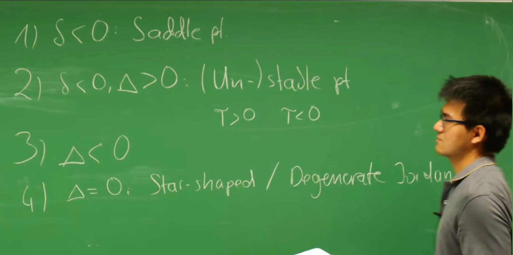
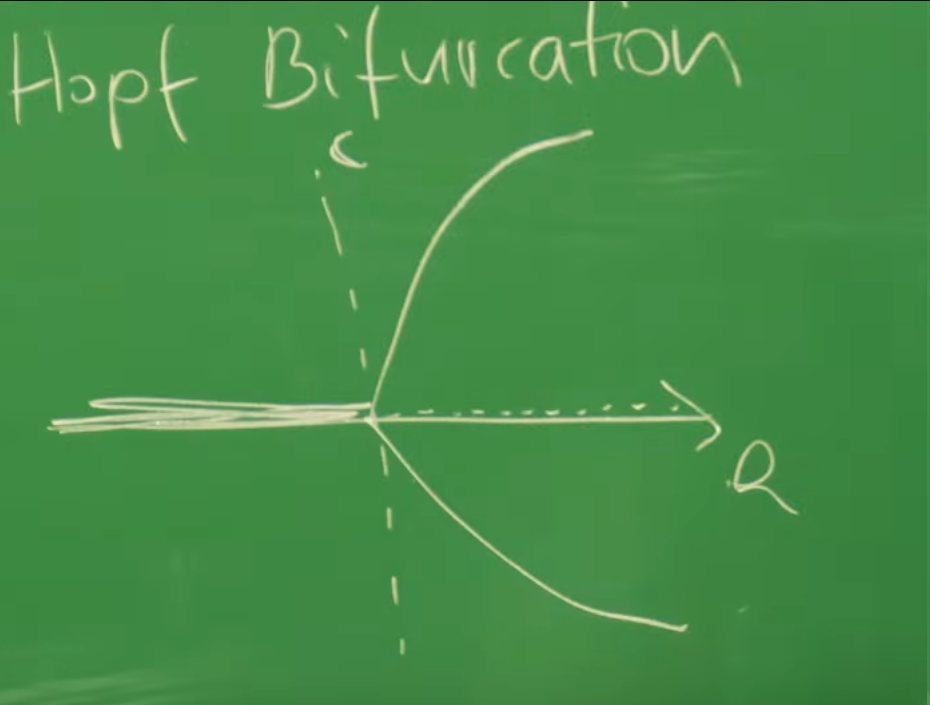

# 引言

在**第5讲**中，对二维动力系统（$\dot{m} = f(m,c), \dot{c} = g(m,c)$）的分析附加了一个关键的物理约束：**质量守恒**。这个约束在数学上表现为 $g = -f$，并导致了 $m(t) + c(t) = n = \text{const}$ 的守恒律。这一约束的动力学结果是极其深刻的：

1.  它迫使系统的雅可比矩阵 $\mathcal{J} = \begin{pmatrix} f_m & f_c \\ -f_m & -f_c \end{pmatrix}$ 必然是**奇异的**（即 $\det(\mathcal{J}) = 0$）。

2.  这导致系统必然拥有一个**零特征值**（$\sigma_1 = 0$），使得系统沿零斜线（即平衡点家族）方向呈中性稳定。

3.  系统的全部动力学被“压缩”到另一个特征值 $\sigma_2 = f_m - f_c$ 所对应的方向上，这个方向恰好平行于守恒直线 $m+c=n$。

因此，**第5讲**中的系统虽然形式上是二维的，但其**动力学本质是一维的**。它的演化被严格限制在一条一维流形（即守恒直线）上。其结果是，该系统只能展现一维动力学的行为（例如**第3讲**和**第4讲**中讨论过的鞍点分岔或跨临界分岔），而**无法产生任何振荡行为**。

本讲通过**移除质量守恒**这一严格约束，实现了从一维动力学到“真正的”（genuine）二维动力学的关键跨越。系统的动力学将由一般的方程组 $\dot{u} = f(u, v)$ 和 $\dot{v} = g(u, v)$ 描述，其中 $f$ 和 $g$ 之间不再有 $g=-f$ 的特殊关系。其后果是，系统不再被束缚于一条直线上，而是可以在整个二维 $(u, v)$ 相空间中演化。

从守恒到非守恒的转变，是从简单的动力学（仅包含不动点和单调行为）到复杂动力学（如螺旋、振荡和极限环）的**必要步骤**。二维空间是允许轨迹发生旋转并返回自身的最低维度，这是振荡现象的几何基础。然而，线性分析将揭示，纯粹的线性振荡（中心点）是一种需要“微调”（fine-tuned）的临界状态（$T=0$），在物理上是不鲁棒的。因此，**非线性（Non-linearity）** 对于产生稳定、自持的振荡至关重要。

本讲将构建一个用于分析和分类二维系统行为的“工具箱”。首先，通过**线性稳定性分析（LSA）**，利用雅可比矩阵的**迹（Trace, T）**和**行列式（Determinant, $\Delta$）**，对不动点附近的局部行为进行完整分类（如节点、鞍点、螺旋点）。其次，引入**零斜线（Nullclines）**和**不变流形（Invariant Manifolds）** 来构建系统的全局相图。最后，将应用这些工具来理解两种最重要且具有代表性的非线性振荡器：**Hopf 分岔**（振荡的“诞生”）和 **Van der Pol 振荡器**（弛豫振荡）。

这节课将通过实例直观地展示**极限环（Limit Cycles）**的存在，这是一种孤立的、稳定的周期性轨道，是自持振荡的数学体现。在接下来的**第7讲**中，将引入**庞加莱-本迪克松定理（Poincaré-Bendixson Theorem）**，该定理为在二维平面上判定极限环的存在性提供了严格的数学基础。

# 1. 二维非保守系统与线性稳定性分析

这节课的目标是建立一个“工具箱”，用于分析和分类“真正的”二维非保守系统。在**第5讲**中，质量守恒（$g = -f$）的约束导致系统动力学本质上是一维的。现在，通过解除这个约束，系统可以在整个二维相空间中演化，从而允许出现更复杂的行为，如旋转和振荡。

分析的第一步，也是最关键的一步，是找到系统的所有平衡态（不动点），并建立一个严谨的数学方法来判断它们的局部稳定性。这个方法就是**线性稳定性分析（Linear Stability Analysis, LSA）**，它是**第3讲**中一维 $f'(u^*)$ 判据向二维的直接推广。

## 1.1 不动点与线性化

一个一般的二维非保守系统的动力学由一个常微分方程组（ODEs）描述：

$$
\begin{aligned}
\dot{u} &= f(u, v) \\
\dot{v} &= g(u, v)
\end{aligned}
$$

其中 $f$ 和 $g$ 是两个独立的（非线性的）函数。

### 不动点 (Fixed Points)

动力系统的关键特征是其**不动点** $\vec{u}^* = (u^*, v^*)$，在这些点上系统停止演化。根据定义，不动点是两个**零斜线**（Nullclines，这将在第2小节详述）的交点，必须同时满足 $\dot{u} = 0$ 和 $\dot{v} = 0$：

$$
f(u^*, v^*) = 0 \quad \text{and} \quad g(u^*, v^*) = 0
$$

这与一维系统 $f(u^*)=0$ 的概念相同，但求解从一维方程的根变为了二维代数方程组的解。

### 线性化 (Linearization)

为了解不动点 $\vec{u}^*$ 的稳定性——即当系统受到微小扰动时是返回不动点还是远离不动点——需要在 $\vec{u}^*$ 附近进行线性化。

首先，引入向量表示法，使符号更简洁：

$$
\vec{u} = \begin{pmatrix} u \\ v \end{pmatrix} \quad \text{and} \quad \vec{F}(\vec{u}) = \begin{pmatrix} f(u, v) \\ g(u, v) \end{pmatrix}
$$

系统的动力学方程因此被紧凑地写作 $\partial_t \vec{u} = \vec{F}(\vec{u})$。

假设系统的当前状态 $\vec{u}(t)$ 是不动点 $\vec{u}^*$ 加上一个随时间变化的小扰动 $\delta\vec{u}(t)$：

$$
\vec{u}(t) = \vec{u}^* + \delta\vec{u}(t)
$$

将此代入动力学方程 $\partial_t \vec{u} = \vec{F}(\vec{u})$：

$$
\partial_t (\vec{u}^* + \delta\vec{u}) = \vec{F}(\vec{u}^* + \delta\vec{u})
$$

方程左侧，由于 $\vec{u}^*$ 是常数，其时间导数为零，只剩下 $\partial_t \delta\vec{u}$。

方程右侧，对 $\vec{F}$ 在 $\vec{u}^*$ 处进行泰勒展开，并只保留到线性项：

$$
\vec{F}(\vec{u}^* + \delta\vec{u}) = \underbrace{\vec{F}(\vec{u}^*)}_{=0} + \left. J_F \right|_{\vec{u}^*} \delta\vec{u} + \mathcal{O}(\delta\vec{u}^2)
$$

根据不动点的定义，$\vec{F}(\vec{u}^*) = 0$。忽略高阶项 $\mathcal{O}(\delta\vec{u}^2)$ 后，得到扰动的线性动力学方程：

$$
\partial_t \delta\vec{u} = J_F \delta\vec{u}
$$

$J_F$ 是在不动点 $\vec{u}^*$ 处评估的**雅可比矩阵（Jacobian Matrix）**。它由 $\vec{F}$ 对 $\vec{u}$ 的所有偏导数构成：

$$
J_F = \begin{pmatrix} 
\partial_u f & \partial_v f \\
\partial_u g & \partial_v g 
\end{pmatrix}_{\vec{u}=\vec{u}^*}
$$

**物理意义**：雅可比矩阵 $J_F$ 是**第3讲**中一维导数 $f'(u^*)$ 在二维空间中的推广。在1D中，稳定性由一个数字（斜率）决定；在2D中，稳定性由这个 $2 \times 2$ 矩阵所描述的局部“流场”（拉伸、压缩或旋转）共同决定。

## 1.2 特征值问题

上一步将一个非线性问题简化为了一个常系数线性微分方程组：$\partial_t \delta\vec{u} = J_F \delta\vec{u}$。

为了求解它，采用**指数试探解（Ansatz）**，因为对于线性系统，指数函数是其导数的“本征函数”：

$$
\delta\vec{u}(t) \sim e^{\sigma t} \vec{v}
$$

这里，$\vec{v}$ 是一个常数向量（扰动的方向），$\sigma$ 是一个（可能为复数的）标量（扰动的增长率）。

将此试探解代入线性化方程：

$$
\partial_t (e^{\sigma t} \vec{v}) = J_F (e^{\sigma t} \vec{v})
$$

$$
\sigma e^{\sigma t} \vec{v} = e^{\sigma t} (J_F \vec{v})
$$

消去 $e^{\sigma t}$ 后，微分方程问题被转化为一个代数**特征值问题** (Eigenvalue Problem)：

$$
J_F \vec{v} = \sigma \vec{v}
$$

$\sigma$ 是雅可比矩阵 $J_F$ 的**特征值 (Eigenvalue)**，$\vec{v}$ 是对应的**特征向量 (Eigenvector)** 。

**物理意义**：

**特征向量 $\vec{v}$** ：代表了系统在不动点附近的“主轴”方向。扰动可以被分解为沿着这些主轴方向的分量。

**特征值 $\sigma$** ：代表了扰动分量 $e^{\sigma t} \vec{v}$ 随时间的演化行为。$\sigma$ 的符号和虚实决定了不动点的命运。


稳定性判据现在变为：

**$\text{Re}(\sigma) < 0$ (对于所有特征值)** ：所有方向上的扰动都会随时间指数衰减 ($\delta\vec{u}(t) \to 0$)。该不动点是**稳定**的 (Stable)。

**$\text{Re}(\sigma) > 0$ (对于至少一个特征值)** ：至少有一个方向上的扰动会随时间指数增长。该不动点是**不稳定**的 (Unstable)。

**$\text{Re}(\sigma) = 0$ (对于某个特征值)** ：线性稳定性分析失效。系统处于**中性稳定**或**临界状态**，稳定性由非线性项决定。这正是**分岔**发生的点。

## 1.3 通过 $(T, \Delta)$ 分类不动点

对于 $2 \times 2$ 矩阵 $J_F$，其特征值 $\sigma$ 由特征方程 $\det(J_F - \sigma I) = 0$ 给出。这总是一个关于 $\sigma$ 的二次方程：

$$
\sigma^2 - (\text{tr}(J_F))\sigma + \det(J_F) = 0
$$

其解（即两个特征值 $\sigma_1, \sigma_2$）可以完全由 $J_F$ 的两个矩阵不变量来表示：

**迹 (Trace, T)** ：

$$T = \text{tr}(J_F) = \partial_u f + \partial_v g = \sigma_1 + \sigma_2$$

**行列式 (Determinant, $\Delta$)** ：

$$\Delta = \det(J_F) = (\partial_u f)(\partial_v g) - (\partial_v f)(\partial_u g) = \sigma_1 \sigma_2$$

两个特征值 $\sigma_{\pm}$ 可以仅用这两个不变量表示，即二次方程的解：

$$
\sigma_{\pm} = \frac{1}{2} \left(T \pm \sqrt{T^2 - 4\Delta} \right)
$$

这一公式的意义在于，仅通过计算 $T$ 和 $\Delta$ 这两个在不动点处评估的数值，就可以完全分类二维系统中所有可能的不动点类型。


以上$(T, \Delta)$ 相图，用于分类二维系统的固定点。该图显示了T（迹）和 $\Delta$（行列式）平面，以及由抛物线 $T^2=4\Delta$ 分隔的区域。不同区域绘制了相应的相图（鞍点、节点、螺旋点、中心点）。

下面是基于 $T$, $\Delta$ 和判别式 $T^2 - 4\Delta$ 的符号的详细分类：





### 1. $\Delta < 0$：鞍点 (Saddle Point)

**数学**：由于 $\Delta = \sigma_1 \sigma_2 < 0$，两个特征值必须是**实数**且**符号相反**（$\sigma_+ > 0, \sigma_- < 0$）。

**物理意义**：系统在一个方向（对应 $\sigma_+$ 的特征向量 $\vec{v}_+$，称为**不稳定流形**）上是不稳定的（流出），在另一个方向（对应 $\sigma_-$ 的特征向量 $\vec{v}_-$，称为**稳定流形**）上是稳定的（流入）。这是经典的“鞍点”或“山隘”。

### 2. $\Delta > 0$：节点或螺旋点 (Nodes or Spirals)

**数学**：$\Delta = \sigma_1 \sigma_2 > 0$，两个特征值的实部符号**相同**。稳定性完全由 $T = \sigma_1 + \sigma_2$ 的符号决定：

  * $T < 0 \implies$ **稳定** (Stable)
  
  * $T > 0 \implies$ **不稳定** (Unstable)


**2a. $T^2 > 4\Delta$ (实特征值): 节点 (Nodes)**

**数学**：判别式为正，$\sigma_{\pm}$ 是两个**实数**。


**物理意义**：轨迹**直接**流入或流出不动点，没有旋转。

  * $T < 0$：**稳定节点 (Stable Node)** 。所有轨迹都向内流入。
    
  * $T > 0$：**不稳定节点 (Unstable Node)** 。所有轨迹都向外流出。

**2b. $T^2 < 4\Delta$ (复特征值): 螺旋点 (Spirals / Foci)**

**数学**：判别式为负，$\sigma_{\pm}$ 是一对**复共轭**数：$\sigma_{\pm} = \frac{T}{2} \pm i\omega$，其中 $\omega = \frac{1}{2}\sqrt{4\Delta - T^2}$。

**物理意义**：

  * $\text{Im}(\sigma) = \pm i\omega$ (虚部) 导致**振荡 (Oscillation)** 或旋转。
    
  * $\text{Re}(\sigma) = T/2$ (实部) 决定振幅的增长或衰减。
    
  * $T < 0$：**稳定螺旋点 (Stable Spiral)** 。轨迹螺旋**向内**汇聚到不动点。
  
  * $T > 0$：**不稳定螺旋点 (Unstable Spiral)** 。轨迹螺旋**向外**远离不动点。

### 3. 边界情况：$\Delta = 0$ 或 $T = 0$

**$\Delta > 0$ 且 $T = 0$：中心点 (Center)**

**数学**：$\sigma_{\pm} = \pm i\omega$。纯虚特征值。

**物理意义**：这是**谐振子 (Harmonic Oscillator)** 的情况。系统既不流入也不流出，而是沿着闭合轨道（椭圆）永久振荡。

**重要性**：这是一个“微调”（fine-tuned）的系统。在 $(T, \Delta)$ 相图中，它只是一条线 ($T=0$)，而不是一个区域。在自然界中，任何微小的扰动（如摩擦）都会使 $T \neq 0$，导致系统变为稳定或不稳定的螺旋点，振荡会消失或爆炸。这为第3小节的**非线性振荡器**提供了动机。

**$\Delta = 0$：退化情况 (Degenerate Case)**

**数学**：至少有一个特征值为零。这对应于 $T^2 = 4\Delta$ 抛物线的边界（退化节点）或 $\Delta=0$ 轴（鞍点-节点分岔等）。这是在**第3讲**和**第5讲**中遇到的情况，预示着**分岔 (Bifurcation)** 即将发生。

# 2. 全局相图分析：零斜线与不变流形

在第1小节中，线性稳定性分析（LSA）提供了一个强大的“数学显微镜”，用于判定不动点**局部**的稳定性（例如，它是鞍点还是螺旋点）。然而，LSA有其根本的局限性：它只在不动点附近的无穷小区域内有效。它无法告诉我们当轨迹远离不动点时会发生什么，也无法描述系统的全局结构（例如，是否存在多个不动点，轨迹如何从一个不动点流向另一个）。

为了重建完整的**全局相图（Global Phase Portrait）** ，这小节将引入两个关键的几何工具：**零斜线（Nullclines）** 和 **不变流形（Invariant Manifolds）**。

## 2.1 零斜线 (Nullclines)

零斜线是绘制相图时最基本、最有用的工具。

### 定义：

零斜线（Nullclines，或 "Nulllines"）被定义为相空间中使得**某一支**动力学方程变化率为零的曲线。

* **u-零斜线 (u-NC)**: 由 $\dot{u} = f(u, v) = 0$ 定义。

* **v-零斜线 (v-NC)**: 由 $\dot{v} = g(u, v) = 0$ 定义。

### 零斜线的意义：

零斜线不仅仅是几条线，它们是相空间的“骨架”，揭示了流场的基本结构：

**不动点**：不动点是系统完全停止演化的地方，因此必须**同时**满足 $\dot{u} = 0$ **且** $\dot{v} = 0$。在几何上，**不动点必须位于所有零斜线的交点处**。

**流场方向**：零斜线提供了关于向量场 $\vec{F} = (\dot{u}, \dot{v})$ 方向的严格约束：

  * 在 **u-NC** 上（$\dot{u} = 0$），向量场变为 $(0, \dot{v})$。这意味着流场（即轨迹的切线）必须是**纯垂直的**（向上或向下）。
   
  * 在 **v-NC** 上（$\dot{v} = 0$），向量场变为 $(\dot{u}, 0)$。这意味着流场必须是**纯水平的**（向左或向右）。

**区域划分**：零斜线将整个 $(u, v)$ 相空间划分为不同的区域。在每个区域内部，$\dot{u}$ 和 $\dot{v}$ 的符号（正或负）是恒定的。通过在每个区域确定一个 $(+, -)$ 符号组合（例如，$\dot{u} > 0, \dot{v} < 0$ 意味着流向“右下”），就可以勾勒出整个相空间的流向。

## 2.2 示例分析

课程中使用了一个示例系统来演示如何使用零斜线。


$$
\begin{aligned}
\partial_t u &= u - u^2 v \\
\partial_t v &= u - v
\end{aligned}
$$

**u-NCs ($\dot{u} = 0$):**

$$
u(1 - uv) = 0 \Rightarrow \mathbf{u = 0} \text{ (v-轴)} \quad \text{或} \quad \mathbf{v = \frac{1}{u}} \text{ (双曲线)}
$$

**v-NC ($\dot{v} = 0$):**

$$
u - v = 0 \Rightarrow \mathbf{v = u} \text{ (对角线)}
$$

**绘制相图：**

在 $(u, v)$ 平面上画出这三条零斜线（$v = u$, $u = 0$, $v = \frac{1}{u}$）。


零斜线分析示例。红色直线为 v-零斜线 ($\dot{v}=0$)，白色曲线为 u-零斜线 ($\dot{u}=0$)。它们的交点 $(-1, -1)$, $(0, 0)$ 和 $(1, 1)$ 是系统的不动点。白色箭头勾勒出了相空间的全局流场方向。

**分析流场方向：**

1.**v-NC (红线, $v=u$)** ：

  * 在这条线的**右侧**（例如点 (2,1)），$u > v$，所以 $\dot{v} = u - v > 0$。这意味着在 v-NC 右侧的所有区域，流场都必须有一个**向上**的分量。
    
  * 同理，在 v-NC 的**左侧**，$u < v$，$\dot{v} < 0$，流场指向**下**。

2.**u-NCs (白线, $u=0$ 和 $v=1/u$)** ：
  
  * 在**两线之间**的区域（例如第一象限 $v < 1/u$），$1 - uv > 0$。因此 $\dot{u} = u(1 - uv) > 0$，流场指向**右**。
    
  * 在**两线之外**的区域（例如第一象限 $v > 1/u$），$1 - uv < 0$。因此 $\dot{u} < 0$，流场指向**左**。

3.**组合分析**：通过组合这些基本方向，就可以勾勒出整个相空间的流线。例如，在第一象限， $v=u$ 和 $v=1/u$ 之间的区域，满足 $u < v$ (向下) 和 $v > 1/u$ (向左)，因此该区域的净流向是“**左下**”。

## 2.3 不变流形 (Invariant Manifolds)

零斜线告诉我们流场的方向，而不变流形则是相空间中实际的“高速公路”或“分水岭”。

**定义：** 一个**不变流形 (Invariant Manifold)** $\mathcal{M}$ 是相空间中的一个子集（例如一条曲线），它具有这样的特性：任何从 $\mathcal{M}$ 上的任意点开始的轨迹，其在所有未来（和过去）的时间里都将**永远停留在 $\mathcal{M}$ 上**。

**物理意义：** 它们是流场中的特殊"轨道"或“骨架”，轨迹一旦进入就永远不会离开。虽然从技术上讲，**任何一条轨迹线**都是一个不变流形，但这个术语通常保留给那些组织了全局动力学的特殊流形，特别是那些与**鞍点**相关联的流形。

**鞍点的重要性：**正如在第1小节中分析的，一个鞍点具有**稳定流形（Stable Manifold）**（轨迹流入的方向，对应 $\sigma < 0$）和**不稳定流形（Unstable Manifold）**（轨迹流出的方向，对应 $\sigma > 0$）。

**Separatrix (分界线):** 在全局相图中，鞍点（例如本例中的 (0,0) 点）的不稳定流形通常扮演**分界线 (Separatrix)** 的角色。分界线将相空间划分为具有不同命运的区域，即**吸引盆 (Basins of Attraction)** 。在分界线一侧的轨迹可能流向不动点 A，而在另一侧的轨迹可能流向不动点 B（或无穷远）。因此，要理解一个系统的全局行为，关键是找到所有的不动点（通过零斜线），判断它们的稳定性（通过LSA），并绘制出鞍点的（不）稳定流形来划分整个相空间。

## 2.4 Python 代码实践

以下 Python 代码代码实践复现讲座中示例的相图，包括零斜线、向量场（流线）和示例轨迹。代码已经修改为使用黑色背景主题。

```python
# File: plot_nullclines_and_phase_portrait.py
import numpy as np
import matplotlib.pyplot as plt
from scipy.integrate import solve_ivp

# --- Set dark background style ---
plt.style.use('dark_background')

# Define the system of ODEs from the lecture 
# Using the equation u_dot = u - u^2*v (consistent with board drawing)
def system(t, Z):
    """Dynamical system for the nullcline example."""
    u, v = Z
    # Ensure u is not exactly zero for v=1/u calculation
    eps = 1e-9
    if abs(u) < eps:
        u_dot = 0.0 # On the u=0 nullcline
    else:
        u_dot = u - (u**2) * v
    v_dot = u - v
    return [u_dot, v_dot]

# Create a grid for the phase portrait
u_range = np.linspace(-2, 4, 20)
v_range = np.linspace(-1, 3, 20)
U, V = np.meshgrid(u_range, v_range)

# Calculate the vector field (dU, dV) at each grid point
dU, dV = np.zeros_like(U), np.zeros_like(V)
ni, nj = U.shape
for i in range(ni):
    for j in range(nj):
        dU[i,j], dV[i,j] = system(0, [U[i,j], V[i,j]])

# --- Create the plot ---
fig, ax = plt.subplots(figsize=(10, 8))
ax.set_title('Phase Portrait with Nullclines (Lecture Example)', color='white')
ax.set_xlabel('u', color='white')
ax.set_ylabel('v', color='white')

# 1. Plot the vector field using streamplot
# Streamplot shows the flow direction
ax.streamplot(U, V, dU, dV, color='gray', linewidth=0.7, density=1.5, broken_streamlines=False)

# 2. Plot the Nullclines
# v-NC (v_dot = 0): v = u
v_nc1 = u_range
ax.plot(u_range, v_nc1, 'cyan', linestyle='-', linewidth=2, label=r'v-NC: $\dot{v}=0$ ($v=u$)')

# u-NCs (u_dot = 0): u = 0 and v = 1/u
# u=0 (the y-axis)
ax.axvline(0, color='magenta', linestyle='-', linewidth=2, label=r'u-NC: $\dot{u}=0$ ($u=0$)')

# v = 1/u (plot in two parts)
u_nc2_pos = np.linspace(0.1, 4, 100) # Avoid u=0
v_nc2_pos = 1 / u_nc2_pos
ax.plot(u_nc2_pos, v_nc2_pos, 'magenta', linestyle='--', linewidth=2, label=r'u-NC: $\dot{u}=0$ ($v=1/u$)')

u_nc2_neg = np.linspace(-2, -0.1, 100) # Avoid u=0
v_nc2_neg = 1 / u_nc2_neg
ax.plot(u_nc2_neg, v_nc2_neg, 'magenta', linestyle='--', linewidth=2)

# 3. Find and plot fixed points (intersections of NCs)
# (0,0) is an intersection
ax.plot(0, 0, 'wo', markersize=8, markeredgecolor='black', label='Fixed Point (0, 0)')
# (1,1) is an intersection (v=u and v=1/u)
ax.plot(1, 1, 'wo', markersize=8, markeredgecolor='black', label='Fixed Point (1, 1)')
# (-1,-1) is an intersection
ax.plot(-1, -1, 'wo', markersize=8, markeredgecolor='black', label='Fixed Point (-1, -1)')

# 4. Plot example trajectories using solve_ivp
t_span = [0, 10]
sol1 = solve_ivp(system, t_span, [0.8, 0.5], dense_output=True, method='RK45')
ax.plot(sol1.y[0], sol1.y[1], 'lime', linewidth=2.5, label='Trajectory 1')

sol2 = solve_ivp(system, t_span, [1.5, 2.5], dense_output=True, method='RK45')
ax.plot(sol2.y[0], sol2.y[1], 'yellow', linewidth=2.5, label='Trajectory 2')

leg = ax.legend()
for text in leg.get_texts():
    text.set_color('white')
    
ax.set_ylim(-1, 3)
ax.set_xlim(-2, 4)
ax.grid(True, color='gray', linestyle='--', alpha=0.5)
ax.tick_params(colors='white')
for spine in ax.spines.values():
    spine.set_edgecolor('white')

plt.show()
```


**零斜线**：洋红色曲线（$\dot{u}=0$）和青色曲线（$\dot{v}=0$）构成了相图的骨架。

**不动点**：它们的交点（白色圆点）是系统的三个不动点：$(-1, -1)$, $(0, 0)$ 和 $(1, 1)$。

**向量场**：灰色的流线（streamplot）展示了相空间中每一点的演化方向。可以清晰地看到，流线在穿过青色线 $v=u$ 时是**纯水平**的，在穿过洋红色线 $v=1/u$ 或 $u=0$ 时是**纯垂直**的。

**轨迹**：青柠色和黄色的曲线是两条示例轨迹。它们从不同的初始点出发，但都沿着灰色的流线演化。

**稳定性**：从流线和轨迹可以看出，$(1, 1)$ 是一个**稳定不动点**（稳定节点或螺旋点），所有附近的轨迹都汇向它。$(0, 0)$ 是一个**鞍点**，轨迹在某个方向上靠近它，但在另一个方向上远离它。$(-1, -1)$ 似乎是一个**不稳定不动点**（不稳定节点或螺旋点）。


# 3. 非线性振荡器与 Hopf 分岔

在第1小节的 $(T, \Delta)$ 相图中，我们发现纯粹的振荡（**中心点**）是一种极其特殊的情况，它要求系统精确地位于 $T=0$ 这条“刀刃”上。这是一个“微调”（fine-tuned）的系统。在任何真实的物理或生物系统中，微小的扰动（如摩擦、噪声）都会使得 $T \neq 0$，导致系统“漂移”到 $T<0$（**稳定螺旋点**，振荡衰减至死）或 $T>0$（**不稳定螺旋点**，振荡无限发散）的区域。

那么，自然界（如生物钟、心脏起搏）是如何产生稳定的、自持的振荡的？

答案是：通过**非线性（Non-linearity）**。非线性项可以提供一种自调节机制：当振幅太小时，系统“注入能量”使其增长（如同 $T>0$）；当振幅太大时，系统“施加阻尼”使其衰减（如同 $T<0$）。

这小节将研究这种稳定振荡“诞生”的数学模型，即 **Hopf 分岔（Hopf Bifurcation）**。

## 3.1 Hopf 分岔：振荡的诞生

Hopf 分岔描述了系统动力学在一个控制参数（记为 $\mu$）变化时，如何从一个**稳定的不动点**（例如一个稳定螺旋点）转变为一个**不稳定的不动点**，同时“生出”一个**稳定的极限环（Limit Cycle）**。

描述这种转变的最简单的非线性系统，即其**正规方程（Normal Form）**，在笛卡尔坐标 $(u,v)$ 下可以写作：

$$
\begin{aligned}
\partial_t u &= \mu u - \omega v + (\rho u - \lambda v)(u^2 + v^2) \\
\partial_t v &= \mu v + \omega u + (\rho v + \lambda u)(u^2 + v^2)
\end{aligned}
$$

这个方程看起来很复杂，但它的每一部分都有明确的意义：

**线性项：$\mu u - \omega v$ 和 $\mu v + \omega u$**

  * 这些项决定了不动点 $(0,0)$ 附近的**线性**稳定性。
  
  * 对此线性部分进行LSA，其雅可比矩阵为 $J = \begin{pmatrix} \mu & -\omega \\ \omega & \mu \end{pmatrix}$。
  
  * 特征值为 $\sigma_{\pm} = \mu \pm i\omega$。
  
  * **$\mu = \text{Re}(\sigma)$**：**这是关键的控制参数**。它代表了特征值的**实部**。当 $\mu < 0$，不动点是**稳定螺旋点**。当 $\mu > 0$，不动点变为**不稳定螺旋点**。Hopf 分岔就发生在 $\mu$ 穿越 0 的时刻。
  
  * **$\omega = \text{Im}(\sigma)$**：这是线性振荡的**频率**。

**非线性项：$(\dots)(u^2 + v^2)$**

这是最简单的（三次）非线性项，它们被精心构造出来以尊重系统的旋转对称性，并用于“捕捉”由 $\mu > 0$ 导致的指数发散，从而形成一个稳定的环。

## 3.2 坐标变换：从 $(u,v)$ 到 $(c, \theta)$

方程中反复出现的 $u^2 + v^2$ 项强烈暗示系统具有旋转对称性。因此，使用**极坐标**（$c$ 表示振幅，$\theta$ 表示相位）是自然的分析方法：

$$
u = c \cos\theta \quad v = c \sin\theta
$$

（其中 $c = \sqrt{u^2 + v^2}$ 是振幅，$\theta = \operatorname{atan2}(v, u)$ 是相位）。

将此变换代入原方程，经过（繁琐但直接的）代数运算，系统（奇迹般地）解耦为振幅和相位的独立动力学：

$$
\begin{aligned}
\partial_t c &= \mu c + \rho c^3 \\
\partial_t \theta &= \omega + \lambda c^2
\end{aligned}
$$

**物理意义**：

**振幅方程 ($\dot{c}$)**: $\partial_t c = \mu c + \rho c^3$。这个**一维**方程完全决定了振荡的**振幅** $c$ 是如何随时间增长或衰减的。

**相位方程 ($\dot{\theta}$)**: $\partial_t \theta = \omega + \lambda c^2$。这个方程描述了系统在相空间中旋转的**速度**（角速度）。

## 3.3 振幅动力学：$\dot{c} = \mu c + \rho c^3$

振荡的稳定性和存在性现在被简化为一个**一维**动力学问题，即分析振幅方程 $\dot{c}$。这个方程 $\dot{c} = \mu c + \rho c^3$（或写作 $\dot{c} = c(\mu + \rho c^2)$）是**第3讲**中**叉式分岔（Pitchfork Bifurcation）** 的标准正规方程。

这个联系是极其深刻的：**Hopf 分岔（二维中的振荡诞生）的振幅动力学，在数学上等同于一个叉式分岔（一维中的状态分岔）**。

这个一维系统可以从一个**势函数 $V(c)$** 导出：$\dot{c} = -\partial_c V(c)$。该势函数为：

$$
V(c) = -\frac{1}{2}\mu c^2 - \frac{\rho}{4}c^4
$$

这正是著名的**朗道势（Landau Potential）**或“**墨西哥帽**”势（Mexican Hat Potential）。振幅 $c$ 将自发地演化，以寻求这个势 $V(c)$ 的最小值。

## 3.4 分类：超临界与亚临界

Hopf 分岔的类型（即极限环是稳定的还是不稳定的）取决于非线性项 $\rho$ 的符号。

### 1. 超临界 Hopf 分岔 (Supercritical, $\rho < 0$)

这是最常见、最“平滑”的振荡诞生方式。

**$\mu < 0$ (分岔前)**: $\dot{c} = \mu c - |\rho| c^3$。势 $V(c)$ 只有一个最小值（稳定不动点）在 $c = 0$。

**物理意义**：任何微小的扰动（$c>0$）都会衰减回 $c=0$。在 $(u,v)$ 相空间中，这意味着 $(0,0)$ 是一个**稳定螺旋点**。

**$\mu > 0$ (分岔后)**: $\dot{c} = \mu c - |\rho| c^3$。 $c = 0$ 处的最小值变为局部最大值（不稳定不动点）。势 $V(c)$ 在 $c^2 = -\mu/\rho$ 处出现新的对称的最小值，即：

$$
c^* = \sqrt{-\mu/\rho}
$$

**物理意义**：$c=0$（静止）状态变得不稳定。任何微小扰动都会导致振幅 $c$ 自发增长，直到它“饱和”并稳定在新的非零振幅 $c^*$。由于 $\dot{\theta} = \omega + \lambda (c^*)^2 \neq 0$，系统以 $c = c^*$ 为半径、以恒定角速度 $\dot{\theta}$ 旋转。这正是一个**稳定的极限环（Stable Limit Cycle）**。



超临界 Hopf 分岔的振幅分岔图。纵轴为振幅 $c$，横轴为控制参数 $\mu$。当 $\mu < 0$ 时，唯一的稳定不动点是 $c=0$（静止）。当 $\mu > 0$ 时，$c=0$ 变为不稳定（虚线），并诞生一个新的稳定分支 $c^* = \sqrt{-\mu/\rho}$（实线），代表一个稳定的极限环。

### 2. 亚临界 Hopf 分岔 (Subcritical, $\rho > 0$)

这种分岔更具“爆炸性”和不连续性。

**$\mu > 0$**: $\dot{c} = \mu c + \rho c^3$。 $c = 0$ 是不稳定的，且 $\dot{c}$ 对所有 $c>0$ 都为正，振幅会无限增长（“爆炸”）。

**稳定化**：为了使模型在物理上合理（如**第4讲**中的尖点分岔），必须添加更高阶的稳定项（例如 $\nu c^5$ 项，其中 $\nu < 0$）来“接管”动力学。一个稳定化的势函数为：

$$
V(c) = -\frac{1}{2}\mu c^2 - \frac{\rho}{4}c^4 + \frac{|\nu|}{6}c^6 \quad (\text{此处 } \rho > 0, |\nu| > 0)
$$

**双稳态 (Bistability)** ：在特定参数范围（例如 $\mu$ 略小于0），这个势函数可以同时拥有两个稳定的最小值：一个在 $c = 0$（**非振荡态**），另一个在 $c = c^* > 0$（**振荡态**）。

**滞后 (Hysteresis)** ：

**路径1 (增加 $\mu$)** ：当缓慢增加 $\mu$ 时，系统停留在 $c = 0$（稳定静止）。当 $\mu$ 增加到 $c = 0$ 的势垒消失时（$\mu = 0$），系统突然**跳转**到 $c = c^*$ 的大振幅振荡态。

**路径2 (减小 $\mu$)** ：当缓慢减小 $\mu$ 时，系统停留在 $c = c^*$（振荡）。它不会在 $\mu = 0$ 时跳回，而是会“卡”在 $c = c^*$ 的势阱中，直到这个势阱本身消失（在某个 $\mu < 0$ 的值，发生鞍点分岔）。

**结果**：系统“开启”振荡的 $\mu$ 值与“关闭”振荡的 $\mu$ 值不同。这种对历史的依赖性即为**滞后**，这与**第4讲**中尖点分岔的行为完全一致。


亚临界 Hopf 分岔（稳定化后）的振幅分岔图。S形的曲线展示了双稳态区域。系统在 $\mu$ 增大时（沿下分支）和 $\mu$ 减小时（沿上分支）的路径不同，形成了一个滞后回线。

## 3.5 Python 代码实践

以下代码实践模拟了**超临界 Hopf 分岔**。它展示了当控制参数 $\mu$ 跨越 0 时，系统如何从一个稳定不动点（$\mu < 0$）转变为一个稳定的极限环（$\mu > 0$）。

```python
import numpy as np
import matplotlib.pyplot as plt
from scipy.integrate import solve_ivp

# --- Set dark background style ---
plt.style.use('dark_background')

# Define the Hopf bifurcation normal form equations 
def hopf_system(t, Z, mu, rho, omega, lambda_):
    """Hopf bifurcation normal form in Cartesian coordinates."""
    u, v = Z
    c_sq = u**2 + v**2
    u_dot = mu * u - omega * v + (rho * u - lambda_ * v) * c_sq
    v_dot = mu * v + omega * u + (rho * v + lambda_ * u) * c_sq
    return [u_dot, v_dot]

# --- Parameters for Simulation ---
omega = 1.0     # Linear frequency
rho = -1.0      # Coefficient for supercritical (rho < 0)
lambda_ = 0.0   # Non-linear frequency correction (set to 0 for simplicity)
t_span = [0, 40]  # Simulation time (increased for better viz)
y0_in = [0.1, 0]   # Initial condition inside the limit cycle
y0_out = [2.0, 0]  # Initial condition outside the limit cycle

# --- Case 1: mu = -0.1 (Stable Spiral) ---
mu_neg = -0.1
sol_neg = solve_ivp(hopf_system, t_span, y0_out, 
                    args=(mu_neg, rho, omega, lambda_), 
                    dense_output=True, method='RK45')

# --- Case 2: mu = +0.1 (Limit Cycle) ---
mu_pos = 0.1
# Analytical limit cycle radius: c = sqrt(-mu/rho)
c_star = np.sqrt(-mu_pos / rho)
# Simulate trajectory starting inside
sol_pos_in = solve_ivp(hopf_system, t_span, y0_in, 
                       args=(mu_pos, rho, omega, lambda_), 
                       dense_output=True, method='RK45')
# Simulate trajectory starting outside
sol_pos_out = solve_ivp(hopf_system, t_span, y0_out, 
                        args=(mu_pos, rho, omega, lambda_), 
                        dense_output=True, method='RK45')

# --- Plotting ---
fig, (ax1, ax2) = plt.subplots(1, 2, figsize=(16, 7), subplot_kw={'aspect': 'equal'})
fig.suptitle(r'Supercritical Hopf Bifurcation ($\rho = -1$)', color='white')

# Plot 1: mu = -0.1 (Stable Spiral)
ax1.set_title(rf'Case 1: $\mu = {mu_neg}$ (Stable Spiral)', color='white')
ax1.plot(sol_neg.y[0], sol_neg.y[1], 'cyan')
ax1.plot(sol_neg.y[0][0], sol_neg.y[1][0], 'co', label='Start (y0=[2,0])') # Start point
ax1.plot(0, 0, 'ro', label='Stable Fixed Point') # End point
ax1.set_xlabel('u')
ax1.set_ylabel('v')
leg1 = ax1.legend()
for text in leg1.get_texts(): text.set_color('white')
ax1.grid(True, color='gray', linestyle='--', alpha=0.5)
ax1.tick_params(colors='white')
for spine in ax1.spines.values(): spine.set_edgecolor('white')

# Plot 2: mu = +0.1 (Stable Limit Cycle)
ax2.set_title(rf'Case 2: $\mu = {mu_pos}$ (Stable Limit Cycle)', color='white')
# Plot the trajectories
ax2.plot(sol_pos_in.y[0], sol_pos_in.y[1], 'cyan', label='Start inside ($y_0=[0.1, 0]$)')
ax2.plot(sol_pos_out.y[0], sol_pos_out.y[1], 'lime', label='Start outside ($y_0=[2.0, 0]$)')
# Plot the analytical limit cycle
theta = np.linspace(0, 2*np.pi, 100)
ax2.plot(c_star * np.cos(theta), c_star * np.sin(theta), 'r--', linewidth=2, label=rf'Limit Cycle (c={c_star:.3f})')
ax2.plot(0, 0, 'rx', label='Unstable Fixed Point')
ax2.set_xlabel('u')
ax2.set_ylabel('v')
leg2 = ax2.legend()
for text in leg2.get_texts(): text.set_color('white')
ax2.grid(True, color='gray', linestyle='--', alpha=0.5)
ax2.tick_params(colors='white')
for spine in ax2.spines.values(): spine.set_edgecolor('white')

plt.show()
```


**左图 ($\mu = -0.1 < 0$)**: 此为分岔前。$(0,0)$ 不动点是一个**稳定螺旋点**。青色轨迹从外部 $[2,0]$ 点出发，旋转着**汇入**红色的稳定不动点。

**右图 ($\mu = +0.1 > 0$)**: 此为分岔后。$(0,0)$ 不动点（红叉）现在是**不稳定螺旋点**。系统诞生了一个稳定的**极限环**（红色虚线圆环，半径 $c^* \approx 0.316$）。

* 青色轨迹从环**内部** $[0.1, 0]$ 出发，旋转着**向外**演化，并汇聚到极限环上。

* 绿色轨迹从环**外部** $[2.0, 0]$ 出发，旋转着**向内**演化，也汇聚到同一个极限环上。

* 这个极限环是一个**吸引子**，它代表了一个鲁棒的、自持的振荡，其振幅和相位独立于初始条件。

# 4. 范德波振荡器与弛豫振荡

在第3小节中，Hopf 分岔展示了振荡如何通过一个超临界叉式分岔的振幅动力学从一个不稳定的不动点“平滑”地诞生。这是一种通用的数学范式（Normal Form）。这小节将探讨一个在工程和生物学中具有重要物理意义的经典模型——**范德波振荡器 (Van der Pol Oscillator)** 。

它的机制与 Hopf 分岔不同：它不是通过一个势函数（如朗道势）来稳定振幅，而是通过一个巧妙的**非线性阻尼**项来实现能量的自调节，从而产生一个鲁棒的极限环。更重要的是，在强非线性极限下，它将引入一种全新的分析方法：**时间尺度分离（Time Scale Separation）** 。

其（标准化的）二阶微分方程形式为：

$$
\ddot{x} + \gamma (x^2 - 1) \dot{x} + x = 0
$$

（注：此处的 $x$ 是一个变量，如电路中的电压或神经元的膜电位。课程中提到，这相当于一个质量 $m=1$、弹簧系数 $k=1$ 的振子，但具有一个非常特殊的阻尼项）。

## 4.1 物理意义：非线性阻尼

系统的关键在于中间的 $\gamma(x^2 - 1)\dot{x}$ 项，这是一个**非线性阻尼项**。

它正比于速度 $\dot{x}$，因此它是一个**阻尼力**。

其阻尼系数 $C(x) = \gamma(x^2 - 1)$ **取决于位置 $x$** （即振幅）。

这种依赖性导致了一种自调节机制：

**当 $|x| < 1$ 时 (振幅小)**: $x^2 - 1$ 为负。阻尼系数 $C(x)$ 为**负**。系统表现为**负阻尼（anti-damping）**。它不耗散能量，反而从外部（如电源）**注入能量**，导致振幅增长。

**当 $|x| > 1$ 时 (振幅大)**: $x^2 - 1$ 为正。阻尼系数 $C(x)$ 为**正**。系统表现为**正常阻尼**（如摩擦）。它**耗散能量**，导致振幅衰减。

**物理意义**：
这种机制保证了一个**自持振荡**。如果振幅太小，系统会“自我激励”使其增大；如果振幅太大，系统会“自我抑制”使其减小。最终，系统将稳定在一个**极限环**上，此时在一个周期内注入的能量恰好等于耗散的能量。

## 4.2 时间尺度分离 (Time Scale Separation, $\gamma \gg 1$)

当 $\gamma$ 很大时（强非线性），系统的行为变得非常特殊。为了分析这种情况，使用了 **Liénard 变换**。原方程可以被重写为：

$$
\frac{d}{dt} \left[ \dot{x} + \gamma \left(\frac{1}{3} x^3 - x \right) \right] = -x
$$

定义一个新变量 $y = \dot{x} + \gamma (\frac{x^3}{3} - x)$，并令 $F(x) = \frac{x^3}{3} - x$，系统变为：

$$
\begin{aligned}
\dot{y} &= -x \\
\dot{x} &= y - \gamma F(x)
\end{aligned}
$$

为了分析 $\gamma \gg 1$ 的极限，对 $y$ 进行缩放 $y \to \gamma y$（注：这是一种常见的用于显式分离时间尺度的重缩放），系统变为：

$$
\begin{aligned}
\dot{x} &= \gamma (y - F(x)) \quad &(\text{FAST}) \\
\dot{y} &= -x / \gamma \quad &(\text{SLOW})
\end{aligned}
$$

**物理意义**：

* **快动力学**：$\dot{x}$ 正比于 $\gamma$ (非常大)。这意味着 $x$ 的演化**非常快**，除非 $y \approx F(x)$。

* **慢动力学**：$\dot{y}$ 正比于 $1/\gamma$ (非常小)。这意味着 $y$ 的演化**非常慢**。

系统因此具有了两个截然不同的时间尺度。

## 4.3 弛豫振荡 (Relaxation Oscillations)

这种快慢分离导致了一种特殊的、非正弦的振荡，称为**弛豫振荡 (Relaxation Oscillations)** 。

* **x-零斜线 (慢流形)**: 快变量 $\dot{x}$ 的零斜线由 $\dot{x} = 0 \Rightarrow \gamma(y - F(x)) = 0$ 给出，即：

    $$
    y = F(x) = \frac{x^3}{3} - x
    $$
    
    这是一条 S 形的立方曲线，被称为**慢流形（slow manifold）**。

系统的动力学现在可以被直观地理解为“爬行”（Crawl）与“突跳”（Snap）的循环：

* **"Snap" (快)**: 假设系统初始状态不在慢流形 $y = F(x)$ 上。由于 $\dot{x}$ 极大而 $\dot{y} \approx 0$，系统将几乎**水平地**、“瞬间地”**突跳 (Snap)** 到慢流形上。

* **"Crawl" (慢)**: 一旦系统到达慢流形 $y = F(x)$ 附近，快动力学 $\dot{x}$ 变为 $\approx 0$。系统被“卡”在慢流形上，其演化由**慢动力学** $\dot{y} = -x/\gamma$ 主导，系统开始缓慢**爬行 (Crawl)** 。


### 循环过程：

1.  系统在 $y = F(x)$ 的右分支上（例如 $x \approx 2$）。此时 $x > 0$，所以 $\dot{y} < 0$。系统沿 S 形曲线**缓慢地向下爬行**。

2.  系统爬行到 S 形曲线的局部最小值（“膝盖”）处（$x = 1$）。

3.  **Snap!** 此时 $y$ 试图继续下降（$\dot{y}<0$），使系统脱离慢流形。快动力学 $\dot{x} = \gamma(y - F(x))$ 立即接管。由于 $y < F(x)$，$\dot{x}$ 变为一个极大的负值，系统**水平向左**突跳，直到“撞上” S 形曲线的左分支（在 $x \approx -2$ 处）。

4.  系统在左分支上。此时 $x < 0$，所以 $\dot{y} > 0$。系统沿 S 形曲线**缓慢地向上爬行**。

5.  系统爬行到 S 形曲线的局部最大值（“膝盖”）处（$x = -1$）。

6.  **Snap!** $y$ 试图继续上升，$\dot{x}$ 变为极大的正值，系统**水平向右**突跳，回到右分支。循环往复。


范德波振荡器在强非线性极限 ($\gamma \gg 1$) 下的相图。S形曲线 $y=F(x)$ 是系统的慢流形（x-零斜线）。轨迹（箭头）表现为在慢流形上的缓慢“爬行”（Crawl）和在流形分支间的瞬时“突跳”（Snap），形成一个弛豫振荡循环。

## 4.4 周期计算

这种振荡的周期 $T$ 主要由**慢速的“爬行”**过程决定，“突跳”过程的时间（$\sim 1/\gamma$）可以忽略不计。
整个周期 $T \approx 2 T_{\text{crawl}}$（利用对称性，计算一半周期的爬行时间）。

$T_{\text{crawl}}$ 是系统在慢流形上爬行的时间，例如从“着陆点” $x_0 \approx 2$ 爬到“起跳点” $x_1 = 1$（S形曲线的最小值点）。

1.在爬行阶段，系统动力学由慢方程 $\dot{y} = -x / \gamma$ 主导。

2.因此，时间微元 $dt = \frac{dy}{\dot{y}} = \frac{dy}{-x/\gamma} = -\frac{\gamma}{x} dy$。

3.同时，系统在慢流形 $y = F(x)$ 上，所以 $dy = F'(x) dx$。

4.$F(x) = \frac{x^3}{3} - x$，所以 $dy = (x^2 - 1) dx$。

5.将 $dy$ 代入 $dt$ 的表达式：
$$
dt = -\frac{\gamma}{x} (x^2 - 1) dx = -\frac{\gamma(x^2 - 1)}{x} dx
$$

6.积分 $T_{\text{crawl}}$（从 $x_0=2$ 到 $x_1=1$）：

$$
T_{\text{crawl}} = \int_{t_0}^{t_1} dt = \int_{x_0=2}^{x_1=1} -\frac{\gamma(x^2 - 1)}{x} dx = \gamma \int_{1}^{2} \left(x - \frac{1}{x}\right) dx
$$

7.求解积分：

$$
T_{\text{crawl}} = \gamma \left[ \frac{1}{2}x^2 - \ln(x) \right]_1^2 = \gamma \left( (\frac{1}{2} \cdot 4 - \ln 2) - (\frac{1}{2} \cdot 1 - \ln 1) \right)
$$

$$
T_{\text{crawl}} = \gamma \left( (2 - \ln 2) - (\frac{1}{2} - 0) \right) = \gamma \left(\frac{3}{2} - \ln 2 \right)
$$

8.总周期 $T = 2 T_{\text{crawl}} = 2\gamma \left(\frac{3}{2} - \ln 2 \right) \approx 1.614 \gamma$。


**物理意义**：振荡周期 $T$ 与非线性参数 $\gamma$ **成正比**。$\gamma$ 越大，非线性越强，系统在慢流形上“爬行”得越慢（因为 $\dot{y} \sim 1/\gamma$），周期也就越长。

## 4.5 Python 代码实践

以下代码实践模拟了 Van der Pol 振荡器。它将标准二阶方程转换为一个**标准**的一阶系统（$u=x, v=\dot{x}$），并展示了 $\gamma$ 较小（近简谐）和 $\gamma$ 较大（弛豫振荡）时的相图。

```python
import numpy as np
import matplotlib.pyplot as plt
from scipy.integrate import solve_ivp

# --- Set dark background style ---
plt.style.use('dark_background')

# Van der Pol equation as a 1st order system
# Let u = x, v = x_dot
# Then u_dot = v
# And v_dot = -u - gamma * (u^2 - 1) * v = gamma * (1 - u^2) * v - u
def van_der_pol(t, Z, gamma):
    """Van der Pol oscillator 1st order system."""
    u, v = Z
    u_dot = v
    v_dot = gamma * (1 - u**2) * v - u
    return [u_dot, v_dot]

# Time span
t_span = [0, 100]
# Initial condition
y0 = [2.0, 0.0] # Start at x=2, x_dot=0

# --- Case 1: gamma = 0.5 (Weakly non-linear, near-harmonic) ---
gamma_weak = 0.5
sol_weak = solve_ivp(van_der_pol, t_span, y0, args=(gamma_weak,), 
                     dense_output=True, method='RK45')

# --- Case 2: gamma = 10 (Strongly non-linear, relaxation oscillation) ---
gamma_strong = 10.0
sol_strong = solve_ivp(van_der_pol, t_span, y0, args=(gamma_strong,), 
                       dense_output=True, method='RK45')

# --- Plotting Phase Portraits ---
fig, (ax1, ax2) = plt.subplots(1, 2, figsize=(16, 7))
fig.suptitle(r'Van der Pol Oscillator Phase Portraits ($x$ vs $\dot{x}$)', color='white')

# Plot 1: gamma = 0.5
ax1.set_title(rf'$\gamma = {gamma_weak}$ (Near-harmonic oscillation)', color='white')
ax1.plot(sol_weak.y[0], sol_weak.y[1], 'cyan')
ax1.set_xlabel('x (Position)', color='white')
ax1.set_ylabel(r'$\dot{x}$ (Velocity)', color='white')
ax1.axis('equal')
ax1.grid(True, color='gray', linestyle='--', alpha=0.5)
ax1.tick_params(colors='white')
for spine in ax1.spines.values(): spine.set_edgecolor('white')

# Plot 2: gamma = 10.0
ax2.set_title(rf'$\gamma = {gamma_strong}$ (Relaxation Oscillation)', color='white')
ax2.plot(sol_strong.y[0], sol_strong.y[1], 'lime')
ax2.set_xlabel('x (Position)', color='white')
ax2.set_ylabel(r'$\dot{x}$ (Velocity)', color='white')
ax2.grid(True, color='gray', linestyle='--', alpha=0.5)
ax2.tick_params(colors='white')
for spine in ax2.spines.values(): spine.set_edgecolor('white')

plt.show()

# --- Plotting Time Series for gamma = 10 ---
fig_ts, ax_ts = plt.subplots(figsize=(12, 5))
ax_ts.set_title(rf'$\gamma = {gamma_strong}$ Time Series (Relaxation)', color='white')
# Use the solution from t=50 onwards to show the stable cycle
t_eval = np.linspace(50, 100, 500)
sol_strong_cycle = sol_strong.sol(t_eval)
ax_ts.plot(t_eval, sol_strong_cycle[0], 'lime', label='x(t) (Position)')
ax_ts.set_xlabel('Time', color='white')
ax_ts.set_ylabel('x', color='white')
leg = ax_ts.legend()
for text in leg.get_texts(): text.set_color('white')
ax_ts.grid(True, color='gray', linestyle='--', alpha=0.5)
ax_ts.tick_params(colors='white')
for spine in ax_ts.spines.values(): spine.set_edgecolor('white')

plt.show()
```


**左图 (相图, $\gamma = 0.5$)**: 在弱非线性情况下，极限环（青色轨道）的形状接近圆形，与 $\mu > 0$ 的 Hopf 分岔（近简谐振荡）非常相似。
  
**右图 (相图, $\gamma = 10$)**: 在强非线性情况下，相图中的极限环（绿色轨道）形状发生了剧烈变化，复现了“弛豫振荡”。轨迹显示出在 $x \approx \pm 2$ 附近的**快速垂直“突跳”**（$\dot{x}$ 变化极快）和在顶部/底部的**缓慢“爬行”**（$\dot{x} \approx 0$）。（注意：此 $(x, \dot{x})$ 相图与 Liénard $(x, y)$ 相图在 $y$ 轴上有所不同，但定性行为一致）。


**(时间序列, $\gamma = 10$)**: 该图展示了 $x(t)$ 随时间的波形。它**完全不是**正弦波，而是由一个缓慢的“充能”阶段（$x$ 缓慢爬升）和一个快速的“放电”阶段（$x$ 快速下降）组成，这正是弛豫振荡器的典型特征。

# 总结

**第6讲**扩展了动力系统的分析框架。它从**第5讲**中受**质量守恒**（$g=-f$）约束的系统——该系统因 $\det(J)=0$ 导致其动力学本质上是**一维**的——转向了“真正的”**非保守二维系统**（$g \neq -f$）。这一转变使得 $\det(J) \neq 0$ 成为可能，从而允许了螺旋（复特征值）和振荡等全新动力学行为的出现。本讲建立的分析工具链，从局部分析（LSA）到全局结构（零斜线），再到具体的非线性振荡（Hopf 和 Van der Pol），构成了非线性动力学的基础。

这节课的核心在于揭示了**非线性**对于产生**鲁棒（robust）振荡**的必要性。线性稳定性分析（LSA）表明，纯粹的线性振荡（中心点，$T=0$）是一种“微调”的、在物理上不稳定的临界状态。Hopf 分岔展示了非线性项（如 $\rho c^3$）如何通过分岔（超临界）稳定地“催生”出极限环，或（亚临界）导致双稳态和滞后。Van der Pol 振荡器则展示了非线性阻尼（$\gamma(x^2 - 1)\dot{x}$）如何通过能量的自我调节（注入与耗散）来“设计”一个鲁棒的稳定极限环。当非线性 ($\gamma$) 很强时，这表现为**弛豫振荡**，其特点是快（"snap"）慢（"crawl"）**时间尺度分离**。

在本讲中，通过分析和模拟“看到”了极限环的存在。但是，在非保守系统（没有势函数）中，如何严格**证明**一个极限环的存在性、唯一性和稳定性？**第7讲**将正面回应这个问题，介绍强大的**庞加莱-本迪克松定理（Poincaré-Bendixson Theorem）**。该定理为在**二维平面**内判定极限环的存在性提供了一个严格的数学判据。在掌握了这个定理之后，第7讲将把它应用于更复杂的生物和生态模型中，包括分析 **RhoGTPase 振荡器**（一个关键的细胞极性模型）和经典的**石头-剪刀-布（Rock-Paper-Scissors）**博弈，揭示在这些系统中周期性行为是如何涌现的。
