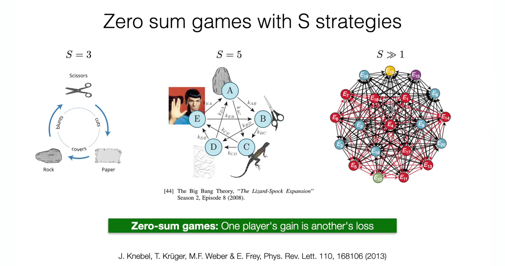
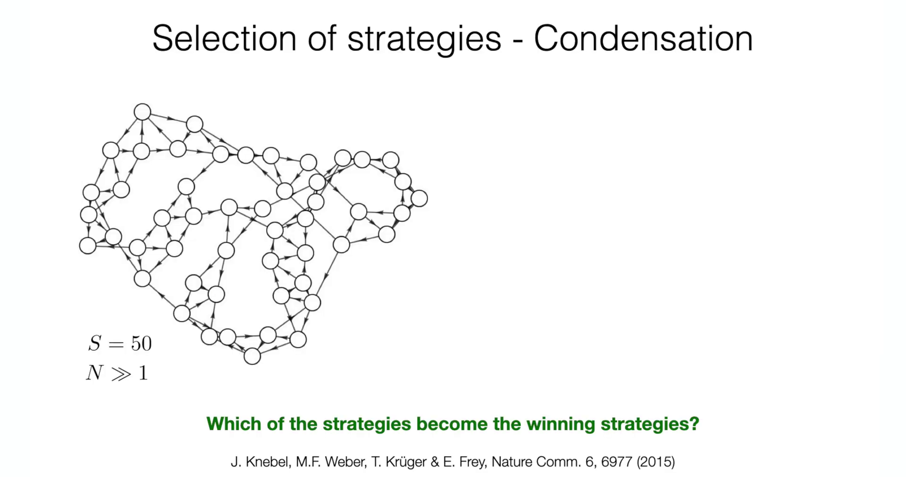
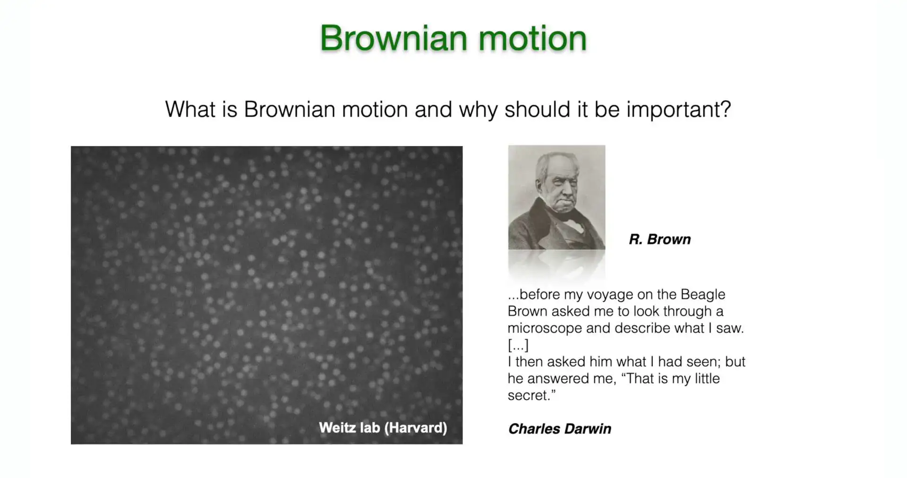

# 引言

在**第7讲**中，课程构建了一套用于分析二维动力系统的标准“工具箱”。通过引入**庞加莱-本迪克松定理 (Poincaré-Bendixson Theorem)** ，分析突破了线性稳定性分析（雅可比矩阵的迹 $\tau$ 与行列式 $\Delta$）的局域限制，为二维相平面上**极限环 (Limit Cycles)** 的存在性提供了严格的拓扑判据。这一理论框架成功解释了 **RhoGTPase** 生化循环中的自发振荡，并初步探讨了**石头-剪刀-布 (RPS)** 这种三策略循环博弈的动力学特征。

然而，现实中的复杂系统往往包含远超两个或三个的组分。当演化博弈的策略数量 $S$ 增加时（如 $S \gg 3$），系统不再受限于二维平面的拓扑约束，庞加莱-本迪克松定理不再适用。这节课将在此基础上实现两个维度的关键跨越：从低维到高维的策略空间，以及从时间演化到时空演化。

这节课首先将聚焦于**复制子动力学 (Replicator Dynamics)** 的高维推广。对于包含 $S$ 种策略的零和博弈，其演化遵循**反称洛特卡-沃尔泰拉方程 (Anti-symmetric Lotka-Volterra Equation, ALVE)** 。这部分内容将揭示一个深刻的跨学科联系：描述生物策略竞争的 ALVE 方程，在数学结构上与驱动耗散系统中的**玻色子凝聚 (Boson Condensation)** 完全等价。为了解决高维相空间中的全局稳定性问题，课程将不再依赖几何直观，而是引入**李雅普诺夫函数 (Lyapunov Function)** 这一强大的代数工具。特别是利用**相对熵(Relative Entropy)**  （即 Kullback-Leibler 散度）作为李雅普诺夫函数，严格证明系统演化的热力学方向：在反称相互作用下，系统必然演化至特定的**凝聚态(Condensates)**  ，导致部分策略生存而其他策略灭绝（耗尽）。

接着视角从“均匀混合”向“空间广延”的转折。此前所有的动力学模型（如金茨堡-朗道、演化博弈）均假设系统是空间均匀的（0维）。为了描述斑图形成，必须引入空间维度。因此将追溯**布朗运动 (Brownian Motion)** 的物理本源，从微观的**随机游走 (Random Walk)** 模型出发，通过连续性极限推导出宏观的**扩散方程 (Diffusion Equation)** 。

这一对扩散过程的推导至关重要，它不仅连接了微观随机性与宏观确定性，更为**下一讲（第9讲）** 中探讨**弛豫动力学 (Relaxational Dynamics)** 奠定了基础。在第9讲中，扩散方程将与反应动力学结合，构建出完整的**金兹堡-朗道模型 (Ginzburg-Landau Model)** 与 **Model A**，从而正式开启对界面动力学、表面张力以及复杂时空斑图形成的探索。

# 1. 演化博弈论与反称洛特卡-沃尔泰拉方程

在**第7讲**中，课程通过石头-剪刀-布（RPS）模型展示了三策略系统的循环动力学。然而，现实世界的生物群落或量子系统往往包含大量相互作用的组分（$S \gg 3$）。为了描述这种高维系统的自组织行为，这节课首先建立一个通用的数学框架——**复制子动力学（Replicator Dynamics）**。该框架不仅适用于描述生物种群中的策略竞争，其数学结构更被证明与非平衡态量子系统中的玻色子凝聚现象存在深刻的同构性。

## 1.1 理论框架：策略、种群与微观交互机制

考虑一个由大量个体组成的群体，系统中存在 $S$ 种可能的策略（或物种），记为 $E_1, E_2, \dots, E_S$。系统的宏观状态由采取每种策略的个体数量 $N_i(t)$ 定义，其中 $i = 1, \dots, S$。



策略空间的演变：从简单的石头-剪刀-布 ($S=3$) 到生活大爆炸版 ($S=5$) 再到高维复杂网络 

模型基于一个核心物理约束：**种群守恒（Population Conservation）**。在所考察的时间尺度内，假设没有个体的生灭（或者出生与死亡达到动态平衡），使得系统内的总个体数 $N$ 保持恒定：

$$
N = \sum_{i=1}^{S} N_i, \quad N_i(t) \geq 0
$$

这一约束意味着系统的动力学完全由个体在不同策略间的**转换（Transition）**所驱动。这种转换通常源于个体间的成对相互作用（Pairwise Interaction）。当一个采取策略 $E_j$ 的个体（Player $j$）遇到一个采取策略 $E_i$ 的个体（Player $i$）时，如果策略 $E_i$ 在当前的博弈收益矩阵中具有优势，个体 $j$ 便可能“模仿”个体 $i$，从而放弃原有策略 $E_j$ 转而采纳策略 $E_i$。

这一微观过程可以类比为化学反应动力学中的自催化过程：

$$
E_j + E_i \xrightarrow{r_{ij}} E_i + E_i
$$

这个公式描述了**复制（Replication）**或**模仿（Imitation）**的过程。

**反应物 ($E_j + E_i$)** ：表示一个采取策略 $j$ 的个体（$E_j$）遇到了一个采取策略 $i$ 的个体（$E_i$）。

**生成物 ($E_i + E_i$)** ：表示博弈或互动发生后，由于策略 $i$ 具有优势（由速率 $r_{ij}$ 决定），采取策略 $j$ 的个体被“转化”为了策略 $i$（即模仿了 $i$）。原来的个体 $i$ 保持不变。结果是系统中少了 1 个 $E_j$，多了 1 个 $E_i$。

**自催化（Autocatalytic）**：之所以称为自催化，是因为 $E_i$ 在反应中既是生成物也是反应物（催化剂）。$E_i$ 的存在促进了更多 $E_i$ 的产生（通过转化 $E_j$），这正是种群增长的正反馈机制。

这一过程在数学上对应于种群变化的跳变 ：

$$
E_j \to E_i, \quad \text{导致种群变化：} \quad N_j \to N_j - 1, \quad N_i \to N_i + 1
$$

该转换发生的速率 $G_{i \leftarrow j}$ 取决于两个因素：

1.**相遇概率**：根据质量作用定律（Law of Mass Action），在充分混合的系统中，两类个体相遇的频率正比于其种群数量的乘积 $N_i N_j$。


2.**转换概率**：由策略 $i$ 相对于策略 $j$ 的内禀优势或反应速率常数 $r_{ij}$ 决定。

因此，从策略 $j$ 转换为策略 $i$ 的总速率可以写为：

$$
G_{i \leftarrow j} (N_i, N_j) = r_{ij} N_i N_j
$$

值得注意的是，在更一般的随机动力学描述中（如主方程），通常还会包含自发的**突变项（Mutation）**，此时速率形式修正为 $r_{ij}(N_i + S_{ij})N_j$。然而，在本讲座讨论的确定性复制子动力学极限下，关注点在于纯粹由“选择压力”驱动的演化，因此设定自发突变项 $S_{ij} = 0$。

## 1.2 反称洛特卡-沃尔泰拉方程（ALVE）的推导

基于上述微观机制，可以构建描述第 $i$ 种策略种群 $N_i$ 随时间演化的宏观微分方程。$N_i$ 的净变化率由所有可能的“流入量”（其他策略转变为 $i$）减去所有可能的“流出量”（$i$ 转变为其他策略）决定：

$$
\dot{N}_i = \underbrace{\sum_{j \ne i} r_{ij} N_i N_j}_{\text{Gain from } j \to i} - \underbrace{\sum_{j \ne i} r_{ji} N_j N_i}_{\text{Loss from } i \to j}
$$

通过提取公因式 $N_i N_j$，方程可以简化为如下形式：

$$
\dot{N}_i = \sum_{j \ne i} (r_{ij} - r_{ji}) N_i N_j
$$

此时，引入一个核心物理量：**相互作用矩阵（Interaction Matrix）** $A$，其元素 $a_{ij}$ 定义为两个单向转换速率之差：

$$
a_{ij} = r_{ij} - r_{ji}
$$

这个定义的物理意义极其深远。$a_{ij}$ 代表了策略 $i$ 相对于策略 $j$ 的**净优势（Net Advantage）**。该定义直接赋予了矩阵 $A$ **反称性（Anti-symmetry or Skew-symmetry）**：

**$a_{ij} = -a_{ji}$** ：如果 $i$ 战胜 $j$ 获得收益（$a_{ij} > 0$），那么 $j$ 必然遭受同等程度的损失（$a_{ji} < 0$）。这正是**零和博弈（Zero-sum Game）**的严格数学特征——一方的收益严格等于另一方的损失。

**$a_{ii} = 0$** ：任何策略与自身博弈的净收益为零。

为了使方程具有尺度不变性并简化分析，引入相对丰度（Relative Abundance）或**策略频率** $x_i$：

$$
x_i = \frac{N_i(t)}{N}, \quad \text{满足约束} \quad \sum_{i=1}^S x_i = 1
$$

将 $N_i = N x_i$ 代入速率方程，并消去常数 $N$（或将其吸收到时间尺度的重定义中），最终得到标准的**反称洛特卡-沃尔泰拉方程（Anti-symmetric Lotka-Volterra Equation, ALVE）**：

$$
\dot{x}_i = x_i \sum_{j=1}^S a_{ij} x_j = x_i (A\mathbf{x})_i
$$

这里，矢量项 $(A\mathbf{x})_i$ 具有明确的生物学含义：它代表了策略 $i$ 在当前群体环境 $\mathbf{x}$ 下的**适应度（Fitness）**。

若 $(A\mathbf{x})_i > 0$，意味着策略 $i$ 在与当前混合群体的平均对抗中占据优势，其频率 $x_i$ 将会指数增长。

若 $(A\mathbf{x})_i < 0$，策略 $i$ 处于劣势，其频率将衰减。

这正是**频率依赖选择（Frequency-dependent Selection）**的数学表达：一个策略的优劣并非绝对，而是取决于它所处的环境（即其他策略的分布）。



复杂策略网络示意图 ($S=50$)。节点代表策略，箭头代表非零的净优势 $a_{ij}$。核心问题是：哪些策略最终会胜出（凝聚）？


## 1.3 物理等价性：玻色子凝聚与量子态选择

这小节揭示了一个连接生物学与物理学的深刻洞见：上述描述演化博弈的 ALVE 方程，在数学结构上与**驱动-耗散系统中的玻色子凝聚（Bose-Einstein Condensation in Driven-Dissipative Systems）**是完全等价的。

在非平衡态量子统计物理中：

-   **策略 $E_i$** 对应于系统的**量子态**（如 Floquet States）。

-   **个体** 对应于占据这些能级的**非相互作用玻色子**（Bosons）。

-   **转换 $G_{i \leftarrow j}$** 对应于玻色子在不同能级间的**跃迁**，这种跃迁由外部驱动场（Pump）和环境耗散（Dissipation）共同诱导。

这种等价性源于玻色子的统计性质。玻色子的跃迁速率包含一个统计因子 $(1+N_i)$，即**玻色增强效应（Bosonic Enhancement）**：目标态已经被占据的粒子数越多，跃迁进去的概率就越大。在宏观极限下（$N \gg 1$），$(1+N_i) \approx N_i$，这与演化博弈中“模仿成功者”带来的 $N_i$ 因子在数学上是一致的。

下表总结了这两个领域的严格映射关系：

| 特征维度 | 演化博弈论 (Evolutionary Game Theory) | 驱动耗散玻色子系统 (Driven-Dissipative Bosonic Systems) |
| :--- | :--- | :--- |
| **基本单元** | 策略 (Strategies, $E_i$) | 量子态 (Quantum States, Floquet States) |
| **动力学主体** | 相互作用的个体 (Agents) | 非相互作用的玻色子 (Bosons) |
| **演化机制** | 策略模仿与转换 (Reactions/Switches) | 能级跃迁 (Transitions between states) |
| **核心方程** | 反称洛特卡-沃尔泰拉方程 (ALVE) | 玻尔兹曼主方程的平均场极限 (Mean-field Limit of Master Eq.) |
| **核心问题** | 进化稳定策略的选择 (Selection of Strategies) | 玻色-爱因斯坦凝聚态的选择 (Selection of Condensates) |
| **跃迁速率** | $T_{i\to j} \propto N_j N_i$ (模仿机制) | $T_{i\to j} \propto N_j(1 + N_i) \approx N_j N_i$ (玻色增强) |


这张图总结了演化博弈论与驱动-耗散玻色子系统的物理同构性对比。


这种同构性暗示了自然界中一种普适的**选择机制**：无论是生物策略的优胜劣汰，还是量子态的凝聚，本质上都是通过非线性正反馈（$\dot{x}_i \propto x_i$），使系统自发地从大量可能的微观状态中“筛选”出少数宏观有序态。

## 1.4 系统的相空间与守恒律验证

在深入分析动力学之前，必须确认 ALVE 方程的解在物理上是合法的。由于策略频率之和必须为1且非负，系统的状态空间被限制在一个**单纯形（Simplex）** $\Delta^{S-1}$ 上：

$$
\Delta^{S-1} = \left\{ \mathbf{x} \in \mathbb{R}_{\geq 0}^S : \sum_{i=1}^S x_i = 1 \right\}
$$

我们需要验证 ALVE 动力学是否自动保证了总概率的守恒，即验证 $\sum_{i=1}^S \dot{x}_i$ 是否恒为零。

计算总变化率：

$$
\sum_{i=1}^S \dot{x}_i = \sum_{i=1}^S x_i (A\mathbf{x})_i = \sum_{i=1}^S \sum_{j=1}^S x_i a_{ij} x_j = \mathbf{x}^T A \mathbf{x}
$$

这是一个关于向量 $\mathbf{x}$ 的二次型（Quadratic Form）。对于任何反称矩阵 $A$（满足 $A^T = -A$），该二次型恒等于零。证明如下：

交换求和指标 $i$ 和 $j$（不改变求和结果）：
$$
\sum_{i,j} x_i a_{ij} x_j = \sum_{j,i} x_j a_{ji} x_i
$$
利用反称性条件 $a_{ji} = -a_{ij}$：
$$
\sum_{j,i} x_j (-a_{ij}) x_i = - \sum_{i,j} x_i a_{ij} x_j
$$
由于一个数等于它的相反数，该数必为零。因此：

$$
\frac{d}{dt} \left( \sum_{i=1}^S x_i \right) = 0
$$

这严格证明了系统总质量（或总概率）是守恒的。此外，由于方程形式为 $\dot{x}_i = x_i (\dots)$，当 $x_i \to 0$ 时 $\dot{x}_i \to 0$，这意味着任何以正值开始的轨迹永远无法穿过 $x_i = 0$ 的边界进入负值区域。因此，单纯形 $\Delta^{S-1}$ 是该动力系统的**正向不变集（Forward Invariant Set）**，这为后续利用李雅普诺夫函数分析全局稳定性奠定了几何基础。

# 2. 凝聚现象与全局稳定性分析：李雅普诺夫函数法

在建立了高维复制子动力学方程（ALVE）后，接下来的核心任务是预测系统的长期演化行为。在复杂的生态竞争或量子态演化中，并非所有策略（或量子态）都能幸存。随着时间的推移，系统会发生自发的“选择”：某些策略的频率 $x_i(t)$ 会指数级衰减至零（**耗尽/灭绝，Depletion**），而另一些策略则会保留下来并占据宏观比例（**凝聚/生存，Condensation**）。这小节的目标是寻找一个仅依赖于相互作用矩阵 $A$ 的代数判据，用以精确预言最终的幸存者集合。

## 2.1 凝聚问题的数学表述

设系统最终趋向于某个定态或动态平衡区域，可以将策略集合 $S$ 划分为两个互补的子集：

-   **凝聚集（Condensates, $I$）**：最终幸存的策略集合，满足 $x_i^* > 0$。

-   **耗尽集（Depleted, $E$ 或 $I^c$）**：最终灭绝的策略集合，满足 $x_k^* \to 0$。

根据 ALVE 方程 $\dot{x}_i = x_i (A\mathbf{x})_i$，不动点 $\mathbf{x}^*$ 必须满足 $\dot{x}_i^* = 0$。这导致了对两类策略的不同约束：

-   对于幸存者 $i \in I$（$x_i^* > 0$），必须满足 **适应度为零**：$(A\mathbf{x}^*)_i = 0$。这意味着幸存策略之间达到了某种力量平衡，没有谁能从其他幸存者那里获得净收益（纳什均衡特征）。

-   对于失败者 $k \in E$（$x_k^* = 0$），其适应度 $(A\mathbf{x}^*)_k$ 没有直接的零约束，但通常需要为负以保证灭绝的稳定性。

## 2.2 凝聚向量（Condensate Vector）与 KKT 条件

为了从数学上确定集合 $I$，引入一个理论上的辅助向量——**凝聚向量（Condensate Vector） $\mathbf{c}$** 。$\mathbf{c}$ 不仅是系统的一个不动点，还满足特定的全局稳定性条件，这与优化理论中的 Karush-Kuhn-Tucker (KKT) 条件高度相似。

一个向量 $\mathbf{c} \in \Delta^{S-1}$ 被定义为凝聚向量，当且仅当它满足以下两个条件：

1.**支持条件（Support Condition）**：对于所有 $\mathbf{c}$ 的非零分量（即 $i \in I$），其适应度严格为零。

$$
(A\mathbf{c})_i = 0, \quad \forall i \in I \quad (\text{其中 } c_i > 0)
$$

2.**稳定性/排斥条件（Stability Condition）**：对于所有 $\mathbf{c}$ 的零分量（即 $k \notin I$），其适应度必须严格为负。

$$
(A\mathbf{c})_k < 0, \quad \forall k \notin I \quad (\text{其中 } c_k = 0)
$$

**物理诠释**：
-   第一条条件意味着在幸存者内部，博弈达到了“和局”或动态平衡，净收益为零。

-   第二条条件意味着任何试图入侵该稳定群体的外部策略（$k$），在与当前群体 $\mathbf{c}$ 互动时，都会遭遇负收益（被抑制）。这是系统拒绝外部入侵者的数学保障。

Knebel 等人的研究证明（如下图所示），对于给定的反称矩阵 $A$，满足上述条件的索引集 $I$ 是**唯一存在**的。这一唯一性定理是整个凝聚理论的基石，它保证了演化结果的确定性，即无论初始条件如何（只要所有 $x_i(0) > 0$），幸存者集合都是注定的。


图的上半部分展示了凝聚向量的定义与性质。左侧展示了凝聚与耗尽的示意图；右侧列出了凝聚向量 $\mathbf{c}$ 必须满足的KKT条件，以及利用相对熵（KL散度）作为李雅普诺夫函数的数学框架。

## 2.3 李雅普诺夫函数：相对熵与信息几何

为了严格证明系统 $\mathbf{x}(t)$ 必然收敛到由 $\mathbf{c}$ 定义的子空间 $I$，需要构造一个**李雅普诺夫函数（Lyapunov Function）**。对于这类种群动力学方程，最自然的候选者是来自信息论的**相对熵（Relative Entropy）**，也称为 Kullback-Leibler 散度。

定义李雅普诺夫函数 $D(\mathbf{c} \| \mathbf{x})$ 为凝聚向量 $\mathbf{c}$ 与系统当前状态 $\mathbf{x}(t)$ 之间的相对熵：

$$
D(\mathbf{c} \| \mathbf{x}) = \sum_{i \in I} c_i \ln \left( \frac{c_i}{x_i(t)} \right)
$$

**注意**：
-   求和仅针对 $i \in I$，即凝聚向量的非零元素。

-   由于 $x \ln x$ 是凸函数，根据吉布斯不等式，$D \geq 0$，且当且仅当 $\mathbf{x}$ 在 $I$ 上的分布与 $\mathbf{c}$ 一致时取最小值。这使得 $D$ 具备了作为相空间中“广义距离”或“势能”函数的资格。

**时间导数的推导（核心证明）**：

计算 $D$ 随时间的变化率 $\dot{D}$：

$$
\frac{d}{dt} D(\mathbf{c} \| \mathbf{x}) = \sum_{i \in I} c_i \frac{d}{dt} [\ln c_i - \ln x_i] = - \sum_{i \in I} c_i \frac{\dot{x}_i}{x_i}
$$

将 ALVE 方程 $\frac{\dot{x}_i}{x_i} = (A\mathbf{x})_i = \sum_{j=1}^S a_{ij} x_j$ 代入：

$$
\dot{D} = - \sum_{i \in I} c_i \left( \sum_{j=1}^S a_{ij} x_j \right) = - \sum_{j=1}^S x_j \left( \sum_{i \in I} c_i a_{ij} \right)
$$

利用矩阵的反称性 $a_{ij} = -a_{ji}$，内部的求和项变为：

$$
\sum_{i \in I} c_i a_{ij} = - \sum_{i \in I} a_{ji} c_i = - (A\mathbf{c})_j
$$

因此，$\dot{D}$ 简化为：

$$
\dot{D} = \sum_{j=1}^S x_j (A\mathbf{c})_j
$$

将求和指标 $j$ 分解为两部分：属于凝聚集 $I$ 的部分和属于耗尽集 $E$ 的部分：

$$
\dot{D} = \sum_{j \in I} x_j \underbrace{(A\mathbf{c})_j}_{=0} + \sum_{k \in E} x_k \underbrace{(A\mathbf{c})_k}_{<0}
$$

根据凝聚向量 $\mathbf{c}$ 的定义（支持条件与排斥条件）：
-   对于 $j \in I$，$(A\mathbf{c})_j = 0$，第一项消失。
-   对于 $k \in E$，$(A\mathbf{c})_k < 0$，且由于 $x_k \geq 0$，每一项都非正。


**结论**：

$$
\frac{d}{dt} D(\mathbf{c} \| \mathbf{x}) = \sum_{k \in E} x_k (A\mathbf{c})_k \leq 0
$$

这一结果（如下图数值模拟所示）具有深刻的物理意义与全局动力学推论：


图的下半部分，展示了ALVE动力学的数值模拟结果。左图为一个具体的反称相互作用矩阵 $A$。右图展示了策略频率 $x_i(t)$ 随时间的演化。可以看到，尽管系统存在振荡，但未被选中的策略（虚线）其频率指数级衰减至零（耗尽），而幸存策略（实线）则在子空间内持续演化。

1.**H-定理的推广**：这一结果类似于玻尔兹曼 H-定理，表明系统在演化过程中，相对于“最优策略组合” $\mathbf{c}$ 的信息散度单调递减。系统在不断地“学习”并接近最优解。

2.**熵产生的消失**：Knebel 和 Frey 指出，凝聚的选择是由**相对熵产生率的消失（Vanishing of relative entropy production）**决定的。系统趋向于一个熵产生为零的状态。

3.**严格的耗尽证明**：由于 $(A\mathbf{c})_k$ 对于所有 $k \in E$ 都是严格负常数，要使 $\dot{D}$ 趋于零（系统停止向更低势能演化），唯一的可能性是所有耗尽集策略的频率 $x_k$ 趋于零。这从数学上严格证明了非凝聚态必然会指数级灭绝。

4.**子空间内的振荡**：当所有 $x_k \to 0$ 后，系统被限制在子空间 $I$ 中。注意，在 $I$ 内部，李雅普诺夫函数的导数为零。这意味着在凝聚态子空间内，系统不再有耗散趋势，可以维持等能面上的运动。对于反称系统，这通常意味着**周期性轨道（Periodic Orbits）或极限环（Limit Cycles）**的持续存在（如石头-剪刀-布循环）。系统虽然“凝聚”了，但从未“静止”，而是在幸存者之间进行永恒的动态博弈。

# 3. 拓扑相变与复杂网络中的策略选择

在前两节中，建立了一个基于反称洛特卡-沃尔泰拉方程（ALVE）的通用框架，并利用李雅普诺夫函数证明了系统必然演化至特定的凝聚态。虽然凝聚向量 $\mathbf{c}$ 的存在性是普遍的，但其具体结构（即哪些策略幸存）强烈依赖于相互作用矩阵 $A$ 的拓扑性质。当策略之间的相互作用网络具有特定的空间结构（如晶格或链）时，ALVE 动力学将展现出与凝聚态物理中**拓扑绝缘体（Topological Insulators）**惊人相似的现象。这部分内容展示了动力系统理论如何跨越学科边界，用同一套数学语言描述生物演化与量子相变。

## 3.1 石头-剪刀-布链（RPS Chains）与边缘态

作为一个具体的物理模型，考虑将 $S$ 种策略排列成一个一维链式结构（RPS Chain）。在这个网络中，策略 $i$ 仅与其空间上的邻居（如 $i-1$ 和 $i+1$）发生非零的相互作用，形成类似于石头-剪刀-布的局部循环克制关系。Knebel, Geiger 和 Frey (2020) 的研究指出，这种系统的演化结果并非杂乱无章，而是表现出高度有序的**空间局域化（Spatial Localization）**。


当调节系统控制参数（例如调整向左克制与向右克制的相对强度比率）时，凝聚向量 $\mathbf{c}$ 的支撑集（即幸存策略的集合 $I$）会发生突变。这种突变具有两个显著特征：

1.**极化状态（Polarization）与边缘态（Edge States）**：

在某些参数区间内，系统的总质量（种群比例）并未均匀分布在链条上，而是完全集中在链条的一端（左边界或右边界）。这在物理上对应于**边缘态**：只有位于网络“边缘”的策略能够幸存，而位于“体（Bulk）”内部的策略全部灭绝（耗尽）。这与拓扑绝缘体中“体绝缘、表面导电”的性质形成了完美的类比。

2.**鲁棒性（Robustness）**：

这种边缘凝聚现象对参数的微扰具有极强的抵抗力。只要参数的变化没有跨越某个**临界点（Critical Point）**，系统的凝聚模式（即幸存者位于左端还是右端）保持严格不变。这表明系统处于一个受到**拓扑保护（Topological Protection）**的相中，其宏观性质不由参数的微小细节决定，而是由系统的全局拓扑性质决定。

## 3.2 缠绕数与拓扑相变

为了定量描述这种相变，引入**缠绕数（Winding Number, $\nu$）**作为系统的拓扑不变量。在数学上，这通常涉及到对相互作用矩阵（或其傅里叶变换后的哈密顿量）在布里渊区上的某种积分，类似于量子霍尔效应中的陈数（Chern Number）。

随着控制参数的连续变化，系统的能谱（在此背景下即线性化算子的特征值谱）可能会发生带隙闭合与重开。伴随着这一过程，缠绕数 $\nu$ 会发生离散跳变（例如从 $0$ 跳变到 $1$），标志着**拓扑相变（Topological Phase Transition）**的发生：

-   **平凡相（Trivial Phase, $\nu=0$）**：对应于质量分布在体态或无序分布，系统对扰动敏感。

-   **非平凡拓扑相（Non-trivial Topological Phase, $\nu \neq 0$）**：对应于质量精确地锁定在边界上，形成受保护的边缘态。

**物理意义与生物学启示**：
这一发现揭示了演化系统可能利用拓扑性质来实现功能的稳定性。在充满噪声的生物环境中，如果某种关键的功能性基因或物种处于“拓扑非平凡”的状态，它就能免受环境涨落的干扰而稳定存在。这为理解生物复杂性提供了一个全新的物理视角：**自然选择不仅筛选适应度最高的个体，也可能筛选拓扑上最鲁棒的网络结构。**

# 4. 从微观随机游走到宏观扩散方程

在此前的课程中（如复制子动力学、RPS模型），所有的分析均建立在**“均匀混合（Well-mixed）”**的假设之上。这意味着系统被视为一个零维的点，忽略了物质在空间上的分布差异。然而，现实中的生物物理过程——从细胞内的蛋白质转运到生态系统中的种群迁徙——都发生在具有广度的空间中。

为了描述**图灵斑图（Turing Patterns）**等复杂的空间自组织结构，这节课必须打破“空间均匀”的限制，引入**空间扩展（Spatial Extension）**。连接微观粒子运动与宏观物质输运的最基础物理过程，便是**扩散（Diffusion）**。本节将展示如何从微观粒子的随机热运动出发，通过严格的数学推导，得到描述宏观浓度场演化的扩散方程。

## 4.1 历史背景与物理本质：布朗运动

扩散现象的微观物理基础是**布朗运动（Brownian Motion）**。1827年，植物学家罗伯特·布朗（Robert Brown）在显微镜下观察悬浮在水中的花粉颗粒时，发现它们进行着永无休止的、无规则的运动。

这一现象在当时困扰了科学界许久，甚至引发了关于“生命力”的哲学讨论。查尔斯·达尔文（Charles Darwin）在其回忆录中也提到了这一轶事，描述了布朗对此发现的“小秘密”。直到1905年，爱因斯坦（Einstein）在其奇迹年的论文中才彻底揭开了这一谜题的物理本质。他指出，悬浮微粒的随机运动并非源于生命力，而是由周围溶剂分子（如水分子）对其进行无数次**热碰撞的不平衡涨落**造成的。



布朗运动的历史背景。左侧引用了达尔文关于布朗发现的描述；右侧展示了哈佛大学 Weitz 实验室拍摄的微米级粒子布朗运动轨迹。

爱因斯坦不仅定性解释了现象，还建立了宏观扩散系数 $D$ 与微观物理量之间的定量关系，即著名的**爱因斯坦关系（Einstein Relation）**：

$$
D = \frac{k_B T}{\gamma}
$$

该公式揭示了扩散的物理来源：
-   **动力（分子热运动）**：$k_B T$ 代表热能，是驱动扩散的能量来源。在细胞生物学尺度（微米级），$k_B T \approx 4 \text{ pN} \cdot \text{nm}$，这是支配细胞内一切分子随机运动的核心能量标度。

-   **阻力（耗散）**：$\gamma$ 是斯托克斯摩擦系数（Friction Coefficient），代表流体环境对粒子运动的阻碍。

这一理论不仅奠定了非平衡态统计物理的基础，也是人类历史上证实原子论存在的关键证据之一。

## 4.2 随机游走（Random Walk）：从离散到连续的推导

为了从数学上严谨地连接微观随机性与宏观确定性，这节课采用**一维随机游走（1D Random Walk）**模型进行推导。

### 4.2.1 离散主方程

考虑粒子位于一维晶格上，物理参数定义如下：
-   $\delta$：晶格间距（空间步长）。

-   $\tau$：时间步长。

-   跳跃规则：在每个时间步，粒子以 $1/2$ 的概率向左跳 ($x-\delta$)，以 $1/2$ 的概率向右跳 ($x+\delta$)。这是无偏的各向同性随机游走。

设 $P(x, t)$ 为时刻 $t$ 粒子出现在位置 $x$ 的概率。根据概率守恒，时刻 $t + \tau$ 在位置 $x$ 的粒子，必然来自于上一时刻 $t$ 位于左邻居 $x-\delta$（向右跳）或右邻居 $x+\delta$（向左跳）的粒子。因此，可以写出离散的**主方程（Master Equation）**：

$$
P(x, t+\tau) = \underbrace{\frac{1}{2} P(x-\delta, t)}_{\text{来自左侧}} + \underbrace{\frac{1}{2} P(x+\delta, t)}_{\text{来自右侧}}
$$

### 4.2.2 连续性极限与泰勒展开

为了得到宏观方程，需要取连续极限（Continuum Limit），即令步长 $\delta \to 0$ 和 $\tau \to 0$。此时，概率分布 $P(x, t)$ 变为平滑函数，可以对其进行**泰勒展开（Taylor Expansion）**。

**时间项展开（保留至一阶）：**

$$
P(x, t+\tau) \approx P(x, t) + \tau \frac{\partial P}{\partial t}
$$

**空间项展开（保留至二阶）：**
对于左右邻居项，分别在 $x$ 处展开：

$$
P(x-\delta, t) \approx P(x, t) - \delta \frac{\partial P}{\partial x} + \frac{\delta^2}{2} \frac{\partial^2 P}{\partial x^2}
$$

$$
P(x+\delta, t) \approx P(x, t) + \delta \frac{\partial P}{\partial x} + \frac{\delta^2}{2} \frac{\partial^2 P}{\partial x^2}
$$

将上述展开式代入离散主方程：

$$
P + \tau \frac{\partial P}{\partial t} = \frac{1}{2} \left[ \left( P - \delta \frac{\partial P}{\partial x} + \frac{\delta^2}{2} \frac{\partial^2 P}{\partial x^2} \right) + \left( P + \delta \frac{\partial P}{\partial x} + \frac{\delta^2}{2} \frac{\partial^2 P}{\partial x^2} \right) \right]
$$

整理方程右边：

1.零阶项：$\frac{1}{2}(P + P) = P$，与左边抵消。

2.一阶项：$\frac{1}{2}(-\delta \partial_x P + \delta \partial_x P) = 0$。**物理意义**：一阶导数项的抵消体现了随机游走的**各向同性（Isotropy）**，即没有定向的漂移流（Drift）。

3.二阶项：$\frac{1}{2}(\frac{\delta^2}{2} \partial_{xx} P + \frac{\delta^2}{2} \partial_{xx} P) = \frac{\delta^2}{2} \frac{\partial^2 P}{\partial x^2}$。

最终得到：

$$
\tau \frac{\partial P}{\partial t} = \frac{\delta^2}{2} \frac{\partial^2 P}{\partial x^2}
$$

### 4.2.3 宏观扩散方程

整理上述方程，将系数分离：

$$
\frac{\partial P}{\partial t} = \left( \lim_{\delta,\tau \to 0} \frac{\delta^2}{2\tau} \right) \frac{\partial^2 P}{\partial x^2}
$$

此时，定义宏观的**扩散系数（Diffusion Coefficient）** $D$：

$$
D \equiv \frac{\delta^2}{2\tau}
$$

并将微观概率密度 $P(x, t)$ 替换为宏观物质浓度 $C(x, t)$，即得到了经典的**扩散方程（Diffusion Equation）**：


$$
\frac{\partial C}{\partial t} = D \nabla^2 C
$$


**物理意义**：这一推导过程本质上是**中心极限定理（Central Limit Theorem）**的物理体现。尽管单个粒子的运动是随机、不可预测的（方差随时间线性增长，$\langle x^2 \rangle \sim 2Dt$），但大量粒子的统计平均行为（浓度场）却遵循精确的确定性规律。这为后续章节中利用偏微分方程（PDEs）研究图灵斑图等宏观自组织现象奠定了坚实的数学基础。


# 5. 扩散方程的解析解、边界条件与数值模拟

在上一节中，这节课通过微观随机游走的连续性极限推导出了宏观扩散方程。为了深入理解扩散过程的物理特性，本节将探讨其在数学上的解析求解方法，特别是傅里叶变换法的应用。此外，考虑到生物物理系统通常是有界的，本节还将分析不同边界条件对系统稳态行为的决定性影响，并通过 Python 代码实践展示这节课涵盖的两大核心动力学：演化博弈中的凝聚现象与空间中的扩散过程。

## 5.1 傅里叶变换法求解

对于定义在无界区域 $x \in (-\infty, \infty)$ 上的扩散方程，最有效的解析求解工具是**傅里叶变换（Fourier Transform）**。这一方法将偏微分方程（PDE）转化为易于求解的常微分方程（ODE）。

首先，定义实空间浓度 $C(x, t)$ 到倒空间（k-space）的变换及其逆变换：

$$
\tilde{C}(k, t) = \int_{-\infty}^{\infty} C(x, t) e^{ikx} \, dx \quad (\text{正变换})
$$

$$
C(x, t) = \frac{1}{2\pi} \int_{-\infty}^{\infty} \tilde{C}(k, t) e^{-ikx} \, dk \quad (\text{逆变换})
$$

对方程 $\partial_t C = D \partial_x^2 C$ 两边同时进行傅里叶变换。利用导数的傅里叶变换性质 $\mathcal{F}[\partial_x^2 C] = -k^2 \tilde{C}$，原方程被解耦为针对每个波数 $k$ 的独立 ODE：

$$
\frac{\partial \tilde{C}(k, t)}{\partial t} = -D k^2 \tilde{C}(k, t)
$$

该 ODE 的解表现为简单的指数衰减：

$$
\tilde{C}(k, t) = \tilde{C}(k, 0) e^{-D k^2 t}
$$

**物理意义**：指数项 $e^{-D k^2 t}$ 表明，具有高波数 $k$（即高空间频率、结构精细）的模式衰减速度与其频率的平方成正比。这意味着扩散过程会优先抹平浓度场中的尖锐突变和微小细节，导致空间分布随时间变得越来越**平滑（Smoothing）**。


通过傅里叶逆变换，并利用卷积定理，可以得到实空间中的通解。该解是初始分布 $C(x, 0)$ 与**热核（Heat Kernel）**（即扩散方程的格林函数）的卷积：

$$
C(x, t) = \int_{-\infty}^{\infty} C(x', 0) \frac{1}{\sqrt{4\pi D t}} \exp\left( -\frac{(x-x')^2}{4Dt} \right) \, dx'
$$

对于点源初始条件 $C(x, 0) = \delta(x)$，解简化为一个随时间演化的高斯分布。其方差 $\sigma^2 = 2Dt$ 随时间线性增长，意味着扩散粒子的平均位移距离随时间呈 $\sqrt{t}$ 增长，这是布朗运动的标志性特征。

## 5.2 边界条件的影响

现实中的生物物理实验往往在有限的容器或细胞内进行。**边界条件（Boundary Conditions, BCs）** 深刻地制约着系统的演化轨迹及最终稳态。

| 边界条件类型 | 数学表达 | 物理意义 | 稳态解 ($t \to \infty$) |
| :--- | :--- | :--- | :--- |
| **无通量 (No Flux / Neumann)** | $\partial_x C\|_{x=0,L}=0$ | 封闭系统，粒子在壁面反射。系统总质量守恒。 | **均匀分布**：$C(x) = \text{const}$ |
| **狄利克雷 (Dirichlet)** | $C(0)=C_L, C(L)=C_R$ | 开放系统，边界连接恒定浓度的源/汇（Reservoirs）。 | **线性分布**：$C(x) = Ax + B$ (存在恒定的净通量) |
| **周期性 (Periodic)** | $C(0)=C(L), C'(0)=C'(L)$ | 环形几何结构（如细菌的环状DNA或环形反应器）。 | 类似于无界情况的离散谱展开 |

## 5.3 代码实践

展示本章涉及的两个核心动力学过程，以下 Python 代码实践模拟了两个场景：

1.**Replicator Dynamics**：模拟 5 种策略的 ALVE 动力学，重现了策略的凝聚与耗尽现象。

2.**Diffusion**：模拟一维高斯波包在无通量边界条件下的扩散过程。


```python
import numpy as np
import matplotlib.pyplot as plt
from scipy.integrate import solve_ivp

# Set dark background theme
plt.style.use('dark_background')

# ================= PART 1: Replicator Dynamics (ALVE) =================
def run_replicator_simulation():
    # Antisymmetric interaction matrix (from lecture Slide 5)
    A = np.array([[ 0,  2,  1,  0, -1],
                  [-2,  0,  2,  1, -3],
                  [-1, -2,  0, -1,  4],
                  [ 0, -1,  1,  0, -4],
                  [ 1,  3, -4,  4,  0]])
    S = A.shape[0]

    def alve_dynamics(t, x):
        # ALVE equation: dx_i/dt = x_i * (Ax)_i
        # Note: In numerical computation, x may slightly deviate from the simplex due to errors, but this does not affect short-term demonstration
        fitness = A @ x
        return x * fitness

    # Initial condition: random distribution
    np.random.seed(42)
    x0 = np.random.rand(S)
    x0 /= np.sum(x0)

    # Solve ODE
    t_span = (0, 15)
    sol = solve_ivp(alve_dynamics, t_span, x0, t_eval=np.linspace(0, 15, 500))

    # Plotting
    fig, ax = plt.subplots(figsize=(10, 6))
    
    # Add a small epsilon to avoid log(0) error
    epsilon = 1e-10
    
    # Color cycle to distinguish different strategies
    colors = plt.cm.tab10(np.linspace(0, 1, S))

    for i in range(S):
        # Differentiate line styles based on final survival: solid for survivors, dashed for extinct
        is_survivor = sol.y[i, -1] > 1e-3
        style = '-' if is_survivor else '--'
        status = 'Condensate' if is_survivor else 'Depleted'
        label = f'Strategy {i+1} ({status})'
        
        ax.plot(sol.t, np.log(sol.y[i] + epsilon), 
                linestyle=style, label=label, linewidth=2, color=colors[i])
    
    ax.set_title('Replicator Dynamics: Condensation & Depletion', fontsize=16, color='white')
    ax.set_xlabel('Time', fontsize=14, color='white')
    ax.set_ylabel(r'$\ln(x_i)$', fontsize=14, color='white')
    ax.grid(True, alpha=0.2, linestyle='--')
    
    # Set legend text color
    legend = ax.legend(fontsize=10, loc='upper right')
    plt.setp(legend.get_texts(), color='white')
    
    plt.tight_layout()

    plt.savefig('replicator_dynamics.png') 
    plt.close() 

# ================= PART 2: 1D Diffusion Equation =================
def run_diffusion_simulation():
    L = 100.0
    Nx = 100
    D = 5.0
    T = 20.0
    
    dx = L / (Nx - 1)
    # Explicit difference stability condition: dt <= dx^2 / (2D)
    dt = 0.2 * dx**2 / D 
    
    x = np.linspace(0, L, Nx)
    
    # Initial condition: narrow Gaussian distribution at center
    u = np.exp(-((x - L/2)**2) / 20.0)
    
    # Store snapshots for plotting
    u_history = [u.copy()]
    t_snapshots = [0.0]
    
    steps = int(T / dt)
    plot_interval = steps // 10  # Record 10 time point snapshots
    
    for n in range(steps):
        u_new = u.copy()
        # Explicit finite difference scheme: u_new = u + alpha * (u_left - 2u + u_right)
        alpha = D * dt / dx**2
        u_new[1:-1] = u[1:-1] + alpha * (u[2:] - 2*u[1:-1] + u[:-2])
        
        # No flux boundary conditions (Neumann BCs): u[-1] = u[-2], u[0] = u[1]
        # This simulates particles bouncing off walls
        u_new[0] = u_new[1]
        u_new[-1] = u_new[-2]
        
        u = u_new
        
        if (n + 1) % plot_interval == 0:
            u_history.append(u.copy())
            t_snapshots.append((n + 1) * dt)

    # Plotting
    fig, ax = plt.subplots(figsize=(10, 6))
    
    # Use gradient colors to show temporal evolution: purple (early) to yellow (late)
    colors = plt.cm.plasma(np.linspace(0, 1, len(u_history)))
    
    for i, u_snapshot in enumerate(u_history):
        label = f't={t_snapshots[i]:.1f}' if i == 0 or i == len(u_history)-1 else None
        ax.plot(x, u_snapshot, color=colors[i], lw=2, label=label)
    
    ax.set_title(f'1D Diffusion (No Flux BC, D={D})', fontsize=16, color='white')
    ax.set_xlabel('Position x', fontsize=14, color='white')
    ax.set_ylabel('Concentration C(x)', fontsize=14, color='white')
    
    # Add colorbar to indicate time progression
    sm = plt.cm.ScalarMappable(cmap=plt.cm.plasma, norm=plt.Normalize(vmin=0, vmax=T))
    cbar = plt.colorbar(sm, ax=ax)
    cbar.set_label('Time', color='white', fontsize=12)
    cbar.ax.yaxis.set_tick_params(color='white')
    plt.setp(plt.getp(cbar.ax.axes, 'yticklabels'), color='white')
    
    ax.grid(True, alpha=0.2, linestyle='--')
    legend = ax.legend(loc='upper right', fontsize=10)
    plt.setp(legend.get_texts(), color='white')
    
    plt.tight_layout()
    plt.savefig('diffusion_equation.png') 

if __name__ == "__main__":
    run_replicator_simulation()
    run_diffusion_simulation()
```


该图展示了5种策略的对数频率随时间的变化。可以看到**分岔行为**：实线代表的策略（如策略1, 3, 5）虽然在振荡，但总体保持在较高水平，构成了**凝聚集（Condensate）**；而虚线代表的策略（如策略2, 4）其对数频率呈线性下降（即数值呈指数衰减），迅速趋于**耗尽（Depletion）**。这完美验证了李雅普诺夫分析的预测。


该图展示了一个初始的高斯波包（深紫色曲线）随时间的演化。随着时间推移（颜色由紫变黄），波包的峰值降低，宽度变大，体现了扩散的**平滑化效应**。注意在 $x=0$ 和 $x=100$ 的边界处，曲线始终保持水平切线（$\partial_x C = 0$），这验证了**无通量边界条件**的正确实施，保证了系统内的总质量守恒。

# 总结

这节课完成了从“局部”到“全局”，从“时间”到“空间”的两次关键理论跨越。

首先，课程通过引入李雅普诺夫函数（特别是相对熵），解决了高维复制子动力学的全局稳定性问题，并深刻揭示了演化博弈中的策略选择与非平衡态物理中玻色子凝聚之间的数学同构性。

其次，基于对微观布朗运动的分析，课程利用随机游走模型严格推导出了宏观扩散方程，从而为描述空间广延系统中的物质输运奠定了坚实的物理基础。

这两个理论支柱——非线性反应动力学（ALVE/Replicator）与空间扩散（Diffusion）——将在**下一讲（第9讲）**正式汇合。届时，课程将深入探讨**弛豫动力学 (Relaxational Dynamics)**，并引入著名的**金兹堡-朗道模型 (Ginzburg-Landau Model)** 与 **Model A**。分析将聚焦于当“反应”与“扩散”这两种机制在空间中相互竞争时，系统如何打破空间对称性，进而涌现出复杂的**界面动力学 (Interface Dynamics)**、**表面张力 (Surface Tension)** 以及迷人的时空斑图结构。这标志着对自组织理论的探索进入了最核心的篇章。

