# Introduction: Philosophy Born of Wonder and the Mystery of Collective Order

Prof. Erwin Frey opens the course with a quote from Plato's *Theaetetus*: "Wonder is the feeling of a philosopher, and philosophy begins in wonder; in fact, science has no other beginning." This philosophical statement establishes the starting point of the course: scientific research begins with wonder at natural phenomena, and its goal is to deeply understand the causes behind these phenomena.

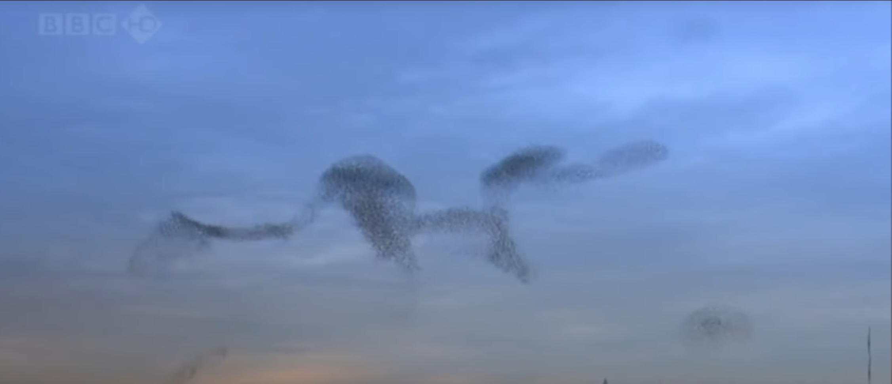

To make the abstract concept of self-organization concrete, the professor first shows a video of starling flocks (i.e., "murmuration"). Thousands of starlings form complex and fluid dynamic patterns in the sky, moving as a whole, yet without any leader or central controller issuing commands. This is a hallmark feature of self-organizing systems: macroscopic, coordinated collective behavior emerges spontaneously from simple, local interactions between individuals.

In stark contrast is the example of an orchestra conductor. The conductor coordinates the entire orchestra through global commands, representing a "top-down" centralized control mode. Self-organizing systems, however, lack such centralized control; their order is generated "bottom-up."

The lecture then shifts from the macroscopic world to the microscopic cellular scale. Prof. Frey presents four cutting-edge research examples from his group. These cases are concrete applications of self-organization theory in biology and provide real-world research context for the theories to be developed in subsequent lectures.

**1. Cell polarity of yeast**: How does an originally symmetric spherical yeast cell spontaneously break symmetry and select a specific site to form a "polar cap" for budding reproduction? This is a fundamental symmetry-breaking problem.

**Self-organization mechanism:** The polar cap itself is a pattern spontaneously formed by proteins. It serves as a biological "landmark" to organize other structures within the cell (such as actin filaments).

These organized actin bundles then push against the cell wall, forming a "bud" that eventually produces a new yeast cell. This example demonstrates how self-organized spatial patterns serve critical biological functions (cell proliferation).

**2. Min oscillations in *E. coli***: How does a protein system (Min proteins) inside *E. coli* cells form a concentration wave oscillating back and forth between the cell poles, thereby precisely locating the cell center to ensure symmetric cell division?

**Self-organization mechanism:** A protein system (Min proteins) inside the cell spontaneously forms a concentration pattern oscillating between the two cell poles.

The time-averaged effect of this dynamic oscillation results in the lowest concentration of a division-inhibiting protein at the cell center. This "permits" the assembly of the division ring (Z-ring) at the cell midpoint, ensuring that the cell divides symmetrically.

**3. Starfish oocytes**: In early-stage egg cells, how does the cytoskeleton (especially actin) organize into dynamic patterns that drive cytoplasmic flow and material redistribution?

**Self-organization mechanism:** The lecture shows chaotic, spiral-like ripples formed by proteins on the cell surface. When a wave sweeps across the cell, not only does the protein pattern change, but the cell's shape also deforms.

This example reveals the deep connection between self-organized pattern formation and cellular geometry. This poses a theoretical challenge because it requires combining pattern formation theory with differential geometry (to describe shape changes).

**4. Synthetic cell motility**: In artificially reconstructed "synthetic cells" composed of basic biomolecules, how can we design molecular interactions to achieve spontaneous motion and deformation?

**Self-organization mechanism:** Researchers extracted the Min protein system from *E. coli* and placed it on a two-dimensional surface, where it also formed dynamic patterns. When an artificial cell (vesicle) composed only of a lipid bilayer interacts with this protein pattern, the vesicle begins spontaneous directional motion.

This belongs to the realm of "synthetic biology." It demonstrates that by understanding the physical principles of self-organization, fundamental features of life (such as motility) can be decomposed and reconstructed.

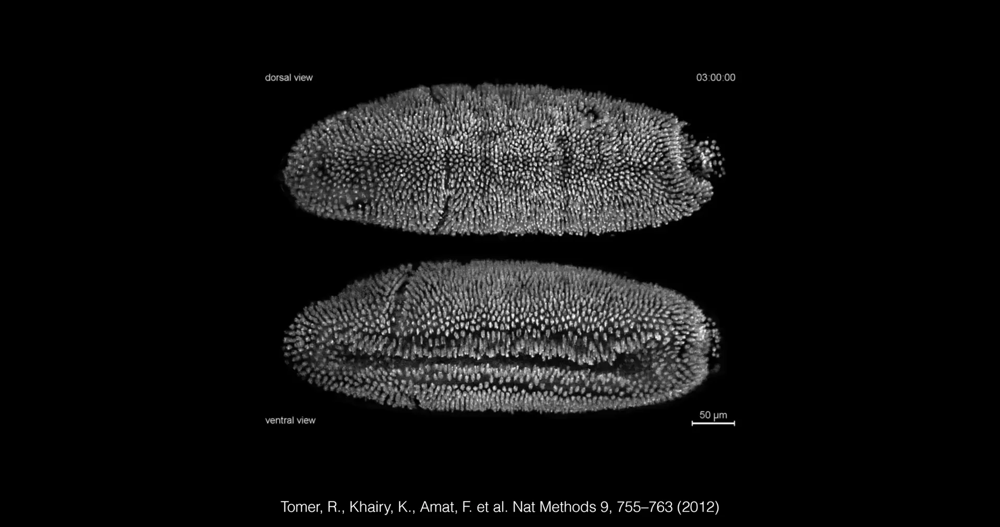

The professor also gives the example of morphogenesis in *Drosophila*. At a higher organizational level, how do living organisms form complex shapes? The image shows the early developmental process of a fruit fly embryo. Using light sheet microscopy for real-time observation, one can see how cells reorganize on a large scale, form different shapes, and eventually produce complex body structures such as segmentation. This is an instance of "morphogenesis," representing self-organization at the tissue dynamics level. Establishing theoretical descriptions for such complex life processes is one of the frontier challenges in this field.

**In this course, "pattern" is a core concept. These five examples all demonstrate how biological systems produce functional spatiotemporal patterns through self-organization.**

The lecture quotes physicist Erwin Schrödinger from his famous book *What Is Life?*: "Living matter, while not eluding the 'laws of physics'... is likely to involve 'other laws of physics' hitherto unknown, which, however, once they have been revealed, will form just as integral a part of this science."

This quote establishes a key theoretical framework for the entire course. In modern physics, Schrödinger's "other laws of physics" can be understood as the physical laws governing systems **far from thermodynamic equilibrium**. A fundamental difference between living systems and non-living matter is that they are open, energy-consuming systems. Cells maintain their highly ordered structures and perform various life functions by continuously hydrolyzing chemical fuels such as ATP. This continuous energy input makes living systems inherently nonequilibrium. Thus, Schrödinger's quote hints at the core focus of this course: **studying energy-driven nonequilibrium physics, because it is in this domain that the most fascinating self-organization and pattern formation phenomena occur. The four biophysics cases mentioned earlier are all typical nonequilibrium systems.**

The lecture presents several examples from fluid dynamics to emphasize the universality of pattern formation.

**Munich river wave:** Shows the standing wave (surfing spot) in a river channel in Munich. This is a spontaneously formed fluid pattern dominated by nonlinear dynamics, governed by the Navier–Stokes equations.

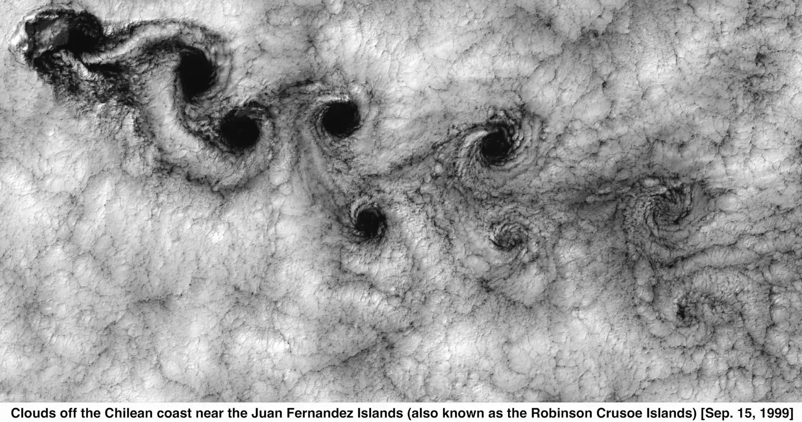

**Von Kármán vortex street:** Shows cloud layers above the Juan Fernández Islands forming regular vortex patterns behind the islands (obstacles).

**Ripple patterns:** Shows various stripe-like or differently shaped ripples formed by the interaction of water flow and sand particles in shallow water.

**Sand dunes:** Shows huge dune patterns shaped by wind in Morocco. These dunes form over centuries and are another type of self-organized pattern formed by granular media under wind forcing.

These examples show that despite vast differences in physical systems (from urban rivers, the atmosphere, to shallow sandy beaches), they can give rise to geometrically similar patterns. This strongly suggests that behind these phenomena lie universal mathematical principles independent of system-specific details. **This is also the core goal of this course: to establish "coarse-grained" theories that can predict such emergent order by using fundamental principles such as universality, symmetry, and conservation laws.**

Below is an overview of the course outline and content.

To establish a predictive theory for these phenomena, the course will focus on three core theoretical pillars:

1.Dynamical Systems Theory

2.Phase Transitions & Collective Phenomena

3.Pattern Formation & Self-Organization

# 1. Dynamical Systems Theory—The Geometry of Change

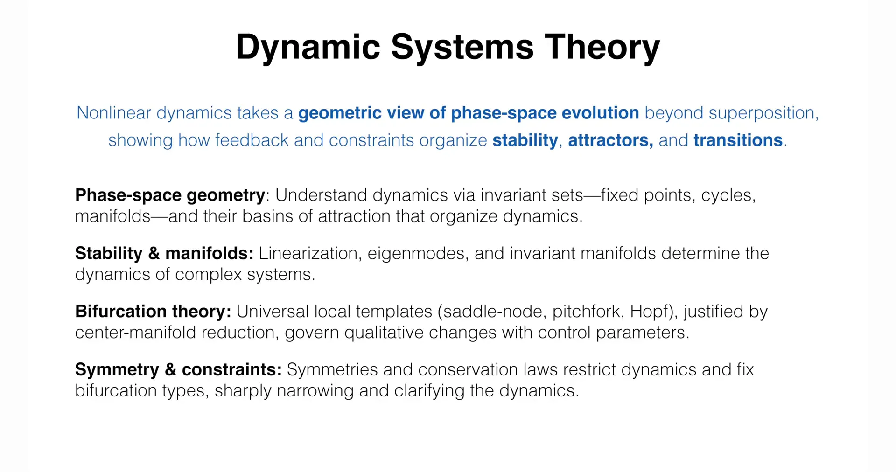

## 1.1 Core Concepts of Nonlinear Dynamics

Nonlinear dynamics theory provides a geometric perspective for understanding system evolution, transcending the limitations of the "superposition principle" in linear systems. It shows how feedback and constraints organize stability, attractors, and transitions.

In an abstract space called **phase space**, the system's state at any moment (e.g., positions and velocities of all particles) is represented as a point. As time progresses, this point traces a trajectory, revealing the system's evolution.

* **Phase-space geometry**: The long-term behavior of a system is typically governed by special invariant sets in phase space, called **attractors**. The simplest attractors are **fixed points**, corresponding to steady states; another common type is **limit cycles**, corresponding to periodic oscillations. Each attractor has its **basin of attraction**, the set of all initial states that eventually evolve to that attractor.

* **Stability & manifolds**: By **linearizing** the dynamical equations near a fixed point or limit cycle, one can analyze its stability. The **eigenmodes** from linearization reveal the system's behavior in different directions: perturbations decay in stable directions and grow in unstable directions. These stable and unstable directions together form the **stable and unstable manifolds** that guide trajectory flow in phase space.

* **Bifurcation theory**: When a control parameter (such as temperature, reactant concentration, or energy input rate) slowly changes, the geometry of phase space may undergo qualitative changes. For example, a stable fixed point may become unstable and give rise to a stable limit cycle. Such qualitative changes in dynamical behavior are called **bifurcations**. Bifurcation theory reveals that these transitions have universal local "templates," such as **saddle-node**, **pitchfork**, and **Hopf** bifurcations.

* **Symmetry & constraints**: **Symmetries** and **conservation laws** (such as energy conservation, mass conservation) impose strong constraints on dynamics. These constraints not only limit the possible evolutionary paths but also determine the types of bifurcations that can occur, greatly simplifying analysis and enabling predictions.

## 1.2 Classical Examples: From Fixed Points to Chaotic Attractors

To illustrate the core concept of "attractor," the lecture begins with a simple two-dimensional system and gradually introduces more complex attractor types. The first example shows a two-dimensional phase space containing two "landmark" fixed points: an unstable **saddle point** (open circle) and a **stable fixed point** (solid dot). This stable fixed point is an **attractor**; all trajectories starting from within its "basin of attraction" will eventually flow toward and stop at this point, representing the system reaching a **steady state**. This system is described by the equations $\partial_{t}u = -u + u^{2}v$ and $\partial_{t}v = u - v$.

The second example is the famous "Brusselator" model, which introduces another type of attractor—the **limit cycle** (red closed curve). In this system, trajectories starting from either inside or outside the cycle eventually converge to the cycle, representing the system entering a **periodic oscillation** state. Such limit cycles are the mathematical foundation for understanding many biological rhythms (such as circadian clocks). Its dynamical equations are $\partial_{t}u = \mu + u^{2}v - (\lambda + 1)u$ and $\partial_{t}v = \lambda v - u^{2}v$.

After introducing fixed points and limit cycles, the lecture turns to a more complex and famous three-dimensional system—the **Lorenz attractor**. This set of equations was originally proposed as a simplified model for atmospheric convection:
$$
\begin{aligned} 
\frac{dx}{dt} &= \sigma(y - x) \\ 
\frac{dy}{dt} &= x(\rho - z) - y \\ 
\frac{dz}{dt} &= xy - \beta z 
\end{aligned}
$$
where $x, y, z$ are variables describing the system state (corresponding to convection rate, temperature difference, and temperature profile deviation), and $\sigma, \rho, \beta$ are physical parameters. When parameters are set to specific values (e.g., $\sigma = 10, \rho = 28, \beta = 8/3$), this completely deterministic system exhibits "**deterministic chaos**" behavior.

The system's trajectory is confined to a bounded "butterfly" shaped region, but it never repeats and is extremely sensitive to initial conditions. This means that even if two initial states differ only infinitesimally, their subsequent trajectories will diverge exponentially, making long-term behavior completely unpredictable. Lorenz's discovery was revolutionary: it revealed that even in systems without randomness, governed by simple nonlinear rules, complex and unpredictable behavior can arise intrinsically.

## 1.3 Research Frontiers in Dynamical Systems

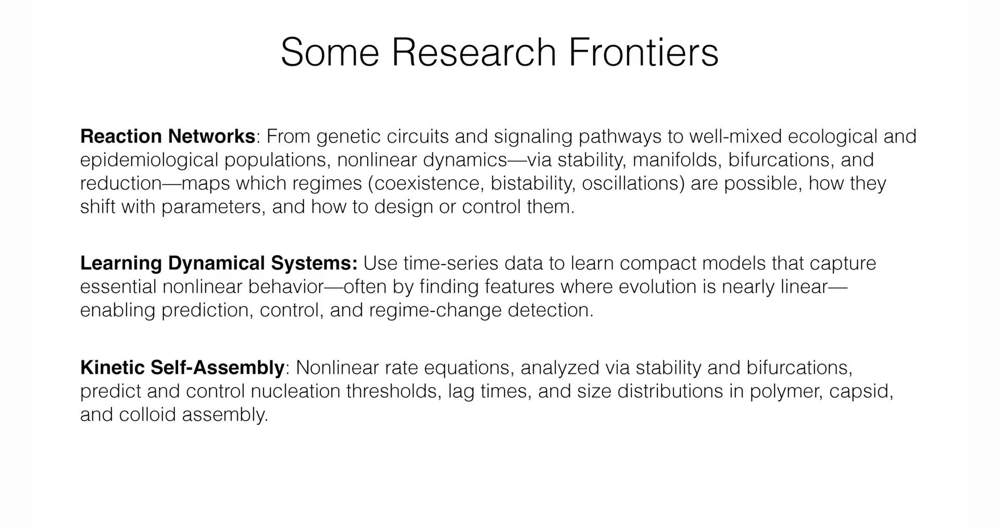

The lecture connects these foundational theories to three active research frontiers, showing applications of dynamical systems theory in modern science.

1.**Reaction Networks**: Applying stability and bifurcation analysis to understand complex networks in biology (such as gene regulatory networks, cellular signaling pathways) and ecology (such as population dynamics). The goal is to draw "phase diagrams" that clarify what behavior the system will exhibit in different parameter regimes, such as species coexistence, bistability (the system can switch between two stable states), or periodic oscillations.

2.**Learning Dynamical Systems**: A modern, data-driven research paradigm. Unlike the traditional approach of building equations from known physical laws, this field aims to use time-series data from experiments or simulations to infer the dynamical rules governing system evolution. This is a core topic at the intersection of machine learning and scientific AI.

3.**Kinetic Self-Assembly**: Using nonlinear rate equations to model, predict, and control the formation of microscopic structures, such as virus capsid assembly or DNA origami. Theoretical analysis can help predict nucleation thresholds, delay times, and size distributions and yields of final products during self-assembly, which is crucial for nanotechnology and new material design.

By contrasting with IKEA furniture (which requires external assembly), the professor emphasizes the uniqueness of biological systems. This slide lists various complex structures that spontaneously form inside living organisms, including microtubules, flagellar motors, virus capsids, and artificially designed DNA origami. The purpose of this figure is to visually present the core question studied in this field: **How do these exquisite biomolecular machines automatically "assemble" from simple building blocks without external intervention.**

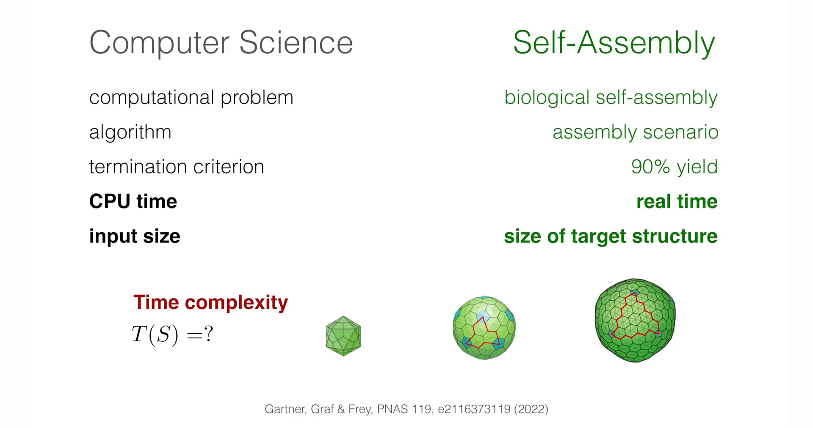

Biological self-assembly can be analogized to a "computational problem." The slide establishes a one-to-one correspondence between computer science and self-assembly: the computer's "algorithm" corresponds to the biological system's "assembly scenario"; "CPU time" corresponds to "real time"; and "input size" corresponds to "size of target structure." Through this analogy, the professor introduces a key theoretical concept—"time complexity of self-assembly," i.e., how the real time required to assemble a structure (like a virus) changes with the size of that structure.

Presenting these three frontiers together reveals a profound duality in theoretical physics research. The first two fields, "reaction networks" and "kinetic self-assembly," represent the traditional "**forward problem**": Given a set of rules (differential equations), what behavior will emerge? This is the classical path of theoretical physics. The third frontier, "learning dynamical systems," represents the "**inverse problem**": Given observed behavior (data), what are the underlying rules? The rise of inverse problems driven by machine learning is an important feature of 21st-century scientific research. Juxtaposing them indicates that a complete understanding of complex systems requires both the ability to predict from theory and the ability to infer from data—they complement each other.

# 2. Phase Transitions & Collective Phenomena—The Emergence of the Whole

The second theoretical pillar of the course shifts perspective from systems described by a few variables (ordinary differential equations, ODEs) to spatially extended systems (partial differential equations, PDEs). In such systems, we focus on one or more fields that vary continuously in space and time, i.e., the **order parameter** $\phi(\mathbf{x}, t)$, such as local concentration, density, or average molecular orientation. This is a field-theoretic view of spatially extended systems that links symmetry, conservation laws with instabilities, universality, and the emergence of macroscopic order and patterns.

**Nonequilibrium field theories**: Theories describing the evolution of these fields are built from the order parameter, symmetry, and conservation laws. For systems near thermodynamic equilibrium, dynamics typically follows a "gradient flow," meaning the system evolves toward minimizing a **free energy functional**. However, for active systems, the situation is completely different. Build them from order parameters, symmetry, and conservation laws—using gradient flows when a free energy exists; otherwise, include active driving terms that break detailed balance and reciprocity (i.e., Onsager symmetry).

In active systems, due to continuous energy input (e.g., ATP hydrolysis in cells), there are sustained energy and probability currents within the system, breaking microscopic reversibility or time-reversal symmetry, i.e., "detailed balance." The direct consequence is that such systems typically lack a simple free energy that can be minimized by dynamics. Broken detailed balance is the core feature distinguishing nonequilibrium physics from equilibrium physics.

**Linear stability analysis**: To study whether a spatially uniform base state is stable, the usual method is to introduce a small sinusoidal perturbation with a specific wavevector $\mathbf{k}$ (of the form $e^{i\mathbf{k}\cdot\mathbf{x} + \omega t}$). By solving the linearized dynamical equations, one obtains the relationship between the growth rate $\omega$ and the wavevector $\mathbf{k}$, i.e., the **dispersion relation** $\omega(\mathbf{k})$. If for some $\mathbf{k}$, $\text{Re}(\omega) > 0$, then perturbations at that wavelength grow exponentially, the system becomes unstable, and tends to form a spatial pattern with characteristic wavelength $2\pi/|\mathbf{k}|$.

**Interfaces & topological defects**: After pattern formation, the long-term evolution is often dominated by the motion of boundaries between different ordered regions (**interfaces**) or singular points in the order parameter field (**topological defects**). The dynamics of these interfaces and defects, such as motion, interaction, creation, and annihilation, control macroscopic processes like "coarsening" (i.e., the growth of ordered domain size with time). Long-term behavior is governed by the motion and interaction of domain walls and defects; curvature and (in driven systems) active stresses determine coarsening laws, front speeds, and persistent textures.

## 2.2 Classical Example 1: Phase Separation in Binary Mixtures

This example describes how a homogeneous mixture like oil and water spontaneously separates into two regions enriched in each component. The classical model describing this process is the **Cahn–Hilliard equation**.

The model consists of three core parts:

1.**Ginzburg–Landau free energy functional $F[\phi]$**: This expression describes the system's total energy and contains two terms.

$$
F[\phi] = \int_{\Omega} \left[ f(\phi) + \frac{\kappa}{2}|\nabla\phi|^2 \right] d\mathbf{x}
$$

* **Bulk free energy density $f(\phi)$**: This term describes the energy of a homogeneous mixture. Its graph is a **double-well potential**, meaning the system's energy is lower in the two pure phase states (e.g., order parameter $\phi = \pm 1$) than in the mixed state ($\phi = 0$).

* **Gradient energy $\frac{\kappa}{2}|\nabla\phi|^2$**: This term is proportional to the square of the order parameter gradient and penalizes sharp spatial concentration variations. Thus, forming an interface between phase domains costs energy. The parameter $\kappa$ controls the interface thickness and energy.

2.**Chemical potential $\mu$**:

$$
\mu = \frac{\delta F}{\delta \phi} = f'(\phi) - \kappa\nabla^2\phi
$$

The chemical potential is the functional derivative of the free energy functional with respect to the order parameter field. It plays the role of a thermodynamic force, driving the system toward lower energy states, and is the local driving force for mass diffusion.

3.**Continuity equation $\partial_t \phi$**:

$$
\partial_t \phi = \nabla \cdot (M(\phi) \nabla \mu)
$$

This is the core dynamical equation, essentially a statement of **mass conservation**, i.e., $\partial_t \phi = -\nabla \cdot \mathbf{J}$, where $\mathbf{J}$ is the mass flux. Here, the flux $\mathbf{J}$ is assumed proportional to the gradient of the chemical potential, $\mathbf{J} = -M\nabla\mu$, which is a generalization of the classical Fick's diffusion law. $M$ is the mobility.

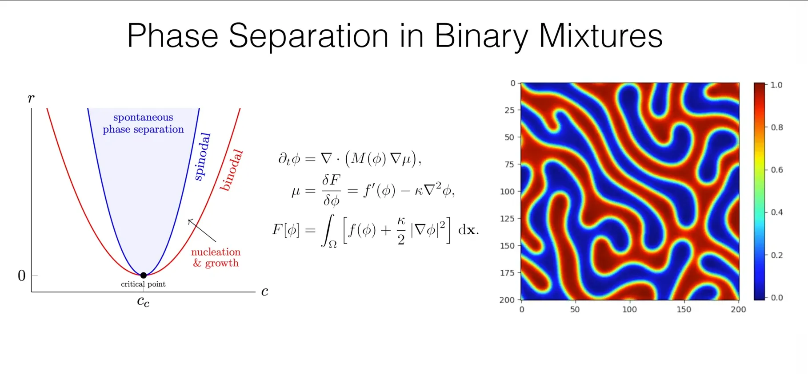

**Physical process (spinodal decomposition):** If a homogeneous mixture is rapidly quenched into the unstable region of its phase diagram (the spinodal region), then small, random concentration fluctuations in the system will spontaneously grow exponentially. This leads to rapid separation into two interpenetrating, connected phase domains. Subsequently, these domains "coarsen" through interface motion, with small domains being absorbed by larger ones, thereby continuously reducing the system's total interfacial energy.

## 2.3 Classical Example 2: Topological Defects in Active Matter

The professor then introduces another typical active matter system: **active nematics**. This is a fluid composed of elongated particles capable of actively exerting forces (such as kinesin-driven microtubule bundles or bacteria).

**Order parameter**: The local orientational order of the system is described by a second-rank traceless symmetric tensor $\mathbf{Q}$.

**Topological defects**: In two-dimensional systems, these are point-like singularities in the orientation field, characterized by a topological charge (or winding number), most commonly $+1/2$ and $-1/2$ defects. In active nematics, these defects are not stationary. Due to symmetry breaking, $+1/2$ defects can self-propel like particles, stirring the surrounding fluid and generating complex flows.

**Coupled equations**: The system's dynamics is described by coupled partial differential equations for the order parameter tensor $\mathbf{Q}$ and the fluid velocity field $\mathbf{u}$. A key term is the **active stress**, typically of the form $\sigma_a \propto \alpha \mathbf{Q}$, where $\alpha$ is the activity coefficient. This term represents the systematic forces exerted by active particles on the fluid. It is this active stress that drives the system into a persistent, chaotic flow state called "**active turbulence**" or "**defect chaos**."

The professor classifies the frontier field of active matter field theories, showing several key phenomena that researchers aim to describe.

1."Scalar active matter," consisting of self-propelled particles, different from traditional thermodynamic mixtures.

2."Active nematics," the chaotic system of microtubules and motor proteins shown in the previous slide.

3."Chiral active fluids," showing patterns with chirality.

4."Active metamaterials," whose dynamical behavior (such as topologically protected edge flows) is confined to the system's boundary.

At the bottom of the slide are the "nonequilibrium field theory" equations used to describe these systems. The professor uses this to emphasize two key features of these theories. First, for "scalar active matter," although the equations are formally similar to equilibrium phase separation models, the chemical potential **cannot** be derived from a free energy functional, mathematically reflecting the system's violation of "detailed balance." Second, for "active nematics," the theory becomes more complex, requiring not only scalar fields (like density) but also "vector fields" (to describe fluid velocity) and "tensor fields" (to describe local orientation of active particles).

## 2.4 Research Frontiers in Collective Phenomena

1.**Active Scalar Matter**: From self-propelled colloids and chemotactic populations to active emulsions, (using) nonlinear dynamics—via linear stability analysis, field theory, and interface theory—to map out which (behavioral) regimes (homogeneous, phase-separated, microphase/clustered, traveling wave fronts) occur, how they change with activity and interactions, and how to control them.

This type of system consists of self-propelled particles without orientational alignment interactions. Its signature phenomenon is **motility-induced phase separation (MIPS)**. In this phenomenon, even when particles only have purely repulsive interactions, they can undergo phase separation. The mechanism is: when self-propelled particles enter denser regions during motion, their effective speed decreases due to frequent collisions. This causes particles to more easily "jam" and accumulate in dense regions, further increasing the density there. This positive feedback loop eventually leads to spontaneous separation into a high-density "liquid phase" and a low-density "gas phase."

2.**Active Condensates in Cells**: From nucleoli and stress granules to transcriptional hubs, (using) nonlinear dynamics—via reaction–diffusion models and phase-field models with active turnover—to map out which (behavioral) regimes (nucleation/growth, arrested microphase, localization, oscillation/wetting) occur, how they change with energy input and kinetics, and how to control them.

Applying phase separation physics to understand the widely present "membraneless organelles" in cells, such as nucleoli and stress granules. These structures are thought to be "droplets" (i.e., **biomolecular condensates**) in the cytoplasm or nucleus. Unlike simple physical phase separation, the formation, dissolution, and dynamic behavior of these condensates are precisely regulated by active, energy-consuming biochemical reactions within the cell (such as protein synthesis/degradation, phosphorylation/dephosphorylation).

3.**Data-driven theory**: Identifying necessary order parameters from data, recovering continuum field equations consistent with symmetry and conservation laws. Similar to the frontier in the dynamical systems section, but applied to spatially extended systems. The goal is to use high-resolution experimental data (e.g., microscopy videos) to automatically discover the partial differential equations governing active matter system evolution through machine learning and sparse regression methods.

This part of the lecture demonstrates the powerful unifying force of the **field theory** conceptual framework. From phase separation in binary fluids (a "passive" system driven by thermodynamics), to active nematics (an "active" system driven by intrinsic motors), to MIPS in active scalar particles and active condensates in cells, all these seemingly disparate phenomena can be described by a unified mathematical language—theories based on continuous order parameter fields. They all obey partial differential equations determined by symmetry and conservation laws. The fundamental difference between passive and active systems is simply whether the equations contain those "active terms" (like active stress) that break detailed balance. This shows that the field theory framework has great flexibility and universality: by modifying specific terms in the equations, the same conceptual language can describe a wide range of physical phenomena from oil-water mixtures to the interior of living cells. The frontier of "data-driven theory" is the ultimate embodiment of this idea—it attempts to find these key equation terms directly from raw data.

# 3. Pattern Formation & Self-Organization—The Physics of Life

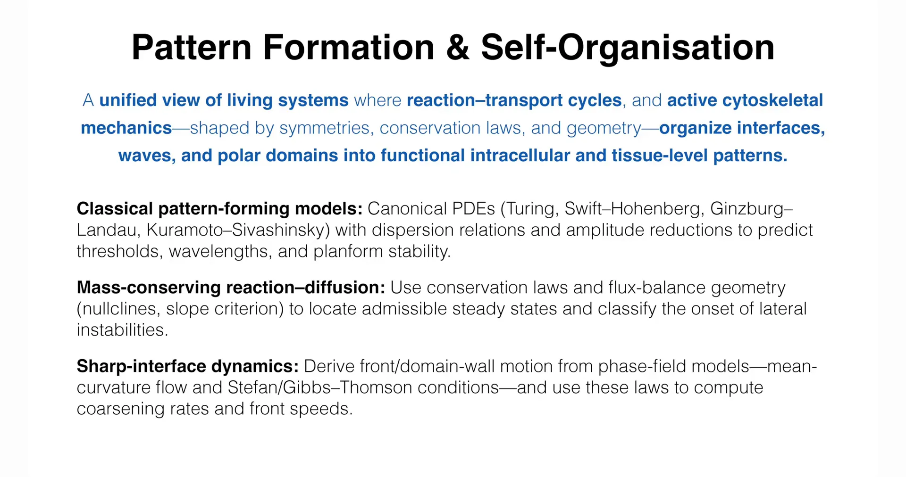

The third theoretical pillar of the course aims to synthesize the tools and ideas from the first two pillars (dynamical systems theory and nonequilibrium field theory) to address how functional patterns arise in biological contexts. The core here is **reaction–transport cycles** and **active mechanics** dominated by the **cytoskeleton**.

A **unified view of living systems** in which **reaction–transport cycles** and **active cytoskeletal mechanics**—shaped by symmetry, conservation laws, and geometry—organize **interfaces, waves, and polar domains** into functional intracellular and tissue-level patterns.

**Classical pattern-forming models**:
Canonical PDEs (such as Turing, Swift–Hohenberg, Ginzburg–Landau, Kuramoto–Sivashinsky), using dispersion relations and amplitude reductions to predict thresholds, wavelengths, and planform stability.

Introduces a series of classical partial differential equations viewed as "paradigms" or "universal templates" for pattern formation, such as the **Turing model**, **Swift–Hohenberg equation**, and **Ginzburg–Landau equation**. These models can predict pattern formation thresholds, characteristic wavelengths, and the stability of different geometric patterns (such as stripes, hexagons) through linear stability analysis and weakly nonlinear analysis.

**Mass-conserving reaction–diffusion**: Using conservation laws and flux-balance geometry (nullclines, slope criterion) to locate admissible steady states and classify the occurrence of lateral instabilities.

This is a crucial constraint in biological systems. Unlike many open chemical reactors, the total amount of many proteins within a cell is fixed. This conservation law dramatically changes the possible instabilities and resulting patterns.

**Sharp-interface dynamics**:
Deriving front/domain-wall motion from phase-field models—(such as) mean-curvature flow and Stefan/Gibbs–Thomson conditions—and using these laws to compute coarsening rates and front speeds.

In many cases, directly solving the entire field's partial differential equations is very complex. An effective simplification is to derive equations describing the motion of region boundaries (interfaces or fronts). This approach can directly calculate interface propagation speeds or phase domain coarsening rates without concerning details far from the interface.

## 3.1 Classical Example 1: Swift–Hohenberg Equation

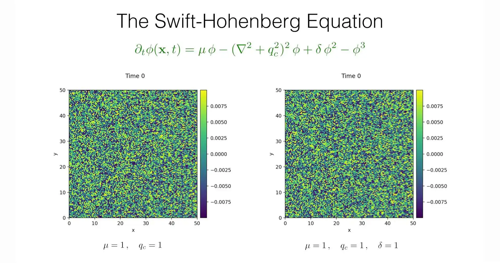

The lecture uses the Swift–Hohenberg (SH) equation as a paradigm model to describe systems that spontaneously form patterns with a characteristic wavelength.

A simplified but representative form of the SH equation is:

$$
\partial_t \phi = \mu \phi - (\nabla^2 + q_c^2)^2 \phi - \phi^3
$$

**Linear growth/decay term $\mu \phi$**: $\mu$ is a control parameter. When $\mu < 0$, the uniform state $\phi=0$ is stable, and any perturbation decays. When $\mu > 0$, the uniform state becomes unstable, and perturbations start to grow.

**Pattern selection term $-(\nabla^2 + q_c^2)^2 \phi$**: This is the most crucial term in the SH equation. In Fourier space, the Laplacian $\nabla^2$ becomes $-k^2$ (where $k$ is the wavenumber). Thus, this term becomes $-(-k^2 + q_c^2)^2$. This operator strongly damps modes with wavenumbers $k$ far from $q_c$, but for $k = q_c$, its damping is zero. Thus, it strongly "selects" patterns with wavenumber $q_c$ (i.e., wavelength $2\pi/q_c$), making them the first to destabilize and grow.

**Nonlinear saturation term $-\phi^3$**: This is a suppression term that prevents pattern amplitude from growing indefinitely, allowing the system to eventually reach a stable pattern state with finite amplitude.

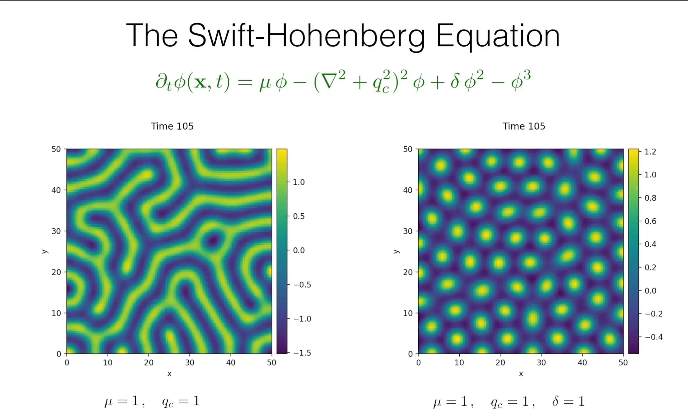

The SH equation was originally derived as a simplified model for Rayleigh–Bénard convection (convection rolls forming in heated fluid layers), but it successfully captures the universal features of the transition from uniform state to periodic pattern in many different physical systems, making it a paradigm for studying pattern formation.

## 3.2 Classical Example 2: Min Protein Oscillations in *E. coli*

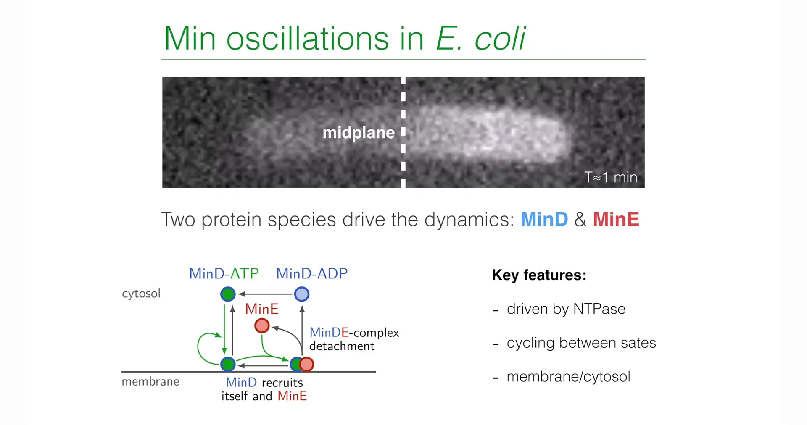

The lecture returns to the example mentioned in the introduction. The biological function of this system is to precisely locate the cell center for *E. coli* before division.

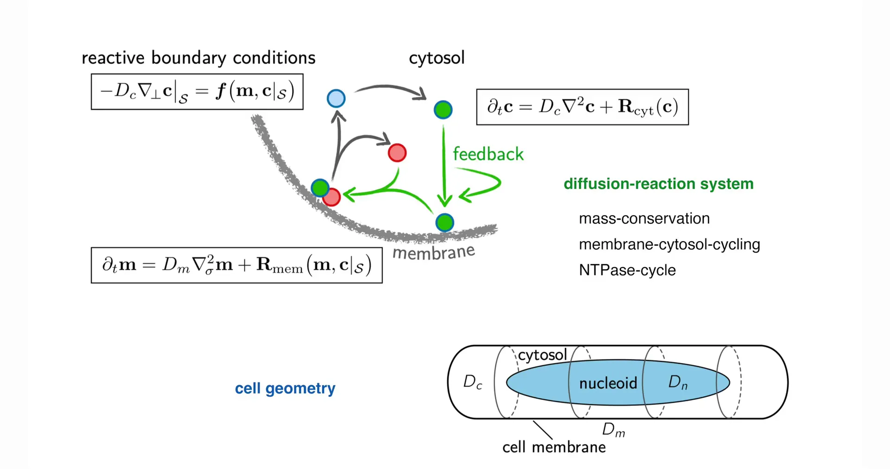

This is a self-organized oscillator driven by reactions, diffusion, and material cycling between different compartments (cytoplasm and membrane).

1.**Players**: The core consists of two proteins, MinD and MinE. MinD, when bound to ATP, can attach to the cell membrane.

2.**Cycle process**: Cytoplasmic MinD-ATP binds to the cell membrane. Membrane-bound MinD cooperatively recruits more MinD-ATP, forming a concentrated "polar zone." At the same time, membrane-bound MinD also recruits MinE from the cytoplasm.

3.**Negative feedback**: Once MinE binds to membrane-bound MinD, it activates MinD's ATPase activity, causing ATP hydrolysis to ADP. MinD-ADP has low affinity for the membrane and detaches, bringing MinE back to the cytoplasm.

4.**Oscillation**: This "attachment-cooperative recruitment-activation-detachment" cycle, within the cell's finite geometry and accompanied by protein diffusion in the cytoplasm, eventually forms a protein concentration wave traveling back and forth from one cell pole to the other. This is a typical mass-conserving reaction–diffusion system because the total amounts of MinD and MinE within the cell are constant. The division-inhibiting protein MinC moves together with MinD, so after time-averaging, MinC concentration is lowest at the cell center. This "permits" assembly of the division ring at the cell midpoint, ensuring symmetric cell division.

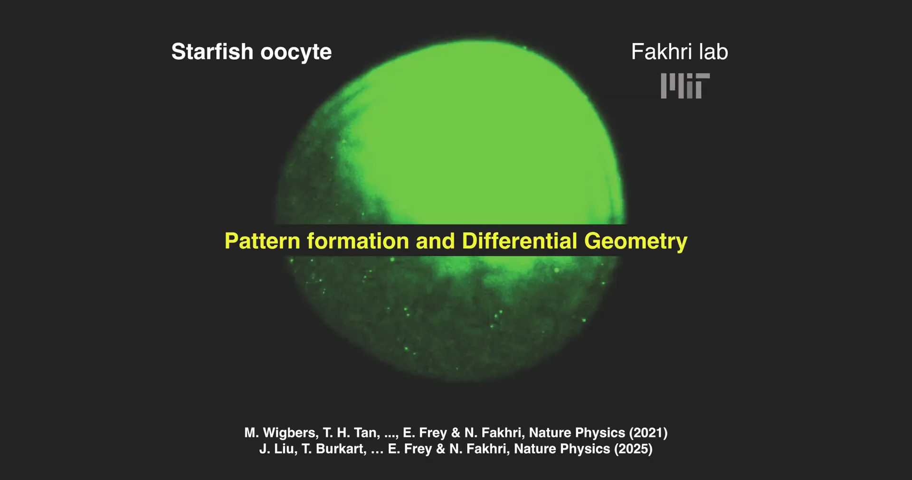

The professor revisits the "starfish oocyte" example mentioned at the beginning of the lecture. **The purpose is to emphasize the deep connection between "pattern formation" and "differential geometry" in theory.**

In the preceding minutes, he explained how the Min protein pattern in *E. coli* "senses" and "reads" the cell's geometry (i.e., the cylinder). This starfish oocyte slide shows a more advanced, complex coupling:

1.**Pattern causes deformation**: The video shows a protein wave (i.e., "pattern") sweeping across the oocyte surface.

2.**Geometric response**: Crucially, accompanying this wave, the cell itself undergoes "**geometric deformation**."

A "**bidirectional coupling**": Not only does geometry ("differential geometry") affect "pattern formation," but conversely, "pattern formation" actively changes geometry. The professor calls this "a very challenging theoretical task" because it requires theorists to establish a unified model that simultaneously describes the interaction between these two.

## 3.3 Open Research Questions

At the conclusion, the professor poses a series of forward-looking questions connecting physics and biology, representing future research directions in this field.

* **Computation with patterns?** Can the complex spatiotemporal patterns within cells be used to perform some form of information processing or "computation"? As Alan Turing, a pioneer of modern computing theory, himself speculated.

"Most of an organism, most of the time, is developing from one pattern into another, rather than from homogeneity into a pattern." (Alan Turing)

* **Reaction-induced micro-phase-separation?** Can chemical reactions induce spatial organization within cells? Can biochemical reaction networks within cells actively drive and regulate the formation and dissolution of biomolecular condensates, thereby achieving dynamic organization of intracellular space?

* **Pattern-induced transport?** Can traveling chemical waves or other dynamic patterns within cells be used to actively and directionally transport molecular "cargo," achieving more efficient material transport than simple diffusion?

From the first two theoretical pillars mainly focusing on how to **describe** and **predict** pattern emergence, to these open questions in the final part, the course shifts from **phenomena** to **function**. The core of these questions is no longer just "What pattern forms?" but "**What are these patterns for?**" Can they compute? Can they organize space? Can they transport materials? This reflects the ultimate goal of modern biophysics: not only to build physical models for life phenomena but also to understand how the physical principles behind these phenomena serve and ultimately realize complex biological functions. This elegantly echoes Schrödinger's profound thoughts on "living matter" at the beginning of the lecture, forming a complete and inspiring closed loop.

# Summary: A Unified View of Emergent Order

The table below summarizes the three core theoretical pillars of this course series:

| Feature | Dynamical Systems Theory | Phase Transitions & Collective Phenomena | Pattern Formation & Self-Organization |
|---------|--------------------------|------------------------------------------|---------------------------------------|
| Typical systems | Low-dimensional, well-mixed systems | Spatially extended, many-body systems | Biological systems (cells, tissues) |
| Mathematical language | Ordinary differential equations (ODEs) | Partial differential equations (PDEs), field theory | Reaction–diffusion PDEs, active mechanics |
| Core concepts | Phase space, attractors, bifurcations, chaos | Order parameter, free energy, linear stability, defects | Mass conservation, feedback loops, function |
| Classical examples | Lorenz attractor | Cahn–Hilliard equation, active nematics | Swift–Hohenberg equation, Min protein oscillations |

Through three interrelated theoretical pillars—dynamical systems theory, nonequilibrium field theory, and biological pattern formation theory—a powerful and unified analytical toolkit is constructed.

The core content of the course is that by abstracting from microscopic details and instead focusing on universal principles such as symmetry, conservation laws, and the nature of instabilities, we can build coarse-grained theories with strong predictive power. These theories can explain the emergence of order from non-living physical systems to complex living systems.
