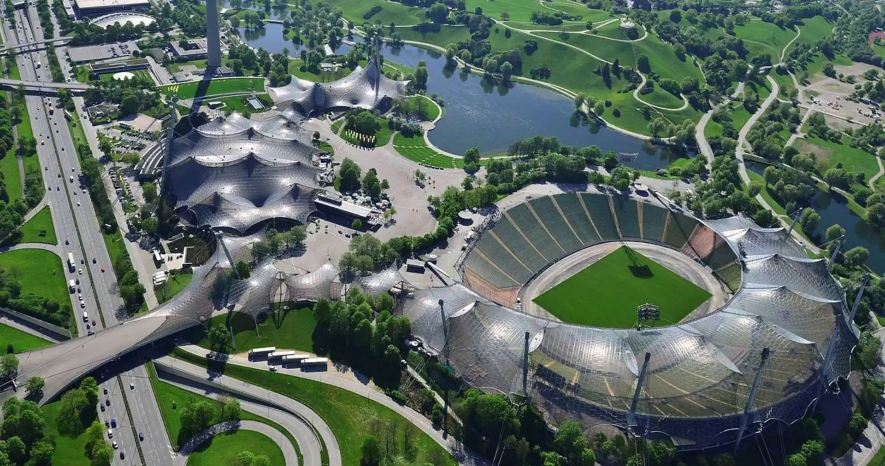
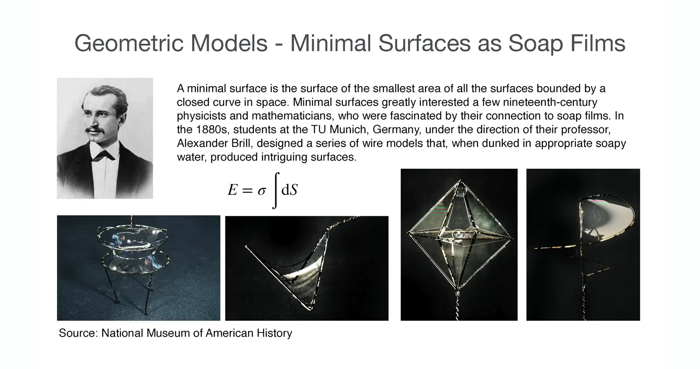
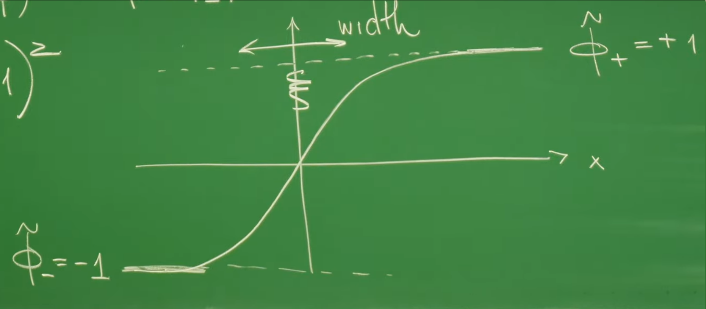
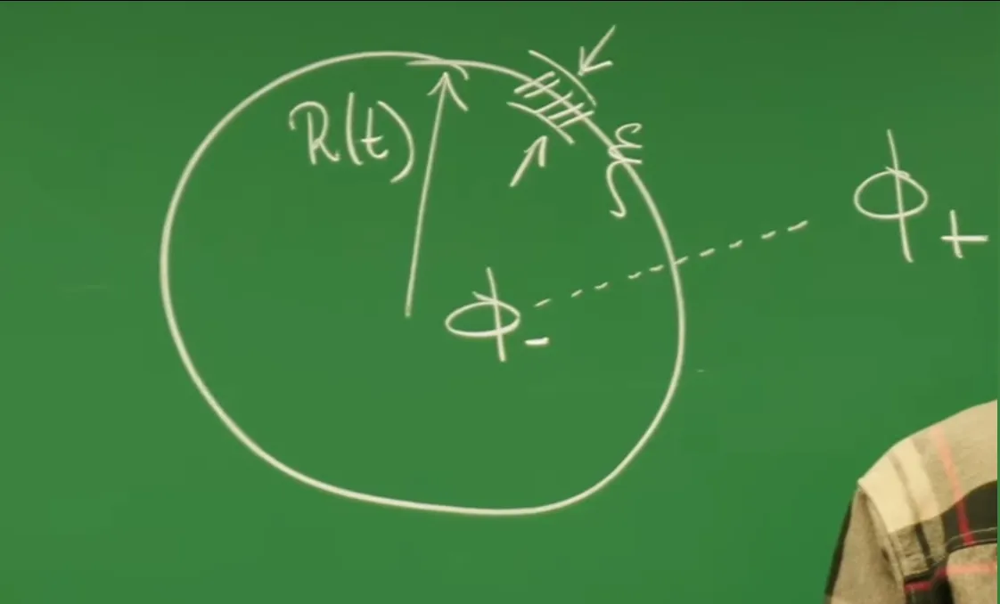
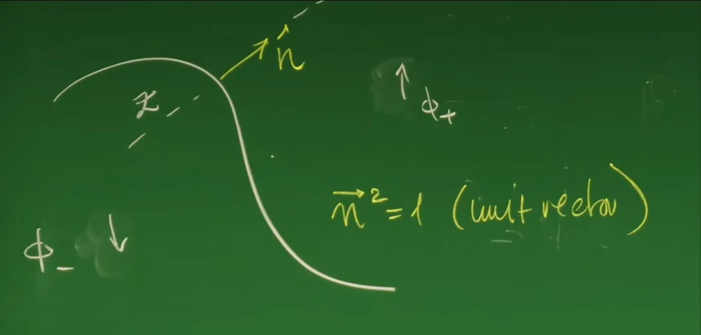

# Introduction - From Field Theory to Geometric Dynamics

In **Lecture 9**, the course constructed the Ginzburg-Landau free energy functional describing non-equilibrium phase transitions based on Landau mean-field theory and symmetry principles, and derived the **Allen-Cahn Equation (Model A)** describing the evolution of non-conserved order parameters. Through Linear Stability Analysis (LSA), Lecture 9 successfully explained how systems spontaneously break symmetry from uniform high-temperature disordered states through **Spinodal Decomposition**, forming locally ordered structures. However, linear theory is only valid for the very early stages of phase transitions, i.e., the period when order parameter $\phi$ is small and spatial fluctuations are gentle. When system evolution enters the late stage, the order parameter has saturated to the potential well minima ($\pm \phi_0$) in most spatial regions, and the system is clearly divided into different "Domains"—the physical picture undergoes a qualitative transformation.

At this point, the system's dynamics is no longer dominated by small fluctuations in the Bulk, but is controlled by the **Interfaces** or **Domain Walls** separating different ordered phases. These interfaces are not abstract mathematical boundaries, but physical entities carrying Gradient Energy Density. At this stage, understanding system evolution requires a critical perspective shift: from focusing on the scalar field $\phi(\vec{x}, t)$ distribution throughout space, to focusing on the dynamical behavior of interface geometric shapes. This **Coarse-graining** process from microscopic field theory to macroscopic geometric dynamics is the core methodology for handling complex spatially extended systems.

To intuitively illustrate the physical connection between interface tension and geometric shape, the professor first displayed the tensile membrane structure of the 1972 Munich Olympic Stadium.






Geometric Models - Minimal Surfaces as Soap Films. The person in the upper left corner is **Professor Alexander Brill**. In the 1880s at the Technical University of Munich, he supervised students to design a series of wire frame models. These models were dipped into soapy water to generate interesting surface shapes, helping physicists and mathematicians of that era study minimal surfaces. $E = \sigma \int \text{d}S$ reveals the physical mechanism by which soap films form minimal surfaces. $E$ represents surface energy. $\sigma$ (sigma) represents the surface tension coefficient. $\int \text{d}S$ represents total surface area. For the system to reach the lowest energy stable state (minimize $E$), with constant surface tension, it must minimize the surface area ($\int \text{d}S$). The four photographs below show thin films formed when wire frame models of different geometric shapes are dipped in soap solution. The shapes these films automatically form are the minimal area surfaces under given boundaries (wire frames), i.e., minimal surfaces.


The design inspiration for this building originated from the principle of Minimal Surfaces, whose history can be traced back to the soap film models made by Professor Alexander Brill and his students at the Technical University of Munich in the 19th century. Soap films automatically adjust their shape under the drive of surface tension to minimize surface area, ultimately forming steady-state structures with zero mean curvature. This macroscopic phenomenon has profound mathematical isomorphism with microscopic Allen-Cahn dynamics. The goal of this lecture is precisely to start from the microscopic Allen-Cahn equation and, through Singular Perturbation Theory and multiscale expansion, rigorously derive effective equations for interface motion. The analysis will prove that in non-conserved systems, the normal velocity $V$ of interfaces is proportional to their local mean curvature $H$ ($V \propto -H$), i.e., **Curvature-Driven Flow**.


This conclusion not only explains the **Coarsening** phenomenon in phase separation processes but also provides a theoretical foundation for understanding crystal growth, biological membrane dynamics, and more. At the same time, the discussion of interface dynamics also lays the foundation for **the next lecture (Lecture 11)**. In the next lecture, the physical constraint will change from "non-conserved" to "conserved" (i.e., Model B / Cahn-Hilliard equation), introducing thermodynamics of mixed liquids and Maxwell Construction, whereupon interface dynamics will exhibit Ostwald ripening behavior completely different from this lecture.

# 1. Static Interface Solutions and Surface Tension

In **Lecture 9**, the course used Linear Stability Analysis (LSA) to reveal how uniform systems spontaneously generate small density fluctuations through Spinodal decomposition. However, the validity of linear theory is limited to the early phase transition period. As evolution continues, the order parameter $\phi$ rapidly saturates to thermodynamic steady-state values $\pm \phi_0$ in most spatial regions, and the system enters a late stage dominated by nonlinearity. At this point, the physical picture undergoes a fundamental transformation: the system is no longer small perturbations in a uniform medium, but is clearly divided into different "Domains."

In this state, the system's energy and dynamical characteristics are mainly concentrated at the **Interfaces** separating different ordered phases. To understand the laws of interface motion (i.e., interface dynamics), the primary task is to analyze their **static structure**. In non-conserved systems described by the Allen-Cahn equation (Model A), what spatial profile does a stationary interface have? How much energy cost is required to maintain such a non-uniform structure? This lecture will derive analytical solutions for static domain walls starting from the microscopic field equation, and thereby introduce the microscopic definition of **Surface Tension**. This is not only a bridge connecting microscopic field theory and macroscopic geometric dynamics, but also lays the foundation for the next lecture (Lecture 11) in handling more complex conserved systems (Model B) and Maxwell construction.

## 1.1 Steady-State Conditions and One-Dimensional Mechanical Analogy

The starting point of analysis is the standard non-conserved scalar field equation—**Model A (Allen-Cahn Equation)**:

$$
\partial_t \phi(\mathbf{x}, t) = - \frac{\delta \mathcal{F}}{\delta \phi} = \kappa \nabla^2 \phi - f'(\phi)
$$

where:

* $\phi(\mathbf{x}, t)$ is the real scalar order parameter (such as magnetization or concentration difference in binary mixtures).

* $\kappa$ is the **Stiffness coefficient**, originating from the gradient penalty term $\frac{\kappa}{2}(\nabla \phi)^2$ in the free energy functional. It characterizes the strength of spatial coupling, physically tending to smooth out spatial gradients and suppress interface formation.

* $f(\phi)$ is the local free energy density, usually taking the Landau double-well form, driving the system to undergo symmetry breaking and tending to produce separated phases.

To find **static interface solutions**, impose the steady-state condition $\partial_t \phi = 0$. Consider the simplest geometric configuration: an infinite system with a Flat Interface perpendicular to the $x$-axis, separating the $\phi_-$ phase on the left from the $\phi_+$ phase on the right. Due to translational symmetry, $\phi$ depends only on spatial coordinate $x$, and the partial differential equation simplifies to a second-order ordinary differential equation:

$$
\kappa \frac{d^2 \phi}{dx^2} - f'(\phi) = 0 \quad \Rightarrow \quad \kappa \partial_x^2 \phi = f'(\phi)
$$

**Physical Analogy**:

This equation is mathematically equivalent to Newton's equation of motion for a particle of mass $\kappa$ in an **inverted potential** $-f(\phi)$ (here spatial coordinate $x$ plays the role of "time," and field variable $\phi$ plays the role of "position"). This means interface profile formation can be viewed as the system seeking an "optimal trajectory" in space connecting two potential energy extrema.

## 1.2 Nondimensionalization and Correlation Length - Derivation of the Kink Solution

To solve analytically and extract the system's characteristic scales, physical quantities need to be **Nondimensionalized**.

For the standard $\phi^4$ double-well $V(\phi) = -\frac{r}{2}\phi^2 + \frac{u}{4}\phi^4$ (where $r, u > 0$), its two steady-state minima are located at $\phi_{\pm} = \pm \sqrt{r/u}$. First introduce dimensionless field variable $\tilde{\phi}$, normalizing the order parameter:

$$
\phi(x) = \phi_+ \cdot \tilde{\phi}(x) = \sqrt{\frac{r}{u}} \tilde{\phi}(x)
$$

At this point, steady-state values correspond to $\tilde{\phi} = \pm 1$. For computational convenience, shift the free energy density's zero point to the steady state, i.e., require $f(\phi_{\pm}) = 0$. The adjusted potential function is written as:

$$
f(\phi) = \frac{r^2}{4u} (\tilde{\phi}^2 - 1)^2
$$

Substituting the transformed variables into the steady-state equation $\kappa \partial_x^2 \phi = f'(\phi)$ and organizing dimensional relationships, a characteristic length scale $\xi$ naturally emerges. Professor Frey defines it as the **Correlation Length**:

$$
\xi = \sqrt{\frac{2\kappa}{r}}
$$

**Physical Meaning of $\xi$**:

1.**Interface "Thickness"**: It determines the spatial range required for the order parameter to transition from $\phi_-$ (-1) to $\phi_+$ (+1). The interface is not a mathematical geometric surface, but a physical layer with finite width $\sim \xi$.

2.**Critical Divergence**: When control parameter $r \to 0$ (i.e., temperature approaches critical point $T_c$), $\xi \propto r^{-1/2} \to \infty$. This indicates that near the critical point, fluctuations become long-range correlated, the concept of interface becomes blurred, until interface width diverges and the system enters the critical opalescence state.

3.**Scale Separation Assumption**: When deriving interface dynamics later in this lecture, a key assumption is implicit: the system is far from the critical point, so that interface width is much smaller than the system's macroscopic scale (such as droplet radius $R$), i.e., $\xi \ll R$.

Introducing dimensionless spatial coordinate $\tilde{x} = x / \xi$, the equation simplifies to minimal form:

$$
\frac{d^2 \tilde{\phi}}{d\tilde{x}^2} = \tilde{\phi} (\tilde{\phi}^2 - 1)
$$

Using the integrating factor method (analogous to energy conservation integrals in classical mechanics), reduce the second-order equation:

$$
\frac{1}{2} \left( \frac{d\tilde{\phi}}{d\tilde{x}} \right)^2 = \frac{1}{4} (\tilde{\phi}^2 - 1)^2 \quad \Rightarrow \quad \frac{d\tilde{\phi}}{d\tilde{x}} = \pm \frac{1}{\sqrt{2}} (1 - \tilde{\phi}^2)
$$

(Note: coefficient differences depend on specific prefactors in potential energy definition; qualitative behavior is consistent here).

Through separation of variables and integration, we obtain the famous **Kink Solution**:

$$
\tilde{\phi}(\tilde{x}) = \tanh(\tilde{x} - \tilde{x}_0)
$$

Returning to original physical variables, the analytical expression for the static interface is:

$$
\phi(x) = \phi_+ \tanh\left( \frac{x - x_0}{\xi} \right) = \sqrt{\frac{r}{u}} \tanh\left( \sqrt{\frac{r}{2\kappa}} (x - x_0) \right)
$$

This solution describes a domain wall centered at $x_0$ with width approximately $\xi$. Field variable $\phi$ smoothly and continuously connects the two thermodynamic steady states in this region.



Structure and characteristic scale of the static interface Kink solution. The figure shows the dimensionless order parameter $\tilde{\phi}$ as a function of spatial coordinate $x$. The order parameter switches between $\tilde{\phi}=-1$ ($\phi_-$) and $\tilde{\phi}=+1$ ($\phi_+$) steady states. The $\tanh(x)$ function describes the smooth transition profile of the interface. The "width" marked in the figure corresponds to correlation length $\xi$, which defines the region where gradients are concentrated. In this region, gradient energy $\kappa(\partial_x \phi)^2$ is significantly non-zero.

## 1.3 Microscopic Origin of Surface Tension

Although the Kink solution is a local dynamical steady state, relative to the ground state uniform throughout space (all $\phi_+$ or all $\phi_-$), the existence of the interface introduces additional energy. This **excess free energy** per unit area is precisely the microscopic definition of **Surface Tension ($\gamma$)**:

$$
\gamma = \frac{F[\phi_{\text{kink}}] - F[\phi_{\text{uniform}}]}{A} = \int_{-\infty}^{+\infty} dx \left[ \underbrace{\frac{\kappa}{2} (\partial_x \phi)^2}_{\text{Gradient energy}} + \underbrace{f(\phi)}_{\text{Potential energy penalty}} \right]
$$

This integral reveals that surface tension originates from the balance of two competing energies:

1.**Gradient Energy (Stiffness Term)**: Originates from spatial variation of the field. The steeper the interface (smaller $\xi$), the larger the gradient, the higher the energy. This tends to make the interface **wider** to slow down changes.

2.**Potential Energy (Potential Term)**: Originates from the field deviating from minima $\phi_{\pm}$. Inside the interface, $\phi$ must climb over the potential barrier. The wider the interface, the larger the volume in high potential energy regions, the higher the energy. This tends to make the interface **narrower**.

According to the first integral of the steady-state equation (analogous to the Virial theorem in mechanics), these two energy terms are everywhere equal in the steady-state solution: $\frac{\kappa}{2}(\partial_x \phi)^2 = f(\phi)$. Using this relation, the integral can be converted to a form depending only on potential energy:

$$
\gamma = \int_{-\infty}^{+\infty} 2 f(\phi(x)) dx
$$

Furthermore, through variable substitution $dx = \frac{d\phi}{\phi'} = \frac{d\phi}{\sqrt{2f/\kappa}}$, the spatial integral can be converted to an integral in field variable space. This step is crucial because it gives a general expression for surface tension **independent of specific interface shape**:

$$
\gamma = \int_{\phi_-}^{\phi_+} d\phi \sqrt{2\kappa f(\phi)}
$$

Substituting the double-well function $f(\phi) \approx \frac{u}{4}(\phi^2 - \phi_0^2)^2$ for calculation. We need to carefully analyze $\gamma$'s dependence on microscopic parameters $r, u, \kappa$ (scaling law):

* Integration limits $\phi_{\pm} \propto \sqrt{r/u}$.

* Integrand $\sqrt{f(\phi)} \propto \sqrt{u} \phi^2 \sim \sqrt{u} (r/u) = r/\sqrt{u}$.

* Plus coefficient $\sqrt{\kappa}$.

Combining dimensional analysis, the scaling of surface tension is:

$$
\gamma \propto \sqrt{\kappa} \cdot \left(\sqrt{\frac{r}{u}}\right) \cdot \left( \frac{r}{\sqrt{u}} \right) = \frac{r^{3/2} \sqrt{\kappa}}{u}
$$

(Note: This corrects the $r^2$ typo common in some literature; rigorous integration results show it is proportional to the product of barrier height $\sim r^2/u$ and width $\xi \sim \sqrt{\kappa/r}$, i.e., $\gamma \sim (r^2/u) \cdot (\sqrt{\kappa/r}) = r^{3/2}\sqrt{\kappa}/u$).

**Physical Meaning**:

**$\gamma$ is a material constant**: Surface tension is completely determined by the system's microscopic parameters (interaction strength $\kappa$, temperature distance $r$, nonlinear coefficient $u$), independent of interface position or macroscopic shape.

**Energy minimization driving force**: Since interface existence is accompanied by energy cost $\gamma$, to reduce total free energy, the system necessarily tends to **minimize total interface area**. This conclusion derived from microscopic statistical physics is precisely the fundamental reason for macroscopically observed "curvature-driven flow" (such as soap bubble contraction).

# 2. Shrinking Dynamics of Spherical Droplets

In Section 1, by analyzing static interface solutions, the concept of interfaces as physical entities carrying energy (surface tension $\gamma$) was established. However, static solutions only describe the equilibrium state of flat interfaces. When interfaces become curved, the system's symmetry is broken, interface tension will no longer balance, generating driving forces that cause interface motion. To quantitatively describe this dynamical behavior, this section selects the most symmetric geometric object—**Spherical Droplets**—as the research model.

Assume that in an infinite steady-state background phase $\phi_+$, there exists a spherical region of radius $R(t)$, whose interior is in another steady-state phase $\phi_-$. Physical intuition tells us that since the system always tends to minimize total free energy (i.e., minimize interface area), this droplet should spontaneously shrink. The goal of this section is to start from the microscopic Allen-Cahn equation and, through rigorous mathematical derivation, obtain dynamical equations describing the evolution of macroscopic radius $R(t)$.

## 2.1 Dynamical Equation in Spherical Coordinates and Curvature Term

Utilizing spherical symmetry, the order parameter field $\phi$ can be simplified to a function depending only on radial coordinate $r$ and time $t$, i.e., $\phi = \phi(r, t)$. In $d$-dimensional space, the radial part of the Laplacian operator expands as:

$$
\nabla^2 \phi = \frac{1}{r^{d-1}} \partial_r (r^{d-1} \partial_r \phi) = \partial_r^2 \phi + \frac{d-1}{r} \partial_r \phi
$$

where $d=3$ corresponds to spherical droplets, $d=2$ corresponds to disk-shaped droplets. Substituting this into the Allen-Cahn equation (Model A) yields the radial evolution equation:

$$
\partial_t \phi = \kappa \left( \partial_r^2 \phi + \frac{d-1}{r} \partial_r \phi \right) - f'(\phi)
$$

**Physical Meaning**:
* **$\partial_r^2 \phi$**: Corresponds to the diffusion term of a one-dimensional flat interface, responsible for maintaining local interface profile stability.

* **$\frac{d-1}{r} \partial_r \phi$**: This is an additional term introduced by geometric curvature. For flat interfaces, radius $r \to \infty$, this term vanishes; at finite radius, this term precisely represents the influence of **Mean Curvature**, breaking translational symmetry and constituting the core "force" driving interface motion.

## 2.2 Scale Separation and Collective Coordinate Ansatz

Directly solving the above nonlinear partial differential equation is extremely difficult. To simplify the problem, Professor Frey introduces classical methods from non-equilibrium statistical physics for handling pattern formation—**Collective Coordinates** and **Scale Separation**.

The analysis is based on two key assumptions:
1.**Extremely thin interface**: The characteristic width of the interface (correlation length $\xi$) is much smaller than the macroscopic droplet radius $R(t)$, i.e., $\xi \ll R(t)$.

2.**Time scale separation**: The relaxation speed of interface internal profile is extremely fast (Fast Dynamics), rapidly adjusting to local steady state; while changes in droplet radius are relatively slow (Slow Dynamics).

Based on this, the following **Ansatz** can be proposed:

$$
\phi(r, t) \approx \rho\left( r - R(t) \right)
$$

Here, $\rho(z)$ is the **one-dimensional static Kink solution** (i.e., $\tanh$ function) derived in Section 1, and $z = r - R(t)$ represents local coordinates relative to the moving interface. The physical meaning of this ansatz is: the interface maintains its "profile" unchanged during motion, and the only degree of freedom changing with time is the interface position $R(t)$. Through this step, the problem is successfully **reduced in dimension** from solving infinite-dimensional field evolution $\phi(r,t)$ to solving dynamics of a single variable $R(t)$.




Schematic diagram of spherical droplet model showing a spherical droplet of radius $R(t)$. The interior of the droplet is $\phi_-$ phase, exterior is $\phi_+$ phase. At $r=R(t)$ there exists a transition layer (Interface) of width $\xi$. Arrows indicate droplet radius shrinking with time.

## 2.3 Projection Method and Derivation of Equation of Motion

Substitute the ansatz into the original equation, using chain rule to calculate derivatives:

* Time term: $\partial_t \phi = \rho'(z) \cdot \frac{d}{dt}(r - R(t)) = -\dot{R} \rho'(z)$

* Spatial terms: $\partial_r \phi = \rho'(z)$, $\partial_r^2 \phi = \rho''(z)$

Substituting into the original equation yields:

$$
-\dot{R} \rho'(z) = \kappa \left( \rho''(z) + \frac{d-1}{r} \rho'(z) \right) - f'(\rho)
$$

Noting that $\rho(z)$ satisfies the one-dimensional steady-state equation $\kappa \rho'' - f'(\rho) = 0$, the first and third terms on the right side of the equation approximately cancel each other. The remaining part is:

$$
-\dot{R} \rho'(z) \approx \kappa \frac{d-1}{r} \rho'(z)
$$

Although both sides of the equation appear to allow direct cancellation of $\rho'$, considering approximation errors and mathematical rigor, the standard approach is to use the **Projection Method**: project the equation onto the translational mode $\rho'(z)$. That is, multiply both sides of the equation by $\rho'(z)$ and integrate over all space (radially from $0$ to $\infty$):

$$
\int_0^{\infty} dr \left[ -\dot{R} (\rho')^2 \right] \approx \int_0^{\infty} dr \left[ \kappa \frac{d-1}{r} (\rho')^2 \right]
$$

**Integral Approximation Treatment**:

* **Left side**: $\dot{R}$ is a time derivative independent of space, moved outside the integral.

* **Right side**: Since $\rho'(z)$ is a function significantly non-zero only near the interface ($r \approx R$) (similar to a $\delta$ function), in the integration kernel the slowly varying function $1/r$ can be approximated as $1/R(t)$ and moved outside the integral.

The equation simplifies to:

$$
-\dot{R} \underbrace{\int_0^{\infty} (\rho')^2 dr}_{\text{constant } \mathcal{A}} \approx \kappa \frac{d-1}{R(t)} \underbrace{\int_0^{\infty} (\rho')^2 dr}_{\text{constant } \mathcal{A}}
$$

The integral term $\mathcal{A}$ is proportional to surface tension $\gamma$ (recall $\gamma \propto \int (\partial_x \phi)^2 dx$), clearly not zero, so it can be cancelled. Finally we obtain the concise ODE describing droplet radius evolution:

$$
\dot{R}(t) = - \kappa \frac{d-1}{R(t)}
$$

## 2.4 Physical Meaning - Curvature-Driven Flow and Finite-Time Singularity

The derived equation $\dot{R} \propto -1/R$ reveals several core characteristics of interface dynamics in non-conserved systems:

1.**Shrinkage is Inevitable**: Since stiffness coefficient $\kappa > 0$ and radius $R > 0$, velocity $\dot{R}$ is always negative. This means in Model A dynamics, any isolated spherical domain is unstable and must shrink with time until disappearance. This is a direct consequence of the system reducing interface energy.

2.**Curvature Driven**: Shrinkage velocity is inversely proportional to radius. For spherical surfaces, mean curvature $H \sim 1/R$. Therefore, this equation essentially states that **the normal velocity of interfaces is proportional to their local mean curvature**. The smaller the droplet, the larger the curvature, the faster the shrinkage.

3.**Finite-Time Singularity**:

Performing separation of variables integration on the differential equation:

$$
R \, dR = -\kappa(d-1) \, dt \quad \Rightarrow \quad \frac{1}{2} R(t)^2 - \frac{1}{2} R_0^2 = -\kappa(d-1)t
$$

Solving:
$$
R(t) = \sqrt{R_0^2 - 2\kappa(d-1)t}
$$

This shows the droplet will not exist indefinitely, but at a finite critical time $t_c = \frac{R_0^2}{2\kappa(d-1)}$, the radius reduces to zero.
    
    
4.**Applicability Boundaries of the Theory**: When $t \to t_c$, radius $R(t)$ becomes extremely small, even comparable to interface width $\xi$ ($R \sim \xi$). At this point, the "sharp interface" scale separation assumption fails, macroscopic geometric description is no longer applicable, and microscopic field theory details will again dominate the dynamical process, ultimately leading to topological structure changes (droplet annihilation).

# 3. Equation of Motion for General Curved Interfaces

Although the analysis of spherical droplets in Section 2 is intuitive, it only applies to highly symmetric special cases. To construct general theories describing the evolution of labyrinthine patterns, sponge structures, and other complex morphologies, the analysis must be generalized to interfaces of arbitrary shape. This section will prove that Model A interface dynamics is essentially a type of **Curvature-Driven Flow** by introducing **Normal Coordinates**. This conclusion is not only a brilliant chapter connecting microscopic field theory with macroscopic differential geometry, but also provides a unified mathematical language for understanding a wide range of physical phenomena from soap film contraction to grain growth.

## 3.1 Local Geometry and Normal Coordinate System

Consider a general smooth curved interface $\Sigma(t)$, which divides space into $\phi_+$ and $\phi_-$ two phases. To describe field distribution near the interface, establishing a local curvilinear coordinate system closely following the interface is necessary. For any point $\mathbf{x}$ in the interface neighborhood, it can be uniquely decomposed as:

$$
\mathbf{x} = \mathbf{s} + z \mathbf{n}(\mathbf{s})
$$

where:

**$\mathbf{s}$**: The orthogonal projection point of point $\mathbf{x}$ onto interface $\Sigma(t)$.

**$\mathbf{n}(\mathbf{s})$**: The unit normal vector of the interface at $\mathbf{s}$, conventionally pointing toward the $\phi_+$ region (i.e., $\mathbf{n}^2=1$).

**$z$**: **Signed Distance** along the normal. When $\mathbf{x}$ is on the $\phi_+$ side, $z>0$; when on the $\phi_-$ side, $z<0$.

In this curvilinear coordinate system, the Laplacian operator $\nabla^2$ can be decomposed into combinations of normal and tangential derivatives. For "thin interfaces," field variable variation along the normal is extremely sharp (scale $\xi$), while tangential variation is determined by macroscopic curvature (scale $R \gg \xi$). Therefore, the dominant term of the Laplacian operator is:

$$
\nabla^2 \phi = \partial_z^2 \phi + (\nabla \cdot \mathbf{n}) \partial_z \phi + \Delta_{\Sigma} \phi
$$

**$\partial_z^2 \phi$**: Second-order normal derivative, describing profile changes when crossing the interface.

**$(\nabla \cdot \mathbf{n}) \partial_z \phi$**: This is a geometric correction term. Divergence $\nabla \cdot \mathbf{n}$ describes the degree of divergence of normal vectors; in differential geometry, it strictly equals the **sum of principal curvatures** of the interface (i.e., $C_1 + C_2$ or $(d-1)H$).

**$\Delta_{\Sigma} \phi$**: The Laplace-Beltrami Operator on the interface, describing tangential variations. In the thin interface limit, this term is of higher order compared to normal variations and is usually neglected.




Local geometry of curved interface. The figure shows a curved interface (white curve) dividing space into $\phi_+$ and $\phi_-$ two regions.

**$\mathbf{n}$**: Unit normal vector, perpendicular to interface pointing outward.

**$z$**: Local coordinate along normal.

**Geometric meaning**: Divergence of normal vector $\nabla \cdot \mathbf{n}$ encodes the local bending degree of the interface, which is the geometric source driving interface evolution.

## 3.2 Derivation of the Allen-Cahn Interface Equation

Again applying the idea of **Multiscale Analysis**. Assume that at microscopic scales, the interface always maintains a locally equilibrated Kink profile, while its macroscopic position $\zeta(t)$ evolves with time. This means field variable $\phi$ can be written in traveling wave solution form:

$$
\phi(\mathbf{x}, t) \approx \rho(z - \zeta(\mathbf{s}, t))
$$

where $\rho$ is the static solution profile, $\zeta$ is interface position. The normal velocity of the interface is defined as $v_n = \partial_t \zeta$.

Substitute this ansatz into the Allen-Cahn equation:

1.**Time term**: $\partial_t \phi = \rho' \cdot \partial_t(z - \zeta) = -v_n \rho'(z)$.

2.**Spatial term**: $\nabla^2 \phi \approx \rho''(z) + (\nabla \cdot \mathbf{n}) \rho'(z)$.

Thus, the dynamical equation transforms to:

$$
-v_n \rho' = \kappa \left[ \rho'' + (\nabla \cdot \mathbf{n}) \rho' \right] - f'(\rho)
$$

Using the governing equation for one-dimensional static solution $\kappa \rho'' - f'(\rho) = 0$, the first term (diffusion main term) and third term (reaction term) on the right side of the equation exactly cancel. The remaining term reveals the driving force of non-equilibrium evolution:

$$
-v_n \rho'(z) = \kappa (\nabla \cdot \mathbf{n}) \rho'(z)
$$

Since $\rho'(z)$ is only non-zero near the interface (localized), we can cancel $\rho'$, obtaining the closed equation describing geometric motion of interfaces—the **Allen-Cahn Law**:

$$
v_n = - \kappa (\nabla \cdot \mathbf{n})
$$

Introducing principal curvatures $C_1, C_2$ (in three-dimensional space), according to differential geometry relation $\nabla \cdot \mathbf{n} = C_1 + C_2$ (i.e., twice the mean curvature $2H$), we finally obtain:

$$
v_n = - \kappa (C_1 + C_2)
$$

## 3.3 Physical Implications of Geometric Flow

The derived equation $v_n \propto -(C_1 + C_2)$ is extremely concise yet contains profound physical and geometric significance:

1.**Geometry as Destiny**:

The instantaneous velocity of interface motion is completely determined by its current **local geometric shape** (curvature), independent of historical path. This is a memoryless geometric flow.

2.**Curve Shortening Flow**:

The negative sign in the equation means the interface always moves toward **the opposite direction of the curvature center** (i.e., the concave side).

* **Convex regions** ($C > 0$): Velocity inward, leading to contraction (like spherical droplets).

* **Concave regions** ($C < 0$): Velocity outward, leading to expansion.
    This motion tendency continuously smooths out small wrinkles on the interface, making the interface smooth, and tending to reduce total interface area (total length in two dimensions).

3.**Dynamical Pathway to Minimal Surfaces**:

When interfaces reach steady state, they must satisfy $v_n = 0$, i.e., $C_1 + C_2 = 0$. This is precisely the definition of **Minimal Surfaces** (mean curvature equals zero). This perfectly echoes the Munich Olympic Stadium and soap film experiments mentioned in the introduction: the reason soap films form minimal surfaces is precisely because surface tension drives them to evolve following the dynamical law $v_n \propto -H$, until energy is minimized.

4.**Microscopic Mechanism of Coarsening**:

In late-stage phase separation, this mechanism leads to system coarsening. Small droplets shrink and disappear rapidly due to large curvature, while large droplets are relatively stable. Although Model A itself is non-conserved (droplets directly disappear rather than transferring mass through diffusion), this "curvature-driven annihilation" is a geometric feature common to all phase separation dynamics.


# 4. Code Practice

The code practice section will intuitively verify the **Curvature-Driven Shrinkage** phenomenon derived in Section 2 by simulating an isolated **Spherical Droplet**.


The core solver still uses **Finite Difference Method** and **Explicit Euler Integration**. But to verify the "scale separation" assumption in the theoretical derivation (i.e., interface width $\xi$ much smaller than droplet radius $R$), we need to carefully set geometric parameters during initialization.


```python
import numpy as np
import matplotlib.pyplot as plt
import matplotlib.animation as animation

# ==========================================
# 1. Physics & Simulation Parameters
# ==========================================
N = 200           # Grid size
dx = 1.0          # Spatial resolution
kappa = 2.0       # Stiffness (Increased slightly to make interface smoother)
dt = 0.05         # Time step (Satisfies CFL: 0.05 < 1^2 / (4*2) = 0.125)

# Potential parameters
r = 1.0
u = 1.0
# Theoretical Interface Width: xi = sqrt(2*kappa/r) = sqrt(4) = 2.0
# Theoretical Critical Radius: R should be >> xi (e.g., R=40)

total_steps = 4000
steps_per_frame = 50

# ==========================================
# 2. Initialization: Spherical Droplet
# ==========================================
# We explicitly set up the "Droplet Scenario" from Section 2
# Background is phi = -1, Droplet is phi = +1
phi = -1.0 * np.ones((N, N))

# Create coordinate grid
Y, X = np.ogrid[:N, :N]
center = N // 2
R_initial = 60.0

# Create a sharp circular interface
mask = (X - center)**2 + (Y - center)**2 < R_initial**2
phi[mask] = 1.0

# Note: The simulation will naturally "smooth" this sharp edge 
# into a tanh profile within the first few steps.

# ==========================================
# 3. Solver Functions
# ==========================================
def laplacian(field, dx):
    """Discrete Laplacian with Periodic Boundary Conditions."""
    left = np.roll(field, -1, axis=0)
    right = np.roll(field, 1, axis=0)
    up = np.roll(field, -1, axis=1)
    down = np.roll(field, 1, axis=1)
    return (left + right + up + down - 4 * field) / dx**2

def free_energy_derivative(phi, r, u):
    """Derivative of the double-well potential."""
    return -r * phi + u * phi**3

# ==========================================
# 4. Visualization Setup
# ==========================================
fig, ax = plt.subplots(figsize=(6, 6))
# Use a diverging colormap to clearly see the interface (white/green region)
im = ax.imshow(phi, cmap='RdBu_r', vmin=-1.1, vmax=1.1, animated=True)

# Add a contour line to visualize the exact interface position (phi=0)
contour = ax.contour(phi, levels=[0], colors='yellow', linewidths=1)

time_text = ax.text(0.05, 0.95, '', transform=ax.transAxes, color='black', fontsize=12)
ax.set_title("Curvature-Driven Flow: Shrinking Droplet")
ax.axis('off')

def update(frame):
    global phi
    # Physics update loop
    for _ in range(steps_per_frame):
        lap = laplacian(phi, dx)
        reaction = -free_energy_derivative(phi, r, u)
        # Allen-Cahn Equation
        phi += dt * (kappa * lap + reaction)
    
    # Visualization update
    im.set_array(phi)
    
    # Update contour lines (remove old ones and draw new)
    for c in ax.collections:
        if c != im: c.remove()
    ax.contour(phi, levels=[0], colors='yellow', linewidths=1.5)
    
    current_time = (frame + 1) * steps_per_frame * dt
    time_text.set_text(f"Time: {current_time:.1f}")
    
    return im, time_text

# Run animation and save as video
ani = animation.FuncAnimation(fig, update, frames=200, interval=20, blit=False)
ani.save('droplet_shrinkage.mp4', writer='ffmpeg', fps=30)
```


<video controls width="100%">
  <source src="../../cn/assets/images/droplet_shrinkage.mp4" type="video/mp4">
  Your browser does not support the video tag.
</video>

**Profile Relaxation**:

* At the initial moment, the artificially set boundary is a jagged "step."
* In the first few time steps, the boundary rapidly becomes smooth, forming a transition layer with fixed width $\xi$. This verifies the "interface profile relaxation faster than macroscopic geometric evolution" mentioned in the **scale separation assumption**.

**Shape Preservation**:

* During the shrinking process, the droplet always maintains a perfect **circle**. This verifies the isotropic nature of curvature flow—every point on a circle has the same curvature, thus having the same normal inward shrinking velocity.

**Accelerated Shrinkage**:

* This is the most critical observation point. Note the speed at which the droplet becomes smaller.
* At large radius, shrinkage is slow ($R$ large, $1/R$ curvature small).
* As radius decreases, shrinkage becomes visibly faster.
* At the final moment, the droplet suddenly disappears. This demonstrates the **Finite-time Singularity** predicted by the equation $\dot{R} \propto -1/R$.

# Summary

This lecture achieved the transformation from microscopic field theory to macroscopic geometric dynamics. Starting from the Allen-Cahn equation (Model A) describing order parameter relaxation, using coarse-graining techniques of scale separation and collective coordinates, effective dynamical equations describing interface motion were successfully derived.

**Interfaces as Dynamical Entities**: Although microscopically interfaces are continuous transition regions of field $\phi$, at macroscopic scales, they are viewed as geometric surfaces with surface tension $\gamma$.

**Curvature-Driven Flow**: The normal velocity of interfaces is determined by their local mean curvature: $v_n = - \kappa H$. This concise geometric law explains a wide range of natural phenomena from soap bubble contraction to material grain growth, indicating that one of the main driving forces for non-equilibrium system evolution is minimization of surface energy.

The Projection Method and Asymptotic Matching powerfully support the process of extracting low-dimensional effective dynamics from complex nonlinear partial differential equations.

The Model A discussed in this lecture has a key characteristic: the order parameter is non-conserved (e.g., magnetization, spins can flip), causing droplets to directly shrink and disappear. However, in many important physical systems—especially fluid mixtures and biological phase separation—the order parameter (such as concentration) is constrained by local conservation laws (matter cannot disappear out of thin air, only diffuse).

In **the next lecture**, the course will introduce conserved dynamics (Model B / Cahn-Hilliard equation). We will then see that when conservation constraints are imposed, single droplets cannot simply disappear, but compete through long-range diffusion fields (Ostwald Ripening). Additionally, the next lecture will delve into the thermodynamic foundations of mixed liquids, analyzing how to determine coexisting phases through **Maxwell Construction** and draw Phase Diagrams, providing a complete theoretical picture for understanding liquid-liquid phase separation (LLPS) inside cells.
