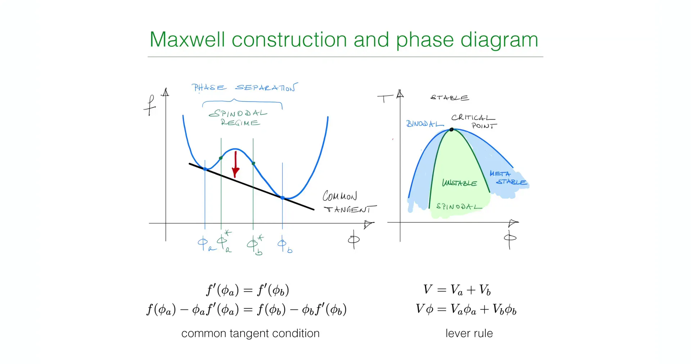
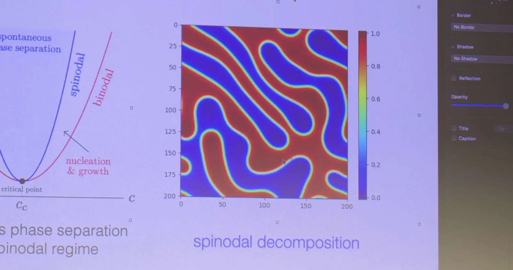
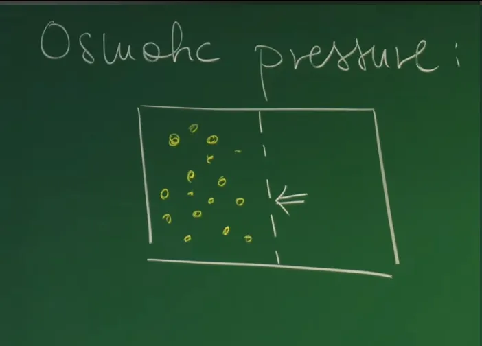

# Introduction - From Static Potential Energy Surfaces to Conserved Dynamical Flow Fields

In previous lectures, the theoretical framework for nonlinear dynamical systems has been progressively constructed. From the Ginzburg-Landau theory and **Model A (Allen-Cahn Equation)** introduced in **Lecture 9** and **Lecture 10**, we can clearly see how non-conserved order parameters (such as magnetization) achieve energy relaxation through curvature-driven flow. In that model, droplets can directly appear or annihilate through local order flipping, without being constrained by total mass. However, for liquid mixtures widely present in soft condensed matter physics and biophysics, physical processes are subject to more stringent **local mass conservation** constraints.

**Lecture 11** discussed the thermodynamics of liquid mixtures, constructing the free energy landscape of multi-component liquid mixtures based on the core assumption of **Incompressibility**, and determining the equilibrium end state of phase separation through **Maxwell Construction**. However, thermodynamics can only indicate the system's lowest energy state (such as P granule formation) or evolutionary trends, but cannot describe how the system evolves from an unstable uniform state to a stratified equilibrium state, nor can it characterize the specific path, rate, or resulting **spatiotemporal patterns** of evolution. To understand the rapidly changing dynamic structures inside cells, we must shift our gaze from the static Helmholtz free energy function $f(\phi)$ to non-equilibrium dynamical equations describing material transport.


This lecture will bridge the gap between static potential energy surfaces and dynamic evolution, deriving from macroscopic thermodynamic potentials the dynamical equation describing the evolution of **conserved order parameters**—the **Cahn-Hilliard Equation (Model B)**. Professor Erwin Frey first reviews the geometric interpretation of free energy landscapes and phase stability, then delves into two key physical quantities connecting macroscopic phenomena with microscopic driving forces: **Osmotic Pressure** and **Exchange Chemical Potential**. Particularly under the dual constraints of "constant volume" and "incompressibility" in cells, the establishment of exchange chemical potential gradients reveals the fundamental dynamical mechanism of material transport.


Based on **mass conservation law** (continuity equation) and **Onsager Reciprocal Relations**, the course will derive the flux formula $\vec{j}(\vec{x}, t)$ describing phase separation dynamics. This derivation will reveal the counter-intuitive "**Negative Diffusion**" phenomenon appearing in thermodynamically unstable regions (Spinodal region)—that is, **matter spontaneously aggregates against concentration gradients**. This is not only a generalization of Fick's diffusion law in non-ideal mixtures but also the mathematical essence of spontaneous phase separation (Spinodal Decomposition) and pattern formation.

The macroscopic field theory equations established in this lecture will lay the framework foundation for subsequent courses. In **the next lecture**, the course will further delve into the microscopic level, deriving from statistical mechanics the free energy function forms and mixing entropy expressions (Flory-Huggins theory) phenomenologically introduced in this lecture, thereby completing the full theoretical loop from microscopic interactions to macroscopic phase separation dynamics.


# 1. Thermodynamic Stability Review and Phase Diagram Construction

Before establishing dynamical equations describing the temporal evolution of liquid mixtures, it is first necessary to clarify the stability characteristics determined by the thermodynamic potential energy surface. For binary liquid mixtures described by the order parameter (solute volume fraction) $\phi$, their thermodynamic properties are completely contained in the Helmholtz free energy density $f(\phi)$. The essence of dynamics is how the system responds to local thermodynamic driving forces in the process of minimizing free energy. This section first reviews the geometric features of the free energy Landscape from **the previous lecture**, and determines the equilibrium end state of phase separation through Maxwell Construction, laying the static foundation for subsequently deriving the Cahn-Hilliard equation.

## 1.1 Geometric Features of Free Energy Landscape and Stability Criteria

The curve of free energy density $f(\phi)$ varying with concentration $\phi$ not only determines the system's equilibrium state, but its geometric curvature (i.e., the sign of second derivative $f''(\phi)$) is the core criterion for judging mixture local stability.




Thermodynamic foundation of free energy landscape and phase separation. The left figure shows the double-well free energy density curve $f(\phi)$. The red arrow indicates that in the unstable region (Spinodal regime, $f''<0$), the system is unstable to small perturbations and will spontaneously phase separate. The equilibrium coexistence concentrations $\phi_a$ and $\phi_b$ are determined by the Maxwell Common Tangent Construction, which corresponds to the physical conditions of equal chemical potential and equal osmotic pressure of the two phases. The right figure is the corresponding temperature-concentration phase diagram, showing stable, metastable, and unstable regions divided by the Binodal (blue region boundary) and Spinodal (green region boundary) lines.


### 1.1.1 Stable Regime

When the free energy curve is in a **convex** interval, i.e., satisfying the second derivative condition:

$$
f''(\phi) = \frac{\partial^2 f}{\partial \phi^2} > 0
$$

The system is in a thermodynamically stable state. Physically, this means any small local concentration fluctuation $\delta \phi$ will cause an increase in total system free energy ($\Delta F > 0$). According to the second law of thermodynamics, the system tends to minimize free energy, so these fluctuations are spontaneously suppressed, and the mixture maintains a macroscopically uniform state. In the phase diagram, this region lies outside the Binodal line.

### 1.1.2 Unstable / Spinodal Regime

When the free energy curve is in a **concave** interval, i.e., satisfying:

$$
f''(\phi) < 0
$$

The system is in a thermodynamically unstable state, and this region is called the **Spinodal Region**. In this region, the second derivative of the free energy function with respect to concentration is negative, meaning small concentration inhomogeneities will cause total system free energy to decrease. Therefore, the system is unstable to any long-wave perturbation and will undergo spontaneous, barrierless phase separation, i.e., **Spinodal Decomposition**. This process manifests as exponential growth of concentration fluctuation amplitude with time, and is the focus of the dynamics section of this lecture.

### 1.1.3 Metastable Regime
Between the stable and unstable regions, there exists a region where $f''(\phi) > 0$ but the total free energy is not globally minimum. This region lies between the Binodal and Spinodal lines. In this state, although the system is linearly stable to small perturbations, there exists a lower-energy phase-separated state. The system must undergo large-amplitude fluctuations that cross the free energy barrier—i.e., the **Nucleation and Growth** process—to enter the phase-separated state. As Professor Frey points out, this requires "finite-sized perturbations" to trigger.

## 1.2 Maxwell Construction and Geometric Meaning of the Lever Rule

When the system is in an unstable or metastable state, the thermodynamic equilibrium state is not a uniform mixture but splits into two coexisting phases: a solute-enriched phase (concentration $\phi_a$) and a solute-depleted phase (concentration $\phi_b$). These two equilibrium concentrations are uniquely determined by the **Maxwell Common Tangent Construction**.

### 1.2.1 Geometric Definition of Common Tangent and Physical Correspondence
Geometrically, finding equilibrium concentrations is equivalent to finding two points $\phi_a$ and $\phi_b$ on the $f(\phi)$ curve such that the line connecting these two points is simultaneously tangent to the curve at both points. This means these two points not only share the same tangent line, but the slope and intercept of the tangent must be equal respectively.

**1. Equal Slope Condition:**

$$
f'(\phi_a) = f'(\phi_b)
$$

This mathematical condition corresponds to profound physical meaning: the **Exchange Chemical Potential** of the two phases is equal. Exchange chemical potential is defined as $\bar{\mu} = \partial f / \partial \phi$, representing the energy cost of exchanging particles. Equal potentials mean there is no net particle diffusion flow between the two phases, achieving **Chemical Equilibrium**.


**2. Equal Intercept Condition:**

The intercept of the tangent on the vertical axis is given by Legendre transformation: $f(\phi) - \phi f'(\phi)$. Equal intercepts at both points means:

$$
f(\phi_a) - \phi_a f'(\phi_a) = f(\phi_b) - \phi_b f'(\phi_b)
$$

This condition physically corresponds to equal **Osmotic Pressure ($\Pi$)** of the two phases (to be derived in detail in Section 2: $\Pi \approx \phi f' - f$). Osmotic pressure represents the mechanical equilibrium condition for maintaining the phase interface, i.e., **Mechanical Equilibrium**.

### 1.2.2 Lever Rule

Once coexistence concentrations $\phi_a$ and $\phi_b$ are determined, the volumes $V_a$ and $V_b$ occupied by the two phases in the macroscopic system are strictly constrained by mass conservation and volume conservation. For a system with total volume $V$ and average concentration $\phi$:

$$
\begin{cases}
V = V_a + V_b \\
V \phi = V_a \phi_a + V_b \phi_b
\end{cases}
$$

Solving this system yields the **Lever Rule**:

$$
\frac{V_a}{V_b} = \frac{\phi_b - \phi}{\phi - \phi_a}
$$

This rule graphically shows that the system's state point $\phi$ is like a fulcrum falling on a lever connecting $\phi_a$ and $\phi_b$, with the volume ratio of the two phases inversely proportional to the distance from the fulcrum to the endpoints.

## 1.3 Phenomenological Display of Dynamical Phenomena

To establish intuitive understanding of phase separation dynamics, the class also showed previously demonstrated numerical simulation evolution processes—the spatiotemporal picture of system evolution from unstable state to equilibrium state.



Dynamical evolution of Spinodal Decomposition. Left figure is phase diagram schematic, right figure is numerical simulation animation. In the unstable region (Spinodal region), the uniform system spontaneously destabilizes, forming characteristic labyrinthine or bi-continuous patterns. Over time, these patterns undergo Coarsening, eventually evolving into macroscopically separated phases.

* **Initial Quench:** The process begins from a macroscopically uniform but microscopically randomly thermally fluctuating state. This corresponds to suddenly cooling (Quench) a uniformly mixed solution at high temperature into the Spinodal region of the phase diagram. At this point, the system is in a thermodynamically unstable state.

* **Early Stage:** Due to $f''(\phi) < 0$, small concentration fluctuations are rapidly amplified. The image shows characteristic labyrinthine structures. The characteristic wavelength of these patterns is determined by the fastest growing mode, a direct result of linear instability analysis.

* **Coarsening Stage:** Over time, the phase-separated enriched and depleted regions gradually merge. Small droplets disappear, large droplets grow, and interface curvature gradually decreases. This process is driven by interfacial tension, aiming to minimize the system's total interface area, thereby reducing interfacial free energy.

* **Final State:** Evolution continues until the system completely separates into two macroscopic regions, with concentrations stable at $\phi_a$ and $\phi_b$ respectively, reaching thermodynamic equilibrium.

This spatiotemporal evolution from disorder to order, from uniform to phase-separated, is precisely the core content that this lecture attempts to capture by constructing the **Cahn-Hilliard equation** and its physical mechanisms.

# 2. Osmotic Pressure - Physical Picture and Mathematical Microscopic Derivation

In the previous section's discussion of Maxwell construction, the geometric condition of equal tangent intercepts implied key physical constraints for system phase equilibrium. To endow this geometric feature with clear physical meaning, this section introduces and derives in detail **Osmotic Pressure ($\Pi$)**.

In biophysics and soft matter systems, osmotic pressure is not only a key mechanical quantity for maintaining cell morphology and driving membrane transport, but also a cornerstone for understanding mixture thermodynamic stability and phase separation mechanisms. Therefore, we will start from the macroscopic semi-permeable membrane model and, combined with microscopic free energy density functions, establish a rigorous mathematical connection between osmotic pressure and Helmholtz free energy.

## 2.1 Physical Picture of the Semi-Permeable Membrane Model

To define osmotic pressure, first construct a classic thermodynamic thought experiment model: consider a rigid container divided by a **Semi-permeable wall**.




Microscopic physical model of osmotic pressure. The diagram shows a container divided by a semi-permeable membrane, which only allows solvent to pass while blocking solute particles. The left side is a solution with solute concentration $\phi$, the right side is pure solvent. Osmotic pressure $\Pi$ is defined as the additional mechanical pressure required to maintain constant volume, whose essence originates from the entropic force of solute particles. In incompressible fluid dynamics, the existence of osmotic pressure gradients (combined with exchange chemical potential) is the core thermodynamic driving force driving material transport and causing phase separation evolution.


**System Setup and Boundary Conditions:**

* **Semi-permeable Membrane Properties**: This membrane has selective permeability, allowing only solvent molecules (Solvent, S) to pass freely while strictly blocking solute particles (Particle/Solute, P). This means the solvent can reach chemical equilibrium between the two chambers, while solute is confined in a specific region.

* **State Description**: The left side of the membrane contains a solution with volume $V$ and solute volume fraction $\phi$; the right side is an infinite pure solvent reservoir ($\phi=0$).

**Equilibrium Mechanism**:
Due to the presence of solute on the left side, the chemical potential of the solvent is lowered (entropy increases), and pure solvent on the right side tends to spontaneously pass through the membrane into the left side to dilute the solution. To prevent this net flow and maintain left side volume $V$ unchanged, an additional mechanical pressure must be applied on the left side. This extra pressure applied to resist the natural osmotic tendency of the solvent is defined as **Osmotic Pressure $\Pi$**.

## 2.2 Rigorous Thermodynamic Derivation of Osmotic Pressure

From an energy conservation perspective, osmotic pressure corresponds to the work done by the system during reversible volume changes. Assume moving the semi-permeable membrane slightly to the right, increasing solution volume by $dV$ (while pure solvent volume decreases by $dV$, keeping total volume $V_{total}$ unchanged).

In this process, the external environment must do work against the osmotic pressure, i.e., the system does external work $dW_{ext} = \Pi dV$. According to thermodynamic relations, this work equals the decrease in total system Helmholtz free energy $F_{total}$. Therefore, osmotic pressure can be defined as the negative of the partial derivative of total free energy with respect to solution volume:

$$
\Pi = - \left( \frac{\partial F_{total}}{\partial V} \right)_{T, N_p}
$$

The total system free energy $F_{total}$ consists of two parts: the free energy of the left side solution and the free energy of the right side pure solvent:

$$
F_{total}(V, \phi) = V f(\phi) + (V_{total} - V) f(0)
$$

where $f(\phi)$ is the Helmholtz free energy density (free energy per unit volume) of the solution, and $f(0)$ is the free energy density of pure solvent.

**Key Derivation Steps:**

When differentiating with respect to volume $V$, note that the solution's volume fraction $\phi$ itself is also a function of $V$. Because the total number of solute particles $N_p$ is confined within left side volume $V$ by the semi-permeable membrane, according to the definition of $\phi$: $\phi = N_p v_p / V$ (assuming solute molecular volume is $v_p$), using the chain rule:


$$
\frac{\partial \phi}{\partial V} = N_p v_p \cdot \frac{\partial}{\partial V} \left( \frac{1}{V} \right) = N_p v_p \cdot \left( -\frac{1}{V^2} \right) = -\frac{\phi}{V}
$$

Substituting this relation into the osmotic pressure definition for calculation:

$$
\begin{aligned}
\Pi &= - \frac{\partial}{\partial V} \left[ V f(\phi) + (V_{total} - V) f(0) \right] \\
&= - \left[ f(\phi) + V \frac{\partial f(\phi)}{\partial \phi} \frac{\partial \phi}{\partial V} - f(0) \right] \\
&= - \left[ f(\phi) + V f'(\phi) \left( -\frac{\phi}{V} \right) - f(0) \right] \\
&= \phi f'(\phi) - f(\phi) + f(0)
\end{aligned}
$$

Rearranging, we obtain the universal relation between osmotic pressure and free energy density:

$$
\Pi(\phi) = \phi f'(\phi) - [f(\phi) - f(0)]
$$

**Physical Meaning:**

This formula is concise and elegant in mathematical form, and directly corresponds to the **intercept condition** in the Maxwell construction from the previous section.

* $f(\phi) - \phi f'(\phi)$ is precisely the negative of the intercept on the vertical axis ($f$ axis) of the tangent line passing through point $(\phi, f(\phi))$ (relative to $f(0)$).

* If requiring equal osmotic pressure ($\Pi(\phi_a) = \Pi(\phi_b)$) when two phases $\phi_a$ and $\phi_b$ coexist, then the tangent intercepts at both points must be equal.

* This proves that the geometric tangent intercepts of Maxwell construction indeed represent the physical **mechanical equilibrium condition**: in the final state of phase separation, both sides of the coexisting phase interface must reach mechanical equilibrium, i.e., equal osmotic pressure, otherwise the interface will move.

## 2.3 Van't Hoff Law and Virial Expansion - From Ideal Gas to Interactions

To connect abstract thermodynamic formulas to concrete experimental measurements and reveal microscopic interactions, the professor further explores osmotic pressure behavior in the dilute solution limit and introduces the **Virial Expansion**.

### 2.3.1 Van't Hoff Law

For extremely dilute solutions ($\phi \ll 1$), solute particles are far apart, interactions can be neglected, and they behave like ideal gas molecules. At this point, free energy density is mainly contributed by mixing entropy. Experimentally measured osmotic pressure follows the famous Van't Hoff law:

$$
\Pi \approx \frac{k_B T}{v_p} \phi
$$

This is formally completely consistent with the ideal gas equation of state $PV = N k_B T$ (i.e., $P = \frac{N}{V} k_B T = \frac{\phi}{v_p} k_B T$).

**Physical Essence**: This is a purely **Entropic force**. The "pressure" generated by solute particles hitting the semi-permeable membrane originates from their tendency to explore phase space volume through Brownian motion in solution (translational entropy). This limiting law provides a benchmark for calibrating low-concentration behavior of free energy density.

### 2.3.2 Virial Expansion and Interaction Coefficients

As concentration $\phi$ increases, interactions between solute particles can no longer be neglected. To describe this deviation, osmotic pressure is usually expanded as a power series in concentration, the virial expansion:

$$
\Pi = \frac{k_B T}{v_p} \phi + A_2 \phi^2 + A_3 \phi^3 + \dots
$$

The expansion coefficients $A_2, A_3$ here have profound microscopic physical meanings, especially the second virial coefficient $A_2$:

* **$A_2 > 0$ (Repulsive interaction)**: Particles tend to stay apart (like hard sphere repulsion). This increases the effective frequency of particles hitting the membrane, causing osmotic pressure to rise, promoting mixing and stability of the solution.

* **$A_2 < 0$ (Attractive interaction)**: Particles tend to aggregate together. This attraction reduces the effective pressure of particles hitting the membrane (osmotic pressure decreases). It is precisely this **negative second virial coefficient** (attractive interaction) that causes the free energy curve to develop a concavity at intermediate concentrations ($f'' < 0$), thereby triggering phase separation. This provides a microscopic mechanical perspective for understanding phase separation: phase separation is essentially the result of attraction between particles overcoming mixing entropy forces.


Using the differential form of the osmotic pressure formula $\Pi(\phi) = \phi^2 \frac{\partial}{\partial \phi} \left(\frac{f(\phi)}{\phi}\right)$ (assuming $f(0)=0$), the analytical form of free energy density can be back-calculated by integrating experimentally measured osmotic pressure curves:

$$
f(\phi) \approx f(0) + \underbrace{\frac{k_B T}{v_p} \phi \ln \phi}_{\text{Mixing entropy term}} + \underbrace{A_2 \phi^2 + \frac{1}{2}A_3 \phi^3}_{\text{Interaction enthalpy terms}} + \dots
$$

The $\phi \ln \phi$ term is precisely the famous **Mixing Entropy** term, which always tends toward mixing; while $A_2 \phi^2$ and other higher-order terms represent enthalpic contributions. This structure will be rigorously derived from microscopic statistical mechanics through the Lattice Gas Model and Flory-Huggins theory in the next lecture (Lecture 13).

# 3. Exchange Chemical Potential - Driving Force in Incompressible Systems

After establishing osmotic pressure as the physical correspondence to the equal intercept condition in Maxwell construction, the focus of analysis shifts to the geometric condition of equal tangent slopes. In classical thermodynamics, slopes correspond to chemical potential equilibrium. However, for biological cells and soft matter systems, the physical environment is often subject to dual constraints of **Incompressibility** and **fixed volume**. This makes the classical chemical potential definition based on "adding particles causes volume expansion" no longer applicable.

The professor introduces the concept of **Exchange Chemical Potential**, which not only solves the theoretical definition problem but also reveals the fundamental dynamical mechanism of material transport inside cells—material movement is essentially a displacement process.

## 3.1 Limitations of Classical Definition and Incompressibility Constraint

In the classical thermodynamic framework, the chemical potential $\mu_i$ of component $i$ is usually defined as the partial derivative of Gibbs free energy $G$ with respect to particle number $N_i$:

$$
\mu_i = \left( \frac{\partial G}{\partial N_i} \right)_{T, P, N_{j \neq i}}
$$

This definition implies a physical operation: adding one $i$ particle to the system while keeping other component particle numbers $N_j$ unchanged. Under constant pressure conditions, for condensed matter, adding particles necessarily causes expansion of the system's total volume $V$.

However, the interior of biological cells is a highly Crowded environment constrained by cell membrane geometry. In this environment, the system must obey strict volume conservation constraints. If assuming the fluid is incompressible, i.e., molecular volume $v_i$ is constant, then a rigid constraint exists between total volume $V$ and particle numbers: $V = \sum N_i v_i$.

Under this **constant volume $V$** constraint, simply "squeezing in" a particle without removing other particles is an invalid physical operation because it violates the incompressibility condition. Therefore, a new thermodynamic quantity must be sought to describe energy changes in this constrained environment.

## 3.2 Definition and Derivation of Exchange Chemical Potential

Under the fixed volume $V$ constraint, the only natural way to change system composition is **Exchange**: to place one solute particle (Solute P) within volume $V$, one or more solvent molecules (Solvent S) must be simultaneously removed to make room. Assuming solute and solvent have similar molecular volumes ($v_p \approx v_s$), this process is an equal-volume particle displacement.

Based on this, this lecture introduces **Exchange Chemical Potential $\bar{\mu}_p$**, defined as the change in Gibbs free energy with solute particle number while maintaining volume $V$ (as well as temperature $T$, pressure $P$) unchanged:

$$
\bar{\mu}_p = \left( \frac{\partial G}{\partial N_p} \right)_{T, V, P}
$$

This is actually a partial derivative after Legendre transformation, reflecting the energy cost under volume constraints. To establish its relationship with free energy density $f(\phi)$, use the thermodynamic relation established in **Lecture 11**: $G = V [P + f(\phi)]$ (where $P$ is external pressure, $f(\phi)$ is Helmholtz free energy density).

**Derivation Process:**

Applying the chain rule, take the partial derivative of $G$ with respect to $N_p$, noting that $V$ is treated as constant:

$$
\bar{\mu}_p = \frac{\partial}{\partial N_p} \left( V [P + f(\phi)] \right)_{V} = V \frac{\partial f(\phi)}{\partial \phi} \frac{\partial \phi}{\partial N_p}
$$

According to the volume fraction definition $\phi = \frac{N_p v_p}{V}$, its derivative with respect to particle number is:

$$
\frac{\partial \phi}{\partial N_p} = \frac{v_p}{V}
$$

Substituting this result into the above equation, volume $V$ cancels, yielding the concise analytical expression:

$$
\bar{\mu}_p = v_p f'(\phi)
$$

Similarly, for the solvent (Solvent S), since adding solvent means decreasing solute concentration ($\partial \phi / \partial N_s < 0$), the solvent's exchange chemical potential can be derived:

$$
\bar{\mu}_s = - v_s f'(\phi)
$$

This set of formulas reveals the physical connection: **The slope of Helmholtz free energy density $f'(\phi)$ is physically the normalized exchange chemical potential.**

## 3.3 Unified Physical Picture and Biological Significance

By introducing exchange chemical potential, the **equal slope condition** $f'(\phi_a) = f'(\phi_b)$ in Maxwell construction obtains clear physical interpretation:

$$
\frac{\bar{\mu}_p(\phi_a)}{v_p} = \frac{\bar{\mu}_p(\phi_b)}{v_p}
$$

This indicates that in the phase separation equilibrium state, the exchange chemical potentials between the two phases must be equal. Physically, this means exchanging one particle from the enriched phase (Phase A) to the depleted phase (Phase B) requires no net energy consumption, and the system has reached **Chemical Equilibrium**.

Combined with the previous section's discussion of osmotic pressure (mechanical equilibrium), Maxwell construction unifies the two thermodynamic pillars of phase separation:

1.**Equal Intercepts** $\leftrightarrow$ **Equal Osmotic Pressure** $\leftrightarrow$ **Mechanical Equilibrium** (interface does not move).

2.**Equal Slopes** $\leftrightarrow$ **Equal Exchange Chemical Potential** $\leftrightarrow$ **Chemical Equilibrium** (no net particle flow).

**Biological Significance:**
In the cell biology context, this concept is crucial. It shows that the aggregation and dispersion of proteins or other biomacromolecules in cytoplasm should not be viewed as free particle movement in vacuum, but must be understood as **competitive displacement** of solute and solvent molecules. The "force" driving material transport is not the absolute chemical potential gradient, but the exchange chemical potential gradient relative to solvent $\nabla \bar{\mu}$. This conclusion provides direct physical basis for deriving the flux term in the Cahn-Hilliard dynamical equation in the next section.

# 4. Non-equilibrium Dynamics - From Onsager Reciprocal Relations to Negative Diffusion

At this point, the static thermodynamic description of liquid mixtures—including free energy landscape, osmotic pressure, and exchange chemical potential—has been completely constructed.

However, thermodynamics can only determine the system's equilibrium state or evolutionary trends, and cannot describe the rate and path of evolution. To capture the spatiotemporal characteristics of phase separation, the time variable $t$ must be introduced into the theoretical framework, constructing **partial differential equations describing the temporal evolution of concentration field $\phi(\mathbf{x}, t)$**. This section will start from conservation laws, combine with linear response theory of non-equilibrium thermodynamics, and derive the core equations governing mixture dynamics, thereby achieving the key leap from static potential energy surfaces to dynamic flow fields.

## 4.1 Continuity Equation (Conservation Law)

In liquid mixture systems, solute particles are strictly constrained by **local mass conservation**. Without chemical reactions generating or consuming particles, solute can neither appear nor disappear out of thin air, but can only redistribute in space through flow. Therefore, the temporal evolution of concentration field $\phi(\mathbf{x}, t)$ must obey the Continuity Equation:

$$
\frac{\partial \phi(\mathbf{x}, t)}{\partial t} = - \nabla \cdot \mathbf{J}(\mathbf{x}, t)
$$

where $\mathbf{J}(\mathbf{x}, t)$ represents **Particle Flux Current**, whose physical meaning is the particle volume (or number) passing through unit cross-sectional area per unit time. This equation states that the rate of local concentration change ($\partial_t \phi$) at a point in space is completely determined by the divergence of net outward flux ($\nabla \cdot \mathbf{J}$) at that point. This is the mathematical starting point for constructing any conserved dynamics (Model B).

## 4.2 Onsager Theory and Thermodynamic Driving Forces

After establishing the conservation law, the core question transforms to: how to determine the specific form of flux $\mathbf{J}$?

According to Non-equilibrium Thermodynamics, material flow is driven by **Thermodynamic Forces**. When the system deviates from equilibrium, chemical potential gradients existing in space constitute driving forces, driving material flow to eliminate these gradients, thereby returning the system to equilibrium where chemical potential is equal everywhere.


In the near-equilibrium region, applying **Onsager Linear Response Theory**, a linear relationship exists between flux and thermodynamic force:

$$
\mathbf{J} = - \Lambda \nabla \bar{\mu}
$$

The physical meaning of each term in this formula is:

* **$\nabla \bar{\mu}$**: Driving force, i.e., **gradient of exchange chemical potential**. Note that the exchange chemical potential $\bar{\mu}$ derived in Section 3 is used here, because it correctly describes the particle displacement process in incompressible fluids.

* **$\Lambda$**: **Onsager Coefficient**, also called Mobility. It characterizes the system's response capability to thermodynamic driving forces, usually depending on temperature $T$ and local concentration $\phi$.

* **Negative sign**: Indicates material flows toward the direction of decreasing chemical potential (from high to low potential energy regions), which ensures non-negativity of entropy production.

According to the second law of thermodynamics, to ensure energy dissipation (entropy increase) during the process, the Onsager coefficient must be positive ($\Lambda > 0$).

## 4.3 Derivation of Dynamical Equations and Effective Diffusion Coefficient

To obtain closed concentration evolution equations, the flux $\mathbf{J}$ needs to be expressed as a function of concentration $\phi$. Using the relation between exchange chemical potential and free energy density derived in Section 3: $\bar{\mu}_p \approx v_p f'(\phi)$ (ignoring constant terms), apply the chain rule to calculate its gradient:


$$
\nabla \bar{\mu}_p = \nabla \left( v_p \frac{\partial f}{\partial \phi} \right) = v_p \frac{\partial^2 f}{\partial \phi^2} \nabla \phi = v_p f''(\phi) \nabla \phi
$$

Substituting this gradient expression into the Onsager transport equation:

$$
\mathbf{J} = - \Lambda(\phi) v_p f''(\phi) \nabla \phi
$$

Finally, substituting the particle flux into the continuity equation yields the nonlinear partial differential equation describing concentration field evolution:

$$
\frac{\partial \phi}{\partial t} = \nabla \cdot \left[ \Lambda(\phi) v_p f''(\phi) \nabla \phi \right]
$$

To deeply analyze the physical properties of this equation, compare it with the classical **Fick's Second Law** $\frac{\partial \phi}{\partial t} = \nabla \cdot (D \nabla \phi)$. This defines the system's **Effective Diffusion Coefficient**:

$$
D_{\text{eff}}(\phi) = \Lambda(\phi) v_p f''(\phi)
$$

This result profoundly reveals the microscopic thermodynamic origin of diffusion: the macroscopic diffusion coefficient is not simply a constant, but is jointly determined by **kinetic mobility** $\Lambda(\phi)$ and **thermodynamic driving force factor** $f''(\phi)$ (free energy curvature).

## 4.4 Stability Analysis - Positive Diffusion and Negative Diffusion

The sign of effective diffusion coefficient $D_{\text{eff}}$ directly determines the system's dynamical evolution behavior, which is key to understanding phase separation mechanisms.

### 1. Stable Regime ($f'' > 0$)

When the system is in the stable region of the phase diagram, the free energy curve is convex ($f'' > 0$). Since mobility $\Lambda > 0$ and molecular volume $v_p > 0$, the effective diffusion coefficient is always positive:

$$
D_{\text{eff}} > 0
$$

This corresponds to classical **Positive Diffusion (Fickian Diffusion)**. Material flows from high to low concentration along concentration gradients, any local concentration fluctuations are dissipated and smoothed, and the system tends toward uniformity.

**Concentration Dependence of Onsager Coefficient**

The professor specifically points out that in the dilute solution limit ($\phi \ll 1$), free energy is mainly dominated by mixing entropy, i.e., $f(\phi) \sim \phi \ln \phi$, leading to second derivative $f''(\phi) \sim 1/\phi$. For the macroscopic diffusion coefficient $D_{\text{eff}}$ to return to constant $D$ (Brownian motion behavior), the Onsager coefficient must have the following form:

$$
D_{\text{eff}} \approx \Lambda(\phi) v_p \frac{k_B T}{v_p \phi} = \text{const} \implies \Lambda(\phi) \propto \phi
$$

This means mobility is not spatially uniform, but proportional to local particle concentration. **This derivation verifies the self-consistency of Onsager theory in the dilute solution limit.**

### 2. Spinodal Regime ($f'' < 0$)

This is the most striking case in phase transition dynamics. When the system is quenched into the Spinodal region, the free energy curve exhibits concavity ($f'' < 0$), causing the effective diffusion coefficient to become negative:

$$
D_{\text{eff}} < 0
$$

**Negative Diffusion** means the direction of material flow undergoes fundamental reversal: **material flows against concentration gradients**, i.e., spontaneously flowing from low to high concentration regions.

**Physical Consequence: Uphill Diffusion**

Originally small concentration peaks not only do not disperse, but become higher by continuously drawing material from surroundings; surrounding low concentration regions become lower due to material loss. This positive feedback mechanism leads to spontaneous destabilization of the system to long-wave fluctuations, with concentration fluctuations rapidly amplified, forming the labyrinthine patterns observed in previous video demonstrations. This is precisely the microscopic dynamical origin of **Spinodal Decomposition**—instability driven by negative diffusion coefficient.

# 5. Cahn-Hilliard Equation (Model B) - From Local to Non-local

In the previous section's derivation, although the dynamical equation based on local free energy density $\partial_t \phi = \nabla \cdot (\Lambda f'' \nabla \phi)$ successfully predicted the "**Negative Diffusion**" phenomenon in the Spinodal region mathematically, it faces serious regularity problems physically. Pure negative diffusion mechanisms cause growth rates of short-wavelength (high-frequency) modes to be infinite, causing concentration gradients to tend toward infinity, forming non-physical mathematical singularities, meaning interface width will narrow infinitely until collapse.

To describe physically realistic phase separation processes, especially to form stable interfaces with finite width, a mechanism must be introduced to penalize excessive concentration gradients. Therefore, the professor further introduces the **Cahn-Hilliard Equation** (called **Model B** in dynamical system classification). This equation introduces the physical effect of interfacial tension by introducing non-local gradient terms in free energy, thereby suppressing short-wave divergence while maintaining long-wave instability, describing the complete dynamics from spinodal decomposition to late-stage coarsening for conserved order parameters.

## 5.1 Gradient Energy Term and Generalized Chemical Potential

Cahn and Hilliard pointed out that the total free energy of non-uniform systems depends not only on local concentration $\phi(\mathbf{x})$, but also on the rate of concentration variation in space (gradient). Therefore, the system's free energy functional should be modified to **Ginzburg-Landau form**:

$$
F[\phi] = \int dV \left[ f(\phi) + \frac{\kappa}{2} (\nabla \phi)^2 \right]
$$

The physical meaning of each term in the formula:
* **$f(\phi)$**: Local free energy density (double-well). It drives local concentration to separate toward equilibrium values $\phi_a, \phi_b$.

* **$\frac{\kappa}{2} (\nabla \phi)^2$**: **Gradient Energy Term**. Coefficient $\kappa > 0$ is directly related to interfacial tension. The existence of this term means that producing any gradient requires paying an energy cost, thus tending to make the concentration field smooth.

To derive the dynamical equation, first calculate the system's **Generalized Chemical Potential**. It is the Functional Derivative of total free energy functional with respect to concentration field. Using variational calculus (and applying integration by parts to handle gradient terms):

$$
\mu = \frac{\delta F}{\delta \phi} = \frac{\partial f}{\partial \phi} - \nabla \cdot \left( \frac{\partial (\frac{\kappa}{2}(\nabla \phi)^2)}{\partial (\nabla \phi)} \right)
$$

Calculation yields:

$$
\mu = f'(\phi) - \kappa \nabla^2 \phi
$$

**Physical Meaning:**

The chemical potential $\mu$ obtained here contains two terms. The first term $f'(\phi)$ is the **local exchange chemical potential** we are familiar with; while the second term $-\kappa \nabla^2 \phi$ is a **Non-local term**. It indicates that the chemical potential at a point depends not only on the concentration at that point, but is also influenced by the concentration distribution (curvature $\nabla^2 \phi$) in neighboring regions. It is precisely this term that introduces spatial coupling, making interfaces no longer mathematical singularities but transition layers with physical width.

## 5.2 Complete Cahn-Hilliard Equation

Substituting the derived generalized chemical potential into the continuity equation $\partial_t \phi = - \nabla \cdot \mathbf{J}$ for conserved dynamics, and combining with the Onsager relation $\mathbf{J} = -\Lambda \nabla \mu$, yields the famous **Cahn-Hilliard Equation**:

$$
\frac{\partial \phi}{\partial t} = \nabla \cdot \left[ \Lambda \nabla \left( f'(\phi) - \kappa \nabla^2 \phi \right) \right]
$$

To see the dynamical structure more clearly, assume the Onsager coefficient (mobility) $\Lambda$ is constant (usually denoted $M$), and expand the equation:

$$
\frac{\partial \phi}{\partial t} = M \nabla^2 f'(\phi) - M \kappa \nabla^4 \phi
$$

This is a **fourth-order nonlinear partial differential equation** (containing the biharmonic operator $\nabla^4$).

## 5.3 Physical Competition of Equation Terms and Dynamical Characteristics

The right side of the Cahn-Hilliard equation contains two terms that play completely opposite yet complementary roles in the phase separation process, jointly determining the characteristic scale of patterns.

**1. Destabilizing Term ($M \nabla^2 f'(\phi)$): Driving Phase Separation**

* In the Spinodal region ($f'' < 0$), this term is equivalent to $M f'' \nabla^2 \phi$ (negative diffusion).

* It causes exponential growth of long-wave mode (large-scale fluctuation) amplitudes, driving the system from uniform state to undergo **Uphill Diffusion**, forming enriched and depleted phases. This is the dynamical engine of phase separation.

**2. Stabilizing Term ($- M \kappa \nabla^4 \phi$): Setting Characteristic Scale**

* This is a fourth-order derivative term originating from gradient energy. In Fourier space, $\nabla^4$ corresponds to $k^4$.

* Due to the negative sign in front, this term always acts as **Damping**, with extremely strong suppression of short-wave (high $k$) modes ($\propto -k^4$).

* **Physical Consequence**: It effectively cuts off growth of high-frequency modes, preventing interfaces from narrowing infinitely. The competition between destabilizing and stabilizing terms selects a **Fastest Growing Wavelength ($\lambda_m$)**, which determines the characteristic size of labyrinthine patterns in early phase separation.

**Dynamical Scaling Law:**

Compared with Model A (non-conserved Allen-Cahn equation) introduced in **Lecture 9**, the Cahn-Hilliard equation (Model B) strictly obeys local mass conservation. This means phase region growth cannot be completed through local spin flipping, but must be achieved through long-range diffusion of material. This leads to fundamentally different scaling laws in late-stage coarsening:

* **Model A**: $L(t) \sim t^{1/2}$ (curvature-driven, no conservation constraint).

* **Model B**: $L(t) \sim t^{1/3}$ (diffusion-limited aggregation, i.e., **Ostwald Ripening** mechanism).

The establishment of the Cahn-Hilliard equation marks the successful unification of microscopic molecular interactions (through $f(\phi)$) and mesoscopic interface properties (through $\kappa$) into a macroscopic dynamical field theory framework, becoming the standard language for simulating phase separation in soft matter physics and materials science.


# 6. Code Practice - Unification from Dead Matter to Living Matter

The Cahn-Hilliard equation (Model B) is established as the standard model for describing phase separation dynamics of **dead matter** (such as alloys, polymer blends). The physical picture of this model is based on equilibrium thermodynamics: system evolution is entirely driven by free energy minimization, interfacial tension explicitly originates from the gradient energy term $\frac{\kappa}{2}(\nabla\phi)^2$, and coarsening follows the Lifshitz-Slyozov-Wagner (LSW) scaling law $L(t) \sim t^{1/3}$.

However, phase separation in biological systems—such as PAR protein distribution during cell polarization, or formation of membrane-less organelles inside cells—occurs in **far-from-equilibrium** active environments. These systems continuously consume energy (such as ATP hydrolysis) and do not follow the principle of least action. This raises a core physical question: **Why do these highly non-equilibrium active systems exhibit macroscopic pattern evolution strikingly similar to equilibrium Cahn-Hilliard systems?**

Just recently, Professor Erwin Frey published a paper in Nature Physics, "Protein pattern morphology and dynamics emerging from effective interfacial tension," providing the answer to this question.


## 6.1 Mass-Conserving Reaction-Diffusion Systems (McRD) and Effective Tension


The professor's research focuses on a class of **Mass-Conserving Reaction-Diffusion (McRD)** systems. These models do not presuppose a free energy functional, but are based on microscopic biochemical reaction kinetics equations:

$$
\begin{aligned}
\partial_t m &= D_m \nabla^2 m + f(m, c) \\
\partial_t c &= D_c \nabla^2 c - f(m, c)
\end{aligned}
$$

where $m$ and $c$ represent membrane-bound (slow diffusion) and cytosolic (fast diffusion) protein densities respectively.

**Core Finding: Emergence of Effective Interfacial Tension**

![Comparison of equilibrium and non-equilibrium interfacial tension mechanisms. (d) Classical phase separation (Cahn-Hilliard mechanism): In liquid mixtures, interface curvature (κ) causes local chemical potential (δμ) to increase (Gibbs-Thomson effect). This energetic disadvantage drives particle flow toward low-curvature regions, thereby straightening interfaces, manifesting as thermodynamic surface tension. (e) Active reaction-diffusion system (McRD mechanism): In mass-conserving active systems, no explicit energy functional exists. However, interface curvature changes the relative area ratio of protein "attachment zones" and "detachment zones" on the membrane. A convex interface causes the detachment zone to expand, breaking local reaction equilibrium, thereby generating net material flow. This reaction flux induced by geometric curvature emerges macroscopically as a kind of "effective interfacial tension," whose dynamical effect is highly consistent with classical surface tension. Source: Weyer, H., Roth, T.A. & Frey, E. Protein pattern morphology and dynamics emerging from effective interfacial tension. Nat. Phys. (2025).](../cn/assets/images/12_005_8ffdde23-b983-4b3e-a765-b731b2ce59e7.png)

The paper proves through multiscale analysis that although the microscopic equations of McRD systems do not contain explicit gradient energy terms, at macroscopic scales, nonlinear reaction kinetics (particularly **Mutual Detachment/Antagonism** between proteins) induce an **Effective Interfacial Tension ($\tilde{\sigma}$)**.

The existence of this effective tension leads to the following physical consequences:

1.**Universality of Geometric Laws**: Interface motion in active systems also follows curvature-driven flow rules ($v_n \propto -H$), consistent with passive fluids described by Cahn-Hilliard.

2.**Turing Foams**: In specific parameter spaces, systems form polyhedral foam-like network structures. The stability of these structures is maintained by dynamic balance between reaction flux and diffusion flux, rather than static mechanical equilibrium.

3.**Degeneracy of Macroscopic Dynamics**: Pattern formation originally belonging to the Turing Instability category, under mass conservation constraints, exhibits coarsening behavior highly similar to phase separation (Spinodal Decomposition).

## 6.2 Python Code Practice - Comparative Simulation of Passive and Active Phase Separation

We use code to simulate the classical Cahn-Hilliard equation (passive system) and McRD dynamics based on the PAR system model from Frey's paper (active system).

```python
"""
CahnHilliard vs McRD: Passive vs Active Phase Separation
"""
import numpy as np
import matplotlib.pyplot as plt
from matplotlib.animation import FuncAnimation, FFMpegWriter
from matplotlib.colors import LinearSegmentedColormap
import os

# Parameters
N, L, dx = 128, 50.0, 50.0/128
dt_ch, dt_rd = 0.2, 0.001

# Cahn-Hilliard parameters
M, kappa, phi0 = 1.0, 0.5, 0.0
kx = 2 * np.pi * np.fft.fftfreq(N, d=dx)
ky = 2 * np.pi * np.fft.fftfreq(N, d=dx)
KX, KY = np.meshgrid(kx, ky, indexing='ij')
K2, K4 = KX**2 + KY**2, (KX**2 + KY**2)**2

# McRD parameters
Dm, Dc = 0.05, 5.0
k_on, k_off, k_ant = 0.5, 0.1, 8.0
rho_A, rho_B = 1.5, 1.5

def ch_step(phi, dt):
    nonlinear_hat = np.fft.fft2(phi**3 - phi)
    phi_hat = np.fft.fft2(phi)
    return np.real(np.fft.ifft2((phi_hat - M*dt*K2*nonlinear_hat) / (1 + M*kappa*dt*K4)))

def laplacian(f):
    return (np.roll(f,1,0) + np.roll(f,-1,0) + np.roll(f,1,1) + np.roll(f,-1,1) - 4*f) / dx**2

def rd_step(mA, mB, cA, cB, dt):
    fA = k_on*cA - k_off*mA - k_ant*mA*mB**2
    fB = k_on*cB - k_off*mB - k_ant*mB*mA**2
    mA = np.maximum(mA + dt*(Dm*laplacian(mA) + fA), 0)
    mB = np.maximum(mB + dt*(Dm*laplacian(mB) + fB), 0)
    cA = np.maximum(cA + dt*(Dc*laplacian(cA) - fA), 0)
    cB = np.maximum(cB + dt*(Dc*laplacian(cB) - fB), 0)
    return mA, mB, cA, cB

def run_simulation():
    np.random.seed(42)
    noise1, noise2 = 0.05*(2*np.random.rand(N,N)-1), 0.05*(2*np.random.rand(N,N)-1)
    phi = phi0 + noise1
    mA, mB = 0.5*rho_A + noise1, 0.5*rho_B + noise2
    cA, cB = 0.5*rho_A - noise1, 0.5*rho_B - noise2
    
    frames_ch, frames_rd, times = [phi.copy()], [(mA-mB).copy()], [0.0]
    
    for i in range(100):
        for _ in range(5): phi = ch_step(phi, dt_ch)
        for _ in range(500): mA, mB, cA, cB = rd_step(mA, mB, cA, cB, dt_rd)
        frames_ch.append(phi.copy())
        frames_rd.append((mA-mB).copy())
        times.append((i+1)*5*dt_ch)
        print(f"\rProgress: {i+1}%", end="")
    print("\nDone!")
    return frames_ch, frames_rd, times

def create_animation(frames_ch, frames_rd, times):
    cmap = LinearSegmentedColormap.from_list('ph', ['#2166ac','#f7f7f7','#b2182b'], N=256)
    fig, axes = plt.subplots(1, 2, figsize=(14, 6), dpi=100)
    vmax_rd = max(abs(np.min(frames_rd)), abs(np.max(frames_rd))) * 0.8
    
    im_ch = axes[0].imshow(frames_ch[0], cmap=cmap, vmin=-1, vmax=1, extent=[0,L,0,L], origin='lower')
    axes[0].set_title('Cahn-Hilliard (Model B)\nPassive Phase Separation', fontweight='bold')
    plt.colorbar(im_ch, ax=axes[0], shrink=0.8, label='$\\phi$')
    
    im_rd = axes[1].imshow(frames_rd[0], cmap=cmap, vmin=-vmax_rd, vmax=vmax_rd, extent=[0,L,0,L], origin='lower')
    axes[1].set_title('McRD (Active Matter)\nEffective Interfacial Tension', fontweight='bold')
    plt.colorbar(im_rd, ax=axes[1], shrink=0.8, label='$m_A - m_B$')
    
    title = fig.suptitle(f't = {times[0]:.1f}', fontsize=14, fontweight='bold')
    plt.tight_layout(rect=[0, 0, 1, 0.95])
    
    def update(i):
        im_ch.set_array(frames_ch[i])
        im_rd.set_array(frames_rd[i])
        title.set_text(f't = {times[i]:.1f}')
        return [im_ch, im_rd, title]
    
    anim = FuncAnimation(fig, update, frames=len(times), interval=100, blit=True)
    output = os.path.join(os.path.dirname(os.path.abspath(__file__)), 'CahnHilliard_vs_McRD.mp4')
    anim.save(output, writer=FFMpegWriter(fps=10, bitrate=3000))
    plt.close()
    print(f"Saved: {output}")
    return output

if __name__ == '__main__':
    frames_ch, frames_rd, times = run_simulation()
    create_animation(frames_ch, frames_rd, times)
```
<video controls width="100%">
  <source src="../cn/assets/images/CahnHilliard_vs_McRD.mp4" type="video/mp4">
  Your browser does not support the video tag.
</video>


By comparing the outputs of the above numerical experiments, the striking similarity in macroscopic morphology between the two systems can be observed, as well as the differences in underlying physical mechanisms.


**1. Universality of Morphology**

Both the Cahn-Hilliard system on the left and the McRD system on the right spontaneously form characteristic **Labyrinthine** patterns. In the McRD system, red regions represent species A dominance, blue regions represent species B dominance. Despite fundamentally different microscopic equations, both exhibit clear phase interfaces, directly validating Frey's paper's core thesis: **Mutually antagonistic biochemical reactions renormalize macroscopically into an effective interfacial tension**. This effective tension acts like a rubber band contracting interfaces, driving the system to minimize phase boundary length.

**2. Essential Opposition and Unity of Physical Mechanisms**

Despite similar visual effects, the physical driving forces of the two systems have essential differences. For the passive Cahn-Hilliard system, the driving force of phase separation is **free energy minimization**, interfacial tension $\sigma \propto \sqrt{\kappa}$ is a static energy penalty term, and the system eventually tends toward thermodynamic equilibrium (quiescence). Conversely, for the active McRD system, phase separation is a non-equilibrium steady state maintained by **ATP-driven reaction cycles**. Interfacial tension $\tilde{\sigma}$ is a **dynamically emergent property**, originating from mutual repulsion of proteins on membranes and rapid diffusive replenishment from cytosol.

**3. Dynamical Scaling Laws**

As simulation time progresses, both systems exhibit **Coarsening** behavior—small droplets disappear, large patches merge, and characteristic length scale $L(t)$ grows with time. This indicates that even in far-from-equilibrium active matter, as long as conservation laws and effective surface tension exist, their large-scale dynamical behavior is still classified as **Model B universality class** ($L(t) \sim t^{1/3}$).

This conclusion greatly simplifies our understanding of complex pattern formation inside cells: living systems cleverly mimic the laws of equilibrium physics by consuming energy to construct ordered structures. This means that thermodynamic concepts (such as chemical potential, interfacial tension) may emerge in "effective" forms even in non-equilibrium active systems, enabling us to use intuition from equilibrium physics to understand complex behavior of living systems.


# Summary

This lecture no longer merely satisfies predicting phase separation occurrence through thermodynamic phase diagrams, but derives the deterministic mathematical equations describing its evolution process.

**Deep Unification of Physical Picture**: Osmotic pressure, chemical potential, and diffusion flux are no longer isolated thermodynamic concepts, but are tightly woven together through free energy density $f(\phi)$ and its derivatives. Osmotic pressure equilibrium corresponds to mechanical equilibrium, exchange chemical potential equilibrium corresponds to chemical equilibrium—both together constitute the physical cornerstone of Maxwell construction.

**Microscopic Origin of Dynamics**: Through the continuity equation and Onsager linear response theory, the essence of diffusion is revealed as material flow driven by chemical potential gradients. When the free energy curve exhibits concavity ($f'' < 0$), this driving force reverses, leading to counter-intuitive "negative diffusion"—this is precisely the microscopic engine of spontaneous phase separation (Spinodal decomposition).

**Completeness of Model B**: The Cahn-Hilliard equation as the paradigm of conserved dynamics (Model B) not only contains negative diffusion mechanisms causing instability, but also introduces interfacial tension through non-local gradient energy terms. This enables it to completely describe the entire process from initial perturbation growth, interface formation, to late-stage coarsening, becoming the universal language for simulating phase separation in soft matter physics and materials science.

In the subsequent **Lecture 13**, the perspective will turn to more microscopic scales. The free energy density $f(\phi)$ will no longer be viewed as a given phenomenological function, but through statistical mechanics derivation of Lattice Gas Model and Flory-Huggins theory, starting from molecular-level mixing entropy and interaction energy, computing from scratch the parameters $A_2, A_3$ etc. introduced as coefficients in this lecture. This will ultimately establish the complete physical picture from microscopic molecular interactions to macroscopic phase separation dynamics.
