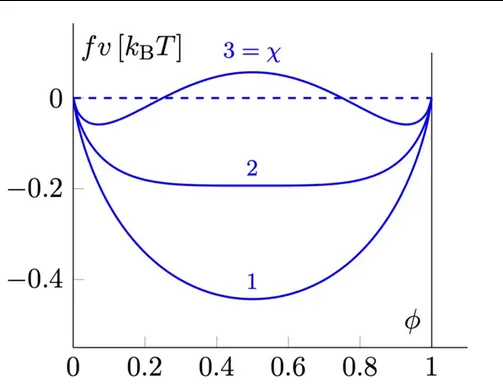
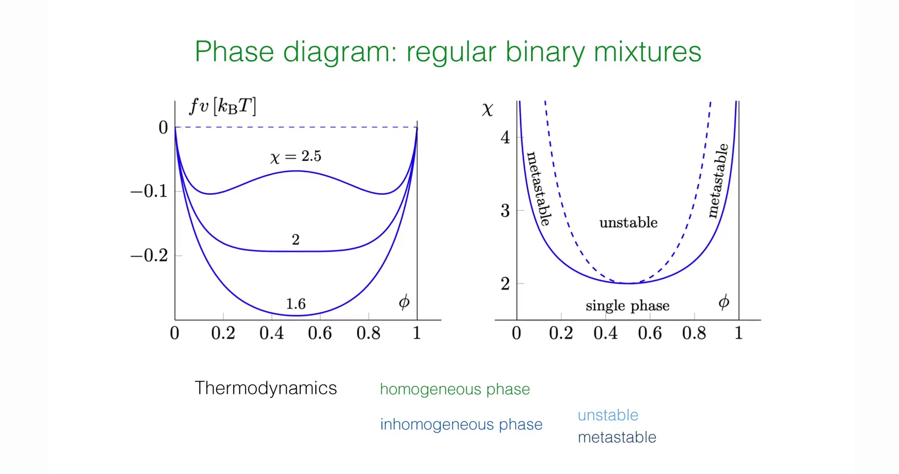

# Introduction - From Macroscopic Thermodynamics to Microscopic Statistical Physics

**Lecture 12** focused on the macroscopic thermodynamic properties of liquid mixtures, delving into concepts such as osmotic pressure and exchange chemical potential, and established the Cahn-Hilliard equation (Model B) describing conserved dynamics based on the phenomenologically introduced free energy density function $f(\phi)$. However, although **the previous lecture** revealed that the thermodynamic driving force for phase separation originates from the non-convexity of free energy ($f''(\phi) < 0$), it did not explain from **first principles** the microscopic origin of this non-convexity—namely, how molecular interactions actually lead to macroscopic "mixing" or "demixing."

From the results of **Lecture 12**, we can see that the non-convexity of free energy density $f(\phi)$ is the fundamental cause of phase separation. However, this free energy function remained an **"assumed" object** in previous discussions. This naturally raises a series of more fundamental questions:

- Does the mixing entropy term $\phi\ln\phi+(1-\phi)\ln(1-\phi)$ in the free energy necessarily exist? Can it be derived from more fundamental statistical counting?

- Where does the specific form of the interaction term $\chi\phi(1-\phi)$ come from? What exactly is the relationship between parameter $\chi$ and microscopic interaction strength?

- Why is only nearest-neighbor interaction sufficient to induce the collective phenomenon of phase separation at the macroscopic level?

The core goal of this lecture is precisely to fill this theoretical gap and thereby establish a complete logical chain from microscopic particle interactions to macroscopic free energy landscapes. The professor first introduces the most parsimonious yet physically clear **Lattice Gas Model**, a simplified model that discretizes continuous fluid space, which is highly isomorphic to the Ising model in magnetism in mathematical structure. Based on this model, the analysis will start from the most fundamental particle occupation numbers and nearest-neighbor interactions, using the core tool of statistical mechanics—the **Partition Function**—to derive the core theory describing phase transition behavior of binary mixtures: the **Flory-Huggins Free Energy Theory**.

The derivation process of this lecture demonstrates the classical physics paradigm for handling **many-body problems**: first construct the microscopic Hamiltonian, then simplify the complex coupled many-body problem into a solvable single-body problem through **Mean-Field Approximation**, thereby obtaining analytical expressions for the system's free energy. Furthermore, the course will achieve the transition from discrete lattice models to continuous field theory through Taylor Expansion, deriving the **Ginzburg-Landau Free Energy Functional** containing spatial gradient terms. The establishment of this functional directly lays the formal mathematical foundation for deeper exploration of phase separation dynamics, derivation of the microscopic form of the Cahn-Hilliard equation, calculation of dispersion relations, and determination of the Fastest Growing Mode in **Lecture 14**.


# 1. The Lattice Gas Model

To establish a microscopic statistical theory describing binary mixtures of solute and solvent, this lecture first introduces the classical "Lattice Gas Model" from statistical physics. As a simplified model transitioning from continuous to discrete space, it not only captures the core characteristics of particle occupation and excluded volume, but also provides an energy-driven mechanism for phase separation through nearest-neighbor interactions. This model is highly isomorphic in mathematical structure to the Ising model in magnetism and serves as the microscopic cornerstone for deriving Flory-Huggins free energy theory.

## 1.1 Physical Assumptions and Spatial Discretization

When dealing with liquid mixtures, directly tracking the positions and momenta of massive particles in continuous space is mathematically extremely complex and often unnecessary. To focus on the core mechanisms of phase transitions, the course introduces the following three key physical assumptions:

- **Spatial Discretization**: Continuous physical space is divided into regular grids (Lattice). Although classroom demonstrations typically use two-dimensional Square Lattice as an intuitive example, this theoretical framework has universality and is equally applicable to three-dimensional Cubic Lattice or regular structures of other dimensions.

- **Incompressibility Assumption**: This is a core constraint in soft matter physics. The model assumes that each lattice site must be and can only be occupied by one particle. This means there are no vacancies in the system, and the system's total volume (determined by total number of sites $N_{\text{tot}}$) is fixed and does not change with fluctuations in pressure or temperature. This assumption simulates the incompressible characteristics of dense liquids.

- **Equal Volume Approximation**: The system contains two components—particle P (solute) and particle S (solvent). To accommodate the rigid lattice structure, the model assumes these two types of molecules have equal molecular volumes, i.e., each molecule occupies exactly one lattice site.

## 1.2 Description of Microscopic States: Occupation Number Variables

To mathematize the system's microscopic Configuration, Boolean-type occupation number variables $\sigma_i$ are introduced to mark the state of the $i$-th lattice site. This is similar to spin variables in the Ising model, but in lattice gas, it represents the type of substance.


![Lecture Slide Screenshot, Lattice Gas Model schematic diagram, showing the microscopic discretized model of binary fluid mixture (solute and solvent). Left side shows two pure substances (blue particles represent solute, green particles represent solvent) existing independently without mixing (phase-separated state). Right side shows the configuration after two types of particles randomly mix on the lattice (mixed state). The model is based on the Incompressibility assumption, i.e., each lattice site must be and can only be occupied by one particle (no vacancies), and assumes equal volumes for both types of molecules. This is the foundation for subsequent statistical physics calculations of mixing entropy and interaction energy.](../cn/assets/images/13_001_c10b81d3-154d-452f-b3c7-46929311cfba.png)


Defined as follows:

$$
\sigma_i = 
\begin{cases} 
1, & \text{if site } i \text{ is occupied by solute particle (Solute, P)} \\
0, & \text{if site } i \text{ is occupied by solvent particle (Solvent, S)}
\end{cases}
$$

Thus, any instantaneous microscopic state of the system can be uniquely determined by the sequence $\{\sigma_i\} = (\sigma_1, \sigma_2, \dots, \sigma_{N_{\text{tot}}})$. For a system containing $N_{\text{tot}}$ lattice sites, all possible configurations constitute the sample space of the statistical ensemble.

## 1.3 The Hamiltonian

The thermodynamic behavior of the system is determined by its energy functional, the Hamiltonian $\mathcal{H}$. In the lattice gas model, interactions are assumed to be short-range, existing only between **nearest-neighbor** lattice sites.

For any two adjacent sites $i$ and $j$ in the lattice (denoted as pair $\langle i,j \rangle$), there are three possible interaction energies depending on the combination of occupying particle types. Mathematically, these energy terms can be precisely expressed by constructing "screening operators" composed of $\sigma_i$:

1.**Solute-Solute Interaction (P-P)**:

* Occurrence condition: $\sigma_i=1$ and $\sigma_j=1$

* Energy contribution: $\varepsilon_{pp}$

* Screening operator: $\sigma_i \sigma_j$. Only when both are 1 does this term equal 1, otherwise 0

2.**Solvent-Solvent Interaction (S-S)**:

* Occurrence condition: $\sigma_i=0$ and $\sigma_j=0$

* Energy contribution: $\varepsilon_{ss}$

* Screening operator: $(1-\sigma_i)(1-\sigma_j)$. Using Boolean logic, only when both are 0 does this term equal 1

3.**Solute-Solvent Interaction (P-S)**:

* Occurrence condition: one site is solute ($\sigma=1$) while the other is solvent ($\sigma=0$)

* Energy contribution: $\varepsilon_{ps}$

* Screening operator: $\sigma_i (1-\sigma_j) + \sigma_j (1-\sigma_i)$. This term covers both asymmetric cases $(\sigma_i=1, \sigma_j=0)$ and $(\sigma_i=0, \sigma_j=1)$

Summing contributions from all nearest-neighbor pairs yields the microscopic Hamiltonian describing total system energy:

$$
\mathcal{H}(\{\sigma_i\}) = \sum_{\langle i j \rangle} \left[ \varepsilon_{pp} \, \sigma_i \sigma_j + \varepsilon_{ss} \, (1-\sigma_i)(1-\sigma_j) + \varepsilon_{ps} \left(\sigma_i (1-\sigma_j) + \sigma_j (1-\sigma_i) \right) \right]
$$

This formula is central to this lecture and key to understanding the transition from microscopic interactions to macroscopic phase separation. It shows that whether phase separation occurs depends not on the absolute magnitudes of $\varepsilon_{pp}$ or $\varepsilon_{ss}$, but on the energy competition between **like-particle aggregation** ($\varepsilon_{pp}, \varepsilon_{ss}$ terms) and **unlike-particle mixing** ($\varepsilon_{ps}$ term).

It is worth emphasizing that although the above Hamiltonian appears cumbersome, its physical structure is **strictly isomorphic** to the **Ising model**. If we define new spin variables

$$
s_i = 2\sigma_i - 1 \in \{+1, -1\},
$$

then the lattice gas model can be mapped one-to-one to an Ising model with nearest-neighbor interactions. The difference between them lies not in mathematical structure but in **physical interpretation**: in the Ising model, $s_i$ represents magnetic moment direction; in the lattice gas model, $\sigma_i$ represents occupation state of different chemical components.

It is precisely this isomorphic relationship that allows magnetic phase transitions, alloy demixing, and liquid mixture problems to be treated uniformly in statistical physics.


## 1.4 Challenges and Approaches to the Partition Function

The core task of statistical mechanics is to calculate the Partition Function ($\mathcal{Z}$), which bridges microscopic states with macroscopic thermodynamic quantities (such as free energy). For the canonical ensemble (fixed temperature $T$ and particle number), the partition function is the sum of Boltzmann factors over all possible microscopic configurations $\{\sigma_i\}$:

$$
\mathcal{Z} = \sum_{\{\sigma_i\}} \exp\left[ -\beta \, \mathcal{H}(\{\sigma_i\}) \right]
$$

where $\beta = \frac{1}{k_B T}$ is the inverse thermodynamic temperature.

Directly calculating this partition function is mathematically extremely challenging. The difficulty lies in the **cross terms** in the Hamiltonian (such as $\sigma_i \sigma_j$). These terms make the states of neighboring sites no longer probabilistically independent, causing the entire system's $N_{\text{tot}}$ variables to be tightly coupled together. Except in one dimension and certain two-dimensional cases (such as the Onsager solution), there is no general analytical solution to this problem.

To overcome this difficulty, the course adopts a physically intuitive approximation strategy: decompose the free energy $F = U - TS$ into two parts for separate treatment:

1.**Entropy (S)**: Assuming no interactions, only consider the geometric combinatorics of particle arrangements.

2.**Internal Energy (U)**: Use **Mean-Field Approximation** to ignore local fluctuations and calculate average interaction energy.

The next two sections will derive these two parts respectively, ultimately reconstructing the Flory-Huggins free energy expression.

# 2. Mixing Entropy

In the process of constructing Helmholtz free energy $F = E - TS$, to isolate the entropic contribution, the professor first constructs an idealized reference system: the **non-interacting system**. This corresponds to the limit case of interaction energy $\varepsilon = 0$, or equivalently the high-temperature limit ($T \to \infty$), where particles' thermal kinetic energy far exceeds potential energy, and the system's physical behavior is completely dominated by Configurational Entropy. In this framework, the driving force for mixing originates purely from statistical geometric arrangement possibilities.

## 2.1 Combinatorial Counting of States

Based on the lattice gas model, the system is defined as a rigid grid containing $N_{\text{tot}}$ lattice sites. According to the **Incompressibility Assumption**, each lattice site must be and can only be occupied by one particle. If the number of solute particles (P) is $N_p$ and solvent particles (S) is $N_s$, then the particle number conservation constraint must be satisfied:

$$
N_{\text{tot}} = N_p + N_s
$$

Under the Microcanonical Ensemble assumption, system energy is degenerate, and every possible microscopic configuration occurs with equal probability. Therefore, the total number of microscopic states $\Omega$ equals the number of ways to arrange $N_p$ indistinguishable solute particles and $N_s$ indistinguishable solvent particles on $N_{\text{tot}}$ lattice sites. According to combinatorics:

$$
\Omega(N_p, N_{\text{tot}}) = \binom{N_{\text{tot}}}{N_p} = \frac{N_{\text{tot}}!}{N_p! N_s!} = \frac{N_{\text{tot}}!}{N_p! (N_{\text{tot}} - N_p)!}
$$

This formula intuitively reflects the statistical nature of mixing: as the quantities of both particle types approach equality, the number of possible arrangements $\Omega$ grows exponentially.

## 2.2 Stirling's Approximation and Analytical Expression for Entropy

According to Boltzmann's entropy formula $S = k_B \ln \Omega$, we need to calculate the logarithm of large combinatorial numbers. In the thermodynamic limit ($N \sim 10^{23}$), **Stirling's Approximation** can be used:

$$
\ln N! \approx N \ln N - N
$$

Substituting the combinatorial formula into the entropy expression and expanding:

$$
\begin{aligned}
\frac{S}{k_B} &= \ln (N_{\text{tot}}!) - \ln (N_p!) - \ln (N_s!) \\
&\approx (N_{\text{tot}} \ln N_{\text{tot}} - N_{\text{tot}}) - (N_p \ln N_p - N_p) - (N_s \ln N_s - N_s)
\end{aligned}
$$

Note that the linear terms in the expansion cancel each other:

$$
-N_{\text{tot}} - (-N_p - N_s) = -N_{\text{tot}} + (N_p + N_s) = 0
$$

Therefore, the entropy expression simplifies to:

$$
\frac{S}{k_B} \approx N_{\text{tot}} \ln N_{\text{tot}} - N_p \ln N_p - N_s \ln N_s
$$

To obtain an **Intensive Quantity** independent of system size, convenient for describing continuous fields, introduce the dimensionless order parameter—the solute's **Volume Fraction** $\phi$:

$$
\phi \equiv \frac{N_p}{N_{\text{tot}}} \quad \Rightarrow \quad N_p = \phi N_{\text{tot}}
$$

According to the normalization condition, the solvent's volume fraction is:

$$
1-\phi = \frac{N_s}{N_{\text{tot}}} \quad \Rightarrow \quad N_s = (1-\phi) N_{\text{tot}}
$$

Substituting $\phi$ back into the entropy expression and using logarithm properties $\ln(AB) = \ln A + \ln B$ for rearrangement:

$$
\begin{aligned}
\frac{S}{k_B} &= N_{\text{tot}} \ln N_{\text{tot}} - [\phi N_{\text{tot}} \ln (\phi N_{\text{tot}}) + (1-\phi) N_{\text{tot}} \ln ((1-\phi) N_{\text{tot}})] \\
&= N_{\text{tot}} \ln N_{\text{tot}} - N_{\text{tot}} [\phi (\ln \phi + \ln N_{\text{tot}}) + (1-\phi) (\ln (1-\phi) + \ln N_{\text{tot}})] \\
&= N_{\text{tot}} \ln N_{\text{tot}} - N_{\text{tot}} [\phi \ln \phi + (1-\phi) \ln (1 - \phi) + (\phi + 1 - \phi) \ln N_{\text{tot}}]
\end{aligned}
$$

We can see that terms containing $\ln N_{\text{tot}}$ ultimately cancel. This yields the classical **Mixing Entropy** formula:

$$
S_{\text{mix}} = - k_B N_{\text{tot}} \left[ \phi \ln \phi + (1-\phi) \ln (1 - \phi) \right]
$$

## 2.3 Physical Picture of Mixing Entropy

To intuitively understand entropy's effect on system stability, the professor displayed the geometric features of entropy function $S(\phi)$ and its contribution to free energy $-TS(\phi)$.


Decomposition and Evolution of Free Energy of Mixing. This figure shows the two components of Flory-Huggins free energy density $f(\phi)$ and their variation with $\chi$ parameter.

**Left Figure:** Entropy of Mixing. Shows the variation of dimensionless entropy contribution $-S/k_B$ with volume fraction $\phi$. This curve exhibits upward-opening "U-shape" characteristics (convex function), with minimum at $\phi=0.5$, indicating that entropy always tends to drive the system toward a uniform mixing state.

**Right Figure:** Total Free Energy Density. Shows the evolution of free energy curves at different Flory-Huggins parameters $\chi$.

* Curve **1 ($\chi < 2$):** High temperature state, free energy is single-well (convex function), system is in uniform mixed phase.

* Curve **2 ($\chi = 2$):** Critical state, curve bottom becomes flat.

* Curve **3 ($\chi > 2$):** Low temperature state, free energy splits into double-well (non-convex function), system undergoes spontaneous symmetry breaking, tending to separate into two coexisting phases.


This mathematical result contains profound physical meaning:

1.**Convexity of Free Energy**: Although entropy $S(\phi)$ itself is a downward-opening concave function (Hill shape), its contribution to Helmholtz free energy is $-TS$. The function $g(\phi) = \phi \ln \phi + (1-\phi) \ln (1-\phi)$ has a positive second derivative throughout the domain $(0, 1)$:

$$
g''(\phi) = \frac{1}{\phi} + \frac{1}{1-\phi} > 0
$$

This means the $-TS$ term is a **Convex Function**. In thermodynamics, convexity of free energy guarantees system stability. The entropy term acts like a "spring," always tending to pull the system's concentration toward the free energy minimum.

2.**Maximum Disorder and Mixing Driving Force**:

The entropy term in free energy reaches its global minimum at $\phi = 0.5$. This indicates that without any energy preference, the most stable macroscopic state is the uniformly mixed state with equal parts solute and solvent, because this corresponds to the maximum number of microscopic states and maximum disorder.

3.**Boundary Singularity and Instability of Pure Substances**:

Observing the function's behavior at boundaries $\phi \to 0$ or $\phi \to 1$, its first derivative (part of chemical potential) tends to infinity:

$$
\lim_{\phi \to 0} \frac{d}{d\phi}(\phi \ln \phi) = -\infty
$$


This mathematical singularity has important physical implications: **Adding extremely small amounts of impurity to a pure substance always causes a sharp decrease in system free energy (infinite slope).** This explains why **absolutely pure substances** are difficult to obtain in nature—entropy always drives substances toward "contamination" or mixing, which is a manifestation of the third law of thermodynamics in mixing problems.

From the free energy perspective, mixing entropy's effect can be understood as a kind of "statistical elasticity." Any concentration fluctuation deviating from uniform mixing state significantly reduces the number of achievable microscopic configurations, thereby causing entropy decrease and free energy increase. This effect is mathematically manifested as the entropy term's contribution to free energy always being a strictly convex function.

Therefore, in the absence of interaction energy, only one unique minimum exists in the free energy landscape, corresponding to the completely uniform mixed state. This conclusion is not a result of a specific model but originates from the universal properties of combinatorial entropy in incompressible systems.


# 3. Mean-Field Theory and Interaction Energy

After handling the entropy contribution, the next step in theory construction is to address the complex interaction terms in the Hamiltonian. Since the two-body interaction operator $\sigma_i \sigma_j$ in the partition function causes high coupling between lattice site states, direct solution is mathematically almost impossible. To overcome this difficulty, the course introduces **Mean-Field Theory**. This method is not only the standard paradigm for statistical physics handling many-body problems but also a key step in understanding the transition from microscopic particle interactions to macroscopic continuous field theory (such as Ginzburg-Landau theory).

## 3.1 Coarse-Graining and Mean-Field Assumption

The core physical idea of mean-field theory is **Neglecting Local Fluctuations**. In real lattice systems, the state $\sigma_i$ of a particular site $i$ is strongly influenced by the instantaneous states of its specific neighbors ($\sigma_j$), exhibiting short-range correlations. Mean-field approximation instead "smooths out" this difference by assuming each particle experiences not the specific states of surrounding neighbors, but a uniform background field (the "mean field") determined by the system's average density.


In mathematical treatment, this means performing the following operator replacements:

1.**Single-body Operator Replacement**: Replace microscopic occupation number variable $\sigma_i$ with its ensemble average, i.e., local volume fraction $\phi$:

$$
\sigma_i \approx \langle \sigma_i \rangle = \phi
$$

2.**Correlation Decoupling**: This is the most critical approximation step, assuming states of different sites are statistically independent, thereby decomposing coupled two-body terms into products of single-body terms:

$$
\langle \sigma_i \sigma_j \rangle \approx \langle \sigma_i \rangle \langle \sigma_j \rangle = \phi^2
$$

This treatment is essentially a **Coarse-graining** process. The perspective of analysis rises from individual lattice points to a mesoscopic volume element containing many particles, at which scale density is considered uniform.

It should be noted that the cost of mean-field approximation is that it systematically ignores short-range correlations and fluctuation effects. In other words, the model assumes that the environment "seen" by each lattice site is statistically completely identical. This approximation is reasonable in high dimensions or far from critical points, but underestimates the importance of fluctuations near critical points. This deficiency will reappear when introducing the Ginzburg criterion later.


## 3.2 Derivation of Mean-Field Energy $E_{\text{mf}}$

Based on the above assumptions, the system's average interaction energy $E_{\text{mf}}(\phi)$ can be calculated. This requires counting the average expected number of occurrences of various types of nearest-neighbor particle Pairs throughout the lattice.

Let $z$ be the lattice's **Coordination number**, i.e., the number of nearest-neighbor sites each site has (e.g., two-dimensional square lattice $z=4$, three-dimensional cubic lattice $z=6$). The total number of nearest-neighbor connections in the system is $\frac{1}{2} z N_{\text{tot}}$, where the factor $\frac{1}{2}$ comes from deduplicating counts of each pair $\langle i, j \rangle$.

Contributions of each term to total energy are as follows:

1.**Solute-Solute Pair (P-P)**:

* Probability of occurrence: $\phi \cdot \phi = \phi^2$

* Energy contribution: $\frac{1}{2} z N_{\text{tot}} \cdot \varepsilon_{pp} \cdot \phi^2$

2.**Solvent-Solvent Pair (S-S)**:

* Probability of occurrence: $(1-\phi) \cdot (1-\phi) = (1-\phi)^2$

* Energy contribution: $\frac{1}{2} z N_{\text{tot}} \cdot \varepsilon_{ss} \cdot (1-\phi)^2$


3.**Solute-Solvent Pair (P-S)**:

* Probability of occurrence: $\phi(1-\phi)$. Since the Hamiltonian contains both $\sigma_i(1-\sigma_j)$ and $\sigma_j(1-\sigma_i)$ terms (i.e., $i$ is solute and $j$ is solvent, and vice versa), multiply by coefficient 2.

* Energy contribution: $\frac{1}{2} z N_{\text{tot}} \cdot \varepsilon_{ps} \cdot 2\phi(1-\phi)$

Summing the three parts yields the expression for mean-field energy density:

$$
E_{\text{mf}}(\phi) = \frac{1}{2} z N_{\text{tot}} \left[ \varepsilon_{pp} \phi^2 + \varepsilon_{ss} (1-\phi)^2 + 2 \varepsilon_{ps} \phi (1-\phi) \right]
$$

## 3.3 Mixing Energy and Flory-Huggins Parameter $\chi$

To reveal the physical essence of phase transition, the above energy expression needs to be reorganized. In thermodynamics, what truly drives phase transition is not the system's absolute energy, but the **Energy of Mixing**, i.e., the difference between energy after mixing and pure component energies before mixing.

The energy of pure solute state ($\phi=1$) is $E_{\text{pure P}} = \frac{1}{2} z N_{\text{tot}} \varepsilon_{pp}$, and pure solvent state ($\phi=0$) is $E_{\text{pure S}} = \frac{1}{2} z N_{\text{tot}} \varepsilon_{ss}$.

Define mixing interaction energy $\Delta E_{\text{int}}$:

$$
\Delta E_{\text{int}}(\phi) = E_{\text{mf}}(\phi) - \left[ \phi E_{\text{pure P}} + (1-\phi) E_{\text{pure S}} \right]
$$

Substituting $E_{\text{mf}}$ expression and using identities $\phi^2 - \phi = -\phi(1-\phi)$ and $(1-\phi)^2 - (1-\phi) = -\phi(1-\phi)$ for simplification, one can surprisingly find that all linear and constant terms cancel, leaving only terms proportional to $\phi(1-\phi)$:

$$
\Delta E_{\text{int}}(\phi) = \frac{1}{2} z N_{\text{tot}} \phi(1-\phi) \left[ 2\varepsilon_{ps} - (\varepsilon_{pp} + \varepsilon_{ss}) \right]
$$

Here a core physical quantity is defined—the **Exchange Interaction Energy** $\Delta \varepsilon$:

$$
\Delta \varepsilon = \varepsilon_{pp} + \varepsilon_{ss} - 2\varepsilon_{ps}
$$

**Physical Meaning:**

* $\Delta \varepsilon$ measures the net energy change required to break one P-P pair and one S-S pair and form two P-S pairs.

* If $\Delta \varepsilon < 0$: means $\varepsilon_{pp} + \varepsilon_{ss} < 2\varepsilon_{ps}$. Like-particle aggregation has lower energy (more stable), and unlike-particle contact increases system energy. This corresponds to **attractive interaction**, tending to drive the system toward **Demixing**.

For convenience in subsequent discussion, introduce the dimensionless **Flory-Huggins parameter $\chi$**:

$$
\chi \equiv -\frac{z}{2} \frac{\Delta \varepsilon}{k_B T}
$$

When there is a demixing tendency, i.e., $\Delta \varepsilon < 0$, parameter $\chi$ is positive.

The $\chi$ parameter profoundly reflects **competition between enthalpy (interaction) and temperature**: $\chi \propto 1/T$. The lower the temperature, the larger $\chi$, and the greater the proportion of interaction energy relative to thermal motion ($k_B T$).

Finally, the system's interaction energy density can be concisely expressed as:

$$
\frac{E_{\text{int}}}{N_{\text{tot}} k_B T} = \chi \phi (1 - \phi)
$$

This concise parabolic form ($\chi \phi - \chi \phi^2$) constitutes the energy part of Flory-Huggins free energy, which together with the entropy term will determine the system's phase diagram structure.

# 4. Flory-Huggins Free Energy and Its Physical Picture

In the derivations of the previous two sections, the professor obtained **mixing entropy** (favoring disordered mixing) from purely statistical counting, and **interaction energy** (favoring ordered demixing) from mean-field approximation respectively. The core task of this section is to integrate these two competing mechanisms into the same thermodynamic potential function—Helmholtz Free Energy. The resulting **Flory-Huggins Free Energy Theory** is not only the cornerstone of polymer physics but also provides the most fundamental mathematical framework for understanding phase separation behavior in soft matter systems.

## 4.1 Construction of Free Energy Density

According to thermodynamic definition, Helmholtz free energy $F$ is jointly determined by internal energy $E$ and entropy $S$:

$$
F = E - TS
$$

To obtain an intensive quantity independent of macroscopic system size, total free energy is usually normalized to **free energy density** $f(\phi)$ per lattice site (or per molecule). Substituting the mixing entropy $S_{\text{mix}}$ derived in Section 2 and mean-field energy $E_{\text{mf}}$ derived in Section 3, and nondimensionalizing with thermal energy $k_B T$ as energy unit:

$$
\frac{f(\phi)}{k_B T} = \frac{E_{\text{mf}} - T S_{\text{mix}}}{N_{\text{tot}} k_B T}
$$

Substituting specific expressions yields the classical **Flory-Huggins Free Energy Equation**:

$$
\frac{f(\phi)}{k_B T} = \underbrace{\phi \ln \phi + (1-\phi) \ln (1-\phi)}_{\text{Entropic Term}} + \underbrace{\chi \phi (1 - \phi)}_{\text{Interaction Term}}
$$

This equation is extremely concise and elegant in form. Although Flory and Huggins originally derived it to describe polymer chain solutions (considering entropy reduction due to chain connectivity, typically the first term has a $1/N$ factor), for the simple lattice gas model discussed in this course (corresponding to solute-solvent mixing with chain length $N=1$), this form is a rigorous mean-field result.

## 4.2 Competition Mechanism Between Entropy and Energy

This equation profoundly reveals the physical essence behind phase transitions—**eternal competition between order (energy-dominated) and disorder (entropy-dominated)**. The final shape of free energy curve $f(\phi)$ depends entirely on the superposition of geometric features of these two terms.


 
1.**Entropic Contribution**:

* **Mathematical form**: $x \ln x$ type convex function.

* **Geometric feature**: Second derivative is always positive, curve always **opens upward (Convex)**.

* **Physical effect**: Entropy always tends to maximize disorder. It drives free energy curve to maintain convexity, placing minimum at $\phi=0.5$. This is a **mixing force** trying to eliminate any concentration difference and make the system uniform.

2.**Interaction Contribution**:

* **Mathematical form**: When $\chi > 0$ (effective attraction exists), it is $-\phi^2$ type concave function.

* **Geometric feature**: Second derivative is negative, curve **opens downward (Concave)**.

* **Physical effect**: Energy term tends to let like particles aggregate to reduce potential energy. It tries to bulge the middle of free energy curve, forming a potential barrier. This is a **demixing force** driving the system away from uniform state toward pure phases ($\phi=0$ or $1$).

## 4.3 Temperature Control and Double-Well Formation

In Flory-Huggins theory, the key control parameter determining who wins is $\chi$. Since $\chi$ definition contains inverse temperature factor:

$$
\chi \propto \frac{\Delta \varepsilon}{k_B T} \propto \frac{1}{T}
$$

Therefore, adjusting temperature is equivalent to adjusting the relative weights of entropy and energy, thereby changing the topological structure of the free energy Landscape.



-   **High Temperature Limit ($\chi \to 0$)**:

Thermal motion is violent, entropy term absolutely dominates. Free energy curve presents perfect U-shape (convex function), with system having unique global minimum at $\phi=0.5$. At this point, regardless of initial concentration, solute and solvent can infinitely mix (Miscible).

-   **Low Temperature Limit ($\chi$ increases)**:

As temperature decreases, $\chi$ increases, and energy term weight increases. When $\chi$ exceeds a certain **critical value**, the "bulging" effect of energy term near $\phi=0.5$ overcomes the "concave" effect of entropy term. The central part of free energy curve is "pushed up," splitting from single-well into **Double-Well Potential**.

This topological transition from single-well to double-well marks a **phase transition** in the system. The originally stable uniform mixed state becomes unstable, and the system tends to split into two coexisting phases of different concentrations to occupy the two deeper wells respectively. Section 5 will precisely locate the critical condition for this phase transition through mathematical analysis.

# 5. Phase Diagram Analysis

Through derivation in the previous section, the analytical form of free energy density function $f(\phi)$ has been completely established. The next core task is to explore the evolution law of this function's geometric shape with parameter $\chi$ (i.e., temperature $T$), thereby plotting the phase diagram describing the system's thermodynamic states. This process mainly involves differential calculus analysis of $f(\phi)$ to determine critical conditions for convexity-concavity transitions.

## 5.1 Derivation of Critical Point

The critical point where phase transition occurs corresponds to the moment when the free energy curve undergoes geometric property mutation at symmetry center $\phi=0.5$: curve transitions from single-well (convex) to double-well (concave). Mathematically, this corresponds to points where second derivative (curvature) and third derivative are simultaneously zero. For this model's symmetric potential, the third derivative is naturally zero at $\phi=0.5$, so only the second derivative needs to be examined.

First, calculate the first derivative of dimensionless free energy density $f(\phi)$ with respect to $\phi$, which corresponds to **exchange chemical potential difference** (up to a constant):

$$
\frac{1}{k_B T} \frac{\partial f}{\partial \phi} = \ln \phi + 1 - \ln(1-\phi) - 1 + \chi(1 - 2\phi) = \ln\left(\frac{\phi}{1-\phi}\right) + \chi(1-2\phi)
$$

Next, calculate the second derivative, which corresponds to **thermodynamic stability** (inverse susceptibility):

$$
\frac{1}{k_B T} \frac{\partial^2 f}{\partial \phi^2} = \frac{1}{\phi} - \frac{1}{1-\phi}(-1) - 2\chi = \frac{1}{\phi} + \frac{1}{1-\phi} - 2\chi = \frac{1}{\phi(1-\phi)} - 2\chi
$$

At the critical point, the system is in marginal stable state, requiring second derivative to be zero. Considering the particle-hole symmetry of lattice gas model, critical concentration must be at $\phi_c = 0.5$. Substituting this value into second derivative formula to solve for critical $\chi_c$:

$$
\frac{1}{0.5(1-0.5)} - 2\chi_c = 0 \quad \Rightarrow \quad \frac{1}{0.25} - 2\chi_c = 0 \quad \Rightarrow \quad 4 - 2\chi_c = 0
$$

Solving yields the universal critical value of Flory-Huggins theory:

$$
\chi_c = 2
$$

Therefore, critical point coordinates are $(\phi_c=0.5, \chi_c=2)$. This constitutes the apex of the phase diagram:

- When $\chi < 2$ (high temperature), second derivative is always positive, system is always Miscible.

- When $\chi > 2$ (low temperature), second derivative becomes negative in middle region, system may undergo phase separation.

## 5.2 Spinodal Line and Spinodal Decomposition

The boundary curve delimiting the **thermodynamically unstable region** in the phase diagram is called the Spinodal line. Within this region, the second derivative of free energy function is less than zero ($f''(\phi) < 0$), meaning free energy curve is locally "convex upward."

**Physical Meaning**: When system is in this region, diffusion coefficient $D \propto f''(\phi)$ becomes negative. This means any small concentration fluctuation $\delta \phi$ is not smoothed by diffusion but instead causes total free energy to decrease and is rapidly amplified. This spontaneous phase separation mechanism driven by "negative diffusion" without barrier crossing is called **Spinodal Decomposition**.

Mathematical definition of Spinodal line is the zero locus of second derivative $f''(\phi) = 0$. Using the second derivative formula from Section 5.1:

$$
\frac{1}{\phi(1-\phi)} - 2\chi_s = 0
$$

Solving for $\chi_s$ as a function of $\phi$ yields the Spinodal line equation:

$$
\chi_s(\phi) = \frac{1}{2\phi(1-\phi)}
$$

On the $\chi - \phi$ phase diagram, this is a parabola-type curve with apex at $(0.5, 2)$ opening upward (in $\chi$ axis direction).

## 5.3 Binodal Line and Nucleation and Growth

The Binodal line (also called coexistence curve) delimits the **thermodynamic equilibrium coexistence region**. Even if system is outside Spinodal line ($f'' > 0$), as long as $\chi > 2$, system may still be in a **Metastable** state. In this case, although small fluctuations are stable, if a sufficiently large "Nucleus" appears, system will evolve toward lower-energy phase-separated state. This mechanism is called **Nucleation and Growth**.

Position of Binodal line is determined by thermodynamic equilibrium conditions: equal chemical potential and equal osmotic pressure of two phases. Geometrically, this corresponds to Maxwell **Common Tangent Construction**.

In this symmetric model, free energy function is completely symmetric about $\phi=0.5$, so the common tangent when two phases coexist must be a horizontal line (slope 0). This means chemical potential is zero in both phases, making Maxwell construction mathematically degenerate to "finding two minima of free energy." This simplification is a special advantage of symmetric lattice gas model. Therefore, finding tangent points simplifies to finding two minimum points of free energy density $f(\phi)$, i.e., points where first derivative is zero:


$$
\frac{\partial f}{\partial \phi} = 0 \quad \Rightarrow \quad \ln\left(\frac{\phi_b}{1-\phi_b}\right) + \chi_b(1-2\phi_b) = 0
$$

Rearranging yields the implicit equation for Binodal line (usually written as $\chi$ as function of $\phi$ for plotting):

$$
\chi_b(\phi) = \frac{1}{2\phi - 1} \ln\left(\frac{\phi}{1-\phi}\right)
$$

(Note: Using logarithm property $\ln(x) = -\ln(1/x)$, this can also be written as $\frac{1}{1-2\phi} \ln(\frac{1-\phi}{\phi})$, which is completely equivalent.)




Phase Diagram & Stability of Binary Mixture

**Left Figure: Free Energy Density Curve**. Shows variation of dimensionless free energy density $f \cdot v / k_B T$ with volume fraction $\phi$ at different interaction parameters $\chi$.

* $\chi=1.6$ (high temperature): Curve is convex function, corresponding to uniform single-phase region.
* $\chi=2.0$ (critical point): Curve bottom is flat.
* $\chi=2.5$ (low temperature): Curve exhibits double-well characteristics (Concave region), system is in unstable or metastable state.

**Right Figure: Phase Diagram**.
* **Vertical axis**: Flory-Huggins parameter $\chi$ (inversely proportional to temperature $T$).
* **Horizontal axis**: Volume fraction $\phi$.
* **Binodal line (solid line)**: Coexistence curve, separating single-phase region and two-phase coexistence region.
* **Spinodal line (dashed line)**: Instability curve, separating Metastable region and Unstable region. Within unstable region, system undergoes Spinodal decomposition.


# 6. Spatial Heterogeneity and Ginzburg-Landau Functional

The Flory-Huggins theory derived previously is essentially a **mean-field theory**. It implies a key assumption: the system is uniform at macroscopic scale, or only focuses on thermodynamic equilibrium of two Bulk Phases, while completely ignoring the **Interface** that inevitably exists between phases. However, in real phase separation dynamics, spatial heterogeneity is unavoidable. To describe continuous spatial variation of concentration field $\phi(\vec{r})$ and resulting interfacial tension, free energy must be modified with spatial gradient terms. This step marks the leap from local thermodynamics to non-local field theory.

## 6.1 Microscopic Physical Origin of Gradient Term

If concentration field is non-uniform at spatial position $\vec{r}$, i.e., $\nabla \phi \neq 0$, this means there are composition differences in neighboring regions. From microscopic lattice model perspective, such differences cause changes in nearest-neighbor particle pair interaction energies.

In the continuum limit, concentration field at neighboring site $\vec{r}_j$ can be Taylor expanded about reference point $\vec{r}_i$:

$$
\phi(\vec{r}_j) \approx \phi(\vec{r}_i) + (\vec{r}_j - \vec{r}_i) \cdot \nabla \phi + \frac{1}{2} [(\vec{r}_j - \vec{r}_i) \cdot \nabla]^2 \phi
$$

Substituting this expansion back into microscopic Hamiltonian $\mathcal{H} \sim \sum \sigma_i \sigma_j$ and converting to continuous integration. Derivation shows that zeroth-order term $\phi^2$ contributes local interaction energy (already contained in $\chi$ term), first-order term cancels in summation due to lattice centrosymmetry, and leading non-uniform correction comes from second-order term, i.e., gradient squared $(\nabla \phi)^2$.


From macroscopic symmetry perspective, existence of this term is also inevitable:

1.**Scalar Nature**: Free energy must be a scalar.

2.**Rotational Invariance**: Gradient term must be in scalar product form.

3.**Energy Penalty**: For isotropic fluids, interfaces always carry positive excess energy (interfacial tension), so gradient term coefficient must be positive to penalize sharp concentration changes.

## 6.2 Ginzburg-Landau Free Energy Functional

Combining local Flory-Huggins free energy density $f(\phi)$ with non-local gradient correction term, system's total free energy is no longer a simple function but a **Functional** depending on field distribution $\phi(\vec{r})$:

$$
F[\phi(\vec{r})] = \int d^3r \left[ f(\phi(\vec{r})) + \frac{\kappa}{2} (\nabla \phi)^2 \right]
$$

Physical meanings of formula terms:
-   $f(\phi)$: **Local free energy density**, i.e., double-well function derived in Section 4. It drives local concentration to separate toward two equilibrium concentrations.

-   $\frac{\kappa}{2} (\nabla \phi)^2$: **Gradient Energy Term**. It penalizes spatial non-uniformity, tending to make concentration field smooth.

-   $\kappa$: **Stiffness Coefficient**, a positive constant. It is directly related to interaction range and strength, dimensional analysis shows $\kappa \sim k_B T \chi a^2$ (where $a$ is lattice constant).

This form is the famous **Ginzburg-Landau Free Energy Functional**. It is the standard mathematical framework in modern theoretical physics for handling continuous phase transitions, superconductivity, superfluidity, and soft matter phase separation.


Above shows the Ginzburg–Landau free energy functional:

$$
F[\phi] = \int d^d r \left[ f(\phi) + \frac{\kappa}{2} (\nabla \phi)^2 \right],
$$

where $f(\phi)$ determines local phase behavior, and gradient term characterizes energy cost of spatial non-uniformity (interface). Lower left figure shows symmetric $\phi^4$ type local free energy density:

$$
f(\phi) = -\frac{r}{2} (\phi - \phi_c)^2 + \frac{u}{4} (\phi - \phi_c)^4,
$$

As parameter $r$ changes sign, transition from single-well to double-well occurs, corresponding to continuous (second-order) phase transition and spontaneous symmetry breaking; right figure introduces cubic term making potential asymmetric, reflecting unequal well depths, metastable states and transition behavior in first-order phase transitions. This figure provides intuitive foundation for subsequent $\phi^4$ expansion and dynamical equation derivation near critical point.


## 6.3 $\phi^4$ Expansion Near Critical Point

From the potential landscape shown above, key features of system near critical point are completely determined by topological structure of local free energy in low-order polynomial approximation, which is precisely the starting point of Landau theory. Although Flory-Huggins form of $f(\phi)$ precisely describes polymer mixtures, its logarithmic terms are somewhat cumbersome in analytical treatment. Near critical point ($\chi \approx \chi_c, \phi \approx \phi_c$), order parameter $\delta \phi = \phi - \phi_c$ is small, and $f(\phi)$ can be expanded into polynomial form using Taylor series—this is the core of Landau phase transition theory.

Define order parameter deviation $\psi(\vec{r}) = \phi(\vec{r}) - 0.5$. Using expansion $\ln(1+x) \approx x - x^2/2 + x^3/3 - x^4/4$, Flory-Huggins density $f(\psi)$ can be expanded to fourth order:

$$
\frac{f(\psi)}{k_B T} \approx f_0 + \frac{1}{2} (2 - \chi) \psi^2 + \frac{1}{12} \psi^4
$$

Ignoring constant term $f_0$, obtain general Landau polynomial form:

$$
f(\psi) \approx \frac{r}{2} \psi^2 + \frac{u}{4} \psi^4
$$

Physical meanings of coefficients are crucial:
-   **$r \propto (2 - \chi) \propto (T - T_c)$**: Linear parameter controlling phase transition.
    * When $\chi < 2$ (high temperature), $r > 0$, potential is single-well, $\psi=0$ is stable point.
    * When $\chi > 2$ (low temperature), $r < 0$, potential origin becomes unstable (bulges), system undergoes spontaneous symmetry breaking.
    
-   **$u > 0$**: Fourth-order term coefficient, ensures thermodynamic stability (potential has lower bound), making system re-stabilize at large $\psi$, thus forming double-well structure.

This simplified $\phi^4$ theory model not only preserves core topological features of phase transition (symmetry breaking) but is also the direct mathematical starting point for deriving the **Cahn-Hilliard dynamical equation** in the next lecture.

## 6.4 Code Practice: Dynamic Visualization of Lattice Gas Model

Code practice will simulate lattice gas system evolution under different interaction strengths (controlled by Flory-Huggins parameter $\chi$), and simultaneously display system's free energy landscape. Verify Flory-Huggins theory's core prediction of entropy and energy competition, and dynamically show self-organization process from uniform mixing to phase separation.

```python
# =========================
# Model: lattice gas (Ising-like) with Kawasaki dynamics (particle-conserving)
# sigma=1: solute (P), sigma=0: solvent (S)
# Energy: H = -J * sum_<ij> s_i s_j with s_i = 2*sigma_i-1 in {+1,-1}
# Mapping to chi: chi ~ 2 z J / (k_B T)  (up to conventions); here we use a monotone proxy J(T)=J0*chi/chi_c
# =========================

import numpy as np
import matplotlib.pyplot as plt
import matplotlib.animation as animation
import matplotlib.patches as patches 
plt.style.use("dark_background")

def flory_huggins_f(phi, chi):
    eps = 1e-12
    phi = np.clip(phi, eps, 1 - eps)
    return phi*np.log(phi) + (1-phi)*np.log(1-phi) + chi*phi*(1-phi)

def to_spin(sigma):
    return 2*sigma - 1

def neighbor_sum(s, i, j):
    # periodic boundary conditions
    n = s.shape[0]
    return s[(i-1)%n, j] + s[(i+1)%n, j] + s[i, (j-1)%n] + s[i, (j+1)%n]

def kawasaki_sweep(sigma, betaJ, rng):
    # One Monte Carlo sweep: attempt N^2 swaps of unlike neighbors
    n = sigma.shape[0]
    for _ in range(n*n):
        i = rng.integers(0, n)
        j = rng.integers(0, n)
        # pick a random neighbor
        di, dj = [(1,0),(-1,0),(0,1),(0,-1)][rng.integers(0,4)]
        i2, j2 = (i+di)%n, (j+dj)%n
        if sigma[i,j] == sigma[i2,j2]:
            continue
        # compute ΔE for swapping sigma(i,j) and sigma(i2,j2) using spin form
        s = to_spin(sigma)
        si, sj = s[i,j], s[i2,j2]
        # local fields excluding the pair bond double-count issues handled by exact local diff
        hi = neighbor_sum(s, i, j) - sj
        hj = neighbor_sum(s, i2, j2) - si
        # Energy contribution for site i (excluding bond to j2): -J si hi ; after swap si' = sj -> -J sj hi
        # similarly for site j2: -J sj hj ; after swap sj' = si -> -J si hj
        # Bond between i and j2: -J si sj ; after swap -J sj si (same) -> cancels
        dE = - (sj*hi + si*hj) + (si*hi + sj*hj)  # multiplied by J later via betaJ
        # Metropolis accept
        if dE <= 0 or rng.random() < np.exp(-betaJ * dE):
            sigma[i,j], sigma[i2,j2] = sigma[i2,j2], sigma[i,j]
    return sigma

N = 64                 # lattice size N x N
phi0 = 0.45             # overall solute fraction (conserved)
seed = 42
rng = np.random.default_rng(seed)

# initialize sigma with fixed composition
phi_flat = np.zeros(N*N, dtype=np.int8)
phi_flat[:int(phi0*N*N)] = 1
rng.shuffle(phi_flat)
sigma = phi_flat.reshape(N, N)

# chi schedule for animation (controls free-energy landscape + interaction strength)
chi_c = 2.0
chi_values = np.linspace(0.8, 3.2, 120)

# link chi -> betaJ (monotone) : choose a scale so that around chi_c we see coarsening
J0 = 0.35
betaJ_values = J0 * (chi_values / chi_c)

# per-frame MC sweeps (increase for smoother coarsening, but slower)
mc_sweeps_per_frame = 4

fig, (axL, axR) = plt.subplots(1, 2, figsize=(12, 5), facecolor="black")
axL.set_title("Lattice Gas: Kawasaki Dynamics (Conserved)")
axL.axis("off")

solvent_color = '#ADD8E6'  # Light blue
solute_color = '#90EE90'   # Light green

# Function to draw lattice points (replaces draw_lattice with circles)
def draw_lattice(sigma):
    grid_size = sigma.shape[0]
    spacing = 0.6
    start_x = 1
    start_y = 1.5
    
    # Clear previous artists
    axL.clear()
    axL.set_title("Lattice Gas: Kawasaki Dynamics (Conserved)")
    axL.axis("off")
    
    # Plot points for each site
    x_coords = []
    y_coords = []
    colors = []
    
    for i in range(grid_size):
        for j in range(grid_size):
            x = start_x + i * spacing
            y = start_y + j * spacing
            state = sigma[i, j]
            color = solute_color if state == 1 else solvent_color
            x_coords.append(x)
            y_coords.append(y)
            colors.append(color)
    
    # Use scatter plot for efficiency and simplicity
    axL.scatter(x_coords, y_coords, c=colors, s=40, edgecolors='white', linewidth=0.5)

draw_lattice(sigma)

phi_grid = np.linspace(0.001, 0.999, 700)
lineR, = axR.plot([], [], lw=2)
dotR, = axR.plot([], [], marker="o", markersize=6, linestyle="")
axR.set_xlim(0, 1)
axR.set_ylim(-0.8, 0.2)
axR.set_xlabel("Volume Fraction $\\phi$")
axR.set_ylabel("Dimensionless Free Energy $f(\\phi)/k_BT$")
titleR = axR.set_title("")
axR.grid(alpha=0.15)

def update(frame):
    global sigma
    chi = float(chi_values[frame])
    betaJ = float(betaJ_values[frame])
    # evolve lattice configuration at current interaction strength
    for _ in range(mc_sweeps_per_frame):
        sigma = kawasaki_sweep(sigma, betaJ, rng)
    
    axL.clear()
    axL.set_title("Lattice Gas: Kawasaki Dynamics (Conserved)")
    axL.axis("off")
    draw_lattice(sigma)
    
    # free energy curve (shifted) at current chi
    f = flory_huggins_f(phi_grid, chi)
    lineR.set_data(phi_grid, f)
    # mark the conserved average composition on the free-energy curve
    f0 = flory_huggins_f(np.array([phi0]), chi)[0] 
    dotR.set_data([phi0], [f0])
    titleR.set_text(f"Free Energy Landscape: $\\chi = {chi:.2f}$ (right dot is system average $\\phi$)")

    return lineR, dotR, titleR  

ani = animation.FuncAnimation(fig, update, frames=len(chi_values), interval=80, blit=False)
ani.save("lattice_gas_vs_free_energy.gif", writer="pillow", fps=12)
plt.close(fig)
print("Saved: lattice_gas_vs_free_energy.gif")
```


**Lattice Configuration (Left Figure):**
As interaction parameter $\chi$ gradually increases from small to large, lattice gas evolves from high-temperature uniform mixed state to low-temperature phase-separated state. At small $\chi$, solute and solvent are randomly distributed on lattice, system is highly disordered; when $\chi$ increases approaching critical value, small concentration fluctuations begin to appear and are amplified, local clusters rapidly grow and merge, exhibiting typical Spinodal decomposition characteristics; at larger $\chi$, system finally forms two macroscopic coexisting phases separated by clear interface. Throughout process, total composition $\phi_0$ remains conserved, but spatial structure undergoes qualitative change from "random mixing" to "macroscopic demixing."

**Free Energy Landscape (Right Figure):**
Correspondingly, Flory–Huggins free energy density $f(\phi)$ undergoes topological structure evolution with increasing $\chi$: at small $\chi$ (high temperature), free energy is single convex potential well with unique minimum at $\phi=0.5$, entropy effect dominates and stabilizes uniform mixed state; as $\chi$ increases, free energy curve bottom gradually flattens, appearing curvature-zero region near critical point; when $\chi$ exceeds critical value, free energy center bulges and splits into double-well structure, corresponding to two stable coexisting phases. At this point, non-convexity of free energy ($f''(\phi)<0$) provides thermodynamic driving force for phase separation, while system's average composition is achieved through phase coexistence rather than uniform state to minimize free energy.

Core idea of Flory-Huggins theory—**competition between entropy and energy**. When temperature is high ($\chi$ is small), entropy dominates, system maintains uniform mixing; when temperature decreases ($\chi$ increases), advantage of energy term (like-particle aggregation) gradually manifests, ultimately overcoming entropy, causing system phase separation.

# Summary

From theoretical structure perspective, this lecture completes a key "**mesoscale closure**": starting from microscopic particle occupation and nearest-neighbor interactions, through statistical counting and mean-field approximation, constructed a free energy function containing both entropy driving and energy competition. This function not only explains phase diagram geometric structure but also provides rigorous thermodynamic starting point for subsequent dynamical equations.

* **Microscopic Statistical Foundation**: Starting from lattice gas model, through statistical counting of microscopic states, derived analytical expression for mixing entropy, clarifying entropy's physical essence as "disorder measure" tending to drive system mixing.

* **Mean-Field Approximation**: Using Mean-Field Theory, successfully handled complex many-body particle interactions, introducing key Flory-Huggins parameter $\chi$, simplifying interaction energy to form depending on $\chi \phi (1-\phi)$.

* **Mathematical Reconstruction of Phase Diagram**: Free energy density function $f(\phi)$ combining entropy and energy perfectly explains topological structure of binary mixture phase diagram, giving rigorous mathematical definitions of critical point, **Spinodal** and **Binodal**.

* **From Local to Non-local**: Finally, by introducing spatial gradient term, constructed Ginzburg-Landau free energy functional, and performed $\phi^4$ expansion near critical point, completing transition to continuous field theory.

The Ginzburg-Landau functional $F[\phi]$ obtained so far describes system's **static energy landscape**. It tells the system "where to go" (lowest energy state), but not "how to get there" (evolution path and rate). If system is placed in Spinodal unstable region, how exactly does phase separation occur over time? How do labyrinth-like Patterns grow?

In **Lecture 14**, the course will introduce **dynamical conservation law** (continuity equation), combined with free energy functional derived in this lecture, establishing the famous **Cahn-Hilliard Equation (Model B)** describing conserved phase separation dynamics. Linear Stability Analysis will be used to calculate **"Fastest Growing Mode"** and **dispersion relation** in early phase separation, thereby truly revealing dynamical mechanism of self-organized pattern formation.

Importantly, Flory-Huggins free energy is not an empirical assumption but an inevitable result of lattice gas model in mean-field limit. This point makes subsequently introduced Cahn-Hilliard equation no longer a "phenomenological model" but dynamical theory with clear statistical physics foundation.
