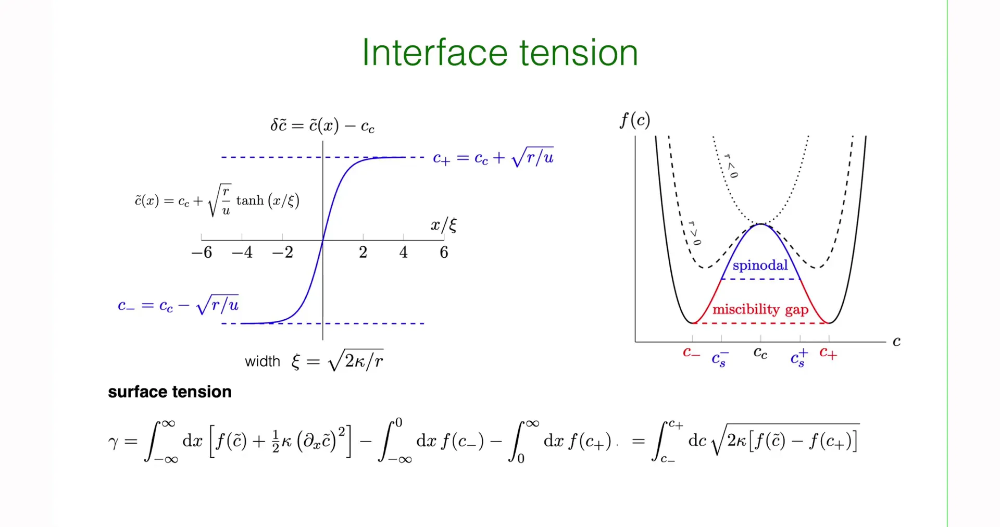
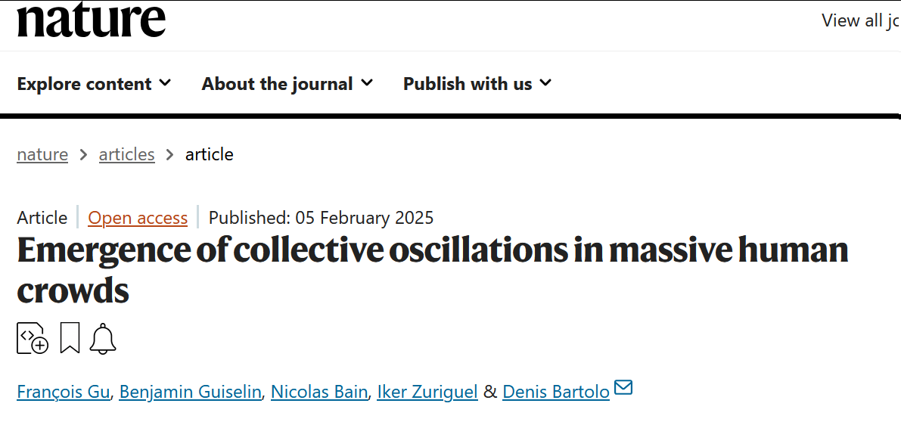

# Introduction - From Discrete Microscopic Models to Continuous Field Theory

**Lecture 13** established the thermodynamic cornerstone for describing phase behavior of binary mixtures (such as polymer blends, alloys). Through the **Lattice Gas Model** and **Flory-Huggins Mean-Field Theory**, not only was the physical picture of competition between mixing entropy (favoring disorder) and interaction energy (favoring aggregation) derived, but also the evolution of the Free Energy Landscape with interaction parameter $\chi$ was revealed.

When $\chi$ exceeds the critical threshold, the free energy density function $f(\phi)$ abruptly transitions from single-well to double-well structure. Although the static thermodynamic potential surface successfully predicts that phase separation must occur and the final equilibrium concentrations (i.e., coexistence values on the binodal), it cannot answer core questions about the **process**: **How does the system break free from the constraint of the single uniform state? What is the spatiotemporal path of phase separation?**

**Lecture 14** will shift from "static equilibrium" to "non-equilibrium dynamics." This is a further improvement and extension of dynamical theory following the introduction of non-conserved order parameter dynamics (Ginzburg-Landau/Allen-Cahn equation, i.e., Model A) in **Lecture 9**.

Unlike Model A, this lecture focuses on **Conserved Order Parameter**—i.e., local concentration $\phi(\vec{r},t)$ must satisfy the continuity equation. The **Cahn-Hilliard Equation (Model B)** derived under this framework captures a counter-intuitive physical phenomenon in nature—**Uphill Diffusion**. In the early stages of phase separation (spinodal decomposition region), matter no longer follows the conventional Fick's law of flowing from high to low concentration, but spontaneously aggregates from low concentration regions to high concentration regions, leading to spontaneous enhancement of concentration gradients and interface formation.


This lecture first elaborates the continualization process of free energy functionals, starting from discrete Flory-Huggins free energy, constructing the Ginzburg-Landau effective free energy functional via Taylor expansion, and introducing squared gradient terms to characterize energy penalties for spatial non-uniformity. Based on this functional, solving the Euler-Lagrange equation derives the characteristic hyperbolic tangent ($\tanh$) equilibrium interface profile between two phases and its surface tension, forming theoretical resonance with the interface dynamics in **Lecture 10**.

Combining mass conservation law with linear non-equilibrium thermodynamic Flux, the fourth-order partial differential equation controlling phase separation evolution—the **Cahn-Hilliard Equation**—is derived. On this basis, using Linear Stability Analysis (LSA) and Fourier mode decomposition, the instability mechanism of uniform state under perturbation is analytically solved, deriving the dispersion relation $\omega(q)$ and determining the **Fastest Growing Mode** that sets early texture scales. Finally, the complete dynamical evolution picture from early-stage **Spinodal Decomposition** to late-stage **Coarsening** is described.

This lecture mainly focuses on spontaneous phase separation mechanisms within the thermodynamically unstable region ($f''(\phi)<0$). For nucleation and growth mechanisms involving barrier crossing in the Metastable Region, these will be introduced in the next lecture.

# 1. Construction of Ginzburg-Landau Free Energy Functional

To describe the spatially continuously varying concentration field $c(\vec{r}, t)$ during phase separation, physical description must undergo a fundamental mathematical upgrade: from ordinary functions $F(c)$ depending only on scalar variables, to **Functionals** $\mathcal{F}[c(\vec{r})]$ depending on entire spatial field distributions. This process is called Ginzburg-Landau expansion, which is not only the cornerstone for handling self-organization behavior in this course, but also the universal language in modern condensed matter physics for handling symmetry breaking and phase transition problems. This lecture will rigorously derive this macroscopic field theory description starting from microscopic lattice models.

## 1.1 From Flory-Huggins to Landau Polynomial Expansion

Recall the dimensionless free energy density $f_{FH}(\phi)$ of binary mixtures (components A and B) derived in **Lecture 13**. Under mean-field approximation, this free energy consists of two competing parts—**Entropic contribution** and **Enthalpic contribution**:

$$
f_{FH}(\phi) = \underbrace{\frac{k_B T}{v} \left[ \phi \ln \phi + (1-\phi) \ln (1-\phi) \right]}_{\text{Mixing entropy: favoring disordered uniformity}} + \underbrace{\frac{k_B T}{v} \chi \phi (1-\phi)}_{\text{Interaction energy: favoring phase separation}}
$$

The physical meanings of each term are as follows:
- $\phi(\vec{r})$: represents local volume fraction of component A (order parameter), value range $0 \le \phi \le 1$.

- $v$: lattice unit volume (molecular volume).

- $\chi$ (Chi): Flory-Huggins interaction parameter. Its physical essence originates from contact energy differences between different molecules $\chi \propto \frac{z}{k_B T} [u_{AB} - \frac{1}{2}(u_{AA} + u_{BB})]$. Larger $\chi$ indicates higher energy cost for A-B contact, and like particles tend to aggregate to reduce total energy.

When the system is near the critical point, order parameter $\phi$ undergoes small fluctuations around critical concentration $\phi_c = 1/2$. To capture universal features of phase transitions and simplify mathematical treatment, Taylor expand $f_{FH}$ around $\phi_c$. Define the order parameter deviation (perturbation) from critical value as:

$$
\delta \phi = \phi - \frac{1}{2}
$$

Using Taylor series expansion of logarithmic functions $\ln(1/2 \pm x)$:

$$
\begin{aligned}
\phi \ln \phi &\approx \dots + 2(\delta \phi)^2 + \frac{4}{3}(\delta \phi)^4 \\
(1-\phi) \ln (1-\phi) &\approx \dots + 2(\delta \phi)^2 + \frac{4}{3}(\delta \phi)^4
\end{aligned}
$$

And rewriting the interaction term $\phi(1-\phi) = (1/2+\delta \phi)(1/2-\delta \phi) = 1/4 - (\delta \phi)^2$.

Substituting the above expansions into the original free energy expression, ignoring constant terms that don't affect dynamical properties and linear terms that can be eliminated through chemical potential redefinition, finally obtain the **Landau-type polynomial free energy density**:

$$
f_{loc}(\delta \phi) \approx \frac{1}{2} r_{eff} (\delta \phi)^2 + \frac{1}{4} u (\delta \phi)^4
$$

This expression clearly shows two key coefficients determining the system's fate:

**1. Quadratic term coefficient $r_{eff}$ (switch controlling phase transition occurrence):**

Composed of superposition of entropy term's second derivative (positive contribution) and interaction term's second derivative (negative contribution):

$$
r_{eff} \propto k_B T (2 - \chi)
$$

* **When $\chi < 2$ (high temperature or weak interaction)**: $r_{eff} > 0$, free energy density has minimum at $\delta \phi = 0$ (potential well), system is in stable state of single uniform phase.

* **When $\chi > 2$ (low temperature or strong interaction)**: $r_{eff} < 0$, free energy density becomes maximum at $\delta \phi = 0$ (potential barrier), origin becomes unstable, system undergoes spontaneous symmetry breaking.

**2. Quartic term coefficient $u$ (provides thermodynamic stability):**

Mainly originates from higher-order expansion of entropy term:

$$
u \propto k_B T > 0
$$

$u$ must always be positive. This term provides nonlinear saturation mechanism, preventing concentration fluctuations from amplifying infinitely when $r_{eff} < 0$. It acts like a "bowl wall," constraining the system within finite concentration range, ultimately determining equilibrium concentrations of two coexisting phases $c_{eq} = \pm \sqrt{|r_{eff}|/u}$.

To conform to common notation in Cahn-Hilliard dynamics literature and facilitate subsequent derivation, usually define a positive parameter $r > 0$ to describe curvature modulus in unstable region. Let $c \equiv \delta \phi$, under conditions of quenching to unstable region ($T < T_c$), local free energy density is written in standard form:

$$
f_{loc}(c) = - \frac{r}{2} c^2 + \frac{u}{4} c^4
$$


## 1.2 Cost of Spatial Non-uniformity: Gradient Energy Term

The above $f_{loc}(c)$ only applies to spatially completely uniform systems (local approximation). However, the physical essence of phase separation is forming A-rich and B-rich regions, which inevitably leads to **Interface** formation between the two phases. Interface means order parameter $c(\vec{r})$ varies drastically in space, disrupting local neighboring bonding environments, thus carrying energy cost.

To describe this energy penalty from spatial non-uniformity, Ginzburg and Landau introduced terms depending on order parameter gradient. Based on spatial rotational invariance (Isotropy) and symmetry considerations, the lowest-order non-zero gradient term is $(\nabla c)^2$.

Combining local potential energy with gradient energy yields total free energy functional $\mathcal{F}[c]$:

$$
\mathcal{F}[c(\vec{r})] = \int_V d^d r \left[ \underbrace{-\frac{r}{2} c^2 + \frac{u}{4} c^4}_{\text{Local free energy density } f_{loc}} + \underbrace{\frac{\kappa}{2} (\nabla c)^2}_{\text{Non-local gradient energy}} \right]
$$

This expression is the famous **Ginzburg-Landau Free Energy Functional**. The gradient coefficient $\kappa$ (Kappa) has clear physical constraints and microscopic origin:

$$
\kappa > 0
$$

**Physical Meaning**: $\kappa$ represents interface "stiffness" or energy penalty strength. It directly determines the magnitude of phase interface surface tension.

**Microscopic Connection**: When derived from microscopic theory, $\kappa$ is closely related to molecular interaction **Range** $\lambda$, approximately satisfying $\kappa \approx k_B T \chi \lambda^2$. This means the longer the interaction range, the higher the energy cost for forming sharply varying interfaces.


## Comparison: Flory-Huggins vs Ginzburg-Landau

To demonstrate the mapping relationship from microscopic discrete models to macroscopic continuous field theory, the following table summarizes core correspondences between the two theoretical frameworks:

| Property | Flory-Huggins (Microscopic/Discrete) | Ginzburg-Landau (Macroscopic/Continuous Field) |
| :--- | :--- | :--- |
| **Basic Variable** | Volume fraction $\phi_i$ on discrete lattice sites | Order parameter field $c(\vec{r})$ in continuous space |
| **Control Parameter** | Interaction parameter $\chi$ (dimensionless) | Quadratic coefficient $r$ (has energy density dimension) |
| **Phase Transition Driving Force** | Nonlinear competition between enthalpy and entropy | Flipping of polynomial potential well ($f''(0)<0$) |
| **Spatial Correlation** | Implied in mean-field assumption (ignores correlations) | Explicitly described by gradient term $\frac{\kappa}{2} (\nabla c)^2$ |
| **Free Energy Form** | Logarithmic form $\phi \ln \phi$ | Polynomial form $c^2, c^4$ |
| **Applicable Range** | Any concentration $0 \le \phi \le 1$ | Near critical point $c \approx 0$ (long-wave approximation) |

# 2. Equilibrium Properties: Interface Profile and Surface Tension

Before delving into Cahn-Hilliard dynamical evolution equations, the system's static equilibrium baseline must first be established. When phase separation is complete, the system is not in a single uniform state but forms coexisting enriched and depleted phases. The region connecting these two Bulk Phases is the interface. The specific structure of the interface—how wide is it? How much energy does it contain?—is completely determined by variational properties of the Ginzburg-Landau free energy functional. This section first analytically solves the interface equilibrium profile through the functional extremum problem, and thereby derives the microscopic expression of surface tension, laying the physical foundation for subsequent understanding of curvature-driven coarsening.

## 2.1 Euler-Lagrange Equation

Equilibrium state corresponds to the minimum point of total free energy functional $\mathcal{F}[c]$. According to variational principles, for functional $\mathcal{F}$ to take extremum with respect to field variable $c(\vec{r})$, concentration field must satisfy Euler-Lagrange equation. This is physically equivalent to requiring generalized chemical potential $\mu = \delta \mathcal{F}/\delta c$ to be constant throughout space (in absence of external field and for symmetric potential well, this constant is 0).

For the functional $\mathcal{F} = \int [f_{loc}(c) + \frac{\kappa}{2} (\nabla c)^2] d^d r$ constructed in previous section, its variational derivative is calculated as:

$$
\frac{\delta \mathcal{F}}{\delta c} = \frac{\partial f_{loc}}{\partial c} - \nabla \cdot \frac{\partial}{\partial (\nabla c)} \left( \frac{\kappa}{2} (\nabla c)^2 \right) = f'_{loc}(c) - \kappa \nabla^2 c
$$

Setting variational derivative to zero ($\mu = 0$) yields the differential equation describing equilibrium interface profile:

$$
\kappa \nabla^2 c = f'_{loc}(c)
$$

This equation reveals the physical mechanism of interface formation: gradient diffusion term $\kappa \nabla^2 c$ (favoring smoothing) must reach mechanical equilibrium with local potential energy driving force $f'_{loc}(c)$ (favoring demixing) at each point.

## 2.2 Interface Profile Solution

To analytically solve the specific interface shape, consider the simplest one-dimensional case. Assume interface is perpendicular to $x$ axis, concentration field $c(x)$ varies only with $x$. Under double-well conditions at $T < T_c$, local free energy derivative is $f'_{loc}(c) = -rc + uc^3$. Substituting into above equation, problem transforms to solving a nonlinear second-order ordinary differential equation:

$$
\kappa \frac{d^2 c}{d x^2} = -r c + u c^3
$$

**Boundary Conditions**: Interface connects two thermodynamically stable coexisting phases, so at infinity, concentration must approach the two minimum points of potential well:

$$
x \to -\infty, \quad c \to c_- = -\sqrt{\frac{r}{u}}
$$

$$
x \to +\infty, \quad c \to c_+ = +\sqrt{\frac{r}{u}}
$$

This equation has a famous analytical solution, called **Hyperbolic Tangent Solution (Kink Solution)** or soliton solution:

$$
c(x) = \sqrt{\frac{r}{u}} \tanh \left( \frac{x}{\sqrt{2} \xi} \right)
$$

In this solution, a key length scale naturally emerges—**Correlation Length** or **Interface Width** $\xi$:

$$
\xi \equiv \sqrt{\frac{\kappa}{r}}
$$

**Physical Meaning:**

Interface width expression $\sqrt{\kappa/r}$ clearly embodies balance between two competing mechanisms:

* **Numerator:** Gradient coefficient $\kappa$. Larger $\kappa$ means higher energy cost for non-uniformity, system tends to widen interface to slow gradient variation, leading to larger $\xi$.

* **Denominator:** Potential well depth parameter $r$. Larger $r$ means deeper double-well, stronger tendency for like-particle aggregation, system tends to compress interface so more particles reside in low-energy bulk phases, leading to smaller $\xi$.

When temperature approaches critical point ($T \to T_c$), since $r \propto (T_c - T)$ approaches 0, interface width $\xi \propto (T_c - T)^{-1/2}$ tends to infinity. This means near critical point, boundary between two phases becomes extremely blurry, macroscopic interface disappears, consistent with experimentally observed **Critical Opalescence** phenomenon.

## 2.3 Calculation of Interface Tension

Interface tension $\gamma$ is one of the core driving forces of phase separation dynamics (such as Laplace pressure). Its definition is: extra free energy added by introducing an interface relative to same volume of single uniform bulk phase. Mathematical expression is integral of energy density over all space:

$$
\gamma = \int_{-\infty}^{+\infty} dx \left[ f_{loc}(c(x)) + \frac{\kappa}{2} \left(\frac{dc}{dx}\right)^2 - f_{min} \right]
$$

where $f_{min} = f(c_{\pm})$ is equilibrium free energy density of bulk phase.
Direct integration of hyperbolic tangent function is tedious; this lecture introduces an elegant method using **First Integral of Motion (Energy Equipartition Identity)**. Similar to energy conservation in classical mechanics, on equilibrium paths satisfying Euler-Lagrange equation, gradient energy density and local potential energy increment are strictly equal in magnitude:

$$
\frac{\kappa}{2} \left(\frac{dc}{dx}\right)^2 = f_{loc}(c) - f_{min}
$$

Using this identity, we can transform integration variable from spatial coordinate $x$ to order parameter $c$, thereby avoiding complex spatial dependence:

$$
\gamma = \int_{-\infty}^{+\infty} dx \left[ 2 \times \frac{\kappa}{2} \left(\frac{dc}{dx}\right)^2 \right] = \int_{c_-}^{c_+} dc \sqrt{2\kappa [f_{loc}(c) - f_{min}]}
$$

Substituting double-well form $f_{loc}(c) - f_{min} = \frac{u}{4}(c^2 - c_0^2)^2$, integral becomes:

$$
\gamma = \int_{-c_0}^{+c_0} dc \sqrt{\frac{\kappa u}{2}} (c_0^2 - c^2)
$$

After calculation ($\int (c_0^2 - c^2) dc = \frac{4}{3}c_0^3$), finally obtain universal surface tension formula in Landau theory:

$$
\gamma = \frac{2\sqrt{2}}{3} \frac{r^{3/2} \kappa^{1/2}}{u}
$$


This formula profoundly connects macroscopic and microscopic: macroscopically measurable surface tension $\gamma$ is completely determined by microscopic interaction parameters ($r, u, \kappa$).

**Temperature Dependence:** Considering $r \propto (T_c - T)$ and $u \approx const$, we have $\gamma \propto (T_c - T)^{3/2}$.

**Critical Behavior:** When $T \to T_c$, surface tension tends to zero with critical exponent 1.5, explaining why near critical point droplets deform easily and interfaces are extremely unstable.




# 3. Non-equilibrium Dynamics: Derivation of Cahn-Hilliard Equation

After constructing the Ginzburg-Landau functional $\mathcal{F}$ describing system's static energy characteristics, focus of theory construction shifts to system's spatiotemporal evolution mechanism. Static free energy only indicates system's "destination" (equilibrium state), while dynamical equations describe how the system traverses complex energy landscapes to reach there—the "path." For phase separation of binary mixtures, dynamical behavior is constrained by a most fundamental physical iron law: **mass conservation**. This section rigorously derives the equation of motion describing universal phase separation dynamics under this constraint.

## 3.1 Conservation Law and Model B Classification

Unlike magnetic systems (such as spin flipping in Ising model), component A molecules in binary mixtures neither appear nor disappear out of thin air, but can only undergo positional migration through transport in physical space. This dynamical property is called **Model B** in Hohenberg and Halperin classification (in contrast, relaxation dynamics with non-conserved order parameter is called **Model A** or Allen-Cahn equation).

Therefore, evolution of concentration field (order parameter) $c(\vec{r}, t)$ must strictly obey continuity equation:

$$
\frac{\partial c}{\partial t} + \nabla \cdot \vec{J} = 0 \quad \Rightarrow \quad \frac{\partial c}{\partial t} = - \nabla \cdot \vec{J}
$$

where $\vec{J}(\vec{r}, t)$ represents mass flux density. This conservation constraint profoundly changes system's dynamical behavior: any local concentration change must be accompanied by long-range material flow, causing extremely long relaxation times for long-wave modes (large-scale structures), forming sharp contrast with non-conserved systems where order parameter can directly relax locally.

## 3.2 Generalized Thermodynamic Force and Chemical Potential

To close the equation, relationship between flux $\vec{J}$ and system state variables must be established. According to non-equilibrium thermodynamics (Onsager linear response theory), the fundamental cause driving material flow is not simply concentration gradient (Fick's law is only special case for ideal dilute solutions), but **gradient of generalized chemical potential**. Material always flows from high to low chemical potential regions, so flux is proportional to generalized thermodynamic force:

$$
\vec{J} = - M \nabla \mu
$$

In this relation:

$M$: **Mobility**. It characterizes difficulty of particle movement in medium. In basic theoretical derivation, $M$ is usually assumed constant (isotropic and uniform). But in more refined polymer dynamics models, $M$ often depends on local concentration, e.g., $M(c) \propto 1-c^2$ (reflecting restricted migration in pure component regions); this lecture mainly focuses on simplest case of constant $M$.

$\mu$: **Generalized Chemical Potential**, corresponding to exchange chemical potential $\mu_{ex} = \mu_A - \mu_B$.

## 3.3 Variational Derivative Determines Chemical Potential

Core of Ginzburg-Landau theory is that chemical potential $\mu$ here is no longer simple partial derivative of thermodynamic function, but **Functional Derivative** of free energy functional $\mathcal{F}$ with respect to field variable $c(\vec{r})$. This introduces spatially non-local interactions:

$$
\mu(\vec{r}) = \frac{\delta \mathcal{F}}{\delta c(\vec{r})} = \underbrace{\frac{\partial f_{loc}}{\partial c}}_{\text{Local contribution}} - \underbrace{\kappa \nabla^2 c}_{\text{Non-local/Interface contribution}}
$$

**Physical Meaning:**

**Local Contribution**: Originates from Flory-Huggins double-well, driving system toward equilibrium concentrations.

**Interface Contribution ($-\kappa \nabla^2 c$)**: This term is crucial, representing **interface curvature** correction to chemical potential. Inside droplets (convex interface), concentration distribution appears "peak-shaped," $\nabla^2 c < 0$, making $-\kappa \nabla^2 c > 0$, thus **raising** local chemical potential. This is precisely the direct expression of classical **Gibbs-Thomson Effect** in continuous field theory: droplets with larger curvature have higher internal chemical potential, causing material to escape and diffuse into larger droplets. This mechanism directly drives Ostwald Ripening phenomenon in late-stage phase separation.

## 3.4 Complete Form of Cahn-Hilliard Equation (Model B)

Substituting chemical potential $\mu$ determined by functional derivative into flux formula, then combining with continuity equation, the famous **Cahn-Hilliard Equation** is assembled. This is a fourth-order nonlinear partial differential equation describing conserved order parameter evolution in thermodynamically unstable region:

$$
\frac{\partial c}{\partial t} = \nabla \cdot \left[ M \nabla \left( \frac{\partial f_{loc}}{\partial c} - \kappa \nabla^2 c \right) \right]
$$

Assuming mobility $M$ is constant, and substituting Landau polynomial potential derivative $f'_{loc}(c) = -rc + uc^3$, equation expands to specific form:

$$
\frac{\partial c}{\partial t} = M \nabla^2 (-r c + u c^3) - M \kappa \nabla^4 c
$$

To deeply understand its physical mechanism, the right side of equation can be interpreted in two parts:

1.**Uphill Diffusion Term**: $M \nabla^2 (-r c)$

When system is in spinodal region ($r>0$), this term is equivalent to $D_{eff} \nabla^2 c$, where effective diffusion coefficient $D_{eff} = -M r < 0$. **Negative diffusion coefficient** means material flow direction is opposite to conventional Fick diffusion: material spontaneously flows from low to high concentration regions, causing small concentration fluctuations to be continuously amplified rather than smoothed. This is the fundamental driving force for phase separation.

2.**Bi-harmonic Stabilization Term**: $- M \kappa \nabla^4 c$ 

This is a fourth-order derivative term originating from gradient energy penalty. Since $\kappa > 0$, this term dominates in short-wavelength (high wavenumber) range and acts as **damping/stabilization**. It physically suppresses violent fluctuations at extremely short distances, preventing concentration gradients from diverging infinitely due to uphill diffusion, thus ensuring formed interfaces have finite width ($\xi$), avoiding non-physical singularities.


# 4. Linear Stability Analysis and Dispersion Relation

Cahn-Hilliard equation is a highly nonlinear fourth-order partial differential equation, generally difficult to obtain analytical general solutions. However, to quantitatively understand how phase separation **initiates**, key to theoretical analysis is examining how a uniformly mixed state responds to small thermodynamic fluctuations. If small perturbations decay over time, mixed state is stable; if perturbations amplify over time, system is unstable. This method is called **Linear Stability Analysis (LSA)**, and it is the golden key to understanding physical picture of Spinodal Decomposition.

## 4.1 Linearized Perturbation Equation

Assume system initially is in uniform mixed state with average concentration $c_0$ (in critical quench experiments, usually take critical composition $c_0 = 0$). Superimpose a small spatiotemporal perturbation $\delta c(\vec{r}, t)$ on this background:

$$
c(\vec{r}, t) = c_0 + \delta c(\vec{r}, t), \quad \text{where } |\delta c| \ll 1
$$

Substitute this expression into Cahn-Hilliard equation, use Taylor expansion $f'(c) \approx f'(c_0) + f''(c_0)\delta c$, and ignore all higher-order nonlinear terms of $\delta c$ (such as $(\delta c)^3$), equation is linearized to:

$$
\frac{\partial \delta c}{\partial t} = M \nabla^2 \left( f''(c_0) \delta c - \kappa \nabla^2 \delta c \right)
$$

For critical quench ($c_0=0$), according to Landau free energy $f_{loc}(c) = -\frac{r}{2}c^2 + \frac{u}{4}c^4$ defined in Section 1, second derivative $f''(0) = -r$. This indicates within spinodal region, second derivative is negative, providing driving force for instability.

## 4.2 Fourier Modes and Dispersion Relation

Since linearized equation coefficients are constants, and boundary conditions are usually periodic or infinite, various fluctuation modes in space are mutually decoupled. This allows Fourier Transform of perturbation field, converting complex spatial differentiation into algebraic operations.

Introduce plane wave trial solution:

$$
\delta c(\vec{r}, t) = \int \frac{d^d q}{(2\pi)^d} \hat{c}(\vec{q}, t) e^{i \vec{q} \cdot \vec{r}}
$$

where $\vec{q}$ is Wavenumber vector. Substituting into linear equation, using operator correspondences $\nabla \to i\vec{q}$ and $\nabla^2 \to -q^2$, each Fourier mode $\hat{c}(\vec{q}, t)$ evolution follows first-order ODE:

$$
\frac{\partial \hat{c}(\vec{q}, t)}{\partial t} = \sigma(q) \hat{c}(\vec{q}, t)
$$

Solution exhibits exponential form $\hat{c}(\vec{q}, t) = \hat{c}(\vec{q}, 0) e^{\sigma(q) t}$. The functional relationship between growth rate $\sigma(q)$ and wavenumber magnitude $q$ is called **Dispersion Relation**:

$$
\sigma(q) = -M q^2 \left( f''(c_0) + \kappa q^2 \right)
$$

In thermodynamically unstable region (Spinodal Region, $f''(c_0) < 0$), letting $|f''(c_0)| = r$, dispersion relation can be rewritten in more intuitive form:

$$
\sigma(q) = M q^2 \left( r - \kappa q^2 \right) = M r q^2 - M \kappa q^4
$$

## 4.3 Mode Selection: Fingerprint of Spinodal Decomposition

Analytical form of dispersion relation $\sigma(q)$ reveals the most core physical characteristic distinguishing Spinodal Decomposition from nucleation and growth—**Scale Selectivity**. $\sigma(q)$ presents as inverted parabola (bell-shaped curve), this non-monotonicity arises from competition between two physical mechanisms:

1.**Long-wave Instability ($q \to 0$)**:
When $q$ is small, ignoring higher-order terms, $\sigma(q) \approx M r q^2 > 0$.

**Positive Growth**: Indicates long-wave perturbations are unstable and will exponentially amplify over time.

**Zero-point Constraint**: Note $\sigma(0)=0$. This originates from **mass conservation law** (Cahn-Hilliard is Model B). Total mass of entire system cannot change ($q=0$ corresponds to average concentration), so infinitely long wavelength mode cannot grow, phase separation must proceed through local material rearrangement.

2.**Short-wave Cut-off ($q \to \infty$)**:

As $q$ increases, gradient energy term $-M \kappa q^4$ gradually dominates, causing $\sigma(q)$ to become negative.

**Physical Meaning**: Extremely short wavelength fluctuations mean extremely large concentration gradients, requiring huge interface energy cost. When wavelength is shorter than certain threshold, energy penalty exceeds benefit from demixing, perturbation will be suppressed and decay.

**Cut-off Wavenumber $q_c$ (or $q_0$)**: Setting $\sigma(q_c) = 0$, solve for critical wavenumber:

$$
q_c = \sqrt{\frac{r}{\kappa}} = \sqrt{\frac{-f''(c_0)}{\kappa}}
$$

This defines minimum structural size $\lambda_c = 2\pi/q_c$ system can form.

3.**Fastest Growing Mode ($q_{max}$)**:

Within unstable interval $0 < q < q_c$, $\sigma(q)$ must have a maximum. Solving $d\sigma/dq = 0$:

$$
\frac{d}{dq} (M r q^2 - M \kappa q^4) = 2Mrq - 4M\kappa q^3 = 0
$$

Solve for characteristic wavenumber with fastest growth:

$$
q_{max} = \sqrt{\frac{r}{2\kappa}} = \frac{q_c}{\sqrt{2}}
$$

**Physical Conclusion:**

This result constitutes "fingerprint" of Spinodal Decomposition. Although initial thermal fluctuations (white noise) contain all frequency components, linear dynamical equation acts as **Band-pass Filter**. It preferentially amplifies fluctuation modes with wavelength $\lambda_{max} \approx 2\pi/q_{max}$.

This explains why in early phase separation, system spontaneously emerges with characteristic uniformly scaled, labyrinth-like **Bicontinuous Pattern**. This spontaneous selection of characteristic scale is its most essential difference from nucleation and growth (random and local droplet formation).


# 5. Code Practice: Emergence of Collective Oscillations in Crowded Crowds

In previous lectures, we have clearly explained **"how phase separation spatial patterns grow from uniform state"**:  
- Model A (Allen–Cahn): relaxation of non-conserved order parameter

- Model B (Cahn–Hilliard): uphill diffusion of conserved order parameter, dispersion relation and fastest growing mode 

But in many non-equilibrium systems in real world, "phase transition" signature is not necessarily spatial phase separation structure,
but may be **"spontaneously selecting a frequency" in time dimension** (**from noise → periodic oscillation**). This section uses a 2025 Nature paper on crowd dynamics as practice case, transferring "linear stability/mode decomposition" learned in CH equation to "spectrum—phase transition" toolkit.



In large gatherings, **dense crowds are strongly constrained in limited space**, once uncontrolled collective motion occurs, it may lead to crushing risks at walls, breathing obstruction, stampedes, casualties. Typical cases include "crowd quakes" in 2010 Love Parade (Duisburg, Germany) accident, and Korea Itaewon stampede.

Over past decades, mainstream pedestrian crowd models often start from "pairwise interactions between individuals" (e.g., heuristic collision/social force models), effective for trajectory prediction of small crowds; but when crowd size reaches **thousands and extremely crowded**, system becomes huge many-body problem, difficult to establish verifiable first-principles explanations from microscopic behavioral rules.

Crowd at Spain's San Fermín festival (video, source: Gu, F., Guiselin, B., Bain, N. et al. Nature 638, 112–119 (2025)):

<video controls preload="metadata" style="width: 100%;">
  <source src="../cn/assets/images/San Fermín.mp4" type="video/mp4" />
</video>

Download: [`San Fermín.mp4`](../cn/assets/images/San Fermín.mp4)


Breakthrough of this paper: authors seized a rare opportunity—at Spanish Pamplona **San Fermín festival opening ceremony (Chupinazo)**, obtained repeatable crowd video data over multiple consecutive years, at same location, same time, similar organization; and treated dense crowd as **continuous medium (active continuum)** for measurement and modeling, thereby discovering and explaining a phenomenon:

**When average density crosses threshold, dense crowd spontaneously self-organizes into macroscopic "chiral oscillator," hundreds of people synchronously performing orbital motion; without external command, without rhythm signal.**

This study treats crowd as two-dimensional continuum, core observables are two "fields":

1.**Local Density Field** $\rho(\mathbf{r},t)$: obtain discrete points through head detection, then calculate local density in spatial window

2.**Eulerian Velocity Field** $\mathbf{v}(\mathbf{r},t)$: use PIV (particle image velocimetry) to measure velocity vector in ~1.5m scale window

![Crowd gathering and density growth before San Fermín festival "Chupinazo" opening. (a) Crowd photo from 2019 San Fermín festival opening; (b) Overhead view of Plaza Consistorial and study region (dashed polygon), orange dots are observation points (scale bar 10 m); (c,d) Close-up at 57:15 and 00:30 before opening, green dots are participant positions from head detection; (e) Average number density monotonically increasing over time for 2022/2023/2024, crossing into extremely crowded state near critical density $\rho^*$ shown by dashed line; inset shows radial distribution function $g(r)$; (f) Local density heatmaps at two times (white areas are view blocked by buildings/flags/balloons). This figure shows: during gradual crowd density increase, system enters new dynamical phase near $\rho^*$ (subsequently manifesting as collective oscillations). Source: Gu, F., Guiselin, B., Bain, N. et al. Nature 638, 112–119 (2025).](../cn/assets/images/14_005_3ce843de-cf42-4947-a95a-0924653ec993.jpg)


This step is crucial—this study **no longer views crowd merely as collection of many individual trajectories, but as a continuous dynamical field that can be measured and analyzed**. Through systematic processing of dense crowd videos, they constructed time-varying **velocity field** and **density field**, enabling "crowd dynamics" to truly enter analysis framework of **continuous field theory** and statistical physics for first time. This step is crucial because it provides unified, comparable objects for subsequent spectral analysis and phase transition criteria.

Study found that as crowd density slowly rises over time, overall motion state does not change gradually and smoothly. Instead, approaching certain **critical density**, crowd velocity fluctuations suddenly undergo qualitative change: from originally featureless, approximately random noise state, transitioning to collective motion state with obvious periodicity. To reveal essence of this phase transition, authors introduced **spectral analysis** as tool, decomposing velocity field structure in time dimension.

![Spectral characteristics and dynamical phase transition of crowd collective oscillations. Top row shows crowd velocity (kinetic energy) and decomposed direction and speed magnitude power spectra from different years and events; middle row uses raw trajectories and schematics to illustrate oscillation has orbital (not back-and-forth) characteristics; bottom row gives spectrum heatmaps varying with control parameter. Experimental results use average crowd density as horizontal axis, numerical results use dimensionless parameter $\beta/\beta_c$ as horizontal axis. Black dashed line marks critical point, black dots indicate dominant oscillation frequency $\omega_0$. Can see $\omega_0$ jumps from 0 to non-zero near critical point, marking system entering collective oscillation phase. Source: Gu, F., Guiselin, B., Bain, N. et al. Nature 638, 112–119 (2025).](../cn/assets/images/14_006_ea7e179d-0ed0-4251-9e90-9593551e3920.jpg)

Specifically, they performed temporal Fourier transform on crowd velocity field $\mathbf{v}(\mathbf{r},t)$, constructing velocity (or kinetic energy) power spectrum $S_v(\omega)$. Results show: under high density conditions, spectrum function is no longer flat, but exhibits stable and clear peaks at pair of symmetric finite frequencies $\pm \omega_0$. Time scale corresponding to this dominant frequency is about ten seconds, indicating crowd as whole undergoes periodic collective motion at this time scale. Further decomposition analysis revealed counter-intuitive but extremely important fact: **these spectral peaks mainly come from periodic changes in motion direction, not periodic changes in speed magnitude**. This means crowd is not "swaying back and forth," but performing orbit-like **orbital motion** in space, embodying a kind of macroscopic chiral collective oscillation.

To more clearly present this "from nothing to something" transition process, study further adopted **time-frequency analysis** method. They used sliding time windows (e.g., several minutes width), repeatedly calculated velocity spectrum in different time periods, and assembled results into two-dimensional heatmap. Resulting images intuitively show how spectral structure evolves with control parameter changes: in experimental data, horizontal axis is local average crowd density; in theory and numerical simulation, horizontal axis corresponds to dimensionless control parameter $\beta/\beta_c$ in model. In such plots (above figure f), can clearly see: **when system crosses critical point, dominant frequency $\omega_0$ suddenly jumps from zero to finite value**. Therefore, $\omega_0$ can naturally be understood as **dynamical order parameter** characterizing whether "oscillation phase" appears.


In CH model, $\sigma(q)$ determines which spatial wavelength will spontaneously grow, corresponding to spatial structure formation; in crowd system, velocity spectrum $S_v(\omega)$ reveals whether system will spontaneously select finite oscillation frequency $\omega_0$, corresponding to temporal structure formation. In other words, CH describes "how spatial instability leads to structure self-organization," while crowd dynamics demonstrates "how temporal instability leads to periodic state (limit cycle) self-organization."

Both are isomorphic in analytical logic, but physical results point to completely different types of phase transitions. Furthermore, this difference originates from different dynamical essences: Cahn–Hilliard equation is strictly a gradient flow system, its evolution follows monotonic dissipation of free energy functional $\mathcal{F}[c]$, inevitably heading toward static equilibrium (phase separation and coarsening); while chiral oscillations in crowds belong to **non-reciprocal non-equilibrium phase**, system does not descend along some free energy function, but can stably run on limit cycle without external periodic driving. Precisely because of this, in this section we no longer repeat "phase separation heatmaps" already deeply discussed in previous lectures, but instead use **spectral heatmaps**, providing phase transition observation perspective centered on temporal frequency.

Following code reproduces a simple spatial coupling model with two-dimensional lattice and local overdamped dynamics, reproducing **emergence of collective oscillations** in dense crowds—this non-equilibrium dynamical phenomenon. First, code simulates "toy continuum model" on two-dimensional lattice simulating wall-constrained crowd, treating crowd as continuum, generating visualizable **crowd turbulence animation** through local overdamped dynamics and simple spatial coupling.

At temporal level, construct mean-field (0D) model, scan control parameter $\beta/\beta_c$, perform Fourier analysis on system velocity time series, calculate velocity spectrum $S_v(\omega)$, capturing process of dominant oscillation frequency $\omega_0$ jumping from 0 to non-zero near critical point.

```python

from __future__ import annotations

import os
import math
from dataclasses import dataclass
from typing import Tuple, Optional

import numpy as np
import matplotlib.pyplot as plt
from matplotlib.animation import FuncAnimation, PillowWriter

# 0) Utility functions

def laplacian_periodic(field: np.ndarray) -> np.ndarray:
    """2D Laplacian with periodic boundaries: ∇²f ≈ neighbors - 4f"""
    return (
        -4.0 * field
        + np.roll(field, 1, axis=0)
        + np.roll(field, -1, axis=0)
        + np.roll(field, 1, axis=1)
        + np.roll(field, -1, axis=1)
    )

def moving_average_1d(x: np.ndarray, w: int) -> np.ndarray:
    if w <= 1:
        return x
    k = np.ones(w, dtype=float) / float(w)
    return np.convolve(x, k, mode="same")

def fft_spectrum_sv(vx: np.ndarray, vy: np.ndarray, dt: float) -> Tuple[np.ndarray, np.ndarray]:
    """
    Velocity spectrum: S_v(ω) = |FFT(vx)|^2 + |FFT(vy)|^2
    Returns: omega_sorted (rad/s), Sv_sorted
    """
    n = len(vx)
    fx = np.fft.fft(vx - vx.mean())
    fy = np.fft.fft(vy - vy.mean())
    Sv = (np.abs(fx) ** 2 + np.abs(fy) ** 2) / float(n)  # Simple normalization (shape only)

    freq = np.fft.fftfreq(n, d=dt)  # Hz
    omega = 2.0 * np.pi * freq      # rad/s

    idx = np.argsort(omega)
    return omega[idx], Sv[idx]

# 1) Part A: Cool GIF (2D toy spatial model)

@dataclass
class GifParams:
    # Grid
    N: int = 64
    dt: float = 0.005
    relax_steps: int = 1200
    steps: int = 3600

    frame_stride: int = 40
    quiver_stride: int = 5
    fps: int = 20

    # Local dynamics parameters (aligned with author's magnitude):contentReference[oaicite:4]{index=4}
    k: float = 0.027
    gamma_p: float = 18.0
    beta: float = 1.10
    epsilon: float = 0.025     # eta/gamma_p (author script same name eps):contentReference[oaicite:5]{index=5}
    sigma_p: float = 0.50      # toy noise

    # Toy spatial coupling (visually form clusters/large-scale flows)
    Du: float = 0.30
    Dp: float = 0.30

    # Particles
    show_particles: bool = True
    n_particles: int = 2000
    particle_speed_scale: float = 1.0

    seed: int = 0

def simulate_lattice_for_gif(prm: GifParams) -> Tuple[np.ndarray, np.ndarray, np.ndarray]:
    """
    Returns: vx_frames, vy_frames, speed_frames
    shape: (n_frames, N, N)
    """
    rng = np.random.default_rng(prm.seed)
    N = prm.N
    dt = prm.dt

    # Initial small perturbation
    ux = 1e-3 * rng.standard_normal((N, N))
    uy = 1e-3 * rng.standard_normal((N, N))
    px = 1e-3 * rng.standard_normal((N, N))
    py = 1e-3 * rng.standard_normal((N, N))

    n_frames = prm.steps // prm.frame_stride
    vx_frames = np.zeros((n_frames, N, N), dtype=np.float32)
    vy_frames = np.zeros((n_frames, N, N), dtype=np.float32)
    sp_frames = np.zeros((n_frames, N, N), dtype=np.float32)

    frame_idx = 0
    total_steps = prm.relax_steps + prm.steps

    for step in range(total_steps):
        lap_ux = laplacian_periodic(ux)
        lap_uy = laplacian_periodic(uy)

        # v = du/dt
        vx = -prm.k * ux + px + prm.Du * lap_ux
        vy = -prm.k * uy + py + prm.Du * lap_uy

        # Update u
        ux = ux + dt * vx
        uy = uy + dt * vy

        # p dynamics: toy version of "windsock + nonlinear saturation + odd-friction"
        # We use an equivalent structure (consistent with your previous script) to ensure the visual effect of "collective oscillation".
        p2 = px * px + py * py
        pv = px * vx + py * vy
        odd_x = -p2 * vx + pv * px
        odd_y = -p2 * vy + pv * py

        lap_px = laplacian_periodic(px)
        lap_py = laplacian_periodic(py)

        dpx = (
            -prm.gamma_p * px
            + prm.gamma_p * prm.beta * (1.0 - prm.epsilon * p2) * vx
            + odd_x
            + prm.Dp * lap_px
        )
        dpy = (
            -prm.gamma_p * py
            + prm.gamma_p * prm.beta * (1.0 - prm.epsilon * p2) * vy
            + odd_y
            + prm.Dp * lap_py
        )

        px = px + dt * dpx + prm.sigma_p * math.sqrt(dt) * rng.standard_normal((N, N))
        py = py + dt * dpy + prm.sigma_p * math.sqrt(dt) * rng.standard_normal((N, N))

        if step >= prm.relax_steps:
            if (step - prm.relax_steps) % prm.frame_stride == 0 and frame_idx < n_frames:
                speed = np.sqrt(vx * vx + vy * vy)
                vx_frames[frame_idx] = vx.astype(np.float32)
                vy_frames[frame_idx] = vy.astype(np.float32)
                sp_frames[frame_idx] = speed.astype(np.float32)
                frame_idx += 1

    return vx_frames, vy_frames, sp_frames

def render_gif(vx_frames: np.ndarray, vy_frames: np.ndarray, sp_frames: np.ndarray, prm: GifParams, out_gif: str):
    n_frames, N, _ = vx_frames.shape

    fig, ax = plt.subplots(figsize=(6, 6))
    ax.set_title("Crowd oscillations (toy spatial model)")
    ax.set_xlim(0, N)
    ax.set_ylim(0, N)
    ax.set_aspect("equal")

    vmax = float(np.percentile(sp_frames, 99))
    im = ax.imshow(
        sp_frames[0],
        origin="lower",
        interpolation="nearest",
        extent=(0, N, 0, N),
        vmin=0.0,
        vmax=vmax,
        cmap="RdYlBu_r",  # Blue→Red, close to Fig3f visual perception
    )
    cb = fig.colorbar(im, ax=ax, fraction=0.046, pad=0.04)
    cb.set_label("|v| (a.u.)")

    # quiver
    s = prm.quiver_stride
    x = np.arange(0.5, N, s)
    y = np.arange(0.5, N, s)
    X, Y = np.meshgrid(x, y)

    U0 = vx_frames[0][::s, ::s]
    V0 = vy_frames[0][::s, ::s]
    quiv = ax.quiver(X, Y, U0, V0, angles="xy", scale_units="xy", scale=1.5, width=0.004, color="k")

    # Particles (pure visual enhancement)
    scat = None
    if prm.show_particles:
        rng = np.random.default_rng(prm.seed + 123)
        px = rng.uniform(0, N, size=prm.n_particles)
        py = rng.uniform(0, N, size=prm.n_particles)
        scat = ax.scatter(px, py, s=2, alpha=0.6, c="k")

    dt_frame = prm.dt * prm.frame_stride

    def update(i: int):
        im.set_data(sp_frames[i])

        Ui = vx_frames[i][::s, ::s]
        Vi = vy_frames[i][::s, ::s]
        quiv.set_UVC(Ui, Vi)

        if scat is not None:
            pos = scat.get_offsets()
            gi = np.clip(pos[:, 1].astype(int), 0, N - 1)
            gj = np.clip(pos[:, 0].astype(int), 0, N - 1)
            vel_x = vx_frames[i][gi, gj]
            vel_y = vy_frames[i][gi, gj]
            pos[:, 0] = (pos[:, 0] + prm.particle_speed_scale * dt_frame * vel_x) % N
            pos[:, 1] = (pos[:, 1] + prm.particle_speed_scale * dt_frame * vel_y) % N
            scat.set_offsets(pos)
            return im, quiv, scat

        return im, quiv

    anim = FuncAnimation(fig, update, frames=n_frames, interval=1000 / prm.fps, blit=False)
    anim.save(out_gif, writer=PillowWriter(fps=prm.fps))
    plt.close(fig)

# 2) Part B: Fig.3f-like (0D mean-field scan beta)

@dataclass
class Fig3FParams:
    # Scan range (fewer points = faster)
    beta_ratio_min: float = 0.5
    beta_ratio_max: float = 2.5
    n_beta: int = 35

    # Mean-field parameters (aligned with author script magnitude):contentReference[oaicite:6]{index=6}
    k: float = 0.027
    gamma_p: float = 18.0
    epsilon: float = 0.025   # eta/gamma_p
    sigma: float = 2.0       # Noise amplitude (author script sigma):contentReference[oaicite:7]{index=7}

    # Numerical integration (significantly shortened for speedup)
    dt: float = 0.002
    n_relax: int = 20000
    n_steps: int = 60000
    n_run: int = 10

    # Frequency domain settings
    omega_max: float = 1.2        # rad/s (matching paper Fig3f vertical axis magnitude)
    smooth_window: int = 7        # Light smoothing of spectrum
    peak_exclude_omega: float = 0.10  # Avoid treating ω≈0 energy as peaks

    seed: int = 0

def mf_dynamics(Y: np.ndarray, k: float, beta: float, gamma_p: float, eps: float) -> np.ndarray:
    """
    We adopt the same mean-field structure as the author script (Eq.(S17)-style),
    directly using the expression form from the author's public code (but our own implementation).:contentReference[oaicite:8]{index=8}
    Y = [ux, uy, px, py]
    """
    ux, uy, px, py = Y
    prod_p = px * py
    norm_p2 = px * px + py * py
    dux = -k * ux + px
    duy = -k * uy + py

    dpx = (
        -gamma_p * (1.0 - beta + beta * eps * norm_p2) * px
        -k * beta * gamma_p * (1.0 - eps * norm_p2) * ux
        -k * prod_p * uy
        +k * (py * py) * ux
    )
    dpy = (
        -gamma_p * (1.0 - beta + beta * eps * norm_p2) * py
        -k * beta * gamma_p * (1.0 - eps * norm_p2) * uy
        -k * prod_p * ux
        +k * (px * px) * uy
    )
    return np.array([dux, duy, dpx, dpy], dtype=float)

def mf_integrate_one_run(prm: Fig3FParams, beta: float, rng: np.random.Generator) -> Tuple[np.ndarray, np.ndarray]:
    """
    Integrate mean-field using Euler–Maruyama (fast enough).
    Noise is added only to the p equation, aligning with the author script approach.:contentReference[oaicite:9]{index=9}
    Returns: vx(t), vy(t) (steady-state segment)
    """
    Y = 1e-10 * rng.standard_normal(4)  # Small perturbation

    dt = prm.dt
    noise_amp = prm.sigma

    # Relaxation phase
    for _ in range(prm.n_relax):
        dW = np.array([0.0, 0.0, rng.standard_normal() * noise_amp * math.sqrt(dt), rng.standard_normal() * noise_amp * math.sqrt(dt)])
        Y = Y + mf_dynamics(Y, prm.k, beta, prm.gamma_p, prm.epsilon) * dt + dW

    # Recording phase
    vx = np.zeros(prm.n_steps, dtype=float)
    vy = np.zeros(prm.n_steps, dtype=float)

    for i in range(prm.n_steps):
        dW = np.array([0.0, 0.0, rng.standard_normal() * noise_amp * math.sqrt(dt), rng.standard_normal() * noise_amp * math.sqrt(dt)])
        Y = Y + mf_dynamics(Y, prm.k, beta, prm.gamma_p, prm.epsilon) * dt + dW
        ux, uy, px, py = Y
        vx[i] = -prm.k * ux + px
        vy[i] = -prm.k * uy + py

    return vx, vy

def compute_fig3f_like(prm: Fig3FParams, out_png: str):
    # Critical beta_c formula: beta_c = 1 + k/gamma_p (author script IC condition also uses this):contentReference[oaicite:10]{index=10}
    beta_c = 1.0 + prm.k / prm.gamma_p

    beta_ratio = np.linspace(prm.beta_ratio_min, prm.beta_ratio_max, prm.n_beta)
    betas = beta_ratio * beta_c

    # Unified frequency axis: build once with FFTfreq
    n = prm.n_steps
    dt = prm.dt
    freq = np.fft.fftfreq(n, d=dt)
    omega = 2.0 * np.pi * freq

    pos = (omega >= 0.0) & (omega <= prm.omega_max)
    omega_pos = omega[pos]

    heat = np.zeros((prm.n_beta, omega_pos.size), dtype=float)
    omega0 = np.zeros(prm.n_beta, dtype=float)

    rng0 = np.random.default_rng(prm.seed)

    for i, be in enumerate(betas):
        Sv_acc = np.zeros_like(omega, dtype=float)

        # Average over multiple runs (but small n_run for speedup)
        for r in range(prm.n_run):
            # Use different sub-seeds for each run
            rng = np.random.default_rng(rng0.integers(0, 2**32 - 1))
            vx, vy = mf_integrate_one_run(prm, be, rng)
            w_sorted, Sv_sorted = fft_spectrum_sv(vx, vy, prm.dt)

            # Re-calculate unsorted Sv instead of interpolating back sorted values
            fx = np.fft.fft(vx - vx.mean())
            fy = np.fft.fft(vy - vy.mean())
            Sv = (np.abs(fx) ** 2 + np.abs(fy) ** 2) / float(n)
            Sv_acc += Sv

        Sv_mean = Sv_acc / float(prm.n_run)

        # Take positive frequencies and apply light smoothing
        Sv_pos = Sv_mean[pos]
        Sv_pos = moving_average_1d(Sv_pos, prm.smooth_window)

        # Normalize (to make heatmap resemble paper's "bright band" contrast; does not affect ω0)
        Sv_pos_norm = Sv_pos / (Sv_pos.max() + 1e-12)

        heat[i, :] = np.log10(Sv_pos_norm + 1e-12)

        # Extract dominant peak ω0: exclude near-zero peaks
        if be < beta_c:
            omega0[i] = 0.0
        else:
            mask_peak = omega_pos >= prm.peak_exclude_omega
            if np.any(mask_peak):
                j = np.argmax(Sv_pos_norm[mask_peak])
                omega0[i] = float(omega_pos[mask_peak][j])
            else:
                omega0[i] = 0.0

        print(f"[fig3f] {i+1}/{prm.n_beta} beta/beta_c={beta_ratio[i]:.2f} omega0={omega0[i]:.3f}")

    # --------- Plot Fig3f-like ---------
    fig, ax = plt.subplots(figsize=(7.2, 3.4))

    im = ax.imshow(
        heat.T,
        origin="lower",
        aspect="auto",
        extent=[beta_ratio[0], beta_ratio[-1], omega_pos[0], omega_pos[-1]],
        cmap="RdYlBu_r",   # Close to paper color scheme style
        vmin=np.percentile(heat, 3),
        vmax=np.percentile(heat, 99),
    )

    ax.set_xlabel(r'$\beta/\beta_c$')
    ax.set_ylabel(r'$\omega\ (\mathrm{rad}\ s^{-1})$')
    ax.set_title("Numerics (own): Fig.3f-like spectrum heatmap")

    # Threshold dashed line (beta/beta_c=1)
    ax.axvline(1.0, linestyle="--", linewidth=2.0, color="k")

    # Overlay ω0 black dots
    ax.plot(beta_ratio, omega0, "ko", markersize=4)

    cbar = fig.colorbar(im, ax=ax, fraction=0.046, pad=0.02)
    cbar.set_label(r'$\log_{10}\,S_v(\omega)$ (norm.)')

    plt.tight_layout()
    plt.savefig(out_png, dpi=200)
    plt.close(fig)

# 3) Main: One-click output GIF + Fig3f

def main():
    out_gif = "crowd_oscillation.gif"
    out_fig3f = "fig3f_like_numerics.png"

    # ---- A) GIF ----
    gp = GifParams(
        N=64,
        dt=0.005,
        relax_steps=1200,
        steps=3600,
        beta=1.10,
        seed=0,
    )
    vx_f, vy_f, sp_f = simulate_lattice_for_gif(gp)
    render_gif(vx_f, vy_f, sp_f, gp, out_gif=out_gif)
    print(f"[done] saved {out_gif}")

    # ---- B) Fig3f-like ----
    fp = Fig3FParams(
        beta_ratio_min=0.5,
        beta_ratio_max=2.5,
        n_beta=35,
        dt=0.002,
        n_relax=20000,
        n_steps=60000,
        n_run=10,
        omega_max=1.2,
        smooth_window=7,
        peak_exclude_omega=0.10,
        seed=0,
    )
    compute_fig3f_like(fp, out_png=out_fig3f)
    print(f"[done] saved {out_fig3f}")

if __name__ == "__main__":
    main()
```


Crowd oscillation figure, background color is heatmap of local velocity magnitude $|\mathbf{v}|$ (blue→red means slow to fast), black arrows show velocity direction; velocity hotspots appear, migrate, merge or dissipate in space; more importantly, arrow directions show coordinated changes over time in certain regions. Velocity hotspot spatial heterogeneity and directional correlation significantly enhance at high density, meaning not about showing phase separation domains, but that non-equilibrium system can suddenly transition from near-static noise state to organized macroscopic motion state—it corresponds to spatial manifestation of **dynamical instability**, not result of thermodynamic free energy minimization.


Spectral heatmap horizontal axis is control parameter $\beta/\beta_c$, vertical axis is frequency $\omega$, color represents log intensity of velocity spectrum $S_v(\omega)$ (normalized and $\log_{10}$ taken to highlight spectral peak structure). Black vertical dashed line marks $\beta/\beta_c=1$ critical point; black dots are dominant frequency $\omega_0$ at each parameter. Left of critical point spectrum is basically "flat," system has no stable finite frequency characteristic; right of critical point clear finite frequency peak band appears, and $\omega_0$ slowly shifts with parameter—this is spectral fingerprint of "oscillation phase."

In Cahn–Hilliard, learned dispersion relation $\sigma(q)$ and fastest growing mode $q_{\max}$ is spatial Fourier mode selection; here shows **temporal Fourier mode selection**, system spontaneously selects $\omega_0$. Therefore, $\omega_0$ plays role similar to "order parameter": it quantifies "noise state → oscillation state" dynamical phase transition.

# Summary

This lecture, by introducing Ginzburg-Landau free energy functional, constructed bridge from microscopic discrete models to macroscopic continuous field theory, successfully organically combining static picture of thermodynamic phase transitions with dynamical processes of non-equilibrium transport. Course first used Taylor expansion to simplify Flory-Huggins free energy to Landau polynomial form, clarifying that thermodynamic driving force for phase transition originates from concavity of local free energy ($f''(c) < 0$). On this basis, by introducing gradient terms to describe energy cost of spatial non-uniformity, not only completed functionalization of free energy, but also theoretically determined key physical properties like phase interface width and tension.

At dynamical level, based on mass conservation law, derived cornerstone equation of soft matter physics—Cahn-Hilliard Equation (Model B). This fourth-order nonlinear partial differential equation reveals unique physical mechanism of phase separation: uphill material transport driven by "negative diffusion" term leads to spontaneous concentration aggregation, while gradient penalty provided by "bi-Laplacian" term stabilizes high-frequency modes, preventing singularity formation. Linear stability analysis further clarifies that phase separation within Spinodal region is not haphazard random process, but dynamical process dominated by system spontaneously selecting fastest growing wavelength $\lambda_{max}$—this "long-wave selection mechanism" explains characteristic labyrinth-like bicontinuous structures widely observed in experiments.

It should be noted that this lecture's discussion is limited to barrierless Spinodal unstable region. In metastable region of phase diagram ($f'' > 0$), linear stability analysis predicts uniform state is stable, but in physical reality system can still undergo phase transition through rare thermal fluctuations crossing barriers. Next lecture will turn to this completely different dynamical pathway, deeply exploring Classical Nucleation Theory, Gibbs-Thomson Effect, and critical nucleus formation mechanism, analyzing individual droplet growth and dissipation behavior in metastable background.
