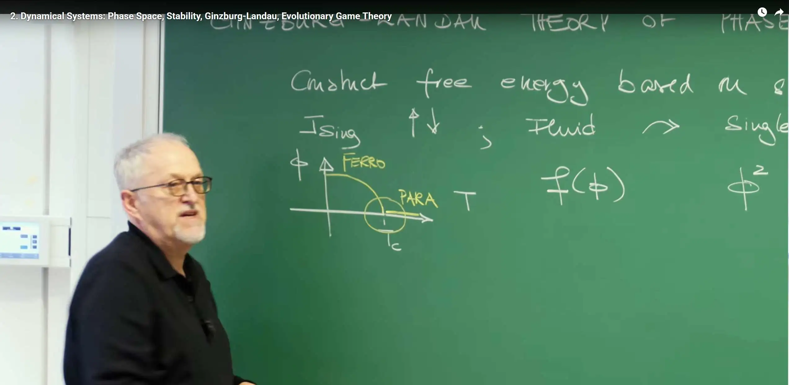
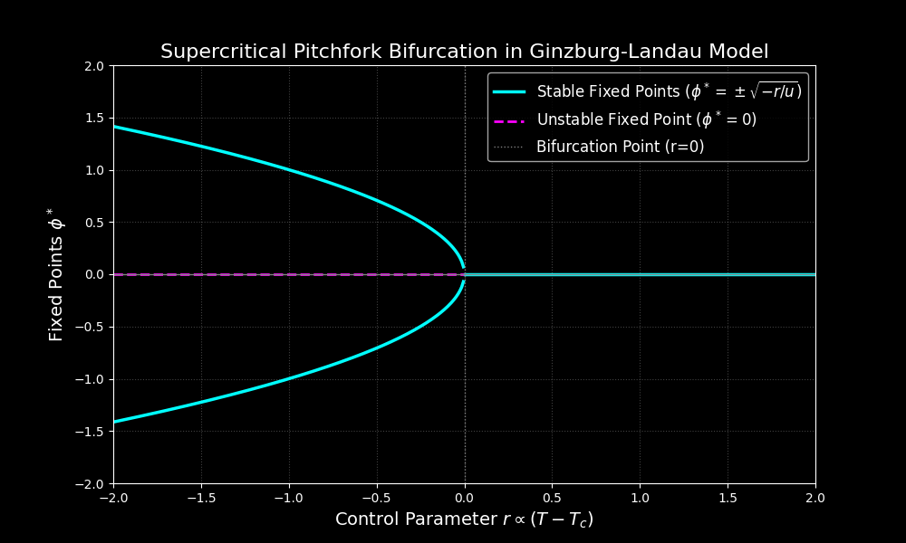
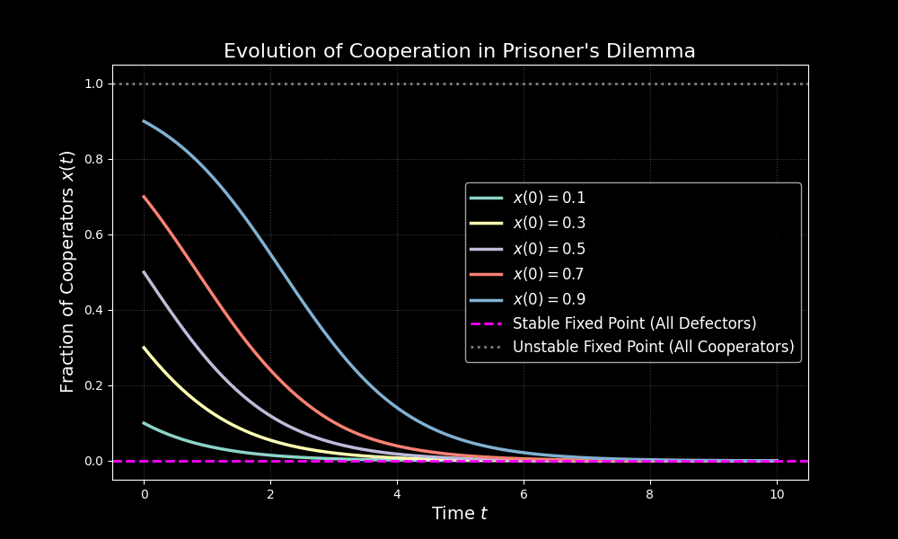

# Introduction

**Lecture 1** explored the core ideas of self-organization: **universality**—from the collective flight of bird flocks to the precise localization of proteins inside cells, the emergence of macroscopic ordered patterns seems to follow universal laws independent of microscopic details. Can we build a unified, predictive theoretical framework for these seemingly unrelated systems? To this end, the course unfolds in three theoretical parts:

1.Dynamical Systems Theory

2.Phase Transitions & Collective Phenomena

3.Pattern Formation & Self-Organization

Lecture 2 begins the introduction to the "Dynamical Systems" part. This part will introduce a mathematical language to describe how system states **evolve**, **change**, and **stabilize** over time. This lecture will demonstrate the power and universality of dynamical systems theory from two very different scientific fields:

1.**Phase transition theory from the physics perspective:** Using the **Ginzburg–Landau theory** as an example, it shows how to construct a phenomenological model describing the transition of matter from disorder to order, based solely on fundamental physical principles such as symmetry and observed phenomena.

2.**Strategy evolution from the biology perspective:** Using **evolutionary game theory** as an example, it shows how to use mathematical models to describe the dynamic competition and ultimate fate of different strategies (such as cooperation and defection) in biological populations.

Although the origins and applications of these two theories are vastly different, they both embody the essence of **phenomenological modeling**: by identifying key macroscopic degrees of freedom (order parameter $\phi$ or strategy frequency $x$) and establishing dynamical equations for them, we can bypass complex microscopic details and directly address the essence of collective behavior. Whether describing the phase transition of a magnet or the evolution of a population, the same mathematical structure lies behind them—**nonlinear ordinary differential equations (ODEs)**, along with common geometric concepts such as **phase space**, **attractors** (or fixed points), and **bifurcations**. These concepts also lay the foundation for subsequent lectures to delve into the stability of fixed points and specific types of bifurcations (such as saddle-node and pitchfork bifurcations).


# 1. Ginzburg–Landau Theory - A Physics of Order

This section introduces the first core theoretical framework—the Ginzburg–Landau theory. This is a classical theory in statistical physics for describing phase transitions and is also a paradigm of **phenomenological modeling**. It bypasses the microscopic details of the system and instead starts from macroscopic **symmetry** and observed phenomena, constructing an effective free energy function to describe and predict the transition of the system from disorder to order.

## 1.1 Order Parameter - Condensing Collective Behavior into a Single Variable

To describe the state of a macroscopic system, it is infeasible to track the motion of every microscopic component (such as atoms or molecules) inside it. Thus, a "coarse-graining" approach as mentioned in the introduction is needed. The core starting point of Ginzburg–Landau theory is to introduce a macroscopic variable called the **order parameter**, denoted as $\phi$.

The order parameter is a carefully chosen physical quantity that can quantify the overall degree of order of the system. Its definition has the following key characteristics:

* In the **disordered phase** of the system (usually at high temperature or high entropy states, such as the paramagnetic phase), the value of the order parameter is **zero**.

* In the **ordered phase** of the system (usually at low temperature or low entropy states, such as the ferromagnetic phase), the value of the order parameter is **non-zero**.

For example, in ferromagnetic materials, the order parameter can be the net magnetization $M$. In the paramagnetic phase (high temperature, $T > T_c$), the magnetic moments of individual atoms point in random directions, and the macroscopic net magnetization is zero; in the ferromagnetic phase (low temperature, $T < T_c$), the magnetic moments tend to align in the same direction, and the system exhibits non-zero net magnetization. Similarly, for the gas-liquid phase transition, the order parameter can be the difference between liquid and gas densities.



By introducing the order parameter $\phi$, a complex system with a huge number of microscopic degrees of freedom is reduced to a macroscopic entity described by a single variable, laying the foundation for constructing an energy model.

## 1.2 Constructing Free Energy - The Energy Landscape Determined by Symmetry

After determining the order parameter, the next step is to construct a function that describes the system's energy, namely the **free energy** $f(\phi)$. In thermodynamics, the stable equilibrium state of a system corresponds to the **minimum point** of the free energy. Thus, the function $f(\phi)$ can be imagined as an "energy landscape," and the system's state will spontaneously "roll toward" the lowest point of the landscape.

According to Landau's assumption, near the phase transition critical point, the value of the order parameter $\phi$ is small. Therefore, the free energy $f(\phi)$ can be (analytically) expanded as a Taylor series in $\phi$. The specific form of this expansion is strictly constrained by the **symmetry** of the system.

Taking the Ising model with "up/down" symmetry as an example, when there is no external magnetic field, flipping all spins ($\phi \rightarrow -\phi$) does not change the system's energy. This symmetry is reflected in the free energy function, meaning $f(\phi)$ must satisfy $f(\phi) = f(-\phi)$, i.e., the free energy must be an **even function** of $\phi$. This powerful symmetry constraint excludes all odd-power terms in the Taylor expansion (such as $\phi, \phi^3, \phi^5$, etc.), retaining only even-power terms.

Thus, for such systems, the most general form of the free energy function $f(\phi)$ (also denoted as $\mathcal{V}(\phi)$ in the blackboard notes) can be written as:

$$f(\phi) = \frac{1}{2} r \, \phi^2 + \frac{1}{4} u \, \phi^4 + \frac{1}{6} v \, \phi^6 + \dots$$


This is a truncated Taylor series; retaining terms up to $\phi^6$ is usually sufficient to describe most first-order and second-order phase transitions.

The constant term $f(0)$ is omitted because it only shifts the energy zero point and does not affect the shape of the energy landscape or the position of the minimum points.

The coefficients $\frac{1}{2}, \frac{1}{4}, \frac{1}{6}$ are historical conventions that make subsequent calculations of the dynamical equation (taking the derivative $\frac{\partial f}{\partial \phi}$) more concise.

This equation is the core of Ginzburg–Landau theory. It is not derived from first principles but is a **phenomenological model** constructed based on symmetry and analyticity assumptions. The coefficients $r, u, v$ are phenomenological parameters whose specific values need to be determined through experiments or more fundamental microscopic theories.

## 1.3 Physical Meaning and Regulatory Role of Phenomenological Parameters (r, u, v)

The parameters $r, u, v$ in the free energy function together determine the shape of the energy landscape, thus controlling the phase transition behavior of the system.

**$r$ (control parameter):** This parameter is the main driver of phase transitions, directly related to the system's "distance" from the critical point. In physics, it is usually linearly related to temperature $T$ and can be approximately written as $r \propto (T - T_c)$, where $T_c$ is the critical temperature. The sign of $r$ determines the basic shape of the energy landscape near the origin $\phi=0$:

When $r > 0$ ($T > T_c$), the $\phi^2$ term is positive, and near $\phi=0$, $f(\phi) \approx \frac{1}{2} r \phi^2$ is an upward-opening parabola. At this time, $\phi=0$ is the only minimum point of the free energy. This corresponds to the system's stable **disordered phase** (e.g., paramagnetic phase).

When $r < 0$ ($T < T_c$), the $\phi^2$ term is negative, and the origin $\phi=0$ changes from a minimum point to a local maximum point (becomes unstable). Two new symmetric minimum points appear on both sides of the energy landscape, located at $\phi_\pm = \pm \phi_0$. This corresponds to the system entering a stable **ordered phase** (e.g., ferromagnetic phase). The system must "choose" one of the minima ($+\phi_0$ or $-\phi_0$), a process called **spontaneous symmetry breaking**.


**$u$ and $v$ (stability parameters):** These two parameters determine the higher-order shape of the energy landscape (i.e., behavior far from $\phi=0$) and ensure that the energy has a lower bound (i.e., $f(\phi) \rightarrow \infty$ when $|\phi| \rightarrow \infty$), thus determining the type of phase transition:

When $u > 0$, the $\phi^4$ term ensures that the free energy is positive when $\phi$ is large, making the energy landscape bounded. In this case, when $r$ changes from positive to negative, the order parameter $\phi_0$ continuously changes from zero to a non-zero value, corresponding to a **second-order phase transition** or continuous phase transition.

When $u < 0$, the $\phi^4$ term alone would make the system unstable when $r<0$ (energy would go to negative infinity). At this time, a $\phi^6$ term with $v > 0$ must be introduced to ensure the energy has a lower bound. This complex energy landscape composed of $r, u, v$ leads to discontinuous jumps in the order parameter, corresponding to a **first-order phase transition** or discontinuous phase transition.

## 1.4 Python Simulation - Visualizing the Ginzburg–Landau Potential

The following code visualizes the behavior of the free energy potential function in Ginzburg–Landau theory as temperature changes. It shows the system states under two different temperature conditions: when the temperature is above the critical temperature ($T>T_c$), the system has only one global minimum, corresponding to the symmetric phase; when the temperature is below the critical temperature ($T<T_c$), the system exhibits two symmetric minimum points, indicating that the system has undergone symmetry breaking and entered the ordered phase. This visualization helps us understand the dynamical behavior and stability of the system during the phase transition process, and how the order parameter (here $\phi$) changes its equilibrium state as temperature varies.
```python
import numpy as np
import matplotlib.pyplot as plt

def ginzburg_landau_potential(phi, r, u):
    """
    Calculate the Ginzburg-Landau free energy potential (v=0).
    """
    return 0.5 * r * phi**2 + 0.25 * u * phi**4

# --- Use dark background as a base ---
plt.style.use('dark_background')

# --- Create a single figure and axes with default dark background ---
fig, ax = plt.subplots(figsize=(10, 8))

# --- Parameters ---
u = 1.0
phi_range = np.linspace(-2.5, 2.5, 400) # Focus on the central region

# --- Plot the T > Tc (r > 0) case (White Curve) ---
r_pos = 1.0
f_pos = ginzburg_landau_potential(phi_range, r_pos, u)
# Plot in white, mimicking the professor's drawing
ax.plot(phi_range, f_pos, lw=2, color='white', linestyle='--')
# Add text annotation
ax.text(0.8, 2.0, '$T > T_c$ ($r > 0$)', color='white', fontsize=16)


# --- Plot the T < Tc (r < 0) case (Yellow Curve) ---
r_neg = -1.0
f_neg = ginzburg_landau_potential(phi_range, r_neg, u)
# Plot the potential curve in yellow
ax.plot(phi_range, f_neg, lw=3, color='yellow')
# Add text annotation
ax.text(1.5, -0.5, '$T < T_c$ ($r < 0$)', color='yellow', fontsize=16)

# --- Calculate minima for T < Tc ---
minima_phi = np.sqrt(-r_neg / u)
minima_f = ginzburg_landau_potential(minima_phi, r_neg, u)

# --- Add text annotations like the blackboard ---
# Add "f" (for the y-axis)
ax.plot([0, 0], [minima_f - 0.5, 8.0], color='white', lw=1)
ax.arrow(0, 8.0, 0, 0.5, color='white', head_width=0.08, head_length=0.3)
ax.text(-0.25, 7.5, '$f$', color='white', fontsize=18)

# Add "phi" (for the x-axis)
ax.plot([-2.5, 2.5], [0, 0], color='white', lw=1)
ax.arrow(2.5, 0, 0.2, 0, color='white', head_width=0.1, head_length=0.1)
ax.text(2.6, -0.1, '$\phi$', color='white', fontsize=18)

# Add "phi_+" and "phi_-" for the T < Tc minima
ax.text(minima_phi + 0.1, minima_f + 0.3, '$\phi_+$', color='yellow', fontsize=18)
ax.text(-minima_phi - 0.5, minima_f + 0.3, '$\phi_-$', color='yellow', fontsize=18)
# Add small vertical ticks for the minima
ax.plot([minima_phi, minima_phi], [-0.1, 0.1], color='white', lw=1)
ax.plot([-minima_phi, -minima_phi], [-0.1, 0.1], color='white', lw=1)

# --- Add arrows (annotations) to show dynamics for T < Tc ---
arrow_props = dict(facecolor='white', edgecolor='none', arrowstyle='->', lw=2)
# Arrow from (phi > phi_+) downhill
ax.annotate('', xy=(minima_phi + 0.3, minima_f + 0.1), 
            xytext=(1.8, 1.0), 
            arrowprops=arrow_props)
# Arrow from (phi < -phi_+) downhill
ax.annotate('', xy=(-minima_phi - 0.3, minima_f + 0.1), 
            xytext=(-1.8, 1.0), 
            arrowprops=arrow_props)
# Arrow from (0 < phi < phi_+) downhill
ax.annotate('', xy=(0.3, minima_f), 
            xytext=(0.6, -0.1), 
            arrowprops=arrow_props)
# Arrow from (-phi_+ < phi < 0) downhill
ax.annotate('', xy=(-0.3, minima_f), 
            xytext=(-0.6, -0.1), 
            arrowprops=arrow_props)


# --- Clean up the plot ---
ax.grid(False) # Turn off grid
# Show axis tick labels
# ax.set_xticklabels([]) 
# ax.set_yticklabels([]) 

# Show axis spines
# ax.spines['top'].set_visible(False)
# ax.spines['right'].set_visible(False)
# ax.spines['bottom'].set_visible(False)
# ax.spines['left'].set_visible(False)
ax.spines['top'].set_visible(True)
ax.spines['right'].set_visible(True)
ax.spines['bottom'].set_visible(True)
ax.spines['left'].set_visible(True)

# Set axis labels
ax.set_xlabel('$\phi$', color='white', fontsize=14)
ax.set_ylabel('$f$', color='white', fontsize=14)

# Set plot limits
ax.set_xlim(-2.8, 2.8)
ax.set_ylim(min(f_neg) - 0.5, 9.0) # Adjust y-limit to show both curves

plt.title('Ginzburg-Landau Potential: $T > T_c$ vs $T < T_c$', color='yellow', fontsize=18)
plt.savefig('Ginzburg-Landauyon.png')
plt.show()
```


The core idea of phase transitions: **Phase transition is a topological deformation of the energy landscape**.

**White dashed line** represents the state at high temperature $T > T_c$ ($r > 0$). At this time, the free energy $f$ is a single-well potential, with its only energy minimum (stable state) at $\phi=0$, corresponding to the system's **disordered phase** (e.g., paramagnetic phase).

**Yellow solid line** represents the state at low temperature $T < T_c$ ($r < 0$). When the temperature drops below the critical point, the energy landscape undergoes a qualitative change: the stable point that was originally at $\phi=0$ "bulges" into an unstable local maximum, while two new, lower-energy ($f < 0$) minima $\phi_-$ and $\phi_+$ "depress" symmetrically on both sides. These two new well bottoms represent the two equivalent **ordered phases** (e.g., magnetization direction "up" or "down") formed after "spontaneous symmetry breaking" of the system; the system must choose one of them.

The entire phase transition process is visualized as the energy potential smoothly transforming from the white curve to the yellow curve, driven by the control parameter $r$ crossing the critical point $r=0$ (i.e., the bifurcation point).

# 2. Relaxation Dynamics - The Path to Equilibrium

Through Ginzburg–Landau theory, we have successfully reduced the phase transition problem to an analysis of an "energy landscape"—the free energy $f(\phi)$. This static landscape tells us all possible **equilibrium states** (i.e., extrema of $f(\phi)$) and their **relative stability** (i.e., minima of $f(\phi)$). However, this model does not answer a key question: if the system is not initially at the lowest point, **how** will it evolve over time? **How long** will it take to evolve to the lowest point?

The purpose of this section is to introduce **dynamics**, transforming the static energy landscape into a dynamic evolution process. We will derive an **equation of motion** for the order parameter $\phi(t)$ changing over time and prove that this equation indeed guides the system to "roll toward" the minimum of the free energy.

## 2.1 Minimum Free Energy Principle and Onsager's Hypothesis

For a **dissipative system** that exchanges energy with the environment (heat bath), a corollary of the second law of thermodynamics is that the system will spontaneously evolve toward states with lower free energy, eventually reaching the equilibrium state with minimum free energy.

So how do we transform this thermodynamic tendency into a specific mathematical equation? Onsager's theory provides a key phenomenological hypothesis. This hypothesis states that the rate of change of the system state ("flux") is proportional to the "thermodynamic force" pushing it toward equilibrium.

* **Thermodynamic Force:** In the Ginzburg–Landau energy landscape, the "force" driving the change of the order parameter $\phi$ can be defined as the **negative gradient** of the free energy landscape (i.e., the steepest downhill direction): $F_{thermo} = - \frac{\partial f}{\partial \phi}$.

* **Linear Response:** Onsager hypothesized that the rate of change $\partial_t \phi$ is proportional to this force: $\partial_t \phi \propto F_{thermo}$.

This hypothesis is the bridge connecting thermodynamics (static $f$) and dynamics (dynamic $\partial_t \phi$).

## 2.2 Dynamical Equation - $\partial_t \phi = -\Gamma \frac{\partial f}{\partial \phi}$

Based on Onsager's linear response hypothesis, we can write the simplest dynamical equation describing the evolution of the order parameter $\phi$ over time, known as **Model A** in critical dynamics, or pure relaxation dynamics:

$$\partial_t \phi(t) = -\Gamma \frac{\partial f}{\partial \phi}$$

Each term in this equation has a clear physical meaning:

* $\partial_t \phi(t)$: The rate of change of the order parameter over time.

* $\frac{\partial f}{\partial \phi}$: The **gradient** or slope of the free energy landscape. When the slope is zero (at the lowest or highest points of the landscape), the thermodynamic force is zero, $\partial_t \phi = 0$, and the dynamics stops. These points are therefore called **fixed points**.

* Negative sign "$-$": Ensures the direction of system evolution. If $\phi$ is located to the right of the energy minimum, then the slope $\frac{\partial f}{\partial \phi} > 0$, leading to $\partial_t \phi < 0$, and $\phi$ will decrease (move left); and vice versa. This ensures that the system always evolves along the **downhill direction** of the energy landscape.

* $\Gamma$: A positive **kinetic coefficient**, also called **mobility**. It describes the response speed of the system to thermodynamic forces and determines the **time scale** of the relaxation process. The larger $\Gamma$, the faster the system "rolls" toward equilibrium.

Substituting the free energy constructed in Section 1, $f(\phi) = \frac{1}{2} r \, \phi^2 + \frac{1}{4} u \, \phi^4 + \frac{1}{6} v \, \phi^6$, into the above equation and taking the derivative yields a specific **ordinary differential equation (ODE)**:

$$\partial_t \phi = -\Gamma \left(r\phi + u\phi^3 + v\phi^5 \right)$$

Here, the $\phi^5$ term comes from differentiating the $\frac{1}{6} v \phi^6$ term. Thus, the complex phase transition problem has been successfully reduced to a dynamical problem of solving this nonlinear ordinary differential equation.

## 2.3 Free Energy as a Lyapunov Function

We have constructed a dynamical equation that "appears" to always drive the system toward the energy minimum. But can we rigorously prove this mathematically? This is achieved by identifying the free energy $f$ as a **Lyapunov function**.

A Lyapunov function $V(x)$ is a powerful tool in dynamical systems theory for proving the stability of equilibrium points without directly solving the differential equation. For a function to be a Lyapunov function, it must satisfy two core conditions:

1.**Positive definiteness:** The function has a minimum at the equilibrium point (like the shape of a bowl).

2.**Negative definiteness of derivative:** Along the system's evolution trajectory, the time derivative of the function **never increases** ($\frac{dV}{dt} \le 0$).

Now let's check whether the Ginzburg–Landau free energy $f(\phi)$ satisfies the second condition. Its rate of change over time can be calculated using the chain rule:

$$\frac{df}{dt} = \frac{\partial f}{\partial \phi} \frac{d\phi}{dt}$$

Next, substituting the dynamical equation we derived $\frac{d\phi}{dt} = -\Gamma \frac{\partial f}{\partial \phi}$ into the above:

$$\frac{df}{dt} = \frac{\partial f}{\partial \phi} \left( -\Gamma \frac{\partial f}{\partial \phi} \right) = -\Gamma \left( \frac{\partial f}{\partial \phi} \right)^2$$


* The kinetic coefficient $\Gamma$ is a positive number ($\Gamma > 0$).

* The squared term $\left( \frac{\partial f}{\partial \phi} \right)^2$ is always **non-negative** ($\ge 0$).

Therefore, we can conclude:

$$\frac{df}{dt} = - (\text{positive}) \times (\text{non-negative}) \le 0$$

This rigorously proves that the free energy $f$ **never increases** during the relaxation dynamics. The system state point never "climbs uphill"—it only stays in place or moves to lower energy levels, i.e., "**downhill on the free energy landscape**."

**When** does the dynamical process stop? If and only if $\frac{df}{dt} = 0$. This requires $\frac{\partial f}{\partial \phi} = 0$, which is precisely the static equilibrium point (fixed point) defined in Section 1. This proof rigorously connects the static analysis of Section 1 (finding minima of $f$) with the dynamical analysis of Section 2 (time evolution of $\phi$).

# 3. Phase Transition as Bifurcation

In the first two sections, we established the static and dynamic pictures of Ginzburg–Landau theory. Section 1 showed that the system's **static equilibrium states** are determined by the **energy landscape** of the free energy $f(\phi)$. Section 2 added **dynamics**, i.e., $\partial_t \phi = -\Gamma \frac{\partial f}{\partial \phi}$, showing **how** the system evolves to reach these equilibrium states.

This section connects these two concepts, revealing a profound equivalence: the **phase transition** in physics is mathematically exactly a phenomenon called **bifurcation**. We will see that the topological deformation of the energy landscape (Section 1) and the qualitative change of dynamical fixed points (Section 2) are two expressions of the same story.

## 3.1 Bifurcation in Dynamical Systems

In dynamical systems theory, **bifurcation** refers to the phenomenon where the system behavior undergoes **qualitative change** when a **control parameter** of the system (such as $r$ in Ginzburg–Landau theory) varies smoothly and passes through a critical value. Here, "qualitative change" does not refer to small numerical changes, but rather fundamental changes in the **number** or **stability** of the system's **fixed points** (or equilibrium points).

## 3.2 Pitchfork Bifurcation in Ginzburg–Landau Theory

The Ginzburg–Landau dynamics (second-order phase transition model) is a classical example of a **supercritical pitchfork bifurcation**.

First, find the system's fixed points $\phi^*$. A fixed point is a point where the system state no longer changes over time, i.e., $\frac{d\phi}{dt} = 0$. According to the dynamical equation in Section 2 (for simplicity, set $v=0$):

$$\partial_t \phi = -\Gamma \left(r\phi + u\phi^3 \right)$$

Setting $\partial_t \phi = 0$, since $\Gamma > 0$, we only need to solve:

$$r\phi + u\phi^3 = 0 \quad \implies \quad \phi(r + u\phi^2) = 0$$

Now, let's analyze how the fixed points $\phi^*$ change with the control parameter $r$ (assuming $u>0$):

**When $r > 0$ ($T > T_c$):**
  * Since $u > 0$ and $\phi^2 \ge 0$, the term $r + u\phi^2$ is always positive.
  
  * Therefore, the only real solution to the equation $\phi(r + u\phi^2) = 0$ is $\phi^* = 0$.
  
  * **Stability:** This fixed point is **stable**. From the energy landscape perspective, it is the only minimum of the free energy (single well). This corresponds to the physical **disordered phase**.


**When $r < 0$ ($T < T_c$):**
  * Now the equation becomes $\phi(r + u\phi^2) = 0$, which has **three** real solutions:
  
      1. $\phi_0^* = 0$
        
      2. $r + u\phi^2 = 0 \implies \phi^2 = -r/u \implies \phi_\pm^* = \pm\sqrt{-r/u}$

**Stability:**
  * The original fixed point $\phi_0^* = 0$ now becomes **unstable** (it becomes a local maximum in the energy landscape).
    
  * The two newly appearing fixed points $\phi_\pm^*$ are **stable** (they are the two new minima in the energy landscape).
  
  * This corresponds to the physical **ordered phase**, where the system undergoes "spontaneous symmetry breaking" and must choose one of the two equivalent stable states $\phi_+$ or $\phi_-$.

**Correspondence between Physics and Mathematics:**
This process clearly shows that the physical **second-order phase transition**—the system transitioning from a unique stable state (disordered phase) to two new stable states (ordered phase)—is mathematically exactly a **pitchfork bifurcation**: a stable fixed point becomes unstable at $r=0$ while "forking" into two new stable fixed points and one unstable fixed point.

## 3.3 Python Simulation - Drawing the Bifurcation Diagram

The behavior of the pitchfork bifurcation can be intuitively displayed through a bifurcation diagram. This diagram depicts how the position of the system's fixed points $\phi^*$ (vertical axis) changes with the control parameter $r$ (horizontal axis).

```python
import numpy as np
import matplotlib.pyplot as plt

# --- Set dark background style ---
plt.style.use('dark_background')

# Define parameters
r_range = np.linspace(-2, 2, 400)
u = 1.0

# --- Calculate fixed points ---

# 1. For r < 0 (Ordered Phase)
r_neg = r_range[r_range < 0]
# The two new stable branches
phi_stable_pos = np.sqrt(-r_neg / u)
phi_stable_neg = -np.sqrt(-r_neg / u)
# The phi=0 branch becomes unstable
phi_unstable_zero = np.zeros_like(r_neg)

# 2. For r >= 0 (Disordered Phase)
r_pos = r_range[r_range >= 0]
# The phi=0 branch is stable
phi_stable_zero = np.zeros_like(r_pos)


# --- Create the plot ---
plt.figure(figsize=(10, 6))

# --- Plot the branches with visible colors ---

# Plot stable fixed points (solid bright lines)
plt.plot(r_neg, phi_stable_pos, 'cyan', lw=2.5, label='Stable Fixed Points ($\phi^* = \pm\sqrt{-r/u}$)')
plt.plot(r_neg, phi_stable_neg, 'cyan', lw=2.5)
plt.plot(r_pos, phi_stable_zero, 'cyan', lw=2.5)

# Plot unstable fixed point (dashed bright line)
plt.plot(r_neg, phi_unstable_zero, 'magenta', linestyle='--', lw=2, label='Unstable Fixed Point ($\phi^* = 0$)')

# --- Style the plot ---
plt.title('Supercritical Pitchfork Bifurcation in Ginzburg-Landau Model', fontsize=16)
plt.xlabel('Control Parameter $r \propto (T - T_c)$', fontsize=14)
plt.ylabel('Fixed Points $\phi^*$', fontsize=14)

# Add reference lines
plt.axhline(0, color='gray', linestyle='-', lw=1)
plt.axvline(0, color='gray', linestyle=':', lw=1, label='Bifurcation Point (r=0)')

plt.grid(True, linestyle=':', alpha=0.5, color='gray')
plt.legend(fontsize=12)
plt.ylim(-2, 2)
plt.xlim(-2, 2)
plt.show()
````



Pitchfork bifurcation diagram of the Ginzburg–Landau model. The horizontal axis is the control parameter $r$, and the vertical axis is the position of the fixed points $\phi^*$. **Cyan solid lines** represent stable fixed points, and the **magenta dashed line** represents the unstable fixed point. When $r$ changes from positive to negative, the system undergoes bifurcation at $r=0$: the originally unique stable point $\phi^*=0$ becomes unstable, and two new stable branches emerge.

# 4. Evolutionary Game Theory - A Biology of Strategies

After introducing Ginzburg–Landau theory from physics, the course turns to a completely new field from biology and economics—**evolutionary game theory**. This move aims to demonstrate the **universality** of dynamical systems ideas.

This analogy is profound:
* In **Ginzburg–Landau theory**, there is a "potential function"—the **free energy $f(\phi)$**. The system's dynamics $\partial_t \phi = -\Gamma \frac{\partial f}{\partial \phi}$ drives the order parameter $\phi$ to evolve to the **minimum** of $f(\phi)$.

* In **evolutionary game theory**, there is also a key function—the **fitness $f(x)$**. The system's dynamics (the "replicator equation" to be introduced in the next section) will drive the strategy proportion $x$ to evolve to the **maximum** of $f(x)$.

Both are nonlinear dynamical problems determined by a "potential function," and both are centrally concerned with how the state variable ($\phi$ or $x$) evolves over time and reaches stable fixed points.

## 4.1 From Classical Games to Evolutionary Games - Nash vs. Maynard Smith

The course first distinguishes between two paradigms of game theory, which are based on fundamentally different assumptions:


* **Classical Game Theory:** Represented by the work of John von Neumann, Oskar Morgenstern, and John Nash. Its core assumption is that participants are **fully rational**. They understand all the rules of the game and all possible payoffs for all participants, and on this basis, they engage in logical reasoning to make optimal decisions that maximize their own interests. Its core concept is the **Nash equilibrium**, as Nash defined: "Equilibrium is reached when no party can increase its payoff by unilaterally changing its strategy." This is a **static, rationality-based** equilibrium concept.

* **Evolutionary Game Theory:** Represented by the work of John Maynard Smith and George R. Price. It abandons the assumption of full rationality and instead considers a **population** composed of a large number of individuals. Individuals do not engage in logical reasoning but simply follow a preset behavioral strategy (like genetic encoding). Individuals randomly encounter each other and play "games," and their payoffs directly translate into **fitness**, i.e., their reproductive success rate. Successful strategies (high fitness) will spread through "replication" in the population, while unsuccessful strategies are eliminated.

Its core concept is the **Evolutionarily Stable Strategy (ESS)**, i.e., "A strategy is called evolutionarily stable if, when the population's individuals uniformly adopt this strategy, it has the ability to defeat and eliminate any small amount of mutant strategies introduced into the population." ESS is a **dynamic, selection-and-replication-based** stability concept. For this course, evolutionary game theory's perspective based on populations and dynamics makes it an ideal framework for studying self-organization phenomena.

## 4.2 Defining the Game - Cooperators vs. Defectors


To concretely illustrate evolutionary game theory, the course adopts a classic model: the **Prisoner's Dilemma**. In this model, the population consists of individuals with two strategies: **Cooperators (C)** and **Defectors (D)**.

The game rules are defined by two parameters:

**Benefit $b$:** The value created for the opponent by cooperative behavior.

**Cost $c$:** The cost paid by the cooperator to create value.

Assume the population is very large (theoretically infinite), and individuals encounter each other randomly. Let the proportion of cooperators (C) in the population be $x$ ($0 \le x \le 1$), then the proportion of defectors (D) is $(1-x)$.

At this time, any individual (whether C or D) has probability $x$ of encountering a cooperator (C) and probability $(1-x)$ of encountering a defector (D) in the next game. Based on this, we can calculate the **expected fitness** $f$ of both strategies:

**Expected fitness of cooperators $f_{coop}$:**

The expected payoff of a cooperator (C) is:

$f_{coop} = (\text{probability of meeting C}) \times (\text{payoff against C}) + (\text{probability of meeting D}) \times (\text{payoff against D})$

According to the rules, C's payoff against C is $b-c$ (receives benefit, pays cost), and C's payoff against D is $-c$ (pays cost, no benefit).

$$f_{coop} = x \cdot (b-c) + (1-x) \cdot (-c)$$

Simplifying:

$$f_{coop} = (b-c)x - c(1-x)$$


**Expected fitness of defectors $f_{def}$:**

The expected payoff of a defector (D) is:

$f_{def} = (\text{probability of meeting C}) \times (\text{payoff against C}) + (\text{probability of meeting D}) \times (\text{payoff against D})$

According to the rules, D's payoff against C is $b$ (receives benefit, no cost), and D's payoff against D is $0$ (no benefit, no cost).

$$f_{def} = x \cdot (b) + (1-x) \cdot (0)$$
   
Simplifying:

$$f_{def} = bx$$

**Physical/Biological Interpretation:**

The key here is that $f_{coop}$ and $f_{def}$ are **not** fixed constants; they both depend on the **current population state $x$**. This means the system's "energy landscape" (fitness landscape) is itself **dynamically changing**. When cooperators increase in the population ($x$ increases), the fitness of both strategies changes accordingly. This is a **nonlinear feedback** and the source of dynamical complexity.

For clearer presentation, this game can be organized into the standard **payoff matrix** form, as shown in the slide. The table below shows the payoff received by the "row" player (focal player) when facing the "column" player (opponent).

**Table 1: Payoff Matrix of the Prisoner's Dilemma**

| | Opponent is Cooperator (C) | Opponent is Defector (D) |
|:---|:---:|:---:|
| **Player is Cooperator (C)** | $b - c$ | $-c$ |
| **Player is Defector (D)** | $b$ | $0$ |


**Connection to Classical Game Theory:**

In classical game theory, the four payoff values in this matrix are usually denoted by symbols:

$R = b-c$ (Reward: mutual cooperation reward)

$S = -c$ (Sucker: the "sucker" payoff when a cooperator is betrayed)

$T = b$ (Temptation: temptation to betray a cooperator)

$P = 0$ (Punishment: mutual defection punishment)

A game constitutes a true **Prisoner's Dilemma** when the payoff ordering satisfies $T > R > P > S$. In our model, if we assume benefit $b$ is greater than cost $c$ ($b>c>0$), then $b > b-c > 0 > -c$, and this condition is **satisfied**. This shows that for a single, rational player, regardless of what the opponent does, choosing "defection" is always the optimal strategy ($T>R$ and $P>S$), leading both parties to ultimately fall into the Nash equilibrium of $P=0$, rather than the collectively optimal solution of $R=b-c$.


# 5. Replicator Equation - The Dynamics of Selection

In Section 4, we established the "static" description for evolutionary game theory, i.e., defined the **expected fitness $f_{coop}(x)$ and $f_{def}(x)$** of different strategies (cooperators C vs. defectors D) for a given population state $x$. This is similar to the free energy $f(\phi)$ in Ginzburg–Landau theory, which defines a "landscape" for the system.

Now we need to introduce **dynamics**, i.e., an equation of motion describing how the strategy frequency $x(t)$ evolves over time. This equation is called the **replicator equation** in evolutionary game theory, and it plays exactly the same role as $\partial_t \phi = -\Gamma \frac{\partial f}{\partial \phi}$ in physics: it provides the "force" and "rules" for the system's evolution.

## 5.1 Derivation of the Replicator Equation

The basic idea of the replicator equation is very intuitive: **The growth rate of a strategy's proportion in the population is proportional to the difference between that strategy's fitness and the average fitness of the entire population.** In other words, strategies that are more "fit" than average will expand, and vice versa.

Below is the detailed derivation of this equation:

1.**Basic Principle:** Assume that the growth rate of any subpopulation (e.g., cooperators) is proportional to its fitness. Let the number of cooperators be $N_c(t)$ and the total population be $N(t)$, then:

$\frac{dN_c}{dt} = f_{coop} \cdot N_c$

Similarly, the growth rate of defector number $N_d$ is $\frac{dN_d}{dt} = f_{def} \cdot N_d$.

2.**Define Average Fitness $\bar{f}$:** The average fitness of the entire population is the weighted average of the fitness of each strategy, weighted by its proportion in the population.

$$\bar{f} = x \cdot f_{coop} + (1-x) \cdot f_{def}$$

Therefore, the growth rate of the total population is $\frac{dN}{dt} = \bar{f} \cdot N$.

3.**Calculate the Rate of Change of Proportion:** The core variable we care about is how the **proportion** $x = \frac{N_c}{N}$ of cooperators changes over time. Using the quotient rule for derivatives:

$$\frac{dx}{dt} = \frac{d}{dt}\left(\frac{N_c}{N}\right) = \frac{\frac{dN_c}{dt}N - N_c\frac{dN}{dt}}{N^2}$$

4.**Substitute Growth Rates:** Substitute the growth rate expressions from steps 1 and 2 into the above:

$$\frac{dx}{dt} = \frac{(f_{coop} N_c)N - N_c(\bar{f} N)}{N^2} = \frac{f_{coop} N_c}{N} - \frac{N_c \bar{f}}{N}$$

5.**Simplify to Basic Form:** Since $x = \frac{N_c}{N}$, the above simplifies to the **basic form** of the replicator equation:

$$\dot{x} = x(f_{coop} - \bar{f})$$


**Physical/Biological Interpretation:** This form best captures the essence of "selection." $f_{coop} - \bar{f}$ is the "relative fitness advantage" of the cooperation strategy. Only when a strategy is better than average ($f_{coop} > \bar{f}$) will its proportion $x$ increase ($\dot{x} > 0$).

6.**Derive the Practical Form:** In two-strategy games, we can derive further. Substituting average fitness $\bar{f} = x \cdot f_{coop} + (1-x) \cdot f_{def}$ into the basic form:

$$\dot{x} = x(f_{coop} - [x \cdot f_{coop} + (1-x) \cdot f_{def}])$$

$$\dot{x} = x(f_{coop}(1-x) - f_{def}(1-x))$$

Finally, we obtain the **practical form** more commonly used in two-strategy games:

$$\dot{x} = x(1-x)(f_{coop} - f_{def})$$

This form is equally intuitive: the change in cooperator proportion $x$ depends on the direct competition between the two strategies' fitness, $f_{coop} - f_{def}$.

## 5.2 Dynamical Analysis - Fixed Points and Stability

The replicator equation is a nonlinear ordinary differential equation, and its long-term behavior is determined by its fixed points and their stability. Fixed points are points where $\dot{x}=0$, meaning the strategy frequency no longer changes.

From the practical form $\dot{x} = x(1-x)(f_{coop} - f_{def})$, we can see that fixed points exist in three situations:

1.**$x^*=0$**: No cooperators in the population, all are defectors. This is a **boundary fixed point**.

2.**$x^*=1$**: No defectors in the population, all are cooperators. This is another **boundary fixed point**.

3.**$f_{coop} = f_{def}$**: Cooperators and defectors have equal fitness, and there may exist an **interior fixed point** with $0 < x^* < 1$.

Now let's analyze the specific case of the **Prisoner's Dilemma** ($b>c>0$). In the previous section, we calculated the fitness of both strategies:

$$f_{coop} = (b-c)x - c(1-x)$$

$$f_{def} = bx$$

Calculate their difference:
$$f_{coop} - f_{def} = [(b-c)x - c(1-x)] - [bx] = bx - cx - c + cx - bx = -c$$

Since cost $c>0$, we obtain a very strong conclusion: $f_{coop} - f_{def} = -c < 0$.

**Physical/Biological Interpretation:** This means that in the Prisoner's Dilemma, **regardless of the current population state $x$, the defector's fitness is always strictly higher than the cooperator's**.

Substituting this result into the replicator equation:

$$\dot{x} = x(1-x)(-c) = -c \cdot x(1-x)$$

For any mixed population (i.e., $x \in (0, 1)$), both $x$ and $(1-x)$ are positive, so $\dot{x}$ is **always negative**.

This means the proportion of cooperators will **continuously decrease**, and the evolutionary "flow" always points from $x=1$ toward $x=0$.

Therefore, the fixed point $x^*=1$ (all cooperation) is **unstable**; any small invasion of defectors will cause cooperation to collapse.

The fixed point $x^*=0$ (all defection) is **the only stable** one, and the system will eventually evolve to this state.

The ultimate result of evolution is the **extinction of cooperation**, which is the mathematical embodiment of the "tragedy of the commons."

## 5.3 Python Simulation - The Fate of Cooperation

The following Python code dynamically demonstrates the extinction of the cooperation strategy in the Prisoner's Dilemma by numerically solving the replicator equation.

```python
import numpy as np
from scipy.integrate import solve_ivp
import matplotlib.pyplot as plt

def replicator_equation(t, x, b, c):
    """
    Replicator equation for the Prisoner's Dilemma.
    
    Parameters:
    t (float): Time (required by scipy.integrate).
    x (list): A list containing the fraction of cooperators, e.g., [0.5].
    b (float): Benefit from cooperation.
    c (float): Cost of cooperation.
    
    Returns:
    list: A list containing the rate of change of the cooperator fraction, [dx/dt].
    """
    x_val = x[0]
    if not (0 <= x_val <= 1):
        return [0]
    
    # Calculate fitnesses as derived in the notes
    f_coop = (b - c) * x_val - c * (1 - x_val)
    f_def = b * x_val
    
    # Replicator equation in the form: dx/dt = x * (1 - x) * (f_coop - f_def)
    dxdt = x_val * (1 - x_val) * (f_coop - f_def)
    
    return [dxdt]

# --- Set dark background style ---
plt.style.use('dark_background')

# Set game parameters (Prisoner's Dilemma condition: b > c > 0)
b = 3.0  # Benefit
c = 1.0  # Cost

# Set simulation parameters
t_span = [0, 10]
initial_conditions = [0.1, 0.3, 0.5, 0.7, 0.9]

# Create the plot
plt.figure(figsize=(10, 6))

# Solve and plot for each initial condition
for x0 in initial_conditions:
    sol = solve_ivp(
        replicator_equation, 
        t_span, 
        [x0], 
        args=(b, c), 
        dense_output=True,
        t_eval=np.linspace(t_span[0], t_span[1], 200)
    )
    plt.plot(sol.t, sol.y[0], lw=2.5, label=f'$x(0) = {x0}$')

# --- Style the plot for dark theme ---
plt.title("Evolution of Cooperation in Prisoner's Dilemma", fontsize=16)
plt.xlabel('Time $t$', fontsize=14)
plt.ylabel('Fraction of Cooperators $x(t)$', fontsize=14)

# Highlight the fixed points
plt.axhline(0, color='magenta', linestyle='--', lw=2, label='Stable Fixed Point (All Defectors)')
plt.axhline(1, color='gray', linestyle=':', lw=2, label='Unstable Fixed Point (All Cooperators)')

plt.grid(True, linestyle=':', alpha=0.5, color='gray')
plt.legend(fontsize=12)
plt.ylim(-0.05, 1.05)
plt.show()

````



Time evolution of the cooperator proportion $x(t)$ in the Prisoner's Dilemma. Regardless of how high the initial proportion of cooperators is, the ultimate result of evolution is the complete elimination of cooperators, with the population trending toward the only stable fixed point $x=0$ (all defection).


# 6. A Unified Language - Phase Space and Flow

In the preceding sections, we explored in depth two seemingly very different models:

1.**Physics (Ginzburg–Landau):** The evolution of the order parameter $\phi$ is determined by a potential function (free energy $f$), with dynamics $\partial_t \phi = -\Gamma \frac{\partial f}{\partial \phi}$.

2.**Biology (Evolutionary Games):** The evolution of the strategy proportion $x$ is determined by a potential function (fitness $\bar{f}$), with dynamics $\dot{x} = x(f_{coop} - \bar{f})$.

Although they differ in origin and physical meaning, mathematically they are **completely equivalent**: both are **nonlinear ordinary differential equations (ODEs)** defined by a few **dynamical variables** ($\phi$ or $x$) and several **control parameters** ($r$ or $b, c$).

The purpose of this section is to abstract this common mathematical structure and return to the universal language of dynamical systems theory. This language not only unifies the two models of this lecture but also provides the necessary foundation for more complex phenomena (such as oscillations, chaos, and spatiotemporal patterns) in subsequent lectures.

## 6.1 Universal Form of Dynamics - $\partial_t u_i = f_i(\{u_j\}, \{\mu_\ell\})$

Whether it is the Ginzburg–Landau equation or the replicator equation, they can both be written in a universal mathematical form:

$$\partial_t u_i = f_i(\{u_j\}, \{\mu_\ell\})$$

This system of equations is the universal language for describing deterministic dynamical systems:

**$u_i$ ($i=1, \dots, S$)**: The **state variables** describing the system state. $S$ is the degrees of freedom (or dimension) of the system.

- In the Ginzburg–Landau model: $S=1$, the dynamical variable is $u_1 = \phi$.

- In the Prisoner's Dilemma model: $S=1$, the dynamical variable is $u_1 = x$.

- In the predator-prey model (mentioned in the course): $S=2$, the dynamical variables are $u_1 = \text{prey population}, u_2 = \text{predator population}$.


**$f_i$**: A set of (usually **nonlinear**) functions that define the "rules" or "force field" of system evolution.

- In the Ginzburg–Landau model: $f_1(u_1; \{\mu\}) = -\Gamma (r u_1 + u u_1^3 + v u_1^5)$.

- In the Prisoner's Dilemma model: $f_1(u_1; \{\mu\}) = u_1(1-u_1)(f_{coop}(u_1) - f_{def}(u_1))$.

**$\mu_\ell$ ($\ell=1, \dots, P$)**: The **control parameters** of the system. These are "knobs" we can adjust from outside; changing them changes the system's behavior.

- In the Ginzburg–Landau model: $\{\mu_\ell\} = \{r, u, v, \Gamma\}$.

- In the Prisoner's Dilemma model: $\{\mu_\ell\} = \{b, c\}$.

## 6.2 Geometric Perspective - Phase Space, Trajectories, and Vector Fields


Dynamical systems theory provides a powerful **geometric perspective** for understanding such equations, transforming a (possibly difficult to solve) calculus problem into a (possibly more intuitive) geometric problem.

**Phase Space:** This is an $S$-dimensional abstract space, where each coordinate axis corresponds to a dynamical variable $u_i$. A **point** in phase space represents the **complete state** of the system at a given moment.

- Our two models: Since $S=1$, the phase space is just a **one-dimensional line** (the $\phi$ axis or $x$ axis).

- Predator-prey model: Since $S=2$, the phase space is a **two-dimensional plane**.

**Trajectory:** As time passes, the system state point $u(t)$ moves through phase space, tracing out a curve called the system's trajectory. For a deterministic system, given an initial point, its future trajectory is **unique** (trajectories cannot cross each other).

**Flow / Vector Field:** The functions $f_i$ define a vector $\mathbf{f} = (f_1, f_2, \dots, f_S)$ at every point in phase space. This vector indicates the instantaneous direction and speed of motion of the state point at that location. The entire phase space is filled with such vectors, forming a vector field or "flow."

**Physical meaning:** The system's trajectory is the integral curve that is everywhere tangent to this vector field. The evolution process is "floating in the direction of the flow." In our G-L model, the "flow" defined by $\partial_t \phi = -\Gamma \frac{\partial f}{\partial \phi}$ is precisely the "force" driving the system to "roll down" the energy landscape.

## 6.3 Attractors in Dissipative Systems - The System's Final Destination

For the **dissipative systems** that this course focuses on (such as physical systems in contact with a heat bath or biological systems with selection pressure), volume elements in phase space **shrink** over time.

This means the system will "forget" its precise initial conditions. Regardless of how large a range of initial states the system starts from, their trajectories will eventually converge to a lower-dimensional subset in phase space. This subset is called an **attractor**.

An attractor is the geometric embodiment of the system's long-term behavior, determining the system's **final fate** and **observable steady-state behavior**. There are many types of attractors:

**Fixed Point:** A zero-dimensional attractor. The system eventually rests at an equilibrium state.

- In the Ginzburg–Landau model ($r<0$): The attractors are the two stable fixed points $\phi_\pm^*$.

- In the Prisoner's Dilemma model: The attractor is the single stable fixed point $x^*=0$.

**Limit Cycle:** A one-dimensional attractor. The system eventually enters a stable periodic oscillation (to be explored in subsequent lectures).

**Strange Attractor:** An attractor with fractal structure. The system exhibits chaotic behavior; trajectories never repeat but are confined to a finite region.


The core goal of dynamical systems theory is to geometrically classify the "flows" in different systems, understand the structure of their **attractors** (fixed points, limit cycles, etc.), and study how these structures change with **control parameters** ($\mu_\ell$). Such qualitative changes in attractor structure are precisely the **bifurcations** we encountered earlier. This paves the way for the next lecture's topic—how to systematically analyze the stability of fixed points and classify phenomena such as pitchfork bifurcations.


# Summary

This lecture introduced the core tools of dynamical systems for understanding self-organization phenomena through two seemingly unrelated examples—the **Ginzburg–Landau theory** from physics and **evolutionary game theory** from biology. The lecture revealed a common thread: complex macroscopic collective behavior can be described by low-dimensional nonlinear ordinary differential equations (ODEs) involving only a few key variables.

Whether describing the **free energy** of phase transitions or the **fitness** of strategy evolution, they both play the role of some form of "potential function." The system's dynamics, whether physical **relaxation** ($\partial_t \phi = -\Gamma \frac{\partial f}{\partial \phi}$) or biological **selection** ($\dot{x} = x(f - \bar{f})$), drives the system toward the "extrema" of these potential functions. When external conditions (control parameters $r$ or $b, c$) change, the structure of these stable states undergoes fundamental changes, i.e., **bifurcations**.

Ultimately, all these specific dynamical processes can be abstracted as **geometric flows** in **phase space**. The system's long-term behavior is determined by the structure of **attractors**.

This lecture started from the geometric intuition of "potential functions" and "saw" how the fixed point ($\phi^*=0$) becomes unstable. But this is not rigorous enough. A key question remains: **Are there universal mathematical tools that can analyze the stability of any fixed point without relying on "potential functions"?**

The next lecture will learn how to systematically determine whether a fixed point is stable or unstable through **linear stability analysis**. More importantly, we will learn how to classify the phenomenon of **bifurcation** itself, revealing its universal mathematical structure, such as the **pitchfork bifurcation** seen in this lecture and the **saddle-node bifurcation** to be learned. Mastering these tools for analyzing fixed points and bifurcations is the cornerstone for understanding more complex dynamics (such as oscillations and chaos).
