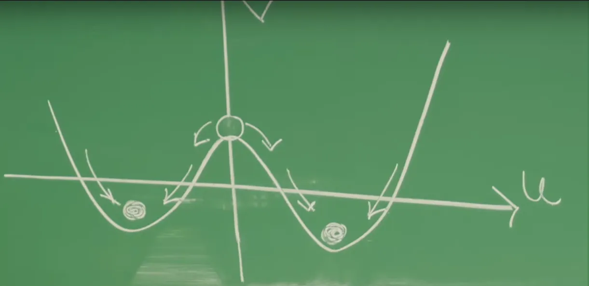
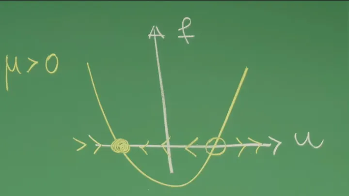
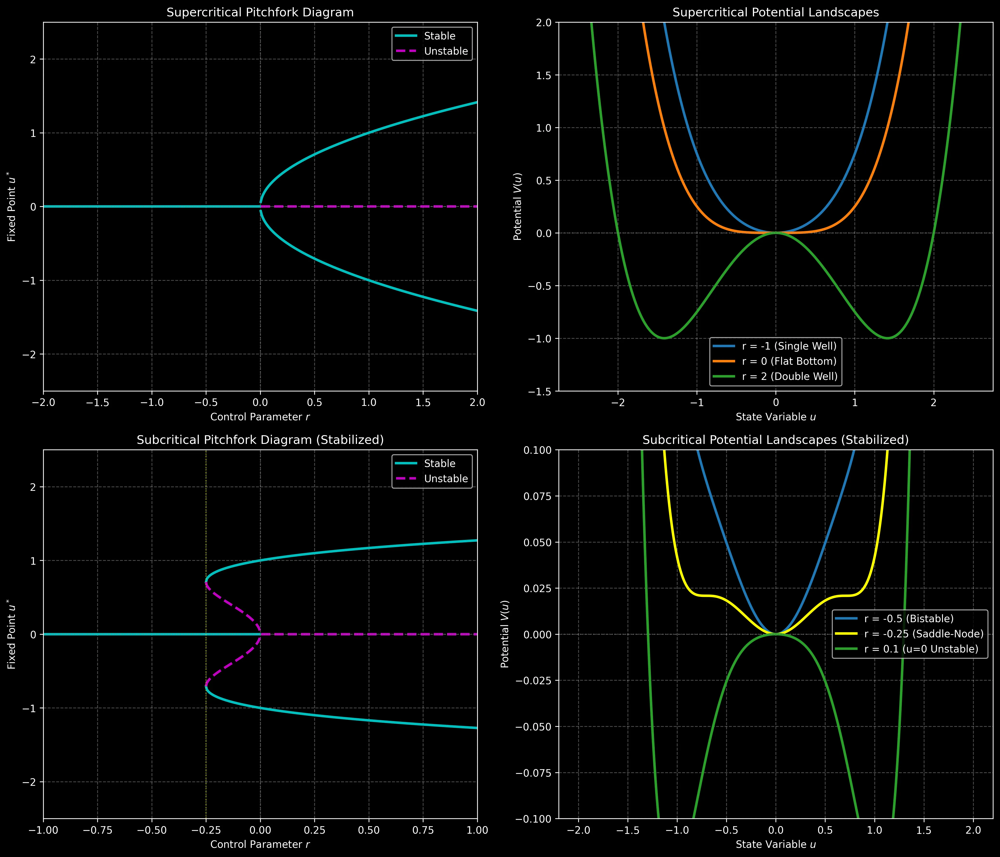
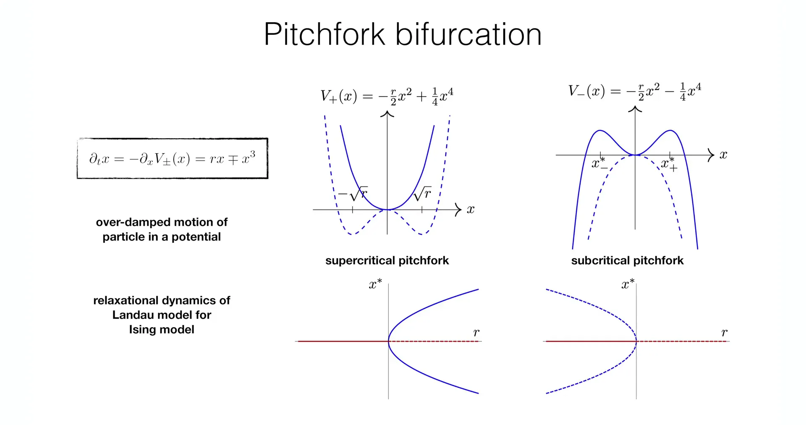
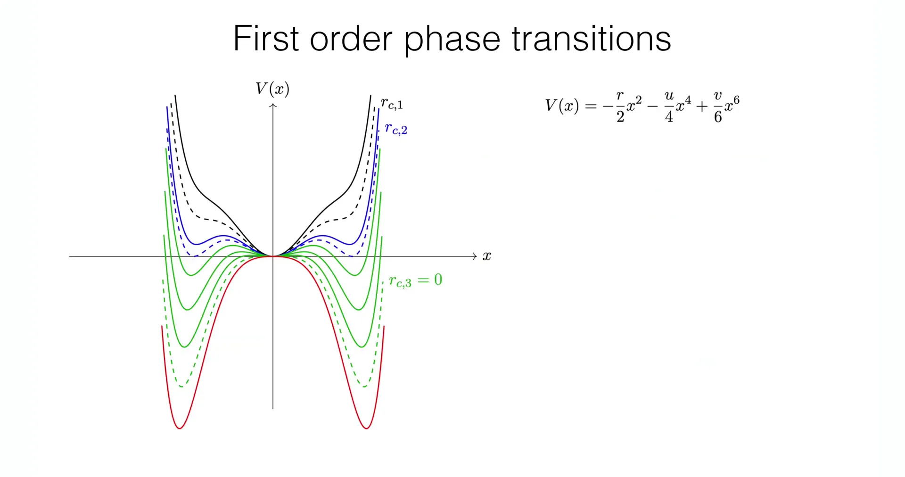

# Introduction

The previous lecture explored how dynamical systems provide a universal framework for describing the evolution of systems over time. Through the example of Ginzburg–Landau theory, we can recognize that the evolution of system states can be intuitively understood as a process of finding the lowest energy point along the "steepest descent" direction in a "potential landscape" $V(u)$. This over-damped motion perspective of $\frac{du}{dt} = -\frac{\partial V}{\partial u}$ is crucial for understanding collective phenomena such as phase transitions—the system's final destination (i.e., the minimum of the potential) represents the equilibrium state of the system.

This lecture will delve into the core of dynamical systems, focusing on the basic elements that form the backbone of system behavior: **fixed points** $u^*$. Fixed points are mathematically defined as the zeros of the evolution function $f(u, \mu)$, i.e., $f(u^*) = 0$, where the system's time derivative $\frac{du}{dt} = 0$ and the system state no longer changes with time. These points are precisely the system's equilibrium states or steady states. However, not all equilibrium states are equivalent: some are like valleys (attractors), which can recover after perturbation; others are like hilltops (repellers), where any small perturbation will drive them away. Therefore, analyzing the **stability** of fixed points is key to understanding the long-term behavior of systems.

When external environmental conditions, i.e., the **control parameter** $\mu$, change slowly, the system's "potential landscape" also deforms accordingly. At a certain critical value, the shape of the landscape may undergo a qualitative change, leading to a fundamental change in the number or stability of fixed points. These critical events are called **bifurcations**. Bifurcations are the mathematical essence of understanding many critical points, "tipping points," and abrupt phenomena in the real world. This lecture will start from the simplest one-dimensional systems and focus on analyzing two of the most basic types of bifurcations: **Saddle-Node Bifurcation** and **Pitchfork Bifurcation**. Building on this, the next lecture will continue to explore more complex bifurcations controlled by higher-order terms and multiple parameters, such as **Cusp Bifurcation**, **Hysteresis**, and **Transcritical Bifurcation**.

# 1. One-Dimensional Dynamical Systems and Fixed Points

This lecture will start from the simplest class of dynamical systems—one-component systems. These systems form the foundation for understanding more complex phenomena later. The goal of this section is to establish the mathematical language for describing system evolution and to find all possible "destinations" of the system, i.e., fixed points.

## 1.1 Mathematical Description of One-Dimensional Dynamical Systems

A one-component system means that the macroscopic state of the system can be completely described by a scalar (single variable) $u(t)$ that varies with time $t$. Its mathematical form is a first-order ordinary differential equation (ODE):

$$
\frac{du}{dt} = f(u, \mu)
$$

This equation is the cornerstone of dynamical systems theory, where each symbol has a clear physical meaning:

**$u(t)$**: **State variable**. It describes the macroscopic state of the system. For example, it can represent the order parameter in Ginzburg–Landau theory (such as total magnetization), the concentration of a substance in a chemical reaction, or the population density of a species in an ecosystem.

**$\mu$**: **Control parameter**. This is an externally adjustable parameter representing the environmental conditions of the system, such as temperature, pressure, external magnetic field, or nutrient supply rate. By changing $\mu$, we can study the system's response.

**$f(u, \mu)$**: **Evolution function**, also often called the "flow" in the one-dimensional case. It defines the "velocity" or "tendency" of the state variable $u$ to change over time.
  
**Physical meaning**: The sign of the function determines the direction of evolution of the system state. If $f > 0$, then $\frac{du}{dt} > 0$, and $u$ will increase over time; if $f < 0$, then $\frac{du}{dt} < 0$, and $u$ will decrease over time.
    
**Connection to potential landscape**: In many physical systems (such as the Ginzburg–Landau theory from the previous lecture), the evolution function $f(u)$ is related to a potential landscape $V(u)$ by $f(u) = -\frac{\partial V}{\partial u}$. In this case, $\frac{du}{dt} = -\frac{\partial V}{\partial u}$ describes how the system state $u$ always evolves in the direction of decreasing potential $V(u)$ ("downhill") until it reaches a minimum of the potential.

## 1.2 Fixed Points - The "Destinations" of System States

The simplest long-term behavior of a system is to evolve to an equilibrium state and remain there permanently. These special equilibrium states are mathematically called **Fixed Points**, usually denoted as $u^*$.

By definition, at a fixed point, the system state no longer changes with time, meaning its time derivative is zero. Therefore, a fixed point $u^*$ satisfies the following algebraic equation:

$$
f(u^*) = 0
$$

**Physical meaning**: Fixed points represent the **equilibrium states** or **steady states** of the system. Once the system reaches the fixed point $u^*$, the "force" $f(u^*)$ acting on $u$ is zero, and it will remain in that state forever without external perturbation.

**Graphical understanding**: Graphically, a fixed point $u^*$ is the **intersection** of the curve of the evolution function $f(u)$ with the $u$-axis (i.e., the line $f=0$).

By plotting the graph of $f(u)$ versus $u$, we can directly read the positions of fixed points and even intuitively judge their stability. The sign of the evolution function $f(u)$ determines the "flow direction" of the state variable $u$: in regions where $f>0$, the flow is toward increasing $u$ ($\rightarrow$); in regions where $f<0$, the flow is toward decreasing $u$ ($\leftarrow$).

If the flow on both sides of a fixed point points toward it ($\rightarrow u^* \leftarrow$), this means any state near $u^*$ will eventually converge to $u^*$—this is a **stable fixed point** (represented by a **solid dot** $\bullet$).

If the flow on both sides of a fixed point points away from it ($\leftarrow u^* \rightarrow$), this means any state near $u^*$ will move away from $u^*$—this is an **unstable fixed point** (represented by an **open circle** $\circ$).

This graphical analysis method is very intuitive, but it lacks mathematical rigor. To precisely and quantitatively determine the stability of fixed points, we need to introduce the tools in the next section.


# 2. Linear Stability Analysis

The previous section found all equilibrium states (fixed points) of the system, but this is not enough. A system may have multiple fixed points, but their dynamical "fates" are completely different. Some fixed points are like the bottom of a valley—stable (attractors); while others are like the top of a peak—unstable (repellers). Any small real-world perturbation will push the system away from an unstable peak, causing it to eventually fall into some stable valley.

Therefore, we must analyze the behavior of these fixed points when subjected to small perturbations. **Linear Stability Analysis (LSA)** is the standard mathematical tool for achieving this goal.

## 2.1 Evolution Equation of Perturbations

The core idea of LSA is to apply an infinitesimal perturbation $\delta u(t)$ near a fixed point $u^*$, and then examine whether this **perturbation itself** grows or decays over time.

1.**Define perturbation**: Assume the instantaneous state $u(t)$ of the system deviates from the fixed point $u^*$ by a small amount $\delta u(t)$:

$$
u(t) = u^* + \delta u(t)
$$

2.**Establish the dynamical equation for the perturbation**: Examine how this small perturbation $\delta u$ evolves over time. Taking the time derivative of $\delta u(t)$ (noting that $u^*$ is a constant with zero derivative):

$$
\frac{d(\delta u)}{dt} = \frac{d(u - u^*)}{dt} = \frac{du}{dt}
$$

According to the system's original dynamical equation $\frac{du}{dt} = f(u)$, and substituting $u = u^* + \delta u$, we get:

$$
\frac{d(\delta u)}{dt} = f(u^* + \delta u)
$$

3.**Taylor expansion and linearization**: Since $\delta u$ is very small, we can Taylor expand the complex nonlinear function $f$ around the fixed point $u^*$:

$$
\frac{d(\delta u)}{dt} = f(u^*) + f'(u^*) \delta u + \frac{1}{2}f''(u^*)(\delta u)^2 + \dots
$$

where $f'(u^*) = \left. \frac{\partial f}{\partial u} \right|_{u=u^*}$ is the first derivative (i.e., slope) of function $f$ at the fixed point $u^*$.

4.**Simplify the equation**:
 According to the definition of fixed points, we have $f(u^*) = 0$.

Since $\delta u$ is infinitesimal, $(\delta u)^2$ and higher-order terms are higher-order infinitesimals that can be neglected.

This process of neglecting higher-order terms is called **linearization**. It simplifies a complex nonlinear dynamical problem near the fixed point to an extremely simple **linear ordinary differential equation**:

$$
\frac{d(\delta u)}{dt} \approx f'(u^*) \delta u
$$

## 2.2 Stability Criteria

The solution to the linearized equation $\frac{d(\delta u)}{dt} = \lambda \delta u$ (where $\lambda = f'(u^*)$ is a constant) is an exponential function:

$$
\delta u(t) = \delta u(0) e^{\lambda t} = \delta u(0) e^{f'(u^*)t}
$$

where $\delta u(0)$ is the initial perturbation. The long-term behavior of this solution ($t \to \infty$) is completely determined by the sign of the exponent, i.e., the sign of $\lambda = f'(u^*)$. This leads to the core stability criteria:

**If $f'(u^*) < 0$ (i.e., $\lambda < 0$)**:

The exponent is negative, and the perturbation $\delta u(t)$ will **exponentially decay** toward zero over time. This means the system will automatically return to the fixed point $u^*$. Therefore, $u^*$ is a **stable fixed point** or **attractor**.

**If $f'(u^*) > 0$ (i.e., $\lambda > 0$)**:

The exponent is positive, and the perturbation $\delta u(t)$ will **exponentially grow** over time, causing the system to move away from the fixed point $u^*$. Therefore, $u^*$ is an **unstable fixed point** or **repeller**.

**If $f'(u^*) = 0$ (i.e., $\lambda = 0$)**:

Linear stability analysis **fails**. The evolution of the perturbation will be determined by the neglected higher-order nonlinear terms (such as $(\delta u)^2$). This situation is very special—it is precisely the critical point where the system may undergo a qualitative change, i.e., a **bifurcation point**, which is the core topic for subsequent lectures.

This powerful analytical method condenses all the dynamical behavior of a complex nonlinear function $f(u)$ near a fixed point into a single number—its **derivative (slope)** $f'(u^*)$ at that point. This also perfectly confirms the graphical analysis in Section 1.2:


At a stable fixed point ($\bullet$), the $f(u)$ curve is "crossing down" through the $u$-axis, so its **slope $f'(u^*)$ must be negative**.

At an unstable fixed point ($\circ$), the $f(u)$ curve is "crossing up" through the $u$-axis, so its **slope $f'(u^*)$ must be positive**.

At this point, we have both intuitive graphical tools and rigorous mathematical tools to analyze the equilibrium states and their stability for any one-dimensional system.




# 3. Saddle-Node Bifurcation - Birth and Annihilation of Fixed Points

In Section 2, we learned how to use the sign of the linear stability analysis $f'(u^*)$ to determine the stability of fixed points. But a key question is: what happens when $f'(u^*) = 0$? At this point, linear stability analysis fails, the system is in a critical state, and any small parameter change may lead to a **qualitative change** in the system's dynamical behavior.

This is precisely the critical point where **Bifurcation** occurs. This lecture will start from the simplest and most common saddle-node bifurcation, exploring in depth how this "qualitative change" occurs.

## 3.1 What is Bifurcation?

**Bifurcation**, whose etymology means "forking" (like tree branches or river tributaries), is a core concept in dynamical systems theory. It describes a class of specific **critical phenomena**: when a **control parameter** $\mu$ slowly varies and crosses a critical value $\mu_c$, the system's **dynamical structure** undergoes a **qualitative change**.

The "qualitative change" here is key. It does not refer to the smooth movement of fixed point positions with parameters (which is a "quantitative change"), but rather to changes in the **number** of fixed points (e.g., from 0 to 2), or a fundamental reversal in the **stability** of fixed points (e.g., a stable fixed point suddenly becoming unstable). The critical parameter value $\mu_c$ at which this qualitative change occurs is called a **bifurcation point**.

From a **mathematical** perspective, the "magic" of bifurcation occurs at the precise moment when **Linear Stability Analysis (LSA) fails**. Recalling Section 2, LSA depends on the linear term $f'(u^*) \delta u$ of the Taylor expansion. At the bifurcation point $\mu_c$, the system has at least one fixed point $u^*$ that exactly satisfies:

$$
\lambda = f'(u^*) = \left. \frac{\partial f}{\partial u} \right|_{u=u^*} = 0
$$

At this point, the linear "restoring force" $\lambda$ in the $\delta u$ evolution equation $\frac{d(\delta u)}{dt} = \lambda \delta u$ becomes zero. This means the previously neglected **higher-order nonlinear terms** (such as $(\delta u)^2, (\delta u)^3$, etc.) can no longer be ignored—they "take over" the system's dynamics and become the dominant factors determining the system's fate (whether to evolve to a new state or remain as is). The essence of bifurcation theory is to study how these nonlinear terms determine the system's behavior near critical points.

From the **physical** world to biological systems, bifurcation phenomena are ubiquitous—they are the universal mechanism for "sudden changes" in systems:

1.**Buckling in mechanics**: Imagine a vertical elastic ruler with control parameter $\mu$ being the downward pressure applied from above.

When $\mu < \mu_c$ (small pressure), the system has only one stable fixed point $u=0$ (the ruler remains vertical).

When $\mu > \mu_c$ (pressure exceeds critical value), the vertical state $u=0$ becomes **unstable** (like a hilltop), while two new **stable** fixed points $u^* \neq 0$ "bifurcate" out (the ruler bends left or right). This is a typical bifurcation.

2.**Convection in fluid mechanics**: Consider a thin layer of liquid heated from below, with control parameter $\mu$ being the temperature difference between the top and bottom of the liquid.

When $\mu < \mu_c$ (small temperature difference), heat is transferred through conduction (stationary), and the system is in the stable state of $u=0$ (no macroscopic flow).

When $\mu > \mu_c$ (sufficient temperature difference), this stationary state becomes unstable, and the system "bifurcates" to a new stable state: the liquid begins to form macroscopic convection "rolls" ($u \neq 0$), known as Rayleigh–Bénard convection.

3.**Population outbreaks in biology**: In certain ecological models, the control parameter $\mu$ might be the degree of nutrient enrichment. When $\mu$ exceeds a critical value $\mu_c$, an originally stable low-density population equilibrium point may disappear, causing the system state to jump to a high-density "population outbreak" state.

The saddle-node bifurcation and pitchfork bifurcation discussed in the remainder of this lecture are precisely the classification and study of the most basic and universal mathematical prototypes behind these diverse abrupt phenomena.

## 3.2 Normal Form of Saddle-Node Bifurcation

The simplest and most common type of bifurcation is the **Saddle-Node Bifurcation**. It is important because it represents the most basic way fixed points are "born" and "annihilated."

### Normal Form Equation

Its **normal form**, i.e., the simplest mathematical expression that captures this bifurcation phenomenon, is a simple quadratic equation:

$$
\frac{du}{dt} = f(u, \mu) = -\mu + u^2
$$

Here, for convenience of analysis, the bifurcation point has been shifted to $\mu_c = 0$ and $u^* = 0$. This seemingly simple equation has extremely strong **universality**. No matter how complex the evolution function $f(u, \mu)$ of a specific physical system (such as fluids, chemical reactions, ecological models), as long as it can be Taylor expanded near the bifurcation point, the terms governing its dynamical behavior can be simplified to this normal form.

### Dynamical Analysis

Now let's analyze in detail how the dynamical behavior of this equation depends on parameter $\mu$:

1.**Finding fixed points**: Fixed points $u^*$ satisfy $f(u^*) = 0$, i.e., $-\mu + (u^*)^2 = 0$, yielding:

$$
u^* = \pm\sqrt{\mu}
$$

2.**Analyzing the existence of fixed points (evolution with $\mu$)**:

**When $\mu < 0$**: $\sqrt{\mu}$ is imaginary, and the equation has **no real solutions**. At this time, $f(u) = -\mu + u^2$ is always positive (parabola above the $u$-axis). Therefore $\frac{du}{dt} > 0$, the system state $u$ will keep evolving toward $+\infty$, and the system has **no fixed points** (no equilibrium state).
    

**When $\mu = 0$**: $\frac{du}{dt} = u^2$. At this point $u^* = 0$ is the **only fixed point**. This point is the **critical point** $\mu_c$ where the saddle-node bifurcation occurs.

**When $\mu > 0$**: $\sqrt{\mu}$ is real, and the system has **two fixed points "born out of nothing"**:

$$
u_1^* = -\sqrt{\mu}
$$

$$
u_2^* = +\sqrt{\mu}
$$

3.**Stability analysis**: Using the linear stability analysis (LSA) from Section 2. First calculate the derivative of $f(u)$:

$$
f'(u) = \frac{d}{du}(-\mu + u^2) = 2u
$$

**For the case $\mu > 0$**:

At $u_1^* = -\sqrt{\mu}$: $f'(u_1^*) = 2(-\sqrt{\mu}) = -2\sqrt{\mu} < 0$. Therefore $u_1^*$ is a **stable fixed point** (attractor).

At $u_2^* = +\sqrt{\mu}$: $f'(u_2^*) = 2(+\sqrt{\mu}) = 2\sqrt{\mu} > 0$. Therefore $u_2^*$ is an **unstable fixed point** (repeller).

**For the case $\mu = 0$**:

At $u^* = 0$: $f'(u^*) = 2(0) = 0$. LSA **fails**, confirming that this is indeed a bifurcation point.


**Left panel ($\mu < 0$)**: The parabola $f(u) = -\mu + u^2$ lies entirely above the $u$-axis, with $f(u)$ always positive. The flow always points to the right ($\rightarrow$), and the system has no fixed points.

**Right panel ($\mu = 0$)**: At the bifurcation point $\mu_c = 0$, the parabola $f(u) = u^2$ is exactly tangent to the $u$-axis at $u=0$. At this time $f(u) \ge 0$, and the flow on both sides of $u=0$ points to the right ($\rightarrow$). $u=0$ is a "semi-stable" fixed point (converging from the left, diverging from the right).



**This panel ($\mu > 0$)**: The parabola $f(u) = -\mu + u^2$ intersects the $u$-axis at two points.

At $u_1^* = -\sqrt{\mu}$, the flow pattern is $\rightarrow \bullet \leftarrow$, this is a **stable fixed point** (solid dot).

At $u_2^* = +\sqrt{\mu}$, the flow pattern is $\leftarrow \circ \rightarrow$, this is an **unstable fixed point** (open circle).

In summary, when parameter $\mu$ "crosses" 0 from negative values, a stable fixed point and an unstable fixed point **simultaneously emerge** at $u=0$ (or conversely, when $\mu$ decreases from positive values to 0, they collide and **annihilate**). This is the origin of the name "Saddle-Node": in higher dimensions, it is a collision of a **saddle** and a **node**.


## 3.3 Potential Function Perspective - Sliding in the "Energy Landscape"

This bifurcation process can also be intuitively understood through the deformation of the potential energy landscape $V(u)$. Recalling the relation $\frac{du}{dt} = -\frac{\partial V}{\partial u}$, for the normal form $\frac{du}{dt} = -\mu + u^2$, we can find its corresponding potential function $V(u; \mu)$ by integration:

$$
V(u; \mu) = - \int (-\mu + u^2) du = \mu u - \frac{1}{3}u^3
$$

Now we can re-examine the bifurcation from the perspective of a "ball rolling in a landscape":

**When $\mu < 0$**: The potential function $V(u)$ is a monotonically sloping curve with no local extrema (no valleys or peaks). Therefore, the system has no fixed points, and the ball will keep "rolling" to infinity.

**When $\mu = 0$**: The potential function becomes $V(u) = -u^3/3$. An **inflection point** appears at $u=0$, where the landscape becomes flat.

**When $\mu > 0$**: A **local minimum (valley)** and a **local maximum (peak)** appear on the potential function graph.

The **valley** corresponds to the **stable fixed point** $u_1^* = -\sqrt{\mu}$ (since $V'' > 0$).

The **peak** corresponds to the **unstable fixed point** $u_2^* = +\sqrt{\mu}$ (since $V'' < 0$).

The bifurcation event can be seen as the potential energy landscape $V(u)$ deforming with changes in $\mu$—at $\mu=0$, a flat "slope" suddenly bulges when $\mu>0$, simultaneously creating a "valley" and a "peak."

## 3.4 Physical Significance - "Tipping Points" and "Codimension"

Saddle-node bifurcation is extremely important in physical and biological systems because it describes **critical transitions** or **"tipping points"**.

**Tipping points**: Imagine a system at the stable fixed point $u_1^* = -\sqrt{\mu}$ when $\mu>0$ (e.g., a healthy ecosystem). Now let external conditions deteriorate (i.e., $\mu$ slowly decreases). This stable state will move slowly. When $\mu$ decreases to 0, this stable state collides with the unstable state $u_2^*$ and **annihilates**. When $\mu$ becomes negative, the system's only equilibrium state disappears, and the system is forced to make a catastrophic jump, evolving to another (possibly very distant) state (e.g., $-\infty$ or $+\infty$ when $\mu < 0$). This process is usually **sudden and irreversible**, such as the collapse of fishery resources, the melting of ice sheets, or species extinction.


**Codimension = 1**: This is a profound mathematical concept. It means that saddle-node bifurcation is **generic** in single-parameter systems. You don't need special symmetry (like the pitchfork bifurcation in the next section) or fine-tuning; as long as you have a single-parameter dynamical system and change its parameter, the first type of bifurcation encountered at some critical point where qualitative change occurs is very likely to be a saddle-node bifurcation. This is because it only needs to satisfy two critical conditions $f(u^*, \mu_c)=0$ and $\frac{\partial f}{\partial u}(u^*, \mu_c)=0$, which usually have solutions for two unknowns ($u^*$ and $\mu_c$).

## 3.5 Python Simulation - Visualizing Saddle-Node Bifurcation

To more clearly demonstrate saddle-node bifurcation, the following Python code will generate two key figures:

1.**Bifurcation Diagram**: Shows how the position of fixed points $u^*$ changes with the control parameter $\mu$.

2.**Potential Landscapes**: Shows the evolution of the shape of $V(u)$ in three cases: $\mu < 0$, $\mu = 0$, and $\mu > 0$.


```python
import numpy as np
import matplotlib.pyplot as plt

def plot_saddle_node_bifurcation():
    """
    Generate and display the bifurcation diagram and potential landscape for a saddle-node bifurcation.
    Uses 'dark_background' style.
    """
    # --- Set dark background theme ---
    plt.style.use('dark_background')

    # --- Create figure and subplots ---
    fig = plt.figure(figsize=(14, 6))
    ax1 = fig.add_subplot(1, 2, 1)
    ax2 = fig.add_subplot(1, 2, 2)
    
    # --- Figure 1: Bifurcation Diagram (u* vs mu) ---
    # du/dt = -mu + u^2  =>  u* = +/- sqrt(mu)
    mu_vals = np.linspace(0, 2, 400)
    u_stable = -np.sqrt(mu_vals)
    u_unstable = np.sqrt(mu_vals)
    
    # Plot stable branch (cyan)
    ax1.plot(mu_vals, u_stable, 'c-', linewidth=2, label='Stable Fixed Point')
    # Plot unstable branch (magenta)
    ax1.plot(mu_vals, u_unstable, 'm--', linewidth=2, label='Unstable Fixed Point')
    # Plot line for no fixed points when mu < 0 (gray)
    ax1.plot(np.linspace(-2, 0, 100), np.zeros(100), 'gray', linewidth=0.5, alpha=0.7)
    
    ax1.set_xlabel('Control Parameter $\\mu$')
    ax1.set_ylabel('Fixed Points $u^*$')
    ax1.set_title('Saddle-Node Bifurcation Diagram')
    ax1.axhline(0, color='gray', linestyle=':', linewidth=1, alpha=0.7)
    ax1.axvline(0, color='gray', linestyle=':', linewidth=1, alpha=0.7)
    
    # Set legend text color to white
    legend1 = ax1.legend()
    for text in legend1.get_texts():
        text.set_color('white')
        
    ax1.grid(True, linestyle='--', alpha=0.3)
    ax1.set_xlim(-2, 2)
    ax1.set_ylim(-2, 2)

    # --- Figure 2: Potential Landscape V(u) = mu*u - (1/3)*u^3 ---
    u_range = np.linspace(-2.5, 2.5, 500)
    mu_cases = [-1, 0, 1]
    colors = ['#1f77b4', '#ff7f0e', '#2ca02c']  # Blue, Orange, Green
    labels = [f'$\\mu = -1$ (No Fixed Points)', f'$\\mu = 0$ (Bifurcation Point)', f'$\\mu = 1$ (Two Fixed Points)']
    
    for mu, color, label in zip(mu_cases, colors, labels):
        V = mu * u_range - (1/3) * u_range**3
        ax2.plot(u_range, V, color=color, linewidth=2.5, label=label)
        
        # Mark fixed points
        if mu > 0:
            u_s = -np.sqrt(mu)  # Stable point
            u_u = np.sqrt(mu)   # Unstable point
            V_s = mu * u_s - (1/3) * u_s**3
            V_u = mu * u_u - (1/3) * u_u**3
            # Stable point (valley) - solid cyan
            ax2.plot(u_s, V_s, 'o', color='cyan', markersize=8)
            # Unstable point (peak) - hollow magenta
            ax2.plot(u_u, V_u, 'o', markerfacecolor='none', markeredgecolor='magenta', markersize=8)
        elif mu == 0:
            V_0 = 0
            # Inflection point - yellow
            ax2.plot(0, V_0, 'o', color='yellow', markersize=8)

    ax2.set_xlabel('State Variable $u$')
    ax2.set_ylabel('Potential Energy $V(u)$')
    ax2.set_title('Evolution of Potential Landscape with $\\mu$')
    
    # Set legend text color to white
    legend2 = ax2.legend()
    for text in legend2.get_texts():
        text.set_color('white')
        
    ax2.grid(True, linestyle='--', alpha=0.3)
    ax2.set_ylim(-1.5, 1.5)
    ax2.axhline(0, color='gray', linestyle=':', linewidth=1, alpha=0.7)

    plt.tight_layout()
    plt.savefig('saddle_node_bifurcation.png', dpi=300, bbox_inches='tight')
    plt.show()

# --- Run Simulation ---
if __name__ == "__main__":
    plot_saddle_node_bifurcation()
```


**Left panel (Bifurcation Diagram)**: Shows how the position of fixed points $u^*$ depends on the control parameter $\mu$. When $\mu < 0$, there are no branches on the graph, indicating the system has no fixed points. At the critical point $\mu = 0$, a fixed point is "born"; and when $\mu > 0$, this point splits into two branches: a **stable fixed point** (solid cyan line, $u^* = -\sqrt{\mu}$) and an **unstable fixed point** (dashed magenta line, $u^* = +\sqrt{\mu}$).

**Right panel (Potential Landscape Evolution)**: Physically explains why this change occurs.

**When $\mu = -1$ (blue curve)**: The potential energy $V(u)$ is a monotonically sloping ramp with no local extrema (no valleys or peaks), so the system has no equilibrium states and will keep sliding toward $u \to \infty$.

**When $\mu = 0$ (orange curve)**: At the bifurcation point, the potential energy landscape forms an **inflection point** at $u=0$ (yellow dot), where the slope becomes flat.

**When $\mu = 1$ (green curve)**: The landscape undergoes a qualitative change—the inflection point "bulges" and splits into a **local minimum (valley)** at $u=-1$ (cyan dot) and a **local maximum (peak)** at $u=+1$ (magenta open circle). These correspond to the newly born stable fixed point and unstable fixed point.

# 4. Pitchfork Bifurcation - Symmetry Breaking and Restoration

The previous section explored saddle-node bifurcation, which is a type of bifurcation that creates or annihilates a pair of fixed points "out of nothing"—it doesn't require the system to have any special conditions, making it very common.

This section will explore a fundamentally different type of bifurcation that requires the system to possess a specific **symmetry**—the **Pitchfork Bifurcation**. This bifurcation occupies a central place in physics because it is directly related to the profound concept of "**spontaneous symmetry breaking**." It perfectly describes how a system transitions from a symmetric disordered state to an ordered state that breaks symmetry, such as a magnet developing magnetization below the critical temperature, or a mechanical structure undergoing buckling under critical pressure.

## 4.1 Manifestation of Symmetry in Dynamics

The core prerequisite for pitchfork bifurcation is that the system's evolution function $f(u)$ has **reflection symmetry** (also called $Z_2$ symmetry). Mathematically, this means $f(u)$ must be an **odd function**:

$$
f(-u) = -f(u)
$$

This seemingly simple mathematical constraint has profound dynamical consequences:

1.**$u=0$ is always a fixed point**: Because $f(0) = -f(-0) = -f(0)$, this forces $f(0) = 0$ to hold. Therefore, as long as symmetry exists, $u=0$ is always a fixed point (usually called the **trivial fixed point**).

2.**Fixed points appear in pairs**: If $u^*$ is a fixed point (i.e., $f(u^*) = 0$), then $f(-u^*) = -f(u^*) = 0$ must also hold. This means $-u^*$ must also be a fixed point. Non-zero fixed points always appear **in pairs, symmetrically**.

This symmetry is very common in physical systems, such as the symmetry of spin up ($+u$) and spin down ($-u$) in magnets, or the symmetry of a mechanical rod buckling left ($-u$) or right ($+u$).

In contrast, the normal form of saddle-node bifurcation from the previous section, $\dot{u} = -\mu + u^2$, contains a $u^2$ (even function) term—it **does not have** this symmetry. Therefore, its fixed points $u^* = \pm\sqrt{\mu}$ do not bifurcate symmetrically from $u=0$, but rather collide and annihilate at $u=0$.

The normal form of pitchfork bifurcation is the simplest nonlinear equation satisfying the odd function constraint. Depending on the sign of the nonlinear term, it is divided into two types: supercritical and subcritical.

## 4.2 Supercritical Pitchfork Bifurcation

The Supercritical Pitchfork Bifurcation is the classical model for describing **continuous phase transitions**. Its normal form is:

$$
\frac{du}{dt} = f(u, r) = ru - u^3
$$

Here $r$ is used as the control parameter (corresponding to reduced temperature in phase transition theory).

$ru$ is the linear term. When $r>0$, it makes $u=0$ unstable (exponential growth); when $r<0$, it makes $u=0$ stable (exponential decay).

$-u^3$ is the simplest **nonlinear stabilizing term** that satisfies odd function symmetry. It ensures that when $u$ becomes large, $\frac{du}{dt}$ becomes negative, thus preventing the system state from diverging to infinity.

This corresponds to a potential function $V(u) = -\frac{r}{2}u^2 + \frac{1}{4}u^4$, with $f = -dV/du$. This potential has a "Mexican hat" or "wine bottle bottom" shape when $r>0$, which is key to understanding spontaneous symmetry breaking.

### Dynamical Analysis

1.**Finding fixed points**: Setting $\frac{du}{dt} = 0$ gives $u(r - u^2) = 0$.

**Trivial solution**: $u_0^* = 0$ (exists for all $r$).
**Non-trivial solutions**: $r - u^2 = 0 \implies u_{\pm}^* = \pm\sqrt{r}$ (real solutions exist only when $r \ge 0$).

2.**Stability analysis (LSA)**: The derivative of the evolution function is $f'(u) = r - 3u^2$.

**For the trivial solution $u_0^* = 0$**:

- $f'(0) = r$.

- When $r < 0$, $f'(0) < 0$, $u_0^*$ is a **stable fixed point**.

- When $r > 0$, $f'(0) > 0$, $u_0^*$ becomes an **unstable fixed point**.


**For the non-trivial solutions $u_{\pm}^* = \pm\sqrt{r}$** (analyzing only when $r > 0$):

- $f'(\pm\sqrt{r}) = r - 3(\pm\sqrt{r})^2 = r - 3r = -2r$.

- Since $r > 0$, we have $f' = -2r < 0$. These newly born fixed points are **always stable**.


### Physical Significance - Second-Order Phase Transition and Spontaneous Symmetry Breaking

The supercritical pitchfork bifurcation is a perfect mathematical description of the **second-order phase transition**, directly echoing Ginzburg–Landau theory.

$u$ plays the role of the **order parameter** (e.g., magnetization).

$r$ corresponds to reduced temperature, e.g., $r \propto (T_c - T)$, where $T_c$ is the critical temperature.

1.**When $r < 0$ (high temperature, $T > T_c$)**:

The system's only stable state is $u^*=0$ (zero magnetization). This state is completely symmetric, corresponding to the **disordered phase** (e.g., paramagnetic phase). The potential $V(u)$ at this time is a single well with minimum at $u=0$.

2.**When $r > 0$ (low temperature, $T < T_c$)**:

The original $u^*=0$ state becomes unstable (the potential $V(u)$ becomes a peak at $u=0$). The system **must** choose one of the two new, symmetric, stable states $u^*=+\sqrt{r}$ or $u^*=-\sqrt{r}$ (corresponding to two new valleys of the potential).


This process is called **spontaneous symmetry breaking**. Although the physical laws of the system (i.e., the $\frac{du}{dt}$ equation) remain $u \to -u$ symmetric, the ground state the system occupies (e.g., choosing "up" magnetization $u^*=+\sqrt{r}$) **breaks** this symmetry.

Since the order parameter $u^*$ grows **continuously** from 0 starting at $r=0$ ($u^* \propto \sqrt{r}$), this phase transition is called a **continuous phase transition** or second-order phase transition.

## 4.3 Subcritical Pitchfork Bifurcation

The Subcritical Pitchfork Bifurcation describes a fundamentally different, more **abrupt** transition. Its normal form is:

$$
\frac{du}{dt} = f(u, r) = ru + u^3
$$

$ru$ is still the linear term.

$+u^3$ is a **nonlinear destabilizing term**. It no longer suppresses the growth of $u$, but rather accelerates $u$ away from the origin.

This corresponds to a potential function $V(u) = -\frac{r}{2}u^2 - \frac{1}{4}u^4$. This potential diverges toward $\pm\infty$ when $r>0$, which is unrealistic physically.

### "Explosion" and Stabilization

Analyzing $\frac{du}{dt} = ru + u^3$ alone reveals:

1.**Fixed points**: $u(r + u^2) = 0 \implies u_0^*=0$ and $u_{\pm}^* = \pm\sqrt{-r}$ (exists only when $r \le 0$).

2.**Stability**: $f'(u) = r + 3u^2$.

$u_0^*=0$: $f'(0)=r$. **Stable** when $r<0$, **unstable** when $r>0$.

$u_{\pm}^* = \pm\sqrt{-r}$ (for $r < 0$): $f'(\pm\sqrt{-r}) = r + 3(-r) = -2r$. Since $r<0$, $f' > 0$, these branches are **unstable**.

**Physical problem**: This model is catastrophic.

1.When $r$ changes from negative to positive, the stable $u=0$ state becomes unstable, but the two new branches that "bifurcate" from it (when $r<0$) are also unstable.

2.When $r>0$, $u=0$ is unstable, and $f(u)$ pushes $u$ toward $\pm\infty$—the system "explodes."


**Physical reality (stabilization)**: Physical systems do not diverge infinitely. This means a higher-order **stabilizing term** (e.g., $-u^5$) must exist to "take over" the system when $u$ becomes very large, preventing divergence. A more physically realistic, stabilized subcritical model is:

$$
\frac{du}{dt} = ru + u^3 - u^5
$$

This corresponds to a more complex potential $V(u) = -\frac{r}{2}u^2 - \frac{1}{4}u^4 + \frac{1}{6}u^6$.

### Physical Significance - First-Order Phase Transition and Hysteresis

This stabilized subcritical model can describe **first-order phase transitions**, whose dynamical behavior is much more complex and exhibits **hysteresis**:

1.**Bistable region**: In a certain range of parameter $r$ (e.g., some interval with $r < 0$), the system will have **three stable fixed points**: $u=0$ and a pair of new symmetric fixed points $u^* \neq 0$ (produced by the $-u^5$ term).

2.**Discontinuous jumps**:

When $r$ slowly **increases** from $r \ll 0$, the system will remain at the stable state $u=0$. Even when $r$ increases above 0 ($u=0$ may still remain locally stable in the stabilized model), the system will "stick" to this state. Only when $r$ reaches some positive critical value $r_c > 0$ does the $u=0$ state collide with the unstable branch (undergoing saddle-node bifurcation) and annihilate, and the system will **suddenly jump** to a stable state with $u^* \neq 0$.

When $r$ slowly **decreases** from $r > 0$, the system will remain at the state $u^* \neq 0$. Even when $r$ decreases below 0, the system will "stick" to this state, until $r$ reaches some negative critical value $r_s < 0$, when the $u^* \neq 0$ stable state annihilates, and the system **suddenly jumps back** to the $u=0$ state.
    
3.**Hysteresis loop**: The $r$ value at which the system "jumps up" ($r_c$) differs from the $r$ value at which it "jumps back" ($r_s$). The system state depends on its history—this is **hysteresis**. This is precisely the characteristic of first-order phase transitions (like water freezing and ice melting): the freezing point (0°C) and the temperature at which supercooled water suddenly freezes are different.

## 4.4 Python Simulation - Visualizing Pitchfork Bifurcations

The following code will visualize the bifurcation diagrams and corresponding potential energy landscapes for both supercritical and subcritical (stabilized form) pitchfork bifurcations.
```python
import numpy as np
import matplotlib.pyplot as plt

def plot_pitchfork_bifurcations():
    """
    Generates and displays plots for supercritical and subcritical 
    pitchfork bifurcations using a dark background.
    """
    
    # --- Use dark background style ---
    plt.style.use('dark_background')

    # --- Create figure and axes ---
    fig, axes = plt.subplots(2, 2, figsize=(14, 12))
    
    # --- 1. Supercritical Pitchfork Bifurcation ---
    ax1, ax2 = axes[0, 0], axes[0, 1]
    r_vals_super = np.linspace(-2, 2, 500)
    
    # --- ax1: Supercritical Bifurcation Diagram ---
    # u* = 0 (Trivial branch)
    # Stable for r < 0 (cyan)
    ax1.plot(r_vals_super[r_vals_super < 0], np.zeros_like(r_vals_super[r_vals_super < 0]), 'c-', linewidth=2.5, label='Stable')
    # Unstable for r > 0 (magenta)
    ax1.plot(r_vals_super[r_vals_super >= 0], np.zeros_like(r_vals_super[r_vals_super >= 0]), 'm--', linewidth=2.5, label='Unstable')
    
    # u* = +/- sqrt(r) (Non-trivial branches)
    r_positive = r_vals_super[r_vals_super >= 0]
    u_plus = np.sqrt(r_positive)
    u_minus = -np.sqrt(r_positive)
    ax1.plot(r_positive, u_plus, 'c-', linewidth=2.5)
    ax1.plot(r_positive, u_minus, 'c-', linewidth=2.5)
    
    ax1.set_title('Supercritical Pitchfork Diagram')
    ax1.set_xlabel('Control Parameter $r$')
    ax1.set_ylabel('Fixed Point $u^*$')
    ax1.grid(True, linestyle='--', alpha=0.3)
    legend1 = ax1.legend()
    for text in legend1.get_texts(): text.set_color('white')
    ax1.axhline(0, color='gray', linestyle=':', linewidth=1, alpha=0.5)
    ax1.axvline(0, color='gray', linestyle=':', linewidth=1, alpha=0.5)
    ax1.set_ylim(-2.5, 2.5)
    ax1.set_xlim(-2, 2)

    # --- ax2: Supercritical Potential V(u) = -r/2 * u^2 + 1/4 * u^4 ---
    u_range = np.linspace(-2.5, 2.5, 500)
    r_cases = [(-1, '#1f77b4', 'r = -1 (Single Well)'), 
               (0, '#ff7f0e', 'r = 0 (Flat Bottom)'), 
               (2, '#2ca02c', 'r = 2 (Double Well)')]
    
    for r_val, color, label in r_cases:
        V = -0.5 * r_val * u_range**2 + 0.25 * u_range**4
        ax2.plot(u_range, V, label=label, color=color, linewidth=2.5)
    ax2.set_title('Supercritical Potential Landscapes')
    ax2.set_xlabel('State Variable $u$')
    ax2.set_ylabel('Potential $V(u)$')
    ax2.grid(True, linestyle='--', alpha=0.3)
    legend2 = ax2.legend()
    for text in legend2.get_texts(): text.set_color('white')
    ax2.set_ylim(-1.5, 2)
    ax2.axhline(0, color='gray', linestyle=':', linewidth=1, alpha=0.5)

    # --- 2. Subcritical Pitchfork Bifurcation (stabilized) ---
    ax3, ax4 = axes[1, 0], axes[1, 1]
    
    # --- ax3: Subcritical Bifurcation Diagram ---
    # f(u,r) = ru + u^3 - u^5 = 0
    
    # Trivial branch: u = 0
    # Stable for r < 0 (cyan), Unstable for r > 0 (magenta)
    ax3.plot(r_vals_super[r_vals_super < 0], np.zeros_like(r_vals_super[r_vals_super < 0]), 'c-', linewidth=2.5, label='Stable')
    ax3.plot(r_vals_super[r_vals_super >= 0], np.zeros_like(r_vals_super[r_vals_super >= 0]), 'm--', linewidth=2.5, label='Unstable')

    # Non-trivial branches: u^4 - u^2 - r = 0 => u^2 = (1 +/- sqrt(1+4r))/2
    # Outer stable branch: u^2 = (1 + sqrt(1+4r))/2 (exists for r > -0.25)
    r_outer = np.linspace(-0.25, 1, 400)
    u_outer = np.sqrt((1 + np.sqrt(1 + 4 * r_outer)) / 2)
    ax3.plot(r_outer, u_outer, 'c-', linewidth=2.5)
    ax3.plot(r_outer, -u_outer, 'c-', linewidth=2.5)
    
    # Inner unstable branch: u^2 = (1 - sqrt(1+4r))/2 (exists for -0.25 < r < 0)
    r_inner = np.linspace(-0.25, 0, 100, endpoint=False)
    u_inner = np.sqrt((1 - np.sqrt(1 + 4 * r_inner)) / 2)
    ax3.plot(r_inner, u_inner, 'm--', linewidth=2.5)
    ax3.plot(r_inner, -u_inner, 'm--', linewidth=2.5)
    
    ax3.set_title('Subcritical Pitchfork Diagram (Stabilized)')
    ax3.set_xlabel('Control Parameter $r$')
    ax3.set_ylabel('Fixed Point $u^*$')
    ax3.grid(True, linestyle='--', alpha=0.3)
    legend3 = ax3.legend()
    for text in legend3.get_texts(): text.set_color('white')
    ax3.axhline(0, color='gray', linestyle=':', linewidth=1, alpha=0.5)
    ax3.axvline(0, color='gray', linestyle=':', linewidth=1, alpha=0.5)
    ax3.axvline(-0.25, color='yellow', linestyle=':', linewidth=1, alpha=0.5, label='Saddle-Node $r_s$')
    ax3.set_ylim(-2.5, 2.5)
    ax3.set_xlim(-1, 1)

    # --- ax4: Subcritical Potential V(u) = -r/2*u^2 - 1/4*u^4 + 1/6*u^6 ---
    u_range_sub = np.linspace(-2, 2, 500)
    # r_s = -0.25 is where the non-trivial branch is born
    r_cases_sub = [(-0.5, '#1f77b4', 'r = -0.5 (Bistable)'),
                   (-0.25, 'yellow', 'r = -0.25 (Saddle-Node)'),
                   (0.1, '#2ca02c', 'r = 0.1 (u=0 Unstable)')]
    
    for r_val, color, label in r_cases_sub:
        V_sub = -0.5 * r_val * u_range_sub**2 - 0.25 * u_range_sub**4 + (1/6) * u_range_sub**6
        ax4.plot(u_range_sub, V_sub, label=label, color=color, linewidth=2.5)
        
    ax4.set_title('Subcritical Potential Landscapes (Stabilized)')
    ax4.set_xlabel('State Variable $u$')
    ax4.set_ylabel('Potential $V(u)$')
    ax4.grid(True, linestyle='--', alpha=0.3)
    legend4 = ax4.legend()
    for text in legend4.get_texts(): text.set_color('white')
    ax4.set_ylim(-0.1, 0.1)
    ax4.axhline(0, color='gray', linestyle=':', linewidth=1, alpha=0.5)

    plt.tight_layout()
    plt.show()

# --- Run the simulation ---
if __name__ == "__main__":
    plot_pitchfork_bifurcations()
```




**Upper left panel (Supercritical Bifurcation Diagram)**: Shows a **continuous** phase transition. When $r<0$, the system's only stable state is $u=0$ (cyan solid line). At the critical point $r=0$, this $u=0$ solution becomes unstable (magenta dashed line), while **continuously** "bifurcating" into two new, symmetric stable solutions (the upper and lower cyan solid lines)—the system smoothly transitions to one of the new states.


**Upper right panel (Supercritical Potential)**: Physically explains the phenomenon in the upper left panel. The potential energy landscape $V(u)$ evolves from a **single well** at $r<0$ (blue curve, minimum at $u=0$), to a **flat-bottomed well** at $r=0$ (orange curve), and finally to a **double well** or "Mexican hat" potential at $r>0$ (green curve). The $u=0$ position rises from a potential valley bottom (stable) to a potential peak (unstable), forcing the system to "slide" into one of the two newly appearing, symmetric valley bottoms ($u \neq 0$).

**Lower left panel (Subcritical Bifurcation Diagram)**: Shows a **discontinuous** phase transition with **hysteresis** characteristics. The bifurcation diagram shows an "S" shape and a straight line. In a certain region of the $r$ axis ($r_s < r < 0$), **bistability** exists: $u=0$ is stable (cyan solid line), while two $u \neq 0$ outer branches are also stable (cyan solid lines). Therefore, when $r$ increases from negative to positive, the system stays at $u=0$ until $r=0$ before jumping; while when $r$ decreases from positive to negative, the system stays on the $u \neq 0$ branch until $r=r_s=-0.25$ (yellow dashed line, saddle-node bifurcation point) before jumping back to $u=0$, forming a hysteresis loop.

**Lower right panel (Subcritical Potential)**: Shows how the bistability in the lower left panel arises. At $r=-0.5$ (blue curve), the potential energy landscape shows **three valleys** (three stable fixed points), with the middle valley ($u=0$) deeper than the two side ones. At $r=-0.25$ (yellow curve), the side valleys collide with the middle ridge (unstable fixed point) and annihilate (saddle-node bifurcation). At $r>0$ (green curve), $u=0$ becomes a peak (unstable), and the system can only exist in the side valleys.


# Summary

This lecture explored core concepts of one-dimensional dynamical systems, laying a solid mathematical foundation for understanding more complex self-organization phenomena. Starting from the evolution function $f(u, \mu)$, the lecture identified **fixed points** ($f(u^*)=0$) as the equilibrium states of systems. The core tool **Linear Stability Analysis (LSA)** provides a rigorous mathematical method for determining fixed point stability by calculating the sign of the derivative $f'(u^*)$.

When the control parameter $\mu$ changes, the system undergoes **bifurcation**—a qualitative change in its dynamical behavior. The lecture analyzed in detail two of the most basic types of bifurcations:

1.**Saddle-Node Bifurcation**: It does not require the system to have symmetry and is the most universal mechanism for the creation and disappearance of equilibrium states in systems, closely related to "tipping points" in the real world.


2.**Pitchfork Bifurcation**: Its occurrence requires the system to have $u \to -u$ reflection symmetry. It perfectly describes the process of **spontaneous symmetry breaking** in physics.

The following table summarizes the key characteristics of these two main types of bifurcations:

| Bifurcation Type | Normal Form | Bifurcation Point | Fixed Point Behavior | Symmetry | Physical Analogy |
|:---|:---|:---|:---|:---|:---|
| **Saddle-Node** | $\dot{u} = -\mu + u^2$ | $\mu = 0$ | 0 for $\mu < 0$; <br> 2 for $\mu > 0$ (1 stable, 1 unstable) | No symmetry required | Creation/annihilation of states; tipping points |
| **Supercritical Pitchfork** | $\dot{u} = ru - u^3$ | $r = 0$ | 1 stable for $r < 0$; <br> 3 for $r > 0$ (2 stable, 1 unstable) | Requires $u \to -u$ symmetry | **Second-order phase transition** |
| **Subcritical Pitchfork** | $\dot{u} = ru + u^3 - u^5$ <br> (needs stabilization) | $r = 0$ | Bistability and **hysteresis** exist | Requires $u \to -u$ symmetry | **First-order phase transition** |




This slide summarizes the connection between pitchfork bifurcations and physical models, particularly Ginzburg–Landau theory.

**Core equation**: $\partial_t x = -\partial_x V_{\pm}(x) = rx \mp x^3$. This clarifies that the dynamics is over-damped motion driven by the potential $V(x)$.

**Supercritical**: Corresponds to $V_+(x) = -\frac{r}{2}x^2 + \frac{1}{4}x^4$.

**Potential $V_+$**: When $r>0$, the potential changes from a single well (dashed line) to a double well (solid line), transforming from a minimum to a maximum at $u=0$.

**Bifurcation diagram $x^*$ vs. $r$**: The stable $u=0$ solution becomes unstable at $r=0$ (dashed line) and continuously bifurcates into two new stable solutions $x^* = \pm\sqrt{r}$ (solid lines). This perfectly corresponds to a second-order phase transition.

**Subcritical**: Corresponds to $V_-(x) = -\frac{r}{2}x^2 - \frac{1}{4}x^4$.

**Potential $V_-$**: The potential changes from a minimum at $u=0$ when $r<0$ (dashed line) to a maximum when $r>0$ (solid line), and the potential diverges toward $\pm\infty$.

**Bifurcation diagram $x^*$ vs. $r$**: The stable $u=0$ solution (solid line) becomes unstable at $r=0$ (dashed line), while the two newly bifurcated solutions $x^* = \pm\sqrt{-r}$ (dashed lines) are **unstable** when $r<0$.




The simple subcritical model $\dot{u} = ru + u^3$ is physically incomplete because it causes the system to "explode." This slide shows how to solve this problem by introducing higher-order stabilizing terms—this is precisely the potential form for first-order phase transitions.

**Stabilized potential**: $V(x) = -\frac{r}{2}x^2 - \frac{u}{4}x^4 + \frac{v}{6}x^6$. Here the $+x^6$ term (where $v>0$) ensures that when $x$ is large, the potential $V(x)$ eventually rises, thus bounding the system state.

**Potential evolution**: The evolution of this potential energy landscape as $r$ decreases from positive values (such as $r_{c,1}$) to negative values (red curve).

When $r$ is large ($r > r_{c,3}=0$), the system has only one stable state at $x=0$ (green curve).
   
When $r$ decreases to 0 and becomes negative, the potential energy landscape gradually forms two new, symmetric "valleys" outside $x=0$ (blue, black curves).

At this point, the system exhibits **three stable fixed points** ($x=0$ and two $x \neq 0$ points), forming a **bistability** region.

When $r$ further decreases to $r_{c,2}$, the three valleys are equally deep. When $r$ becomes more negative (red curve), the side valleys become the global lowest energy states.

**Physical connection**: This triple-well structure ($V(x)$) is the source of the "S"-shaped bifurcation curve in the subcritical bifurcation diagram ($u^*$ vs. $r$)—it is the fundamental cause of **discontinuous jumps** and **hysteresis**, perfectly corresponding to first-order phase transitions.


So far, the analysis in this lecture has focused on the simplest bifurcations with only one control parameter ($\mu$ or $r$). The next lecture will naturally continue and extend these concepts, exploring more complex bifurcations controlled by **multiple parameters**, as well as the applications of these bifurcations in real models:

**Cusp Bifurcation**: This is a direct extension of subcritical bifurcation. It will study how the "S"-shaped curve of subcritical bifurcation evolves into a "cusp" surface when a **second control parameter** is introduced (e.g., an external field $h$ that makes the potential $V(x)$ asymmetric).

**Hysteresis**: Will explore in depth the hysteresis loops caused by cusp bifurcation and subcritical bifurcation—this is a typical nonlinear phenomenon where the system state depends on its historical path.

**Transcritical Bifurcation**: Will introduce another common type of bifurcation in which two fixed points collide and "exchange" their stability—this is crucial in biological models (such as **Infection Models**).
