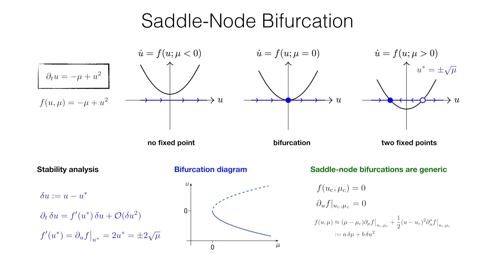
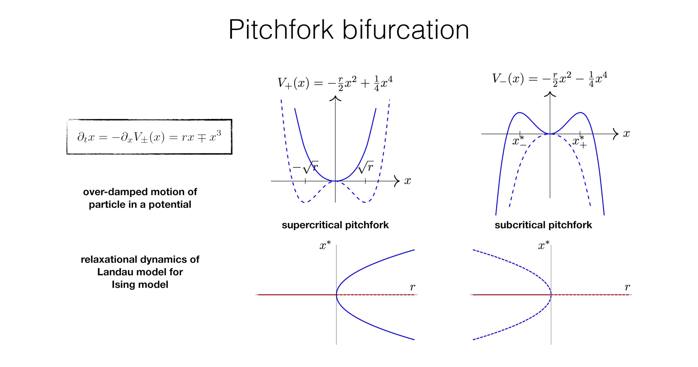
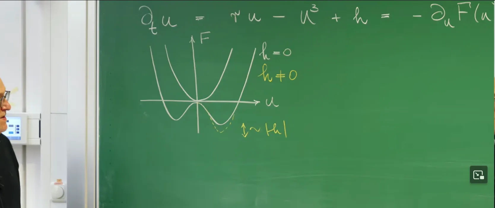
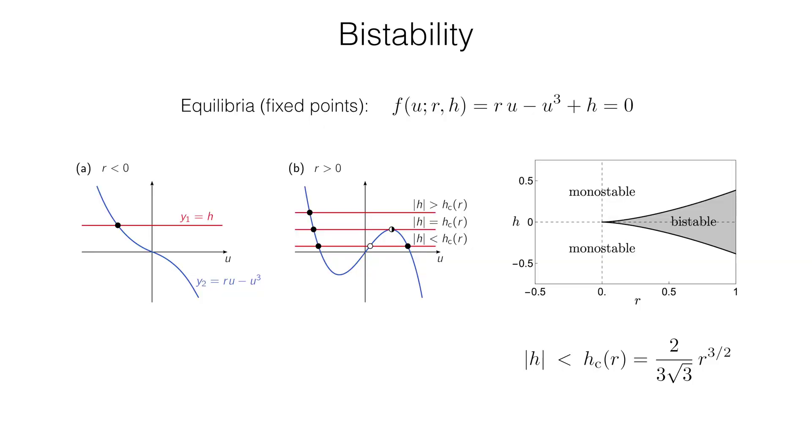
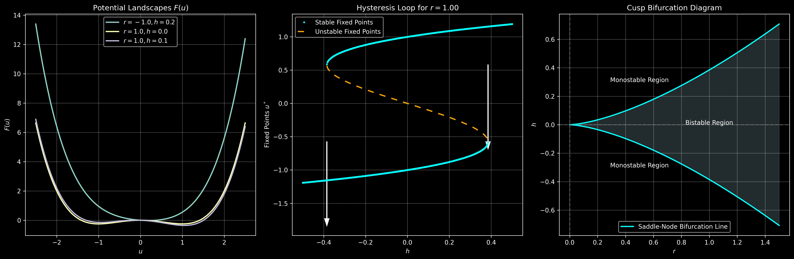
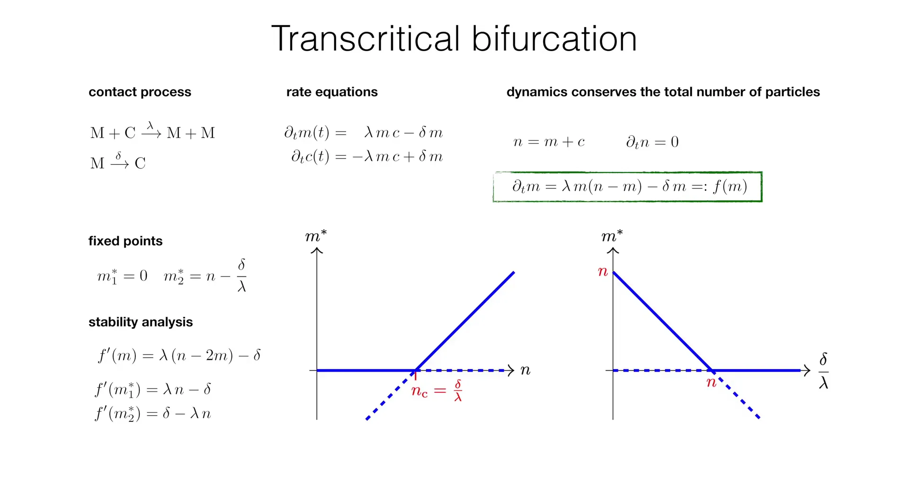

# Introduction

In **Lecture 2**, we established dynamical systems theory as a universal language for describing collective behavior, with its core being the study of ordinary differential equations (ODEs) describing how dynamical variables $u_i$ evolve over time: $\partial_t u_i(t) = f_i(\{u_i(t)\}; \{\mu_l\})$.


**Lecture 3** delved into the simplest yet most fundamental case of such systems: **single-component one-dimensional systems** $\partial_t u = f(u; \mu)$. The analysis focused on how the system's fixed points (i.e., equilibrium states) undergo qualitative changes when a **single control parameter** $\mu$ varies. The lecture analyzed in detail two of the most basic types of bifurcations:

1.**Saddle-Node Bifurcation**: Its normal form is $\partial_t u = -\mu + u^2$, which describes the most basic way fixed points are "born" and "annihilated" out of nothing, serving as the mathematical prototype for system "tipping points."

2.**Pitchfork Bifurcation**: Its normal form is $\partial_t u = ru - u^3$, which requires the system's $u \to -u$ symmetry as a prerequisite and perfectly describes the "spontaneous symmetry breaking" phenomenon in physics (such as in Ginzburg–Landau theory).








These examples all revolve around a core question: how does the qualitative behavior of a system change when a **single** control parameter $\mu$ varies?

This lecture will take a key step forward on this basis, exploring more complex and richer dynamical phenomena when regulated by **two control parameters**. For this purpose, we will study in depth the **Cusp Bifurcation**. The cusp bifurcation can be viewed as a direct generalization of the pitchfork bifurcation: it describes the general behavior when a system with $u \to -u$ symmetry (controlled by parameter $r$, as in pitchfork bifurcation) is simultaneously subjected to an **external field $h$** (the second control parameter) that **explicitly breaks this symmetry**.

The cusp bifurcation is a crucial "organizing center" that not only unifies the aforementioned bifurcation types but also mathematically explains two nonlinear phenomena that are extremely common in nature and engineering:

1.**Bistability**: The system can stably exist in one of two different states under exactly the same parameter conditions.

2.**Hysteresis**: The current state of the system depends on the historical path of its parameter changes, exhibiting a "memory effect."

Subsequently, the lecture will turn to a fundamentally different type of bifurcation—**Transcritical Bifurcation**. Unlike the previous bifurcations where the **number** of fixed points changes (saddle-node: 0 $\leftrightarrow$ 2; pitchfork: 1 $\leftrightarrow$ 3), transcritical bifurcation describes the process where two fixed points collide and then **exchange their stability**.

To make these abstract mathematical concepts more practically meaningful, this lecture will be closely combined with specific physical and biological models. The cusp bifurcation will be understood through the classical Ising model, where the two control parameters $r$ and $h$ correspond to temperature and external magnetic field respectively. The transcritical bifurcation will be analyzed through a simple yet profound disease propagation model—the **Contact Process**—revealing the critical threshold phenomenon of epidemic outbreaks.

The one-dimensional system analysis methods established in this lecture will lay the foundation for subsequent lectures, where these ideas will be extended to two-dimensional systems, preparing us for understanding complex spatiotemporal pattern formation phenomena such as Turing Patterns.


# 1. Cusp Bifurcation - Bistability and Hysteresis

In **Lecture 3**, we analyzed systems with $u \to -u$ symmetry, with the **Pitchfork Bifurcation** as a typical representative. This symmetry is physically very important (such as in the Ising model without an external magnetic field)—it guarantees that $u=0$ is always a fixed point, and the newly appearing ordered states $u^* = \pm\sqrt{r}$ must appear in pairs, symmetrically. This section will explore a more general and richer scenario: what happens to the dynamical behavior of the system when this $u \to -u$ symmetry is **explicitly broken** by an external factor? This will lead us from the world of a single parameter $r$ into the dynamical "phase diagram" controlled by two control parameters $(r, h)$, with the **Cusp Bifurcation** at its core.

## 1.1. From Pitchfork Bifurcation to Cusp Bifurcation - The Symmetry-Breaking Field

Recall from the previous lecture that the normal form of the supercritical pitchfork bifurcation is $\partial_t u = r u - u^3$. This equation can be viewed as over-damped motion of a particle in a symmetric "potential landscape" $V(u) = -\frac{r}{2}u^2 + \frac{1}{4}u^4$.

Now we introduce **a second control parameter $h$**, which represents an external "bias" or "force field" that breaks the system's symmetry. This transforms the dynamical equation into the normal form of the cusp bifurcation:

$$
\partial_t u = r u - u^3 + h \equiv f(u; r, h)
$$

This equation can also be written in the form of relaxation dynamics in a potential landscape $\partial_t u = -\partial_u F(u)$, where the new potential function $F(u)$ is:

$$
F(u) = -\frac{r}{2}u^2 + \frac{1}{4}u^4 - hu
$$

$$-\partial_u F = -\partial_u(-\frac{r}{2}u^2 + \frac{1}{4}u^4 - hu) = -(-ru + u^3 - h) = ru - u^3 + h$$




This newly added term $-hu$ has profound physical significance. Taking the Ising model discussed in **Lecture 2** and **Lecture 3** as an example:

* $u$ still represents the system's magnetization (order parameter).

* $r$ is still related to temperature (e.g., $r \propto T_c - T$).

* $h$ precisely corresponds to the **external magnetic field** applied to the system.

When $h=0$, we recover the pitchfork bifurcation with $u \to -u$ symmetry (i.e., "spin up" and "spin down" are completely equivalent). When $h \neq 0$, this external magnetic field explicitly breaks the symmetry (e.g., when $h>0$, the system prefers the $u>0$ state), and the potential landscape $F(u)$ becomes tilted. The cusp bifurcation studies precisely the complete dynamical behavior in the more universal, asymmetric system $(r, h)$ parameter space.

## 1.2. Solving for Fixed Points - A Graphical Method

The long-term behavior of the system is determined by its fixed points $u^*$, where the dynamics stops, i.e., $\partial_t u = 0$. Therefore, we need to solve the algebraic equation:

$$
f(u; r, h) = r u - u^3 + h = 0
$$

This is a cubic equation in $u$, and directly solving for $u^*(r, h)$ would be tedious. The lecture introduced a very intuitive **graphical method** to understand the structure of solutions. We transform the equation to:

$$
r u - u^3 = -h
$$

Thus, finding the fixed point $u^*$ is transformed into finding the **intersection of two curves**:

1.An N-shaped **cubic curve** $y_2(u) = r u - u^3$.

2.A **horizontal line** $y_1(u) = -h$.

The cleverness of this method lies in clearly separating the effects of the two control parameters:

* Parameter $r$ determines the **shape** of the cubic curve $y_2(u)$.

* Parameter $h$ determines the **vertical position** of the horizontal line $y_1(u)$.

By analyzing the sign of $r$, we can discuss the shape of $y_2$ in two cases:

1.**When $r < 0$ (corresponding to $T > T_c$)**: The derivative of $y_2(u)$, $y_2'(u) = r - 3u^2$, is always negative. Therefore, the curve $y_2(u)$ is monotonically decreasing. This means no matter where the horizontal line $y_1 = -h$ is positioned, it will have **only one intersection** with $y_2(u)$. Therefore, for any $h$, the system has only one fixed point and is **monostable**.

2.**When $r > 0$ (corresponding to $T < T_c$)**: $y_2(u)$ is no longer monotonic; it has local maximum and minimum values at $u = \pm\sqrt{r/3}$, presenting an "N" shape. At this time, the number of intersections depends on the position of the horizontal line $y_1 = -h$:

* If $|h|$ is large enough (line outside the N-shape), there is **only one intersection**.

* If $|h|$ is exactly such that the line is tangent to one of the extrema of $y_2(u)$, there are **two intersections**.

* If $|h|$ is small enough (line crosses through the N-shape), there will be **three intersections**.




This slide explains from an **algebraic and graphical analysis** perspective how **Bistability** arises from the normal equation of the cusp bifurcation. The equation Equilibria (fixed points): $f(u; r, h) = ru - u^3 + h = 0$ defines the fixed points: the points where the dynamical function $f(u)$ is zero. To solve this cubic equation, the slide transforms it into finding the intersection of two curves: $y2 = ru - u^3$ (N-shaped curve) and $y1 = h4$ (horizontal line). (Note: According to the top equation $ru - u^3 + h = 0$, the correct transformation should be $ru - u^3 = -h$. Therefore, the horizontal line should be $y_1 = -h$. The label $y_1 = h$ on the slide is likely a minor typo, but this does not affect the logic of the graphical analysis.)

Figure (a) shows the monostable case (r < 0). When $r < 0$, the curve $y_2 = ru - u^3$ is monotonically decreasing. Therefore, no matter where the horizontal line $y_1$ is positioned, they **always have only one intersection**. This means the system is always **monostable** in the $r < 0$ parameter region (corresponding to the high-temperature region physically).

Figure (b) shows the bistable case (r > 0). When $r > 0$, the curve $y_2 = ru - u^3$ presents an "N" shape, with a local maximum and a local minimum. At this time, the number of intersections depends on $h$: when **$|h| > h_c(r)$** (line above or below the N-shape), there is **1 intersection** (monostable); when **$|h| = h_c(r)$** (line tangent to the N-shape), there are **2 intersections** (this is the critical point of saddle-node bifurcation); when **$|h| < h_c(r)$** (line crosses through the N-shape), there are **3 intersections** (bistable).

Figure (c) is the "map" of the $(r, h)$ **parameter space**. It summarizes the results of the graphical analysis: when $r < 0$, the system is always monostable. When $r > 0$, there exists a wedge-shaped region bounded by $h_c(r) = \frac{2}{3\sqrt{3}}r^{3/2}$, within which the system is **bistable**. The tip of this wedge-shaped region $(0, 0)$ is the **Cusp**.

In summary, the slide shows why $r > 0$ is a necessary condition for bistability, and how parameter $h$ acts as a "switch" controlling the system between monostable and bistable states. The cusp region in Figure (c) is precisely the parameter range where three intersections exist in Figure (b).


This geometric method transforms an algebraic problem into intuitive image analysis, allowing us to clearly "see" how the number of fixed points changes with parameters $r$ and $h$.


## 1.3. Bistability, Saddle-Node Bifurcation and the Cusp

The graphical analysis in the previous section shows that when $r > 0$ and $|h|$ is small enough, the system has three fixed points. This phenomenon of **three fixed points coexisting** (two stable, one unstable) is called **Bistability**.

To rigorously determine the stability of these fixed points, we use the **Linear Stability Analysis (LSA)** introduced in **Lecture 3**. The stability of fixed points is determined by the sign of the derivative $f'(u^*)$:

$$
f'(u) = \frac{\partial f}{\partial u} = \frac{\partial}{\partial u}(r u - u^3 + h) = r - 3u^2
$$

* **Stable**: $f'(u^*) < 0$

* **Unstable**: $f'(u^*) > 0$

Now let's analyze the three fixed points when $r>0$:

* The extrema (peak and valley) of the N-shaped curve $y_2(u)$ are located where $y_2'(u) = r - 3u^2 = 0$, i.e., $u = \pm\sqrt{r/3}$.

* In the **middle region** ($- \sqrt{r/3} < u < \sqrt{r/3}$), $u^2 < r/3$, so $f'(u) = r - 3u^2 > 0$. The **middle fixed point** in this region is always **unstable**.

* In the **two outer regions** ($|u| > \sqrt{r/3}$), $u^2 > r/3$, so $f'(u) = r - 3u^2 < 0$. The **two outer fixed points** in these regions are always **stable**.


Therefore, the bistable region indeed consists of **two stable fixed points** and one **unstable fixed point**.

Where is the boundary of the bistable region? This boundary is exactly where a **stable** fixed point and an **unstable** fixed point collide and annihilate. Recalling **Lecture 3**, this is precisely the characteristic of **Saddle-Node Bifurcation**. The critical conditions for saddle-node bifurcation are when linear stability analysis fails:

1.$f(u) = r u - u^3 + h = 0$ (the system is at a fixed point)

2.$f'(u) = r - 3u^2 = 0$ (the stability of this fixed point is about to change)

We can find the boundary line of saddle-node bifurcation in the $(r, h)$ parameter space by solving this system of equations:

1.From condition 2 (tangent condition), solve for the location $u_{\text{SN}}$ where bifurcation occurs (SN = Saddle-Node):

$$
u_{\text{SN}}^{\pm} = \pm \sqrt{r/3}
$$

This solution has real meaning only when $r > 0$ (corresponding to $T < T_c$).

2.Substitute $u_{\text{SN}}^{\pm}$ into condition 1 (fixed point condition) to solve for the corresponding critical magnetic field $h_c$:

$$
h_c = - (r u_{\text{SN}}^{\pm} - (u_{\text{SN}}^{\pm})^3) = - u_{\text{SN}}^{\pm} (r - (u_{\text{SN}}^{\pm})^2)
$$

Substituting $(u_{\text{SN}}^{\pm})^2 = r/3$:

$$
h_c = - (\pm \sqrt{r/3}) (r - r/3) = \mp \sqrt{r/3} (\frac{2r}{3})
$$

After simplification:

$$
h_c(r) = \pm \frac{2}{3\sqrt{3}}r^{3/2}
$$

This equation $h_c(r) \propto r^{3/2}$ defines two curves in the $(r, h)$ parameter plane. They meet at the origin $(r=0, h=0)$, forming a sharp corner—this is the origin of the name "**Cusp**."

The region enclosed by these two curves (saddle-node bifurcation lines) is where the system has three fixed points (i.e., bistability). The origin $(0,0)$ is a higher-order bifurcation point that acts like an "organizing center" from which two saddle-node bifurcation lines extend. This cusp bifurcation diagram is the complete "phase diagram" of the system's dynamical behavior.


## 1.4. Hysteresis - The System's Memory Effect

**Hysteresis** is a direct dynamical consequence of the existence of the bistable region. It describes the dependence of the system state on the history of parameter changes.

Imagine an experiment: we fix $r > 0$ (i.e., the system temperature is below $T_c$, within the bistable region), and then slowly change the external magnetic field $h$ back and forth.

1.**$h$ increases from negative infinity**:

* When $h$ is very negative, the system is in the monostable region with only one stable fixed point $u < 0$ (e.g., the magnet is forcibly magnetized "down").

* Gradually increasing $h$, the system state smoothly follows this $u < 0$ stable branch.

* When $h$ increases to the upper boundary critical value $h_c(r) = +\frac{2}{3\sqrt{3}}r^{3/2}$, the system reaches a saddle-node bifurcation point. At this point, the $u < 0$ stable branch the system was on collides with the $u > 0$ unstable branch and **annihilates**.

* The system can no longer maintain its original state, the dynamics $\partial_t u > 0$ takes over, forcing the system to undergo a dramatic **"jump"** (the professor calls this a "Catastrophe"), transitioning to the only remaining stable branch on the $(r,h)$ plane, which is the $u > 0$ state (the magnet "flips" to "up").

2.**$h$ decreases from positive infinity**:

* Now the system is on the $u > 0$ stable branch (magnetized "up").

* Gradually decreasing $h$, the system will stay on this $u > 0$ stable branch, even when $h$ crosses $h=0$ and becomes negative.

* Until $h$ decreases to the lower boundary critical value $-h_c(r) = -\frac{2}{3\sqrt{3}}r^{3/2}$, the system reaches another saddle-node bifurcation point.

* At this point the $u > 0$ stable branch annihilates, and the system is forced to "jump" back to the $u < 0$ stable state.

This process shows that the paths the system state $u$ follows when $h$ increases and decreases **do not coincide**, forming a "**Hysteresis Loop**." The current state of the system depends not only on the current parameter values $(r, h)$, but also on "where it came from."


This slide shows the geometric structure of **Cusp Bifurcation** from three dimensions, revealing its role as an "organizing center." Figure (a) is the core view, plotting how the fixed points $u^*$ vary with two control parameters $r$ and $h$ in a three-dimensional space. The horizontal plane is the $(r, h)$ **parameter space**, and the vertical axis is the $u$ **state space**. The gray surface $u^*(r, h)$ represents all possible fixed points (equilibrium states) of the system. The most notable feature of this surface is that it **folds** like a sheet of paper. Inside the folded region ($r>0$ and $|h|$ relatively small), a vertical line will intersect the surface **three times**, corresponding to three fixed points (upper and lower branches stable, middle dashed branch unstable). Outside the folded region, a vertical line intersects the surface only **once**, corresponding to one stable fixed point. The projection of this folded region onto the $(r, h)$ plane forms the wedge-shaped region bounded by the **cusp** and two saddle-node bifurcation lines $h_c(r)$.

Figure (b) is a **two-dimensional slice** of Figure (a) at $r > 0$ (fixing $r$, observing how $u$ changes with $h$). It shows the classic "S"-shaped curve, which is the hallmark of **Bistability**. The red arrows clearly depict the **Hysteresis Loop**: when $h$ increases from negative values, the system stays on the lower stable branch until the $h_c$ point (saddle-node bifurcation, SN) where it is forced to "jump" to the upper stable branch; when $h$ decreases in reverse, the system "remembers" its state on the upper branch until the $-h_c$ point where it "jumps" back to the lower branch.

Figure (c) is another **two-dimensional slice** of Figure (a) at $h = 0$ (fixing $h=0$, observing how $u$ changes with $r$). This is precisely the **(supercritical) pitchfork bifurcation** diagram we learned in the previous lecture. It shows how the system spontaneously transitions from a symmetric stable state ($u=0$) to two new, symmetric stable states when $r$ crosses 0.

In summary, it unifies the hysteresis phenomenon in Figure (b) and the pitchfork bifurcation in Figure (c) as two different aspects of the same three-dimensional geometric structure (Figure (a)). The cusp bifurcation is the more general structure, while the pitchfork bifurcation is just a special case on the symmetric line $h=0$.

# 2. Python Simulation and Visualization of Cusp Bifurcation

To reproduce the dynamical characteristics of cusp bifurcation, the code practice will visualize the potential landscape, plot the hysteresis loop, and display the cusp region in parameter space.

```python
import numpy as np
import matplotlib.pyplot as plt

# Set black theme style
plt.style.use('dark_background')

def plot_all_in_one(save_fig=False):
    """
    Plot all charts in one figure with black theme background
    
    Args:
        save_fig (bool): Whether to save the figure
    """
    # Create a figure with three subplots
    fig = plt.figure(figsize=(18, 6))
    
    # Subplot 1: Potential functions with different parameters
    ax1 = fig.add_subplot(131)
    
    # Plot multiple potential curves
    u = np.linspace(-2.5, 2.5, 500)
    
    # Case r < 0 (monostable)
    r1, h1 = -1, 0.2
    F1 = -0.5 * r1 * u**2 + 0.25 * u**4 - h1 * u
    ax1.plot(u, F1, lw=2, label=f'$r={r1:.1f}, h={h1:.1f}$')
    
    # Case r > 0, h = 0 (symmetric bistable)
    r2, h2 = 1, 0
    F2 = -0.5 * r2 * u**2 + 0.25 * u**4 - h2 * u
    ax1.plot(u, F2, lw=2, label=f'$r={r2:.1f}, h={h2:.1f}$')
    
    # Case r > 0, h != 0 (asymmetric bistable)
    r3, h3 = 1, 0.1
    F3 = -0.5 * r3 * u**2 + 0.25 * u**4 - h3 * u
    ax1.plot(u, F3, lw=2, label=f'$r={r3:.1f}, h={h3:.1f}$')
    
    ax1.set_title('Potential Landscapes $F(u)$')
    ax1.set_xlabel('$u$')
    ax1.set_ylabel('$F(u)$')
    ax1.grid(True, alpha=0.3)
    ax1.legend()
    
    # Subplot 2: Hysteresis loop
    ax2 = fig.add_subplot(132)
    r = 1  # For hysteresis phenomenon, r must be positive
    h_vals = np.linspace(-0.5, 0.5, 400)
    u_stars = []
    
    for h in h_vals:
        # Find roots of f(u) = r*u - u^3 + h = 0
        coeffs = [-1, 0, r, h]
        roots = np.roots(coeffs)
        # Filter for real roots
        real_roots = roots[np.isreal(roots)].real
        for root in sorted(real_roots):
            u_stars.append((h, root))
            
    h_coords, u_coords = zip(*u_stars)
    
    # Stability analysis: f'(u) = r - 3u^2
    stability = r - 3 * np.array(u_coords)**2
    stable_h = [h for h, s in zip(h_coords, stability) if s < 0]
    stable_u = [u for u, s in zip(u_coords, stability) if s < 0]
    unstable_h = [h for h, s in zip(h_coords, stability) if s >= 0]
    unstable_u = [u for u, s in zip(u_coords, stability) if s >= 0]
    
    ax2.plot(stable_h, stable_u, '.', color='cyan', markersize=4, label='Stable Fixed Points')
    ax2.plot(unstable_h, unstable_u, '--', color='orange', dashes=(5, 5), lw=2, label='Unstable Fixed Points')
    
    # Add jump arrows
    h_c = (2 / (3 * np.sqrt(3))) * r**(3/2)
    u_sn_pos = np.sqrt(r/3)
    u_sn_neg = -np.sqrt(r/3)
    
    # Jump up
    ax2.arrow(h_c, u_sn_pos, 0, -2*u_sn_pos, head_width=0.02, head_length=0.1, 
              fc='white', ec='white', lw=1.5)
    # Jump down
    ax2.arrow(-h_c, u_sn_neg, 0, 2*u_sn_neg, head_width=0.02, head_length=0.1, 
              fc='white', ec='white', lw=1.5)
    
    ax2.set_title(f'Hysteresis Loop for $r={r:.2f}$')
    ax2.set_xlabel('$h$')
    ax2.set_ylabel('Fixed Points $u^*$')
    ax2.legend()
    ax2.grid(True, alpha=0.3)
    
    # Subplot 3: Cusp bifurcation region diagram
    ax3 = fig.add_subplot(133)
    r_vals = np.linspace(0, 1.5, 200)
    h_c = (2 / (3 * np.sqrt(3))) * r_vals**(3/2)
    
    ax3.plot(r_vals, h_c, 'cyan', lw=2, label='Saddle-Node Bifurcation Line')
    ax3.plot(r_vals, -h_c, 'cyan', lw=2)
    
    ax3.fill_between(r_vals, h_c, -h_c, color='lightblue', alpha=0.2)
    
    ax3.text(1.0, 0, 'Bistable Region', horizontalalignment='center', color='white')
    ax3.text(0.5, 0.3, 'Monostable Region', horizontalalignment='center', color='white')
    ax3.text(0.5, -0.3, 'Monostable Region', horizontalalignment='center', color='white')
    
    ax3.set_title('Cusp Bifurcation Diagram')
    ax3.set_xlabel('$r$')
    ax3.set_ylabel('$h$')
    ax3.axhline(0, color='grey', linestyle='--', alpha=0.5)
    ax3.axvline(0, color='grey', linestyle='--', alpha=0.5)
    ax3.legend()
    ax3.grid(True, alpha=0.3)
    
    # Adjust layout
    plt.tight_layout()
    
    # Save figure (if needed)
    if save_fig:
        plt.savefig('cusp_bifurcation_combined.png', dpi=300, bbox_inches='tight', facecolor='black')
        print("Figure saved as cusp_bifurcation_combined.png")
    
    plt.show()

def plot_potential(r, h):
    """
    Plots the potential F(u) for the cusp bifurcation.
    
    Args:
        r (float): The control parameter r.
        h (float): The control parameter h.
    """
    u = np.linspace(-2.5, 2.5, 500)
    F = -0.5 * r * u**2 + 0.25 * u**4 - h * u
    
    plt.figure(figsize=(8, 6))
    plt.plot(u, F, lw=2)
    plt.title(f'Potential Landscape $F(u)$ for $r={r:.2f}$, $h={h:.2f}$')
    plt.xlabel('$u$')
    plt.ylabel('$F(u)$')
    plt.grid(True)
    plt.ylim(min(F) - 1, max(F) + 1 if r < 0 else 1)
    plt.show()

def plot_hysteresis_loop(r):
    """
    Plots the fixed points u* as a function of h for a given r > 0,
    illustrating the hysteresis loop.
    
    Args:
        r (float): The control parameter r. Must be positive.
    """
    if r <= 0:
        print("Hysteresis is only observed for r > 0.")
        return
        
    h_vals = np.linspace(-0.5, 0.5, 400)
    u_stars = []
    
    for h in h_vals:
        # Find roots of f(u) = r*u - u^3 + h = 0
        coeffs = [-1, 0, r, h]
        roots = np.roots(coeffs)
        # Filter for real roots
        real_roots = roots[np.isreal(roots)].real
        for root in sorted(real_roots):
            u_stars.append((h, root))
            
    h_coords, u_coords = zip(*u_stars)
    
    # Stability analysis: f'(u) = r - 3u^2
    stability = r - 3 * np.array(u_coords)**2
    stable_h = [h for h, s in zip(h_coords, stability) if s < 0]
    stable_u = [u for u, s in zip(u_coords, stability) if s < 0]
    unstable_h = [h for h, s in zip(h_coords, stability) if s >= 0]
    unstable_u = [u for u, s in zip(u_coords, stability) if s >= 0]
    
    plt.figure(figsize=(8, 6))
    plt.plot(stable_h, stable_u, 'b.', markersize=4, label='Stable Fixed Points')
    plt.plot(unstable_h, unstable_u, 'r--', dashes=(5, 5), lw=2, label='Unstable Fixed Points')
    
    # Add arrows to show the jumps
    h_c = (2 / (3 * np.sqrt(3))) * r**(3/2)
    u_sn_pos = np.sqrt(r/3)
    u_sn_neg = -np.sqrt(r/3)
    
    # Jump up
    plt.arrow(h_c, u_sn_pos, 0, -2*u_sn_pos, head_width=0.02, head_length=0.1, fc='k', ec='k', lw=1.5)
    # Jump down
    plt.arrow(-h_c, u_sn_neg, 0, 2*u_sn_neg, head_width=0.02, head_length=0.1, fc='k', ec='k', lw=1.5)
    
    plt.title(f'Hysteresis Loop for $r={r:.2f}$')
    plt.xlabel('$h$')
    plt.ylabel('Fixed Points $u^*$')
    plt.legend()
    plt.grid(True)
    plt.show()

def plot_cusp_region():
    """
    Plots the cusp bifurcation diagram in the (r, h) parameter space.
    """
    r_vals = np.linspace(0, 1.5, 200)
    h_c = (2 / (3 * np.sqrt(3))) * r_vals**(3/2)
    
    plt.figure(figsize=(8, 6))
    plt.plot(r_vals, h_c, 'k-', lw=2, label='Saddle-Node Bifurcation Line')
    plt.plot(r_vals, -h_c, 'k-', lw=2)
    
    plt.fill_between(r_vals, h_c, -h_c, color='lightblue', alpha=0.5)
    
    plt.text(1.0, 0, 'Bistable Region', horizontalalignment='center')
    plt.text(0.5, 0.3, 'Monostable Region', horizontalalignment='center')
    plt.text(0.5, -0.3, 'Monostable Region', horizontalalignment='center')
    
    plt.title('Cusp Bifurcation Diagram')
    plt.xlabel('$r$')
    plt.ylabel('$h$')
    plt.axhline(0, color='grey', linestyle='--')
    plt.axvline(0, color='grey', linestyle='--')
    plt.legend()
    plt.grid(True)
    plt.show()

if __name__ == '__main__':
    # Generate combined figure and save
    plot_all_in_one(save_fig=True)
```



**Left panel (Potential Landscapes)** shows how the system's potential $F(u)$ changes with control parameters $r$ and $h$. The curves show that when $r<0$ (e.g., $r=-1.0$), the system has only one potential energy minimum, corresponding to a **monostable** system. When $r>0$ (e.g., $r=1.0$), the potential landscape presents a **double-well** shape, meaning the system has two stable equilibrium states (bistability). The role of parameter $h$ (as shown by $h=0.1$) is to break the symmetry at $h=0$, making one potential well lower than the other.

**Middle panel (Hysteresis Loop)** explores in depth the bistable region when $r=1.0$. It plots the "S"-shaped curve of fixed points $u^*$ (vertical axis) as a function of parameter $h$ (horizontal axis). The cyan solid line represents stable fixed points (corresponding to the "valleys" of the potential), while the orange dashed line is the unstable fixed point separating the two stable states (corresponding to the "peak" of the potential). The white arrows vividly illustrate the **hysteresis phenomenon**: when $h$ increases from negative values, the system stays on the lower stable branch until the critical point (saddle-node bifurcation point) where that branch disappears, then is forced to "jump" to the upper stable branch; and vice versa.

**Right panel (Bifurcation Diagram)** is the **"phase diagram" of the $(r, h)$ parameter space**. It marks on the $r-h$ plane the wedge-shaped **"bistable region"** bounded by saddle-node bifurcation lines (cyan solid lines). This cusp diagram is a complete "map": any $(r, h)$ parameter combination within this region (as shown in the middle panel with $r=1.0$) will produce hysteresis; while parameters outside the region (such as the $r=-1.0$ case in the left panel), the system behaves as monostable. These three panels are closely connected, jointly revealing the rich dynamical behavior of cusp bifurcation from different dimensions.


# 3. Transcritical Bifurcation - Disease Propagation Model

After analyzing the cusp bifurcation controlled by two parameters $(r, h)$, this lecture will turn to a fundamentally different type of bifurcation in its dynamical behavior. In the bifurcations discussed earlier (such as saddle-node and pitchfork bifurcations), the **number** of fixed points changes fundamentally at the bifurcation point (e.g., from 0 to 2, or from 1 to 3).

The **Transcritical Bifurcation** we now explore is different: the total number of fixed points remains unchanged before and after the bifurcation point (e.g., always two). Its core feature is that two fixed points **collide** at the critical point and **exchange their stability**. A state that was originally stable becomes unstable, while the originally unstable state becomes stable.

## 3.1. A New Bifurcation Scenario - The Contact Process

To understand the physical context of this bifurcation, the lecture introduces a classical simplified model in epidemiology: the **Contact Process**.

Imagine a **well-mixed** environment with two types of individuals:

* **M**: Represents sick/infected individuals

* **C**: Represents healthy/susceptible individuals

The evolution of this system is driven by two fundamental microscopic processes:

1.**Infection:** An infected individual M encounters a healthy individual C, and the healthy individual becomes infected at a certain **infection rate $\lambda$** (probability per unit time), becoming an infected individual.

$$
M + C \xrightarrow{\lambda} M + M
$$
    
2.**Recovery:** An infected individual M spontaneously recovers at a certain **recovery rate $\delta$**, becoming a healthy individual.

$$
M \xrightarrow{\delta} C
$$

## 3.2. From Microscopic Rules to Macroscopic Rate Equations

How do we transition from these discrete, stochastic microscopic rules describing individual behavior to deterministic equations describing the macroscopic changes of the entire population? This requires introducing a key physical assumption: the **Mean-Field Approximation**.

This assumption stems from the "well-mixed" premise, which ignores all spatial structure (such as individual positions) or local differences. It assumes that the frequency of any two individuals (such as one M and one C) meeting is proportional to the **product of their respective average concentrations (or numbers)** in the system.

Based on this assumption, we can write the **Rate Equations** describing how the number of infected individuals $m$ and healthy individuals $c$ change over time:

**Rate of change of infected individuals $m$, $\partial_t m$**:

* **Increase term (from infection)**: The rate of infection events $M+C \to M+M$ is proportional to the product of $m$ and $c$, i.e., $\lambda m c$.

* **Decrease term (from recovery)**: The rate of recovery events $M \to C$ is proportional to $m$ itself, i.e., $-\delta m$.
    
Therefore, the net rate of change of infected individuals is:

$$
\partial_t m = \lambda m c - \delta m
$$

**Rate of change of healthy individuals $c$, $\partial_t c$**:

* **Decrease term (from infection)**: Healthy individuals are consumed in $M+C \to M+M$ events at rate $-\lambda m c$.

* **Increase term (from recovery)**: Healthy individuals are produced in $M \to C$ events at rate $+\delta m$.
    

Therefore, the net rate of change of healthy individuals is:

$$
\partial_t c = -\lambda m c + \delta m
$$


## 3.3. Conservation Law and Dimension Reduction

Now we have a pair of coupled ordinary differential equations describing the system. Before analysis, first observe a very important property of this pair of equations. If we add the two equations together:

$$
\partial_t (m+c) = (\lambda m c - \delta m) + (-\lambda m c + \delta m) = 0
$$

This result $\partial_t(m+c) = 0$ means that the total population $n = m + c$ is a **conserved quantity**; it does not change over time.

**Physical meaning**: This conservation law stems from the model's assumptions. In this system, there is no birth or death of individuals; individuals only switch between the "healthy" and "sick" states. Therefore, the total population $n$ must be constant.

This conservation law greatly simplifies the analysis. It means that the evolution trajectory of this two-dimensional dynamical system (with variables $m$ and $c$) does not move arbitrarily in the entire $(m, c)$ two-dimensional plane, but is **constrained** to the one-dimensional line $m+c=n$.

Therefore, we can **eliminate one variable** by substituting $c = n - m$, **reducing** the system to a familiar one-dimensional system that describes the entire system's state using only the number of infected individuals $m$:

$$
\partial_t m = \lambda m (n-m) - \delta m \equiv f(m)
$$

This equation is now in the standard form of a one-dimensional dynamical system $\partial_t u = f(u)$. Next, we can apply the analysis methods learned in **Lecture 3**: first find all fixed points (equilibrium states) of this equation, then use linear stability analysis to determine the stability of these equilibrium states, thereby revealing the dynamical behavior of transcritical bifurcation.

# 4. Stability Analysis and Python Simulation of Transcritical Bifurcation

By introducing the "mean-field approximation" and utilizing the "conservation law," we have successfully reduced a two-dimensional disease propagation model (contact process) to a standard one-dimensional dynamical system:

$$
\partial_t m = f(m) \equiv m \left[ \lambda (n-m) - \delta \right]
$$

Now the task is to apply the analysis framework established in **Lecture 3**—finding fixed points and performing linear stability analysis—to thoroughly dissect this equation, thereby revealing the dynamical characteristics of transcritical bifurcation and the critical conditions for epidemic outbreaks.

## 4.1. Fixed Points - Disease-Free State vs. Endemic State

First, find all equilibrium states (fixed points $m^*$) of the system by solving $f(m^*) = 0$:

$$
m^* \left[ \lambda (n - m^*) - \delta \right] = 0
$$

This equation obviously has two possible solutions, corresponding to two fundamentally different macroscopic states:

1.**$m_1^* = 0$**

* **Physical meaning**: This solution corresponds to the **disease-free state**. Regardless of parameters $\lambda$, $\delta$, $n$, having no infected individuals ($m=0$) is always a possible equilibrium state.

2.**$\lambda (n - m^*) - \delta = 0 \implies m_2^* = n - \frac{\delta}{\lambda}$**

* **Physical meaning**: This solution corresponds to the **endemic state**, where the disease persists in the population at a stable non-zero proportion $m_2^*$.

* **Physical constraint**: This solution has physical meaning only when $m_2^* \ge 0$ (since the number of infected individuals cannot be negative). This requires $n - \frac{\delta}{\lambda} \ge 0$, i.e., the total population $n$ must be greater than or equal to a critical value $\frac{\delta}{\lambda}$.

## 4.2. Linear Stability Analysis and Stability Exchange

We found two fixed points, but are they stable (attractors) or unstable (repellers)? This depends on the control parameter $n$ (total population). We use Linear Stability Analysis (LSA) to determine this.

First, calculate the derivative $f'(m)$ of $f(m)$ (i.e., the "restoring force"):

$$
f(m) = \lambda n m - \lambda m^2 - \delta m
$$
$$
f'(m) = \frac{d f}{d m} = \lambda n - 2\lambda m - \delta
$$

Next, evaluate the sign of $f'(m^*)$ at each of the two fixed points:

**For the disease-free state $m_1^* = 0$**:

$$
f'(0) = \lambda n - 2\lambda(0) - \delta = \lambda n - \delta
$$

**Stable ($f' < 0$)**: If $\lambda n - \delta < 0 \iff n < \frac{\delta}{\lambda}$.

**Physical meaning**: If the total population $n$ is **below** the critical value $\frac{\delta}{\lambda}$ (or equivalently, the recovery rate $\delta$ is relatively high), $m_1^*=0$ is stable. Any sporadic infection (a small $m$ perturbation) will exponentially decay due to $f' < 0$, and the disease will die out on its own.

**Unstable ($f' > 0$)**: If $\lambda n - \delta > 0 \iff n > \frac{\delta}{\lambda}$.

**Physical meaning**: If the total population $n$ **exceeds** the critical value $\frac{\delta}{\lambda}$, $m_1^*=0$ becomes unstable. Now $f' > 0$, and any small infection perturbation will be exponentially amplified, leading to an outbreak in the population.

**For the endemic state $m_2^* = n - \frac{\delta}{\lambda}$**:

Substituting $m_2^*$ into $f'(m)$:

$$
f'(m_2^*) = \lambda n - 2\lambda \left( n - \frac{\delta}{\lambda} \right) - \delta
$$

$$
f'(m_2^*) = \lambda n - 2\lambda n + 2\delta - \delta = \delta - \lambda n
$$

**Stable ($f' < 0$)**: If $\delta - \lambda n < 0 \iff n > \frac{\delta}{\lambda}$.

**Physical meaning**: When the total population $n$ **exceeds** the critical value, this endemic state is stable. After an outbreak, the system will stabilize at this non-zero infection level.

**Unstable ($f' > 0$)**: If $\delta - \lambda n > 0 \iff n < \frac{\delta}{\lambda}$.

**Physical meaning**: When the total population $n$ is **below** the critical value, this fixed point is $m_2^* < 0$ (no physical meaning), and it is also mathematically unstable.

**The Essence of Transcritical Bifurcation - Stability Exchange**

The analysis reveals the core characteristic of transcritical bifurcation. Note a key mathematical relationship:
$$
f'(m_2^*) = \delta - \lambda n = - (\lambda n - \delta) = -f'(m_1^*)
$$
The stability of the two fixed points is **always opposite**!

At the critical point $n_c = \frac{\delta}{\lambda}$, the two fixed points collide ($m_1^* = m_2^* = 0$), and $f' = 0$, so LSA fails. When $n$ crosses this critical point, they **exchange their stability**:
* When $n < n_c$: $m_1^*=0$ is **stable**; $m_2^*$ is unstable (and has no physical meaning).
* When $n > n_c$: $m_1^*=0$ is **unstable**; $m_2^*$ is **stable**.

This critical point $n_c = \frac{\delta}{\lambda}$ represents the **threshold for epidemic outbreak**. When population density is below this threshold, the disease-free state is the only stable outcome; when population density exceeds this threshold, the disease-free state becomes unstable, and the system evolves to a new, stable endemic state.

In epidemiology, this critical condition is usually expressed using the **basic reproduction number $R_0$**. $R_0 = \frac{\lambda n}{\delta}$ (the average number of healthy individuals one infected individual can infect before recovery). Bifurcation occurs when $R_0 = 1$.

## 4.3. Bifurcation Diagram and Python Simulation

The bifurcation diagram of transcritical bifurcation has very typical characteristics: two fixed point branch lines ($m^*=0$ and $m^*=n-\delta/\lambda$) intersect at the bifurcation point $n_c$. Before and after the bifurcation point, the stable branch (usually represented by a solid line) and the unstable branch (usually represented by a dashed line) are swapped.



This slide provides a complete overview of **Transcritical bifurcation** and uses the "**contact process**" (epidemic model) as a physical case.

It first defines the microscopic rules of the model:

1.**Infection**: $M + C \xrightarrow{\lambda} M + M$

2.**Recovery**: $M \xrightarrow{\delta} C$

Then, it transforms these rules into macroscopic "**rate equations**" describing the changes in the number of infected ($m$) and healthy ($c$) individuals. A key insight is that "**dynamics conserves the total number of particles**," i.e., the total population $n = m + c$ is a constant ($\partial_t n = 0)$).

Using this conservation law, the system can be simplified (reduced) to a **one-dimensional dynamical equation**: $\partial_t m = \lambda m(n-m) - \delta m =: f(m)$.

**Fixed points**: By solving $f(m)=0$, two equilibrium states are found: $m_1^* = 0$ (disease-free state) and $m_2^* = n - \frac{\delta}{\lambda}$ (endemic state).

**Stability analysis**: By calculating the derivative $f'(m)$, the stability of the two fixed points is obtained: $f'(m_1^*) = \lambda n - \delta$ and $f'(m_2^*) = \delta - \lambda n$.

Finally, the **bifurcation diagram** visually displays the analysis results. The diagram uses the total population $n$ as the control parameter and plots the position and stability of fixed points $m^*$. At the critical point $n_c = \frac{\delta}{\lambda}$, the two fixed point branches ($m_1^*$ and $m_2^*$) intersect. At this point, they **exchange stability**:

When $n < n_c$, the $m_1^*=0$ branch is stable (solid line), while the $m_2^*$ branch is unstable (dashed line).

When $n > n_c$, the $m_1^*=0$ branch becomes unstable (dashed line), while the $m_2^*$ branch gains stability (solid line).

This demonstrates the core characteristic of transcritical bifurcation: the total number of fixed points remains unchanged, but they collide at the critical point and exchange stability.

The following Python code generates this bifurcation diagram, showing the process of stability exchange.

```python
import numpy as np
import matplotlib.pyplot as plt

def plot_transcritical_bifurcation(lam, delta):
    """
    Plots the bifurcation diagram for the transcritical bifurcation
    in the infection model.
    
    Args:
        lam (float): Infection rate lambda.
        delta (float): Recovery rate delta.
    """
    n_c = delta / lam
    n_vals = np.linspace(0, 2 * n_c, 400)
    
    # Fixed point 1: m1* = 0 (the horizontal axis)
    m1_star = np.zeros_like(n_vals)
    
    # Fixed point 2: m2* = n - delta/lambda (the diagonal line)
    m2_star = n_vals - n_c
    
    # --- Stability analysis ---
    
    # Branch 1 (m1* = 0)
    # m1* is stable for n < n_c
    n_stable1 = n_vals[n_vals < n_c]
    m_stable1 = np.zeros_like(n_stable1)
    # m1* is unstable for n > n_c
    n_unstable1 = n_vals[n_vals >= n_c]
    m_unstable1 = np.zeros_like(n_unstable1)
    
    # Branch 2 (m2* = n - n_c)
    # m2* is stable for n > n_c (and physically relevant)
    n_stable2 = n_vals[n_vals >= n_c]
    m_stable2 = n_stable2 - n_c
    # m2* is unstable for n < n_c (and unphysical)
    n_unstable2 = n_vals[n_vals < n_c]
    m_unstable2 = n_unstable2 - n_c
    
    
    plt.figure(figsize=(8, 6))
    plt.style.use('dark_background') # Use dark theme
    
    # Plot stable branches (e.g., in cyan)
    plt.plot(n_stable1, m_stable1, 'c-', lw=2.5, label='Stable Fixed Points')
    plt.plot(n_stable2, m_stable2, 'c-', lw=2.5)
    
    # Plot unstable branches (e.g., in magenta)
    plt.plot(n_unstable1, m_unstable1, 'm--', dashes=(5, 5), lw=2, label='Unstable Fixed Points')
    plt.plot(n_unstable2, m_unstable2, 'm--', dashes=(5, 5), lw=2)
    
    plt.axvline(n_c, color='yellow', linestyle=':', label=f'Bifurcation Point $n_c = \\delta/\\lambda = {n_c:.2f}$')
    
    plt.title('Transcritical Bifurcation in the Infection Model')
    plt.xlabel('Total Population Density $n$')
    plt.ylabel('Infected Population $m^*$')
    plt.legend()
    plt.grid(True, linestyle=':', alpha=0.4)
    plt.ylim(-0.5 * n_c, 1.1 * n_c) # Adjust ylim to show the unphysical branch
    plt.xlim(0, 2 * n_c)
    plt.show()

if __name__ == '__main__':
    # Define model parameters
    lambda_rate = 0.1  # Infection rate
    delta_rate = 0.5   # Recovery rate
    
    print("Plotting the transcritical bifurcation diagram...")
    plot_transcritical_bifurcation(lam=lambda_rate, delta=delta_rate)
```


The diagram shows how the two fixed point branches intersect at the critical point $n_c$, and how the blue stable branch line switches from $m^*=0$ to the $m^*=n-n_c$ branch, while the red unstable dashed line does the opposite. This is precisely the manifestation of stability exchange.


# Summary

This lecture explored two types of bifurcations with universal significance in physical and biological systems. First, **Cusp Bifurcation** was constructed as a generalization of the pitchfork bifurcation from **Lecture 3**, serving as a general model for describing systems under the action of **two control parameters** (a tuning parameter $r$ and a symmetry-breaking field $h$). Through the analysis of cusp bifurcation, we understood the mechanisms underlying **Bistability** and **Hysteresis**: the system can have two stable states within a specific region of parameter space, and its state transition path depends on the history of parameter changes. This provides a solid theoretical foundation for understanding memory effects, switching behavior, and first-order phase transitions in physics.

Second, the lecture introduced **Transcritical Bifurcation** through a simple disease propagation model (contact process). Unlike previously learned bifurcations, the core characteristic of transcritical bifurcation is the **exchange of stability** rather than a change in the number of fixed points. The analysis shows that an originally stable "disease-free" state becomes unstable after the system parameter (such as total population $n$) crosses a critical threshold $n_c$, "passing" its stability to a newly appearing "endemic" state. This type of bifurcation is key to understanding critical transition phenomena in ecosystems, chemical reaction networks, and epidemiology.

The **one-dimensional dynamical system analysis framework** predicts long-term system behavior by finding fixed points ($f(u^*)=0$) and performing linear stability analysis (determining the sign of $f'(u^*)$).

This analysis framework is the cornerstone of dynamical systems theory, but it has its limitations: it can only handle a single dynamical variable. **Lecture 5** will extend from one-dimensional systems to **two-dimensional (2D) systems**, i.e., coupled equation systems of the form $\partial_t u = f(u, v)$ and $\partial_t v = g(u, v)$. This extension is crucial because **spatial pattern formation** (such as **Turing Patterns**) is inherently a phenomenon that requires at least two components (e.g., an activator and an inhibitor) to emerge.

In two-dimensional systems, stability is no longer determined by a simple derivative, but by the eigenvalues of the $2 \times 2$ **Jacobian Matrix**. By analyzing this matrix, we will be able to understand how a spatially homogeneous system loses stability and spontaneously forms beautiful, static spatial structures (i.e., Turing patterns) under biophysical constraints such as **Mass Conservation**—one of the most fascinating phenomena in self-organization theory.
