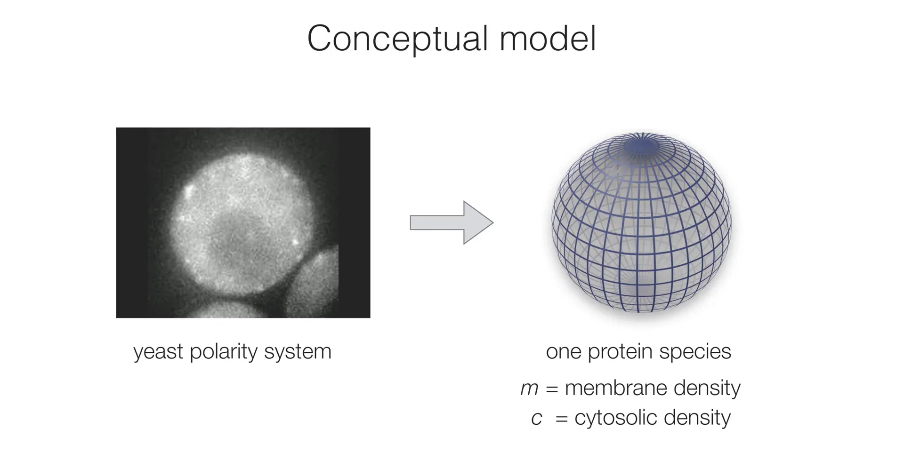
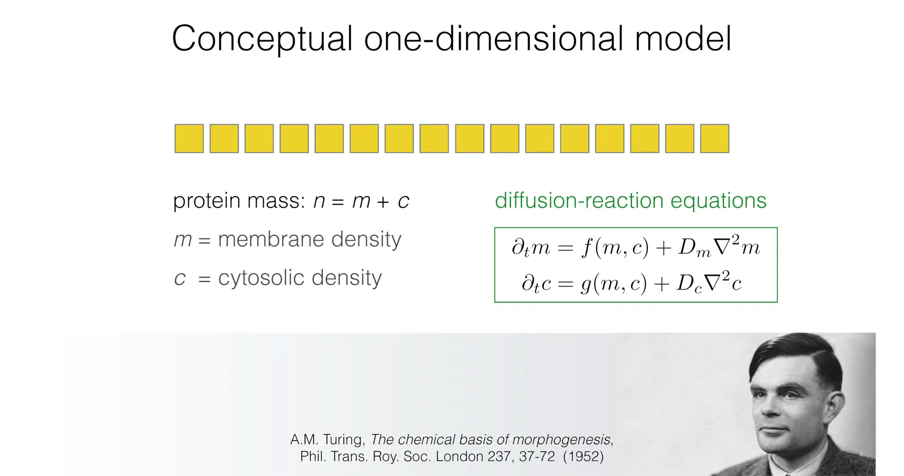
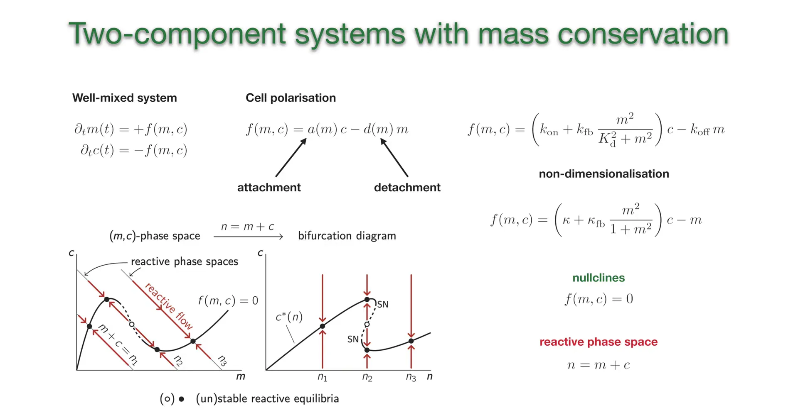
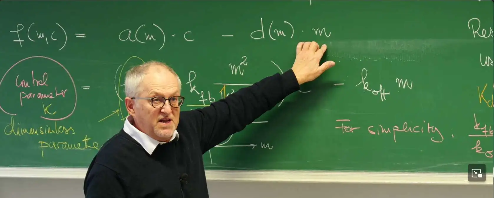

# Introduction

The previous lectures systematically explored the world of one-dimensional dynamical systems. Starting from **Lecture 2** with Ginzburg–Landau theory from physics and evolutionary game theory from biology, we revealed that complex phenomena can be reduced to low-dimensional nonlinear dynamical problems. The subsequent **Lecture 3** and **Lecture 4** deeply analyzed fixed points, stability (linear stability analysis), and how systems undergo qualitative changes through fundamental bifurcations (such as saddle-node, pitchfork, cusp, and transcritical bifurcations) when control parameters vary. These one-dimensional models provide a solid foundation for understanding state transitions.

However, self-organization phenomena in nature, especially in biology, have complexity far beyond what one-dimensional models can describe. These systems typically involve multiple interacting components, and their dynamical behavior is strictly constrained by fundamental physical laws. This lecture will extend from one-dimensional systems to two-dimensional systems and introduce a crucial physical constraint—the **mass conservation law**. This constraint not only makes the model closer to biological reality but also fundamentally changes the dynamical characteristics and analysis methods of the system.

This lecture will use the establishment of **cell polarity** as the entry point to this core biological problem. Cell polarity refers to the process by which substances inside a cell are unevenly distributed, thereby forming a specific functional axis (such as yeast budding). Behind this is the dynamic shuttling and interaction of proteins between the cytoplasm (a three-dimensional bulk) and the cell membrane (a two-dimensional surface). We will construct a two-dimensional dynamical model describing this process and first analyze its steady-state behavior under the "well-mixed" (i.e., ignoring spatial distribution) assumption. Through in-depth analysis of this system, we will master nullcline analysis in two-dimensional systems, bifurcation diagram construction, and how to use the **Jacobian Matrix** for rigorous linear stability analysis. This is not only a direct extension of the one-dimensional stability analysis from the first four lectures but will also reveal how the mass conservation constraint ($m+c=n$) fundamentally simplifies system dynamics (e.g., by introducing a zero eigenvalue).


Understanding mass-conserving systems in this lecture lays the theoretical foundation for introducing spatial dimensions in subsequent lectures and exploring spatiotemporal self-organization patterns such as **Turing Patterns**. At the same time, this lecture's analysis of conserving systems will form a sharp contrast with the **next lecture**, which studies open systems that do not satisfy mass conservation (such as biological clocks) and their resulting **Oscillation** behavior (such as Hopf Bifurcation).

# 1. Conceptual Model - From Cell Polarity to Mass-Conserving Systems

In **Lecture 4**, through analyzing the "contact process" (an epidemic model), we explored transcritical bifurcation. This lecture will show how this seemingly abstract infection model corresponds to a core biophysical problem: the establishment of **cell polarity**. This analogy will naturally lead to a two-dimensional dynamical system and introduce a crucial physical constraint—**mass conservation**.

## 1.1 Biological Background - From "Infection" to "Protein Recruitment"

First, let's construct a conceptual model. The starting point of this lecture is a specific biological problem: **Cell Polarity**. A typical example is the budding reproduction of yeast. How does a cell "know" where to form a "bud" at a specific location? This requires the cell to break its own symmetry and highly concentrate specific proteins (such as Cdc42) at a certain point on the membrane. This point will subsequently organize actin cables, pushing the cell membrane to grow outward and form a new daughter cell.


However, the real biochemical network that achieves this function is extremely complex. It involves multiple proteins (such as Cdc42, Bem1, GEFs, GAPs, etc.) cycling between active and inactive states, and their shuttling between the cytoplasm and cell membrane.


Facing such a complex network, the task of theoretical physicists is not to reproduce every detail but to build a **Conceptual Model** that captures the core principles governing system behavior. Therefore, we simplify this complex system to contain only one "protagonist": a protein that can switch between two states.



These two states are:

**$c(t)$:** The concentration of protein freely diffusing in the Cytosol.

**$m(t)$:** The concentration (or density) of protein attached to the Membrane.

These two quantities constitute the state variables of a two-dimensional dynamical system. The conversion process between them forms a correspondence with the infection model from **Lecture 4**:

1.**Detachment**: Proteins on the membrane $m$ will spontaneously detach and return to the cytoplasm $c$. This is mathematically equivalent to the "**Recovery**" of infected individuals ($M \xrightarrow{\delta} C$).

2.**Attachment**: Proteins in the cytoplasm $c$ will attach to the membrane.

3.**Recruitment**: Crucially, this attachment process is regulated by **positive feedback**. Proteins $m$ already "settled" on the membrane will "recruit" more $c$ to their vicinity. This "**Recruitment**" process ($m + c \rightarrow m + m$) is dynamically identical to the "**Infection**" process of viruses ($M + C \xrightarrow{\lambda} M + M$).


This positive feedback-driven protein aggregation is the physical basis for cells to establish polarity.

## 1.2 Mass Conservation Law - A Key Physical Constraint

In the above model, proteins only shuttle back and forth between the cytoplasm and cell membrane compartments—they are neither created out of nothing nor destroyed. This means that at any moment, the total amount $n$ of this protein in the system is constant.

This fundamental physical constraint is called the **Mass Conservation Law**. Mathematically, it manifests as an algebraic constraint:

$$
m(t) + c(t) = n
$$

This conservation law has profound significance at two levels:

1.**Dynamical constraint**: It reduces the degrees of freedom of a two-dimensional system ($m$ and $c$) to one dimension. Once $m$ and $n$ are known, the value of $c$ is immediately determined as $c = n - m$.

2.**Control parameter**: Biologically, cells can change the total protein amount $n$ by regulating gene expression (i.e., protein production rate). Therefore, $n$ is not just a constant—it is a key **control parameter**. By changing $n$, cells can drive the system across **bifurcation points**, achieving (for example) a "switch" from uniform distribution to polarized state. This is the key connection between dynamical systems theory and biological function.

## 1.3 Reaction-Diffusion Framework





To more comprehensively describe this system, we need to consider two types of physical processes: local biochemical reactions (attachment/detachment) and spatial diffusion. In 1952, Alan Turing proposed a general framework for describing such systems in his pioneering paper—the **Reaction-Diffusion Equations**.

For a two-component system, its most general form is:
$$
\begin{aligned}
\partial_t m &= f(m,c) + D_m \nabla^2 m \\
\partial_t c &= g(m,c) + D_c \nabla^2 c
\end{aligned}
$$

The meaning of each part is as follows:

* $\partial_t m$ and $\partial_t c$: The time rate of change of membrane protein and cytoplasmic protein concentrations.

* $f(m,c)$ and $g(m,c)$: **Reaction terms**. In Turing's original model ($f$ and $g$ are independent of each other), these usually represent production and degradation of substances.

* $D_m \nabla^2 m$ and $D_c \nabla^2 c$: **Diffusion terms**. $D$ is the diffusion coefficient, and $\nabla^2$ (the Laplacian operator) describes the net flow of substances from high-concentration regions to low-concentration regions.

Now, let's apply the **mass conservation constraint** from Section 1.2 to this framework. Since proteins only switch between the $m$ and $c$ states ($c \leftrightarrow m$), any local "reaction" (attachment) that causes $m$ to increase by one unit must simultaneously cause $c$ to decrease by one unit. Therefore, the reaction terms $f$ and $g$ must strictly satisfy:

$$
g(m,c) = -f(m,c)
$$

This negative sign is the core characteristic of mass-conserving systems. It transforms the equation system into:
$$
\begin{aligned}
\partial_t m &= f(m,c) + D_m \nabla^2 m \\
\partial_t c &= -f(m,c) + D_c \nabla^2 c
\end{aligned}
$$
This is fundamentally different from non-conserving Turing systems (where $f, g$ are independent) and will lead to fundamentally different dynamical behavior.

**Analysis path for this lecture:**
Before introducing space (diffusion terms) and exploring complex **Turing patterns**, we must first understand the system's basic reaction dynamics. Therefore, this lecture will temporarily ignore spatial dimensions, i.e., assume the system is "**well-mixed**." This is equivalent to setting diffusion coefficients to zero ($D_m = D_c = 0$), thereby simplifying complex partial differential equations (PDEs) into ordinary differential equations (ODEs). Analysis of this zero-dimensional system (fixed points, stability, bifurcations) is a necessary prerequisite for understanding subsequent spatiotemporal pattern formation.

# 2. Reaction Dynamics and Model Nondimensionalization

In Section 1, we have simplified the complex cell polarity problem into a two-component ($m$ and $c$) conceptual model, with the core being the mass conservation law $g(m,c) = -f(m,c)$. Now, the task is to construct a specific mathematical form for this "reaction term" $f(m,c)$ that reflects biological mechanisms (especially the "recruitment"/positive feedback mentioned in Section 1).

## 2.1 Constructing the Reaction Term $f(m,c)$

The reaction term $f(m,c)$ represents the net growth rate of membrane protein $m$. It can be decomposed into two competing processes: attachment ($c \to m$) and detachment ($m \to c$).

$$
f(m, c) = \text{Attachment rate} - \text{Detachment rate}
$$

These two rates can be modeled as:

**Attachment rate $a(m)c$**: The rate at which proteins attach from the cytoplasm to the membrane should be proportional to the available protein concentration $c$ in the cytoplasm. The attachment rate coefficient $a(m)$ itself can depend on the membrane protein concentration $m$ (i.e., positive feedback).

**Detachment rate $d(m)m$**: The rate at which proteins detach from the membrane back to the cytoplasm should be proportional to the protein concentration $m$ already on the membrane.

Therefore, the general form of the dynamical equation is:

$$
f(m, c) = a(m)c - d(m)m
$$

The key to cell polarity formation is a **positive feedback** mechanism: proteins $m$ already attached to the membrane can promote ("recruit") more $c$ to attach to the membrane. To reflect this in the model, we introduce a nonlinear form for the attachment rate coefficient $a(m)$:

$$
a(m) = k_{\text{on}} + k_{\text{fb}} \frac{m^2}{K_d^2 + m^2}
$$


The physical meaning of each term is:

**$k_{\text{on}}$**: **Basal attachment rate** constant. This represents the spontaneous attachment process that occurs even when there is no protein on the membrane ($m=0$).

**$k_{\text{fb}} \frac{m^2}{K_d^2 + m^2}$**: **Positive feedback (recruitment) term**. This is a **second-order Hill function** describing a cooperative effect:

 * **$m^2$ (second order)**: Implies that at least two membrane protein molecules must act cooperatively to effectively recruit new proteins. This causes this term to grow slowly (quadratically) when $m$ is small.
 
 * **$K_d$ (half-maximal effect concentration)**: Defines the concentration scale at which feedback begins to "saturate."
 
 * **$k_{\text{fb}}$ (maximum feedback rate)**: When membrane protein concentration is very high ($m \gg K_d$), this term approaches a maximum value $k_{\text{fb}}$. This reflects the physical limits of chemical reactions.

To simplify the model, we assume the detachment rate is constant, i.e., $d(m) = k_{\text{off}}$. Combining all these terms, we obtain the complete reaction dynamics equation with physical dimensions:

$$
f(m, c) = \left(k_{\text{on}} + k_{\text{fb}} \frac{m^2}{K_d^2 + m^2} \right) c - k_{\text{off}} m
$$





## 2.2 Nondimensionalization

This equation contains four rate parameters ($k_{\text{on}}, k_{\text{fb}}, K_d, k_{\text{off}}$), plus a total concentration $n$, making analysis complex. In theoretical physics, a powerful technique is **nondimensionalization**, which redefines units for time, concentration, and other variables to reduce the number of independent parameters in the model, thereby revealing the system's most essential control parameters.

We take the following steps for nondimensionalization:

1.**Rescale time**: Choose the time unit as the average detachment time $k_{\text{off}}^{-1}$. Define the new dimensionless time $\tau = t \cdot k_{\text{off}}$. This is equivalent to dividing both sides of the entire dynamical equation $\partial_t m = f(m,c)$ by $k_{\text{off}}$. The original equation becomes:

$$
\partial_{\tau} m = \left(\frac{k_{\text{on}}}{k_{\text{off}}} + \frac{k_{\text{fb}}}{k_{\text{off}}} \frac{m^2}{K_d^2 + m^2} \right) c - m
$$

2.**Rescale concentration**: Choose the concentration unit as the half-maximal effect concentration $K_d$. Define new dimensionless concentrations $\tilde{m} = m/K_d$ and $\tilde{c} = c/K_d$ (thus $m = K_d \tilde{m}, c = K_d \tilde{c}$). Substituting into the above:
$$
\partial_{\tau} (K_d \tilde{m}) = \left(\frac{k_{\text{on}}}{k_{\text{off}}} + \frac{k_{\text{fb}}}{k_{\text{off}}} \frac{(K_d \tilde{m})^2}{K_d^2 + (K_d \tilde{m})^2} \right) (K_d \tilde{c}) - (K_d \tilde{m})
$$

Factoring out $K_d^2$ from the denominator and canceling the common factor $K_d$:

$$
\partial_{\tau} \tilde{m} = \left(\frac{k_{\text{on}}}{k_{\text{off}}} + \frac{k_{\text{fb}}}{k_{\text{off}}} \frac{\tilde{m}^2}{1 + \tilde{m}^2} \right) \tilde{c} - \tilde{m}
$$

3.**Define dimensionless parameters and simplify**:
For brevity, we will continue using $m, c, t$ to denote the dimensionless quantities.

The above transformation produces two dimensionless parameter combinations:

$\kappa = \frac{k_{\text{on}}}{k_{\text{off}}}$: The ratio of basal attachment rate to detachment rate.

$\kappa_{\text{fb}} = \frac{k_{\text{fb}}}{k_{\text{off}}}$: The ratio of maximum feedback rate to detachment rate.

For further simplification, this lecture will make a **choice**: only study the case where $\kappa_{\text{fb}} = 1$. This is equivalent to fixing the feedback strength and specifically studying the effect of the basal attachment rate $\kappa$.

After nondimensionalization and simplification, the reaction term finally becomes a concise form containing only a single parameter $\kappa$:

$$
f(m, c) = \left(\kappa + \frac{m^2}{1 + m^2}\right) c - m
$$

Nondimensionalization is not just mathematical simplification—it reveals a profound physical fact: the qualitative behavior of this complex system (for example, whether there is only one steady state or multiple steady states) is essentially determined by only **two** control parameters:

**$\kappa$** (the ratio of basal attachment to detachment rates).

**$n$** (the dimensionless total protein concentration).

This greatly simplifies the exploration of system behavior, which is the bifurcation analysis in the next section.


# 3. Zero-Dimensional System Analysis - Fixed Points and Bifurcations

Section 2, through constructing reaction terms and performing nondimensionalization, ultimately simplified the complex biological model into a set of dynamical equations. This lecture will begin analyzing the steady-state behavior of this zero-dimensional (i.e., "well-mixed") system. Its dynamics is described by the following system of equations:

$$
\begin{aligned}
\frac{d}{dt}m &= f(m, c) \\
\frac{d}{dt}c &= -f(m, c)
\end{aligned}
$$

simultaneously satisfying the constraint $m + c = n$.

## 3.1 Nullcline Analysis

The condition for the system to reach an equilibrium state (i.e., **fixed point**) is that the time derivatives of all variables are zero. For this system, this means $\frac{d}{dt}m = 0$ and $\frac{d}{dt}c = 0$, which simplify to the same requirement: $f(m,c) = 0$.

In the $(m,c)$ phase space, the set of all points satisfying $f(m,c) = 0$ is called the **Nullcline**. This line represents all **possible** equilibrium points of the system (i.e., points where the reaction dynamics itself reaches equilibrium without the mass conservation constraint).

According to the derivation in Section 2 (but keeping $\kappa_{fb}$ as an independent parameter), the nullcline equation corresponding to $f(m,c)=0$ is:

$$
c^{*}(m) = \frac{m}{\kappa + \kappa_{fb} \frac{m^2}{1 + m^2}}
$$

The nonlinear characteristics of this function $c^*(m)$ are key to understanding system behavior.

* As $m \to 0$, the denominator $\approx \kappa$, so $c^* \approx m/\kappa$ (linear growth).

* As $m \to \infty$, $\frac{m^2}{1 + m^2} \to 1$, the denominator $\approx \kappa + \kappa_{fb}$, so $c^* \approx m/(\kappa + \kappa_{fb})$ (also linear growth, but with smaller slope).

* **The key point**: The parameter $\kappa_{fb}$ controls the strength of positive feedback. Only when positive feedback is strong enough (i.e., $\kappa_{fb}$ is large enough, mathematically $\kappa_{fb} > 8\kappa$) will the cooperative effect in the intermediate region cause the curve to bulge, forming a "hump," thus giving the entire curve the characteristic "S" shape (or "N" shape as the professor calls it).

## 3.2 Graphical Method for Finding Fixed Points and Bifurcations

The nullcline $c = c^*(m)$ provides all possible equilibrium points of the system. However, in a specific system with mass conservation, not all these points can be accessed. The system must also satisfy the **mass conservation constraint** introduced in Section 1.2:

$$
c = n - m
$$

Therefore, the **true fixed points** of the system at a given total concentration $n$ must **simultaneously satisfy** both conditions.

In the $(m,c)$ phase space, this is geometrically interpreted as the **intersection** of two curves:

1.**S-shaped nullcline**: $c = c^{*}(m)$ (equilibrium of reaction)

2.**Conservation line**: $c = n - m$ (constraint of mass)


This graphical method provides an extremely intuitive way to understand system behavior. The conservation line $c = n - m$ has a fixed slope of -1, and its intercept on the $c$-axis is exactly the control parameter $n$. Therefore, changing the total protein concentration $n$ (for example, by changing gene expression) is equivalent to **translating this line with slope -1 up or down in parallel** in phase space.

By observing changes in intersections, we can clearly see bifurcations occurring:

* When $n$ is very small (like $n_1$) or very large (like $n_3$), the line has **only one intersection** with the S-shaped curve. This means the system has only one unique steady state and is **monostable**.

* When $n$ is in some intermediate range (like $n_2$), the line has **three intersections** with the S-shaped curve. This means the system has three possible steady states and is **bistable** (Section 4 will prove that the middle point is unstable).

* As $n$ changes continuously, the number of fixed points changes from 1 to 3, and then back to 1. This qualitative change in the number and nature of fixed points is a **bifurcation**.

* Specifically, when transitioning from monostable "into" the bistable region (and when "leaving"), the conservation line becomes **tangent** to the "knee" of the nullcline. At this point, two fixed points (one stable, one unstable) collide and annihilate. This type of bifurcation is precisely the **Saddle-Node Bifurcation** discussed in detail in **Lecture 3**.

By systematically changing $n$ and recording all steady-state concentration values ($m^*$ or $c^*$) corresponding to intersections, we can construct the system's **Bifurcation Diagram**. This diagram uses the control parameter $n$ as the horizontal axis and steady-state concentration (such as $c^*$) as the vertical axis, clearly showing the classic S-shaped bistability curve—a core tool for understanding how the system "switches."

## 3.3 Python Simulation

The following Python code practice section reproduces the above theoretical analysis using the parameter set kappa = 0.02 and k_fb = 1.6.

```python
import numpy as np
import matplotlib.pyplot as plt
plt.style.use('dark_background')
kappa = 0.02
k_fb  = 1.6
def a(m):
    return kappa + k_fb * m**2 / (1.0 + m**2)
def ap(m):
    return k_fb * (2.0*m) / (1.0 + m**2)**2
def f(m, c):
    return a(m) * c - m
def c_nullcline(m):
    return m / a(m)
def g(m, n):
    return a(m) * (n - m) - m
def gm(m, n):
    return ap(m) * (n - m) - a(m) - 1.0
def sn_m_values(m_min=1e-6, m_max=2.5, num=5000):
    m = np.linspace(m_min, m_max, num)
    H = a(m) * (a(m) + 1.0) / ap(m) - m
    idx = np.where(np.sign(H[:-1]) * np.sign(H[1:]) < 0)[0]
    roots = []
    for i in idx:
        lo, hi = m[i], m[i+1]
        f_lo = a(lo) * (a(lo) + 1.0) / ap(lo) - lo
        f_hi = a(hi) * (a(hi) + 1.0) / ap(hi) - hi
        for _ in range(20):
            mid = 0.5 * (lo + hi)
            f_mid = a(mid) * (a(mid) + 1.0) / ap(mid) - mid
            if f_lo * f_mid <= 0:
                hi, f_hi = mid, f_mid
            else:
                lo, f_lo = mid, f_mid
        roots.append(0.5 * (lo + hi))
    return np.array(roots)
sn_ms = sn_m_values()
# Get the two saddle-node m values
sn_m1, sn_m2 = sn_ms[0], sn_ms[1]
sn_ns = sn_ms + (a(sn_ms) + 1.0) / ap(sn_ms)
sn_cs = sn_ns - sn_ms
n_low  = 0.7 * float(np.min(sn_ns))
n_mid  = np.mean(sn_ns) + 0.1
n_high = 1.2 * float(np.max(sn_ns))
n_list = [n_low, n_mid, n_high]
n_labels = ["$n_1$", "$n_2$", "$n_3$"]

def equilibria_on_n(n, m_grid=np.linspace(1e-6, 2.5, 2000)):
    y = g(m_grid, n)
    idx = np.where(np.sign(y[:-1]) * np.sign(y[1:]) <= 0)[0]
    roots = []
    for i in idx:
        lo, hi = m_grid[i], m_grid[i+1]
        f_lo, f_hi = y[i], y[i+1]
        m_star = 0.5 * (lo + hi)
        for _ in range(20):
            mid = 0.5 * (lo + hi)
            f_mid = g(mid, n)
            if f_lo * f_mid <= 0:
                hi, f_hi = mid, f_mid
            else:
                lo, f_lo = mid, f_mid
        m_star = 0.5 * (lo + hi)
        c_star = n - m_star
        stab = gm(m_star, n) < 0.0
        roots.append((m_star, c_star, stab))
    return roots
def plot_flow_arrows(n, eqs, ax, m_max_plot):
    m_stars_sorted = sorted([eq[0] for eq in eqs])
    arrow_props = dict(arrowstyle="->", color="red", lw=1.5, ls='-')
    if len(m_stars_sorted) == 1:
        m_stable = m_stars_sorted[0]
        m_start_1 = m_stable - 0.4
        m_end_1   = m_stable - 0.1
        if m_start_1 > 0.05:
            ax.annotate("", xy=(m_end_1, n - m_end_1), xytext=(m_start_1, n - m_start_1),
                         arrowprops=arrow_props)
        m_start_2 = m_stable + 0.4
        m_end_2   = m_stable + 0.1
        if m_start_2 < m_max_plot:
            ax.annotate("", xy=(m_end_2, n - m_end_2), xytext=(m_start_2, n - m_start_2),
                         arrowprops=arrow_props)
    elif len(m_stars_sorted) == 3:
        m_low_stable, m_unstable, m_high_stable = m_stars_sorted
        m_start_1 = m_unstable - 0.05
        m_end_1   = m_low_stable + 0.05
        ax.annotate("", xy=(m_end_1, n - m_end_1), xytext=(m_start_1, n - m_start_1),
                     arrowprops=arrow_props)
        m_start_2 = m_unstable + 0.05
        m_end_2   = m_high_stable - 0.05
        ax.annotate("", xy=(m_end_2, n - m_end_2), xytext=(m_start_2, n - m_start_2),
                     arrowprops=arrow_props)
        m_start_3 = m_low_stable - 0.1
        if m_start_3 > 0.05:
            ax.annotate("", xy=(m_low_stable-0.02, n - (m_low_stable-0.02)), xytext=(m_start_3, n - m_start_3),
                         arrowprops=arrow_props)
        m_start_4 = m_high_stable + 0.2
        if m_start_4 < m_max_plot:
            ax.annotate("", xy=(m_high_stable+0.02, n - (m_high_stable+0.02)), xytext=(m_start_4, n - m_start_4),
                         arrowprops=arrow_props)
fig, (ax1, ax2) = plt.subplots(1, 2, figsize=(12, 5))
ax1.set_facecolor('black')
ax2.set_facecolor('black')
fig.patch.set_facecolor('black')

# Phase space with segmented f=0 nullcline
m_max = 2.0
m = np.linspace(1e-6, m_max, 3000)
c_nc = c_nullcline(m)

# Draw f=0 as solid for m<=sn_m1 and m>=sn_m2, dashed for sn_m1<m<sn_m2
mask_left  = m <= sn_m1
mask_mid   = (m > sn_m1) & (m < sn_m2)
mask_right = m >= sn_m2

ax1.plot(m[mask_left],  c_nc[mask_left],  linewidth=2, color='white', label="$f(m,c)=0$")
ax1.plot(m[mask_mid],   c_nc[mask_mid],   linestyle="--", linewidth=2, color='white')
ax1.plot(m[mask_right], c_nc[mask_right], linewidth=2, color='white')

# Plot n lines and equilibria
for i, n in enumerate(n_list):
    m_line = np.linspace(0.0, min(m_max, n), 600)
    c_line = n - m_line
    ax1.plot(m_line, c_line, linewidth=1.2, color='gray')
    # equilibria markers
    eqs = equilibria_on_n(n, np.linspace(1e-6, m_max, 2000))
    for (m_star, c_star, stable) in eqs:
        if stable:
            ax1.plot(m_star, c_star, marker="o", markersize=8, color='white', zorder=5)
        else:
            ax1.plot(m_star, c_star, marker="o", markersize=9, markerfacecolor="none",
                     markeredgewidth=2.0, color='white', zorder=6)
    # arrows along flow (skip vicinity of roots)
    pts = np.linspace(0.12, 0.88, 6) * (min(m_max, n))
    for mi in pts:
        ci = n - mi
        if abs(g(mi, n)) < 2e-3:  # avoid near equilibria
            continue
        s = 0.06 * min(m_max, n)  # step
        dx, dy = (s, -s) if g(mi, n) > 0 else (-s, s)
        ax1.annotate("", xy=(mi+dx, ci+dy), xytext=(mi, ci),
                     arrowprops=dict(arrowstyle="->", color="red", lw=1.2))

ax1.text(0.1, n_list[0] - 0.1, "$n_1$", fontsize=12, color='gray')
ax1.text(0.1, n_list[1] - 0.1, "$n_2$", fontsize=12, color='gray')
ax1.text(0.1, n_list[2] - 0.1, "$n_3$", fontsize=12, color='gray')
ax1.text(1.2, 2.0, "$f(m,c) = 0$", fontsize=12, color='white')
ax1.text(0.6, 1.6, "reactive flow", fontsize=12, rotation=-40, color='red')
ax1.set_xlim(0, m_max)
ax1.set_ylim(0, float(np.nanmax(c_nc))*1.05)
ax1.set_xlabel("m", fontsize=14, color='white')
ax1.set_ylabel("c", fontsize=14, color='white')
ax1.set_title("(m,c)-phase space (only unstable segment dashed)", fontsize=14, color='white')
ax1.grid(True, linestyle="--", alpha=0.3, color='gray')
ax1.legend(loc="best")
ax1.tick_params(colors='white')

# Bifurcation diagram
m_branch = np.linspace(1e-6, m_max, 2000)
c_branch = c_nullcline(m_branch)
n_branch = m_branch + c_branch
stab_branch = gm(m_branch, n_branch) < 0.0
mask = stab_branch.astype(int)
change_idx = np.where(mask[1:] != mask[:-1])[0] + 1
segments = np.split(np.arange(len(m_branch)), change_idx)

for seg in segments:
    if stab_branch[seg[0]]:
        style = "-"
    else:
        style = (0, (5, 3))
        
    ax2.plot(n_branch[seg], c_branch[seg], linestyle=style, linewidth=2, color='white')
ylim_top = 2.5
ax2.set_ylim(-0.1, ylim_top) 

for i, n in enumerate(n_list):
    ax2.text(n, -0.05, n_labels[i], ha='center', va='top', fontsize=12, color='white')
    
    eqs = equilibria_on_n(n, np.linspace(1e-6, m_max, 2000))
    eqs_sorted = sorted(eqs, key=lambda x: x[1])
    if len(eqs_sorted) == 1:
        c_star = eqs_sorted[0][1]
        ax2.annotate("", xy=(n, c_star - 0.1), xytext=(n, -0.1),
                    arrowprops=dict(arrowstyle="->", color="red", lw=1.5))
        ax2.plot(n, c_star, marker="o", markersize=9, color='white')

    elif len(eqs_sorted) == 3:
        c_low_stable = eqs_sorted[0][1]
        c_unstable = eqs_sorted[1][1]
        c_high_stable = eqs_sorted[2][1]

        ax2.annotate("", xy=(n, c_low_stable - 0.1), xytext=(n, -0.1),
                    arrowprops=dict(arrowstyle="->", color="red", lw=1.5))

        ax2.annotate("", xy=(n, c_low_stable + 0.1), xytext=(n, c_unstable - 0.1),
                    arrowprops=dict(arrowstyle="->", color="red", lw=1.5))

        if n != n_list[1]: 
            ax2.annotate("", xy=(n, ylim_top - 0.1), xytext=(n, c_high_stable + 0.1),
                        arrowprops=dict(arrowstyle="->", color="red", lw=1.5))
            ax2.plot(n, c_high_stable, marker="o", markersize=9, color='white')
        ax2.plot(n, c_unstable, marker="o", markersize=9, markerfacecolor="black", markeredgecolor='white', mew=1.5)
        ax2.plot(n, c_low_stable, marker="o", markersize=9, color='white')

if n_list[0] in [n_low, n_mid, n_high]:
    eqs_n1 = equilibria_on_n(n_list[0], np.linspace(1e-6, m_max, 2000))
    eqs_n1_sorted = sorted(eqs_n1, key=lambda x: x[1])
    if len(eqs_n1_sorted) == 1:
        c_star_n1 = eqs_n1_sorted[0][1]
        ax2.annotate("", xy=(n_list[0], c_star_n1 + 0.1), xytext=(n_list[0], ylim_top - 0.1),
                    arrowprops=dict(arrowstyle="->", color="red", lw=1.5))
if n_list[2] in [n_low, n_mid, n_high]:
    eqs_n3 = equilibria_on_n(n_list[2], np.linspace(1e-6, m_max, 2000))
    eqs_n3_sorted = sorted(eqs_n3, key=lambda x: x[1])
    if len(eqs_n3_sorted) == 1:
        c_star_n3 = eqs_n3_sorted[0][1]
        ax2.annotate("", xy=(n_list[2], c_star_n3 + 0.1), xytext=(n_list[2], ylim_top - 0.1),
                    arrowprops=dict(arrowstyle="->", color="red", lw=1.5))
ax2.text(0.2, 1.0, "$c^*(n)$", fontsize=14, rotation=50, color='white')
ax2.set_xlabel("n", fontsize=14, color='white')
ax2.set_ylabel("$c^*$", fontsize=14, color='white')
ax2.set_title("Bifurcation diagram", fontsize=14, color='white')
ax2.grid(True, linestyle="--", alpha=0.3, color='gray')
ax2.tick_params(colors='white')
plt.tight_layout()
plt.savefig("combined_diagram.png", dpi=200, bbox_inches='tight')
plt.show()
```


**Left panel ((m,c)-phase space)**: Shows the $(m,c)$ phase space. The white curve is the N-shaped **nullcline** $f(m,c)=0$. The code, through stability analysis, has already drawn the unstable equilibrium region as a **dashed line**. The three gray diagonal lines are the **conservation lines** $c=n-m$ at different total concentrations $n_1, n_2, n_3$.

**Fixed points (white dots)**: Are the intersections of the nullcline and conservation lines. At $n_1$ and $n_3$, the system has only one **stable** fixed point (solid circle); at $n_2$, the system is in the **bistable** region, with two stable fixed points (solid circles) and one unstable fixed point (open circle). The red "reactive flow" arrows show how the system will evolve to stable fixed points.

**Right panel (Bifurcation diagram)**: This diagram is the system's bifurcation diagram, plotting the steady-state concentration **$c^*$** (vertical axis) as a function of control parameter **$n$** (horizontal axis). This S-shaped (or Z-shaped) curve shows the bistable region bounded by two **Saddle-Node bifurcations (SN)**. The red arrows again indicate the final destination of the system starting from any initial state at $n_1, n_2, n_3$.


# 4. Linear Stability Analysis - From One-Dimensional Reduction to the Jacobian Matrix

The graphical method and Python simulation in Section 3 showed the **position** and **number** of fixed points (for example, three fixed points exist at $n_2$). However, this analysis did not mathematically rigorously prove which fixed points are stable (attractors) and which are unstable (repellers).

To answer this question, we need to perform **Linear Stability Analysis (LSA)**. This is the same method used in **Lecture 3**: apply a small perturbation $\delta u(t)$ near the fixed point $u^*$, then examine whether this perturbation grows exponentially (unstable) or decays (stable) over time.

For this two-dimensional system, there are two equivalent but different analytical approaches.

## 4.1 Method One - Reduction to a One-Dimensional System





Due to the mass conservation law $c = n - m$, we can precisely reduce the two-dimensional system to a one-dimensional system involving only the variable $m$:

$$
\frac{d}{dt}m = f(m, c) \quad \xrightarrow{\text{substitute } c=n-m} \quad \frac{d}{dt}m = f(m, n-m)
$$

Now the problem is transformed into the one-dimensional system stability analysis already solved in **Lecture 3**. Consider a small perturbation $\delta m = m - m^*$ near the fixed point $m^*$. The linearized dynamics equation for the perturbation is:

$$
\frac{d}{dt}\delta m \approx \left. \frac{d}{dm}f(m, n-m) \right|_{m=m^*} \cdot \delta m
$$


Using the chain rule to calculate the derivative:
$$
\begin{aligned}
\frac{d}{dm}f(m, n-m) &= \left. \frac{\partial f}{\partial m} \right|_{(m^*, c^*)} \cdot \frac{dm}{dm} + \left. \frac{\partial f}{\partial c} \right|_{(m^*, c^*)} \cdot \frac{d(n-m)}{dm} \\
&= \left. \frac{\partial f}{\partial m} \right|_{(m^*, c^*)} + \left. \frac{\partial f}{\partial c} \right|_{(m^*, c^*)} \cdot (-1) \\
&= f_m - f_c
\end{aligned}
$$

where $f_m \equiv \left. \frac{\partial f}{\partial m} \right|_{(m^*, c^*)}$ and $f_c \equiv \left. \frac{\partial f}{\partial c} \right|_{(m^*, c^*)}$ are the partial derivatives of $f$ with respect to $m$ and $c$, evaluated at the fixed point $(m^*, c^*)$.

Therefore, the dynamics equation for the perturbation is:
$$
\frac{d}{dt}\delta m \approx (f_m - f_c) \cdot \delta m
$$
The exponential growth rate of this perturbation (i.e., the eigenvalue in the one-dimensional system) is $\sigma_{\text{loc}}(n) = f_m - f_c$. The stability criterion is very intuitive:

* If $\sigma_{\text{loc}}(n) < 0$, the perturbation decays exponentially over time, and the fixed point is **stable**.

* If $\sigma_{\text{loc}}(n) > 0$, the perturbation grows exponentially over time, and the fixed point is **unstable**.

This is what the $gm(m, n)$ function in the Python code from Section 3 calculates.

### Geometric Interpretation - The Slope Criterion

This analysis result has an elegant and powerful geometric interpretation. Recall the nullcline equation $c^*(m)$ from Section 3.1; its slope $s_{\text{nc}}$ can be obtained by differentiating $f(m, c^*(m)) = 0$ using the implicit function theorem:

$$
\frac{d}{dm}f(m, c^*(m)) = 0 \implies \frac{\partial f}{\partial m} + \frac{\partial f}{\partial c} \cdot \frac{dc^*}{dm} = 0 \implies f_m + f_c \cdot s_{\text{nc}} = 0
$$

Solving for the nullcline slope: $s_{\text{nc}} = -\frac{f_m}{f_c}$.

In the current biological model, the attachment rate $a(m)$ must be positive, so $f_c = \frac{\partial f}{\partial c} = a(m) > 0$. With this condition, we can rewrite the stability criterion $\sigma_{\text{loc}} < 0$ (i.e., $f_m - f_c < 0$) as:

$$
f_m < f_c \implies \frac{f_m}{f_c} < 1 \implies -\frac{f_m}{f_c} > -1
$$

Substituting $s_{\text{nc}}$, we obtain the final **geometric stability criterion**:

$$
s_{\text{nc}} > -1
$$

**Physical meaning**: The geometric meaning of this result is: a fixed point is **stable** if and only if at that point, the **slope of the nullcline (S-shaped curve) $s_{\text{nc}}$** is greater than the **slope of the conservation line (slope -1)**.

* On the upper and lower branches of the S-shaped curve, the curve slope $s_{\text{nc}} > -1$ (the curve is "flatter" than -1), so they are **stable**.

* On the middle branch of the S-shaped curve, the curve slope $s_{\text{nc}} < -1$ (the curve is "steeper" than -1), so it is **unstable**.


## 4.2 Method Two - Full Two-Dimensional System Jacobian Matrix Analysis

The second method is more general—it directly analyzes the original two-dimensional system without pre-reducing dimensions using the conservation law. This method is crucial for systems in the next lecture that **do not satisfy mass conservation**.


Consider a small perturbation vector $\delta \vec{u} = \begin{pmatrix} \delta m \\ \delta c \end{pmatrix}$ to the fixed point $(m^*, c^*)$. Its linearized dynamics is determined by the **Jacobian Matrix** $\mathcal{J}$:

$$
\frac{d}{dt} \delta \vec{u} = \mathcal{J} \cdot \delta \vec{u}
$$

where the Jacobian matrix $\mathcal{J}$ is composed of the partial derivatives of the reaction terms $\begin{pmatrix} f \\ -f \end{pmatrix}$:

$$
\mathcal{J} = 
\begin{pmatrix}
\frac{\partial f}{\partial m} & \frac{\partial f}{\partial c} \\
\frac{\partial (-f)}{\partial m} & \frac{\partial (-f)}{\partial c}
\end{pmatrix} 
= 
\begin{pmatrix}
f_m & f_c \\
-f_m & -f_c
\end{pmatrix}
$$

The stability of the system is determined by the **eigenvalues** $\sigma$ of $\mathcal{J}$. The eigenvalues are solutions to the characteristic equation $\det(\mathcal{J} - \sigma I) = 0$:

$$
\begin{vmatrix}
f_m - \sigma & f_c \\
-f_m & -f_c - \sigma
\end{vmatrix} = (f_m - \sigma)(-f_c - \sigma) - (f_c)(-f_m) = 0
$$

Expanding:

$$
-f_m f_c - f_m \sigma + f_c \sigma + \sigma^2 + f_m f_c = 0
$$


$$
\sigma^2 + (f_c - f_m) \sigma = 0 \implies \sigma \left( \sigma - (f_m - f_c) \right) = 0
$$

Solving this equation, we obtain two eigenvalues:

$$
\sigma^{(1)} = 0
$$
$$
\sigma^{(2)} = f_m - f_c
$$

This result is very profound—it perfectly reveals the dynamical structure of mass-conserving systems:

**Eigenvalue $\sigma^{(2)} = f_m - f_c$**:

This is **exactly the same** as the growth rate $\sigma_{\text{loc}}$ obtained from Method One (1D reduction). Its corresponding eigenvector is $\vec{e}^{(2)} = \begin{pmatrix} 1 \\ -1 \end{pmatrix}$. A perturbation in the direction $\begin{pmatrix} 1 \\ -1 \end{pmatrix}$ (i.e., $\delta m = 1, \delta c = -1$) satisfies $\delta m + \delta c = 0$, meaning this perturbation **preserves total mass conservation**. Therefore, $\sigma^{(2)}$ determines the stability of the system **along the conservation line $m+c=n$**.


**Eigenvalue $\sigma^{(1)} = 0$**:

This is a completely new discovery—it is **a universal feature of all systems with conservation laws**. Its corresponding eigenvector is $\vec{e}^{(1)} = \begin{pmatrix} f_c \\ -f_m \end{pmatrix}$, which is precisely the **tangent direction** of the nullcline at that point.

**Physical meaning**: A zero eigenvalue means the system is **neutrally stable** in the $\vec{e}^{(1)}$ direction. If a perturbation (for example, external injection of a small amount of protein) pushes the system from conservation line $m+c=n$ to a neighboring $m+c=n+\epsilon$, the system will neither actively return to the original line nor deviate further. The system "doesn't care" which conservation line it's on—it will simply find a new equilibrium point on the new conservation line. The entire **Nullcline** is actually a **continuous family of equilibrium points (Line of Equilibria)**, and the specific conservation law $m+c=n$ only selects one or a few specific points from it as the system's fixed points.

## 4.3 Comparison of the Two Analysis Methods

The Python code in Section 3 has already marked stability on the bifurcation diagram using solid lines (stable) and dashed lines (unstable) by calculating the sign of $gm(m, n)$ (i.e., $\sigma_{\text{loc}} = f_m - f_c$). Therefore, no repeated code is needed here; instead, we use a summary table to compare these two analysis methods:

| Feature | Method One: Reduction to 1D System | Method Two: Full 2D Jacobian Matrix |
| :--- | :--- | :--- |
| **Core concept** | Use $c = n - m$ to reduce system dimension | Linearize in the complete 2D phase space |
| **Mathematical tool** | 1D Taylor expansion (chain rule) | $2 \times 2$ Jacobian matrix $\mathcal{J}$ |
| **Eigenvalues obtained** | $\sigma_{\text{loc}} = f_m - f_c$ | $\sigma^{(1)} = 0$ **and** $\sigma^{(2)} = f_m - f_c$ |
| **Physical interpretation** | Reveals stability **along** the conservation line (within physical constraints). | Reveals the complete dynamical structure:<br> • $\sigma^{(2)}$: Stability along the conservation line (same as left). <br> • $\sigma^{(1)}$: Neutral stability along the nullcline due to **mass conservation**. |
| **Geometric criterion** | $s_{\text{nc}} > -1$ (stable) | (same as left) |


# Summary

This lecture, through exhaustive analysis of a two-dimensional dynamical system constrained by mass conservation, achieved the key transition from one-dimensional systems to higher-dimensional, more realistic biophysical models. The core thread of the lecture can be summarized as follows:

1.With cell polarity as background, we drew an analogy between the "infection" model dynamics from **Lecture 4** and the protein "recruitment" process, thereby abstracting a two-component ($m, c$) dynamical model. Its core is the **mass conservation law** $m+c=n$.

2.The **nonlinear positive feedback** introduced in the model (namely the $m^2$ cooperative term) was proven to be the source of the S-shaped (or N-shaped) nullcline, which is a necessary condition for achieving complex behavior such as bistability.

3.Through graphical methods, we found that system fixed points are the intersections of the **nullcline** $f(m,c)=0$ and the **conservation line** $c=n-m$. Changing the total protein concentration $n$ as a control parameter is geometrically equivalent to translating the conservation line in parallel, causing fixed point pairs to be created or annihilated at tangent points—this is precisely the **Saddle-Node Bifurcation** studied in **Lecture 3**.

4.Linear Stability Analysis (LSA) was used to determine the stability of fixed points. This can be accomplished through two equivalent methods: one is **reduction to a one-dimensional system** using the conservation law, obtaining growth rate $\sigma_{\text{loc}} = f_m - f_c$; the other is using the more general **two-dimensional Jacobian matrix** analysis.

5.**Jacobian matrix** analysis $\mathcal{J} = \begin{pmatrix} f_m & f_c \\ -f_m & -f_c \end{pmatrix}$ revealed a universal feature of mass-conserving systems: the existence of a **zero eigenvalue** ($\sigma^{(1)} = 0$). This eigenvalue corresponds to neutral stability along the nullcline (i.e., the family of equilibrium points) direction, and is a direct mathematical consequence of the conservation law $g=-f$.

At this point, the behavior of this system under spatial homogeneity (well-mixed conditions) has been fully analyzed. However, cell polarity itself is a spatial phenomenon. This lecture's analysis is the necessary groundwork for understanding spatial pattern formation. In subsequent lectures, when diffusion terms are reintroduced, under certain conditions, spatially homogeneous steady states will become unstable, spontaneously giving rise to non-uniform protein distributions and forming **Turing Patterns**.

This lecture's analysis also establishes contrast for the **next lecture (6. Dynamical Systems: Two-Dimensional Non-Conserving Systems and Oscillators)**. The next lecture will explore a fundamentally different scenario: what happens if the system **does not satisfy mass conservation** (for example, in open systems where proteins are continuously synthesized and degraded)? In this case, the constraint $g=-f$ is broken, and the Jacobian matrix becomes the more general form $\mathcal{J} = \begin{pmatrix} f_m & f_c \\ g_m & g_c \end{pmatrix}$. The zero eigenvalue is no longer necessarily present; instead, eigenvalues can become **complex numbers**. Complex eigenvalues are the mathematical signature of **Oscillation** behavior. When the real part of a pair of conjugate complex eigenvalues changes from negative to positive, the system undergoes **Hopf Bifurcation**, the stable fixed point becomes unstable, and a stable **Limit Cycle** is born—sustained oscillations. This will open the door to understanding rhythmic phenomena such as biological clocks and predator-prey cycles.
