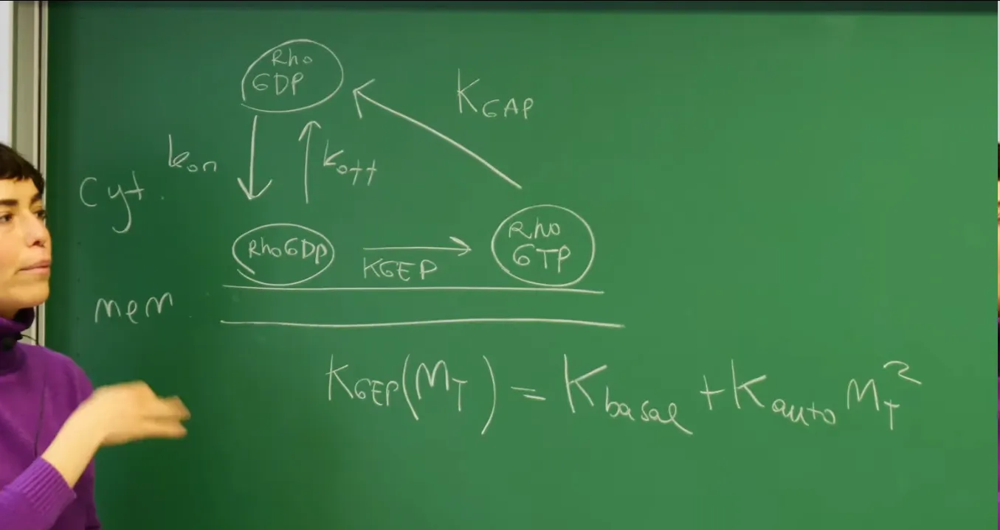
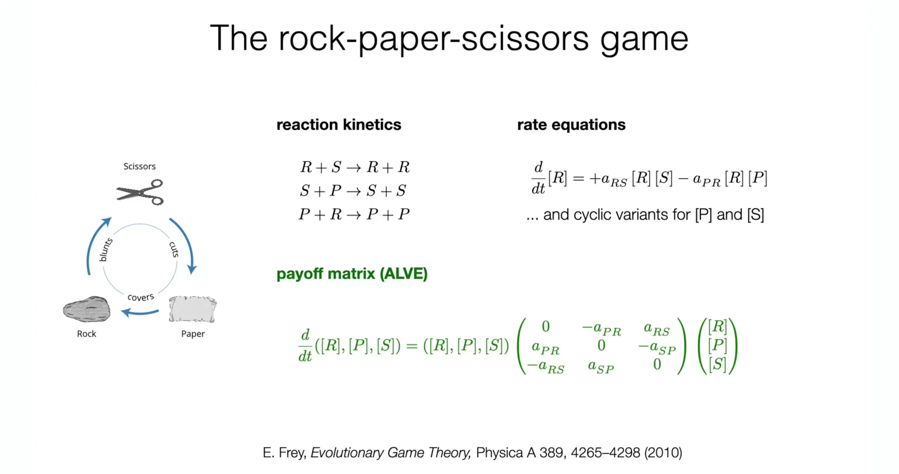
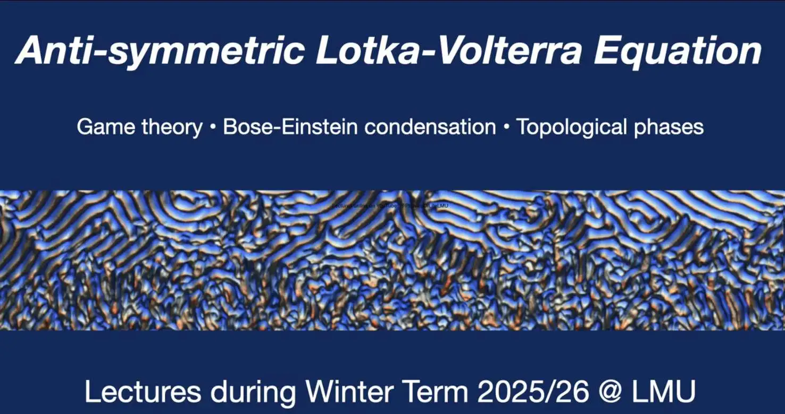

# Introduction

In **Lecture 6**, the course built a standard "toolbox" for analyzing two-dimensional dynamical systems. Through calculating two key invariants of the Jacobian Matrix—Trace ($\tau$) and Determinant ($\Delta$)—Linear Stability Analysis (LSA) near fixed points was established. This analytical framework successfully classified fixed points as stable/unstable nodes, saddles, or spirals, and preliminarily explored how nonlinear damping leads to the generation of Limit Cycles through Hopf bifurcation or relaxation oscillation mechanisms.

However, Linear Stability Analysis is inherently **local**. It can only precisely describe system behavior in an infinitesimally small neighborhood of fixed points. For a state far from fixed points, or when a fixed point appears as an unstable spiral, linear theory cannot predict the ultimate fate of orbits: **Will the system diverge to infinity, or will it converge to a stable, self-sustained periodic orbit?** To answer this core question about the system's **Global Dynamics**, more powerful topological tools must be introduced.

This lecture will first introduce the **Poincaré-Bendixson Theorem**. As a cornerstone of two-dimensional dynamical systems theory, this theorem provides a non-constructive but highly discriminating criterion: in bounded regions of the two-dimensional phase plane, if no stable fixed points exist and orbits do not diverge, then Chaos is strictly excluded, and the system must evolve into a limit cycle. This provides a rigorous mathematical foundation for proving the existence of periodic oscillations.

Subsequently, the course will apply this theoretical framework to two specific complex systems, demonstrating the interdisciplinary universality of dynamical systems theory:

1.**Biophysics domain**: Analyzing the **RhoGTPase cycle**, a key biochemical network regulating cell polarity. The analysis will show how to use the physical constraint of **Mass Conservation** to rigorously reduce the original three-dimensional biochemical reaction network to a two-dimensional system, and then combine the Poincaré-Bendixson theorem with Hopf bifurcation theory to reveal the mechanism of spontaneous oscillation in intracellular protein concentrations.

2.**Evolutionary game theory domain**: Exploring the **Rock-Paper-Scissors (RPS)** model. By introducing **Replicator Dynamics**, the competitive evolution of strategies is modeled as a system of nonlinear ordinary differential equations. This echoes game theory concepts from **Lecture 2** while demonstrating the mathematical isomorphism between ecological cycles and biochemical oscillations.

This lecture's derivation of replicator equations lays the foundation for subsequent courses. In the following **Lecture 8**, we will introduce **Lyapunov Functions** to deeply analyze global stability and condensation phenomena in such systems, and finally break the "spatially well-mixed" assumption by introducing the **Diffusion Equation**, formally beginning the exploration of spatially extended systems and Turing Patterns.

# 1. The Poincaré-Bendixson Theorem

To bridge the gap from local analysis to global dynamics, this lecture first introduces the Poincaré-Bendixson theorem. In the previous lecture, through Linear Stability Analysis (LSA), although we could precisely determine flow field characteristics near fixed points (such as spiral points, saddle points), this analysis fails far from fixed points. For a two-dimensional continuous dynamical system $\frac{d\vec{x}}{dt} = \vec{F}(\vec{x})$ (where $\vec{x} = (x, y)$), to answer the global question "where will the system ultimately go," the Jacobian matrix alone is insufficient. The Poincaré-Bendixson theorem is precisely the key topological tool that fills this gap, providing rigorous mathematical criteria for determining the existence of nonlinear oscillations (limit cycles).

## 1.1 Physical Statement of the Theorem

The theorem describes the long-term asymptotic behavior of constrained systems on the two-dimensional plane. Compared to complex mathematical formulations, the lecture provided a more intuitive statement from a physicist's perspective:


Statement of the Poincaré-Bendixson theorem. It specifies the two possibilities for bounded orbits under long-term evolution in two dimensions.

If for time $t \geq t_0$, an orbit of the system satisfies the following two geometric conditions:

1.**Boundedness**: The orbit always remains within a finite, closed phase space region $R$ and does not diverge to infinity (i.e., the system's energy or substance concentration does not increase infinitely).

2.**No Singular Points**: The orbit does not approach any singular points during evolution. "Singular points" here specifically refers to Fixed Points or Steady States of the system, i.e., points where $\vec{F}(\vec{x}) = 0$.

Then, the long-term behavior of this orbit as $t \to \infty$ has only two possibilities:

1.**Periodic orbit**: It closes upon itself to become a periodic cycle.

2.**Approaches a limit cycle**: It asymptotically approaches a limit cycle.

This means that in two-dimensional systems satisfying the above conditions, the system's final state is either perfect circulation or asymptotic approach to such circulation.

## 1.2 Profound Implications of the Theorem - Exclusion of Chaos

The importance of the Poincaré-Bendixson theorem lies not only in what it affirms (the existence of limit cycles) but also in what it denies. It uses rigorous topological language to point out: **Chaos does not exist in two-dimensional autonomous dynamical systems.**

The typical characteristics of chaotic phenomena (such as the three-dimensional Lorenz attractor) are that orbits are bounded and do not converge to fixed points, yet never repeat (aperiodic), exhibiting extremely complex "entangled" structures. However, in the two-dimensional planar phase space, since **orbits cannot self-intersect** (this is determined by the uniqueness of differential equation solutions), an orbit confined to a finite region, with no fixed points to go to, does not have enough spatial dimensions to exhibit the complex folding structures required by chaos. Its only choice is to "bite its own tail" to form a closed loop, or infinitely approach a closed loop.

Therefore, for two-dimensional systems, as long as divergence is excluded (i.e., the orbit is bounded) and stasis (fixed points) is excluded, the only remaining fate is **oscillation**.

## 1.3 Practical Strategy for the Theorem - The "Trapping Region" Method

In practical biophysical modeling, directly solving for analytical limit cycle solutions of nonlinear equations is usually impossible. The Poincaré-Bendixson theorem provides a powerful **non-constructive proof strategy**—through geometric construction alone, one can prove the existence of oscillations.

This strategy contains two core steps:

1.**Step One: Construct a "Trapping Region"**

First, a closed region $R$ needs to be demarcated in phase space. This is usually based on physical constraints, such as non-negative substance concentrations ($x, y \ge 0$) and upper limits due to mass conservation or maximum carrying capacity. The key is to prove that on the boundary of region $R$, the vector field $\vec{F}(\vec{x})$ points inward or tangent to the boundary. This ensures that any trajectory entering this region cannot escape, thus satisfying the theorem's "boundedness" condition.

2.**Step Two: Exclude Stable Fixed Points**

Next, all fixed points contained within this "trapping region" $R$ must be examined. Using the Linear Stability Analysis tools established in the previous lecture (trace $\tau$ and determinant $\Delta$ of the Jacobian matrix), analyze the stability of these fixed points.

If within trapping region $R$ there exists a unique fixed point, and it is verified through calculation that this fixed point is **unstable** (for example, an unstable spiral with $\Delta > 0, \tau > 0$), then according to the Poincaré-Bendixson theorem:

* The orbit is confined within $R$ (cannot escape to infinity).

* The orbit is "repelled" by the unstable fixed point (cannot remain stationary).

* **Conclusion**: The orbit must converge to a limit cycle within $R$.

This method transforms the complex global problem of "proving the existence of nonlinear oscillations" into two relatively simple steps: verifying physical boundaries (boundedness) and calculating local derivatives (instability). This is precisely the core logic for analyzing the RhoGTPase oscillator later.

# 2. Biophysical Oscillator - The RhoGTPase Cycle

To demonstrate the practical application of the Poincaré-Bendixson theorem, this section introduces a specific biophysical system—the **RhoGTPase cycle**. This is an extremely central biochemical reaction network in cell biology that, through nonlinear positive and negative feedback mechanisms, can generate spontaneous spatiotemporal oscillations on cell membranes. This section will start from the biological background, progressively build the reaction dynamics model, and transform it into a three-component system of nonlinear ordinary differential equations, laying the foundation for subsequent dimensionality reduction and phase plane analysis.

## 2.1 Biological Background - Molecular Switches Inside Cells

RhoGTPases (such as Rho, Rac, Cdc42) are a class of G proteins belonging to the Ras superfamily that act as key "molecular switches" inside cells, regulating basic life activities such as cell polarity, cytoskeleton reorganization, and cell movement.

The dynamical behavior of this system is mainly determined by the following two core characteristics:

1.**Conformational state switching**: RhoGTPases can cyclically switch between two conformations:
 
 * **Inactive State**: Bound to GDP (RhoGDP).
 
 * **Active State**: Bound to GTP (RhoGTP).

2.**Spatial localization cycle**: These proteins have different distribution preferences in different spatial regions of the cell:
  
  * **Cytosol**: RhoGTPases mainly exist in inactive form (RhoGDP) and remain soluble by binding to GDI (Guanine nucleotide dissociation inhibitors).
  
 * **Membrane**: The active form (RhoGTP) must anchor to the cell membrane to function.

This cycling process of shuttling between membrane and cytosol while switching between active and inactive states constitutes the spatiotemporal foundation of intracellular signal transduction. In particular, local aggregation and oscillation of active RhoGTP on the membrane (such as actin waves) is the driving force for establishing cell polarity and cell migration.

## 2.2 Establishing the Reaction Model and Nonlinear Feedback

To capture the core dynamics of this system, the course constructed a minimal model containing three key components:



Schematic diagram of the RhoGTPase cycle reaction network. Shows shuttling between Cytosol and Membrane, as well as conversion between GDP and GTP states. The key nonlinear positive feedback is reflected in the $K_{GEP}$ rate.

The three core variables defined by the model are:

* $M_T$: **Membrane** active form (RhoGTP) concentration.

* $M_D$: **Membrane** inactive form (RhoGDP) concentration.

* $C_D$: **Cytosol** inactive form (RhoGDP) concentration.

The dynamics of this biochemical network is driven by two competing feedback loops, which are the "engine" for oscillation formation:

1.**Non-linear Positive Feedback**:

The active form $M_T$ on the membrane can recruit and activate **GEF** (Guanine nucleotide exchange factors). The function of GEF is to catalyze the conversion of $M_D$ to $M_T$. This forms an autocatalytic process: the presence of $M_T$ promotes the production of more $M_T$.

Mathematically, this nonlinear activation rate $K_{GEP}$ is modeled as a function of $M_T$:

$$
    K_{GEP}(M_T) = K_{basal} + K_{auto} M_T^2
$$

* $K_{basal}$: Basal activation rate, representing spontaneous background activation.

* $K_{auto} M_T^2$: **Autocatalytic term**. This is a second-order Hill function form, indicating that $M_T$ amplifies its own production rate in a highly nonlinear cooperative manner. It is precisely this squared term ($M_T^2$) that introduces the nonlinearity required by the system and is key to generating instability and oscillations.

2.**Negative Feedback**:

The active form $M_T$ on the membrane is also recognized by **GAP** (GTPase-activating proteins). GAP promotes GTP hydrolysis, inactivating $M_T$ and, in the model, is assumed to subsequently dissociate from the membrane, returning to the cytosol as $C_D$. This process is described by rate constant $K_{GAP}$, constituting a negative feedback loop that limits unlimited growth of $M_T$.

## 2.3 Deriving the Three-Component Dynamical Equations

Based on the above reaction network diagram, using the **Law of Mass Action**, we can write the system of ordinary differential equations (ODEs) describing how the concentrations of the three components change over time.

The system of equations is:
$$
\begin{cases}
\displaystyle \frac{d}{dt} M_T = -K_{GAP} M_T + K_{GEP}(M_T) M_D \\
\displaystyle \frac{d}{dt} M_D = k_{on} C_D - k_{off} M_D - K_{GEP}(M_T) M_D \\
\displaystyle \frac{d}{dt} C_D = -k_{on} C_D + k_{off} M_D + K_{GAP} M_T
\end{cases}
$$

**Detailed physical meaning of equations**:

1.**Evolution of active membrane protein $M_T$**:

$$\frac{d}{dt} M_T = \underbrace{K_{GEP}(M_T) M_D}_{\text{Activation}} - \underbrace{K_{GAP} M_T}_{\text{Inactivation \& Extraction}}$$
 * **Activation term**: From conversion of membrane inactive form $M_D$. Since $K_{GEP}$ contains $M_T^2$, this term represents autocatalytic positive feedback growth.
 
 * **Consumption term**: Inactivated by GAP and removed from membrane.

2.**Evolution of inactive membrane protein $M_D$**:

$$\frac{d}{dt} M_D = \underbrace{k_{on} C_D}_{\text{Attachment}} - \underbrace{k_{off} M_D}_{\text{Detachment}} - \underbrace{K_{GEP}(M_T) M_D}_{\text{Consumed to become } M_T}$$

This is the change in the "substrate" pool on the membrane. It is replenished from cytosol ($C_D$), lost due to spontaneous detachment, and consumed by conversion to active form ($M_T$).

3.**Evolution of cytosolic protein $C_D$**:

$$\frac{d}{dt} C_D = - \underbrace{k_{on} C_D}_{\text{Attachment to membrane}} + \underbrace{k_{off} M_D}_{\text{Detachment from } M_D} + \underbrace{K_{GAP} M_T}_{\text{Inactivation from } M_T}$$

The cytosol acts as a "reserve pool" and "recycling station" for proteins. It decreases due to attachment to membrane while receiving proteins dissociating back from both membrane states ($M_T, M_D$).

This set of equations completely describes the system's dynamics. At first glance, this is a three-dimensional system, but this will create difficulties for subsequent phase plane analysis. The next section will show how to reduce dimensions using physical conservation laws.

# 3. Model Simplification and Nullcline Analysis

The RhoGTPase cycle is originally a complex dynamical system involving three variables ($M_T, M_D, C_D$). However, the application of the Poincaré-Bendixson theorem is strictly limited to the two-dimensional plane. Therefore, to utilize this powerful topological tool, we must first find a physically reasonable method to reduce the system's dimension. This section shows how to use conservation laws as physical constraints to precisely map the three-dimensional biochemical network to a two-dimensional dynamical plane, and reveal the geometric structure of its fixed points through nullcline analysis.

## 3.1 Key Step - Dimensionality Reduction Based on Mass Conservation

Observing the three dynamical equations derived in the previous section, a hidden conservation property can be found. Adding the three equations together, all terms describing state transitions (such as activation, inactivation, attachment, detachment) cancel in pairs:

$$
\frac{d}{dt} (M_T + M_D + C_D) = 0
$$

This mathematical result corresponds to profound physical meaning: **Mass Conservation**. In the closed cellular system, although proteins constantly flow between different states (active/inactive) and locations (membrane/cytosol), their total number of molecules (or total concentration) $n$ always remains constant:
$$
n = M_T + M_D + C_D = \text{const}
$$

This conservation law constitutes a linear algebraic constraint, compressing the system's original three-dimensional state space to a two-dimensional plane. Once the two membrane states $M_T$ and $M_D$ are determined, the cytosol concentration $C_D$ is uniquely determined as:
$$
C_D = n - M_T - M_D
$$
Using this relationship, $C_D$ can be eliminated from the equation system, thus rigorously reducing the problem to a two-dimensional system in $(M_T, M_D)$.

## 3.2 Simplified Two-Dimensional Dynamical System

Substituting the expression for $C_D$ into the original equations and performing parameter simplification (nondimensionalization, setting $K_{basal}=1, K_{auto}=1, k_{on}=1, k_{off}=0$ to focus on core mechanisms), we finally obtain the following two-dimensional dynamical system:

$$
\begin{cases}
\displaystyle \frac{d}{dt} M_T = -\mu M_T + (1+M_T^2) M_D \\
\displaystyle \frac{d}{dt} M_D = (n - M_T - M_D) - (1+M_T^2) M_D
\end{cases}
$$

System behavior is now completely determined by two dimensionless control parameters:

* **$\mu = K_{GAP} / k_{on}$**: Represents the **relative inactivation rate**. It is the ratio of membrane protein inactivation/dissociation rate to cytosolic protein attachment rate, measuring the strength of negative feedback.

* **$n$**: Represents the **total protein mass**. It determines the "total resource" of the system, i.e., how much protein is available for circulation.

## 3.3 Nullcline Analysis

To understand the phase portrait structure of this two-dimensional system, we first need to find the **Nullclines**. Nullclines are defined as curves in the phase plane where the rate of change of a particular variable is zero, and fixed points are the intersections of these curves.

Setting $\frac{d}{dt} M_T = 0$ and $\frac{d}{dt} M_D = 0$, we obtain two nullcline equations respectively:

1.**$M_T$-Nullcline ($\dot{M}_T = 0$)**:

$$
M_D = \frac{\mu M_T}{1 + M_T^2}
$$

**Physical meaning**: This curve describes the dynamic equilibrium of active membrane form $M_T$.

  * The numerator $\mu M_T$ represents linear inactivation outflow.

  * The denominator $(1+M_T^2)$ represents nonlinear autocatalytic activation inflow.

  * This curve exhibits a typical **N-shape (or S-shape)** characteristic: linear growth at low $M_T$, suppressed in the middle due to autocatalysis ($M_T^2$), approaching zero at high $M_T$. This nonlinear shape is the geometric origin of the system's multistability or oscillation.

2.**$M_D$-Nullcline ($\dot{M}_D = 0$)**:
$$
M_D = \frac{n - M_T}{2 + M_T^2}
$$

**Physical meaning**: This curve describes the dynamic equilibrium of inactive membrane form $M_D$.
  * The numerator $(n - M_T)$ originates from attachment replenishment from cytosol $C_D$, reflecting resource limitation.
    
  * The denominator $(2 + M_T^2)$ represents $M_D$ consumption by conversion to $M_T$ or dissociation.


Schematic diagram of phase plane analysis for the RhoGTPase system. Horizontal axis is $M_T$, vertical axis is $M_D$. The figure shows two nullclines: the bell-shaped hump is the $\dot{M}_T=0$ nullcline, and the monotonically decreasing one is the $\dot{M}_D=0$ nullcline. The intersection of the two curves (white dot) is the system's fixed point. Arrows indicate flow field directions in different regions, suggesting rotational tendency around the fixed point.

## 3.4 Python Code Practice - Plotting Nullclines


The following code uses Python to plot the nullcline image from the board. By adjusting parameters $\mu$ and $n$, one can observe how these two curves intersect, thus determining the position of fixed points.

```python
import numpy as np
import matplotlib.pyplot as plt

# Set dark background style to match lecture board
plt.style.use('dark_background')

def plot_rho_nullclines(mu, n, mt_max=6):
    """
    Plots the nullclines for the 2D RhoGTPase model.
    
    Args:
        mu (float): Control parameter (relative inactivation rate).
        n (float): Control parameter (total protein mass).
        mt_max (float): Maximum M_T value for plotting range.
    """
    
    # Create an array for M_T values
    M_T = np.linspace(0, mt_max, 500)
    
    # 1. Calculate M_D for the M_T-nullcline (dM_T/dt = 0)
    # Equation: -mu*M_T + (1+M_T^2)*M_D = 0  =>  M_D = mu*M_T / (1+M_T^2)
    M_D_nullcline_T = (mu * M_T) / (1 + M_T**2)
    
    # 2. Calculate M_D for the M_D-nullcline (dM_D/dt = 0)
    # Equation: (n - M_T - M_D) - (1+M_T^2)*M_D = 0 
    # Derived: M_D = (n - M_T) / (2 + M_T^2)
    M_D_nullcline_D = (n - M_T) / (2 + M_T**2)
    
    # Filter out non-physical negative values (concentration cannot be negative)
    M_D_nullcline_D[M_D_nullcline_D < 0] = np.nan
    
    # Plotting
    plt.figure(figsize=(10, 7))
    
    # Plot M_T-nullcline (Red solid line)
    plt.plot(M_T, M_D_nullcline_T, 'r-', linewidth=2.5, label=r'$\dot{M}_T = 0$ nullcline')
    
    # Plot M_D-nullcline (Cyan dashed line)
    plt.plot(M_T, M_D_nullcline_D, 'c--', linewidth=2.5, label=r'$\dot{M}_D = 0$ nullcline')
    
    # Labeling
    plt.xlabel(r'Active (Membrane) $M_T$', color='white', fontsize=12)
    plt.ylabel(r'Inactive (Membrane) $M_D$', color='white', fontsize=12)
    plt.title(f'RhoGTPase Nullclines ($\mu={mu}, n={n}$)', color='white', fontsize=14)
    
    # Styling
    legend = plt.legend(fontsize=12)
    plt.setp(legend.get_texts(), color='white')
    plt.grid(True, linestyle=':', alpha=0.4, color='gray')
    
    # Set axes limits to focus on the relevant interaction area
    plt.ylim(0, n / 2 + 0.5) 
    plt.xlim(0, mt_max)
    
    # Ensure spines are visible in dark mode
    ax = plt.gca()
    for spine in ax.spines.values():
        spine.set_color('white')
    ax.tick_params(colors='white')

    plt.savefig('rho_nullclines.png', bbox_inches='tight')

# --- Example Usage ---
# Parameters chosen to replicate the crossing shown in the lecture board.
# mu=4.0 creates a pronounced "bell" shape.
# n=10.0 provides enough mass for the intersection to occur on the falling slope.
plot_rho_nullclines(mu=4.0, n=10.0, mt_max=6.0)
```


**Red solid line ($\dot{M}_T=0$)**: Shows a characteristic bell-shaped hump. This is caused by the nonlinear positive feedback of $M_T^2$: at low concentrations the autocatalytic effect is significant, elevating the $M_D$ required for equilibrium; but at high concentrations, $M_T^2$ is in the denominator (saturation effect), causing the curve to fall back.

**Cyan dashed line ($\dot{M}_D=0$)**: Shows a monotonically decreasing trend, reflecting that after total resource $n$ is occupied by $M_T$, less space remains for $M_D$.

**Intersection**: The intersection of the two curves is the system's fixed point. With parameter settings $\mu=4.0, n=10.0$, the intersection lies on the **descending segment** (negative slope region) of the red curve. Subsequent analysis will prove that when the intersection lies in this specific region, the fixed point often becomes unstable due to instability (Hopf bifurcation), generating limit cycle oscillations around this point in the phase plane.


# 4. Generation of Limit Cycles - Hopf Bifurcation

Now, through dimensionality reduction we have obtained a two-dimensional system, and using nullclines we have found the fixed point. This section will formally apply the strategy of the Poincaré-Bendixson theorem to prove the existence of oscillations. This is divided into two steps: first establishing the system's boundedness, then proving that the fixed point within the trapping region is unstable.

## 4.1 Constructing the "Trapping Region" and Boundedness

The primary prerequisite for applying the Poincaré-Bendixson theorem is the boundedness of orbits. In this biophysical model, this condition is naturally satisfied by physical constraints:

1.**Non-negativity**: Substance concentrations cannot be negative, i.e., $M_T \ge 0$ and $M_D \ge 0$.

2.**Mass conservation upper limit**: Since $M_T + M_D + C_D = n$ and $C_D \ge 0$, the sum of the two membrane states must be less than or equal to total mass, i.e., $M_T + M_D \le n$.

This means all dynamical behavior of the system is strictly confined to a right triangular region in the first quadrant of the phase plane:
$$\{(M_T, M_D) \mid M_T \ge 0, M_D \ge 0, M_T + M_D \le n\}$$
This is a closed bounded region, the "trapping region" required by the theorem. Any trajectory starting from physically reasonable initial conditions cannot escape from this triangle.

## 4.2 Linear Stability Analysis

Since orbits cannot escape, to prove the existence of a limit cycle, according to the Poincaré-Bendixson theorem, we only need to prove that the unique **fixed point $(M_T^*, M_D^*)$** within this trapping region **is unstable**.

For this purpose, we calculate the Jacobian Matrix $\mathcal{J}$ near the fixed point and analyze its trace $\tau$ and determinant $\Delta$.

By taking partial derivatives of the dynamical equations $\dot{M}_T$ and $\dot{M}_D$, we obtain the analytical form of the Jacobian matrix:

$$
\mathcal{J} = \begin{pmatrix}
\frac{\partial \dot{M}_T}{\partial M_T} & \frac{\partial \dot{M}_T}{\partial M_D} \\
\frac{\partial \dot{M}_D}{\partial M_T} & \frac{\partial \dot{M}_D}{\partial M_D}
\end{pmatrix}
= \begin{pmatrix}
-\mu + 2M_T^* M_D^* & 1 + (M_T^*)^2 \\
-1 - 2M_T^* M_D^* & -(2 + (M_T^*)^2)
\end{pmatrix}
$$

Based on this matrix, we can obtain two key invariants that determine stability:

**1. Trace ($\tau$): Instability Criterion**

$$
\tau = \text{tr}(\mathcal{J}) = \underbrace{2 M_T^* M_D^*}_{\text{Nonlinear positive feedback}} - \underbrace{\left( \mu + 2 + (M_T^*)^2 \right)}_{\text{Linear dissipation and damping}}
$$

* **Physical meaning**: The trace $\tau$ reflects the volume expansion rate (or amplitude growth rate) of the system near the fixed point.

    * **Positive term ($+2 M_T^* M_D^*$)**: Originates from the $M_T^2$ term in $K_{GEP}$. It represents the **Autocatalysis** mechanism, i.e., the positive feedback effect where active protein promotes its own production. This is the driving force for system instability.
    
    * **Negative terms ($-\dots$)**: Originate from inactivation rate $\mu$ and dissociation processes. These terms represent the system's **Dissipation** or damping, tending to suppress perturbations and return the system to stability.

When positive feedback is strong enough (i.e., $M_T^*$ and $M_D^*$ are large enough) to overcome all dissipation terms, $\tau$ becomes positive ($\tau > 0$). At this point, the fixed point loses stability, and small perturbations will grow exponentially over time.

**2. Determinant ($\Delta$): Fixed Point Type Criterion**

Directly calculating the determinant of the Jacobian matrix:

$$
\Delta = \det(\mathcal{J}) = (-\mu + 2M_T^* M_D^*)(-(2 + (M_T^*)^2)) - (1 + (M_T^*)^2)(-1 - 2M_T^* M_D^*)
$$

Simplifying the above expression, we obtain an explicit polynomial in terms of $M_T^*$ and parameters:

$$
\Delta = -2 M_T^* M_D^* + (M_T^*)^2\mu + (M_T^*)^2 + 2\mu + 1
$$

**Physical meaning and sign determination**: Although this expression contains negative terms, in the biophysically relevant parameter range discussed in the lecture, especially when the necessary geometric condition **$M_T^* > 1$** for oscillation is satisfied, it can be proven that $\Delta$ always remains positive.

**$\Delta > 0$** means the product of eigenvalues is positive, indicating that the two eigenvalues are either same-sign real numbers (nodes) or complex conjugates (spirals). This property strictly excludes the possibility of **Saddle Points ($\Delta < 0$)**, ensuring that the topological structure of the flow field around the fixed point is rotational or convergent/divergent, rather than hyperbolic escape.

In summary, when system parameters are adjusted such that **$\tau > 0$** and **$\Delta > 0$**, the fixed point becomes an **Unstable Spiral**. Orbits will not only be repelled from the fixed point but will also exhibit rotational characteristics—this is a necessary geometric condition for forming closed limit cycles.

**2. Determinant ($\Delta$): Fixed Point Type Criterion**

$$
\Delta = \det(\mathcal{J}) = \frac{(M_T^*)^2 - 1}{\dots} \quad (\text{Simplified qualitative form})
$$

**Physical meaning**: Although the complete algebraic expression for the determinant is cumbersome, the key lies in its sign. The lecture pointed out that in parameter regions where oscillations occur (i.e., when $\tau > 0$ is satisfied), this is usually accompanied by a geometric constraint **$M_T^* > 1$**.

When $M_T^* > 1$, it can be proven that **$\Delta > 0$**. This means eigenvalues are either same-sign real numbers (nodes) or complex conjugates (spirals), thus strictly excluding the possibility of saddle points (Saddle Point, $\Delta < 0$).

In summary, when system parameters are adjusted such that **$\tau > 0$** and **$\Delta > 0$**, the fixed point becomes an **Unstable Spiral**. Orbits will not only be repelled from the fixed point but will also exhibit rotational characteristics—this is a necessary geometric condition for forming closed limit cycles.

## 4.3 Finding Oscillation Conditions - Unstable Spiral

According to the classification established in the previous lecture, to obtain an **Unstable Spiral**, the system must simultaneously satisfy the following three mathematical conditions:

1.$\Delta > 0$: Determinant is positive (excludes saddle points).

2.$\tau > 0$: Trace is positive (system is unstable, amplitude grows).

3.$\tau^2 - 4\Delta < 0$: Discriminant is negative (eigenvalues are complex, producing rotation).

To find regions in parameter space $(\mu, n)$ that satisfy the above conditions, we need to connect the geometric position of fixed point $(M_T^*, M_D^*)$ with its algebraic properties.

### 1. Geometric Constraint: Why Must $M_T^* > 1$?

First observe the functional form of the $M_T$-nullcline $M_D = f(M_T) = \frac{\mu M_T}{1+M_T^2}$. Taking the derivative of this function to analyze its slope:
$$
f'(M_T) = \mu \frac{(1+M_T^2) - M_T(2M_T)}{(1+M_T^2)^2} = \mu \frac{1 - M_T^2}{(1+M_T^2)^2}
$$

From this we can see:

* When $M_T < 1$, slope is positive (nullcline is on ascending segment).

* When $M_T = 1$, slope is zero (peak).

* When **$M_T > 1$**, slope is negative (nullcline is on **descending segment**).

Physically, only on the descending segment ($M_T > 1$) can the growth rate of the autocatalytic term $M_T^2$ locally exceed the linear inactivation term, thus having the potential to produce instability. Therefore, **the fixed point being on the descending segment of the nullcline (i.e., $M_T^* > 1$) is a necessary geometric prerequisite for oscillation.**

### 2. Algebraic Proof - Sign Analysis of $\tau$ and $\Delta$

Using the fixed point condition $M_D^* = \frac{\mu M_T^*}{1+(M_T^*)^2}$, we can eliminate $M_D^*$ from the Jacobian matrix, obtaining expressions that depend only on $M_T^*$.

**Regarding trace $\tau$ (determining instability):**

Substituting $M_D^*$ into Jacobian matrix element $J_{11} = -\mu + 2M_T^* M_D^*$:

$$
J_{11} = -\mu + 2M_T^* \left( \frac{\mu M_T^*}{1+(M_T^*)^2} \right) = \mu \left( \frac{2(M_T^*)^2}{1+(M_T^*)^2} - 1 \right) = \mu \frac{(M_T^*)^2 - 1}{1+(M_T^*)^2}
$$

From this it is clearly visible that the sign of $J_{11}$ is directly determined by $(M_T^*)^2 - 1$.

* If $M_T^* < 1$, then $J_{11} < 0$, and combined with the always-negative $J_{22}$, total trace $\tau = J_{11} + J_{22}$ must be negative (system is stable).

* Only when **$M_T^* > 1$** does $J_{11}$ become positive (positive feedback dominates), making it **possible** for total trace $\tau$ to become positive (provided positive feedback is strong enough to overcome the damping of $J_{22}$).

**Regarding determinant $\Delta$ (determining fixed point type):**

Similarly substituting $M_D^*$ into the $\Delta$ polynomial derived in the previous section, after simplification:

$$
\Delta = \frac{\mu (M_T^{*4} + M_T^{*2} + 2)}{1 + (M_T^*)^2} + (1 + (M_T^*)^2)
$$

Observing the above expression, since $\mu > 0$ and $M_T^*$ is real, each term in the expression is positive. Within physically meaningful parameter ranges, $\Delta$ is always greater than 0. This means the system will never exhibit saddle points.


The physical picture of oscillation production now becomes very clear—we need to adjust parameters $n$ and $\mu$ to force the fixed point to move to the **descending segment ($M_T^* > 1$)** of the nullcline. In this region, $\Delta > 0$ is guaranteed, and as long as $M_T^*$ is large enough, the positive feedback term will lead to $\tau > 0$, thus triggering Hopf bifurcation and producing a limit cycle.

## 4.4 Hopf Bifurcation and Phase Diagram

To precisely delineate the oscillation region in parameter space $(\mu, n)$, we need to find the critical boundary satisfying the **Hopf bifurcation condition**. Strictly speaking, this boundary is defined by the following system of equations:

$$
\begin{cases}
\dot{M}_T = 0 \\
\dot{M}_D = 0 \\
\tau(\mu, n) = 0 \\
\Delta(\mu, n) > 0
\end{cases}
$$

The first two equations define the fixed point $(M_T^*, M_D^*)$, and the third equation defines the critical point of stability switching. To solve for this boundary, we need to establish the algebraic connection between control parameters and fixed points.

**1. Algebraic Equation for Fixed Points**

Recalling the nullcline equations, the fixed point is the intersection of two curves:
$$
M_D^* = \frac{\mu M_T^*}{1 + (M_T^*)^2} = \frac{n - M_T^*}{2 + (M_T^*)^2}
$$
By combining the above equalities, we can eliminate $M_D^*$, obtaining a **cubic equation** involving only active concentration $M_T^*$:

$$
(\mu + 1)(M_T^*)^3 - n(M_T^*)^2 + (2\mu + 1)M_T^* - n = 0
$$

**2. Logic Chain for Drawing Phase Diagram**

With this algebraic equation, we complete the logical chain from parameters to dynamical behavior:
1.**Solve**: For given parameters $(\mu, n)$, solve the above cubic equation to obtain fixed point $M_T^*$.

2.**Substitute**: Substitute $M_T^*$ back into expressions for $\tau$ and $\Delta$.

3.**Determine**:
  * If $\tau < 0$, system is in stable region (fixed point attracts).
  
  * If $\tau > 0$ and $\Delta > 0$, system is in oscillation region (limit cycle).
  
  * If $\tau = 0$ and $\Delta > 0$, system is on the **Hopf bifurcation boundary**.

**3. Bifurcation Phenomenon: Birth of Limit Cycle**

When parameter changes cross this $\tau=0$ boundary, the system undergoes qualitative change:

* **Before bifurcation ($\tau < 0$)**: Fixed point is a **stable spiral**, trajectories eventually come to rest.

* **After bifurcation ($\tau > 0$)**: Fixed point becomes an **unstable spiral**. Since the Poincaré-Bendixson theorem limits orbits from diverging (boundedness), repelled orbits are forced to curl into a closed ring—**Limit Cycle** is born.


$(\mu, n)$ phase diagram of the RhoGTPase system. The curve delineates the Hopf bifurcation boundary determined by the cubic equation and $\tau=0$. The enclosed "U-shaped" region is the Oscillations region.

**4. Physical Intuition of Phase Diagram**

From the phase diagram, it can be clearly seen that oscillations mainly occur in regions of large $\mu$ and large $n$. This reveals two core physical conditions for producing intracellular biochemical oscillations:

1.**Fast negative feedback (Large $\mu$)**: Large $\mu$ means once $M_T$ is produced, it will be rapidly inactivated and kicked back to cytosol. This "fast clearance" mechanism prevents the system from stagnating at some high-concentration steady state and is the driving force for instability.

2.**Sufficient substrate reserve (Large $n$)**: Large $n$ means there is a large $C_D$ reserve pool in cytosol. Even if membrane $M_T$ is rapidly cleared, the large reserve pool can quickly replenish $M_D$ to the membrane, providing raw materials for the next round of $M_T$ burst.

**Strong driving (high reserve) plus fast braking (high inactivation) leads to sustained oscillation of the system.**


## 4.5 Python Code Practice - Simulating the Rho Oscillator
In this code practice section, we directly verify the Hopf bifurcation analysis from the previous section through numerical integration.

The core approach is as follows:

1.Fix relative inactivation rate $\mu = 10.5$, only changing total mass $n$.

2.Select two representative parameters:

  - **Stable region**: $n = 15$, at this point trace $\tau < 0$, determinant $\Delta > 0$, fixed point is a stable spiral, all orbits eventually converge to steady state;
  
  - **Oscillatory region**: $n = 25$, at this point trace $\tau > 0$, determinant $\Delta > 0$, fixed point is an unstable spiral, orbits are repelled from steady state and trapped in the triangular trapping region, according to Poincaré-Bendixson theorem, system will converge to a stable limit cycle.
  
  - Phase portrait: Shows orbits starting from same initial condition converging to point or limit cycle under two parameter sets;
   
  - Time series: Shows evolution of $M_T(t)$ and $M_D(t)$ over time, contrasting "exponential decay to steady state" vs "long-period oscillation" differences.
   
```python
import numpy as np
import matplotlib.pyplot as plt
from scipy.integrate import solve_ivp

plt.style.use('dark_background')


def rho_2d_ode(t, y, mu, n):
    """
    Right-hand side of the 2D reduced RhoGTPase model.

    Parameters
    ----------
    t : float
        Time (not used explicitly, system is autonomous).
    y : array_like, shape (2,)
        State vector y = [M_T, M_D].
        M_T : active Rho on the membrane.
        M_D : inactive Rho on the membrane.
    mu : float
        Relative inactivation rate (strength of negative feedback).
    n : float
        Total protein mass (conservation: M_T + M_D + C_D = n).

    Returns
    -------
    dydt : list of float
        Time derivatives [dM_T/dt, dM_D/dt].
    """
    M_T, M_D = y

    # 2D ODE system (after eliminating C_D = n - M_T - M_D)
    dM_T = -mu * M_T + (1.0 + M_T**2) * M_D
    dM_D = (n - M_T - M_D) - (1.0 + M_T**2) * M_D

    return [dM_T, dM_D]


def simulate_rho(mu, n, y0, t_max, n_points=5000):
    """
    Integrate the Rho 2D ODE system for given parameters.

    Parameters
    ----------
    mu : float
        Relative inactivation rate.
    n : float
        Total protein mass.
    y0 : array_like, shape (2,)
        Initial condition [M_T(0), M_D(0)].
    t_max : float
        Final integration time.
    n_points : int, optional
        Number of time points for sampling the solution.

    Returns
    -------
    t : 1D ndarray
        Time points.
    sol : 2D ndarray
        Solution array with shape (2, len(t)).
        sol[0, :] : M_T(t)
        sol[1, :] : M_D(t)
    """
    t_span = (0.0, t_max)
    t_eval = np.linspace(t_span[0], t_span[1], n_points)

    sol = solve_ivp(
        rho_2d_ode,
        t_span,
        y0,
        t_eval=t_eval,
        args=(mu, n),
        rtol=1e-8,
        atol=1e-10
    )

    return sol.t, sol.y


def set_phase_limits(ax, M_T, M_D):
    """
    Set aesthetically pleasing limits and aspect ratio
    for a phase portrait panel.
    """
    mt_min, mt_max = M_T.min(), M_T.max()
    md_min, md_max = M_D.min(), M_D.max()

    # Add a small margin around the data range
    pad_x = 0.05 * (mt_max - mt_min) if mt_max > mt_min else 0.1
    pad_y = 0.05 * (md_max - md_min) if md_max > md_min else 0.1

    ax.set_xlim(mt_min - pad_x, mt_max + pad_x)
    ax.set_ylim(md_min - pad_y, md_max + pad_y)
    ax.set_aspect('equal', adjustable='box')


# -----------------------------
# Parameter choices and simulation
# -----------------------------
mu = 10.5              # fixed relative inactivation rate
n_stable = 15.0        # parameter in the stable-focus regime (tau < 0)
n_oscillatory = 25.0   # parameter in the oscillatory regime (tau > 0)

# Same initial condition for both parameter sets (inside the physical triangle)
y0 = [0.1, 0.1]

# Integrate the system in both regimes
t_stable, y_stable = simulate_rho(mu, n_stable, y0, t_max=200.0)
t_osc,    y_osc    = simulate_rho(mu, n_oscillatory, y0, t_max=400.0)

M_T_stable, M_D_stable = y_stable
M_T_osc,    M_D_osc    = y_osc

# For the oscillatory case, remove the initial transient and keep only
# the late-time motion on the limit cycle for the phase portrait
idx_transient = len(t_osc) // 2
M_T_osc_cycle = M_T_osc[idx_transient:]
M_D_osc_cycle = M_D_osc[idx_transient:]

# For the time series in the oscillatory regime, show only the last window_T
window_T = 100.0
t_max_osc = t_osc.max()
mask_osc_window = t_osc > (t_max_osc - window_T)

# -----------------------------
# Create a figure with phase portraits and time traces
# -----------------------------
fig, axes = plt.subplots(2, 2, figsize=(12, 8))  # no shared x-axis

ax_phase_stable = axes[0, 0]
ax_phase_osc    = axes[0, 1]
ax_time_stable  = axes[1, 0]
ax_time_osc     = axes[1, 1]

# --- (A) Phase portrait: stable focus ---
ax_phase_stable.plot(
    M_T_stable, M_D_stable,
    linewidth=2.0,
    label='trajectory'
)
ax_phase_stable.set_xlabel(r'$M_T$ (active membrane)')
ax_phase_stable.set_ylabel(r'$M_D$ (inactive membrane)')
ax_phase_stable.set_title(
    r'Stable focus: $\mu = 10.5,\ n = 15$',
    fontsize=11
)
ax_phase_stable.grid(alpha=0.3, linestyle=':')
set_phase_limits(ax_phase_stable, M_T_stable, M_D_stable)

# --- (B) Phase portrait: limit cycle (only late-time motion) ---
ax_phase_osc.plot(
    M_T_osc_cycle, M_D_osc_cycle,
    linewidth=2.0,
    label='trajectory'
)
ax_phase_osc.set_xlabel(r'$M_T$ (active membrane)')
ax_phase_osc.set_ylabel(r'$M_D$ (inactive membrane)')
ax_phase_osc.set_title(
    r'Limit cycle: $\mu = 10.5,\ n = 25$',
    fontsize=11
)
ax_phase_osc.grid(alpha=0.3, linestyle=':')
set_phase_limits(ax_phase_osc, M_T_osc_cycle, M_D_osc_cycle)

# --- (C) Time traces in the stable regime ---
ax_time_stable.plot(
    t_stable, M_T_stable,
    linewidth=1.8,
    label=r'$M_T(t)$'
)
ax_time_stable.plot(
    t_stable, M_D_stable,
    linewidth=1.2,
    linestyle='--',
    label=r'$M_D(t)$'
)
ax_time_stable.set_xlabel('time')
ax_time_stable.set_ylabel('concentration')
ax_time_stable.set_title(
    r'Time series (stable focus)',
    fontsize=11
)
ax_time_stable.legend(loc='upper right', fontsize=9)
ax_time_stable.grid(alpha=0.3, linestyle=':')

# --- (D) Time traces in the oscillatory regime (last window_T only) ---
ax_time_osc.plot(
    t_osc[mask_osc_window], M_T_osc[mask_osc_window],
    linewidth=1.8,
    label=r'$M_T(t)$'
)
ax_time_osc.plot(
    t_osc[mask_osc_window], M_D_osc[mask_osc_window],
    linewidth=1.2,
    linestyle='--',
    label=r'$M_D(t)$'
)
ax_time_osc.set_xlabel('time')
ax_time_osc.set_ylabel('concentration')
ax_time_osc.set_title(
    rf'Time series (limit cycle, last {window_T:.0f} time units)',
    fontsize=11
)
ax_time_osc.legend(loc='upper right', fontsize=9)
ax_time_osc.grid(alpha=0.3, linestyle=':')

# Global figure title (English caption)
fig.suptitle(
    "Figure 4.5  Numerical simulation of the 2D Rho oscillator\n"
    "Top: phase portraits. Bottom: time traces in stable vs. oscillatory regimes.",
    fontsize=12
)

# Make sure layout works well on a dark background
fig.tight_layout(rect=[0, 0.03, 1, 0.92])

# Save the figure with a dark-friendly background
plt.savefig(
    "rho_oscillator_phase_time.png",
    dpi=300,
    bbox_inches="tight"
)

plt.show()
```


The figure shows two typical dynamical behaviors of the RhoGTPase two-dimensional model under different parameter conditions, consistent with the Hopf bifurcation conclusions obtained from trace-determinant analysis.

In the **stable region** ($μ = 10.5, n = 15$), the trajectory in the phase portrait spirally converges to the unique fixed point, and the time series shows rapid decay followed by entering a stable steady state. This indicates that under these parameter conditions, the system's negative feedback action dominates, trace $τ < 0$, eigenvalues have negative real parts, so all perturbations eventually get damped out.

In contrast, in the **oscillatory region** ($μ = 10.5, n = 25$), the trajectory in the phase portrait no longer falls into the fixed point but is repelled onto a closed orbit; the time series shows sustained periodic oscillation with stable amplitude that no longer decays. This corresponds to an unstable spiral with $τ > 0, Δ > 0$: positive feedback (autocatalysis) is sufficient to overcome dissipation, forcing the system to run along closed trajectories in the bounded region. According to the Poincaré-Bendixson theorem, this is precisely the sufficient condition for a limit cycle to appear.

Overall, this set of numerical results verifies the key logical chain in the theoretical part: mass conservation → reduction to two-dimensional system → fixed point destabilization (Hopf) → appearance of stable limit cycle in bounded region. This indicates that the model has the ability to produce spontaneous oscillations and provides intuitive dynamical evidence for understanding the periodic dynamics of active Rho on cell membranes.


# 5. Evolutionary Game Theory - Rock-Paper-Scissors

The final part of the course shifts from intracellular biochemical networks to strategy competition in ecological and social systems. Using the classic **Rock-Paper-Scissors (RPS)** game as an example, this section demonstrates the universality of the dynamical systems framework: whether it's chemical reactions between molecules or interplay between species, their evolutionary laws can be described using the same mathematical language—nonlinear ordinary differential equations. Additionally, through examples from popular culture, such as the extended version game from "The Big Bang Theory," we see how this mathematical framework can easily generalize to complex systems with arbitrary numbers of strategies, revealing rich dynamical behavior from simple cyclic competition to the edge of chaos.

## 5.1 Zero-Sum Games and Replicator Dynamics

**Zero-Sum Games** refer to a strict competitive relationship: one party's gain necessarily equals another party's loss, with total system gain being zero. The most famous example is the RPS game known to all children.


Strategy network topology for zero-sum games. Left (S=3): Classic RPS cyclic dominance relationship. Middle (S=5): "Rock-Paper-Scissors-Lizard-Spock" extended version from "The Big Bang Theory." Right (S>>1): When the number of strategies is very large, the system exhibits complex network connection structures.

To add interest, the course cited a clip from the TV series "The Big Bang Theory," showing that when strategy space is extended (e.g., introducing "Lizard" and "Spock"), the game rules still maintain some anti-symmetric cyclic structure.


Scene from "The Big Bang Theory" where Sheldon explains the "Rock-Paper-Scissors-Lizard-Spock" game.

In evolutionary game theory, the focus is no longer on individual rational player decisions, but on the evolution of distribution of different strategies (such as playing Rock R, Paper P, Scissors S) in the entire population. Here the core idea of **Replicator Dynamics** is introduced:

**Strategy as species**: View different strategies as different species in an ecosystem.

**Winning = Replicating**: An individual's "payoff" corresponds to their "fitness" or reproduction rate. When individuals holding a certain strategy win in a game, they gain resources and reproduce more offspring (or induce losers to imitate their strategy).

## 5.2 Establishing Dynamical Equations - From Game to Reaction Dynamics

To establish a mathematical model, the course cleverly analogizes the game process to **Reaction Kinetics**. Each game can be seen as a collision reaction between two individuals (molecules):

1.**R + S $\to$ R + R**: Rock (R) meets Scissors (S), Rock wins. This is equivalent to an S individual being converted (or replaced) into an R individual.

2.**S + P $\to$ S + S**: Scissors (S) meets Paper (P), Scissors wins. P individual converts to S individual.

3.**P + R $\to$ P + P**: Paper (P) meets Rock (R), Paper wins. R individual converts to P individual.

Using the **Law of Mass Action**, we can immediately write rate equations describing how the proportions (concentrations) of these three strategies in the population change.

Let $[R], [P], [S]$ be the population proportions of the three strategies respectively (satisfying $[R]+[P]+[S]=1$). Taking the evolution of $[R]$ as an example:

**Growth term**: Originates from $R$ defeating $S$. Its rate is proportional to the probability of them meeting, i.e., $+a_{RS}[R][S]$.

**Decay term**: Originates from $R$ losing to $P$. Its rate is proportional to the probability of them meeting, i.e., $-a_{PR}[R][P]$.




Derivation of reaction dynamics equations for the RPS model. Shows the mapping from pairwise collision reactions to rate equations.

Combining the equations for the three strategies, we obtain the following system of nonlinear differential equations:

$$
\begin{cases}
\displaystyle \frac{d[R]}{dt} = a_{RS}[R][S] - a_{PR}[R][P] \\
\displaystyle \frac{d[P]}{dt} = a_{PR}[P][R] - a_{SP}[P][S] \\
\displaystyle \frac{d[S]}{dt} = a_{SP}[S][P] - a_{RS}[S][R]
\end{cases}
$$




This system of equations is called the "Anti-symmetric Lotka-Volterra equations" in mathematical physics, connecting game theory, Bose-Einstein condensation, and topological phase transitions among other fields.

The core characteristic of this equation system lies in the **Anti-symmetry** of the interaction matrix (payoff matrix):

$$
A = \begin{pmatrix} 0 & -a_{PR} & a_{RS} \\ a_{PR} & 0 & -a_{SP} \\ -a_{RS} & a_{SP} & 0 \end{pmatrix}
$$

This means $A_{ji} = -A_{ij}$, profoundly embodying the conservation essence of "zero-sum game." This cyclic dominance ($R \to S \to P \to R$) topological structure causes the system to have no single stable strategy, but instead tends to produce **Neutral Oscillations** or Heteroclinic Cycles, which is strikingly similar to oscillations in biomolecular networks.

## 5.3 Python Simulation Code 3 - Simulating RPS Dynamics

The following code numerically solves this three-dimensional dynamical system. Since total proportion is conserved ($[R]+[P]+[S]=1$), system trajectories are actually confined to a two-dimensional simplex (triangular) surface. Simulation results show how strategy proportions exhibit periodic waxing and waning over time.

```python
import numpy as np
import matplotlib.pyplot as plt
from scipy.integrate import solve_ivp
from mpl_toolkits.mplot3d import Axes3D

# Set dark background style
plt.style.use('dark_background')

def rps_system_deriv(t, y, a_RS, a_SP, a_PR):
    """
    Defines the 3D ODE system for the Rock-Paper-Scissors replicator dynamics.
    y = [R, P, S]
    """
    R, P, S = y
    
    # Growth driven by winning - Decay driven by losing
    # d[R]/dt = a_RS * R * S - a_PR * R * P
    dR_dt = a_RS * R * S - a_PR * R * P
    
    # d[P]/dt = a_PR * P * R - a_SP * P * S
    dP_dt = a_PR * P * R - a_SP * P * S
    
    # d[S]/dt = a_SP * S * P - a_RS * S * R
    dS_dt = a_SP * S * P - a_RS * S * R
    
    return [dR_dt, dP_dt, dS_dt]

# --- Simulation Parameters ---
# Interaction rates (Set to 1.0 for a symmetric cycle)
a_RS = 1.0
a_SP = 1.0
a_PR = 1.0
params = (a_RS, a_SP, a_PR)

# Initial conditions (Must sum to 1.0 for population fractions)
# Starting slightly off-center to induce oscillations
y0 = [0.2, 0.3, 0.5] 
t_span = [0, 50]

# Solve the ODE
sol = solve_ivp(rps_system_deriv, t_span, y0, args=params, 
                dense_output=True, method='RK45', rtol=1e-9)

R_traj = sol.y[0]
P_traj = sol.y[1]
S_traj = sol.y[2]

# --- Plotting ---
fig = plt.figure(figsize=(14, 6))

# Plot 1: Time Series
ax1 = fig.add_subplot(1, 2, 1)
ax1.plot(sol.t, R_traj, 'r-', linewidth=2, label='Rock [R]')
ax1.plot(sol.t, P_traj, 'g-', linewidth=2, label='Paper [P]')
ax1.plot(sol.t, S_traj, 'b-', linewidth=2, label='Scissors [S]')
ax1.set_xlabel('Time', color='white')
ax1.set_ylabel('Population Fraction', color='white')
ax1.set_title('RPS Dynamics: Time Series', color='white')
ax1.legend()
ax1.grid(True, linestyle=':', alpha=0.4)

# Plot 2: Phase Space Trajectory (3D)
ax2 = fig.add_subplot(1, 2, 2, projection='3d')
# Plot the trajectory
ax2.plot(R_traj, P_traj, S_traj, 'w-', linewidth=1.5)
# Mark Start and End
ax2.scatter(R_traj[0], P_traj[0], S_traj[0], color='white', s=50, label='Start')
ax2.scatter(R_traj[-1], P_traj[-1], S_traj[-1], color='red', s=50, label='End')

# Labels and Style
ax2.set_xlabel('Rock', color='white')
ax2.set_ylabel('Paper', color='white')
ax2.set_zlabel('Scissors', color='white')
ax2.set_title('RPS Dynamics: Phase Portrait (Simplex)', color='white')

# Adjust 3D axis pane colors for dark theme visibility
ax2.w_xaxis.set_pane_color((0.2, 0.2, 0.2, 1.0))
ax2.w_yaxis.set_pane_color((0.2, 0.2, 0.2, 1.0))
ax2.w_zaxis.set_pane_color((0.2, 0.2, 0.2, 1.0))
ax2.grid(False) # Clean look
ax2.legend()

plt.suptitle(f'Evolutionary Game Theory: RPS Cycle ($a_{{ij}}=1.0$)', color='white', fontsize=14)
plt.tight_layout()
plt.show()
```


**Left panel (Time Series)**: The proportions of the three strategies show wave-like fluctuations with constant phase differences over time. When "Rock" increases, "Paper" follows because it has more prey, which in turn suppresses "Rock," then "Scissors" recovers as its natural enemy decreases. This is precisely the classic **Lotka-Volterra** predator-prey cycle extended to three-dimensional systems.

**Right panel (Phase Portrait)**: In three-dimensional phase space, since total proportion is conserved ($R+P+S=1$), trajectories are confined within a planar triangle. The closed ring-shaped orbit indicates the system is in a neutrally stable state (similar to harmonic oscillators in conservative systems), neither converging to any single strategy nor diverging, but maintaining dynamic equilibrium of biological diversity.

# Summary (Conclusion)

This lecture plays an important bridging role in the overall course system. By breaking through the "local" limitations of Linear Stability Analysis from **Lecture 6**, the course introduced the core topological tool for solving "global" dynamical problems in two-dimensional systems—the **Poincaré-Bendixson Theorem**. This theorem provides a clear and practical non-constructive strategy (i.e., constructing a "trapping region" and proving the existence of an "unstable fixed point" inside), laying the mathematical foundation for rigorously proving the existence of nonlinear oscillations (limit cycles).

The core content of the course was developed through in-depth analysis of the **RhoGTPase oscillator** biophysical example. The analysis completely demonstrated building a nonlinear ordinary differential equation (ODE) model from biochemical reaction networks, using **Mass Conservation** as a physical constraint to rigorously reduce the three-dimensional system to two dimensions, and combining nullcline geometric analysis with Jacobian matrix algebraic derivation to finally determine the physical conditions for **Hopf bifurcation** and self-sustained oscillations—namely fast negative feedback mechanisms (large $\mu$) and sufficient substrate supply (large $n$).

Additionally, the introduction of the **Rock-Paper-Scissors (RPS)** model demonstrated the broad universality of the dynamical systems framework (especially replicator dynamics) beyond biophysics (such as evolutionary game theory), revealing the cyclic evolutionary laws in strategy competition.

Although this lecture derived the replicator dynamics equations, deeper exploration of their global stability is left for later. In the following **Lecture 8**, we will introduce **Lyapunov Functions** as a powerful analytical tool for rigorously determining global stability of evolutionary systems and reveal how they lead to **Condensation** phenomena (i.e., only some strategies can survive in competition).

More critically, all models so far have been based on "0-dimensional" assumptions (i.e., spatially well-mixed). This is far from sufficient for understanding true "self-organization" and "pattern formation." Lecture 8 will take a decisive step by formally introducing the **Space** dimension, deriving the **Diffusion Equation** to describe spatial transport of particles (or strategies). This will open the path from ordinary differential equations (ODEs) to partial differential equations (PDEs), i.e., **Reaction-Diffusion Systems**, laying the foundation for subsequent exploration of complex spatiotemporal self-organization phenomena such as Turing patterns.
