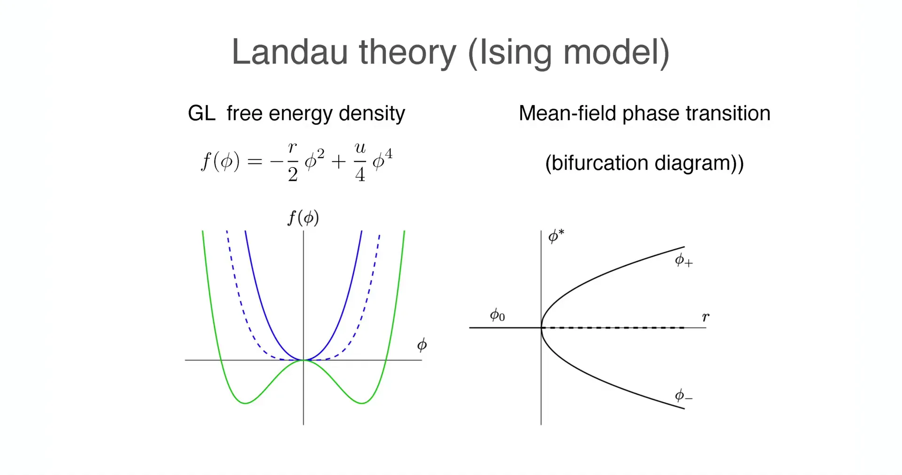
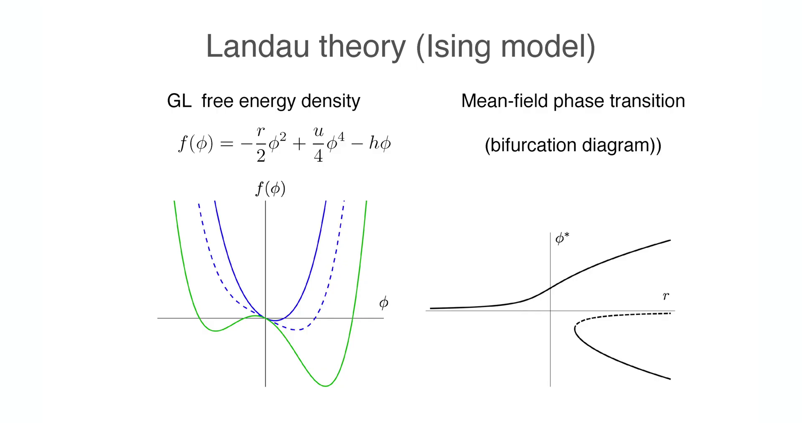
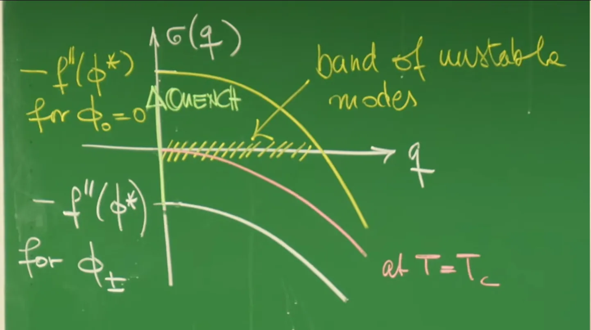

# Introduction - Paradigm Shift from Discrete Dynamical Systems to Continuous Field Theory

In previous lectures, the analytical perspective primarily focused on zero-dimensional or finite-dimensional dynamical systems. From the Ginzburg-Landau potential landscape in **Lecture 2**, to the RhoGTPase molecular switch cycle and Rock-Paper-Scissors ecological cycle in **Lecture 7**, a common characteristic of these models is the "well-mixed" assumption: focusing on the total number of a species or the overall concentration of a chemical substance, while ignoring their spatial distribution differences. The mathematical language for such systems is ordinary differential equations (ODEs), with the core concern being temporal evolution—whether the system tends toward a Fixed Point, enters a Limit Cycle oscillation, or falls into Chaos.

**Lecture 8** took the crucial step of introducing spatial dimensions by deriving the macroscopic diffusion equation from microscopic random walks, establishing the physical foundation for how matter is transported in space. However, diffusion alone is not enough. When we look at the broader physical world—from superconductor vortex lattices in condensed matter physics, to Rayleigh-Bénard convection patterns in fluid dynamics, to Turing patterns in biological development—spatial degrees of freedom are not only non-negligible but are the core of the phenomena. A "pattern" is essentially an ordered non-uniform distribution of physical quantities in space. To describe such Spatially Extended Systems, we must combine the nonlinear reaction dynamics from previous lectures with the spatial diffusion mechanism from **Lecture 8**, undertaking a profound paradigm shift: **transitioning from dynamical systems with finite degrees of freedom to Field Theory with infinite degrees of freedom**.

In this lecture, the system's state is no longer described by a set of discrete variables $\vec{X}(t)$, but introduces the concept of a **field** $\phi(\vec{x}, t)$. This scalar field $\phi$ can represent the local Magnetization in magnetic materials, the local compositional concentration in binary alloys, or the concentration of a morphogen in biological tissues. The core idea in physics for handling such complex systems is **Coarse-graining**. Rather than tracking the microscopic motion of every atom, electron, or molecule (which would lead to astronomical degrees of freedom on the order of $10^{23}$), we define effective variables at mesoscopic scales through averaging processes. The tremendous success of this methodology lies in its **Universality**: disparate microscopic systems—whether spin flips in ferromagnets or phase separation in binary liquids—often follow the same macroscopic dynamical equations near critical points.

This lecture explains how to construct **Ginzburg-Landau (GL) Theory** describing the dynamics of non-conserved scalar fields based on symmetry principles and thermodynamic laws, and derive the famous **Model A** (also known as the **Allen-Cahn Equation**). The analysis will delve into every mathematical detail of this model, from the construction of free energy functionals to the application of variational principles, from linear stability analysis to numerical simulation implementation. This theoretical framework not only explains the early dynamics of phase separation but also lays the mathematical and physical foundation for in-depth exploration of **Interface Dynamics** and **Curvature-Driven Flow** in the next lecture.


# 1. Cornerstones of Statistical Physics - The Ising Model and Landau Mean-Field Theory

To construct field theory models describing spatially extended systems, this lecture first reviews the most fundamental model in statistical physics—the Ising model—and uses it to introduce Landau mean-field theory. This theoretical framework is not only a key step in coarse-graining microscopic discrete degrees of freedom into macroscopic continuous fields, but also provides the thermodynamic potential foundation for understanding phase transitions and pattern formation in non-equilibrium dynamics.

## 1.1 Physical Picture of the Ising Model

The Ising model provides the simplest microscopic picture for describing phase transitions in magnetic systems. Consider a lattice system where each site $i$ has a discrete spin variable $s_i$, whose values are restricted to $+1$ (spin up) or $-1$ (spin down). There exists a ferromagnetic interaction between spins that tends to align adjacent spins in the same direction.

To transition from microscopic to macroscopic, we define the **Order Parameter** $\phi$ as the average value of spins within a local region. The statistical behavior of this macroscopic variable determines the thermodynamic phase of the system:

**High Temperature Phase**: Thermal fluctuations are violent, overcoming the interaction energy, causing spin orientations to become randomized. Macroscopically, the local average magnetization $\phi \approx 0$. The system is in a **Disordered Phase**, corresponding physically to Paramagnetism.

**Low Temperature Phase**: Ferromagnetic interaction energy dominates, suppressing thermal fluctuations, and the system undergoes **Spontaneous Symmetry Breaking**. Spins tend to collectively point up ($\phi > 0$) or collectively point down ($\phi < 0$). The system is in an **Ordered Phase**, corresponding physically to Ferromagnetism.

## 1.2 Construction Principles of Landau Free Energy Density

Lev Landau's phase transition theory proposed in 1937 states that near phase transition points, the order parameter $\phi$ has small numerical values, so the system's free energy density $f(\phi)$ can be expanded as a power series in $\phi$. The core basis for constructing this free energy functional is the system's **symmetry**.

For Ising-type systems, physical laws possess **$\mathbb{Z}_2$ symmetry** (i.e., up-down flip symmetry): the system energy should not depend on the positive or negative definition of "up" or "down." This means the free energy density must satisfy the even function property:

$$
f(\phi) = f(-\phi)
$$

Based on this symmetry constraint, the expansion can only contain even powers of $\phi$. The Landau free energy density form keeping terms up to fourth order is:

$$
f(\phi) = f_0 - \frac{r}{2}\phi^2 + \frac{u}{4}\phi^4
$$

where $f_0$ is the background free energy (usually set to 0). The signs and physical meanings of each coefficient are crucial, especially the sign convention for the quadratic term coefficient:




Landau free energy density $f(\phi)$ as a function of control parameter $r$. Dashed line indicates high temperature phase (single potential well), solid line indicates low temperature phase (double potential well).

**Quadratic term coefficient $r$ (control parameter):**

This parameter controls the phase transition process, depending linearly on temperature deviation: $r \propto (T_c - T)$ (note the sign difference). In Professor Erwin Frey's blackboard convention, the formula is written as **$-\frac{r}{2}\phi^2$**. To ensure correctness of the physical picture, we need to carefully analyze how the sign of $r$ affects the potential shape:

**High temperature phase ($T > T_c$)**: The system is in a disordered state, and $\phi=0$ must be the global minimum of the potential (stable point). For the function $ax^2$, we need $a>0$. Therefore, $-\frac{r}{2} > 0 \Rightarrow r < 0$. At this point the potential curve is a single-well parabola opening upward.

**Low temperature phase ($T < T_c$)**: The system is in an ordered state, and $\phi=0$ must become a local maximum (unstable point), allowing non-zero solutions to appear. Therefore, $-\frac{r}{2} < 0 \Rightarrow r > 0$. At this point the potential curve is convex upward at the origin, forming two symmetric minimum potential wells on both sides (Double-Well Potential).

**Quartic term coefficient $u$ (stability parameter):**

To ensure thermodynamic stability, the free energy must have a lower bound. When $|\phi| \to \infty$, the highest-order term $\phi^4$ dominates. Therefore **$u > 0$** must be required, ensuring the potential tends to positive infinity at infinity, preventing the system from "collapsing" to infinitely large order parameter states.

**External field term $h$ (symmetry breaking field):**

If an external magnetic field $h$ exists, the system's $\mathbb{Z}_2$ symmetry is explicitly broken, and a linear term $-h\phi$ must be added to the free energy:

$$
f(\phi) = -\frac{r}{2}\phi^2 + \frac{u}{4}\phi^4 - h\phi
$$

This term causes the free energy landscape to Tilt, making one potential well deeper than the other, thus favoring a specific magnetization direction.

## 1.3 Bifurcation Diagram and Critical Behavior

By solving the extremum condition $f'(\phi) = 0$, we can obtain the relationship between the steady-state value $\phi^*$ of the order parameter and the control parameter $r$. This mathematical structure is called a **Supercritical Pitchfork Bifurcation** in dynamical systems theory.



Bifurcation diagram of order parameter steady-state value $\phi^*$ as a function of control parameter $r$. When $r$ crosses zero, the system abruptly changes from monostable (disordered) to bistable (ordered).

The physical states and mathematical characteristics at each stage are summarized as follows:

| Control Parameter $r$ | Free Energy Shape $f(\phi)$ | Steady-State Solution $\phi^*$ (Extrema) | Physical State | Bifurcation Type |
| :--- | :--- | :--- | :--- | :--- |
| **$r < 0$** <br> (High T) | **Single Well** | $\phi^* = 0$ <br> (Unique stable, global min) | **Paramagnetic Phase** <br> (Disordered) | - |
| **$r = 0$** <br> (Critical point) | **Flat bottom quartic** | $\phi^* = 0$ <br> (Critically stable, second derivative = 0) | **Phase Transition Point** <br> (Critical slowing down) | - |
| **$r > 0$** <br> (Low T) | **Double Well** | $\phi^* = 0$ (Unstable, local max) <br> $\phi^* = \pm\sqrt{r/u}$ (Stable, global min) | **Ferromagnetic Phase** <br> (Ordered) | **Pitchfork Bifurcation** |

**Critical behavior analysis:**
When the control parameter $r$ gradually increases from negative values and crosses zero, the originally stable origin $\phi=0$ suddenly loses stability (destabilizes), and two new stable branches $\pm\sqrt{r/u}$ "bifurcate" on either side. The system must "choose" one of these two equivalent states—this is precisely the mathematical manifestation of **Spontaneous Symmetry Breaking**. This simple polynomial model not only successfully captures the essence of magnetic phase transitions but also universally describes a wide range of physical phenomena such as Euler column buckling instability and laser threshold generation.

# 2. The Cost of Spatial Non-uniformity - Ginzburg-Landau Free Energy Functional

Although the Landau mean-field theory discussed in the previous section successfully explains the basic characteristics of phase transitions, it is essentially a "zero-dimensional" theory. It assumes the order parameter $\phi$ is a uniformly distributed constant throughout the sample space, ignoring all spatial fluctuations. However, in real physical systems, spatial structure is ubiquitous: from violent thermal fluctuations near critical points, to Domain Walls in ferromagnets, to interfaces between coexisting gas and liquid phases. To describe these phenomena, the order parameter must be generalized to a function of spatial coordinates $\phi(\vec{x})$, i.e., introducing the concept of a **Field**.

Correspondingly, the system's total energy is no longer a simple single-variable function, but a **Functional** that depends on the field distribution configuration, denoted as $\mathcal{F}[\phi]$. This section will show how to construct the Ginzburg-Landau (GL) free energy functional describing spatially non-uniform systems based on symmetry principles and long-wavelength approximation.

## 2.1 Gradient Expansion Method

The core idea for constructing the functional is **Gradient Expansion**. Physically, it is assumed that at mesoscopic scales, the spatial variation of field $\phi(\vec{x})$ is slow relative to microscopic atomic scales (i.e., **Long-wavelength approximation**). Therefore, the total free energy can be written as the spatial integral of local free energy density plus gradient correction terms:

$$
\mathcal{F}[\phi] = \int d^d x \left[ f(\phi(\vec{x})) + f_{\text{grad}}(\nabla \phi, \nabla^2 \phi, \dots) \right]
$$

For the form of the gradient term $f_{\text{grad}}$, the following strict physical symmetry constraints must be satisfied:

**Rotational Invariance**: The free energy must be a scalar whose value should not depend on the choice of coordinate system. Therefore, gradient terms cannot contain isolated vectors (such as $\nabla \phi$), and can only be composed of scalar combinations, such as $(\nabla \phi)^2$, $(\nabla^2 \phi)^2$, or $(\nabla \phi \cdot \nabla \phi)$, etc.

**Spatial Parity Symmetry**: For isotropic systems, $\vec{x} \to -\vec{x}$ should not change the energy.

**Order Parameter Inversion Symmetry**: For Ising-type systems, physical laws remain unchanged under the $\phi \to -\phi$ transformation. This requires gradient terms to be even-order functions of $\phi$ and its derivatives. Terms like $\phi (\nabla \phi)$ typically convert to boundary terms or zero after volume integration, while $(\nabla \phi)^2$ remains unchanged when $\phi$ changes sign (because $(-1)^2=1$).


Under long-wavelength approximation, the higher the order of spatial derivatives, the higher the power of wavenumber $q$ in Fourier space. To describe the most important physical effects, usually only the **lowest-order non-zero derivative term** needs to be retained. According to the above analysis, this term is $(\nabla \phi)^2$.

## 2.2 Ginzburg-Landau (GL) Free Energy Functional

Combining the local potential energy term $f(\phi)$ (from Landau theory) with the lowest-order gradient term yields one of the most famous functionals in modern theoretical physics—the **Ginzburg-Landau Free Energy Functional**:

$$
\mathcal{F}[\phi(\vec{x})] = \int d^d x \left[ \underbrace{-\frac{r}{2}\phi^2 + \frac{u}{4}\phi^4}_{\text{Local potential } f(\phi)} + \underbrace{\frac{\kappa}{2}(\nabla \phi)^2}_{\text{Gradient energy (Elastic penalty)}} \right]
$$

The mathematical form of the Ginzburg-Landau free energy functional, showing the additive structure of local potential energy terms and gradient terms. This formula is not only the standard model for treating continuous phase transitions in statistical physics but also the mathematical foundation for the Higgs mechanism in particle physics and phenomenological theories of superconductivity.

## 2.3 Physical Interpretation of Stiffness Coefficient $\kappa$


The coefficient $\kappa$ in front of the gradient term is called **Rigidity**, **Stiffness**, or gradient coefficient in different physical contexts. It profoundly influences the system's spatial configuration:

**Smoothing Effect and Stability**:

Thermodynamic stability requires $\kappa > 0$.

If $\kappa > 0$, any spatial non-uniformity ($\nabla \phi \neq 0$) causes an increase in total energy. This is like a stretched rubber band—the system has a kind of "elasticity" that resists spatial changes and tends to make the field $\phi$ smooth and uniform. Therefore, this term is also called **Elastic Penalty**.

If $\kappa < 0$, the system would tend to produce infinitely violent spatial oscillations (high-frequency modes) to lower energy, causing the ground state to not exist (thermodynamic instability).

**Correlation Length**:

Two competing mechanisms exist in the system: local potential energy $f(\phi)$ tends to make $\phi$ settle at the potential well minimum (ordering), while gradient energy $\frac{\kappa}{2}(\nabla \phi)^2$ tends to smooth out spatial differences (homogenization). The competition between these two defines a characteristic length scale—the **Correlation Length $\xi$**.

This scale can be estimated through Dimensional Analysis:

Comparing the gradient term $\kappa (\phi/L)^2$ with the quadratic potential energy term $|r| \phi^2$, when the two are of comparable magnitude:

$$
\frac{\kappa}{L^2} \sim |r| \implies L \sim \sqrt{\frac{\kappa}{|r|}}
$$

Therefore, the correlation length is defined as:

$$
\xi = \sqrt{\frac{\kappa}{|r|}}
$$
    
This formula reveals the signature characteristic of second-order phase transitions: when the system approaches the critical point ($T \to T_c$), the control parameter $r \to 0$, causing the correlation length to diverge ($\xi \to \infty$). This means that near the phase transition point, fluctuations at one point in the system can "sense" and influence regions infinitely far away, leading to collective behavior at macroscopic scales.

# 3. Non-equilibrium Relaxational Dynamics - Derivation of Model A (Allen-Cahn Equation)

After establishing the Ginzburg-Landau free energy functional $\mathcal{F}[\phi]$ as the static energy landscape, the next step in theoretical construction is to introduce the time dimension and explore how the system evolves from a non-equilibrium initial state (e.g., after high-temperature quenching) to equilibrium. For a **Non-conserved scalar field**—where the spatial integral of order parameter $\phi$ is not conserved (e.g., magnetic moments can flip freely, or photon numbers are not conserved)—its dynamics follows the most natural physical intuition: the system always evolves along the steepest descent direction of the energy landscape. This process is called Relaxational Dynamics.

## 3.1 Phenomenological Dynamics Hypothesis - Steepest Descent Principle

To describe field evolution, the theory introduces the Onsager linear response hypothesis. This hypothesis states that the thermodynamic generalized force driving the order parameter $\phi(\vec{x}, t)$ to change with time is precisely the negative of the Functional Derivative of the free energy functional with respect to the field.

The corresponding dynamical equation can be written as:

$$
\frac{\partial \phi(\vec{x}, t)}{\partial t} = -\Lambda \frac{\delta \mathcal{F}[\phi]}{\delta \phi(\vec{x}, t)}
$$

Definition of the dynamical equation for non-conserved scalar fields, where $\Lambda$ is the Onsager kinetic coefficient.

**Onsager Coefficient $\Lambda$**: This is a phenomenological Kinetic Coefficient that sets the time scale of system relaxation. Although it is determined by microscopic physical mechanisms, in macroscopic field theory it is usually treated as a constant. To simplify mathematical expressions, subsequent derivations often set $\Lambda = 1$ (or absorb it into time units).

**Physical meaning of the negative sign**: Ensures energy dissipation. This guarantees that the evolution flow always points toward decreasing free energy, just as a ball on a gravitational potential surface always rolls toward the lowest point.

In the dynamic critical phenomena classification review by Hohenberg and Halperin, this model consisting only of dissipation and non-conserved order parameter is named **Model A**. In materials science (such as alloy phase separation) and mathematical physics, this equation is more commonly called the **Allen-Cahn Equation**.

## 3.2 Detailed Functional Calculus and Variational Derivation

To obtain an explicit partial differential equation (PDE), the functional derivative $\frac{\delta \mathcal{F}}{\delta \phi}$ must be calculated. This is a mathematical process involving variational calculus.

Recall the Ginzburg-Landau functional form $\mathcal{F} = \int d^d x \, \mathcal{L}(\phi, \nabla \phi)$, where the Lagrangian density is:
$$
\mathcal{L} = f(\phi) + \frac{\kappa}{2}(\nabla \phi)^2
$$

Consider a small variation $\delta \phi$ of field $\phi$, the variation $\delta \mathcal{F}$ of the functional is:

$$
\delta \mathcal{F} = \int d^d x \left[ \frac{\partial \mathcal{L}}{\partial \phi} \delta \phi + \frac{\partial \mathcal{L}}{\partial (\nabla \phi)} \cdot \delta (\nabla \phi) \right]
$$

**First term (local potential energy derivative)**:

$$
\frac{\partial \mathcal{L}}{\partial \phi} = \frac{d}{d\phi} \left( -\frac{r}{2}\phi^2 + \frac{u}{4}\phi^4 \right) = -r\phi + u\phi^3 = f'(\phi)
$$

**Second term (gradient term derivative and integration by parts)**:

The derivative of the gradient term with respect to $\nabla \phi$ is $\kappa \nabla \phi$. Since $\delta (\nabla \phi) = \nabla (\delta \phi)$, the second part in the integral is $\kappa \nabla \phi \cdot \nabla (\delta \phi)$. To extract the common factor $\delta \phi$, **Integration by Parts** must be performed on this term:

$$
\int d^d x \, (\kappa \nabla \phi) \cdot \nabla (\delta \phi) = \oint_{\partial V} (\kappa \nabla \phi \delta \phi) \cdot d\vec{S} - \int d^d x \, (\nabla \cdot (\kappa \nabla \phi)) \delta \phi
$$

Usually assuming the field is zero at infinity, or the system satisfies periodic boundary conditions, the **surface integral term (first term) vanishes**. The remaining volume integral term contributes $-\kappa \nabla^2 \phi$.

Combining the above two parts yields the final form of the functional derivative:

$$
\frac{\delta \mathcal{F}}{\delta \phi} = f'(\phi) - \kappa \nabla^2 \phi
$$

## 3.3 Physical Structure of the Allen-Cahn Equation

Substituting the variational result into the dynamical equation and setting $\Lambda=1$ yields the famous **Allen-Cahn Equation** (also called Model A):

$$
\frac{\partial \phi}{\partial t} = - \left( f'(\phi) - \kappa \nabla^2 \phi \right)
$$

After rearranging, the equation reveals a clear physical structure:

$$
\frac{\partial \phi}{\partial t} = \underbrace{\kappa \nabla^2 \phi}_{\text{Diffusion term}} - \underbrace{f'(\phi)}_{\text{Reaction term}}
$$

Or explicitly writing out the potential energy derivative:
$$
\frac{\partial \phi}{\partial t} = \kappa \nabla^2 \phi + (r\phi - u\phi^3)
$$

Structural decomposition of the Allen-Cahn equation: diffusion term (from gradient energy) and reaction term (from local potential energy).

This equation mathematically belongs to the classical **Reaction-Diffusion Equation**, revealing the competition between two core mechanisms in phase transition dynamics:


**Diffusion term ($\kappa \nabla^2 \phi$)**: Originates from gradient energy penalty. Similar to the heat conduction equation, it tends to smooth out spatial non-uniformities, making the field smooth. This corresponds to "elastic" restoring forces within the system.

**Reaction term ($-f'(\phi)$)**: Originates from the local double-well potential. It is a nonlinear source term that drives field $\phi$ away from the unstable maximum ($\phi=0$) and accelerates "rolling" toward stable minima ($\pm \phi_0$). This is a local "autocatalytic" mechanism that tends to enhance differences and form distinct ordered phases.

It is precisely this dynamic balance between the "smoothing" diffusion mechanism and the "differentiating" reaction mechanism that dominates complex pattern formation processes such as domain wall formation and coarsening.

## 3.4 H-Theorem and Lyapunov Functional Proof

Does this dynamical model guarantee that the system eventually reaches equilibrium? Is there a possibility of eternal oscillation? By introducing the concept of a Lyapunov functional, the system's stability can be rigorously proven.

Examine the total derivative of free energy $\mathcal{F}$ with respect to time:

$$
\frac{d\mathcal{F}}{dt} = \int d^d x \frac{\delta \mathcal{F}}{\delta \phi(\vec{x}, t)} \frac{\partial \phi(\vec{x}, t)}{\partial t}
$$

Substituting the equation of motion $\frac{\partial \phi}{\partial t} = -\Lambda \frac{\delta \mathcal{F}}{\delta \phi}$ into the above:

$$
\frac{d\mathcal{F}}{dt} = \int d^d x \frac{\delta \mathcal{F}}{\delta \phi} \left( -\Lambda \frac{\delta \mathcal{F}}{\delta \phi} \right) = -\Lambda \int d^d x \left( \frac{\delta \mathcal{F}}{\delta \phi} \right)^2
$$

Since the Onsager coefficient $\Lambda > 0$ and the integrand is the square of a real number (always non-negative), the time derivative of free energy must be non-positive:

$$
\frac{d\mathcal{F}}{dt} \leq 0
$$

Equality holds only when $\frac{\delta \mathcal{F}}{\delta \phi} = 0$, i.e., the system reaches an equilibrium state at a free energy extremum. This mathematical derivation (similar to Boltzmann's H-theorem) rigorously guarantees that Model A systems are **Gradient Flow** systems. Without external driving forces, the system has no limit cycles or chaotic attractors, and its ultimate fate is necessarily to rest at some local free energy minimum.

# 4. Linear Stability Analysis and Phase Transition Dynamics

After establishing the Allen-Cahn equation, a core question follows: if the system is in some uniform steady state (e.g., the disordered phase $\phi=0$ at high temperature), when external conditions suddenly change (e.g., temperature drops abruptly below the critical point, i.e., "Quench"), can this uniform state be maintained? Will small thermal fluctuations decay over time, or will they be amplified to destroy uniformity? To answer this question, this section employs **Linear Stability Analysis (LSA)**, examining the system's response to small perturbations to reveal the early dynamical mechanisms of phase transitions.

## 4.1 Perturbation Expansion and Linearized Equation

Assume the system is initially in a spatially uniform, time-independent steady state $\phi^*$. By definition, this steady state must satisfy $f'(\phi^*) = 0$ (i.e., an extremum of local potential energy). Now, superimpose a small spatiotemporal perturbation $\delta \phi(\vec{x}, t)$ on $\phi^*$:

$$
\phi(\vec{x}, t) = \phi^* + \delta \phi(\vec{x}, t)
$$


Basic setup of linear stability analysis: introducing small perturbation $\delta \phi$ near uniform steady state $\phi^*$.


Substitute this expression into the Allen-Cahn equation $\partial_t \phi = -f'(\phi) + \kappa \nabla^2 \phi$. For the reaction term $f'(\phi)$, perform Taylor expansion at $\phi^*$:
$$
f'(\phi^* + \delta \phi) \approx f'(\phi^*) + f''(\phi^*) \delta \phi + \mathcal{O}(\delta \phi^2)
$$
Since $\phi^*$ is a steady state, the first term $f'(\phi^*) = 0$. Ignoring higher-order terms $\mathcal{O}(\delta \phi^2)$, this step is **linearization**. The diffusion term is linear and acts directly on $\delta \phi$.

The resulting linearized evolution equation is:

$$
\frac{\partial \delta \phi(\vec{x}, t)}{\partial t} = -f''(\phi^*) \delta \phi(\vec{x}, t) + \kappa \nabla^2 \delta \phi(\vec{x}, t)
$$

## 4.2 Fourier Modes and Dispersion Relation

The above equation is a linear partial differential equation with constant coefficients. According to linear systems theory, its solution can be decomposed into a superposition of plane wave modes with different wave vectors $\vec{q}$. Introduce the Fourier transform:

$$
\delta \phi(\vec{x}, t) = \int \frac{d^d q}{(2\pi)^d} e^{-i \vec{q} \cdot \vec{x}} \delta \phi(\vec{q}, t)
$$

Decomposing spatial perturbation $\delta \phi(\vec{x}, t)$ into Fourier modes $\delta \phi(\vec{q}, t)$.

Substituting the Fourier integral into the linearized equation and using the property $\nabla^2 e^{-i\vec{q}\cdot\vec{x}} = -q^2 e^{-i\vec{q}\cdot\vec{x}}$, the partial differential equation can be transformed into independent ordinary differential equations for each mode $\vec{q}$:

$$
\frac{\partial \delta \phi(\vec{q}, t)}{\partial t} = \left[ -f''(\phi^*) - \kappa q^2 \right] \delta \phi(\vec{q}, t)
$$

The solution of this equation takes exponential form: $\delta \phi(\vec{q}, t) \sim e^{\sigma(q)t}$. Here $\sigma(q)$ is called the **Growth Rate**, and its variation with wavenumber $q$ is called the **Dispersion Relation**:

$$
\sigma(q) = -f''(\phi^*) - \kappa q^2
$$


Growth rate $\sigma(q)$ of perturbation modes, determined jointly by local potential energy curvature $-f''(\phi^*)$ and gradient penalty $-\kappa q^2$.

This formula clearly shows the competition between two physical mechanisms:

**Local reaction term $-f''(\phi^*)$**: Determines whether reaction dynamics suppresses or amplifies perturbations, depending on the curvature of the potential curve at that point.

**Diffusion term $-\kappa q^2$**: Always negative (since $\kappa > 0$), representing that diffusion always tends to suppress spatial non-uniformity, and the higher the wavenumber $q$ (shorter wavelength), the stronger the suppression.

## 4.3 Stability Criteria for Physical States

By analyzing the sign of growth rate $\sigma(q)$, the stability of different physical states can be rigorously determined.

### Case A: At potential well minima $\phi_{\pm} = \pm\sqrt{r/u}$ (Ordered phase)

When the system is at the equilibrium positions $\phi_{\pm}$ of the low-temperature ordered phase, the local potential energy is at a minimum, and its second derivative (curvature) is positive:
$$
f''(\phi_{\pm}) = -r + 3u(\pm\sqrt{r/u})^2 = -r + 3r = 2r > 0 \quad (\text{for } r>0)
$$
The dispersion relation at this point is:
$$
\sigma(q) = -2r - \kappa q^2
$$
Since $r>0$ and $\kappa>0$, for any wavenumber $q$, **$\sigma(q) < 0$**.

**Conclusion**: The ordered phase is **linearly stable**. This means any small thermal fluctuations of any wavelength will decay exponentially with time. The system has strong restoring forces and can spontaneously maintain a uniform ferromagnetic ordered state. This explains why the macroscopic state of magnets at low temperatures is stable.

### Case B: At the potential barrier top $\phi_0 = 0$ (Unstable point and quenching)

This is the most critical case in phase transition dynamics, corresponding to the instant when the system is suddenly cooled from high-temperature phase ($r<0$) to low-temperature phase ($r>0$), i.e., **Quench**. At this point, the system still temporarily remains at position $\phi=0$, but under the new low-temperature environment, this position has become a potential energy maximum (top of the potential barrier).

At this point the potential energy curvature is negative:
$$
f''(0) = -r < 0 \quad (\text{for } r>0)
$$
The dispersion relation becomes:
$$
\sigma(q) = r - \kappa q^2
$$



Under quench conditions ($\phi_0=0$), growth rate $\sigma(q)$ shows an inverted parabola shape. There exists a **band of unstable modes**, i.e., the region $0 \le q < q_c$, where these modes grow exponentially.

This dispersion relation reveals a rich physical picture:

**Long-wavelength Instability**:

When $\kappa q^2 < r$, i.e., for modes with wavenumber less than critical value $q_c = \sqrt{r/\kappa}$, growth rate $\sigma(q) > 0$. These long-wave modes (wavelength $\lambda > 2\pi\sqrt{\kappa/r}$) grow exponentially with time. This long-wavelength fluctuation amplification process driven by local potential energy instability is called **Spinodal Decomposition**.

**Short-wave Stability**:

When $q$ is sufficiently large ($q > q_c$), the diffusion term $-\kappa q^2$ dominates, making $\sigma(q) < 0$. This means extremely short-wavelength violent fluctuations are rapidly smoothed by diffusion, and the system will not form infinitely fragmented structures. This reflects the smoothing effect of surface tension (represented by $\kappa$) on interfaces.

**Fastest Growing Mode and Model A Characteristics**:

In Model A, growth rate $\sigma(q)$ reaches its maximum value $\sigma_{max} = r$ at **$q=0$**.

This means the system most tends to evolve with infinitely long wavelengths (i.e., overall uniformly). The system as a whole tends to "roll down" to either $\phi_+$ or $\phi_-$. This contrasts sharply with conserved field dynamics (**Model B / Cahn-Hilliard equation**): in Model B, due to conservation law constraints, $\sigma(q=0)$ must be 0, and the fastest growing mode appears at some finite $q_{max} \neq 0$, thus leading to characteristic length scale selection. In Model A, the actually observed domain wall formation involves nonlinear effects; linear stability analysis only describes the very initial instant of dynamics.


# 5. Code Practice - Computational Implementation of the Allen-Cahn Equation

To intuitively verify the preceding theory, especially the dynamical evolution after quenching from a high-temperature disordered state to a low-temperature ordered state, Professor Erwin Frey demonstrated numerical simulation results of the Allen-Cahn equation in class. This lecture will reproduce this simulation through Python code, "seeing" the entire process of phase separation and pattern formation through numerical experiments.


## 5.1 Numerical Algorithm - Finite Difference Method

We use **Explicit Euler** for time integration and **Central Difference** for handling the spatial Laplacian operator. Although this method is simple, the physical picture is clear, making it well-suited for demonstration purposes.

Assume a two-dimensional spatial grid spacing of $\Delta x$ and time step of $\Delta t$. The discrete value of field variable $\phi$ at grid point $(i, j)$ and time step $n$ is denoted as $\phi^n_{i,j}$.

The discrete form of the two-dimensional Laplacian operator is:
$$
\nabla^2 \phi \approx \frac{\phi_{i+1,j} + \phi_{i-1,j} + \phi_{i,j+1} + \phi_{i,j-1} - 4\phi_{i,j}}{(\Delta x)^2}
$$

Substituting into the Allen-Cahn equation yields the iterative update formula:
$$
\phi^{n+1}_{i,j} = \phi^n_{i,j} + \Delta t \left[ \kappa (\nabla^2 \phi)^n_{i,j} + (r\phi^n_{i,j} - u(\phi^n_{i,j})^3) \right]
$$

**Numerical Stability Warning (CFL Condition)**:
Explicit schemes are conditionally stable. To prevent the numerical solution from diverging (producing non-physical high-frequency oscillations), the time step must satisfy the Courant-Friedrichs-Lewy (CFL) condition:
$$
\Delta t \leq \frac{(\Delta x)^2}{4\kappa}
$$
If $\Delta t$ exceeds this threshold, the simulation will rapidly collapse.

## 5.2 Complete Python Code Implementation

The following code reproduces the physical scenario demonstrated in class: the system starts from small random thermal fluctuations near $\phi=0$ (high-temperature disordered state), and evolves into macroscopic ordered structures after quenching.

```python
import numpy as np
import matplotlib.pyplot as plt
import matplotlib.animation as animation
from matplotlib.colors import LinearSegmentedColormap

# Use dark background style to match lecture slides
plt.style.use('dark_background')

# ==========================================
# 1. Physics & Simulation Parameters
# ==========================================
# Spatial parameters
N = 128                 # Grid size (N x N)
L = 100.0               # Physical size of the system
dx = L / N              # Spatial resolution
x = np.linspace(0, L, N)
y = np.linspace(0, L, N)

# Time parameters
dt = 0.01               # Time step
total_steps = 4000      # Total simulation steps
plot_interval = 50      # Frame update interval

# Ginzburg-Landau Model Parameters
kappa = 1.0             # Stiffness / Diffusion coefficient
r = 1.0                 # Control parameter (r > 0 for double well potential)
u = 1.0                 # Nonlinear coefficient (Quartic term)

# Stability Check (CFL Condition)
stability_limit = dx**2 / (4 * kappa)
print(f"Stability Check: dt = {dt}, Max Stable dt = {stability_limit:.4f}")
if dt > stability_limit:
    print("Warning: dt exceeds stability limit! Simulation may diverge.")

# ==========================================
# 2. Initial Condition (Quench)
# ==========================================
# Simulate a quench from high T (phi ~ 0) to low T.
# Initial state is small random noise around 0.
np.random.seed(42)  # Fixed seed for reproducibility
noise_strength = 0.1
phi = noise_strength * (2 * np.random.rand(N, N) - 1)  # Uniform noise in [-0.1, 0.1]

# ==========================================
# 3. Numerical Solver Kernel
# ==========================================
def laplacian_pbc(f, dx):
    """
    Compute 2D discrete Laplacian with Periodic Boundary Conditions (PBC).
    Using np.roll for efficient neighbor indexing.
    """
    left  = np.roll(f, -1, axis=0)
    right = np.roll(f,  1, axis=0)
    up    = np.roll(f, -1, axis=1)
    down  = np.roll(f,  1, axis=1)
    
    return (left + right + up + down - 4 * f) / (dx**2)

def update_step(phi, dt, dx, kappa, r, u):
    """
    Execute one Forward Euler time step.
    Equation: dphi/dt = kappa * grad^2 phi + (r*phi - u*phi^3)
    """
    # Diffusion term (Elastic relaxation)
    lap = laplacian_pbc(phi, dx)
    
    # Reaction term (Local potential drive)
    # Derivative f'(phi) = -r*phi + u*phi^3 => Reaction = -f' = r*phi - u*phi^3
    reaction = r * phi - u * phi**3
    
    # Update field
    phi_new = phi + dt * (kappa * lap + reaction)
    return phi_new

# ==========================================
# 4. Visualization Setup
# ==========================================
# Custom Colormap: Replicating the lecture's visual style
# -1 (Spin Down) -> Blue
#  0 (Interface) -> Green/Yellowish (Transition region)
# +1 (Spin Up)   -> Red
colors = [(0, 0, 1), (0.0, 0.8, 0.0), (1, 0, 0)]  # Blue -> Green -> Red
n_bins = 100
cmap_name = 'spin_decomposition_map'
cm = LinearSegmentedColormap.from_list(cmap_name, colors, N=n_bins)

fig, ax = plt.subplots(figsize=(6, 6))
# Set vmin/vmax slightly > 1 to avoid color saturation at stable points
im = ax.imshow(phi, cmap=cm, vmin=-1.2, vmax=1.2, interpolation='bilinear', origin='lower')
ax.set_title(f"Model A Dynamics (Step 0)")
ax.axis('off')

# Text for time step display
time_text = ax.text(0.05, 0.95, '', transform=ax.transAxes, color='white', fontsize=12)

def animate(frame_idx):
    global phi
    # Perform multiple physics steps per animation frame for speed
    steps_per_frame = 20
    for _ in range(steps_per_frame):
        phi = update_step(phi, dt, dx, kappa, r, u)
    
    im.set_array(phi)
    current_step = frame_idx * steps_per_frame
    time_text.set_text(f'Step: {current_step}')
    ax.set_title(f"Model A Dynamics (Step {current_step})")
    return [im, time_text]

# Create animation object
ani = animation.FuncAnimation(fig, animate, frames=total_steps//20, interval=30, blit=False)

# Save the animation as a video file
print("Saving simulation as video...")
ani.save('model_a_dynamics.mp4', writer='ffmpeg', fps=30, dpi=150)
print("Video saved as 'model_a_dynamics.mp4'.")

print("Starting simulation visualization...")
plt.show()

```


<video controls width="100%">
  <source src="../cn/assets/images/model_a_dynamics.mp4" type="video/mp4">
  Your browser does not support the video tag.
</video>

This dynamic video shows the evolution of the numerical simulation. The entire region displays a uniform green background, corresponding to values of $\phi \approx 0$. This represents the **Disordered Phase** at high temperature, where the system has not yet undergone phase separation, and the order parameter has only small thermal fluctuations around zero. As the simulation progresses (as shown in subsequent animation), this uniform green region will rapidly decompose into red ($\phi \approx +1$) and blue ($\phi \approx -1$) patches representing the two ordered phases, with clear interfaces forming between them.

## 5.3 Simulation Results Analysis - Three Dynamical Stages

By running the code and observing the evolution process, three characteristic stages of phase separation dynamics can be clearly identified:


Time evolution sequence of Allen-Cahn equation numerical solution. Top left: initial random fluctuations; Top right: early patterns from Spinodal decomposition; Bottom left: interface formation and domain wall coarsening; Bottom right: late-stage merging of large-scale domains.

### 1. Early Stage: Spinodal Decomposition

**Phenomenon**: The initially uniform green background rapidly becomes "mottled." Small fluctuations are rapidly amplified, with field values $\phi$ locally differentiating toward $\pm \sqrt{r/u}$ (red/blue).

**Mechanism**: This stage is mainly driven by the reaction term $r\phi - u\phi^3$. Since $r>0$, the origin $\phi=0$ is unstable ($f''(0)<0$), causing long-wave modes ($q \approx 0$) to grow exponentially. The system establishes local order in an extremely short time, but overall still presents a fragmented labyrinthine structure.

### 2. Middle Stage: Domain Formation

**Phenomenon**: Field values rapidly saturate near $\pm 1$, with clear, sharp boundaries forming between red and blue regions. At these boundaries $\phi$ must pass through 0, thus appearing as green lines, i.e., **Interfaces** or domain walls.

**Characteristics**: At this point most of the system's energy is concentrated at these interfaces (high gradient energy density). Nonlinear terms limit infinite growth of $\phi$, stabilizing interface width at around the correlation length $\xi$.

### 3. Late Stage: Coarsening

**Phenomenon**: The labyrinthine pattern gradually becomes "coarser." Smaller domains (islands) shrink and disappear, larger domains engulf surrounding small domains, and curved interfaces gradually straighten.

**Mechanism**: Evolution in this stage is extremely slow, mainly driven by the diffusion term $\kappa \nabla^2 \phi$. Physically, this is **Surface Tension** at work—the system reduces total free energy by reducing total interface length. This directly presages the theme of the next section: **Curvature-Driven Flow**. The characteristic scale $L(t)$ follows power-law growth with time $L(t) \sim t^{1/2}$, which is the signature characteristic of non-conserved dynamics.

# Summary

This lecture marks the entry of this course series into cross-scale theoretical construction. Through Landau theory, the analysis ignored microscopic spin details, using only symmetry to capture the essence of phase transitions, achieving the leap from microscopic to macroscopic; introducing the relaxation hypothesis transformed thermodynamic functionals into Model A dynamical equations, successfully describing non-equilibrium time evolution, achieving the transition from static to dynamic; using linear stability analysis to explain the initiation of patterns (Spinodal decomposition), and demonstrating nonlinear coarsening and interface formation through numerical simulation, achieving the deepening from linear to nonlinear. Model A has now become a universal language for describing "ordering processes without conservation constraints" in nature.

In the late stage of numerical simulations, a significant geometric effect emerges: interfaces always try to "straighten" or "contract." This contains a profound physical mechanism—**Surface Tension and Energy Minimization**. The gradient term $\frac{\kappa}{2}(\nabla \phi)^2$ in the Ginzburg-Landau free energy essentially embodies surface tension. At interfaces, the sharp changes in order parameter $\phi$ form high energy density "walls," causing total free energy to be proportional to the total area (or total length in two dimensions) of interfaces. According to the relaxational dynamics principle $\frac{d\mathcal{F}}{dt} \le 0$, the system must continuously reduce total interface length to lower energy.

This geometric effect presages that Model A in the late stage degenerates to an interface dynamics equation, the **Allen-Cahn Law**: the normal velocity $V$ of an interface is proportional to its mean curvature $H$:

$$
V = -\mu \kappa H
$$

where the negative sign means the interface always moves opposite to the direction of the curvature center (i.e., toward the concave side). Convex regions are smoothed out, concave regions are filled in, and closed small rings shrink at an ever-accelerating rate until annihilation. This is precisely the microscopic geometric explanation for the "coarsening" phenomenon observed in simulations.

Currently, analysis of interface motion is mainly based on qualitative analogies (such as soap bubbles) or numerical observations. **The next lecture (Lecture 10)** will introduce a core technique of theoretical physics—**Singular Perturbation Theory**. Starting from the Allen-Cahn equation, through Multiscale Expansion, the course will rigorously derive the interface motion equation. This will prove that "curvature-driven flow" is not merely an intuitive analogy, but a rigorous mathematical conclusion of Model A in the sharp interface limit, thus closely connecting reaction-diffusion systems with differential geometry, and laying the foundation for understanding biological membrane dynamics and crystal growth.
